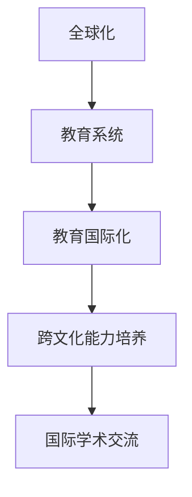
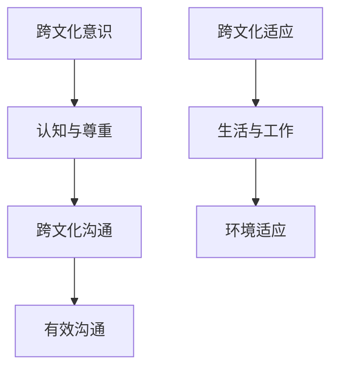
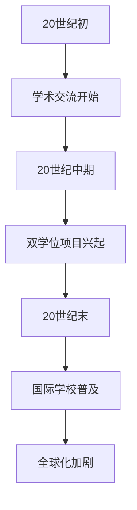
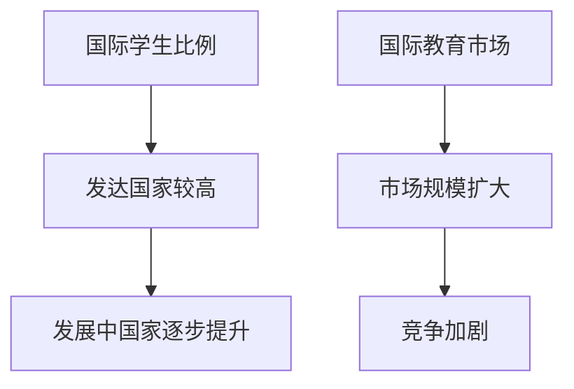
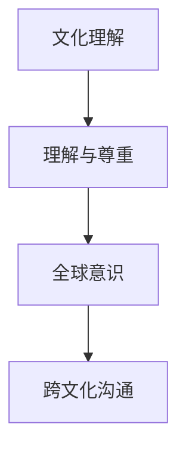
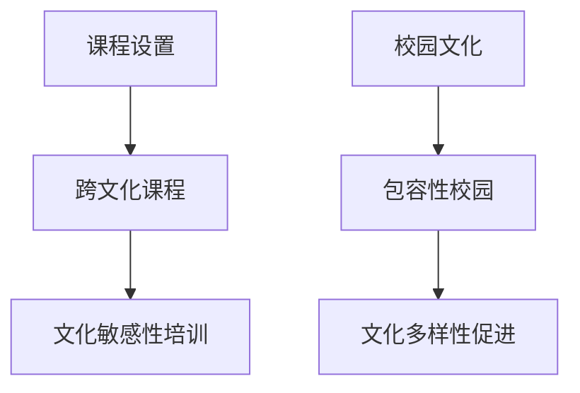
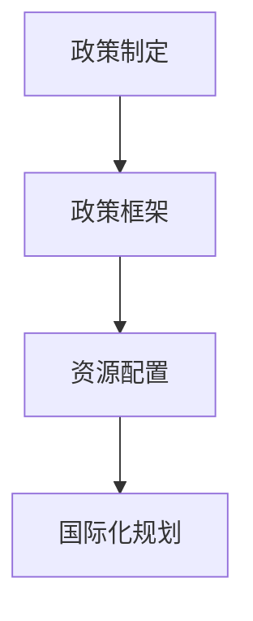

                 

### 第1章: 引言

#### 1.1.1 全球化背景下的教育国际化

在当今世界，全球化已成为不可逆转的趋势，深刻影响着经济、政治和文化等多个领域。教育作为社会发展的基石，同样在全球化背景下发生了显著的变化。**教育国际化**，作为全球化在教育领域的延伸，指的是教育体系超越国界，实现跨文化教育和国际学术交流。这一过程不仅仅局限于国际学生的流动，还包括教师、课程、教育资源等的跨国交流与融合。

**核心概念**：

- **全球化**：全球范围内的经济、政治、文化等方面的相互联系和相互依赖。全球化使不同国家和地区的文化、经济和政治更加紧密地联系在一起，推动了教育的国际化发展。
- **教育国际化**：教育体系超越国界，实现跨文化教育和国际学术交流。教育国际化有助于培养具有全球视野和国际竞争力的人才。

**联系架构**（Mermaid流程图）：



随着全球化的加深，各国之间的交流日益频繁，对具有跨文化能力和国际视野的人才需求不断增加。教育国际化不仅是应对全球化挑战的必然选择，也是提升国家竞争力的重要手段。跨文化能力培养成为教育国际化的核心目标之一，而国际学术交流则为学生和教师提供了广阔的平台，促进了知识的全球传播和共享。

#### 1.1.2 教育国际化的动因与影响

教育国际化的兴起并非偶然，而是由多种因素共同驱动的。经济、政治和文化等因素都在不同程度上影响着教育国际化的进程和发展。

**核心概念**：

- **经济因素**：跨国公司需求、全球人才流动。经济全球化使得跨国公司在全球范围内寻找资源和市场，这导致了对于具有国际化视野和跨文化能力的人才的需求。
- **政治因素**：国际合作、外交关系。国家间的政治合作和外交关系为教育国际化提供了政策和制度保障。
- **文化因素**：多元文化共生、文化理解与尊重。全球化带来了不同文化的碰撞和融合，多元文化共生成为现代社会的重要特征。

**动因与影响**（Mermaid流程图）：

```mermaid
graph TD
A[经济因素] --> B[跨国公司需求]
B --> C[全球人才流动]
D[政治因素] --> E[国际合作]
E --> F[外交关系]
G[文化因素] --> H[多元文化共生]
H --> I[J[文化理解与尊重]]
```

**经济因素**：跨国公司的全球扩张和对高素质人才的需求，推动了教育国际化。全球人才流动使得学生和教师有机会接触到不同的文化和教育体系，促进了跨文化交流和理解。

**政治因素**：国家间的政治合作和外交关系为教育国际化提供了支持和保障。许多国家通过签订双边或多边协议，促进了教育资源的共享和学术交流。

**文化因素**：全球化带来了不同文化的碰撞和融合，多元文化共生成为现代社会的重要特征。教育国际化不仅有助于培养跨文化意识，还有助于促进不同文化之间的理解和尊重。

总之，教育国际化是全球化背景下不可避免的趋势。它不仅有助于提升教育质量和人才培养水平，还有助于推动全球文化的多元共生和和谐发展。

#### 1.1.3 跨文化能力的培养

跨文化能力是指个体在面对不同文化背景时，能够有效沟通、适应和解决问题的能力。在全球化的背景下，跨文化能力的培养已成为教育国际化的重要组成部分。这一能力的培养涉及多个方面，包括跨文化意识、跨文化沟通和跨文化适应。

**核心概念**：

- **跨文化意识**：对其他文化的认知和尊重。跨文化意识是跨文化能力的基础，它要求个体具备开放的心态，愿意了解和尊重其他文化。
- **跨文化沟通**：有效沟通和解决文化差异。跨文化沟通要求个体在交流过程中能够理解并尊重不同文化的表达方式和沟通习惯。
- **跨文化适应**：在不同文化环境中生活和工作。跨文化适应能力使个体能够在不同的文化环境中顺利生活和开展工作。

**跨文化能力的培养**（Mermaid流程图）：



跨文化意识的培养：

跨文化意识是跨文化能力的基础，它要求个体具备开放的心态，愿意了解和尊重其他文化。教育机构可以通过开设跨文化课程、组织文化交流活动等方式，培养学生的跨文化意识。同时，教师应以身作则，通过自身的言行示范，引导学生树立正确的跨文化观念。

跨文化沟通的培养：

跨文化沟通要求个体在交流过程中能够理解并尊重不同文化的表达方式和沟通习惯。教育机构可以通过模拟跨文化沟通场景、开展跨文化沟通训练等方式，提高学生的跨文化沟通能力。此外，教师可以引导学生阅读跨文化沟通相关的书籍和文献，增强他们的跨文化沟通技巧。

跨文化适应的培养：

跨文化适应能力使个体能够在不同的文化环境中顺利生活和开展工作。教育机构可以通过组织国际交流项目、提供跨文化培训等方式，帮助学生提升跨文化适应能力。同时，教师应鼓励学生在日常生活中尝试不同的文化体验，培养他们的跨文化适应能力。

综上所述，跨文化能力的培养是一个系统的过程，需要教育机构、教师和学生共同努力。通过跨文化意识的培养、跨文化沟通能力的提升和跨文化适应能力的增强，学生可以更好地适应全球化的背景，成为具有国际竞争力的优秀人才。

### 第2章: 教育国际化的发展历程

#### 2.1.1 国际教育合作的历史回顾

国际教育合作的历史可以追溯到20世纪初。当时，随着全球化进程的逐渐展开，一些发达国家的教育机构开始意识到国际交流与合作的重要性。这一时期的国际教育合作主要体现在教师和学生的跨国流动，以及学术交流和学术合作方面。

**核心概念**：

- **国际学术交流**：教师和学生跨国流动。早期的国际学术交流主要是通过留学项目、学术会议和学术合作等方式进行的，这些方式为不同国家之间的学术交流提供了平台。
- **双学位项目**：国际院校之间的合作项目。双学位项目是国际教育合作的重要形式之一，它允许学生在两所不同的国际院校同时获得学位，这种合作模式促进了不同教育体系之间的融合和交流。

**发展历程**（Mermaid流程图）：



- **20世纪初**：国际学术交流开始。这一时期，国际学术交流主要集中在欧美发达国家之间，通过留学项目和学术会议等形式，促进了不同国家间的学术交流和合作。
- **20世纪中期**：双学位项目兴起。随着全球化的进一步发展，一些国际院校开始探索双学位项目，这一模式为学生在不同教育体系下获得学位提供了机会。
- **20世纪末**：国际学校普及。随着全球化的加剧，国际学校作为一种特殊的教育形式，在世界各地逐渐普及。国际学校不仅提供了国际化的教育环境，还促进了不同文化之间的交流和理解。
- **全球化加剧**：国际教育合作的深入发展。在全球化背景下，国际教育合作逐渐成为各国教育政策的重要组成部分，国际教育合作的形式和范围也日益多样化。

#### 2.1.2 教育国际化的现状

教育国际化的现状表明，全球范围内的教育交流和合作已经达到了前所未有的高度。各国高等教育机构之间的合作越来越密切，国际学生的比例也在逐步增加，同时，国际教育市场也呈现出快速增长的趋势。

**核心概念**：

- **国际学生比例**：各国高等教育中外国学生的比例。国际学生比例的升高反映了教育国际化的程度和影响力。
- **国际教育市场**：跨国教育服务的经济规模。国际教育市场的发展不仅促进了教育资源的跨国流动，也推动了全球经济的发展。

**现状分析**（Mermaid流程图）：



- **国际学生比例**：发达国家的国际学生比例普遍较高。例如，美国、英国和澳大利亚等国家，国际学生在高等教育中的比例已经达到相当高的水平。与此同时，发展中国家也逐渐认识到教育国际化的重要性，国际学生比例逐步提升。
- **国际教育市场**：国际教育市场的规模不断扩大。随着全球化的深入，跨国教育服务需求不断增加，国际教育市场呈现出快速增长的趋势。同时，各国政府和教育机构也在积极推动教育国际化的政策，以吸引更多的国际学生。

教育国际化的现状不仅反映了全球化对教育领域的影响，也展示了教育国际化所带来的机遇和挑战。通过加强国际教育合作，各国可以共同推动教育的发展，培养具有全球视野和国际竞争力的人才。

### 第3章: 教育国际化与跨文化能力的培养

#### 3.1.1 教育国际化的目标

教育国际化的目标是培养具有全球视野和国际竞争力的人才。这一目标不仅要求学生具备扎实的专业知识，还要求他们具备跨文化能力和国际视野。具体来说，教育国际化的目标包括以下几个方面：

**核心概念**：

- **文化理解**：对其他文化的深入理解和尊重。文化理解是跨文化能力的基础，它要求学生能够理解并尊重不同文化背景下的价值观、信仰和行为习惯。
- **全球意识**：培养学生的全球视野和跨文化沟通能力。全球意识是教育国际化的重要目标，它要求学生能够适应全球化的背景，具备跨文化沟通和合作的能力。
- **跨文化沟通**：有效沟通和解决文化差异。跨文化沟通能力是跨文化能力的重要组成部分，它要求学生能够在不同的文化环境中进行有效的沟通，并解决文化差异带来的问题。

**教育目标**（Mermaid流程图）：



**文化理解**：

文化理解是教育国际化的核心目标之一。通过教育国际化，学生可以深入了解不同文化的背景、价值观和行为习惯，从而培养出对其他文化的尊重和理解。文化理解不仅有助于学生更好地适应多元文化环境，还能促进不同文化之间的和谐与共生。

**全球意识**：

全球意识是教育国际化的重要目标。在全球化的背景下，学生需要具备全球视野和跨文化沟通能力，以适应不断变化的世界。通过教育国际化，学生可以接触到不同国家的文化和社会，培养出对全球问题的关注和解决能力。

**跨文化沟通**：

跨文化沟通能力是跨文化能力的重要组成部分。教育国际化为学生提供了跨文化沟通的实践机会，通过实际交流和合作，学生可以学会如何在不同文化背景下进行有效的沟通，并解决文化差异带来的问题。

总之，教育国际化的目标是通过跨文化能力的培养，培养具有全球视野和国际竞争力的人才。这一目标的实现不仅需要教育机构和教师的共同努力，还需要学生自身的积极参与和努力。通过教育国际化的推进，我们可以期待培养出更多具有国际竞争力的优秀人才，为全球社会的和谐与发展做出贡献。

#### 3.1.2 跨文化能力的培养策略

跨文化能力的培养是一个系统性的过程，涉及教育机构、教师和学生多个层面的共同努力。以下是一些有效的策略，旨在提升学生的跨文化能力：

**核心概念**：

- **课程设置**：跨文化课程设计和文化敏感性培训。课程设置是跨文化能力培养的基础，通过设计跨文化课程和提供文化敏感性培训，学生可以系统地学习不同文化的知识和技能。
- **校园文化**：营造包容性校园文化，促进文化多样性。校园文化是跨文化能力培养的重要环境，通过营造包容性的校园文化，学生可以在日常学习和生活中体验到不同文化的多样性。

**培养策略**（Mermaid流程图）：



**课程设置**：

课程设置是跨文化能力培养的关键环节。教育机构可以通过开设跨文化课程，如跨文化沟通、多元文化研究等，为学生提供系统性的跨文化知识。同时，可以引入国际化的教学资源，如国际课程、双语教学等，增强学生的跨文化学习能力。

**文化敏感性培训**：

文化敏感性培训旨在提高学生对不同文化的认知和敏感度。教育机构可以通过开展文化敏感性培训，如文化认知工作坊、文化体验活动等，帮助学生了解和尊重不同文化的行为习惯和价值观念。这种培训可以帮助学生在面对跨文化情境时，更加得体和有效地进行沟通和交流。

**校园文化**：

校园文化是跨文化能力培养的重要环境。教育机构可以通过营造包容性的校园文化，促进不同文化之间的交流与融合。例如，可以设立多元文化展示区，举办国际文化节等活动，让学生在校园中体验到不同文化的魅力。此外，教师应鼓励学生积极参与这些活动，培养他们的跨文化意识。

**文化多样性促进**：

文化多样性促进是跨文化能力培养的延伸。通过组织国际交流项目、邀请国际学者讲座、开展跨文化交流活动等，教育机构可以为学生提供更多了解和体验不同文化的机会。这些活动不仅有助于拓宽学生的视野，还能提高他们的跨文化适应能力。

总之，跨文化能力的培养需要多方面的策略和措施。通过课程设置、文化敏感性培训、校园文化和文化多样性促进等多方面的努力，教育机构可以有效地培养学生的跨文化能力，为他们在全球化背景下的未来发展奠定坚实基础。

### 第4章: 教育国际化的实施与挑战

#### 4.1.1 教育国际化实施的步骤

教育国际化是一个复杂的过程，需要从政策制定、资源配置和国际化规划等多个方面进行系统性实施。以下是一个典型的教育国际化实施步骤：

**核心概念**：

- **政策制定**：政府及教育机构的国际化政策。政策制定是教育国际化实施的基础，它为教育国际化提供了政策和制度保障。
- **资源配置**：资金、设施和师资的国际化配置。资源配置是教育国际化实施的保障，它确保了教育国际化所需的资源和支持。
- **国际化规划**：教育机构的国际化战略和规划。国际化规划是教育国际化实施的具体操作，它明确了教育国际化的目标和路径。

**实施步骤**（Mermaid流程图）：



**政策制定**：

政策制定是教育国际化实施的第一步。政府及教育机构需要制定明确的国际化政策，包括国际化目标、政策措施和责任分工等。这些政策为教育国际化提供了指导和保障，有助于确保教育国际化的顺利实施。

**资源配置**：

资源配置是教育国际化实施的关键。教育机构需要根据国际化政策的要求，合理配置资金、设施和师资等资源。例如，增加国际化课程和项目经费、建设国际化教学设施、引进国际师资等。这些资源的配置是教育国际化实施的基础，有助于提高教育质量和国际化水平。

**国际化规划**：

国际化规划是教育国际化实施的具体操作。教育机构需要根据政策制定和国际资源条件，制定详细的国际化规划，包括国际化课程设置、国际交流项目、师资培训等。国际化规划的制定和实施，有助于明确教育国际化的目标和路径，确保教育国际化的有序推进。

总之，教育国际化的实施需要政策制定、资源配置和国际化规划等多个方面的系统性和协调性。通过科学合理的实施步骤，教育机构可以有效地推进教育国际化，培养具有国际竞争力的人才。

#### 4.1.2 教育国际化面临的挑战

尽管教育国际化带来了许多机遇，但同时也面临着一系列挑战。这些挑战涉及政策、资源、文化等多个方面，需要教育机构和相关利益方共同努力才能克服。

**核心概念**：

- **文化冲突**：不同文化背景下的价值观和行为习惯差异。文化冲突是教育国际化过程中常见的问题，它可能导致误解、隔阂和冲突，影响教育国际化的效果。
- **师资不足**：国际师资队伍的建设和教育资源的分配。师资不足是教育国际化实施中的一个重要挑战，特别是在发展中国家，国际师资的数量和质量难以满足需求。
- **资金短缺**：教育国际化所需的资金投入。资金短缺是教育国际化面临的一个普遍问题，特别是对于发展中国家来说，资金不足可能影响教育国际化的深度和广度。

**挑战分析**：

**文化冲突**：

文化冲突是教育国际化过程中不可避免的问题。不同文化背景下的价值观、行为习惯和沟通方式存在差异，这些差异可能导致误解、隔阂和冲突。例如，在一些文化中，直接表达观点被视为尊重和礼貌，而在另一些文化中，含蓄表达则更为普遍。这种文化冲突不仅影响学生的学习效果，还可能影响教师的职业发展和国际学术交流。

**师资不足**：

国际师资队伍的建设是教育国际化的重要保障。然而，在全球范围内，国际师资的数量和质量均存在不足。特别是在发展中国家，国际师资的数量较少，且大多数国际师资集中在发达国家和地区。此外，国际师资的素质也参差不齐，一些国际师资可能缺乏足够的跨文化教学经验，难以满足教育国际化的需求。

**资金短缺**：

教育国际化需要大量的资金投入，包括国际化课程的开发、国际交流项目的组织、师资培训等。然而，许多国家和地区的教育预算有限，资金短缺成为教育国际化实施的一个普遍问题。特别是在发展中国家，资金不足可能影响教育国际化的深度和广度，甚至可能导致教育国际化的中断。

**应对策略**：

**文化冲突**：

应对文化冲突需要教育机构和教师共同努力。教育机构可以通过开展跨文化培训，提高教师的跨文化意识和教学技能。同时，教师应在教学中尊重学生的文化背景，采用多样化的教学方法和沟通方式，以减少文化冲突的影响。

**师资不足**：

为解决师资不足问题，教育机构可以采取多种策略。例如，通过国际招聘引进高质量的师资，提高本土教师的国际化水平和教学能力。此外，可以开展国际师资培训项目，提高师资的跨文化教学能力。

**资金短缺**：

为解决资金短缺问题，教育机构可以寻求政府、企业和社会组织的支持。通过多元化筹资渠道，如国际援助、教育合作项目和企业赞助等，增加教育国际化所需的资金投入。

总之，教育国际化面临文化冲突、师资不足和资金短缺等多重挑战。通过采取有效的应对策略，教育机构可以克服这些挑战，推动教育国际化的发展，培养具有国际竞争力的人才。

### 总结与展望

本文通过对全球化背景下的教育国际化和跨文化能力培养的深入分析，探讨了教育国际化的核心概念、发展历程、目标与策略，以及面临的挑战。首先，教育国际化是在全球化背景下不可避免的趋势，它不仅促进了国际学术交流和人才培养，还为各国文化的多元共生提供了平台。其次，跨文化能力培养是教育国际化的核心目标，通过提升学生的文化理解、沟通能力和适应能力，有助于他们在全球化背景下更好地发挥作用。

展望未来，教育国际化和跨文化能力的培养将面临新的机遇和挑战。随着全球化的加深，国际教育合作的范围和形式将不断扩展，更多国家和地区将积极参与其中。同时，新兴技术和在线教育的普及也将为教育国际化提供新的动力。然而，文化冲突、师资不足和资金短缺等挑战依然存在，需要各国教育机构、政府和社会共同努力来解决。

**最佳实践 tips**：

1. **课程设计**：在课程设计中融入跨文化内容，通过案例分析、文化体验等活动，培养学生的跨文化意识。
2. **师资培训**：重视师资的跨文化能力培训，提供多样化的培训机会，提高教师的国际化水平。
3. **国际化合作**：积极参与国际教育合作项目，共享教育资源，提升教育质量。
4. **政策支持**：政府应出台相关政策，支持教育国际化的发展，提供资金和政策保障。

**注意事项**：

1. **尊重文化差异**：在跨文化教育中，要尊重不同文化的差异，避免文化偏见和误解。
2. **合理资源配置**：在教育资源分配中，要考虑到国际教育的特殊需求，确保资源的合理利用。
3. **长期规划**：教育国际化是一个长期过程，需要制定明确的战略和规划，确保持续发展。

**拓展阅读**：

- 《跨文化能力培养与教育国际化》
- 《全球化背景下的教育变革》
- 《国际教育交流与合作实践》

通过本文的探讨，我们期待能够为教育国际化和跨文化能力的培养提供有益的启示和参考，推动教育领域的持续发展和创新。作者：AI天才研究院/AI Genius Institute & 禅与计算机程序设计艺术 /Zen And The Art of Computer Programming。

