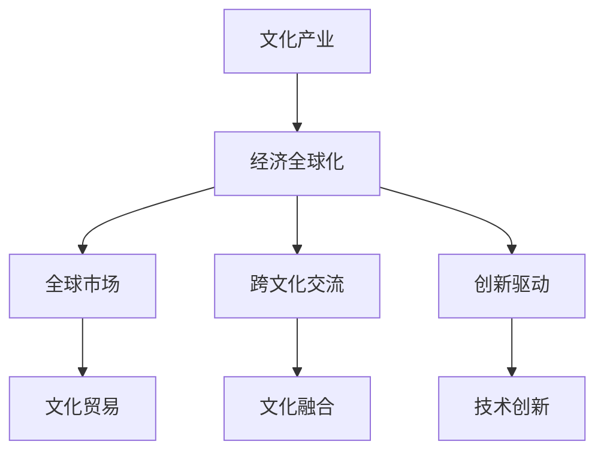

                 

### 1.1 全球化与文化产业的关系

全球化是一个不可逆转的历史进程，它不仅仅影响了经济、政治和社会的方方面面，也深刻地改变了文化产业的格局。全球化与文化产业之间的关系可以用一个Mermaid流程图来形象地展示：

在图中，文化产业（A）受到经济全球化（B）的直接影响，表现为全球市场的形成（C）和跨文化交流的增加（D）。同时，全球化也推动了创新驱动（E），这进一步促进了文化产业的创新和发展。全球市场的扩大和文化贸易（F）使得文化产品和服务能够在更广泛的范围内流通，而跨文化交流（D）则促进了不同文化之间的相互理解和融合（G）。此外，创新驱动（E）带来了技术创新（H），为文化产业提供了新的发展动力。

具体来说，全球化使得不同国家和地区之间的文化产品和服务可以更便捷地流通。例如，通过互联网和电子商务平台，全球用户可以轻松地访问来自世界各地的音乐、电影和文学作品。这不仅扩大了文化产业的消费市场，也为文化企业提供了新的商机。同时，全球化也促进了不同文化之间的交流和融合，使得文化多样性得以在更广泛的范围内传播和接受。

从另一个角度来看，全球化对文化产业的影响也带来了一些挑战。例如，文化贸易的全球化可能会导致一些国家和地区文化的本土性受到冲击，甚至出现文化同质化现象。此外，全球化也使得一些文化企业面临激烈的竞争，如何在保持本土特色的同时，适应全球市场的需求，成为文化企业需要面对的重要问题。

总的来说，全球化与文化产业之间的关系是复杂而多元的。它既是文化产业发展的重要机遇，也带来了新的挑战。通过深入理解和分析这种关系，我们可以更好地把握文化产业的未来发展趋势，推动文化产业的持续创新和发展。

### 1.2 文化产业的定义与分类

文化产业是指以文化为核心，通过创意、创新和科技手段实现文化产品和服务的生产和传播的产业。它涵盖了从创意产生、内容制作到市场推广和消费的整个产业链。文化产业的分类多种多样，根据不同的标准和维度，可以划分为多个子行业。

首先，从内容创作和表现形式的角度，文化产业可以大致分为影视、音乐、出版、设计、艺术、游戏等。每个子行业都有其独特的创作方式、市场需求和商业模式。

- **影视产业**：包括电影、电视剧、网络剧等，通过影像和声音传达故事和情感。
- **音乐产业**：包括音乐创作、录制、发行、演出等，音乐是文化表达的重要形式。
- **出版产业**：包括书籍、报纸、杂志、电子书等，文字是记录和传播知识的重要载体。
- **设计产业**：包括时尚设计、室内设计、工业设计、广告设计等，设计为生活带来美感和实用性。
- **艺术产业**：包括绘画、雕塑、摄影、装置艺术等，艺术是文化表达和审美体验的重要方式。
- **游戏产业**：包括电子游戏、桌游、VR游戏等，游戏是一种新兴的文化娱乐形式。

其次，从产业链的角度，文化产业可以进一步细分为上游内容创作、中游制作和下游市场推广。每个环节都有其独特的工作流程和商业模式。

- **上游内容创作**：包括创意构思、剧本创作、音乐创作、艺术设计等，是文化产品的源头。
- **中游制作**：包括拍摄、录制、出版、设计等，是文化产品的生产过程。
- **下游市场推广**：包括发行、演出、展览、营销等，是文化产品进入市场和消费者手中的关键环节。

此外，文化产业还可以根据其技术特点和商业模式进行分类。例如，数字文化产业是指利用互联网、大数据、人工智能等技术手段进行文化产品和服务的创作、传播和消费。数字文化产业具有高效、便捷、互动性强等特点，对传统文化产业产生了深远影响。

总之，文化产业的定义和分类是多维度、多元化的。通过深入理解和研究文化产业的各个子行业和环节，我们可以更好地把握其发展趋势，推动文化产业的创新和发展。

### 1.3 全球化对文化产业的影响

全球化对文化产业的影响是深远而复杂的，具体可以从多个方面进行详细分析。

首先，从经济增长的角度来看，全球化为文化产业带来了巨大的机遇。随着全球市场的开放和贸易的自由化，文化产品和服务的需求不断增加，这直接促进了文化产业的经济增长。例如，电影、音乐、出版、设计等文化产品在全球范围内都拥有庞大的市场，这些市场的扩展使得文化产业的规模不断扩大。根据数据显示，全球文化产业市场规模在近年来持续增长，成为各国经济的重要组成部分。

其次，全球化促进了跨文化交流和融合。不同国家和地区之间的文化交流不仅丰富了文化多样性，也促进了文化产业的创新和发展。例如，好莱坞电影通过在全球范围内的发行和传播，不仅赢得了巨大的票房收入，还推动了电影制作技术和艺术风格的发展。同样，中国的动漫产业通过与国际动漫公司的合作，不仅提高了自身的制作水平，还学会了如何在全球市场推广自己的作品。

然而，全球化对文化产业的影响并非全是积极的。它也带来了一些挑战。例如，全球化可能会导致文化同质化，即不同国家和地区的文化逐渐趋同，失去了各自的特色。这种现象可能会导致一些文化产品和服务的本土性受到冲击，甚至可能导致文化多样性的丧失。此外，全球化也可能导致文化保护主义的兴起，一些国家和地区可能会采取保护措施，限制外国文化产品的进口，以保护本国文化产业的利益。

从技术创新的角度来看，全球化对文化产业的影响也是显而易见的。随着互联网、大数据、人工智能等新技术的普及，文化产业的生产、传播和消费方式都发生了深刻的变化。例如，互联网使得文化产品可以更快捷地传播到全球各地，电子商务平台则为文化产品的销售提供了新的渠道。人工智能技术则被广泛应用于文化产业的各个环节，从内容创作、制作到市场推广，都带来了极大的便利和效率。

最后，全球化还推动了文化产业的国际化发展。越来越多的文化企业开始走出国门，参与国际市场竞争。这不仅提升了文化产业的国际影响力，也为文化企业提供了更广阔的发展空间。例如，中国的游戏产业近年来在国际市场上取得了显著的成绩，不仅赢得了大量海外用户，还推动了游戏制作技术的进步。

总的来说，全球化对文化产业的影响是多方面的。它既是机遇，也是挑战。通过深入理解和应对这些影响，文化产业可以更好地把握全球发展的趋势，实现可持续发展。

### 1.4 创意经济：文化产业的驱动力

创意经济是文化产业的重要驱动力，它不仅为文化产业的创新和发展提供了源源不断的动力，还推动了整个经济体系的转型升级。创意经济的核心在于创意和创新的结合，通过独特的创意思维和创新的科技手段，将文化资源转化为具有市场价值的文化产品和服务。

首先，从创意人才的角度来看，创意人才是创意经济的核心要素。他们具备独特的创意思维和创新能力，能够创造出具有市场潜力的文化产品。例如，好莱坞电影的成功离不开那些具有独特创意的电影导演和编剧，他们的作品不仅赢得了观众的喜爱，也为电影产业带来了巨大的经济效益。同样，音乐产业中的创意人才，如作曲家、音乐制作人，他们的作品也极大地推动了音乐产业的发展。

其次，技术创新在创意经济中发挥着至关重要的作用。随着互联网、大数据、人工智能等新技术的普及，创意经济的生产、传播和消费方式都发生了深刻的变化。例如，互联网使得文化产品可以更快捷地传播到全球各地，电子商务平台则为文化产品的销售提供了新的渠道。大数据技术可以帮助文化企业更好地了解市场需求，从而进行更精准的内容创作和推广。人工智能技术则被广泛应用于文化产业的各个环节，从内容创作、制作到市场推广，都带来了极大的便利和效率。

此外，跨文化交流与创意融合也是创意经济的重要特征。在全球化的背景下，不同国家和地区之间的文化交流和融合变得更加频繁和深入。这种跨文化交流不仅丰富了文化多样性，也激发了创意的灵感。例如，中国的动漫产业通过与国际动漫公司的合作，不仅学会了如何制作高品质的动画作品，还引入了国际化的营销策略，使得中国的动漫作品在全球范围内获得了广泛的认可。

从政策环境的角度来看，政府的支持和政策引导对创意经济的发展至关重要。许多国家通过制定相关政策和措施，为创意经济提供了良好的发展环境。例如，一些国家设立了创意产业基金，用于支持文化创意项目的研发和推广。此外，政府还通过税收优惠、人才引进等措施，鼓励文化企业和创意人才的创新和发展。

总的来说，创意经济是文化产业的重要驱动力，它通过创意人才的创新思维、技术创新的广泛应用、跨文化交流与融合以及政府的政策支持，推动了文化产业的持续创新和发展。随着全球化的不断深入，创意经济将在未来发挥越来越重要的作用，成为推动经济增长和社会进步的重要力量。

### 2.1 全球文化产业的规模与增长

全球文化产业的规模与增长是评估其国际影响力的关键指标。根据最新的统计数据，全球文化产业的总体市场规模已达到数万亿美元，并且呈现持续增长的态势。具体来说，全球电影市场的年收入超过1000亿美元，音乐产业的收入也达到数百亿美元，而数字游戏和电子出版等新兴文化产业的增长速度更是迅猛，年增长率常常超过20%。

从市场增长的角度来看，文化产业的增长主要受到以下几个因素的推动：

1. **技术进步**：互联网和数字技术的快速发展使得文化产品和服务的传播更加便捷和高效。例如，通过视频流媒体平台，用户可以随时随地观看全球各地的电影和电视剧。这种技术进步不仅扩大了文化市场的规模，还提升了消费者的消费体验，进一步刺激了文化消费的增长。

2. **全球化趋势**：全球化使得不同国家和地区之间的文化交流更加频繁，文化产品和服务在全球范围内的流通也更加便捷。这种全球化的趋势不仅促进了文化市场的融合，还使得一些具有国际影响力的文化产品能够在全球范围内获得巨大的市场份额。

3. **消费者需求**：随着人们生活水平的提高和消费观念的变化，消费者对文化产品和服务的需求也不断增加。特别是年轻一代，他们对文化产品和服务的消费更加多元化和个性化，这为文化产业的发展提供了广阔的空间。

4. **政策支持**：许多国家和地区政府都出台了支持文化产业发展的一系列政策，包括税收优惠、资金支持、知识产权保护等。这些政策为文化企业提供了良好的发展环境，激发了文化产业的创新和发展潜力。

尽管全球文化产业规模庞大且增长迅速，但市场也面临一些挑战。例如，文化贸易的保护主义抬头，一些国家采取限制进口的措施，以保护本国文化产业的利益。此外，全球化和数字化的快速发展也带来了一些文化同质化的问题，可能导致文化多样性的丧失。面对这些挑战，文化产业需要不断创新和适应，以保持其竞争力和活力。

总之，全球文化产业的规模与增长体现了其在全球经济中的重要地位。通过技术进步、全球化趋势、消费者需求和政策支持等多方面因素的共同推动，文化产业将继续保持强劲的增长势头，并为全球经济和社会发展作出更大的贡献。

### 2.2 全球文化市场的区域分布

全球文化市场的区域分布具有显著的差异，各地区在全球文化贸易中的地位和影响力各不相同。根据统计数据，北美和欧洲是文化市场的主要集中地，而亚洲和拉丁美洲等新兴市场则呈现出快速增长的态势。

首先，北美市场在全球文化市场中占据重要地位。美国作为全球最大的文化产品生产和出口国，其电影、音乐、电视节目和出版等领域的文化产品在全球范围内具有极高的知名度和影响力。例如，好莱坞电影和流媒体平台如Netflix、Disney+等在全球范围内拥有庞大的用户基础。同样，加拿大的电影和电视节目也在国际上享有盛誉。北美市场的强大影响力得益于其先进的技术、深厚的文化底蕴以及高度开放的文化贸易政策。

欧洲市场也是全球文化市场的重要一环。欧洲各国，如英国、法国、德国、意大利等，都在文化领域拥有悠久的历史和丰富的资源。这些国家的电影、音乐、文学和艺术作品在国际上具有极高的知名度和影响力。例如，法国的电影和文学在世界上享有盛誉，而德国的古典音乐和设计则在国际上具有重要地位。欧洲市场的多样性和高质量使其在全球文化贸易中具有独特的竞争力。

相比之下，亚洲和拉丁美洲等新兴市场正在迅速崛起。随着经济的快速发展和数字化进程的推进，这些地区的文化市场需求日益增加，文化产品出口也逐年增长。中国、印度、巴西等国家的电影、音乐和游戏产业在国际上取得了显著的成绩。例如，中国的电影市场已经成为全球最大的电影市场之一，而印度的宝莱坞电影也在国际市场上赢得了大量粉丝。此外，韩国的流行音乐和动画作品也在全球范围内具有很高的知名度。

具体来看，亚洲市场尤其是中国和印度的增长最为迅猛。中国作为全球最大的电影市场之一，其电影、电视剧和网络游戏在国际上具有广泛的传播力和影响力。印度则凭借其庞大的电影产业，尤其是宝莱坞电影，在全球市场上占据了重要地位。拉丁美洲市场则以其丰富的音乐资源和高质量的电影作品受到国际市场的关注。

总的来说，全球文化市场的区域分布反映了各地区在全球文化贸易中的不同地位和影响力。北美和欧洲市场仍然是全球文化市场的主导力量，而亚洲和拉丁美洲等新兴市场则展现出强劲的增长潜力。随着全球化的不断深入和各地区文化产业的持续发展，未来全球文化市场的格局将更加多元化。

### 2.3 文化贸易的趋势与挑战

文化贸易在全球经济中扮演着日益重要的角色，其发展趋势和面临的挑战也值得关注。首先，从总体趋势来看，文化贸易呈现出不断增长的态势。随着全球化的深入推进，文化产品和服务的市场需求不断增加，文化交流更加频繁，这使得文化贸易的规模不断扩大。特别是在电影、音乐、图书和游戏等领域，文化产品的国际贸易额持续攀升。

然而，文化贸易也面临一些显著挑战。首先，保护主义抬头成为文化贸易的重要障碍。一些国家出于保护本国文化产业的目的，采取限制进口和加强审查等措施。例如，美国对中国电影和音乐作品的进口限制，以及一些欧洲国家对外来电视节目的审查，都影响了文化产品的自由流通。

其次，文化同质化问题也逐渐凸显。全球化使得不同国家和地区之间的文化交流日益密切，但这也可能导致文化产品的同质化。例如，好莱坞电影和西方流行音乐在全球市场占据主导地位，使得其他国家和地区的文化产品在竞争中处于劣势。这种现象不仅削弱了文化多样性，也可能导致一些国家和地区的文化特色逐渐消失。

此外，技术进步带来的挑战也不容忽视。互联网和数字技术的发展为文化贸易提供了新的机遇，但同时也带来了一些问题。例如，数字盗版问题严重影响了文化企业的利益，一些国家的版权保护机制不够完善，使得盗版行为泛滥。此外，网络平台的兴起也改变了文化产品的传播方式，对传统文化贸易模式产生了冲击。

为了应对这些挑战，文化贸易需要采取一系列对策。首先，加强国际合作，通过多边贸易协定和双边文化交流协议，促进文化产品的自由流通。其次，各国政府应加强对文化产业的保护，完善版权保护机制，打击盗版行为。同时，鼓励文化企业创新，提升文化产品的多样性和质量，以增强国际竞争力。最后，推动文化多样性的保护，通过多元化的文化交流，促进不同文化之间的相互理解和尊重。

总的来说，文化贸易在全球化背景下具有巨大的发展潜力，但同时也面临诸多挑战。通过积极应对这些挑战，文化贸易可以实现可持续发展，为全球经济增长和文化多样性作出更大贡献。

### 2.4 文化创意产业的核心竞争力

文化创意产业的核心竞争力在于其独特的创新能力和市场定位。首先，创新能力是文化创意产业的核心驱动力。文化企业通过持续的创新，不仅能够提升自身产品的艺术性和科技含量，还能在激烈的市场竞争中脱颖而出。例如，好莱坞电影产业通过技术创新，如特效制作和虚拟现实技术，不断创造出引人入胜的电影作品，赢得了全球观众的喜爱。

其次，市场定位是文化创意产业成功的关键。文化企业必须准确把握市场需求，进行市场细分，从而找到目标消费者。例如，日本动漫产业通过精细的市场细分，创造出各种不同风格和主题的动漫作品，吸引了不同年龄层和文化背景的观众。此外，一些新兴的文化创意企业，如中国的网络文学和电子游戏产业，通过精准的市场定位和灵活的运营策略，迅速崛起并占领市场。

此外，文化创意产业还依赖于政策支持和创新环境。政府通过制定相关政策和提供资金支持，为文化创意产业提供了良好的发展环境。例如，一些国家设立了创意产业园区，为文化企业提供办公空间、技术支持和资金扶持。这些措施不仅促进了文化创意产业的创新和发展，也增强了其国际竞争力。

总之，文化创意产业的核心竞争力在于其创新能力、市场定位和政策支持。通过不断推动创新、精准市场定位和充分利用政策优势，文化创意产业能够在全球市场中占据一席之地，实现可持续发展。

### 3.1 创意人才与创意产业

创意人才是创意产业的核心驱动力，他们的创新能力、专业技能和创意思维对整个产业的发展起着至关重要的作用。首先，创意人才具备独特的创意思维，能够在文化创作中融入新颖的观点和独特的视角。例如，好莱坞的电影导演史蒂文·斯皮尔伯格，以其独特的创意和丰富的情感表达，创作出了众多经典电影，如《E.T.外星人》和《侏罗纪公园》，不仅赢得了全球观众的喜爱，也为电影产业带来了巨大的经济收益。

其次，创意人才的专业技能是其成功的关键。无论是电影制作、音乐创作还是艺术设计，专业知识和技能都是不可或缺的。以音乐人周杰伦为例，他不仅在音乐创作上展现了出色的才华，还精通多种乐器和音乐制作技术，这使得他的音乐作品具有独特的风格和高度的艺术性。

创意思维和技能的发挥离不开创新环境。创意人才需要一个开放、自由和充满创造力的工作环境，以激发他们的创造力和创新能力。例如，硅谷作为全球知名的科技和创新中心，拥有丰富的创新资源和自由的思想氛围，吸引了大量的创意人才，推动了科技和创意产业的快速发展。

此外，政策支持和人才培养也是创意产业发展的重要保障。许多国家和地区通过设立创意产业园区、提供资金支持和优化知识产权保护等政策，为创意人才提供了良好的发展环境。例如，韩国的松岛创意文化园区，通过提供优惠政策和完善的配套设施，吸引了大量创意人才，推动了韩国文化产业的快速发展。

总之，创意人才与创意产业的紧密联系，不仅体现在他们的创新能力和专业技能上，还体现在他们对创新环境的依赖和政策支持的重要性。通过培养和吸引优秀的创意人才，创意产业能够在全球市场中保持竞争优势，推动文化产业的创新和发展。

### 3.2 技术创新在创意经济中的应用

技术创新在创意经济中的应用不仅提升了文化产品和服务的生产效率，还极大地丰富了文化消费的体验。首先，互联网技术的发展使得文化产品的传播变得更加便捷和广泛。例如，视频流媒体平台如Netflix、YouTube和TikTok，通过互联网将丰富的文化内容实时传递给全球用户，打破了地域和时间的限制。用户可以随时随地访问和观看各种电影、电视剧、短片和直播，这大大提升了文化产品的消费便利性。

其次，人工智能（AI）技术的应用在创意经济中起到了至关重要的作用。AI技术可以用于内容创作、编辑和推荐，从而提高生产效率和用户体验。例如，AI算法可以通过分析用户的历史行为和偏好，推荐个性化的内容，使文化产品更加贴合用户的兴趣。此外，AI在电影制作中的特效合成、语音合成和文本生成等领域也展现出了强大的应用潜力。例如，好莱坞电影中的特效制作越来越多地依赖于AI技术，使得电影画面更加逼真、震撼，吸引了全球观众的关注。

大数据技术在创意经济中的应用同样不可忽视。通过收集和分析大量的用户数据，文化企业可以更好地了解市场需求和用户行为，从而进行更精准的内容创作和市场推广。例如，音乐产业中的流媒体平台通过大数据分析，可以准确了解不同音乐风格和歌手在特定地区和年龄段的受欢迎程度，从而制定更有效的市场推广策略。此外，大数据技术还可以用于文化产品的销售预测和供应链管理，提高企业的运营效率。

虚拟现实（VR）和增强现实（AR）技术则为文化消费提供了全新的体验。通过VR技术，用户可以沉浸在虚拟的世界中，体验沉浸式的游戏、旅游和电影。而AR技术则将虚拟元素叠加在现实世界中，为用户带来更加互动和富有创意的体验。例如，博物馆和艺术展览通过AR技术，为观众提供了丰富的互动内容和背景信息，增强了展览的趣味性和教育性。

总之，技术创新在创意经济中的应用不仅提升了文化产品和服务的生产效率，还丰富了用户的消费体验。随着新技术的不断进步，创意经济将在未来展现出更加广阔的发展前景。

### 3.3 跨文化交流与创意融合

跨文化交流与创意融合是文化创意产业发展的重要趋势，它不仅丰富了文化多样性，也推动了创意经济的创新和发展。首先，跨文化交流使得不同文化之间能够相互借鉴和融合，创造出具有独特魅力的文化产品。例如，好莱坞电影通过融合不同国家和地区的文化元素，制作出了深受全球观众喜爱的作品。同样，日本动漫也通过引入欧美文化和亚洲其他地区的元素，创造出了独具特色的动漫作品，如《龙珠》和《海贼王》。

创意融合不仅体现在电影和动漫等传统文化领域，还广泛应用于音乐、文学和艺术等领域。音乐产业中，跨文化交流和创意融合的表现尤为突出。例如，西方流行音乐与东方音乐的结合，创造出了一种新的音乐风格，如亚洲流行音乐（K-pop）和世界音乐。在文学领域，跨文化交流也促进了不同文化之间的相互理解和欣赏，如全球范围内的诺贝尔文学奖得主作品，不仅赢得了国际读者的喜爱，也促进了全球文学的多样性。

此外，互联网和数字技术的发展为跨文化交流和创意融合提供了新的平台和机会。例如，社交媒体平台如Facebook、Twitter和Instagram，使得不同国家和地区的用户可以轻松地分享和交流文化内容。在线教育平台和虚拟博物馆等数字资源，则为全球用户提供了跨文化交流的丰富素材和便利条件。

跨文化交流和创意融合不仅促进了文化多样性的发展，还为创意经济带来了新的商机。通过跨国合作和联合创作，文化企业能够接触到更广泛的市场和消费者，从而实现更高效的市场推广和收益。例如，韩国的K-pop组合通过全球巡演和数字音乐平台，吸引了大量国际粉丝，实现了全球范围内的商业成功。

总的来说，跨文化交流与创意融合是文化创意产业未来发展的重要方向。通过不断推动跨文化交流和创意融合，我们可以期待看到更多具有国际影响力的文化产品，推动创意经济的持续创新和发展。

### 3.4 创意经济的政策环境

创意经济的政策环境是推动其发展的重要保障，各国政府通过一系列政策支持和措施，为创意经济的繁荣创造了良好的条件。首先，许多国家设立了专门的创意产业基金，用于支持文化创意项目的研发和推广。这些基金通常由政府和企业共同出资，旨在降低文化企业的融资难度，激发创新活力。例如，英国的创意产业基金（Creative Industries Fund）就为文化创意项目提供了大量的资金支持。

其次，税收优惠是鼓励创意经济发展的重要手段。许多国家和地区为文化企业提供了税收减免、税收抵免等优惠政策，以减轻企业的税收负担，提高文化企业的盈利能力。例如，美国的一些州对电影制作企业提供税收抵免政策，鼓励电影产业在当地拍摄和制作。同样，法国对电影制作和音乐制作等文化企业也提供了税收优惠。

人才培养和引进政策也是创意经济政策环境的重要组成部分。为了吸引和培养优秀的创意人才，各国政府通过提供奖学金、设立创意产业学院和举办创意竞赛等方式，为文化产业的持续创新提供了人才保障。例如，英国政府设立了创意产业奖学金项目，为有潜力的年轻创意人才提供资金支持，鼓励他们投身文化创意行业。此外，一些国家还通过人才引进计划，吸引国际上的优秀创意人才，以提升本国文化产业的竞争力。

知识产权保护政策也是创意经济政策环境的关键环节。完善的知识产权保护机制可以保障文化企业的创新成果得到法律保护，防止盗版和侵权行为，从而维护企业的合法权益。例如，欧盟的版权改革法案（Copyright Reform）加强了对在线内容版权的保护，为文化企业提供了更有力的法律支持。

总的来说，创意经济的政策环境通过资金支持、税收优惠、人才培养和知识产权保护等多方面的措施，为文化创意产业的繁荣和发展提供了有力保障。这些政策的实施不仅促进了创意经济的快速增长，也为全球文化产业的创新和多样性作出了积极贡献。

### 4.1 创意产业的经济贡献

创意产业在经济中的贡献不可忽视，它不仅为全球经济带来了显著的收益，还促进了就业和产业升级。首先，从经济收益的角度来看，创意产业已经成为一些国家经济增长的重要驱动力。例如，美国的创意产业年产值超过3000亿美元，占其国内生产总值的约4%。同样，英国的创意产业也占据了国内生产总值的约8%，成为其经济增长的重要支柱。这些数据表明，创意产业在全球经济中占据了重要地位。

其次，创意产业在促进就业方面也发挥了重要作用。创意产业涵盖了多个领域，包括影视、音乐、设计、艺术和游戏等，这些行业创造了大量就业机会。例如，好莱坞电影产业不仅为电影制作人员提供了就业机会，还带动了相关的旅游业、餐饮业和服务业的发展。同样，数字游戏产业也因其快速发展的特点，为全球范围内的大批年轻人提供了就业机会。

创意产业对产业升级的贡献同样显著。通过技术创新和文化创意的结合，创意产业推动了传统产业的升级和转型。例如，一些传统制造业企业通过引入创意设计元素，提高了产品的附加值和市场竞争力。此外，创意产业还促进了服务业的多元化发展，如创意办公、文化创意旅游等新兴产业的出现，为经济增长注入了新的活力。

总之，创意产业在经济中的贡献体现在多个方面：显著的经济收益、广泛的就业机会和推动产业升级。通过不断创新和多元化发展，创意产业将继续为全球经济作出更大的贡献。

### 4.2 创意产业的就业效应

创意产业在就业方面具有显著的效应，它不仅提供了多样化的职业机会，还推动了相关行业的就业增长。首先，从职业机会的角度来看，创意产业涵盖了众多领域，包括影视、音乐、设计、艺术和游戏等，每个领域都有其独特的职业角色和岗位需求。例如，电影产业中需要编剧、导演、摄影师、特效师、剪辑师等角色；音乐产业中则需要作曲家、音乐制作人、歌手、音乐编辑等；设计产业中包括平面设计师、室内设计师、工业设计师等；艺术产业中则有画家、雕塑家、摄影师等；游戏产业则需要游戏设计师、程序员、测试员等。

其次，创意产业促进了相关行业的就业增长。随着创意产业的发展，与其相关的行业如旅游业、餐饮业、教育业等也得到了快速发展，为更多人提供了就业机会。例如，随着电影产业的发展，旅游业也随之兴旺，大量的旅游相关职位如导游、酒店服务员、景点工作人员等应运而生。同样，音乐产业的繁荣也带动了相关旅游活动的增加，如音乐节、演唱会等，吸引了大量游客和工作人员。

此外，创意产业还通过创业机会促进了就业。许多创意人才选择自主创业，成立自己的文化公司或工作室，这不仅为个人创造了就业机会，也为其他创意人才提供了更多的发展平台。例如，一些优秀的编剧、导演、音乐人等，通过创业开设了自己的影视制作公司或音乐工作室，不仅实现了自身的职业发展，还为社会创造了更多的就业机会。

总的来说，创意产业在就业方面的效应体现在职业机会的多样性和相关行业的就业增长上。通过不断推动创意产业的发展，我们可以期待看到更多的职业机会和就业机会，为社会经济注入新的活力。

### 4.3 创意产业的产业链分析

创意产业的产业链复杂且多元，涵盖了从创意产生到最终产品和服务消费的各个环节。首先，上游环节包括创意构思、内容创作和初步设计，这是整个产业链的源头。在这个阶段，创意人才通过独特的创意思维和丰富的专业知识，创作出具有市场潜力的文化产品。例如，电影产业的编剧和导演通过编写剧本和构思故事情节，设计出引人入胜的电影作品。

其次，中游环节涉及内容制作和产品开发，这是创意产业的核心部分。在这个阶段，文化产品经过专业团队的精心制作，形成完整的文化产品。例如，在电影制作过程中，导演、编剧、摄影师、剪辑师和特效师等专业人士密切合作，通过拍摄、剪辑和特效制作，最终完成电影作品。同样，音乐产业中的歌曲创作、录制和后期制作等环节，也需要多个专业人士的协同合作。

下游环节包括市场推广和消费，这是文化产品实现价值的重要阶段。在这个阶段，文化企业通过各种营销手段和渠道，将文化产品推广到市场，吸引消费者。例如，电影通过上映、宣传和流媒体平台推广，音乐通过演出、音乐平台和数字专辑销售等方式推广。此外，创意产业中的文化产品不仅可以在本地市场销售，还可以通过出口和跨文化交流，在全球范围内实现销售。

在整个产业链中，各个环节之间相互依赖和相互作用。上游的创意构思和内容创作需要中游的内容制作和产品开发的支撑，而下游的市场推广和消费又反作用于上游的创意构思，形成一个闭环。例如，市场对文化产品的反馈可以启发新的创意构思，推动整个产业链的不断迭代和创新。

此外，创意产业链中的不同环节也促进了相关行业的发展。例如，电影产业的制作需要大量的摄影器材和后期制作设备，这带动了相关设备制造业的发展。同样，音乐产业中的演出和音乐会活动，也为旅游业、餐饮业等相关行业创造了就业机会和经济增长点。

总的来说，创意产业的产业链是一个复杂而动态的生态系统，各个环节之间相互关联和协同发展。通过深入理解和优化产业链的各个环节，我们可以更好地推动创意产业的创新和发展，实现产业链的协同效应。

### 4.4 创意经济的区域发展策略

创意经济的区域发展策略是实现文化产业可持续发展的重要手段。首先，建立创意产业园区是许多国家和地区推动创意经济发展的有效途径。创意产业园区为文化企业提供了良好的发展环境，包括办公空间、技术支持和政策优惠。例如，伦敦的创意产业园区“伦敦创意区”，通过提供全方位的支持和服务，吸引了大量文化企业和创意人才，成为全球创意产业的重要中心。

其次，政策支持是推动创意经济区域发展的关键因素。政府可以通过制定税收优惠、资金扶持和知识产权保护等政策，鼓励文化企业和创意人才的创新和发展。例如，法国政府通过设立创意产业基金，为文化企业提供了大量的资金支持，促进了法国文化产业的繁荣。

人才培养和引进也是区域发展策略的重要组成部分。通过设立创意产业学院、举办创意比赛和提供奖学金等，可以培养和吸引优秀的创意人才。例如，韩国政府通过设立“创意人才计划”，为有潜力的年轻创意人才提供全方位的支持，推动了韩国创意经济的快速发展。

最后，跨国合作与交流是提升区域创意经济竞争力的重要途径。通过与其他国家和地区的文化企业和创意人才开展合作与交流，可以引进先进的技术和理念，促进创意融合和创新。例如，中国与欧洲的一些国家通过举办文化交流活动和创意产业合作项目，提升了各自的文化产业竞争力。

总的来说，建立创意产业园区、政策支持、人才培养和跨国合作是推动创意经济区域发展的有效策略。通过这些策略的实施，可以推动文化产业的创新和发展，实现区域经济的可持续发展。

### 5.1 案例一：电影产业

电影产业作为全球文化产业的支柱之一，其发展历程和成功案例值得深入探讨。首先，以好莱坞为例，好莱坞电影产业不仅是美国文化输出的重要代表，也是全球电影产业的领导者。其成功因素主要包括以下几个方面：

1. **技术创新**：好莱坞电影产业一直以来都非常注重技术创新，通过引入先进的拍摄技术和特效制作手段，打造出极具视觉冲击力的电影作品。例如，《阿凡达》采用了革命性的3D技术和虚拟现实特效，成为全球票房的佼佼者。

2. **市场定位**：好莱坞电影在制作过程中，非常注重市场定位，针对不同文化背景和消费习惯的观众，制作出多样化的电影作品。例如，迪士尼动画电影《冰雪奇缘》针对全球儿童观众，创造出了风靡全球的动画形象。

3. **品牌塑造**：好莱坞电影产业通过长期的品牌塑造和宣传，建立了强大的品牌影响力。例如，迪士尼品牌通过一系列经典电影和主题公园，已经成为全球知名的娱乐品牌。

4. **全球化策略**：好莱坞电影产业通过在全球范围内发行和推广电影，实现了全球市场的覆盖。例如，通过流媒体平台和跨国电影院线，好莱坞电影能够迅速进入全球市场，吸引不同国家和地区的观众。

另一个值得关注的案例是中国的电影产业。近年来，中国电影产业迅速崛起，不仅在国内市场占据主导地位，还通过国际化策略在全球市场上取得了显著的成绩。成功原因主要包括：

1. **政策支持**：中国政府通过一系列政策支持，如税收优惠和资金扶持，促进了电影产业的发展。例如，《战狼2》凭借政策的支持，在国内外市场取得了巨大成功。

2. **文化自信**：中国电影产业注重展现本国文化和历史，通过讲述中国故事，赢得了国内外观众的喜爱。例如，电影《哪吒之魔童降世》以中国传统文化为基础，创造出了全球知名的动画形象。

3. **技术创新**：中国电影产业也在不断引进和应用新技术，提升电影制作水平和视觉效果。例如，《流浪地球》通过引入先进的特效技术和科学理念，打造出了一部具有国际水准的电影。

4. **市场拓展**：中国电影产业通过加强与国际电影市场的合作，不断拓展海外市场。例如，通过在海外举办电影节和电影展映活动，中国电影产业成功进入了多个国际市场。

总之，电影产业作为创意经济的重要组成部分，通过技术创新、市场定位、品牌塑造和全球化策略，取得了显著的成功。无论是好莱坞电影产业还是中国电影产业，都为我们提供了宝贵的经验和启示，值得深入研究和借鉴。

### 5.2 案例二：音乐产业

音乐产业是创意经济中的重要组成部分，其全球化和数字化的发展趋势尤为显著。以下将探讨两个成功的音乐产业案例，分析其成功因素和经验。

首先，以流媒体平台Spotify为例。Spotify作为全球领先的音乐流媒体服务提供商，其成功离不开以下几个关键因素：

1. **技术创新**：Spotify通过大数据和人工智能技术，提供了个性化的音乐推荐服务，使用户能够根据自己的喜好和音乐历史找到最符合口味的音乐。这种个性化的推荐不仅提高了用户体验，也增加了用户粘性。

2. **全球化策略**：Spotify在全球范围内进行了广泛的布局，与各大唱片公司和音乐制作人建立了合作关系，使得其音乐库涵盖了不同国家和地区的音乐作品。这种全球化策略帮助Spotify迅速占领了全球市场。

3. **商业模式创新**：Spotify推出了多种订阅模式和广告收入模式，使得用户可以根据自己的需求选择最适合自己的服务。例如，免费用户可以通过听广告来享受免费的音乐服务，而付费用户则可以享受无广告的畅听体验。

4. **版权管理**：Spotify高度重视版权管理，与各大唱片公司签订了详细的版权使用协议，确保其平台上的所有音乐都拥有合法版权，从而避免了法律纠纷，为持续发展奠定了基础。

其次，以苹果音乐（Apple Music）为例。苹果音乐作为苹果公司旗下的音乐流媒体服务，同样取得了显著的成功，其成功因素主要包括：

1. **品牌优势**：苹果作为全球知名的高科技企业，其强大的品牌影响力为苹果音乐吸引了大量的用户。用户对苹果品牌的信任感和认可度，使得苹果音乐在市场竞争中脱颖而出。

2. **内容多样化**：苹果音乐提供了丰富的音乐内容，包括独家专辑、现场演出和音乐制作课程等。这种多样化的内容不仅满足了用户的不同需求，也提升了用户的消费体验。

3. **用户体验**：苹果音乐注重用户体验，提供了直观简洁的用户界面和流畅的播放体验。这种优质的用户体验吸引了大量用户，使得苹果音乐在市场上取得了良好的口碑。

4. **音乐生态建设**：苹果音乐通过建立完整的音乐生态系统，包括硬件设备（如Apple Music耳机）、软件服务（如Apple Music应用）和内容生产（如独家音乐制作）等，打造了一个闭环式的音乐体验，增强了用户的忠诚度。

总之，Spotify和苹果音乐的成功案例表明，技术创新、全球化策略、商业模式创新和用户体验是音乐产业在全球化和数字化背景下取得成功的关键因素。通过不断优化和创新，音乐产业将继续在全球市场中发挥重要作用。

### 5.3 案例三：艺术设计产业

艺术设计产业是创意经济中的重要组成部分，其发展不仅带动了经济增长，也丰富了文化生活。以下将探讨两个成功的艺术设计产业案例，分析其成功因素和经验。

首先，以全球知名的设计品牌“宜家”为例。宜家通过其独特的设计理念和市场策略，成功在全球范围内树立了品牌形象。其成功因素主要包括：

1. **用户体验至上**：宜家注重用户体验，从产品设计到购物体验，都致力于为消费者提供便捷和舒适的购物环境。例如，宜家的产品布局和展示设计使得消费者能够轻松挑选和比较不同产品。

2. **创新设计**：宜家不断推出创新的设计产品，如多功能家具和可拆装家具，这些设计不仅满足了现代家庭的多样需求，也提升了产品的实用性和美观度。例如，宜家的马尔姆系列衣柜以其独特的模块化设计，赢得了全球消费者的喜爱。

3. **全球化布局**：宜家通过在全球范围内的连锁店布局，实现了全球市场的覆盖。其统一的品牌形象和标准化的产品设计，使得宜家在全球市场都具有高度的识别度。

4. **文化融入**：宜家在设计产品时，充分考虑不同国家和地区的文化差异，推出了符合当地文化特点的产品。例如，宜家的某些系列家具设计融入了当地的艺术元素，这使得产品更具文化内涵和吸引力。

其次，以中国设计师“马可·波罗”为例。马可·波罗作为国内知名的设计师，以其独特的设计风格和文化内涵，赢得了国内外市场的认可。其成功因素主要包括：

1. **文化传承与创新**：马可·波罗的设计作品紧密结合中国传统文化，如中国传统图案、书法和建筑风格，并通过现代设计手法进行创新，使其作品既具有传统文化的韵味，又不失现代感。

2. **市场定位明确**：马可·波罗专注于高端市场，其设计作品定位于具有较高文化素养和消费能力的客户群体。通过精准的市场定位，马可·波罗的设计作品在市场上具有很高的知名度和美誉度。

3. **品牌形象塑造**：马可·波罗注重品牌形象的塑造，通过参加国际设计展览和发布设计作品集，提升了品牌在国内外设计界的知名度和影响力。

4. **国际合作**：马可·波罗与多个国际知名品牌和设计机构建立了合作关系，通过跨国设计和市场推广，使其设计作品在国际市场上取得了显著的成功。

总之，宜家和马可·波罗的成功案例表明，用户体验、创新设计、全球化布局和文化融入是艺术设计产业在全球市场中取得成功的关键因素。通过不断优化和创新，艺术设计产业将继续在全球文化产业链中发挥重要作用。

### 5.4 案例四：数字游戏产业

数字游戏产业是创意经济中的新兴领域，其发展迅速且潜力巨大。以下将探讨两个成功的数字游戏产业案例，分析其成功因素和经验。

首先，以《王者荣耀》为例。作为全球最受欢迎的移动游戏之一，《王者荣耀》的成功因素主要包括：

1. **用户体验**：《王者荣耀》注重用户体验，通过简洁的操作界面和流畅的游戏流程，使得玩家能够轻松上手。此外，游戏中的角色设计和场景布置也极具吸引力，增强了玩家的沉浸感。

2. **游戏平衡**：游戏中的角色平衡和竞技机制设计得非常合理，使得每个玩家都有机会在比赛中获得胜利。这种平衡机制不仅吸引了大量玩家，也提高了游戏的竞技性和趣味性。

3. **营销策略**：《王者荣耀》通过多种营销手段，如广告、活动推广和品牌合作，成功吸引了大量用户。特别是与知名品牌的合作，使得游戏不仅在游戏圈获得了知名度，还在更广泛的消费市场产生了影响力。

4. **全球化扩展**：腾讯公司通过将《王者荣耀》推广到全球市场，实现了其国际化的目标。通过本地化和文化融合，游戏在不同国家和地区都获得了良好的口碑和用户基础。

其次，以《堡垒之夜》为例。作为一款跨平台的多人在线游戏，《堡垒之夜》的成功因素主要包括：

1. **创新玩法**：《堡垒之夜》将传统的射击游戏与沙盒游戏元素相结合，创造出了独特的游戏体验。游戏中的“战斗皇家”模式深受玩家喜爱，其快节奏和策略性使得游戏具有高度的趣味性和挑战性。

2. **跨界合作**：《堡垒之夜》通过与其他娱乐领域的跨界合作，如与迪士尼合作推出特别版本，极大地提升了游戏的知名度和用户粘性。这种跨界合作不仅丰富了游戏内容，也为游戏带来了新的商业机会。

3. **社交媒体互动**：《堡垒之夜》积极利用社交媒体平台，如Twitter和Instagram，与玩家保持互动。通过定期举办线上线下活动，游戏不仅增强了玩家的参与感，也提高了游戏的社区氛围。

4. **全球运营**：Epic Games通过在全球范围内建立运营团队，确保了游戏在不同地区的稳定运行和及时更新。这种全球运营策略使得《堡垒之夜》能够快速响应用户需求，不断提升游戏体验。

总之，《王者荣耀》和《堡垒之夜》的成功案例表明，用户体验、创新玩法、营销策略和全球化扩展是数字游戏产业在全球市场中取得成功的关键因素。通过不断优化和创新，数字游戏产业将继续在全球文化产业链中发挥重要作用。

### 6.1 文化输出的意义与策略

文化输出是提升国家软实力和全球影响力的重要手段，其意义主要体现在以下几个方面：

首先，文化输出有助于提升国家形象和软实力。通过向国际市场推广本国文化产品和服务，不仅可以展示本国的文化魅力，还可以增强国家在国际舞台上的话语权和影响力。例如，中国的电影、音乐和动画作品在全球范围内赢得了大量粉丝，不仅提高了中国文化的国际知名度，也为中国树立了良好的国家形象。

其次，文化输出是促进文化交流和多样性发展的重要途径。通过文化交流，不同国家和文化之间可以相互借鉴和融合，创造出更加丰富多彩的文化产品。例如，好莱坞电影通过融合不同国家和地区的文化元素，创作出了深受全球观众喜爱的作品。这种文化交流不仅丰富了全球文化多样性，也促进了不同文化之间的相互理解和尊重。

此外，文化输出也是推动经济增长和产业升级的重要动力。文化产品和服务的出口不仅可以带来直接的经济收益，还可以带动相关产业的发展，如旅游、餐饮和零售等。例如，法国的文化输出不仅带来了巨大的经济收益，还推动了法国旅游业的繁荣。同样，中国的游戏产业通过国际市场的扩展，不仅实现了自身的发展，也为中国经济的增长作出了贡献。

为了实现有效的文化输出，需要采取一系列策略：

1. **加强品牌建设**：通过塑造和推广具有国际影响力的文化品牌，提高文化产品的知名度和美誉度。例如，迪士尼通过不断推出经典动画电影和主题公园，成功打造了全球知名的文化品牌。

2. **深化国际合作**：通过与其他国家和地区的文化企业开展合作，共同开发和推广文化产品。例如，中国的动画制作公司与国外的动画制作公司合作，共同制作了多部在国际市场上取得成功的动画电影。

3. **推广本土文化特色**：在推广文化产品时，要突出本土文化的特色和价值，以吸引国际市场的关注。例如，中国的电影和音乐作品通过展示中国传统文化和现代生活方式，赢得了全球观众的喜爱。

4. **利用数字化手段**：通过数字化技术和互联网平台，将文化产品和服务传播到全球各地。例如，通过视频流媒体平台和社交媒体，文化企业可以将电影、音乐和动画等作品快速传播到国际市场。

5. **提升文化质量**：提高文化产品的艺术性和技术含量，使其在国际市场上具有竞争力。例如，好莱坞电影通过引进先进的技术和制作手段，不断创作出高质量的电影作品，赢得了全球观众的认可。

总之，文化输出是国家软实力和国际影响力的重要体现，通过加强品牌建设、深化国际合作、推广本土文化特色、利用数字化手段和提升文化质量，可以实现有效的文化输出，为全球文化多样性作出积极贡献。

### 6.2 文化输出中的挑战与对策

尽管文化输出具有重要意义，但在实际操作中仍面临诸多挑战。以下将详细分析这些挑战并提出相应的对策。

首先，语言障碍是一个显著的挑战。不同国家和地区的语言差异可能导致文化产品在传播过程中难以被目标市场的观众理解。为克服这一挑战，文化企业可以采取多语言字幕和配音策略，确保文化产品能够被全球观众消费。此外，通过本地化策略，例如使用目标市场的语言和习俗，也可以增强文化产品的亲和力。

其次，文化差异也是文化输出过程中的一大障碍。不同文化背景的观众可能对同一文化产品有不同的理解和接受度。为了应对这一挑战，文化企业需要在文化产品制作过程中进行文化适应，确保作品能够融合本地文化元素，同时保留本国文化的核心价值。例如，中国的动画电影《白蛇：缘起》通过融入日本动画风格，成功地吸引了国际观众。

市场适应性也是一个关键挑战。不同市场的消费习惯、文化需求和购买力各不相同，文化产品需要根据这些特点进行个性化调整。例如，在欧美市场，观众更偏好较为成熟和深度的剧情，而在亚洲市场，观众则可能更喜欢轻松和娱乐性的内容。为了解决市场适应性问题，文化企业可以通过市场调研，了解目标市场的需求和偏好，从而制定相应的市场策略。

此外，版权保护和知识产权侵权也是一个挑战。文化产品在国际市场上的版权保护难度较大，一些不法行为可能对文化企业的利益造成严重损害。为了应对这一挑战，文化企业需要加强版权管理，与当地法律机构合作，打击侵权行为。同时，积极参与国际版权保护协议和合作，提高版权保护的效率和力度。

最后，技术门槛也是一个挑战。随着技术的不断发展，文化产品的制作和传播越来越依赖于高科技手段。对于一些技术资源有限的文化企业来说，这可能会形成技术壁垒。为了克服这一挑战，文化企业可以加强技术研发，利用云计算、大数据和人工智能等技术手段，提升文化产品的制作和传播水平。

总的来说，文化输出中的挑战是多方面的，但通过采取相应的对策，文化企业可以有效地应对这些挑战，实现文化的国际化传播和推广。

### 6.3 国际文化交流与合作案例

国际文化交流与合作是推动文化多样性发展和创意经济繁荣的重要途径。以下通过具体案例，探讨国际文化交流与合作的重要性和成功经验。

首先，以2019年在法国举办的“巴黎中国文化周”为例。此次活动由中国文化部主办，旨在通过丰富的文化活动和展览，向法国民众展示中国文化的多样性和魅力。活动内容包括中国电影展映、中国传统音乐演出、书法和绘画展览等。通过这些活动，不仅增强了中法两国文化交流，还促进了法国观众对中国文化的理解和认同。此外，巴黎中国文化周还吸引了大量法国文化企业和艺术家参与，为双方进一步合作奠定了基础。

其次，以韩国与好莱坞的电影合作为例。近年来，韩国电影产业通过与好莱坞电影公司的合作，不断推出在国际市场取得成功的作品。例如，电影《寄生虫》通过与美国电影制作公司Netflix的合作，不仅在全球范围内赢得了多个国际电影奖项，也极大地提升了韩国电影在国际市场上的知名度和影响力。这种国际合作不仅为韩国电影产业带来了经济收益，还促进了韩国电影技术和艺术水平的提升。

另一个值得关注的案例是中欧文化创意产业合作项目。该项目由中国与欧洲多个国家的文化企业和机构共同参与，旨在通过文化交流与合作，推动中欧文化创意产业的共同发展。项目内容包括文化交流活动、文化创意产业论坛、文化创意产品展览等。通过这些活动，中欧双方不仅分享了文化创意产业的创新理念和实践经验，还建立了长期的合作关系，为未来更多的合作项目奠定了基础。

最后，以英国与中国在数字文化产业领域的合作为例。英国和中国在数字游戏、虚拟现实和增强现实等领域展开了广泛合作。例如，中国游戏企业腾讯与英国游戏公司Epic Games合作开发了多款成功游戏，这些游戏在中国和国际市场上都取得了巨大的成功。这种国际合作不仅促进了双方的经济发展，还推动了数字文化产业的技术创新和创意融合。

总的来说，这些国际文化交流与合作案例表明，通过多样化的合作形式，不仅可以促进不同文化之间的相互理解和尊重，还可以为创意经济的繁荣注入新的动力。未来，随着全球化的不断深入，国际文化交流与合作将在文化多样性发展和创意经济繁荣中发挥更加重要的作用。

### 6.4 跨国文化企业的发展模式

跨国文化企业的发展模式是文化全球化背景下的重要课题，其成功关键在于如何实现本土化与全球化战略的有效融合。以下将探讨几种典型的跨国文化企业发展模式，并分析其优势和挑战。

首先，**完全本土化模式**。这种模式的核心在于企业完全按照目标市场的文化、法律和消费者偏好进行本地化调整。例如，迪士尼公司通过在不同国家和地区设立本地子公司，推出符合当地文化特色的产品和服务。这种模式的优点在于能够最大限度地适应和满足当地市场需求，提高品牌认可度和忠诚度。然而，其挑战在于需要大量投入进行本地化研究，且可能面临文化差异带来的管理复杂性和协调困难。

其次，**完全全球化模式**。这种模式强调企业统一品牌形象和核心价值，在全球市场推广标准化的产品和服务。例如，好莱坞电影产业通过统一的电影制作标准、营销策略和发行渠道，实现了全球市场的覆盖。这种模式的优点在于能够快速实现品牌全球化，降低运营成本，提高效率。但其挑战在于可能忽视不同市场的文化差异，导致产品缺乏本土吸引力。

第三，**混合模式**。这种模式结合了本土化和全球化的策略，通过在全球化品牌和本地化市场之间寻求平衡，实现资源的优化配置。例如，阿里巴巴旗下的淘宝国际通过在全球范围内设立本地化电商平台，同时保持品牌统一性。这种模式的优点在于能够兼顾全球化和本土化的需求，实现市场拓展和品牌忠诚度的双重提升。但其挑战在于需要强大的管理能力和跨文化沟通能力，以确保本地化和全球化的有效结合。

具体案例分析，以Netflix为例。Netflix采用了混合模式，在全球范围内提供统一的订阅服务，同时根据不同市场的文化特点和消费者偏好，推出本地化的内容。例如，在韩国，Netflix推出了以K-pop为主题的节目，吸引了大量本地观众。而在美国，Netflix则推出了诸如《纸牌屋》等高质量的原创剧集，赢得了全球观众的喜爱。通过这种混合模式，Netflix不仅实现了全球化运营，还成功进入了多个本土市场。

总的来说，跨国文化企业的发展模式需要根据具体市场环境和企业战略进行灵活调整。无论是完全本土化、完全全球化还是混合模式，成功的关键在于如何在全球化背景下，实现本土化与全球化的有效融合，以满足不同市场的需求，提升品牌竞争力。

### 7.1 科技对文化产业的影响

科技的发展对文化产业产生了深远的影响，极大地改变了文化产品和服务的形式、传播方式和商业模式。首先，互联网技术极大地提升了文化产品的传播效率和覆盖范围。通过互联网，文化产品可以实时、便捷地传递到全球各地，打破了地域和时间的限制。例如，视频流媒体平台如YouTube、Netflix和TikTok，使得用户可以随时随地访问和观看各种电影、电视剧和短片，大大扩展了文化产品的消费场景。

其次，数字技术的发展使得文化产品的形式和内容更加丰富多样。数字媒体技术、虚拟现实（VR）和增强现实（AR）等新兴技术，为文化创作提供了新的工具和平台。例如，VR技术的应用使得用户可以沉浸式地体验虚拟现实游戏和电影，AR技术则将虚拟元素与现实世界相结合，创造出全新的互动体验。这些新兴技术不仅丰富了文化产品的内容，也提升了用户的消费体验。

此外，人工智能（AI）和大数据技术的应用，使得文化产业的运作更加智能化和个性化。AI算法可以帮助文化企业进行精准的市场分析、内容推荐和用户行为预测，从而提高生产效率和用户体验。例如，音乐流媒体平台如Spotify和Apple Music，通过AI算法为用户推荐个性化的音乐，提升了用户的满意度和忠诚度。大数据技术则可以帮助文化企业更好地了解市场需求和用户偏好，从而进行更精准的内容创作和市场推广。

在商业模式方面，科技的发展也带来了新的机遇。例如，通过电子商务平台，文化企业可以直接与消费者进行互动和交易，降低了中间环节的成本，提高了利润率。同时，区块链技术的应用，为文化产业的版权保护和交易提供了新的解决方案。例如，通过区块链技术，文化产品可以实现不可篡改的数字版权认证和交易，保护创作者的权益，提高文化产业的透明度和可信度。

总的来说，科技的发展不仅改变了文化产业的运作方式，也为文化产业的创新和发展提供了新的动力。通过利用新兴技术，文化企业可以更好地满足消费者的需求，提升用户体验，实现可持续发展。

### 7.2 智慧城市与文化创意产业

智慧城市与文化创意产业的结合，为城市发展提供了新的动力，同时也为文化创意产业的创新和可持续发展开辟了新的路径。智慧城市通过先进的信息技术和数字化手段，提升了城市管理的效率和居民生活质量，而文化创意产业则通过创意和创新，为智慧城市注入了文化活力。

首先，智慧城市为文化创意产业提供了新的创作素材和灵感。智慧城市的建设涉及大数据、物联网、人工智能等新兴技术，这些技术为文化创意产业提供了丰富的创作素材。例如，通过分析城市数据，艺术家可以创作出反映城市发展和居民生活变化的数字艺术作品。同时，智慧城市的数字化城市管理平台，也为设计师提供了新的设计空间和创意灵感。

其次，文化创意产业为智慧城市提供了文化价值和情感体验。智慧城市虽然依赖于科技，但仅有科技是不够的，还需要文化来赋予其灵魂。文化创意产业通过艺术、设计、文学等形式，为智慧城市注入了文化内涵和情感体验。例如，通过文化活动和艺术展览，智慧城市可以成为文化热点，吸引更多游客和居民参与，提升城市的吸引力。

此外，智慧城市和文化创意产业的结合，还促进了城市经济结构的优化和产业升级。文化创意产业作为智慧城市的重要组成部分，不仅可以提升城市的文化软实力，还可以带动相关产业的发展，如旅游业、零售业和服务业等。通过智慧城市的建设，文化创意产业可以更加高效地整合和利用资源，提升生产效率和创新能力，从而实现可持续发展。

具体案例来看，伦敦的创意产业园区“伦敦创意区”就是一个成功的典范。该园区通过智慧城市建设，提供了先进的数字技术和创意工作环境，吸引了大量文化创意企业入驻。这些企业通过创意和科技的结合，推出了众多具有国际影响力的文化产品，不仅提升了伦敦的文化氛围，也推动了当地经济的发展。

总之，智慧城市与文化创意产业的结合，不仅为城市发展和文化创意产业带来了新的机遇，也为两者之间的互动和协同发展提供了广阔的空间。通过不断探索和创新，智慧城市和文化创意产业将实现双赢，为城市居民提供更加美好的生活体验。

### 7.3 全球化背景下的文化保护与多样性

在全球化背景下，文化保护与多样性成为文化产业发展的重要议题。全球化虽然促进了文化交流和融合，但也带来了文化同质化和本土文化面临消失的风险。因此，如何在全球化进程中保护文化多样性和促进文化保护，成为当前文化产业发展的重要挑战。

首先，文化保护的重要性不容忽视。文化多样性是人类社会的重要组成部分，它不仅反映了不同民族和地区的独特文化特色，也是人类文明进步的重要体现。保护文化多样性，不仅有助于维护人类文明的多样性，还能促进不同文化之间的相互理解和尊重。例如，一些传统手工艺品的保护和传承，不仅有助于传承历史和文化，还能为当地经济带来新的增长点。

其次，全球化对文化多样性的挑战主要体现在以下几个方面：

1. **文化同质化**：全球化使得西方文化，特别是美国文化在全球范围内占据主导地位，导致其他国家和地区的文化逐渐被边缘化。例如，西方电影、音乐和快餐文化在全球市场的流行，使得一些本土文化逐渐失去市场。

2. **本土文化面临消失**：全球化过程中，一些本土文化因为无法与强大的西方文化竞争，面临消失的风险。例如，一些少数民族语言和传统艺术形式，因为缺乏保护和传承，正逐渐消失。

3. **知识产权问题**：全球化带来了知识产权问题，一些本土文化元素被西方企业滥用或盗用，导致本土文化创作者的权益受损。

为了应对这些挑战，保护文化多样性和促进文化保护，需要采取一系列措施：

1. **加强文化立法**：各国应加强文化立法，制定相关法律法规，保护本土文化的权益。例如，建立版权保护机制，防止文化元素被滥用。

2. **提升文化意识**：通过教育和宣传活动，提升公众对文化多样性的认识和重视。例如，通过举办文化展览、节庆活动和文化交流活动，增强公众对本土文化的理解和认同。

3. **推动本土文化创新**：鼓励本土文化创新，通过现代技术和艺术手段，使传统文化焕发新的生命力。例如，将传统手工艺品与现代设计相结合，打造出新的文化产品。

4. **国际文化交流与合作**：通过国际文化交流与合作，促进不同文化之间的相互理解和尊重。例如，通过跨国文化交流项目，让不同文化的代表相互学习，共同推动文化多样性的发展。

总之，在全球化背景下，保护文化多样性和促进文化保护是文化产业发展的重要任务。通过加强文化立法、提升文化意识、推动文化创新和国际文化交流与合作，我们可以更好地应对全球化的挑战，实现文化多样性和文化保护的双重目标。

### 7.4 文化产业的可持续发展路径

文化产业的可持续发展是实现经济、社会和文化价值平衡发展的重要途径。为了确保文化产业在全球化背景下实现可持续发展，需要从多个维度进行策略规划与实践。

首先，技术创新是推动文化产业可持续发展的重要动力。通过引入大数据、人工智能、区块链等先进技术，文化产业可以实现更高效的内容创作、传播和消费模式。例如，大数据分析可以帮助文化企业更好地了解市场需求，优化内容创作策略；人工智能技术可以提升内容审核、推荐和个性化服务的效率；区块链技术可以确保文化产品和服务的版权保护和交易透明度。技术创新不仅提高了文化产业的运营效率，也为文化创新提供了新的平台。

其次，文化产业的可持续发展离不开社会参与。文化产业的发展需要广泛的公众参与和支持，特别是在创意和消费环节。通过社区参与、公众教育和文化推广活动，可以增强公众对文化产业的认同感和参与度。例如，通过举办文化节庆、艺术展览和社区文化活动，不仅丰富了公众的文化生活，也推动了文化产业的社会价值实现。

此外，环境保护也是文化产业可持续发展的重要组成部分。文化企业在生产和运营过程中，需要注重环保和可持续发展。例如，通过采用环保材料、减少碳排放和提高能源利用效率，可以降低文化产业的生态环境压力。此外，文化企业还可以通过公益活动和环保项目，积极参与社会环保事业，提升企业的社会责任感和品牌形象。

最后，政策支持是文化产业可持续发展的重要保障。政府应制定和实施一系列支持文化产业发展的政策和措施，包括税收优惠、资金支持、知识产权保护和市场准入等。例如，通过设立文化创意产业园区、提供财政补贴和税收减免，可以降低文化企业的运营成本，激发企业的创新活力。同时，政府还应加强对文化产业的法律保护，确保文化产品和服务的版权得到有效保护，为文化产业的可持续发展提供法制保障。

总的来说，文化产业的可持续发展路径需要技术创新、社会参与、环境保护和政策支持的多方面协同。通过不断推进技术创新，提升社会参与度，注重环境保护和加强政策支持，文化产业可以实现长期、健康和可持续发展，为经济增长和社会进步作出更大贡献。

### 附录：创意经济与文化输出相关数据与文献

#### A.1 文化产业相关数据

1. **全球文化产业市场规模**：据联合国教科文组织（UNESCO）数据，2019年全球文化产业市场规模约为2.25万亿美元，预计到2025年将达到3万亿美元。

2. **文化产品国际贸易**：根据世界贸易组织（WTO）数据，2020年全球文化产品国际贸易额约为1700亿美元，其中电影、音乐和出版是最主要的文化产品类型。

3. **数字文化产业增长**：根据国际数据公司（IDC）预测，全球数字文化产业市场规模将从2020年的3500亿美元增长到2025年的6000亿美元，年复合增长率为11.5%。

4. **创意产业就业人数**：据英国文化、媒体和体育部数据，2019年英国创意产业的就业人数约为150万，占总就业人口的4.5%。

#### A.2 创意经济研究报告

1. **《全球创意经济报告2021》**：该报告由世界经济论坛（WEF）发布，分析了全球创意经济的发展现状、趋势和挑战。

2. **《2020年美国创意产业报告》**：该报告由美国艺术与文学基金会（ALF）发布，详细介绍了美国创意产业的规模、就业情况和政策环境。

3. **《中国创意产业报告2021》**：该报告由清华大学文化创意产业研究院发布，对中国创意产业的发展现状、区域差异和国际竞争力进行了深入分析。

#### A.3 文化输出案例分析

1. **《中国电影海外输出报告2020》**：该报告由中国电影家协会发布，分析了中国电影在海外市场的表现、成功案例和存在的问题。

2. **《韩国文化输出战略》**：该报告由韩国文化体育观光部发布，详细介绍了韩国如何通过文化输出提升国际影响力和经济收益。

3. **《英国文化出口报告2021》**：该报告由英国文化媒体与体育部发布，分析了英国文化产品在国际市场的表现和出口策略。

#### A.4 文化产业政策汇编

1. **《欧盟创意产业政策指南》**：该指南由欧盟委员会发布，提供了欧盟成员国在创意产业政策方面的最佳实践和指导原则。

2. **《美国创意产业政策报告》**：该报告由美国艺术与文学基金会发布，总结了美国政府支持创意产业发展的主要政策和措施。

3. **《中国文化产业促进法》**：该法律由中华人民共和国全国人民代表大会常务委员会通过，为推动中国文化产业健康发展提供了法制保障。

