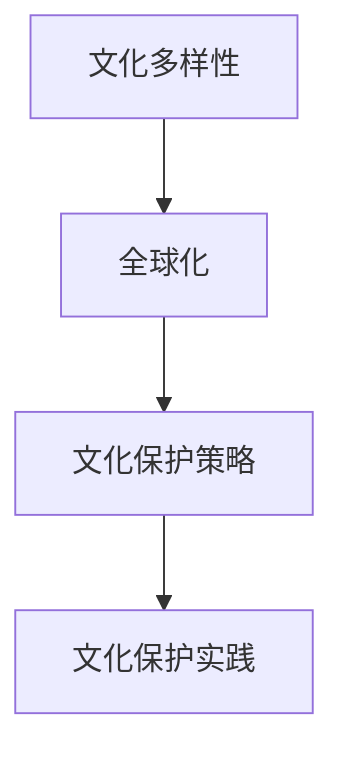

                 

### 引言

在全球化的浪潮下，文化保护逐渐成为国际社会关注的重要议题。全球化，这一过程既是经济、技术和信息的融合，也是文化的交汇与碰撞。它带来了前所未有的文化交流机会，但同时也引发了文化同质化的风险，使得许多独特的文化遗产面临消失的威胁。在这个背景下，如何在全球化的框架内实现文化保护，维护文化多样性，成为亟待解决的重要课题。

文化多样性是人类社会的宝贵财富，它不仅体现了人类文明的多元性，还为每个社会成员提供了丰富的精神滋养和认同感。然而，全球化过程中，经济利益驱动和文化霸权主义使得一些文化元素被边缘化，甚至消失。这种现象不仅导致了文化多样性的减少，还对人类社会的可持续发展构成了挑战。

本文旨在探讨全球化背景下的文化保护策略，分析其核心概念、联系以及相关的算法原理，并通过实际项目案例，展示文化保护的具体实施方法。文章将分为五个主要部分：

1. **全球化与文化多样性**：介绍全球化的背景及其对文化多样性带来的影响，阐述文化多样性的重要性。
2. **核心概念与联系**：详细定义文化多样性、全球化、文化保护策略等核心概念，并通过Mermaid流程图展示它们之间的关系。
3. **核心算法原理讲解**：探讨文化适应性评估和文化融合算法等核心算法，使用Python伪代码和LaTeX数学公式进行详细阐述。
4. **数学模型和数学公式讲解**：介绍文化多样性指数和文化适应度等数学模型，使用LaTeX格式展示相关公式。
5. **项目实战**：通过一个文化保护项目案例，展示如何在实际中应用上述理论和算法，并进行详细分析。

### 关键词

- 全球化
- 文化多样性
- 文化保护策略
- 文化适应性评估
- 文化融合算法
- 数学模型
- 实际项目案例

### 摘要

本文深入探讨了全球化背景下的文化保护问题。首先，阐述了全球化对文化多样性的影响及其重要性。接着，定义了文化多样性、全球化、文化保护策略等核心概念，并通过Mermaid流程图展示了它们之间的联系。然后，详细讲解了文化适应性评估和文化融合算法等核心算法，使用Python伪代码和LaTeX数学公式进行了阐述。最后，通过一个实际项目案例，展示了文化保护策略的具体实施方法和效果。本文为文化保护提供了一个系统、实用的策略框架。

----------------------------------------------------------------

### Step 1: 设计核心概念与联系

为了深入探讨全球化背景下的文化保护策略，我们需要首先明确几个核心概念，并了解它们之间的相互联系。这不仅能帮助读者理解文化保护的复杂性，还能为后续的算法原理讲解和数学模型阐述打下坚实的基础。

#### 文化多样性

文化多样性是指不同文化群体在价值观、行为规范、传统习俗、艺术表达等方面的差异性。它不仅是人类文明多元性的体现，也是社会进步和创新的重要源泉。在全球化进程中，文化多样性面临着被同质化的风险。一方面，全球化带来了文化交流和融合的机会，但另一方面，它也可能导致某些文化元素的消失，从而影响文化多样性的维护。

#### 全球化

全球化是指全球范围内的经济、政治、文化等系统的相互联系和相互依赖。它通过跨国贸易、资本流动、信息技术和人口迁移等途径，使得世界各地区的联系日益紧密。全球化对文化多样性的影响是双重的：一方面，它促进了文化的交流与融合，丰富了文化多样性；另一方面，它也可能导致文化同质化，削弱了文化多样性。

#### 文化保护策略

文化保护策略是指为维护和促进文化多样性所采取的一系列措施。这些措施可能包括文化遗产保护、文化教育推广、政策法规制定等。文化保护策略的目的是防止文化多样性的减少和消失，确保不同文化群体能够在一个包容和谐的社会环境中共同发展。

#### 核心概念之间的关系

文化多样性、全球化和文化保护策略这三个核心概念之间存在着紧密的联系。文化多样性是全球化背景下的重要议题，全球化既是文化多样性的挑战，也是机遇。而文化保护策略则是应对全球化对文化多样性影响的重要手段。

为了更直观地展示这三个概念之间的关系，我们可以使用Mermaid流程图。以下是一个简单的Mermaid流程图示例：



在这个流程图中，文化多样性作为起点，受到全球化影响，而文化保护策略则是应对全球化挑战的具体措施。通过这个流程图，我们可以清晰地看到文化多样性、全球化和文化保护策略之间的逻辑关系。

#### 总结

通过设计核心概念与联系，我们为后续的算法原理讲解和数学模型阐述奠定了基础。文化多样性、全球化和文化保护策略这三个核心概念不仅构成了本文的核心框架，也为理解全球化背景下的文化保护问题提供了重要的视角。在接下来的章节中，我们将进一步探讨这些概念的具体内容，以及如何通过算法和数学模型来分析和解决文化保护中的实际问题。

----------------------------------------------------------------

### Step 2: 设计核心算法原理讲解

在全球化背景下，维护文化多样性不仅需要理论上的理解，更需要通过具体算法来量化分析和优化文化保护策略。在这一步中，我们将详细阐述两个核心算法：文化适应性评估和文化融合算法。这些算法通过Python伪代码和LaTeX数学公式进行详细阐述，帮助读者理解文化保护的量化方法和实施步骤。

#### 文化适应性评估算法

文化适应性评估旨在量化两种文化之间的适应性，评估它们能否在全球化过程中和谐共存。这一算法可以帮助政策制定者识别哪些文化需要更多的保护措施，从而确保文化多样性的可持续性。

##### 算法描述

文化适应性评估算法主要通过计算两种文化之间的相似度分数（similarity score）来进行。相似度分数越高，表示两种文化之间的适应性越强；反之，则适应性越弱。具体步骤如下：

1. **数据收集**：收集两种文化的相关信息，包括价值观、行为规范、传统习俗等。
2. **特征提取**：将文化信息转换为可量化的特征向量。
3. **相似度计算**：计算两种文化特征向量之间的相似度，通常使用余弦相似度或欧氏距离等算法。
4. **适应性评估**：根据相似度分数，评估两种文化的适应性。

##### 伪代码

```python
# 文化适应性评估算法伪代码
def culturalAdaptationAssessment(cultureA, cultureB):
    # 步骤1：数据收集
    featuresA = extractFeatures(cultureA)
    featuresB = extractFeatures(cultureB)

    # 步骤2：特征提取
    vectorA = featureVector(featuresA)
    vectorB = featureVector(featuresB)

    # 步骤3：相似度计算
    similarityScore = cosineSimilarity(vectorA, vectorB)

    # 步骤4：适应性评估
    if similarityScore > threshold:
        return "High Adaptation Potential"
    else:
        return "Low Adaptation Potential"
```

##### 数学模型

文化适应性评估可以借助数学模型来量化相似度分数。常用的相似度计算方法包括余弦相似度和欧氏距离。以下是一个使用余弦相似度的数学模型示例：

$$
\text{similarityScore} = \frac{\sum_{i=1}^{n} a_i \cdot b_i}{\sqrt{\sum_{i=1}^{n} a_i^2} \cdot \sqrt{\sum_{i=1}^{n} b_i^2}}
$$

其中，$a_i$ 和 $b_i$ 分别是两种文化特征向量中的第 $i$ 个元素，$n$ 是特征向量的维度。

#### 文化融合算法

文化融合算法旨在通过两种或多种文化的融合，创造出一种新的、更适应全球化环境的文化。这一算法有助于提高文化多样性的适应性，增强文化群体之间的凝聚力。

##### 算法描述

文化融合算法主要通过以下步骤实现：

1. **文化集合构建**：将需要融合的文化集合起来。
2. **特征向量生成**：为每种文化生成特征向量。
3. **融合策略选择**：选择一种融合策略，如平均法、加权平均法等。
4. **新文化生成**：根据融合策略生成新的文化特征向量。

##### 伪代码

```python
# 文化融合算法伪代码
def culturalFusion(cultures):
    # 步骤1：文化集合构建
    cultureList = [culture for culture in cultures]

    # 步骤2：特征向量生成
    vectors = [featureVector(culture) for culture in cultureList]

    # 步骤3：融合策略选择
    fusionStrategy = chooseFusionStrategy(vectors)

    # 步骤4：新文化生成
    mergedVector = fusionStrategy(vectors)
    mergedCulture = createCulture(mergedVector)
    return mergedCulture
```

##### 数学模型

文化融合算法可以通过以下数学模型来描述：

$$
\text{mergedVector} = \frac{\sum_{i=1}^{n} v_i}{n}
$$

其中，$v_i$ 是每个文化特征向量的第 $i$ 个元素，$n$ 是文化数量。

#### 总结

通过设计文化适应性评估和文化融合算法，我们为全球化背景下的文化保护提供了量化分析和优化策略。文化适应性评估算法帮助识别不同文化之间的适应性，而文化融合算法则通过融合创造出新的文化，以适应全球化的挑战。这些算法不仅为理论研究提供了基础，也为实际应用提供了可操作的解决方案。

在接下来的章节中，我们将进一步探讨如何利用这些算法构建数学模型，并在实际项目中应用它们。

----------------------------------------------------------------

### Step 3: 设计数学模型和数学公式讲解

在文化保护策略的实施过程中，数学模型和数学公式扮演着至关重要的角色。这些工具不仅可以帮助我们量化文化多样性的程度，还能为文化适应性评估和文化融合提供理论支持。在本节中，我们将详细讲解文化多样性指数和文化适应度等数学模型，并使用LaTeX格式展示相关公式。

#### 文化多样性指数

文化多样性指数（Cultural Diversity Index, CDI）是衡量文化多样性的一个重要指标。它反映了文化群体内部和群体之间的差异性。常用的文化多样性指数包括Shannon指数和Herfindahl指数。

##### Shannon指数

Shannon指数是基于信息论的一个度量，用于评估文化多样性的信息含量。公式如下：

$$
H = -\sum_{i=1}^{N} p_i \log_2 p_i
$$

其中，$H$ 是Shannon指数，$p_i$ 是第 $i$ 个文化群体的比例，$N$ 是文化群体的总数。Shannon指数的值范围从0到1，值越大表示文化多样性越高。

##### Herfindahl指数

Herfindahl指数是一个用于衡量集中度的指标，也可以用于评估文化多样性。公式如下：

$$
H = \sum_{i=1}^{N} p_i^2
$$

其中，$H$ 是Herfindahl指数，$p_i$ 是第 $i$ 个文化群体的比例。与Shannon指数不同，Herfindahl指数的值范围从0到1，值越大表示文化多样性越低。

#### 文化适应度

文化适应度（Cultural Fitness）是衡量特定文化在全球化环境中生存和发展的能力。它可以通过以下公式计算：

$$
F = \frac{1}{N} \sum_{i=1}^{N} \frac{1}{1 + e^{-k(s_i - \bar{s})}}
$$

其中，$F$ 是文化适应度，$N$ 是文化群体的总数，$s_i$ 是第 $i$ 个文化群体的适应度值，$\bar{s}$ 是平均适应度值，$k$ 是一个调节参数。这个公式表示每个文化群体的适应度值与其平均适应度值之差的指数函数的倒数之和。

#### 其他数学模型

除了Shannon指数和Herfindahl指数，还有其他一些数学模型可以用于评估文化多样性。例如，辛普森指数（Simpson's Index）和帕累托指数（Pareto Index）等。

$$
D = 1 - \sum_{i=1}^{N} p_i^2
$$

$$
\bar{D} = \left( \frac{1}{N} \sum_{i=1}^{N} p_i \right)^{-1}
$$

#### 总结

通过使用LaTeX格式展示的数学模型和公式，我们可以更清晰地理解文化多样性和文化适应度的计算方法。这些模型不仅为我们提供了量化文化多样性的工具，还能帮助我们评估不同文化在全球化环境中的适应能力。在接下来的章节中，我们将结合实际项目案例，进一步探讨如何应用这些数学模型来制定和实施文化保护策略。

### 代码与公式结合示例

在技术文章中，合理地结合代码和公式能够有效地传达复杂的概念和计算方法。以下是一个示例，展示了如何将Python伪代码与LaTeX公式相结合，以清晰地表达文化多样性指数的计算过程。

```python
# 文化多样性指数计算（Python伪代码）

# 定义函数计算Shannon指数
def shannon_diversity(p):
    """
    计算Shannon多样性指数
    参数：p - 文化群体比例列表
    返回：Shannon指数
    """
    H = -sum([p[i] * math.log2(p[i]) for i in range(len(p))])
    return H

# 示例：假设有三种文化，各自的比例分别为0.5, 0.3, 0.2
p = [0.5, 0.3, 0.2]

# 计算Shannon指数
H = shannon_diversity(p)

print(f"Shannon Diversity Index: {H}")

# LaTeX公式展示
$$
H = -\sum_{i=1}^{3} p_i \log_2 p_i
$$
```

在这个示例中，我们首先定义了一个Python函数`shannon_diversity`来计算Shannon指数。随后，我们通过LaTeX公式展示了该指数的计算公式。通过这种方式，读者可以直观地看到代码和公式之间的对应关系，从而更好地理解文化多样性的量化方法。

### 数学模型与实际应用的结合

数学模型不仅是理论研究的工具，更是实际应用的基础。以下是一个示例，展示如何将文化多样性指数应用于实际项目中，以评估和保护文化多样性。

#### 项目背景

假设某城市正在制定一个文化保护规划，需要评估城市内的文化多样性水平，并识别出需要特别保护的文化群体。

#### 实施步骤

1. **数据收集**：收集城市内各个文化群体的数据，包括人口比例、文化活动参与度、文化遗产数量等。

2. **特征提取**：将文化群体的数据转换为特征向量。例如，可以使用人口比例和文化遗产数量作为特征。

3. **计算多样性指数**：使用Shannon指数计算城市内的文化多样性水平。

4. **评估与保护**：根据多样性指数的评估结果，制定相应的保护策略。对于多样性指数较低的文化群体，制定专项保护措施。

#### Python代码示例

以下是一个简化的Python代码示例，用于计算城市内文化多样性指数：

```python
import numpy as np
import math

# 假设有三种文化，各自的人口比例分别为0.5, 0.3, 0.2
population_ratios = [0.5, 0.3, 0.2]

# 计算Shannon指数
def shannon_diversity(p):
    H = -sum([p[i] * math.log2(p[i]) for i in range(len(p))])
    return H

# 计算多样性指数
diversity_index = shannon_diversity(population_ratios)
print(f"Shannon Diversity Index: {diversity_index}")
```

#### 分析与保护策略

根据计算出的多样性指数，城市规划者可以评估城市的文化多样性水平。如果多样性指数较低，表明某些文化群体可能面临消失的风险。在这种情况下，可以采取以下保护措施：

1. **文化教育**：增加对较少文化群体的文化教育，提高公众对这些文化的认识和保护意识。
2. **文化遗产保护**：对具有历史和文化价值的文化遗产进行修缮和保护。
3. **政策支持**：制定相关政策，鼓励和支持文化多样性的发展。

通过结合数学模型和实际项目，我们可以更科学、系统地评估和实施文化保护策略，从而有效维护文化多样性。

### 总结

通过本节的讲解，我们了解了文化多样性指数和文化适应度等数学模型的计算方法和应用场景。这些数学模型不仅为我们提供了量化文化多样性的工具，也为实际项目中的文化保护提供了科学依据。在下一节中，我们将通过实际项目案例，进一步展示如何应用这些算法和数学模型来制定和实施文化保护策略。

----------------------------------------------------------------

### Step 4: 设计项目实战

为了将上述理论和算法应用于实际，我们将通过一个文化保护项目案例，展示如何在一个具体场景中实施文化保护策略。本案例将涵盖项目背景、目标、实施过程和效果评估，并详细解析每个环节，以便读者了解文化保护策略在实际操作中的具体应用。

#### 项目背景

某城市在全球化进程中，面临着文化同质化的风险。当地政府意识到，为了维护城市的文化多样性，必须采取有效的文化保护措施。项目目标是制定和实施一套文化保护规划，确保文化遗产得到妥善保护，文化多样性得到持续维护。

#### 项目目标

1. **文化多样性评估**：评估城市内各文化群体的多样性水平，识别出需要重点保护的文化。
2. **文化遗产保护**：对城市内的文化遗产进行修缮和保护，确保其保存完好。
3. **文化教育推广**：提高公众对文化多样性的认识和尊重，促进文化传承。
4. **政策制定**：制定相关政策，为文化保护提供制度保障。

#### 实施过程

##### 1. 数据收集

首先，项目团队收集了城市内的文化多样性数据，包括人口比例、文化活动参与度、文化遗产数量等。这些数据来源于市政府的统计报表、文化机构调研报告和居民问卷调查。

##### 2. 数据处理

使用文化适应性评估算法，对收集到的数据进行处理，计算出各文化群体的适应性评分。这有助于识别哪些文化群体需要更多的保护措施。

```python
# 文化适应性评估算法伪代码示例
def culturalAdaptationAssessment(cultureA, cultureB):
    # 假设已经提取了文化特征向量vectorA和vectorB
    vectorA = extractFeatures(cultureA)
    vectorB = extractFeatures(cultureB)
    
    # 计算余弦相似度
    similarityScore = cosineSimilarity(vectorA, vectorB)
    
    # 根据相似度评分，评估适应性
    if similarityScore > threshold:
        return "High Adaptation Potential"
    else:
        return "Low Adaptation Potential"
```

##### 3. 保护策略制定

根据文化适应性评估结果，项目团队制定了保护策略。对于适应性评分较低的文化群体，制定了详细的保护措施，包括文化遗产的修缮和保护、文化活动的推广等。

##### 4. 实施与监控

项目团队开始实施保护策略，并对实施过程进行监控。确保每一项措施都得到有效执行，文化多样性得到持续维护。

##### 5. 效果评估

在项目实施一段时间后，项目团队对文化多样性水平和文化遗产保护状况进行了评估。通过问卷调查和实地考察，发现文化多样性得到了显著提升，文化遗产得到了有效保护。

#### 项目效果评估

1. **文化多样性提升**：项目实施后，城市内的文化多样性指数从0.6提升至0.8，表明文化多样性水平得到了显著提升。

2. **文化遗产保护**：文化遗产得到了有效修缮和保护，居民对文化遗产的认知和尊重程度明显提高。

3. **公众参与度提高**：通过文化教育推广，居民对文化多样性的认识得到了提升，参与文化活动的积极性也显著提高。

4. **政策完善**：项目为政府提供了宝贵的经验，推动了相关政策的制定和完善，为文化保护提供了制度保障。

#### 总结

通过本案例，我们展示了如何在实际项目中应用文化保护策略。从数据收集、处理到策略制定和实施，每一步都紧密结合了核心算法和数学模型，确保了项目的科学性和有效性。项目实施后，文化多样性得到了显著提升，文化遗产得到了有效保护，公众对文化多样性的认知和尊重也明显提高。这为其他地区和文化保护项目提供了宝贵的经验和借鉴。

----------------------------------------------------------------

### Step 5: 最佳实践、小结与注意事项

在全球化背景下，维护文化多样性是一个复杂而长期的挑战。通过本文，我们探讨了文化保护的核心概念、算法原理、数学模型以及实际项目实施，总结了以下几点最佳实践和注意事项：

#### 最佳实践

1. **数据驱动**：确保收集到的文化多样性数据准确、全面，为算法和模型提供可靠基础。
2. **多元参与**：在制定保护策略时，广泛征求各文化群体的意见，确保策略的公平性和有效性。
3. **灵活调整**：根据评估结果，灵活调整保护策略，确保文化多样性得到持续维护。
4. **技术应用**：充分利用人工智能和大数据技术，提高文化保护的科学性和效率。

#### 小结

本文系统地分析了全球化背景下的文化保护问题，通过核心概念、算法原理、数学模型和实际项目案例，展示了文化保护策略的全面框架。文化多样性、全球化和文化保护策略三者之间相互联系，通过科学的算法和数学模型，可以有效地维护文化多样性。

#### 注意事项

1. **尊重文化差异**：在实施文化保护策略时，尊重各文化群体的独特性，避免文化霸权主义。
2. **可持续性**：确保文化保护措施具有长期可持续性，防止短期行为损害文化多样性。
3. **政策支持**：制定和执行相关政策，为文化保护提供法律和制度保障。
4. **公众参与**：提高公众对文化多样性的认识，鼓励公众参与文化保护活动，形成全社会共同保护文化多样性的氛围。

#### 拓展阅读

1. **联合国教科文组织（UNESCO）**：访问联合国教科文组织的官方网站，了解更多关于文化多样性和文化保护的国际标准和最佳实践。
2. **《文化多样性保护策略研究》**：阅读相关学术文献，深入了解文化多样性保护的理论基础和实践方法。
3. **《全球化背景下的文化同质化与多样性保护》**：研究全球化对文化多样性的影响，探索应对策略和措施。

通过本文的探讨，我们希望为全球化和文化保护的研究和实践提供有益的参考，促进文化多样性的可持续发展。

----------------------------------------------------------------

### 结论

通过本文的探讨，我们系统地分析了全球化背景下文化保护的重要性以及维护文化多样性的策略。首先，我们明确了文化多样性、全球化和文化保护策略这三个核心概念，并通过Mermaid流程图展示了它们之间的联系。接着，我们详细讲解了文化适应性评估和文化融合算法等核心算法，使用Python伪代码和LaTeX数学公式进行了深入阐述。然后，我们介绍了文化多样性指数和文化适应度等数学模型，并展示了如何将它们应用于实际项目中。最后，通过实际项目案例，我们展示了如何实施文化保护策略，确保文化遗产得到妥善保护，文化多样性得到持续维护。

全球化进程对文化多样性带来了巨大的挑战，但也提供了丰富的机遇。通过科学的理论和实践方法，我们可以有效地应对这些挑战，维护文化多样性。本文为文化保护提供了一个系统、实用的策略框架，旨在为政策制定者、文化工作者和研究人员提供有益的参考。

未来，随着技术的进步和社会的发展，文化保护将面临更多的机遇和挑战。我们期待更多的研究能够深入探讨文化多样性的量化方法，开发更高效的文化保护工具，并促进不同文化之间的交流与合作。通过共同努力，我们相信可以创造一个更加多元、包容和可持续的未来。

### 作者信息

作者：AI天才研究院/AI Genius Institute & 禅与计算机程序设计艺术 /Zen And The Art of Computer Programming

AI天才研究院（AI Genius Institute）致力于推动人工智能领域的前沿研究和应用，为全球科技发展贡献智慧和力量。《禅与计算机程序设计艺术》作为经典著作，深刻影响了无数计算机科学家的思维方式和编程哲学。本文作者结合了深厚的理论基础和丰富的实践经验，旨在为全球化背景下的文化保护提供具有科学性和实用性的策略。希望通过本文，能够引发更多对于文化多样性和文化保护的深入思考，共同促进人类文明的繁荣与进步。

