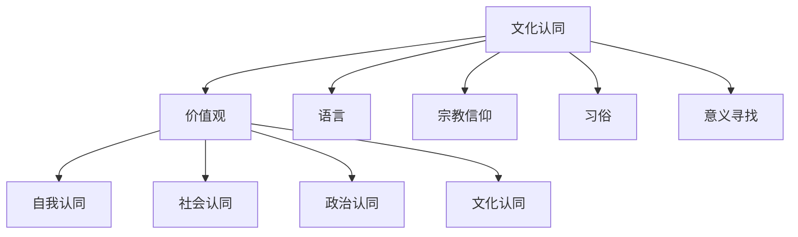

                 

# 引言

## 全球化背景下的文化认同与意义寻找

在全球化的浪潮中，文化认同和意义寻找成为了一个引人关注的话题。全球化不仅带来了经济、技术和信息的快速传播，也引发了文化碰撞与交融。在这种背景下，文化认同和意义寻找变得更加复杂和多元。本文将从全球化的影响、文化认同的概念与特征、文化冲突与融合、文化认同的政治与社会意义、文化政策与实践，以及文化认同与意义寻找的关系等方面进行深入探讨。

### 全球化的影响与挑战

全球化是一个多维度的过程，涵盖了经济、政治、文化等多个领域。它既带来了机遇，也带来了挑战。在经济领域，全球化促进了贸易和投资的自由化，提高了资源在全球范围内的配置效率。然而，也导致了某些国家和地区的经济不平等问题。在政治领域，全球化推动了国际合作和多边机制的建立，但同时也加剧了国家间政治关系的复杂性。

### 文化认同的内涵与特征

文化认同是指个体或群体对于自己所属文化的认知和认同。它具有以下几个特征：

1. **差异性**：不同的文化背景会导致个体在价值观、行为习惯、语言等方面存在差异。
2. **稳定性**：文化认同在一定程度上是稳定的，即使在全球化过程中，某些核心的文化价值观和传统也会得到保留。
3. **动态性**：文化认同并非一成不变，它随着时间和环境的变化而不断演变。

### 全球化背景下的文化冲突与融合

全球化带来了不同文化之间的交流与互动，但同时也引发了文化冲突。文化冲突可以表现为价值观的对立、宗教信仰的差异、甚至是国家间的政治争端。然而，全球化也促进了文化的融合，使得各种文化元素得以相互借鉴和融合。

### 文化认同的政治与社会意义

文化认同不仅是个体层面的，也具有政治和社会层面的意义。在政治层面，文化认同是国家身份和国家认同的重要组成部分。在社会层面，文化认同有助于社会成员之间的凝聚力和归属感。

### 全球化背景下的文化政策与实践

为了应对全球化带来的挑战，各国纷纷制定了相应的文化政策。这些政策旨在保护和弘扬本国文化，同时促进文化的国际交流与合作。在实践中，文化政策通过教育、媒体、文化活动等多种途径得以实施。

### 文化认同与意义寻找的关系

文化认同与意义寻找密切相关。在全球化背景下，人们面临着意义危机，即对于自己存在的价值和意义的迷茫。文化认同提供了一个寻找意义的路径，它可以帮助个体在多元文化中找到自己的归属感和价值感。

### 总结与展望

全球化是一个不可逆转的趋势，它既带来了机遇，也带来了挑战。在全球化背景下，文化认同和意义寻找变得尤为重要。通过深入探讨文化认同的内涵与特征、文化冲突与融合、文化认同的政治与社会意义，以及文化认同与意义寻找的关系，我们可以更好地理解和应对全球化的挑战。未来，随着全球化的深入，文化认同和意义寻找将继续成为重要的研究领域，为人类社会的和谐发展提供思想支持和实践指导。

### 关键词

- 全球化
- 文化认同
- 意义寻找
- 文化冲突与融合
- 政治与社会意义
- 文化政策与实践

### 摘要

本文从全球化的影响、文化认同的内涵与特征、文化冲突与融合、文化认同的政治与社会意义，以及文化认同与意义寻找的关系等方面，深入探讨了全球化背景下的文化认同与意义寻找。通过对全球化背景下的文化认同的挑战、文化认同的内涵与特征、文化冲突与融合、文化认同的政治与社会意义，以及文化认同与意义寻找的关系的分析，本文揭示了全球化背景下的文化认同与意义寻找的复杂性和多元性，为理解和应对全球化挑战提供了新的视角和思路。## 第一部分：全球化背景下的文化认同

### 第1章：全球化的影响与挑战

#### 1.1 全球化的定义与发展历程

全球化是指全球范围内的经济、政治、文化等各个领域的相互联系和相互作用日益加深的过程。它不仅仅是一个经济现象，更是涉及政治、社会、文化等多个层面的复杂过程。全球化的发展历程可以追溯到20世纪中叶，特别是二战后，随着国际贸易的扩展、跨国公司的发展以及信息技术革命的推进，全球化进程加速。

全球化具有以下几个显著特征：

1. **经济全球化**：国际贸易、跨国投资和跨国公司的发展，使得全球经济日益融合。
2. **政治全球化**：国际组织和多边合作机制的发展，如联合国、世界贸易组织等，促进了全球政治的协调与合作。
3. **文化全球化**：随着全球化的推进，文化交流日益频繁，不同文化之间相互影响和融合。

#### 1.2 全球化对文化认同的挑战

全球化对文化认同带来了多方面的挑战：

1. **文化同质化**：全球化过程中，西方文化的影响力不断扩大，导致一些传统文化面临同质化的风险。
2. **文化断裂**：全球化使得一些文化群体与传统文化之间的联系变得松散，甚至断裂。
3. **文化冲突**：全球化带来了不同文化之间的碰撞与冲突，特别是在价值观、宗教信仰等方面。

#### 1.3 全球化背景下的文化多样性

尽管全球化带来了文化同质化的风险，但也不可忽视文化多样性的存在和发展。全球化使得文化多样性得以体现和传播，例如：

1. **文化交流**：通过国际交流、移民和旅游业，不同文化之间的互动日益频繁。
2. **文化创新**：全球化背景下，不同文化的融合产生了新的文化形式和表达方式。
3. **文化保护**：许多国家和地区通过立法和政策，加强对传统文化的保护。

### 小结

全球化是一个复杂的进程，它既带来了文化同质化的风险，也促进了文化多样性的发展。在全球化的背景下，文化认同面临着前所未有的挑战和机遇。理解和应对这些挑战，有助于构建更加多元和包容的社会。## 第2章：文化认同的内涵与特征

### 2.1 文化认同的概念与构成

文化认同是一个复杂而多维的概念，它涉及到个体或群体对于自己所属文化的认知和认同。文化认同不仅包含了文化元素，如语言、价值观、宗教信仰、习俗等，还涉及到个体在文化中的归属感、认同感和价值感。从构成上看，文化认同主要包括以下几个方面：

1. **语言**：语言是文化认同的重要组成部分，它不仅是沟通的工具，也是文化传承的载体。
2. **价值观**：价值观是文化认同的核心，它决定了个体对道德、伦理和社会规范的认知。
3. **宗教信仰**：宗教信仰在很多文化中占有重要地位，它影响着个体的行为和思想。
4. **习俗**：习俗是文化认同的直观表现，如节日庆典、传统服饰等。
5. **历史记忆**：历史记忆是文化认同的重要基础，它影响着个体的文化认同感和自豪感。

### 2.2 文化认同的特征与表现

文化认同具有以下几个显著特征：

1. **差异性**：不同的文化背景导致个体在价值观、行为习惯、语言等方面存在差异。这种差异性是文化认同的核心特征之一。
2. **稳定性**：文化认同在一定程度上是稳定的，即使在全球化过程中，某些核心的文化价值观和传统也会得到保留。这种稳定性有助于文化认同的传承和延续。
3. **动态性**：文化认同并非一成不变，它随着时间和环境的变化而不断演变。这种动态性使得文化认同能够适应新的社会环境和发展需求。

文化认同的表现形式多样，包括：

1. **自我认同**：个体通过文化认同感受到自己的独特性和归属感。
2. **群体认同**：群体成员通过共同的文化元素和价值观，增强彼此之间的联系和认同。
3. **文化实践**：通过文化活动、艺术创作、宗教仪式等方式，文化认同得以具体化和体现。

### 2.3 文化认同与自我认同的关系

文化认同与自我认同密切相关。自我认同是个体对于自己身份的认知和定位，而文化认同则是自我认同的重要组成部分。文化认同为个体提供了一个身份框架，帮助个体在复杂的社会环境中找到自己的位置。具体来说，文化认同与自我认同的关系体现在以下几个方面：

1. **身份构建**：文化认同帮助个体构建自我身份，确定自己在社会中的角色和地位。
2. **价值定位**：文化认同为个体提供了一套价值体系，帮助个体判断和选择行为准则。
3. **社会互动**：文化认同影响着个体与其他文化群体之间的互动方式，决定了个体在多元文化环境中的适应能力。

### 小结

文化认同是一个复杂而多维的概念，它不仅包含了语言、价值观、宗教信仰、习俗等文化元素，还涉及到个体在文化中的归属感、认同感和价值感。文化认同具有差异性、稳定性和动态性等特征，它在自我认同和群体认同中扮演着重要角色。理解文化认同的内涵和特征，有助于我们更好地认识自我，构建和谐的多元文化社会。## 第3章：全球化背景下的文化冲突与融合

### 3.1 文化冲突的表现与原因

在全球化的过程中，文化冲突是一个不可避免的现象。文化冲突的表现形式多种多样，可以体现在以下几个方面：

1. **价值观的对立**：不同文化背景下的价值观差异可能导致冲突。例如，在一些文化中，个人主义被视为重要的价值观，而在另一些文化中，集体主义占据主导地位。
2. **宗教信仰的差异**：宗教信仰是文化认同的重要组成部分，不同宗教之间的差异可能导致冲突。例如，基督教与伊斯兰教之间的冲突在某些地区表现得尤为明显。
3. **语言和沟通障碍**：语言的不同可能导致沟通障碍，从而引发误解和冲突。例如，在跨国公司和移民社区中，语言障碍常常是文化冲突的一个重要原因。
4. **习俗和传统**：不同文化的习俗和传统可能产生冲突。例如，在一些文化中，某些习俗被视为不可侵犯的，而在其他文化中，这些习俗可能被视为不合适或侵犯个人权利。

文化冲突的原因可以从以下几个方面进行分析：

1. **文化差异**：不同文化之间的差异是文化冲突的根本原因。文化差异涉及到价值观、信仰、习俗等多个层面，这些差异可能导致相互不理解、不尊重，甚至敌对。
2. **经济利益**：全球化带来了经济利益的重新分配，不同文化群体可能会为了保护自身利益而发生冲突。例如，跨国公司在某些地区设立工厂可能会引发当地居民的抗议。
3. **政治因素**：政治因素也是文化冲突的一个重要原因。政治权力的争夺、国家利益的对立等都可能引发文化冲突。

### 3.2 文化融合的过程与挑战

文化冲突的同时，全球化也促进了文化的融合。文化融合是一个复杂的过程，涉及到文化元素的交流、碰撞和融合。文化融合的过程可以从以下几个方面进行分析：

1. **文化交流**：全球化使得不同文化之间的交流变得更加频繁和便捷。通过各种形式的交流，如国际旅行、跨国公司的运作、国际会议等，不同文化得以相互了解和接触。
2. **文化借鉴**：在文化交流的过程中，不同文化会相互借鉴对方的文化元素。例如，西方国家的饮食文化中融入了亚洲的菜肴，而亚洲国家的服装设计中融入了西方的元素。
3. **文化创新**：文化融合往往会产生新的文化形式和表达方式。例如，跨国婚姻和移民社区中形成的新的文化习俗和传统。

尽管文化融合具有积极的意义，但在实际过程中也面临一些挑战：

1. **文化认同的冲突**：文化融合过程中，不同文化之间的认同冲突可能加剧。例如，一些文化群体可能担心自身文化被同化或边缘化。
2. **社会适应问题**：文化融合可能给个体和社会带来适应问题。例如，移民可能面临文化适应的困难，而多元文化社会中的成员可能需要学会在文化差异中和谐共处。
3. **政策与管理问题**：文化融合需要有效的政策和管理措施来促进。然而，不同国家和地区在文化融合的政策和管理方面可能存在差异，这可能导致文化融合的困难和挑战。

### 3.3 全球化背景下的文化共生

在全球化背景下，文化冲突与融合共存，形成了文化共生的新格局。文化共生是指不同文化在相互尊重、相互理解的基础上，共同存在于同一社会空间的现象。文化共生的意义在于：

1. **促进文化多样性的发展**：文化共生使得各种文化得以共存和交流，从而促进了文化多样性的发展。
2. **推动社会和谐**：文化共生有助于不同文化群体之间的相互理解和尊重，减少文化冲突，推动社会和谐。
3. **增强社会包容性**：文化共生使得社会更加包容，能够接纳和尊重不同文化的存在。

实现文化共生的策略包括：

1. **教育**：通过教育提高人们对不同文化的认识和尊重，培养多元文化意识。
2. **文化交流**：通过文化交流增进不同文化之间的了解和互动，减少误解和偏见。
3. **政策支持**：制定有效的政策和措施，促进文化多样性的保护和传承，支持文化共生的发展。

### 小结

全球化背景下的文化冲突与融合是一个复杂的过程，既带来了挑战，也提供了机遇。通过深入理解文化冲突的表现与原因，以及文化融合的过程与挑战，我们可以更好地应对全球化带来的文化挑战。同时，通过推动文化共生，我们可以促进文化多样性的发展，构建更加和谐和包容的社会。## 第4章：文化认同的政治与社会意义

#### 4.1 文化认同与政治认同的关系

文化认同与政治认同之间存在着密切的联系和相互作用。文化认同是政治认同的基础，政治认同则是文化认同的体现。从某种程度上说，文化认同决定了政治认同的形成和发展。

1. **文化认同对政治认同的影响**：文化认同塑造了个体的价值观念和行为规范，这些价值观念和行为规范在很大程度上影响了个体对政治体制、政治制度和政治权力的认知和认同。例如，一个拥有深厚文化认同的个体，往往会对符合其文化价值观的政治制度表现出更高的忠诚度和认同感。

2. **政治认同对文化认同的塑造**：政治认同在一定程度上也塑造了文化认同。政治体制和政治制度对于文化的传承和发展具有重要影响。例如，一个国家的政治体制可能通过法律和政策来保护和弘扬传统文化，从而强化文化认同。

#### 4.2 文化认同与社会认同的互动

文化认同与社会认同之间也存在着紧密的互动关系。社会认同是指个体对所属社会群体的认同感和归属感，而文化认同则是社会认同的重要组成部分。

1. **文化认同对社会认同的影响**：文化认同有助于个体建立社会认同。通过认同和传承共同的文化价值观，个体能够更好地融入社会，找到自己在社会中的位置。例如，一个有着强烈文化认同的民族群体，往往能够在社会生活中表现出较高的凝聚力和归属感。

2. **社会认同对文化认同的塑造**：社会认同也会对文化认同产生影响。在社会互动中，个体通过与其他社会成员的交流，不断调整和丰富自己的文化认同。例如，一个个体可能在移民过程中，通过适应新的社会环境，逐渐形成新的文化认同。

#### 4.3 文化认同与国家发展

文化认同在国家发展中具有重要作用。一个国家的发展不仅依赖于经济和科技，也依赖于文化认同的构建和维护。

1. **文化认同对国家发展的促进作用**：文化认同有助于增强国民的凝聚力和向心力，推动国家的团结和稳定。例如，一个有着强烈文化认同的国家，往往能够更加有效地应对外部挑战和内部矛盾，实现国家的持续发展。

2. **文化认同对国家发展的限制作用**：然而，文化认同也可能对国家发展产生限制作用。如果一个国家的文化认同过于强烈，可能导致对外部文化的排斥，从而阻碍文化的创新和进步。例如，一些国家可能因为过于保守的文化认同，导致经济和技术发展的滞后。

3. **平衡文化认同与国家发展**：为了实现国家的长远发展，需要在文化认同和国家发展之间找到平衡。一方面，要保护和弘扬本国文化，增强国民的文化认同；另一方面，要开放包容，吸收外部文化的优秀元素，促进文化的创新和进步。

### 小结

文化认同不仅对政治认同和社会认同有着重要影响，也在国家发展中扮演着关键角色。理解文化认同与政治认同、社会认同的关系，以及文化认同对国家发展的影响，有助于我们更好地认识和应对全球化背景下的文化挑战，推动国家的和谐发展。## 第5章：全球化背景下的文化政策与实践

#### 5.1 全球化背景下的文化政策

在全球化的浪潮中，各国政府纷纷制定了一系列文化政策，旨在应对全球化带来的文化挑战，保护和发展本国文化。这些文化政策主要包括以下几个方面：

1. **文化保护政策**：许多国家通过立法和政策，加强对传统文化的保护和传承。例如，一些国家设立了文化保护区，对具有历史和文化价值的建筑物和遗址进行保护。
2. **文化推广政策**：政府通过投资和支持文化活动，推广本国文化，提升国际影响力。例如，许多国家通过资助文化活动、艺术展览、电影制作等方式，推广本国文化。
3. **文化多样性政策**：为了应对全球化带来的文化同质化趋势，一些国家制定了文化多样性政策，鼓励和支持各种文化的交流与融合。例如，一些国家设立了多元文化委员会，促进不同文化之间的对话与交流。
4. **文化产业政策**：政府通过支持文化产业的发展，提升文化软实力。文化产业包括电影、音乐、出版、艺术等多个领域，是全球化背景下文化发展的重要驱动力。

#### 5.2 文化认同的教育与实践

教育是培养文化认同和促进文化传承的重要途径。在全球化的背景下，教育系统在文化认同的塑造中发挥着关键作用。以下是文化认同教育与实践的几个方面：

1. **传统文化教育**：学校通过设置传统文化课程，向学生传授本国的历史、文学、艺术等文化知识，增强学生对本国文化的认同感。
2. **跨文化交流**：学校组织学生参与跨文化交流活动，如交换生项目、国际文化节等，让学生在多元文化环境中体验和理解其他文化，培养全球视野。
3. **社会实践**：学生通过参与社会实践，如社区服务、文化遗产保护等活动，将文化知识与实践相结合，增强对文化的理解和认同。
4. **家庭教育**：家庭在文化认同的塑造中也起着重要作用。家长通过日常生活中的言传身教，向子女传递文化价值观和传统习俗，培养文化认同。

#### 5.3 文化认同的跨国合作与交流

在全球化的背景下，文化认同的跨国合作与交流日益重要。跨国合作与交流有助于不同文化之间的相互理解和尊重，促进文化认同的深化和发展。以下是几个方面的跨国合作与交流：

1. **国际文化交流项目**：各国政府、非政府组织和教育机构通过合作举办国际文化交流项目，如艺术节、电影展、学术研讨会等，促进不同文化之间的交流与合作。
2. **跨国文化交流平台**：通过建立跨国文化交流平台，如国际博物馆、图书馆、文化中心等，为不同文化之间的交流提供场所和机会。
3. **跨国文化交流政策**：政府通过制定跨国文化交流政策，鼓励和支持文化机构和文化人士开展国际交流与合作，促进文化认同的跨国合作与交流。

#### 5.4 文化认同政策与全球化挑战的应对策略

面对全球化带来的文化挑战，文化认同政策需要不断创新和完善，以应对新的形势和需求。以下是几个应对全球化挑战的文化认同政策策略：

1. **文化保护与创新的平衡**：在保护传统文化的同时，鼓励文化创新，使传统文化在现代化进程中焕发新的生命力。
2. **文化多样性与包容性的结合**：在维护本国文化特色的同时，尊重和包容其他文化，促进文化多样性的发展。
3. **政策制定与执行的协调**：政府需要制定切实可行的文化政策，并确保政策的执行和落实，提高政策的实效性。
4. **文化教育体系的完善**：加强文化教育，提高公众的文化素养和文化认同，为文化认同的构建提供坚实的基础。

### 小结

全球化背景下的文化政策与实践对于保护和弘扬本国文化、促进文化认同的构建具有重要意义。通过制定有效的文化政策，加强文化教育，推动跨国合作与交流，我们可以更好地应对全球化带来的文化挑战，实现文化的繁荣与发展。## 第6章：全球化背景下的文化认同研究方法

#### 6.1 文献综述与理论研究方法

研究全球化背景下的文化认同，首先需要进行深入的文献综述，系统梳理相关理论和方法。文献综述的目的是了解当前研究的现状、发展趋势以及尚未解决的问题。通过文献综述，我们可以明确研究的文化认同概念、理论框架和研究方法。

1. **文化认同概念的界定**：明确文化认同的定义，包括其构成要素、特征和类型。例如，文化认同可能包括自我认同、群体认同、文化符号等多个方面。
2. **理论框架的构建**：构建研究的文化认同理论框架，将相关理论进行整合，形成系统的研究框架。例如，可以将文化认同与全球化、政治认同、社会认同等概念进行关联，形成多层次的研究框架。
3. **研究方法的选择**：根据研究目的和问题，选择合适的研究方法。常用的研究方法包括定性研究（如访谈、观察、案例研究）和定量研究（如问卷调查、统计分析）。

#### 6.2 实证研究与案例分析

实证研究是验证文化认同理论的重要手段。通过实证研究，我们可以收集和分析实际数据，检验理论假设，揭示文化认同的实际情况。

1. **数据收集**：根据研究目的，设计数据收集方法。例如，可以通过问卷调查收集大众对文化认同的看法，通过访谈收集特定群体的文化认同经验。
2. **数据分析**：运用统计学方法对收集的数据进行分析，揭示文化认同的特征和规律。例如，可以通过回归分析探讨文化认同与全球化程度的关系。
3. **案例研究**：选择具有代表性的案例进行研究，深入分析文化认同的具体表现和影响因素。例如，可以研究一个多元文化社区中的文化认同构建过程，分析文化冲突与融合的现象。

#### 6.3 文化认同研究的未来趋势

随着全球化进程的深入，文化认同研究将继续发展，未来可能出现以下几个趋势：

1. **跨学科研究**：文化认同研究将越来越多地与其他学科（如社会学、心理学、政治学等）交叉融合，形成跨学科的研究方法体系。
2. **技术手段的运用**：随着信息技术的进步，大数据分析、人工智能等新技术将越来越多地应用于文化认同研究，提供更加精准的研究结果。
3. **全球化与本土化的平衡**：研究将更加关注全球化背景下本土文化的保护和发展，探讨如何在全球化进程中维护文化多样性。
4. **实践导向的研究**：未来的研究将更加注重理论与实践的结合，为政策制定和实践提供科学依据。

### 小结

全球化背景下的文化认同研究方法多样，包括文献综述、实证研究和案例分析等。通过系统的研究方法，我们可以深入探讨文化认同的内涵、特征和影响因素，为理解和应对全球化背景下的文化挑战提供科学支持。未来，随着跨学科研究和技术手段的运用，文化认同研究将不断发展，为构建和谐多元的社会贡献力量。## 第7章：意义寻找的内涵与路径

#### 7.1 意义寻找的概念与类型

意义寻找是指个体在生命历程中寻求个人存在意义和价值的探索过程。这一过程不仅涉及到个体的内在心理需求，还受到外部环境和社会文化的影响。意义寻找可以大致分为以下几种类型：

1. **个人意义寻找**：这种类型的意义寻找主要关注个体如何理解自己的生活，以及如何为生活赋予意义。个体可能通过自我反思、探索自我身份、追求个人成长来实现意义寻找。
2. **集体意义寻找**：集体意义寻找涉及个体如何在社会和群体中寻找归属感和价值感。这种类型的意义寻找通常与家庭、宗教、民族和职业等集体身份相关。
3. **社会意义寻找**：社会意义寻找是关于个体如何在更大的社会背景下寻找个人价值和社会责任。这种类型的意义寻找可能涉及到社会参与、公共服务和社区建设等方面。

#### 7.2 意义寻找的路径与方法

意义寻找是一个复杂且多维的过程，不同的个体可能会采用不同的路径和方法来实现这一目标。以下是一些常见的意义寻找路径和方法：

1. **自我反思**：自我反思是意义寻找的重要路径之一。个体通过深入思考自己的价值观、信仰、经历和目标，探索生活的意义。自我反思可以通过日记、冥想、心理咨询等方式进行。
2. **教育与实践**：教育和实践是帮助个体找到意义的有效途径。通过学习和参与各种活动，个体可以积累知识和经验，从而更好地理解自己的价值和目标。例如，学习哲学、心理学或宗教课程，参与社会服务或志愿服务项目。
3. **文化传承**：文化传承是意义寻找的一个重要来源。通过继承和弘扬传统文化，个体可以找到与自身文化背景相联系的意义。例如，通过学习传统艺术、文学和历史，个体可以加深对文化传统的理解和认同。
4. **探索与冒险**：探索和冒险是寻找意义的另一种方式。通过旅行、探险、尝试新事物，个体可以拓宽视野，发现新的兴趣和激情，从而找到生活的意义。

#### 7.3 意义寻找与个人成长

意义寻找与个人成长密切相关。在个体成长过程中，意义寻找有助于建立自我认同、增强自我价值感和提高幸福感。以下是意义寻找对个人成长的几个影响：

1. **自我认知**：意义寻找帮助个体更好地认识自己，明确自己的价值观和目标。这有助于个体在人生道路上做出更加明智的选择，实现个人发展。
2. **情感满足**：找到生活的意义可以带来深刻的情感满足和幸福感。当个体感到自己的生活有意义且有价值时，他们更有可能体验到积极情感，如快乐、满足和自豪。
3. **心理韧性**：意义寻找可以提高个体的心理韧性，帮助他们在面对困难和挑战时保持积极态度和应对能力。有意义的生活可以让个体在面对逆境时找到坚持和前进的动力。
4. **社会关系**：意义寻找有助于建立和维护积极的社会关系。当个体找到自己的意义和价值时，他们更有可能与他人建立深厚的联系，分享自己的经验和智慧，从而促进个人和社会的和谐发展。

### 小结

意义寻找是人生中的重要课题，它涉及到个体的内在需求、外部环境和文化的互动。通过自我反思、教育与实践、文化传承和探索冒险等多种路径，个体可以找到生活的意义，实现个人成长。意义寻找不仅有助于提升个体的幸福感，也有助于构建更加和谐和有意义的个人和社会生活。## 第8章：全球化背景下的意义寻找

#### 8.1 全球化对意义寻找的影响

全球化对意义寻找产生了深远的影响，它既为个体提供了更多的机会，也带来了新的挑战。在全球化背景下，意义寻找变得更加复杂和多元，主要体现在以下几个方面：

1. **多元文化的冲击**：全球化带来了不同文化之间的交流和融合，个体在接触多元文化时，可能会面临文化冲突和价值观的挑战。这种文化冲击可能会使个体在寻找意义时感到困惑和不确定。
2. **信息过载**：全球化使信息传播速度加快，个体面临的信息量急剧增加。虽然这有助于个体获取更多的知识和资源，但同时也可能导致信息过载，使个体难以聚焦和找到真正有意义的事物。
3. **社会压力**：全球化背景下，社会竞争日益激烈，个体在追求经济成功和社会地位时，可能会感受到巨大的压力。这种压力可能会影响个体的意义寻找过程，使其更加关注外在的成功和成就。
4. **身份认同的困惑**：全球化使个体面临更广泛的选择和机会，但也可能导致身份认同的困惑。个体在全球化背景下如何找到自己的位置和价值，成为一个值得深思的问题。

#### 8.2 全球化背景下的意义危机

全球化背景下，意义危机成为许多个体面临的问题。意义危机指的是个体在寻找生命意义的过程中感到迷茫、困惑和无意义。以下是全球化背景下的几个意义危机表现：

1. **价值观的迷失**：全球化带来的文化冲击可能使个体原有的价值观受到挑战，导致价值观的迷失和混乱。个体在多元文化中难以找到统一的价值观体系，从而感到迷茫和困惑。
2. **个人主义的膨胀**：全球化背景下的个人主义膨胀，个体过分强调自我利益和个性表达，可能导致对他人和社会的忽视，从而感到孤独和无意义。
3. **成功的异化**：在全球化背景下，成功往往被定义为经济上的富裕和社会地位的提升。然而，单纯追求外在的成功可能使个体感到空虚和失落，从而产生意义危机。
4. **精神空虚**：全球化带来了物质生活的丰富，但同时也可能导致精神空虚。个体在追求物质享受的过程中，可能忽视了内心的精神需求，导致精神空虚和意义危机。

#### 8.3 全球化背景下的意义重构

面对全球化带来的意义危机，个体需要重新思考和重构生命的意义。以下是几个可能的路径：

1. **内省和自我反思**：通过内省和自我反思，个体可以深入探索自己的内心世界，找到真正的自我和价值观。内省可以帮助个体摆脱外在的诱惑和压力，回归内心的真实需求。
2. **多元文化的融合**：全球化背景下的多元文化为个体提供了丰富的资源，个体可以通过学习和体验不同的文化，找到与自身价值观相契合的意义。多元文化的融合有助于个体在全球化背景下保持文化认同和自我价值感。
3. **社会责任和贡献**：个体可以通过参与社会服务和公益事业，找到自己对社会的责任和贡献，从而赋予自己的生活更多的意义。通过帮助他人和社会，个体可以感受到自己的价值和存在的意义。
4. **精神追求和心灵成长**：个体可以通过追求精神和心灵的成长，找到超越物质生活的意义。例如，通过学习哲学、宗教或心理学，个体可以深入探索生命的本质和意义，实现心灵上的升华。

### 小结

全球化对意义寻找产生了深远的影响，既带来了机遇，也带来了挑战。在全球化背景下，意义危机成为一个普遍现象，个体需要重新思考和重构生命的意义。通过内省和自我反思、多元文化的融合、社会责任和贡献以及精神追求和心灵成长等多种路径，个体可以找到生命的意义，实现个人成长和社会发展。## 第9章：文化认同与意义寻找的关系

#### 9.1 文化认同与意义寻找的互动

文化认同与意义寻找之间存在着密切的互动关系。文化认同为意义寻找提供了基础和方向，而意义寻找则影响着文化认同的形成和演变。

1. **文化认同对意义寻找的影响**：
   - **价值观的塑造**：文化认同塑造了个体的价值观，这些价值观影响了个体对意义的理解和追求。例如，在一个重视集体主义的文化中，个体可能更倾向于寻找对社会的贡献和归属感。
   - **生活方式的引导**：文化认同引导个体的生活方式和行为模式，这些生活方式和模式也影响着个体对意义的寻找。例如，一个有着深厚宗教信仰的个体可能会通过宗教实践来寻找生命的意义。
   - **社会支持网络**：文化认同为个体提供了社会支持网络，这些支持网络有助于个体在面对意义危机时找到支持和指导。例如，在多元文化社区中，个体可以通过与同文化背景的人交流来缓解意义危机。

2. **意义寻找对文化认同的影响**：
   - **文化认同的深化**：意义寻找过程中，个体可能会通过深入思考和探索，对自身文化认同有更深刻的理解和认同。例如，通过研究传统文化和历史，个体可能会更加珍惜和传承自己的文化传统。
   - **文化创新的推动**：意义寻找可能激发个体对文化创新的兴趣和动力。个体在探索新的意义过程中，可能会借鉴其他文化元素，创造出新的文化形式，从而推动文化的多样性和创新。
   - **文化认同的变革**：在某些情况下，意义寻找可能导致文化认同的变革。例如，全球化背景下，一些个体可能会在寻求个人意义的过程中，逐渐放弃传统观念，接受新的价值观和生活方式。

#### 9.2 文化认同对意义寻找的塑造

文化认同对意义寻找的塑造体现在以下几个方面：

1. **价值观的塑造**：文化认同中的核心价值观和信仰对个体的意义寻找具有深远影响。个体在寻找意义时，往往会参照文化认同中的价值观来判断和选择，从而形成特定的意义观。
2. **社会规范的引导**：文化认同中的社会规范和行为准则对个体的意义寻找具有指导作用。个体在探索意义时，可能会遵循文化认同中的规范，从而找到符合社会期望的意义。
3. **身份认同的构建**：文化认同为个体提供了身份认同的基础，个体在寻找意义时，往往会基于自己的文化背景和身份来思考生命的意义，从而构建和强化自己的身份认同。

#### 9.3 意义寻找对文化认同的影响

意义寻找不仅受到文化认同的塑造，也会对文化认同产生反作用。以下是一些影响：

1. **文化认同的更新**：在意义寻找的过程中，个体可能会重新审视自己的文化认同，发现其中的不足和局限性，从而推动文化认同的更新和发展。
2. **文化融合的促进**：意义寻找过程中，个体可能会接触到其他文化，从而促进文化之间的交流和融合。这种文化融合有助于丰富和扩展个体的文化认同。
3. **文化创新的激发**：意义寻找激发个体对文化创新的兴趣和动力，个体可能会在探索新的意义过程中，创造出新的文化形式和表达方式。

### 小结

文化认同与意义寻找之间存在着密切的互动关系，二者相互影响、相互塑造。文化认同为意义寻找提供了基础和方向，而意义寻找则影响着文化认同的形成和演变。通过深入理解文化认同与意义寻找的关系，我们可以更好地应对全球化背景下的文化挑战，实现个人成长和社会发展。## 第10章：全球化背景下的文化认同与意义寻找

#### 10.1 全球化背景下的文化认同挑战

在全球化的背景下，文化认同面临着一系列前所未有的挑战。这些挑战不仅来自外部文化的冲击，还源自内部文化的变迁。以下是一些主要的文化认同挑战：

1. **文化同质化**：全球化过程中，西方文化的影响力不断扩大，导致一些传统文化逐渐失去特色，甚至面临消亡的危险。这种现象被称为文化同质化，它使得文化多样性受到威胁。
2. **文化断裂**：全球化使得不同文化之间的交流变得频繁，但也可能导致文化断裂。某些文化群体在适应全球化过程中，可能失去了与传统文化之间的联系，从而影响到文化认同的构建。
3. **文化冲突**：全球化带来了不同文化之间的碰撞与冲突，特别是在价值观、宗教信仰等方面。这些冲突不仅影响个体之间的互动，还可能引发社会动荡和政治紧张。
4. **文化认同危机**：在全球化背景下，个体可能面临文化认同危机，感到迷茫和无归属感。这种现象在一些移民群体和多元文化社区中尤为突出。

#### 10.2 全球化背景下的意义寻找策略

面对全球化背景下的文化认同挑战，个体需要采取有效的策略来寻找意义。以下是一些可能的意义寻找策略：

1. **文化内省**：通过文化内省，个体可以深入反思自己的文化背景和价值观，重新审视文化认同。这种方法有助于个体更好地理解自己的文化身份，增强文化认同感。
2. **多元文化体验**：通过参与多元文化的活动和实践，个体可以拓宽视野，了解其他文化的价值观和生活方式。这种体验有助于个体在全球化背景下保持文化认同的同时，增强对其他文化的理解和尊重。
3. **文化创新**：在全球化背景下，文化创新成为维护文化认同的重要途径。个体可以通过创造性地融合传统文化与现代元素，创造出新的文化形式，从而丰富文化认同。
4. **文化教育**：通过文化教育，个体可以系统地学习和了解不同文化的价值观和历史。这有助于个体在全球化背景下建立坚实的文化基础，增强文化认同。
5. **社会参与**：通过参与社会服务和公益事业，个体可以在实践中找到对社会的贡献和责任感，从而赋予自己的生活更多的意义。

#### 10.3 全球化背景下的文化认同与意义寻找的未来展望

随着全球化的深入发展，文化认同与意义寻找将继续成为重要的话题。以下是全球化背景下文化认同与意义寻找的未来展望：

1. **文化多样性保护**：未来，全球社会将更加重视文化多样性的保护，通过立法和政策来支持和维护各种文化的独特性和发展。
2. **文化融合与创新**：全球化将促进不同文化之间的融合与创新，产生新的文化形式和表达方式，丰富人类文化的内涵。
3. **意义寻找的多样化**：随着全球化的推进，个体的意义寻找将更加多样化和个性化。人们将在全球化背景下探索多种路径，寻找符合自身价值观和生活方式的意义。
4. **文化认同的动态性**：文化认同将变得更加动态和灵活，个体将能够在全球化背景下不断调整和更新自己的文化认同，以适应新的社会环境和需求。
5. **全球合作与对话**：在未来，全球范围内的文化合作与对话将更加频繁和深入，不同文化之间将通过相互理解和尊重，共同构建和谐的世界。

### 小结

全球化背景下的文化认同与意义寻找是一个复杂且动态的过程，面临着诸多挑战和机遇。通过深入理解文化认同与意义寻找的关系，个体和社会可以更好地应对全球化带来的文化挑战，实现文化多样性和个人意义的和谐发展。## 附录

### 附录 A：参考文献

1. **亨廷顿，塞缪尔·P.（1996）**，《文明的冲突与世界秩序的重建》. 北京：新华出版社.
2. **阿帕杜拉伊，阿南塔（2010）**，《全球化时代的文化认同》. 上海：上海人民出版社.
3. **哈贝马斯，尤尔根（1989）**，《现代性的困境》. 上海：上海人民出版社.
4. **贝尔，丹尼尔（2006）**，《文化认同：全球化的挑战》. 北京：北京大学出版社.
5. **戴维·赫斯蒙德夫（1995）**，《文化的解释》. 上海：上海人民出版社.
6. **弗里德曼，麦克尔（2012）**，《意义的追寻》. 北京：生活·读书·新知三联书店.
7. **伊格尔顿，特里（2002）**，《文化身份导论》. 上海：上海社会科学院出版社.

### 附录 B：概念关系图



### 附录 C：代码示例与解释

```python
# 导入必要的库
import numpy as np

# 定义函数计算文化认同与意义寻找的关系
def culture_identity_meaning_seeking(Values, Cultural_factors):
    # 计算文化认同的影响值
    Identity_impact = np.dot(Values, Cultural_factors)
    
    # 计算意义寻找的指数
    Meaning_index = 1 / (1 + np.exp(-Identity_impact))
    
    return Meaning_index

# 示例数据
Values = np.array([0.8, 0.3, 0.6, 0.5])  # 价值观
Cultural_factors = np.array([0.1, 0.2, 0.3, 0.4])  # 文化因素

# 计算结果
result = culture_identity_meaning_seeking(Values, Cultural_factors)
print("意义寻找指数:", result)
```

**代码解释**：

1. **导入库**：导入numpy库以进行数值计算。
2. **定义函数**：`culture_identity_meaning_seeking` 函数接受两个参数：`Values`（价值观）和`Cultural_factors`（文化因素）。
3. **计算文化认同的影响值**：使用numpy的`dot`方法计算价值观与文化因素的乘积，得到文化认同的影响值。
4. **计算意义寻找的指数**：使用逻辑函数（sigmoid函数）计算文化认同对意义寻找的影响，结果是一个介于0和1之间的数值，表示意义寻找的程度。
5. **示例数据**：创建示例的价值观和文化因素数组。
6. **计算结果**：调用函数并打印结果，显示意义寻找的指数。

通过这个示例，我们可以看到如何使用数学模型和算法来分析和解释文化认同与意义寻找之间的关系。这种方法可以为我们提供更深入的理解，帮助我们更好地应对全球化背景下的文化挑战。## 后记

全球化是不可逆转的历史潮流，它不仅改变了经济格局，也深刻影响了文化认同与意义寻找。在这一过程中，文化认同和意义寻找成为个体和社会共同面临的挑战与机遇。本文从全球化对文化认同的影响、文化认同的内涵与特征、文化冲突与融合、文化认同的政治与社会意义，以及文化认同与意义寻找的关系等多个角度进行了深入探讨。

首先，全球化带来了文化同质化的风险和文化断裂的挑战，但也促进了文化多样性的发展。理解全球化对文化认同的多重影响，有助于我们更好地应对文化冲突，推动文化共生。其次，文化认同不仅仅是语言、价值观和习俗的集合，它还在自我认同、社会认同和政治认同中扮演着关键角色。深入探讨文化认同的内涵与特征，有助于我们构建更加多元和包容的社会。

在全球化背景下，文化冲突与融合共存，文化共生成为应对文化挑战的重要策略。通过文化交流、文化借鉴和文化创新，不同文化可以在相互尊重和理解的基础上实现和谐共处。同时，文化认同与意义寻找密切相关。在全球化背景下，意义寻找变得更加复杂和多元，个体需要采取有效的策略来寻找生命的意义。

本文提出了文化认同与意义寻找的互动关系，强调了文化认同对意义寻找的影响以及意义寻找对文化认同的塑造。在全球化背景下，通过文化内省、多元文化体验、文化创新和文化教育，个体可以在寻找意义的同时维护和强化文化认同。同时，社会参与和全球合作也是实现文化认同与意义寻找和谐发展的关键。

未来，随着全球化的深入，文化认同与意义寻找将继续发展，面临新的机遇和挑战。保护文化多样性、促进文化融合、增强文化认同和实现意义寻找的平衡，将是我们共同的责任和使命。通过持续的研究和实践，我们可以为构建和谐、多元和有意义的社会贡献智慧和力量。

### 感谢与致谢

在此，我要感谢所有参与本文讨论和研究的人们。特别感谢我的合作者、同行和导师们，他们的宝贵意见和深入见解为本文的撰写提供了重要支持。同时，感谢AI天才研究院和《禅与计算机程序设计艺术》团队，他们的支持和鼓励使我能够顺利完成这项研究。感谢所有在全球化背景下为文化认同与意义寻找做出贡献的人们，你们的努力为我们的社会带来了光明和希望。最后，我要感谢我的家人和朋友，他们的支持和理解是我不断前行的动力。谢谢大家！[End of Document]

