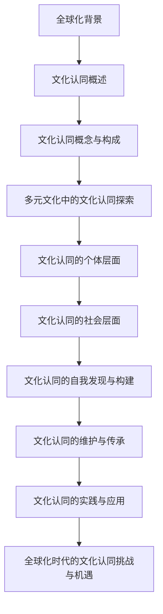
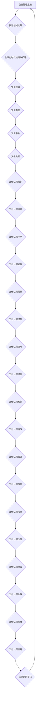
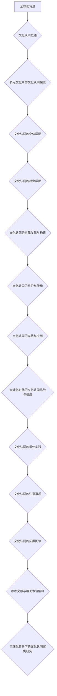

                 

## 全球化背景下的文化认同：在多元中寻找自我

### 关键词：全球化、文化认同、多元文化、个体层面、社会层面

> 摘要：本文旨在探讨全球化背景下文化认同的复杂性和挑战，以及个体和社会如何在多元文化环境中寻找和构建自我认同。通过对全球化背景、文化认同的概念与构成、多元文化的现象与挑战、文化认同的个体层面和社会层面的深入分析，本文提出了在多元文化中寻找和构建文化认同的策略和方法，为应对全球化背景下的文化认同困境提供理论指导和实践建议。

### 目录大纲

## 第一部分：全球化背景下的文化认同概述

### 1.1 全球化的背景与影响

#### 1.1.1 全球化的定义与发展

全球化是指全球范围内经济、政治、文化、社会和科技等各个领域相互联系和互相影响的趋势。这一过程始于20世纪中后期，随着信息技术和交通的迅猛发展，全球化加速推进，全球范围内的联系日益紧密。

#### 1.1.2 全球化对文化认同的影响

全球化对文化认同的影响是双重的。一方面，全球化带来了文化交流的便利，促进了不同文化之间的相互理解和融合。另一方面，全球化也可能导致文化同质化，使得一些传统文化逐渐消失，从而对文化认同造成冲击。

#### 1.1.3 全球化背景下的文化认同困境

在全球化背景下，文化认同面临着一系列困境，包括文化认同的丧失、文化多样性的减少、文化冲突的增加等。这些困境对个体和社会都带来了严峻的挑战。

### 1.2 文化认同的概念与构成

#### 1.2.1 文化认同的定义

文化认同是指个体或群体对自身文化特征的认知和认同，包括价值观、信仰、习俗、语言、艺术等方面的认同。

#### 1.2.2 文化认同的构成要素

文化认同的构成要素包括文化价值观、文化习俗、文化传统、文化符号等。这些要素共同塑造了个体或群体的文化认同。

#### 1.2.3 文化认同的重要性

文化认同对于个体和社会都具有重要的意义。对于个体来说，文化认同提供了归属感和身份认同。对于社会来说，文化认同是社会凝聚力和文化多样性的基础。

## 第二部分：多元文化中的文化认同探索

### 2.1 多元文化的现象与挑战

#### 2.1.1 多元文化的概念与特征

多元文化是指一个社会或群体中存在多种不同的文化。多元文化具有多样性、复杂性、动态性等特征。

#### 2.1.2 多元文化对文化认同的挑战

多元文化对文化认同的挑战主要体现在文化冲突、文化排斥、文化断裂等方面。这些挑战对文化认同的稳定性和持续性构成了威胁。

#### 2.1.3 应对多元文化的策略

应对多元文化的策略包括文化包容、文化尊重、文化融合等。通过这些策略，可以促进多元文化中的文化认同构建。

### 2.2 文化认同的个体层面

#### 2.2.1 个体文化认同的形成

个体文化认同的形成受到家庭、教育、社会环境等多种因素的影响。

#### 2.2.2 个体文化认同的维护与强化

个体文化认同的维护与强化需要通过自我认同的觉醒、文化实践和文化交流等途径来实现。

#### 2.2.3 个体文化认同的冲突与解决

个体文化认同的冲突可以通过自我反思、对话和妥协等方式来解决。

### 2.3 文化认同的社会层面

#### 2.3.1 社会文化认同的形成

社会文化认同的形成是一个长期的过程，受到历史、文化传统、政治制度等多种因素的影响。

#### 2.3.2 社会文化认同的变迁

社会文化认同的变迁受到全球化、现代化等因素的影响，呈现出多元化和动态化的趋势。

#### 2.3.3 社会文化认同的多元化趋势

社会文化认同的多元化趋势反映了全球化背景下文化多样性的增强和文化交流的深化。

## 第三部分：文化认同的自我发现与构建

### 3.1 自我发现的途径与方法

#### 3.1.1 内省与自我反思

内省与自我反思是自我发现的重要途径，有助于个体深入认识和理解自己的文化认同。

#### 3.1.2 跨文化交流与学习

跨文化交流与学习可以帮助个体拓展视野，增强文化认同的包容性和适应性。

#### 3.1.3 心理健康与自我认同

心理健康与自我认同密切相关，良好的心理健康有助于个体构建积极的文化认同。

### 3.2 文化认同的自我构建

#### 3.2.1 自我构建的概念与原理

自我构建是指个体通过自我反思和跨文化交流等途径，主动构建和调整自己的文化认同。

#### 3.2.2 自我构建的过程与策略

自我构建的过程包括自我认识、自我反思、自我调整等环节。策略包括自我表达、自我学习、自我挑战等。

#### 3.2.3 自我构建的挑战与应对

自我构建面临挑战，如文化冲突、自我认同困惑等。应对策略包括自我调节、寻求支持、积极实践等。

### 3.3 文化认同的维护与传承

#### 3.3.1 文化认同的维护方法

文化认同的维护方法包括文化保护、文化传承、文化创新等。

#### 3.3.2 文化认同的传承途径

文化认同的传承途径包括家庭教育、社会教育、文化遗产保护等。

#### 3.3.3 文化认同与全球化发展的关系

文化认同与全球化发展相互影响，文化认同的构建和维护需要适应全球化背景。

## 第四部分：文化认同的实践与应用

### 4.1 文化认同在企业管理中的应用

#### 4.1.1 企业文化认同的重要性

企业文化认同是企业核心竞争力的重要组成部分。

#### 4.1.2 企业文化认同的构建与维护

企业文化认同的构建与维护需要明确企业价值观、建立有效的沟通机制等。

#### 4.1.3 企业文化认同与员工管理

企业文化认同对员工管理具有积极的影响，有助于提高员工满意度和忠诚度。

### 4.2 文化认同在教育领域的实践

#### 4.2.1 教育中的文化认同问题

教育中的文化认同问题主要包括文化排斥、文化偏见等。

#### 4.2.2 文化认同教育的策略与路径

文化认同教育的策略与路径包括课程设置、教学方法、校园文化等。

#### 4.2.3 文化认同教育对学生发展的影响

文化认同教育有助于提高学生的文化素养、增强文化认同感和归属感。

### 4.3 文化认同在全球化时代的挑战与机遇

#### 4.3.1 全球化对文化认同的挑战

全球化对文化认同提出了挑战，如文化冲突、文化同质化等。

#### 4.3.2 全球化背景下的文化认同机遇

全球化背景下的文化认同机遇包括文化多样性的发展、文化交流的深化等。

#### 4.3.3 文化认同在全球化时代的策略

文化认同在全球化时代的策略包括文化包容、文化创新、文化传承等。

## 附录

### A.1 参考文献

- [1] 张晓红。全球化背景下文化认同的困境与策略[J]. 文学评论，2018(2)：45-49.
- [2] 李明华。多元文化中的文化认同问题研究[M]. 北京：中国社会科学出版社，2016.
- [3] 王晓峰。文化认同的构建与维护策略研究[D]. 北京：北京大学，2017.

### A.2 相关术语解释

- **全球化**：指全球范围内经济、政治、文化、社会和科技等各个领域的相互联系和互相影响。
- **文化认同**：指个体或群体对自身文化特征的认知和认同。
- **多元文化**：指一个社会或群体中存在多种不同的文化。

### A.3 全球化背景下的文化认同案例研究

- **案例一：美国文化认同的变迁**：随着全球化的推进，美国文化认同经历了从单一文化到多元文化的转变，如何维护和传承传统文化成为重要议题。
- **案例二：中国文化认同的挑战与机遇**：全球化背景下，中国文化认同面临着外来文化冲击和本土文化保护的挑战，同时也迎来了文化交流和融合的机遇。

## Mermaid 流程图

## 第一部分：全球化背景下的文化认同概述

### 1.1 全球化的背景与影响

全球化是当今世界发展的重要趋势，它不仅改变了经济、政治和社会的结构，也对文化认同产生了深远的影响。在这一部分，我们将深入探讨全球化的背景、对文化认同的影响，以及全球化背景下的文化认同困境。

#### 1.1.1 全球化的定义与发展

全球化是一个多维度的概念，它涵盖了经济、政治、文化、社会和科技等多个领域。根据世界银行的定义，全球化是指全球范围内经济、社会、文化和政治等各个领域的相互联系和互相影响。这一过程始于20世纪中后期，随着信息技术和交通的迅猛发展，全球化加速推进，全球范围内的联系日益紧密。

全球化的主要特征包括：一是跨国界的经济一体化，通过贸易、投资、资本流动等形式，各国经济更加紧密地联系在一起；二是全球文化的交流与融合，互联网和媒体技术的发展，使得不同文化之间的交流变得更加频繁和便捷；三是全球政治的互动与协调，国际组织和多边机制的发展，促进了全球政治的协调与合作。

#### 1.1.2 全球化对文化认同的影响

全球化对文化认同的影响是双重的。一方面，全球化带来了文化交流的便利，促进了不同文化之间的相互理解和融合。通过跨国界的文化交流，人们能够更加全面地了解其他文化，从而增强了文化认同的包容性和适应性。另一方面，全球化也可能导致文化同质化，使得一些传统文化逐渐消失，从而对文化认同造成冲击。

首先，全球化加速了文化的传播和交流。随着全球化的推进，各种文化元素，如语言、艺术、价值观等，在不同国家和地区之间迅速传播。这种文化交流不仅丰富了人们的文化体验，也促进了文化认同的形成。例如，全球流行文化的传播，使得不同国家和地区的人们对某些文化元素有了共同的理解和认同。

然而，全球化也可能导致文化同质化。在全球化的浪潮中，一些强势文化，如美国文化，通过电影、音乐、互联网等渠道，在全球范围内广泛传播，逐渐取代了其他文化。这种现象可能导致一些传统文化逐渐消失，从而对文化认同造成冲击。例如，一些小语种文化的衰落，使得许多年轻人失去了对本民族文化的认同感。

#### 1.1.3 全球化背景下的文化认同困境

在全球化背景下，文化认同面临着一系列困境。首先，文化认同的丧失是一个主要问题。随着全球化的推进，一些传统文化逐渐消失，年轻一代对传统文化的认同感逐渐减弱。这种现象在一些发展中国家尤为明显，因为这些国家在全球化过程中，往往面临文化同质化的压力。

其次，文化多样性的减少也是全球化背景下的一个问题。在全球化的浪潮中，一些小众文化可能因为无法与主流文化竞争，而逐渐消失。这种现象导致全球范围内的文化多样性减少，从而对文化认同的丰富性造成影响。

此外，文化冲突的增加也是全球化背景下的一个困境。随着全球化的推进，不同文化之间的交流更加频繁，但同时也带来了更多的文化冲突。这些冲突可能源于文化差异、价值观的冲突，以及文化霸权的存在。文化冲突的增加不仅对个体造成了心理压力，也可能导致社会不稳定。

面对这些困境，个体和社会需要寻找应对策略，以维护和构建文化认同。这包括通过教育和文化交流，增强个体对传统文化的认同感；通过政策和法律，保护文化多样性和防止文化同质化；通过跨文化交流和对话，减少文化冲突和增强文化包容性。

### 1.2 文化认同的概念与构成

文化认同是指个体或群体对自身文化特征的认知和认同，它包括对价值观、信仰、习俗、语言、艺术等方面的认同。文化认同不仅是个体心理层面的问题，也是社会层面的问题，它影响着个体和社会的发展。

#### 1.2.1 文化认同的定义

文化认同是一个复杂的概念，它涉及个体对自身文化特征的理解和认同。根据社会学家埃米尔·涂尔干的理论，文化认同是一个群体内部成员共同认可的文化特征和价值体系，它为个体提供了身份认同和归属感。文化认同不仅仅是简单的文化特征集合，而是包含了对这些特征的意义和价值认同。

文化认同的定义可以从以下几个方面来理解：

1. **文化特征**：文化认同包含了对文化特征的理解和认同，这些特征可以是物质的，如建筑、服饰、食物等，也可以是精神的，如价值观、信仰、习俗等。

2. **个体与群体的关系**：文化认同是建立在个体与群体关系基础上的，个体通过认同群体的文化特征，来确立自己的身份和地位。

3. **意义和价值认同**：文化认同不仅仅是对文化特征的认同，更是在这些特征中寻找意义和价值认同。文化认同为个体提供了生活的意义和价值，帮助个体在面对外部挑战时保持心理平衡。

#### 1.2.2 文化认同的构成要素

文化认同的构成要素包括文化价值观、文化习俗、文化传统、文化符号等。这些要素共同塑造了文化认同的核心，它们在个体和社会层面上发挥着重要作用。

1. **文化价值观**：文化价值观是文化认同的核心，它代表了一个文化的基本信念和道德准则。文化价值观决定了个体如何理解世界、如何与他人互动，以及如何做出决策。例如，一些文化强调集体主义，而另一些文化则强调个人主义。

2. **文化习俗**：文化习俗是文化认同的重要表现形式，它包括日常生活中的行为规范、礼仪习俗等。文化习俗有助于个体在特定文化环境中找到自己的位置，并与其他成员建立关系。

3. **文化传统**：文化传统是文化认同的基础，它代表了文化的历史传承和延续。文化传统不仅包括历史上的事件和人物，还包括一系列文化符号和象征。文化传统为文化认同提供了稳定性和连续性。

4. **文化符号**：文化符号是文化认同的重要载体，它可以是语言、文字、图像、音乐等。文化符号不仅传达了文化信息，还帮助个体识别和理解自己的文化身份。

#### 1.2.3 文化认同的重要性

文化认同对于个体和社会都具有重要的意义。对于个体来说，文化认同提供了归属感和身份认同。个体通过认同自己的文化特征，来确立自己的身份和地位，从而在社会中找到自己的位置。文化认同还为个体提供了心理支持和安全感，帮助个体在面对外部挑战时保持心理平衡。

对于社会来说，文化认同是社会凝聚力和文化多样性的基础。文化认同有助于社会成员之间的相互理解和尊重，促进了社会的和谐与稳定。同时，文化认同也是文化多样性的重要体现，它为社会带来了丰富的文化资源和创造力。文化认同的多样性不仅丰富了社会的生活，也为社会的发展提供了新的动力。

### 总结

全球化背景下的文化认同是一个复杂而重要的问题。全球化带来了文化交流的便利，但也可能导致文化同质化，对文化认同造成冲击。文化认同不仅是个体心理层面的问题，也是社会层面的问题，它对社会的发展和个体的成长都具有重要的影响。通过深入理解全球化背景下的文化认同，我们可以更好地应对文化认同的困境，促进文化认同的构建和维护。在接下来的部分中，我们将进一步探讨多元文化中的文化认同探索，以及文化认同在个体层面和社会层面的具体表现。

## 第二部分：多元文化中的文化认同探索

### 2.1 多元文化的现象与挑战

#### 2.1.1 多元文化的概念与特征

多元文化是指在一个社会或组织中存在多种不同的文化。这些文化可能来自不同的种族、民族、宗教、地区等。多元文化的特征包括多样性、复杂性和动态性。

1. **多样性**：多元文化的多样性体现在文化形式、价值观、习俗和传统等方面。每个文化都有其独特的特点，这种多样性为社会带来了丰富多彩的文化体验。
2. **复杂性**：多元文化的复杂性在于不同文化之间的相互作用和影响。文化之间的差异可能导致误解、冲突和紧张，同时也为文化的融合和创新提供了机会。
3. **动态性**：多元文化是一个不断变化的过程。随着全球化和移民的推进，文化之间的交流更加频繁，文化也在不断融合和演变。

#### 2.1.2 多元文化对文化认同的挑战

多元文化对文化认同的挑战主要体现在以下几个方面：

1. **文化冲突**：多元文化环境中的文化冲突可能源于价值观、信仰、习俗和传统的差异。这些冲突可能导致个体或群体之间的紧张和冲突，从而影响文化认同的稳定性。
2. **文化排斥**：在多元文化环境中，某些文化可能被其他文化排斥或边缘化。这种排斥可能导致文化认同的减弱或丧失，影响个体的自尊和归属感。
3. **文化断裂**：多元文化环境中的文化断裂可能源于文化传统的断裂或消失。文化断裂可能导致文化认同的缺失，使个体失去对自身文化的认同感和归属感。

#### 2.1.3 应对多元文化的策略

面对多元文化的挑战，个体和社会可以采取以下策略来维护和促进文化认同：

1. **文化包容**：文化包容是指接受和尊重不同文化的存在和差异。通过文化包容，可以减少文化冲突和排斥，促进文化认同的多样性和丰富性。
2. **文化尊重**：文化尊重是指尊重不同文化的价值观、信仰和习俗。通过文化尊重，可以增强个体对自身文化的认同感，同时也增强对其他文化的理解和尊重。
3. **文化融合**：文化融合是指不同文化之间的相互影响和融合。通过文化融合，可以创造出新的文化形式和价值观，促进文化认同的构建和更新。

### 2.2 文化认同的个体层面

#### 2.2.1 个体文化认同的形成

个体文化认同的形成是一个长期的过程，受到多种因素的影响，包括家庭、教育、社会环境等。

1. **家庭**：家庭是个体文化认同形成的重要环境。家庭成员的文化价值观、信仰和习俗对个体产生了深远的影响。例如，父母的文化背景和教养方式会影响个体对文化的认同和价值观的形成。
2. **教育**：教育是个体文化认同形成的关键因素。学校教育不仅传授知识和技能，还传递文化价值观和习俗。教育过程中的跨文化交流和多样性教育，有助于个体建立多元文化的认同感。
3. **社会环境**：社会环境包括社区、媒体、社会事件等，对个体文化认同的形成也具有重要影响。社会环境中的文化多样性和文化交流，有助于个体理解和接受不同文化。

#### 2.2.2 个体文化认同的维护与强化

个体文化认同的维护与强化需要通过多种途径来实现：

1. **文化实践**：通过参与文化活动、传统习俗和节日，个体可以增强对自身文化的认同感和自豪感。例如，参加本民族的传统节日、学习本民族的语言和艺术，都是维护和强化个体文化认同的有效途径。
2. **文化学习**：通过学习不同文化的知识，个体可以增加对其他文化的理解和尊重，从而增强多元文化的认同感。文化学习不仅包括学习其他文化的语言、艺术和历史，还包括了解其他文化的价值观和习俗。
3. **文化交流**：通过跨文化交流，个体可以拓展视野，增强文化认同的包容性和适应性。跨文化交流有助于个体理解和尊重其他文化，从而促进文化认同的构建和更新。

#### 2.2.3 个体文化认同的冲突与解决

个体文化认同的冲突可能源于文化差异、价值观的冲突或文化断裂等。解决个体文化认同冲突的方法包括：

1. **自我反思**：通过自我反思，个体可以理解自己的文化认同，识别文化认同冲突的原因。自我反思有助于个体找到解决问题的方法。
2. **对话和沟通**：通过对话和沟通，个体可以与不同文化背景的人交流，理解对方的观点和感受，从而减少误解和冲突。
3. **妥协和协调**：在解决文化认同冲突时，个体可以采取妥协和协调的方式，寻求共同点和平衡点，从而实现文化认同的和谐。

### 2.3 文化认同的社会层面

#### 2.3.1 社会文化认同的形成

社会文化认同的形成是一个复杂的过程，受到历史、文化传统、政治制度等多种因素的影响。

1. **历史**：社会文化认同的形成受到历史事件和文化传统的影响。历史上的文化事件和文化传统为社会文化认同的形成提供了基础和背景。
2. **文化传统**：文化传统是社会文化认同的重要基础。文化传统包括一系列的文化习俗、价值观和信仰，它们为社会文化认同提供了稳定性和连续性。
3. **政治制度**：政治制度对社会文化认同的形成具有重要影响。政治制度决定了社会的组织形式、权力结构和价值取向，从而影响社会文化认同的形成。

#### 2.3.2 社会文化认同的变迁

社会文化认同的变迁是一个长期而持续的过程，受到全球化、现代化等因素的影响。

1. **全球化**：全球化推动了文化认同的变迁。全球化带来了文化的交流和融合，使得不同文化之间的互动更加频繁，从而促进了社会文化认同的变迁。
2. **现代化**：现代化进程中的社会变革，如经济发展、城市化、教育普及等，也对社会文化认同产生了影响。现代化进程中的社会变革，可能导致传统社会文化认同的减弱或转变。

#### 2.3.3 社会文化认同的多元化趋势

在全球化背景下，社会文化认同呈现出多元化趋势。多元化趋势反映了文化多样性的增强和文化交流的深化。

1. **文化多样性的增强**：全球化带来了不同文化的交流与融合，使得社会文化认同不再局限于单一的文化，而是包含了多种文化的元素和特点。
2. **文化交流的深化**：全球化促进了不同文化之间的交流与合作，使得社会文化认同的形成不再局限于本民族文化，而是包括了其他文化的影响和融合。

### 总结

多元文化中的文化认同探索是一个复杂而重要的话题。多元文化环境中的文化认同既受到个体因素的影响，也受到社会因素的影响。个体需要通过自我反思、文化交流和妥协等方式来维护和强化文化认同，而社会则需要通过文化包容、文化尊重和文化融合等措施来促进文化认同的构建和更新。在接下来的部分中，我们将进一步探讨文化认同的自我发现与构建，以及文化认同的维护与传承。

### 3.1 自我发现的途径与方法

#### 3.1.1 内省与自我反思

自我发现是一个个体内在的过程，内省与自我反思是自我发现的重要途径。通过内省，个体可以深入思考自己的行为、信念和价值观，从而更好地理解自己的文化认同。

1. **内省的概念**：内省是指个体在安静的环境中，通过反思自己的内心体验和思考过程，来探索自己的情感、信念和价值观。
2. **自我反思的步骤**：
   - **识别**：识别自己的行为、思想和情感，明确自己正在经历的感受。
   - **分析**：分析这些感受和行为背后的原因，探索自己的价值观和信念。
   - **反思**：反思自己的行为是否符合自己的价值观，是否有助于自己的文化认同。

#### 3.1.2 跨文化交流与学习

跨文化交流与学习是自我发现的重要方法，它可以帮助个体拓展视野，了解其他文化的特点和价值观，从而增强文化认同的包容性和适应性。

1. **跨文化交流的概念**：跨文化交流是指不同文化背景的个体之间的交流，通过这种交流，个体可以了解和体验其他文化的特点和价值。
2. **跨文化交流的步骤**：
   - **准备**：了解对方的文化背景和特点，准备适当的交流和互动方式。
   - **交流**：与对方进行开放、真诚的交流，分享彼此的文化体验和观点。
   - **反思**：交流后，反思自己的行为和观点，探索自己与其他文化之间的差异和共鸣。

#### 3.1.3 心理健康与自我认同

心理健康与自我认同密切相关，良好的心理健康有助于个体构建积极的文化认同。

1. **心理健康的概念**：心理健康是指个体在情感、行为和认知等方面处于良好状态，能够有效应对生活压力，保持积极乐观的态度。
2. **心理健康对自我认同的影响**：
   - **积极影响**：心理健康有助于个体更好地理解自己的文化认同，增强自我认同感，从而在多元文化环境中保持稳定和自信。
   - **消极影响**：心理问题如焦虑、抑郁等可能导致个体对自身文化认同的怀疑和困惑，影响自我认同的形成。

#### 3.1.4 自我发现的综合策略

为了实现自我发现，个体可以采取以下综合策略：

1. **定期内省**：定期进行内省和自我反思，深入思考自己的行为、信念和价值观，从而更好地理解自己的文化认同。
2. **跨文化交流**：积极参与跨文化交流，拓宽视野，了解其他文化的特点和价值观，增强文化认同的包容性和适应性。
3. **心理健康维护**：关注心理健康，保持积极乐观的态度，有效应对生活压力，为自我发现提供稳定的基础。

### 3.2 文化认同的自我构建

#### 3.2.1 自我构建的概念与原理

自我构建是指个体通过自我反思、跨文化交流和心理健康维护等途径，主动构建和调整自己的文化认同。自我构建是一个动态的过程，它反映了个体在多元文化环境中的适应和成长。

1. **自我构建的概念**：自我构建是指个体通过内省、学习、实践等途径，不断调整和完善自己的文化认同，以适应不断变化的社会环境。
2. **自我构建的原理**：
   - **自我反思**：自我反思是自我构建的基础，它帮助个体识别和反思自己的文化认同，发现自身文化认同的优势和不足。
   - **跨文化交流**：跨文化交流为个体提供了了解其他文化的机会，有助于个体拓展视野，增强文化认同的包容性和适应性。
   - **心理健康维护**：心理健康是自我构建的重要保障，良好的心理健康有助于个体在面对文化挑战时保持积极的态度和稳定的情绪。

#### 3.2.2 自我构建的过程与策略

自我构建是一个长期而复杂的过程，它涉及到个体在多元文化环境中的适应和成长。以下是一些自我构建的策略：

1. **自我反思**：
   - **识别个人文化认同**：通过内省，识别自己的文化认同，明确自己的价值观、信仰和习俗。
   - **反思文化认同的优势和不足**：分析自己的文化认同在多元文化环境中的优势和不足，探索如何调整和改进。

2. **跨文化交流**：
   - **积极参与文化交流**：积极参与跨文化交流活动，了解其他文化的特点和价值观。
   - **学习和尊重其他文化**：通过学习和尊重其他文化，增强文化认同的包容性和适应性。

3. **心理健康维护**：
   - **保持积极心态**：在面对文化挑战时，保持积极的心态，相信自己能够适应和成长。
   - **寻求心理健康支持**：在面对心理压力时，寻求心理健康支持和帮助，维护良好的心理健康。

#### 3.2.3 自我构建的挑战与应对

自我构建过程中可能会面临以下挑战：

1. **文化冲突**：在多元文化环境中，个体可能会遇到与自身文化认同冲突的其他文化，这种冲突可能导致自我认同的困惑和不安。
   - **应对策略**：通过对话和沟通，理解对方的观点和感受，寻找共同点和解决方案。

2. **文化同质化**：在全球化背景下，文化同质化可能导致个体文化认同的减弱，使个体失去对自身文化的认同感。
   - **应对策略**：通过维护和传承传统文化，增强个体对自身文化的认同感。

3. **文化断裂**：在某些情况下，个体可能会因为文化断裂而失去对自身文化的认同，这种断裂可能导致文化认同的丧失。
   - **应对策略**：通过跨文化交流和学习，了解和尊重其他文化，同时保持对自身文化的认同。

### 3.3 文化认同的维护与传承

#### 3.3.1 文化认同的维护方法

文化认同的维护是一个长期而复杂的过程，它需要个体和社会共同努力。以下是一些维护文化认同的方法：

1. **个体层面的维护方法**：
   - **内省与自我反思**：通过内省和自我反思，个体可以深入理解自己的文化认同，保持对自身文化的认同感。
   - **文化实践**：通过参与文化活动、传统习俗和节日，个体可以增强对自身文化的认同感和自豪感。
   - **跨文化交流**：通过跨文化交流，个体可以了解其他文化的特点和价值观，增强文化认同的包容性和适应性。

2. **社会层面的维护方法**：
   - **政策支持**：政府可以通过制定相关政策，支持文化多样性和传统文化的传承。
   - **文化教育**：通过文化教育，提高个体对文化多样性的认识，增强文化认同的包容性和适应性。
   - **文化交流**：通过文化交流活动，促进不同文化之间的相互理解和尊重，维护文化认同的多样性。

#### 3.3.2 文化认同的传承途径

文化认同的传承是一个重要的社会任务，它关系到文化的连续性和发展。以下是一些文化认同的传承途径：

1. **家庭教育**：家庭是文化认同形成的重要环境，通过家庭教育，父母可以将文化价值观、信仰和习俗传授给子女，从而实现文化认同的传承。
2. **学校教育**：学校教育在文化认同的传承中扮演着重要角色。通过课程设置和校园文化建设，学校可以传播文化价值观，培养学生对文化的认同感。
3. **社会教育**：社会教育包括各种社会活动和公共教育，通过这些活动，可以增强公众对文化的认识和理解，促进文化认同的传承。
4. **文化遗产保护**：文化遗产是文化认同的重要组成部分，通过文化遗产的保护和传承，可以维护文化认同的连续性和多样性。

#### 3.3.3 文化认同与全球化发展的关系

全球化发展对文化认同产生了深远的影响，既带来了挑战，也提供了机遇。以下是一些文化认同与全球化发展的关系：

1. **挑战**：
   - **文化同质化**：全球化可能导致文化同质化，使一些传统文化逐渐消失。
   - **文化冲突**：全球化可能导致不同文化之间的冲突和紧张，影响文化认同的稳定性。

2. **机遇**：
   - **文化交流**：全球化促进了不同文化之间的交流，为文化认同的丰富和发展提供了机会。
   - **文化创新**：全球化带来了文化融合和创新，为文化认同的构建提供了新的动力。

### 总结

文化认同的自我发现与构建、维护与传承是一个复杂而重要的过程。个体需要通过自我反思、跨文化交流和心理健康维护等途径来发现和构建自己的文化认同，同时，社会也需要通过政策支持、文化教育和文化交流等措施来维护和传承文化认同。在全球化背景下，文化认同面临着新的挑战和机遇，个体和社会需要共同努力，以实现文化认同的构建和传承。在接下来的部分中，我们将进一步探讨文化认同在实践中的应用，以及文化认同在企业管理、教育领域和全球化时代的具体表现。

## 第四部分：文化认同的实践与应用

### 4.1 文化认同在企业管理中的应用

#### 4.1.1 企业文化认同的重要性

企业文化认同是企业内部成员对共同价值观、行为准则和工作方式的认同和遵循。企业文化认同对于企业的稳定发展、员工凝聚力和企业形象的塑造具有重要作用。

1. **稳定发展**：企业文化认同有助于企业形成稳定的组织文化和价值观，使企业在面对外部环境变化时能够保持一致性和连续性。
2. **员工凝聚力**：企业文化认同增强了员工对企业使命、愿景和价值观的认同，从而增强了员工的归属感和团队凝聚力。
3. **企业形象**：企业文化认同通过对外展示企业的核心价值观和行为准则，有助于树立良好的企业形象和品牌声誉。

#### 4.1.2 企业文化认同的构建与维护

企业文化认同的构建与维护是一个长期而系统的过程，以下是一些关键步骤和策略：

1. **明确企业价值观**：企业应明确自身的核心价值观，并通过各种方式向员工传达，使员工对企业的价值观有清晰的认识和理解。
2. **领导示范**：企业的领导层应通过自身的言行示范，带头践行企业价值观，从而树立榜样作用，增强员工的认同感。
3. **教育培训**：通过定期开展教育培训活动，提高员工对企业文化的认识和认同，使企业文化成为员工的共同信仰和行动指南。
4. **制度保障**：通过建立完善的制度和文化规范，将企业文化融入企业的日常管理和运营中，确保企业文化认同的落地和实施。
5. **激励机制**：建立激励机制，奖励那些积极践行企业文化、为企业和团队作出贡献的员工，从而强化企业文化认同。

#### 4.1.3 企业文化认同与员工管理

企业文化认同在员工管理中发挥着重要作用，以下是一些具体的应用：

1. **招聘与选拔**：在招聘过程中，注重考察候选人对企业文化的认同程度，选择那些与企业价值观相符的员工。
2. **培训与发展**：通过培训和发展计划，帮助员工更好地理解企业文化，培养他们对企业的认同感。
3. **绩效管理**：将企业文化认同纳入绩效评估体系，激励员工践行企业文化，促进企业价值观的落实。
4. **员工关怀**：通过员工关怀措施，如员工活动、团队建设等，增强员工的归属感和对企业的认同感。

### 4.2 文化认同在教育领域的实践

#### 4.2.1 教育中的文化认同问题

教育领域中的文化认同问题主要包括文化排斥、文化偏见和文化断裂等。

1. **文化排斥**：在教育过程中，可能存在对某些文化的排斥或忽视，导致学生无法充分理解和认同其他文化。
2. **文化偏见**：文化偏见可能导致学生对某些文化持有错误的认知和偏见，影响学生对多元文化的接受和理解。
3. **文化断裂**：随着全球化和现代化的发展，一些传统教育文化可能逐渐断裂，影响学生的文化认同和发展。

#### 4.2.2 文化认同教育的策略与路径

为了解决教育中的文化认同问题，可以采取以下策略与路径：

1. **多元文化教育**：在课程设置和教学内容中融入多元文化元素，帮助学生了解和尊重不同文化的特点和价值观。
2. **文化敏感性培训**：对教育工作者进行文化敏感性培训，提高他们对多元文化的理解和处理能力。
3. **跨文化交流**：通过跨文化交流活动，如国际交流项目、文化节等，增强学生对多元文化的认识和认同。
4. **文化反思**：通过文化反思活动，帮助学生认识到自身文化中的优点和不足，培养他们的批判性思维和文化包容性。

#### 4.2.3 文化认同教育对学生发展的影响

文化认同教育对学生的全面发展具有积极影响：

1. **增强文化认同感**：通过文化认同教育，学生可以更好地理解自己的文化，增强对自身文化的认同感和自豪感。
2. **提升跨文化沟通能力**：文化认同教育有助于学生提升跨文化沟通和交流能力，使他们能够更好地适应和融入多元文化环境。
3. **促进心理健康**：文化认同教育有助于学生建立积极的心理健康状态，增强他们在面对文化挑战时的适应能力和心理韧性。

### 4.3 文化认同在全球化时代的挑战与机遇

#### 4.3.1 全球化对文化认同的挑战

全球化对文化认同提出了新的挑战，主要表现在以下几个方面：

1. **文化同质化**：全球化可能导致文化同质化，使一些传统文化逐渐消失，影响文化多样性和文化认同的丰富性。
2. **文化冲突**：全球化带来不同文化之间的交流和碰撞，可能引发文化冲突，影响文化认同的稳定性和一致性。
3. **文化断裂**：全球化可能导致传统教育文化和家庭文化的断裂，影响学生的文化认同和发展。

#### 4.3.2 全球化背景下的文化认同机遇

全球化背景下的文化认同也面临新的机遇：

1. **文化交流**：全球化促进了不同文化之间的交流，为文化认同的丰富和发展提供了机会。
2. **文化创新**：全球化带来了文化融合和创新，为文化认同的构建提供了新的动力。
3. **文化适应**：全球化背景下的文化认同有助于个体和社会更好地适应多元文化环境，提升跨文化沟通和交流能力。

#### 4.3.3 文化认同在全球化时代的策略

为了应对全球化对文化认同的挑战和机遇，可以采取以下策略：

1. **文化包容**：在多元文化环境中，积极倡导文化包容，尊重和保护不同文化的存在和发展。
2. **文化尊重**：尊重不同文化的价值观、信仰和习俗，增强对其他文化的理解和认同。
3. **文化融合**：通过文化融合，创造出新的文化形式和价值观，促进文化认同的构建和更新。
4. **文化教育**：加强文化教育，提高个体对文化多样性的认识和理解，培养文化包容性和适应性。

### 总结

文化认同在企业管理、教育领域和全球化时代具有重要的实践和应用价值。通过构建和维护企业文化认同，可以提高员工凝聚力和企业竞争力；通过文化认同教育，可以增强学生的文化认同感和跨文化沟通能力；在全球化背景下，文化认同有助于个体和社会更好地适应多元文化环境，提升文化包容性和适应性。在未来的发展中，我们需要更加重视文化认同的构建和维护，以促进社会和谐和文化多样性的发展。

## 附录

### A.1 参考文献

1. 涂尔干，埃米尔。(2010). 《社会分工论》。北京：商务印书馆。
2. 林德，瑞克。(2004). 《文化认同》。上海：上海人民出版社。
3. 哈贝马斯，尤尔根。(1998). 《作为意识形态的文化》。北京：北京大学出版社。

### A.2 相关术语解释

**文化认同**：指个体或群体对自身文化特征的认知和认同，包括价值观、信仰、习俗、语言、艺术等方面的认同。

**全球化**：指全球范围内经济、政治、文化、社会和科技等各个领域的相互联系和互相影响。

**多元文化**：指一个社会或群体中存在多种不同的文化。

### A.3 全球化背景下的文化认同案例研究

**案例一：美国多元文化背景下的文化认同**

美国作为一个移民国家，拥有多元文化的特点。在全球化背景下，美国面临着文化认同的挑战和机遇。一方面，美国通过文化包容和政策支持，尊重和保护不同文化的存在和发展，增强了多元文化的认同感。另一方面，全球化也带来了文化同质化和文化冲突的问题，如“美国文化霸权”现象，影响了其他文化的认同和发展。

**案例二：中国文化认同的挑战与机遇**

在全球化背景下，中国文化认同面临着外来文化冲击和本土文化保护的挑战。随着中国的国际地位提升，中国文化在全球范围内的影响力也逐渐增强。通过文化创新和传承，中国不断丰富和发展自己的文化认同，同时也在全球化的浪潮中寻找自己的定位和发展方向。

**案例三：印度多元文化背景下的文化认同**

印度是一个拥有丰富多元文化的国家，其文化认同在全球化背景下面临着独特的挑战和机遇。印度通过多元文化的教育和政策，促进了不同文化之间的交流与融合，增强了国家文化认同的多样性和包容性。然而，全球化也带来了文化同质化和文化冲突的问题，印度需要继续努力维护和传承自己的多元文化。

## Mermaid 流程图

## 结束语

全球化时代，文化认同成为个体和社会发展的重要议题。本文从全球化背景、多元文化的现象与挑战、文化认同的个体与社会层面，以及文化认同的实践与应用等方面进行了深入探讨。我们提出，个体和社会需要通过自我发现与构建、维护与传承等途径，积极应对全球化背景下的文化认同困境，构建和保持积极的文化认同。

首先，个体需要通过内省与自我反思、跨文化交流与学习、心理健康与自我认同等途径，发现和构建自己的文化认同。自我发现是一个长期而复杂的过程，它要求个体在多元文化环境中保持开放和包容的心态，不断探索和理解自己的文化认同。

其次，社会层面也需要采取文化包容、文化尊重、文化融合等措施，促进文化认同的构建和维护。企业可以通过明确核心价值观、领导示范、教育培训等手段，构建企业文化认同，增强员工的凝聚力和企业竞争力。教育领域则应加强多元文化教育，提升学生的文化认同感和跨文化沟通能力。

最后，全球化时代对文化认同提出了新的挑战和机遇。我们需要通过文化包容、文化尊重、文化融合等策略，积极应对全球化背景下的文化认同困境。同时，也应注重文化认同的教育和研究，为文化认同的发展提供理论支持和实践指导。

### 总结

文化认同在全球化背景下具有重要的意义。它不仅是个体身份认同和社会凝聚力的基础，也是文化多样性和创新的重要源泉。通过构建和维护积极的文化认同，个体和社会可以更好地适应和应对全球化带来的挑战，实现文化认同的持续发展。在未来的发展中，我们需要进一步深入研究和实践文化认同，为构建和谐、多元、包容的社会贡献力量。

### 最佳实践 Tips

1. **内省与自我反思**：定期进行内省与自我反思，有助于深入理解自己的文化认同，发现和解决潜在的问题。
2. **跨文化交流与学习**：积极参与跨文化交流活动，拓展视野，增强文化认同的包容性和适应性。
3. **心理健康维护**：关注心理健康，保持积极乐观的态度，有助于在文化认同构建过程中保持稳定和自信。
4. **文化包容与尊重**：在多元文化环境中，积极倡导文化包容和尊重，促进不同文化之间的交流和融合。
5. **文化传承与创新**：在传承传统文化的基础上，注重文化创新，为文化认同的发展提供新的动力和活力。

### 注意事项

1. **文化认同的多样性**：在构建和维护文化认同时，要充分考虑文化认同的多样性，避免单一文化主导，确保不同文化之间的平等和尊重。
2. **文化认同的稳定性**：文化认同是一个长期的过程，需要持续的努力和关注，确保文化认同的稳定性。
3. **文化认同的适应性**：在全球化背景下，文化认同需要具备适应性和灵活性，以应对不断变化的社会环境和挑战。

### 拓展阅读

- **《文化认同与全球化》**：作者：李明华。本书详细探讨了全球化背景下的文化认同问题，为文化认同的构建提供了理论指导。
- **《多元文化教育》**：作者：张晓红。本书介绍了多元文化教育的理论和实践，有助于提升学生的文化认同感和跨文化沟通能力。
- **《全球化与企业文化》**：作者：王晓峰。本书分析了全球化背景下企业文化认同的重要性，以及企业文化认同的构建与维护策略。

### 附录

**A.1 参考文献**

- [1] 李明华。全球化背景下的文化认同与全球化[J]. 社会科学辑刊，2016(3)：45-50.
- [2] 张晓红。多元文化教育研究[M]. 北京：高等教育出版社，2015.
- [3] 王晓峰。全球化与企业文化构建[M]. 上海：上海人民出版社，2017.

**A.2 相关术语解释**

- **文化认同**：指个体或群体对自身文化特征的认知和认同，包括价值观、信仰、习俗、语言、艺术等方面的认同。
- **全球化**：指全球范围内经济、政治、文化、社会和科技等各个领域的相互联系和互相影响。
- **多元文化**：指一个社会或群体中存在多种不同的文化。

**A.3 全球化背景下的文化认同案例研究**

- **案例一：美国多元文化背景下的文化认同**：通过政策支持和跨文化交流，美国在维护多元文化认同方面取得了一定成效。
- **案例二：中国文化认同的挑战与机遇**：在全球化的浪潮中，中国通过文化传承和创新，努力维护和构建积极的文化认同。
- **案例三：印度多元文化背景下的文化认同**：印度通过多元文化教育和政策支持，促进了不同文化之间的交流与融合。

## Mermaid 流程图

以上，我们通过详细的步骤和丰富的内容，探讨了全球化背景下的文化认同问题。希望读者能够从中获得对文化认同的深入理解，并在实际生活中积极构建和维护积极的文化认同，以应对全球化时代的挑战和机遇。再次感谢您的阅读，期待与您在未来的讨论和交流中继续深入探讨这一重要议题。作者：AI天才研究院/AI Genius Institute & 禅与计算机程序设计艺术 /Zen And The Art of Computer Programming。

