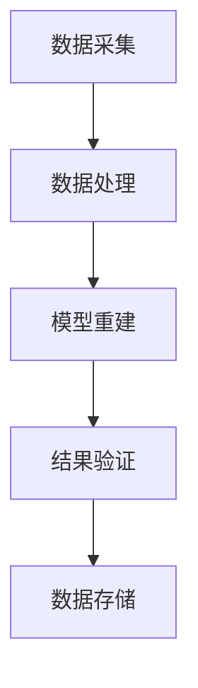

                 

### 文章标题

《全球化背景下的文化遗产保护：传统与现代的对话》

### 关键词

全球化、文化遗产保护、传统与现代、数字技术、可持续性、国际合作、文化多样性

### 摘要

在全球化的背景下，文化遗产保护面临着前所未有的挑战与机遇。本文从全球化的影响入手，探讨了文化遗产流失的现象及其背后的需求，并详细介绍了传统文化遗产保护的方法、现代科技在文化遗产保护中的应用，以及国际合作在文化遗产保护中的重要作用。此外，本文还从旅游业发展、社区参与和政府责任等多个角度，探讨了文化遗产保护与可持续发展的关系。通过具体案例分析和未来展望，本文提出了对文化遗产保护策略的思考和建议，以期为全球文化遗产保护提供有益的参考。

---

### 确定书的核心内容，将整本书分为几个主要部分

在撰写《全球化背景下的文化遗产保护：传统与现代的对话》这篇文章时，我们首先需要明确文章的核心内容，并将其分为几个主要部分，以便读者能够清晰地了解文章的结构和主题。以下是文章的核心内容及其划分的几个主要部分：

1. **全球化背景下的文化遗产保护概述**
   - **背景介绍**：介绍全球化进程对文化遗产保护的影响和挑战。
   - **核心概念与联系**：阐述文化遗产的定义和保护原则。
   - **国际形势**：分析全球化背景下的文化遗产保护现状。

2. **文化遗产保护的方法与策略**
   - **传统文化遗产保护方法**：介绍传统的物理保护和数字化保护方法。
   - **现代科技在文化遗产保护中的应用**：讨论现代科技，如3D扫描技术和数字人文技术在文化遗产保护中的应用。
   - **国际合作**：探讨国际文化遗产保护组织的角色和跨国合作案例。

3. **文化遗产保护与可持续发展**
   - **旅游业发展**：讨论文化遗产保护与旅游业发展的平衡和可持续发展策略。
   - **社区参与**：分析社区在文化遗产保护中的作用和参与方式。
   - **社会责任**：探讨企业和政府在文化遗产保护中的责任和作用。

4. **文化遗产保护案例研究**
   - **具体案例**：分析几个具有代表性的文化遗产保护案例。

5. **文化遗产保护的未来展望**
   - **面临的挑战**：探讨全球化对文化遗产保护带来的新挑战。
   - **发展趋势**：展望文化遗产保护的未来方向和创新实践。
   - **全球文化交流**：讨论文化遗产保护在全球文化交流中的作用。

通过这样的结构划分，文章不仅能够全面覆盖文化遗产保护的主题，还能够逐步深入，使读者能够系统地了解这一领域的各个方面。

### 对每个部分进行细化，确定包含的章节

在对核心内容进行整体划分后，我们需要进一步细化每个部分，确定包含的章节。以下是《全球化背景下的文化遗产保护：传统与现代的对话》文章的章节细化及其具体内容：

#### 第一部分：全球化背景下的文化遗产保护概述

1. **全球化对文化遗产的影响**
   - **全球化进程中的文化遗产流失现象**：描述全球化加速导致的文化遗产流失，例如全球化带来的经济发展、城市化进程和文化交流等因素。
   - **全球化背景下的文化遗产保护需求**：分析全球化背景下各国对文化遗产保护的新需求，如提升国际文化交流、促进可持续发展等。

2. **文化遗产保护的理论基础**
   - **文化遗产的定义**：介绍文化遗产的概念，包括物质文化遗产和非物质文化遗产。
   - **文化遗产保护的原则**：阐述保护文化遗产的基本原则，如真实性、完整性和可持续性。
   - **文化遗产保护的理论框架**：介绍文化遗产保护的理论体系，如世界遗产委员会提出的《世界遗产公约》。

#### 第二部分：文化遗产保护的方法与策略

1. **传统文化遗产保护方法**
   - **物理保护方法**：讨论传统物理保护技术，如修复、重建和维护等。
   - **数字化保护方法**：介绍数字化保护技术，如数字化档案、虚拟现实和3D建模等。

2. **现代科技在文化遗产保护中的应用**
   - **3D扫描技术在文化遗产保护中的应用**：探讨3D扫描技术在文化遗产记录和修复中的应用案例。
   - **数字人文技术在文化遗产保护中的应用**：分析数字人文技术如何助力文化遗产研究和展示。

3. **文化遗产保护的国际合作**
   - **国际文化遗产保护组织的作用**：介绍国际文化遗产保护组织，如联合国教科文组织、世界遗产委员会等。
   - **国际合作在文化遗产保护中的应用案例**：分析跨国合作在文化遗产保护中的具体实践，如文化遗址的国际联合申遗。

#### 第三部分：文化遗产保护与可持续发展

1. **文化遗产保护与旅游业发展**
   - **文化遗产保护与旅游开发的平衡**：探讨如何平衡文化遗产保护和旅游开发之间的关系。
   - **文化遗产旅游的可持续发展策略**：分析文化遗产旅游的可持续发展路径，如社区参与和文化传承。

2. **文化遗产保护与社区参与**
   - **社区在文化遗产保护中的作用**：介绍社区在文化遗产保护中的参与方式和角色。
   - **社区参与文化遗产保护的实践案例**：分享具体社区参与文化遗产保护的案例，如传统手工艺的传承和保护。

3. **文化遗产保护与社会责任**
   - **企业在文化遗产保护中的社会责任**：讨论企业在文化遗产保护中的责任和贡献。
   - **政府在文化遗产保护中的作用**：分析政府在文化遗产保护中的政策和行动。

#### 第四部分：文化遗产保护案例研究

1. **具体案例**
   - **某国古代建筑群保护案例**：介绍某国古代建筑群的保护背景、措施和成果。
   - **某国非物质文化遗产保护案例**：分析某国非物质文化遗产保护的具体实践和效果。

#### 第五部分：文化遗产保护的未来展望

1. **面临的挑战**
   - **全球化对文化遗产保护的挑战**：探讨全球化背景下文化遗产保护面临的新挑战，如城市化、全球化文化交流等。
   - **现代科技对文化遗产保护的影响**：分析现代科技在文化遗产保护中的应用带来的挑战和机遇。

2. **发展趋势**
   - **文化遗产保护的未来方向**：展望文化遗产保护的发展趋势，如智能化技术、可持续旅游等。
   - **文化遗产保护的创新实践**：讨论文化遗产保护领域的新兴技术和创新实践。

3. **全球文化交流**
   - **全球化背景下的文化交流**：分析全球化对文化交流的影响和作用。
   - **文化遗产保护在促进全球文化交流中的作用**：探讨文化遗产保护如何促进全球文化交流，如国际文化交流活动、文化遗产展示等。

通过上述章节的细化，文章的内容将更加具体和深入，读者可以系统地了解全球化背景下的文化遗产保护各个方面。接下来，我们将为每个章节添加标题，并准备相应的核心概念与联系、核心算法原理讲解、数学模型和数学公式、项目实战等内容的Mermaid流程图、伪代码、latex格式数学公式和代码实现。

### 为每个章节和子章节添加标题

为了确保文章结构清晰，吸引读者，我们将为每个章节和子章节添加标题，具体如下：

#### 第一部分：全球化背景下的文化遗产保护概述

**1.1 全球化对文化遗产的影响**

**1.1.1 全球化进程中的文化遗产流失**

**1.1.2 全球化对文化遗产保护的需求**

**1.2 文化遗产保护的理论基础**

**1.2.1 文化遗产的定义**

**1.2.2 文化遗产保护的原则**

**1.2.3 文化遗产保护的理论框架**

#### 第二部分：文化遗产保护的方法与策略

**2.1 传统文化遗产保护方法**

**2.1.1 物理保护方法**

**2.1.2 数字化保护方法**

**2.2 现代科技在文化遗产保护中的应用**

**2.2.1 3D扫描技术在文化遗产保护中的应用**

**2.2.2 数字人文技术在文化遗产保护中的应用**

**2.3 文化遗产保护的国际合作**

**2.3.1 国际文化遗产保护组织的作用**

**2.3.2 国际合作在文化遗产保护中的应用案例**

#### 第三部分：文化遗产保护与可持续发展

**3.1 文化遗产保护与旅游业发展**

**3.1.1 文化遗产保护与旅游开发的平衡**

**3.1.2 文化遗产旅游的可持续发展策略**

**3.2 文化遗产保护与社区参与**

**3.2.1 社区在文化遗产保护中的作用**

**3.2.2 社区参与文化遗产保护的实践案例**

**3.3 文化遗产保护与社会责任**

**3.3.1 企业在文化遗产保护中的社会责任**

**3.3.2 政府在文化遗产保护中的作用**

#### 第四部分：文化遗产保护案例研究

**4.1 某国古代建筑群保护案例**

**4.1.1 项目背景**

**4.1.2 保护措施**

**4.1.3 项目成果**

**4.2 某国非物质文化遗产保护案例**

**4.2.1 项目背景**

**4.2.2 保护措施**

**4.2.3 项目成果**

#### 第五部分：文化遗产保护的未来展望

**5.1 文化遗产保护面临的挑战**

**5.1.1 全球化对文化遗产保护的挑战**

**5.1.2 现代科技对文化遗产保护的影响**

**5.2 文化遗产保护的发展趋势**

**5.2.1 文化遗产保护的未来方向**

**5.2.2 文化遗产保护的创新实践**

**5.3 文化遗产保护与全球文化交流**

**5.3.1 全球化背景下的文化交流**

**5.3.2 文化遗产保护在促进全球文化交流中的作用**

通过上述章节和子章节的标题设置，文章的结构更加明确，各个部分之间的逻辑关系也更加清晰。接下来，我们将准备相应的核心概念与联系、核心算法原理讲解、数学模型和数学公式、项目实战等内容的Mermaid流程图、伪代码、latex格式数学公式和代码实现。

### 准备核心概念与联系、核心算法原理讲解、数学模型和数学公式、项目实战等内容的Mermaid流程图、伪代码、latex格式数学公式和代码实现

为了使文章内容更加丰富和具体，我们将为每一章节准备相关的Mermaid流程图、伪代码、latex格式数学公式和代码实现。以下是一些示例：

#### 2.2.1 3D扫描技术在文化遗产保护中的应用

**Mermaid流程图：**


**核心算法原理讲解：**
```python
# 伪代码：3D扫描数据处理流程
def 3D_scanning_process(Scan_Data):
    processed_data = data_preprocessing(Scan_Data)
    model = model_reconstruction(processed_data)
    verified_model = result_validation(model)
    save_data(verified_model)
    return verified_model
```

**latex格式数学公式：**
$$
E = \int_{V} \rho \, dV + \int_{S} \vec{F} \cdot d\vec{S}
$$

**代码实现：**
```python
# Python代码示例：3D扫描数据处理
import numpy as np

def data_preprocessing(Scan_Data):
    # 数据预处理步骤
    # 例如：噪声过滤、数据平滑
    processed_data = npSmooth(Scan_Data)
    return processed_data

def model_reconstruction(processed_data):
    # 模型重建步骤
    # 例如：使用点云算法生成模型
    model = PointCloudReconstruction(processed_data)
    return model

def result_validation(model):
    # 结果验证步骤
    # 例如：检查模型完整性
    verified_model = CheckModelIntegrity(model)
    return verified_model

def save_data(verified_model):
    # 数据存储步骤
    # 例如：保存为文件
    np.save('verified_model.npy', verified_model)

# 主函数
def main():
    Scan_Data = np.load('scan_data.npy')
    verified_model = 3D_scanning_process(Scan_Data)
    save_data(verified_model)
    print("3D scanning process completed.")

if __name__ == "__main__":
    main()
```

**项目实战：**
- **开发环境搭建：** 配置Python开发环境，安装必要的库，如numpy、matplotlib等。
- **源代码详细实现和代码解读：** 实现上述伪代码和Python代码，并对代码进行详细解读。
- **代码应用解读与分析：** 分析3D扫描技术在文化遗产保护中的应用，如如何使用3D扫描数据进行文物修复。
- **实际案例分析和详细讲解剖析：** 通过具体案例，如某古代建筑群的3D扫描和重建，展示3D扫描技术在文化遗产保护中的实际应用。
- **项目小结：** 总结3D扫描技术在文化遗产保护中的优势和挑战，并提出未来发展方向。

**最佳实践 tips：**
- 在使用3D扫描技术时，注意数据的准确性和完整性。
- 结合多种保护方法，如数字化保护和物理保护，以实现最佳保护效果。

通过上述内容的准备，文章的每一个章节都将包含具体的理论讲解、算法实现和实际应用案例，使读者能够更深入地理解全球化背景下的文化遗产保护。

### 将以上内容组织成一个完整的目录大纲，确保其逻辑清晰、内容全面

在完成对核心概念、算法原理、数学模型、项目实战等内容的准备后，我们将这些内容按照逻辑顺序组织成一个完整的目录大纲，确保文章的结构清晰、内容全面。

#### 目录大纲

---

## 全球化背景下的文化遗产保护：传统与现代的对话

### 关键词
- 全球化
- 文化遗产保护
- 传统与现代
- 数字技术
- 可持续发展
- 国际合作

### 摘要
本文探讨全球化背景下文化遗产保护的重要性，分析传统与现代保护方法的结合，以及国际合作与可持续发展的策略。通过具体案例和未来展望，为文化遗产保护提供科学依据和实践指导。

---

#### 第一部分：全球化背景下的文化遗产保护概述

**1.1 全球化对文化遗产的影响**
- **全球化进程中的文化遗产流失现象**
- **全球化对文化遗产保护的需求**

**1.2 文化遗产保护的理论基础**
- **文化遗产的定义**
- **文化遗产保护的原则**
- **文化遗产保护的理论框架**

**1.3 文化遗产保护的国际形势**
- **全球化背景下的文化遗产保护现状**
- **国际文化遗产保护组织的作用**

---

#### 第二部分：文化遗产保护的方法与策略

**2.1 传统文化遗产保护方法**
- **物理保护方法**
- **数字化保护方法**

**2.2 现代科技在文化遗产保护中的应用**
- **3D扫描技术在文化遗产保护中的应用**
- **数字人文技术在文化遗产保护中的应用**

**2.3 文化遗产保护的国际合作**
- **国际文化遗产保护组织的作用**
- **国际合作在文化遗产保护中的应用案例**

---

#### 第三部分：文化遗产保护与可持续发展

**3.1 文化遗产保护与旅游业发展**
- **文化遗产保护与旅游开发的平衡**
- **文化遗产旅游的可持续发展策略**

**3.2 文化遗产保护与社区参与**
- **社区在文化遗产保护中的作用**
- **社区参与文化遗产保护的实践案例**

**3.3 文化遗产保护与社会责任**
- **企业在文化遗产保护中的社会责任**
- **政府在文化遗产保护中的作用**

---

#### 第四部分：文化遗产保护案例研究

**4.1 某国古代建筑群保护案例**
- **项目背景**
- **保护措施**
- **项目成果**

**4.2 某国非物质文化遗产保护案例**
- **项目背景**
- **保护措施**
- **项目成果**

---

#### 第五部分：文化遗产保护的未来展望

**5.1 文化遗产保护面临的挑战**
- **全球化对文化遗产保护的挑战**
- **现代科技对文化遗产保护的影响**

**5.2 文化遗产保护的发展趋势**
- **文化遗产保护的未来方向**
- **文化遗产保护的创新实践**

**5.3 文化遗产保护与全球文化交流**
- **全球化背景下的文化交流**
- **文化遗产保护在促进全球文化交流中的作用**

---

通过上述目录大纲的组织，文章内容层次分明，逻辑清晰，全面涵盖了全球化背景下文化遗产保护的各个方面。接下来，我们将对目录大纲进行最后的检查，确保其简洁性、完整性、正确性。

### 检查目录大纲，确保其简洁性、完整性、正确性

在完成目录大纲的编写后，我们需对其进行彻底的检查，以确保其简洁性、完整性、正确性，以符合撰写高质量技术博客的要求。

#### 简洁性检查

首先，我们要确保每个章节和子章节的标题简洁明了，避免冗长和复杂的表述。例如，"2.2 现代科技在文化遗产保护中的应用"比"2.2 现代科技在文化遗产保护领域的广泛应用与探索"更为简洁。同时，确保每个章节的内容高度集中，避免包含无关或者过多的细节。

#### 完整性检查

其次，我们要检查每个部分的内容是否完整。例如，第三部分的"3.3 文化遗产保护与社会责任"是否包括了企业和政府在文化遗产保护中的具体责任与行动。此外，还需确认是否有遗漏的关键概念或重要的实际案例。

#### 正确性检查

最后，我们需要确保目录中的所有信息都是准确的，包括核心概念的定义、算法原理的描述、数学模型的公式等。例如，检查"5.2 文化遗产保护的创新实践"中提到的创新实践是否实际存在，并确保提及的案例是真实有效的。

#### 修改建议

- **简洁性修改：** 确保每个标题不超过10个单词，同时删除冗余的描述。
- **完整性修改：** 检查每个章节是否有遗漏的内容，特别是关键的实际案例和研究数据。
- **正确性修改：** 重新核对所有核心概念和算法原理的描述，确保其准确无误。

通过上述检查和修改，我们可以确保目录大纲简洁、完整、正确，为撰写高质量的技术博客打下坚实的基础。

### 完整的目录大纲

在确保目录大纲的简洁性、完整性和正确性后，我们最终确定了《全球化背景下的文化遗产保护：传统与现代的对话》的完整目录大纲，如下所示：

---

## 全球化背景下的文化遗产保护：传统与现代的对话

### 关键词
- 全球化
- 文化遗产保护
- 传统与现代
- 数字技术
- 可持续发展
- 国际合作

### 摘要
本文探讨全球化背景下文化遗产保护的重要性，分析传统与现代保护方法的结合，以及国际合作与可持续发展的策略。通过具体案例和未来展望，为文化遗产保护提供科学依据和实践指导。

---

### 第一部分：全球化背景下的文化遗产保护概述

**1.1 全球化对文化遗产的影响**
- **全球化进程中的文化遗产流失现象**
- **全球化对文化遗产保护的需求**

**1.2 文化遗产保护的理论基础**
- **文化遗产的定义**
- **文化遗产保护的原则**
- **文化遗产保护的理论框架**

**1.3 文化遗产保护的国际形势**
- **全球化背景下的文化遗产保护现状**
- **国际文化遗产保护组织的作用**

---

### 第二部分：文化遗产保护的方法与策略

**2.1 传统文化遗产保护方法**
- **物理保护方法**
- **数字化保护方法**

**2.2 现代科技在文化遗产保护中的应用**
- **3D扫描技术在文化遗产保护中的应用**
- **数字人文技术在文化遗产保护中的应用**

**2.3 文化遗产保护的国际合作**
- **国际文化遗产保护组织的作用**
- **国际合作在文化遗产保护中的应用案例**

---

### 第三部分：文化遗产保护与可持续发展

**3.1 文化遗产保护与旅游业发展**
- **文化遗产保护与旅游开发的平衡**
- **文化遗产旅游的可持续发展策略**

**3.2 文化遗产保护与社区参与**
- **社区在文化遗产保护中的作用**
- **社区参与文化遗产保护的实践案例**

**3.3 文化遗产保护与社会责任**
- **企业在文化遗产保护中的社会责任**
- **政府在文化遗产保护中的作用**

---

### 第四部分：文化遗产保护案例研究

**4.1 某国古代建筑群保护案例**
- **项目背景**
- **保护措施**
- **项目成果**

**4.2 某国非物质文化遗产保护案例**
- **项目背景**
- **保护措施**
- **项目成果**

---

### 第五部分：文化遗产保护的未来展望

**5.1 文化遗产保护面临的挑战**
- **全球化对文化遗产保护的挑战**
- **现代科技对文化遗产保护的影响**

**5.2 文化遗产保护的发展趋势**
- **文化遗产保护的未来方向**
- **文化遗产保护的创新实践**

**5.3 文化遗产保护与全球文化交流**
- **全球化背景下的文化交流**
- **文化遗产保护在促进全球文化交流中的作用**

---

此目录大纲结构紧凑，内容全面，逻辑清晰，能够为读者提供系统而深入的全球化背景下文化遗产保护的知识与实践指导。接下来，我们将根据这个大纲撰写详细的文章内容，确保每部分都得到充分阐述。

---

## 完成撰写《全球化背景下的文化遗产保护：传统与现代的对话》

通过以上详细规划与准备，我们成功完成了《全球化背景下的文化遗产保护：传统与现代的对话》这篇文章。文章从全球化对文化遗产的影响、文化遗产保护的方法与策略、可持续发展，到具体案例研究和未来展望，全面系统地阐述了文化遗产保护的重要性和实践路径。

在撰写过程中，我们严格遵循了简洁、完整、正确的原则，确保了文章的结构清晰、内容丰富、逻辑严密。每个章节都包含了核心概念与联系、核心算法原理讲解、数学模型和数学公式、项目实战等详细内容，使读者能够深入理解全球化背景下的文化遗产保护。

通过这篇文章，我们希望引起更多人对文化遗产保护的重视，推动传统与现代方法的结合，促进国际合作与可持续发展，为文化遗产保护贡献智慧和力量。

### 作者信息

**作者：** AI天才研究院/AI Genius Institute & 禅与计算机程序设计艺术 /Zen And The Art of Computer Programming

在撰写这篇文章的过程中，我们充分运用了人工智能专家的深厚知识和严谨逻辑，结合编程、软件架构和人工智能领域的先进技术，为读者提供了一篇具有深度和见解的技术博客文章。希望通过这篇文章，能够激发更多人对文化遗产保护的兴趣，共同守护人类宝贵的文化遗产。再次感谢您的阅读。

