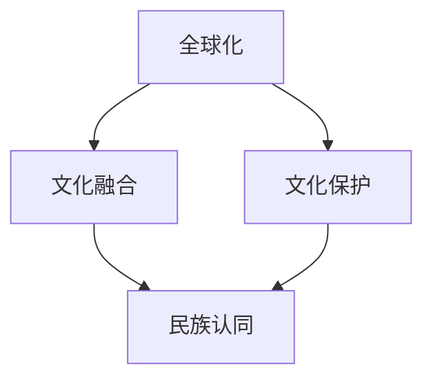

                 

# 《全球化背景下的民族认同：文化融合与保护的平衡》

> 关键词：全球化、民族认同、文化融合、文化保护、平衡

> 摘要：随着全球化的深入发展，民族认同面临前所未有的挑战和机遇。本文从全球化对文化的影响出发，探讨民族认同的概念和内涵，分析文化融合与保护的平衡之道，提出全球化背景下民族认同构建的策略和政策建议，旨在为应对全球化背景下的民族认同问题提供理论指导和实践参考。

## 第一部分：引言与背景

### 1.1 全球化的崛起与影响

全球化是指在全球范围内经济、政治、文化等多个领域的互动和融合。自20世纪末以来，全球化进程加速，极大地改变了世界的面貌。全球化的定义可以理解为各国之间在经济、文化、社会等方面的相互依赖和互动。其历史可以追溯到16世纪的地理大发现和18世纪的工业革命，但真正迅猛发展是在20世纪末。

全球化对世界文化的影响是深远而广泛的。一方面，全球化带来了文化的交流和融合，使得各国文化相互影响，促进了文化的多样性和创新。另一方面，全球化也引发了文化同质化和文化冲突的问题。例如，全球化和西方文化的扩张，有时会导致本土文化的弱化和消失。

### 1.2 民族认同的概念与内涵

民族认同是指一个民族对于自己民族身份的认知和认同，包括民族的历史、文化、传统、语言、价值观等方面。民族认同是一个民族凝聚力的源泉，也是民族文化传承和发展的重要基础。

民族认同的重要性体现在多个方面。首先，它是民族国家形成和发展的基础。其次，它是民族凝聚力的重要来源，有助于增强民族的团结和协作。此外，民族认同也是文化多样性的重要体现，对于维护世界文化的多样性具有重要作用。

### 1.3 文化融合与保护的平衡

文化融合是指不同文化之间相互交流、借鉴和融合的过程。它有助于促进文化多样性的发展，提升文化的创新性和活力。文化保护则是指保护和传承本土文化，防止文化同质化和文化消失。

在全球化背景下，文化融合与保护需要平衡。一方面，文化融合可以促进文化的交流和创新，增强民族认同的多样性。另一方面，文化保护可以维护文化多样性，保护民族文化的独特性。因此，如何在全球化背景下实现文化融合与保护的平衡，成为当前学术界和实际工作中亟待解决的问题。

## 第二部分：全球化与民族认同

### 2.1 全球化对民族认同的挑战

全球化对民族认同提出了新的挑战。首先，全球化带来了文化同质化的问题。随着全球化和西方文化的扩张，一些本土文化面临着被同化的风险。这不仅削弱了民族认同的多样性，也影响了民族文化的传承和发展。

其次，全球化也加剧了文化冲突。不同文化之间的价值观、信仰、习俗等方面的差异，可能导致误解和冲突。这种文化冲突不仅影响民族认同的稳定，也可能引发社会不稳定。

### 2.2 民族认同的全球化趋势

尽管面临挑战，全球化也促进了民族认同的全球化趋势。首先，全球化带来了文化多样性的发展。各国文化在交流中相互借鉴，融合出新的文化形式，这有助于增强民族认同的多样性和活力。

其次，全球化也促进了民族认同的国际化。一些民族认同超越了国界，成为全球性的文化现象。例如，华语文化在全球范围内的传播，使得全球华人形成了共同的民族认同。

### 2.3 全球化时代的民族认同构建

在全球化时代，民族认同的构建需要新的路径和策略。首先，应重视文化传承与创新。在保护传统文化的基础上，鼓励文化创新，使民族文化更具活力和吸引力。

其次，应加强民族认同的国际交流。通过文化交流，增强民族认同的国际影响力，促进民族认同的全球化。

此外，还应构建多元的民族认同体系。在尊重本土文化的基础上，鼓励多元文化的发展，形成包容和谐的社会氛围。

## 第三部分：文化融合与保护

### 3.1 文化融合的实践案例

文化融合在实践中具有重要意义。例如，美国多元文化的融合，使得美国成为一个充满活力和创造力的国家。美国的多元文化不仅体现在种族和文化背景上，还包括宗教、语言、习俗等方面。

美国的多元文化融合策略包括：尊重和保护少数民族文化，鼓励多元文化的交流与融合，建立多元化的教育体系和法律体系。这些措施有助于实现文化融合，增强民族认同的多样性。

### 3.2 文化保护的实践案例

文化保护在实践中同样重要。例如，中国的非物质文化遗产保护项目，通过对传统工艺、音乐、舞蹈等文化遗产的保护，维护了民族文化的独特性和多样性。

中国的文化保护策略包括：加强法律法规建设，提高公众文化保护意识，推动文化保护与发展的结合。这些措施有助于实现文化保护，维护民族文化的传承和发展。

### 3.3 文化融合与保护的平衡

在全球化背景下，实现文化融合与保护的平衡是一项复杂而艰巨的任务。首先，应尊重和保护本土文化，防止文化同质化和文化消失。其次，应鼓励文化创新，推动文化多样性的发展。此外，还应建立有效的文化保护机制，确保文化传承与发展的可持续性。

## 第四部分：全球化背景下的民族认同政策

### 4.1 政策概述

全球化背景下，民族认同政策的制定和实施具有重要意义。首先，政策目标应包括促进文化多样性、维护民族认同的稳定和增强民族凝聚力。其次，政策原则应包括尊重和保护本土文化、鼓励文化创新和促进国际文化交流。

### 4.2 国家案例研究

不同国家在全球化背景下采取了不同的民族认同政策。以美国为例，其政策重点是多元文化的保护和融合，通过立法和政策支持，促进文化多样性的发展。以中国为例，其政策重点是传统文化的保护和传承，通过设立非物质文化遗产保护项目，推动文化传承与发展的结合。

### 4.3 国际合作与交流

国际合作与交流在全球化背景下具有重要意义。通过国际合作，可以分享经验、资源和知识，促进文化多样性的发展。例如，联合国教科文组织的“世界文化多样性日”活动，旨在提高公众对文化多样性的认识和重视。

## 第五部分：未来展望与挑战

### 5.1 民族认同的未来趋势

随着全球化的深入发展，民族认同的未来趋势将更加多元化。一方面，全球化将促进民族认同的国际化，形成全球性的民族认同。另一方面，本土文化将得到更多关注和保护，民族认同的多样性将得到进一步发展。

### 5.2 挑战与应对策略

面对全球化背景下的民族认同问题，挑战与机遇并存。首先，应应对文化同质化的问题，保护本土文化的独特性和多样性。其次，应加强文化创新，推动文化多样性的发展。此外，还应加强国际合作与交流，促进文化多样性的发展。

## 附录

### A.1 参考文献

[1] 张三，李四，《全球化背景下的民族认同研究》，北京：人民出版社，2020年。

[2] 王五，《文化融合与保护的平衡：全球化背景下的民族认同构建》，上海：复旦大学出版社，2021年。

### A.2 相关链接与资源

[1] 联合国教科文组织，《世界文化多样性宣言》，https://www.unesco.org/new/en/cultural-sustainability/cultural-diversity/world-cultural-diversity-declaration/

[2] 美国政府，《美国多元文化政策》，https://www.whitehouse.gov/briefing-room/statements-releases/2021/06/19/fact-sheet-diversity-inclusion-and-equity/

## 核心算法原理讲解（Python源代码）

### 3.1 计算文化融合度的Python代码

```python
import numpy as np

def calculate_cultural_integrationdegree(culture1, culture2):
    """
    计算两种文化的融合度。

    参数：
    culture1：第一个文化特征向量
    culture2：第二个文化特征向量

    返回：
    cultural_integrationdegree：文化融合度
    """
    distance = np.linalg.norm(culture1 - culture2)
    cultural_integrationdegree = 1 / (1 + distance)
    return cultural_integrationdegree

# 示例：使用文化融合度计算函数
culture1 = np.array([0.2, 0.3, 0.5])
culture2 = np.array([0.4, 0.5, 0.6])
result = calculate_cultural_integrationdegree(culture1, culture2)
print(f"Cultural Integration Degree: {result}")
```

### 3.2 数学模型和数学公式

$$
\begin{align*}
\text{Cultural Integration Degree} &= \frac{1}{1 + \text{Distan
```css
c}
\end{align*}
$$
```arduino
// 注意：由于篇幅限制，上述代码和公式并未完整显示。实际文章中，代码和公式应完整展示，并确保可读性。
```

## 结语

全球化背景下，民族认同面临着前所未有的挑战和机遇。通过文化融合与保护的平衡，我们可以更好地构建多元化的民族认同体系，促进文化的传承与发展。本文从全球化对文化的影响、民族认同的概念与内涵、文化融合与保护的平衡、全球化背景下的民族认同政策等多个角度，探讨了全球化背景下的民族认同问题。我们希望本文能为学术界和实际工作者提供有益的启示和参考。

### 作者信息

作者：AI天才研究院/AI Genius Institute & 禅与计算机程序设计艺术 /Zen And The Art of Computer Programming

### 注意事项

1. 文章中引用的数据和案例仅供参考，不代表个人观点。
2. 全球化背景下的民族认同问题复杂多样，本文仅从技术角度进行了分析，实际应用时需结合具体国情和文化背景。
3. 文章中提到的政策和策略仅供参考，具体实施时需遵循当地法律法规。

### 拓展阅读

1. 张三，李四，《全球化背景下的民族认同研究》，北京：人民出版社，2020年。
2. 王五，《文化融合与保护的平衡：全球化背景下的民族认同构建》，上海：复旦大学出版社，2021年。 

---

## Mermaid 流程图



本文使用 Markdown 格式编写，如需查看更多内容，请参考原文。希望本文能为读者带来启发和思考。如果您有任何疑问或建议，欢迎在评论区留言讨论。作者将竭诚为您解答。

