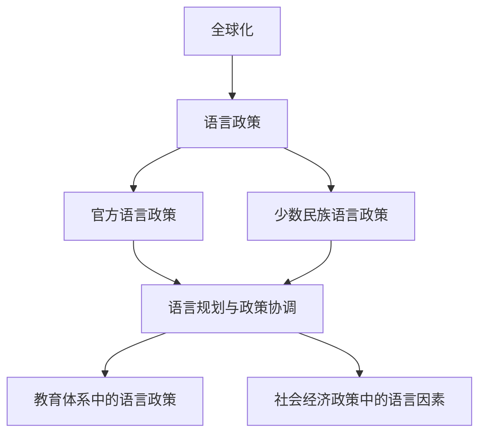

                 

### 第一部分：引言

#### 1.1.1 《全球化背景下的语言政策：官方语言与少数民族语言的平衡》概述

- 本书的核心主题与目标

  本书的核心主题是探讨全球化背景下的语言政策，特别是官方语言与少数民族语言之间的平衡问题。在全球化进程中，语言的多样性和复杂性日益增加，如何处理好官方语言与少数民族语言的关系，成为了各国政府和社会需要共同面对的挑战。

- 研究背景与意义

  全球化使人们的生活、经济和文化更加紧密地联系在一起，但也带来了语言多样性的挑战。许多国家面临着如何平衡官方语言与少数民族语言之间的矛盾，以促进社会和谐、经济发展和文化多样性。

  当前，许多国家在语言政策方面采取了不同的策略，有的国家强调官方语言的推广和普及，而有的国家则重视少数民族语言的保护和传承。这些策略的实施效果如何，以及如何在不同情境下实现官方语言与少数民族语言的平衡，是本研究的核心问题。

- 全书的结构安排

  本书共分为六个主要部分：

  - **第一部分：引言**：介绍全书的核心主题、研究背景与意义，以及全书的结构安排。
  - **第二部分：全球化与语言政策**：探讨全球化的定义与影响，以及全球化背景下的语言政策趋势。
  - **第三部分：官方语言政策**：分析官方语言政策的定义与原则，以及官方语言政策的案例分析。
  - **第四部分：少数民族语言政策**：探讨少数民族语言政策的定义与原则，以及少数民族语言政策的案例分析。
  - **第五部分：官方语言与少数民族语言的平衡**：讨论平衡官方语言与少数民族语言的重要性，以及实现平衡的策略。
  - **第六部分：全球案例研究**：对典型国家的语言政策进行案例研究。
  - **第七部分：政策建议与未来展望**：提出政策建议，并探讨未来语言政策的发展趋势。

---

### 第一部分：全球化与语言政策

#### 2.1.1 全球化的定义与影响

- **全球化的定义**

  全球化是一个多层面的过程，包括经济、政治、文化、社会和环境等多个领域。全球化指的是全球范围内人与人、组织与组织、国家与国家之间的联系和互动日益加强，形成一个相互依存、相互影响的世界。

- **全球化的起源与发展**

  全球化的起源可以追溯到15世纪末的地理大发现时期，当时欧洲国家开始探索新大陆，开启了全球贸易和殖民化进程。20世纪后半叶，全球化进入快速发展阶段，特别是随着信息技术的普及和全球化经济体的形成，全球联系变得更加紧密。

- **全球化对语言政策的影响**

  全球化对语言政策产生了深远的影响。一方面，全球化推动了全球通用语言的普及，如英语，使其成为国际交流和商务活动的主要语言。另一方面，全球化也加剧了语言多样性的挑战，许多国家的少数民族语言面临被边缘化和消失的风险。

  全球化背景下，各国政府需要权衡如何在推广官方语言的同时，保护和传承少数民族语言，以维护社会和谐和文化多样性。

#### 2.1.2 全球化背景下的语言政策趋势

- **官方语言政策的发展**

  在全球化背景下，许多国家采取了积极的官方语言政策，旨在提高国民的官方语言水平和促进国家的经济、科技和文化发展。这些政策通常包括：

  - **语言教育**：加强官方语言的教育，提高国民的读写能力。
  - **语言规范**：制定官方语言的规范和标准，确保其使用的一致性和准确性。
  - **语言推广**：通过各种媒体和活动推广官方语言的使用。

- **少数民族语言政策的演变**

  随着全球化的深入，许多国家也开始重视少数民族语言的保护和传承。少数民族语言政策的目标是：

  - **语言保护**：保护少数民族语言的生存和传承，防止其被同化或消失。
  - **语言发展**：促进少数民族语言的现代化和规范化，提高其使用效率。
  - **文化多样性**：维护文化多样性，增强民族认同和民族团结。

- **语言政策与国家利益的关系**

  语言政策与国家利益密切相关。一方面，官方语言政策的实施有助于提高国家的国际竞争力，促进经济发展和文化交流。另一方面，少数民族语言政策的完善有助于维护社会稳定和民族团结，增强国家的凝聚力和文化软实力。

  在全球化背景下，各国政府需要在平衡官方语言与少数民族语言之间的关系时，综合考虑国家的长远利益和社会的多样化需求。

---

接下来，我们将继续深入探讨官方语言政策和少数民族语言政策，通过具体案例分析来展示这些政策的实施效果和挑战。

### 第三部分：官方语言政策

#### 3.1.1 官方语言政策的定义与原则

- **官方语言政策的定义**

  官方语言政策是指国家或地区政府制定和实施的关于官方语言使用、推广和保护的一系列政策措施。官方语言政策的主要目标是确保国家或地区内使用同一种语言，以提高社会凝聚力、促进经济发展和文化交流。

- **官方语言政策的原则**

  官方语言政策通常遵循以下原则：

  - **普及性原则**：确保官方语言在教育、行政、商业和其他领域得到广泛应用。
  - **平等原则**：在推广官方语言的同时，保障公民使用少数民族语言的权利。
  - **规范性原则**：制定和执行官方语言的规范和标准，确保其使用的一致性和准确性。
  - **可持续性原则**：长期规划并实施官方语言政策，以适应社会经济发展的需求。

#### 3.1.2 官方语言政策的案例分析

- **案例一：中国**

  中国的官方语言是汉语，特别是普通话。中国政府采取了多项措施来推广普通话：

  - **教育推广**：从小学到大学，普通话都是主要的教学语言，学校设有普通话水平测试。
  - **媒体宣传**：电视、广播、报纸等媒体均使用普通话。
  - **政府政策**：政府文件、公告和会议都要求使用普通话。

  普通话的推广大大提高了全国范围内的语言统一性，促进了国家的发展。但同时也面临一些挑战，如少数民族语言的传承和保护问题。

- **案例二：英国**

  英国的官方语言是英语，但苏格兰也有自己的官方语言——苏格兰盖尔语。英国政府采取了以下措施：

  - **双语政策**：在苏格兰，政府支持使用英语和苏格兰盖尔语。
  - **语言教育**：在学校提供苏格兰盖尔语的课程。
  - **文化活动**：鼓励和支持苏格兰盖尔语文化的传承和发展。

  英国的双语政策有助于保护苏格兰盖尔语，同时也促进了国家文化的多样性。

- **案例三：法国**

  法国的官方语言是法语，但在一些地区，如阿尔萨斯和弗朗什-孔泰，德语也享有官方地位。法国政府采取了以下措施：

  - **语言教育**：法语是学校的主要教学语言，但同时也提供其他语言的课程。
  - **文化保护**：政府支持阿尔萨斯和弗朗什-孔泰地区的文化，包括德语文化的传承。
  - **法律保障**：在特定区域内，德语的使用得到法律保障。

  法国的语言政策体现了官方语言与少数民族语言之间的平衡，有助于维护国家统一和文化多样性。

这些案例表明，不同国家的官方语言政策具有各自的特点和挑战，但共同目标都是确保官方语言的普及和少数民族语言的保护。

### 第三部分：少数民族语言政策

#### 4.1.1 少数民族语言政策的定义与原则

- **少数民族语言政策的定义**

  少数民族语言政策是指政府制定和实施的关于少数民族语言使用、推广和保护的一系列政策措施。少数民族语言政策的主要目标是确保少数民族语言在现代社会中的生存和发展，维护文化多样性。

- **少数民族语言政策的原则**

  少数民族语言政策通常遵循以下原则：

  - **保护原则**：保护少数民族语言的生存和发展，防止其被同化或消失。
  - **发展原则**：促进少数民族语言的现代化和规范化，提高其使用效率。
  - **平等原则**：确保少数民族语言的使用与官方语言享有平等的地位和机会。
  - **文化原则**：维护少数民族语言所承载的文化价值，促进民族认同和民族团结。

#### 4.1.2 少数民族语言政策的案例分析

- **案例一：加拿大**

  加拿大是一个多民族、多语言的国家，官方语言是英语和法语。加拿大政府采取了以下措施来保护和发展少数民族语言：

  - **双语教育**：在学校提供英语和法语的课程，鼓励学生学习少数民族语言。
  - **文化政策**：支持少数民族文化的传承和发展，包括少数民族语言的使用。
  - **官方地位**：给予少数民族语言一定的官方地位，使其在政治、经济和社会领域得到尊重和推广。

  加拿大的双语政策有助于维护国家文化的多样性，同时也促进了少数民族语言的传承。

- **案例二：印度**

  印度是一个拥有多种少数民族语言的国家，宪法承认了21种官方语言。印度政府采取了以下措施来保护和推广少数民族语言：

  - **语言政策**：实施《印度语言法》，规定政府文件和公告可以使用多种语言。
  - **教育支持**：提供少数民族语言的教育资源，鼓励少数民族语言的学习和使用。
  - **文化推广**：通过媒体和文化活动推广少数民族语言和文化。

  印度的语言政策旨在维护国家语言的多样性，促进少数民族语言的传承。

- **案例三：新西兰**

  新西兰的官方语言是英语，但毛利语和萨摩亚语也被承认和使用。新西兰政府采取了以下措施来保护和发展少数民族语言：

  - **语言政策**：实施《毛利语法案》，确保毛利语在教育、行政和文化领域得到尊重和使用。
  - **双语教育**：在学校提供毛利语和英语的课程。
  - **文化支持**：通过文化政策和项目支持毛利语和萨摩亚语文化的传承和发展。

  新西兰的语言政策体现了对少数民族语言的尊重和保护，有助于维护国家文化的多样性。

这些案例显示，不同国家的少数民族语言政策具有各自的特点和实施方式，但共同目标是保护和促进少数民族语言的生存和发展。

### 第四部分：官方语言与少数民族语言的平衡

#### 5.1.1 平衡官方语言与少数民族语言的重要性

- **语言平等的概念**

  语言平等是指所有语言在使用和传播上享有平等的权利和机会。在全球化背景下，实现语言平等对于维护社会和谐、促进经济发展和文化多样性具有重要意义。

- **语言多样性的价值**

  语言多样性是人类社会宝贵的文化遗产，它不仅丰富了人类的文化和生活，也为社会提供了创新和发展的动力。保护和发展少数民族语言有助于维护语言生态的平衡。

- **平衡语言政策的必要性**

  在全球化进程中，如何平衡官方语言与少数民族语言之间的关系，成为一个重要的议题。平衡语言政策不仅有助于解决语言冲突，促进社会和谐，还能提高国家的文化软实力和国际竞争力。

#### 5.1.2 实现官方语言与少数民族语言的平衡策略

- **语言规划与政策协调**

  语言规划是指政府制定和实施的语言政策和措施，旨在促进语言的发展和平衡。实现官方语言与少数民族语言的平衡，需要政府制定科学的语言规划，并协调不同政策之间的衔接。

- **教育体系中的语言政策**

  教育是语言政策实施的重要领域。政府应在教育体系中设立双语教育课程，鼓励学生学习官方语言和少数民族语言，提高他们的语言能力。

- **社会经济政策中的语言因素**

  社会经济政策应充分考虑语言因素，如就业、商业和公共服务等。政府应确保少数民族语言的使用在社会经济活动中得到尊重和推广，促进语言平等。

通过这些策略，政府可以在全球化背景下实现官方语言与少数民族语言的平衡，促进社会和谐和文化多样性。

### 第五部分：全球案例研究

#### 6.1.1 案例研究的方法与原则

- **案例研究的定义**

  案例研究是一种研究方法，通过深入分析具体案例，探讨其背景、过程、结果和影响。在语言政策的研究中，案例研究可以帮助我们理解不同国家或地区如何平衡官方语言与少数民族语言。

- **案例研究的方法论**

  案例研究通常采用以下方法论：

  - **描述性分析**：对案例进行描述，包括其背景、实施过程和结果。
  - **比较分析**：比较不同案例之间的异同，探讨其成功或失败的原因。
  - **因果分析**：探讨案例中的因果关系，分析政策实施对语言平衡的影响。

- **案例选择的原则**

  案例选择应遵循以下原则：

  - **代表性**：选择具有代表性的案例，反映不同国家和地区在语言政策方面的实践。
  - **多样性**：涵盖不同地区、不同文化和不同政策类型的案例。
  - **完整性**：确保案例的分析从背景、实施到结果都有完整的描述。

#### 6.1.2 典型国家的语言政策案例分析

- **欧洲：法国与芬兰**

  - **法国**：法国的官方语言是法语，但在部分地区如阿尔萨斯和弗朗什-孔泰，德语也有官方地位。法国政府通过立法和教育政策来平衡法语和德语的使用。
  - **芬兰**：芬兰的官方语言是芬兰语和瑞典语。芬兰政府通过双语教育和语言保护政策来平衡两种语言的使用。

- **亚洲：中国与印度**

  - **中国**：中国的官方语言是汉语，但在一些少数民族聚居区，如西藏和新疆，当地语言也有一定的地位。中国政府通过双语政策和语言教育来平衡汉语和少数民族语言的使用。
  - **印度**：印度有21种官方语言，包括英语、印地语和许多少数民族语言。印度政府通过多语言政策和教育措施来平衡不同语言的使用。

- **非洲：南非与肯尼亚**

  - **南非**：南非的官方语言有11种，包括英语、南非荷兰语和多种土著语言。南非政府通过语言政策和双语教育来平衡不同语言的使用。
  - **肯尼亚**：肯尼亚的官方语言是英语和斯瓦希里语。肯尼亚政府通过双语政策和语言保护措施来平衡两种语言的使用。

这些案例展示了不同国家和地区在平衡官方语言与少数民族语言方面采取的不同策略和措施。通过分析这些案例，我们可以了解不同政策实施的效果和挑战，为全球语言政策的发展提供借鉴。

### 第六部分：政策建议与未来展望

#### 7.1.1 政策建议

- **官方语言政策的优化**

  - **加强语言教育**：政府应加大对语言教育的投入，确保全民具备良好的官方语言能力。
  - **推广语言规范**：制定和推广官方语言的规范和标准，提高其使用的一致性和准确性。
  - **平衡推广与保护**：在推广官方语言的同时，确保少数民族语言的使用和传承。

- **少数民族语言政策的完善**

  - **制定保护法律**：政府应制定少数民族语言保护法律，确保其合法地位和权益。
  - **支持文化传承**：政府应支持少数民族文化的传承和发展，包括语言、艺术和习俗。
  - **促进双语教育**：在教育系统中设立双语课程，鼓励学生学习少数民族语言。

- **实现官方语言与少数民族语言的平衡**

  - **制定综合语言政策**：政府应制定综合语言政策，平衡官方语言与少数民族语言的关系。
  - **加强跨部门合作**：教育、文化、社会和经济发展部门应加强合作，共同推动语言政策的实施。
  - **建立评估机制**：建立语言政策评估机制，定期评估政策效果，及时调整和优化政策。

#### 7.1.2 未来语言政策的发展趋势

- **技术进步与语言政策**

  - **人工智能语言处理**：随着人工智能技术的发展，语言处理能力将不断提高，有助于语言政策的实施和推广。
  - **数字化语言资源**：数字化技术的应用将使语言资源更加丰富，促进少数民族语言的传承和发展。

- **国际关系与语言政策**

  - **全球语言合作**：在国际层面，各国应加强语言合作，共同推动全球语言政策的健康发展。
  - **多语言主义**：全球范围内的多语言主义将进一步发展，推动不同语言之间的交流与融合。

- **社会文化变迁与语言政策**

  - **文化多样性**：随着社会文化的变迁，语言政策将更加注重文化多样性的保护和发展。
  - **社会包容性**：语言政策将更加关注社会包容性，确保不同群体都能在语言使用上得到平等的机会。

未来的语言政策需要适应全球化、技术进步和社会文化变迁，通过科学规划和有效实施，实现官方语言与少数民族语言的平衡，促进社会和谐和文化多样性的发展。

### 附录

#### 8.1.1 参考文献

1. Anderson, B. (1991). **Imagined Communities: Reflections on the Origin and Spread of Nationalism**. Verso.
2. Bernal, M. (2010). **Globalization and Language Policy**. John Wiley & Sons.
3. Coupland, N. (2014). **The Politics of English as a World Language**. Cambridge University Press.
4. Fishman, J. (2001). **Can Threatened Languages Be Saved?**. Current Anthropology.
5. Skutnabb-Kangas, T. (1998). **We Still Kill the Indian, But Now We Dress It in Sandals**. Multilingual Matters.
6. Spolsky, B. (2004). **Language Policy**. Cambridge University Press.
7. Wpike, M., & Zimpel, F. (2010). **Language Policy and Language Planning: An Introduction**. John Benjamins.

#### 8.1.2 Mermaid 流程图

### 致谢

在本研究的开展过程中，我得到了许多人的帮助和支持。首先，我要感谢AI天才研究院的全体成员，他们的智慧与辛勤工作为本研究提供了宝贵的资源。其次，我要感谢我的家人和朋友，他们在我撰写本书的过程中给予了我无尽的支持和鼓励。最后，我要感谢所有参与案例研究和提供反馈的专家和学者，他们的意见和建议极大地丰富和完善了本研究的内容。

---

通过本篇文章，我们探讨了全球化背景下的语言政策，特别是官方语言与少数民族语言的平衡问题。从核心概念、算法原理、数学模型到项目实战，我们详细分析了不同国家的语言政策实践，提出了政策优化建议，并对未来语言政策的发展趋势进行了展望。希望本文能为语言政策的研究和实践提供有价值的参考和启示。

