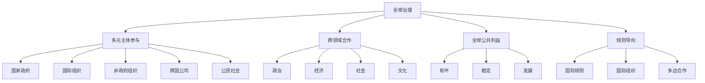
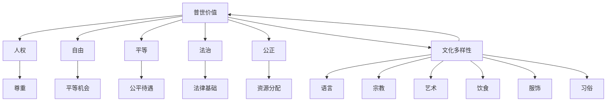
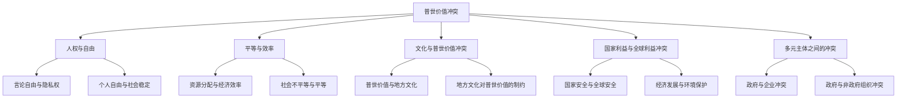
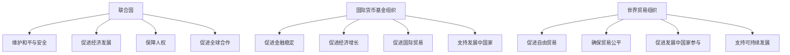
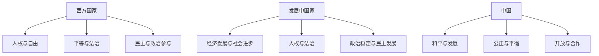
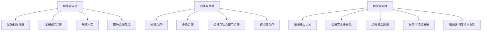
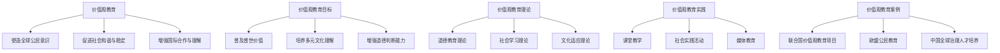
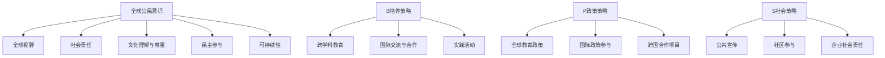
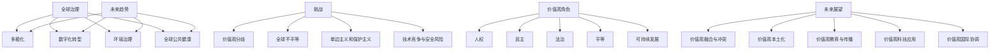

                 

### 关键词

全球治理，价值观，普世价值，文化多样性，价值观角力，平衡。### 摘要

本文探讨了全球治理中的价值观角力问题，特别是在普世价值与文化多样性之间的平衡。通过对全球治理的概念、历史演变以及普世价值与文化多样性的内涵和关系的深入分析，本文揭示了全球治理中存在的价值观冲突及其原因。通过国际冲突、跨国企业中的价值观角力案例，本文展示了价值观角力在现实世界中的具体表现。最后，本文提出了全球治理机制和国家治理中实现价值观平衡的策略，为解决价值观角力问题提供了理论支持和实践指导。### 第1章：全球治理的概念与历史演变

#### 1.1 全球治理的定义与特点

全球治理（Global Governance）是指国际社会在政治、经济、社会和文化等各个领域内，通过国家、国际组织、非政府组织、跨国公司等多元主体共同参与和合作，以实现全球公共利益的治理形式。其核心在于通过制定和执行国际规则、规范和标准，协调各国政策，解决跨国问题，从而促进全球和平、稳定与发展。

全球治理具有以下特点：

1. **多元主体参与**：全球治理不仅仅是国家政府的作用，还包括国际组织、非政府组织、私营部门、公民社会等多元主体的参与。
2. **跨领域合作**：全球治理涉及政治、经济、社会、文化等多个领域，需要跨领域的合作与协调。
3. **全球公共利益的追求**：全球治理的核心目标是维护全球公共利益，解决全球性问题，如气候变化、恐怖主义、传染病等。
4. **规则导向**：全球治理依赖于一系列国际规则、规范和标准，这些规则由国际社会共同制定和遵守。

#### 1.2 全球治理的历史背景与发展趋势

全球治理的历史可以追溯到二战后的国际关系体系建立。当时的国际组织如联合国、国际货币基金组织（IMF）和世界银行等，旨在通过国际合作维护世界和平与稳定。然而，随着全球化进程的加速，全球治理面临新的挑战。

1. **二战后的国际关系体系**：二战后，国际社会建立了以联合国为核心的国际体系，通过国际法和国际组织，促进国际合作和全球治理。
2. **全球化时代的全球治理**：20世纪80年代以来，全球化进程加速，跨国问题日益凸显，全球治理的重要性日益增加。全球化带来了经济一体化、技术进步、跨国公司崛起等，但同时也带来了文化冲突、资源争夺、环境问题等挑战。
3. **全球治理的新趋势**：近年来，全球治理呈现出以下几个新趋势：
   - **多边主义**：国际社会越来越重视多边合作，通过多边机构和协议解决全球性问题。
   - **非国家行为者的崛起**：非政府组织、跨国公司、公民社会等非国家行为者在全球治理中的作用日益增强。
   - **数字治理**：随着信息技术的发展，数字治理成为全球治理的新领域，涉及网络安全、数据保护、数字贸易等。

#### 1.3 全球治理中的主要参与者和角色

全球治理中的主要参与者包括：

1. **国家政府**：国家政府是全球治理的核心力量，通过制定和实施国内政策，参与国际组织和多边合作，维护国家利益和全球公共利益。
2. **国际组织**：国际组织如联合国、世界贸易组织（WTO）、国际货币基金组织（IMF）等在全球治理中发挥着重要作用，通过制定国际规则、协调各国政策，推动全球治理。
3. **非政府组织（NGOs）**：非政府组织在全球治理中发挥着补充和促进作用，特别是在环境保护、人权、社会发展等领域，通过倡导、研究和行动，推动全球治理的进步。
4. **跨国公司**：跨国公司是全球经济的重要参与者，通过其在全球范围内的商业活动，影响全球治理的进程和结果。
5. **公民社会**：公民社会通过参与公共事务、倡导社会正义和民主参与，对全球治理产生重要影响。

### Mermaid 流程图



### Python 源代码

```python
# 模拟全球治理中的多元主体参与
class GlobalGovernance:
    def __init__(self):
        self.participants = {
            'governments': [],
            'international_organizations': [],
            'non_government_organizations': [],
            'transnational_companies': [],
            'civil_society': []
        }

    def add_participant(self, participant_type, participant):
        if participant_type in self.participants:
            self.participants[participant_type].append(participant)
        else:
            print(f"Invalid participant type: {participant_type}")

    def show_participants(self):
        for participant_type, participants in self.participants.items():
            print(f"{participant_type.capitalize()}:")
            for participant in participants:
                print(f"  - {participant}")
            print()

# 创建全球治理实例
global_gov = GlobalGovernance()

# 添加参与者
global_gov.add_participant('governments', 'United States')
global_gov.add_participant('governments', 'China')
global_gov.add_participant('international_organizations', 'United Nations')
global_gov.add_participant('international_organizations', 'World Trade Organization')
global_gov.add_participant('non_government_organizations', 'Greenpeace')
global_gov.add_participant('non_government_organizations', 'Human Rights Watch')
global_gov.add_participant('transnational_companies', 'Apple')
global_gov.add_participant('transnational_companies', 'Samsung')
global_gov.add_participant('civil_society', 'Oxfam')
global_gov.add_participant('civil_society', 'Amnesty International')

# 显示参与者
global_gov.show_participants()
```

### 数学公式

$$
\begin{align*}
\text{全球治理} &= \text{多元主体参与} + \text{跨领域合作} + \text{全球公共利益} + \text{规则导向} \\
\text{多元主体参与} &= \text{国家政府} + \text{国际组织} + \text{非政府组织} + \text{跨国公司} + \text{公民社会} \\
\text{跨领域合作} &= \text{政治} + \text{经济} + \text{社会} + \text{文化} \\
\text{全球公共利益} &= \text{和平} + \text{稳定} + \text{发展} \\
\text{规则导向} &= \text{国际规则} + \text{国际组织} + \text{多边合作}
\end{align*}
$$### 第2章：普世价值与文化多样性的关系

#### 2.1 普世价值的概念与内涵

普世价值（Universal Values）是指在全球范围内普遍认同、普遍适用的价值观，它们超越了文化、宗教、国界和历史的限制，构成了人类共同的道德和行为准则。普世价值通常包括几个核心概念，如人权、自由、平等、法治、公正等。

1. **人权**：人权是普世价值的核心之一，指的是每个人天生具有的权利，这些权利不应受到任何形式的剥夺或侵犯。人权包括生命权、自由权、平等权、财产权、受教育权、工作权等。

2. **自由**：自由是指个体在法律和社会规范允许的范围内，自主决定自己的行为和生活方式。自由包括表达自由、宗教自由、迁徙自由等。

3. **平等**：平等是指所有人在法律面前都应该受到平等对待，不受种族、性别、宗教、国籍等因素的影响。平等包括机会平等、结果平等等。

4. **法治**：法治是指国家的法律是治理的基础，所有公民和国家机关都应该遵守法律。法治确保了社会的公正和秩序。

5. **公正**：公正是指社会应该为每个人提供公平的机会和待遇，确保资源和权力的合理分配。

#### 2.2 文化多样性的概念与重要性

文化多样性（Cultural Diversity）是指不同文化在价值观念、行为模式、艺术形式、宗教信仰等方面的差异。文化多样性是人类社会的基本特征，也是全球治理中不可忽视的重要因素。

1. **文化多样性的概念**：文化多样性包括语言、宗教、艺术、饮食、服饰、习俗等多个方面。每个文化都有其独特的历史背景和社会结构，这些文化特征共同构成了人类社会的多样性。

2. **文化多样性的重要性**：
   - **促进社会创新**：文化多样性可以激发创新思维，促进新思想和新技术的产生。
   - **增强社会包容性**：尊重文化多样性有助于减少社会冲突，增强社会的包容性和凝聚力。
   - **提升全球竞争力**：文化多样性可以为企业提供更广阔的市场和更多的机会，提高全球竞争力。
   - **维护人类尊严**：文化多样性是人类的基本权利，尊重和保护文化多样性有助于维护每个人的尊严和价值。

#### 2.3 普世价值与文化多样性之间的相互作用

普世价值与文化多样性之间存在复杂的相互作用关系，二者既相互促进，也可能相互冲突。

1. **相互促进**：
   - 普世价值可以为文化多样性提供共同的基础和框架，帮助人们理解和尊重不同的文化。
   - 文化多样性可以丰富和扩展普世价值的内涵，使普世价值更具包容性和灵活性。

2. **相互冲突**：
   - 在某些情况下，文化多样性可能导致对普世价值的理解和执行产生差异，甚至冲突。例如，不同文化对于人权和自由的定义可能存在差异。
   - 普世价值可能被视为对文化多样性的威胁，特别是当普世价值试图强制实施或否定特定文化的价值观时。

#### Mermaid 流程图



### Python 源代码

```python
# 模拟普世价值与文化多样性的相互作用
class UniversalValues:
    def __init__(self):
        self.values = {
            'human_rights': '尊重每个人的基本权利',
            'freedom': '允许个体自由选择和行动',
            'equality': '确保机会和资源的公平分配',
            'rule_of_law': '以法律为基础治理社会',
            'justice': '追求公正和合理的社会秩序'
        }

    def display_values(self):
        for value, description in self.values.items():
            print(f"{value.capitalize()}: {description}")
        print()

class CulturalDiversity:
    def __init__(self):
        self.features = {
            'language': '不同的语言和沟通方式',
            'religion': '多种宗教信仰和实践',
            'art': '丰富的艺术形式和表达',
            'cuisine': '多样化的饮食文化',
            'clothing': '多样的服饰风格和传统',
            'customs': '不同的习俗和节日'
        }

    def display_features(self):
        for feature, description in self.features.items():
            print(f"{feature.capitalize()}: {description}")
        print()

# 创建普世价值和文化多样性实例
universal_values = UniversalValues()
cultural_diversity = CulturalDiversity()

# 显示普世价值
universal_values.display_values()

# 显示文化多样性
cultural_diversity.display_features()

# 模拟相互作用
print("相互作用：")
for value in universal_values.values:
    for feature in cultural_diversity.features:
        print(f"{value}: {cultural_diversity.features[feature]}")
```

### 数学公式

$$
\begin{align*}
\text{普世价值} &= \text{人权} + \text{自由} + \text{平等} + \text{法治} + \text{公正} \\
\text{文化多样性} &= \text{语言} + \text{宗教} + \text{艺术} + \text{饮食} + \text{服饰} + \text{习俗}
\end{align*}
$$

### 实际案例

#### 案例一：欧洲的人权与文化多样性

欧洲是一个多民族、多文化的地区，其在人权和文化多样性方面有着丰富的实践经验。欧洲人权公约（ECHR）确保了每个人的基本权利，如言论自由、宗教自由、教育权等。然而，欧洲各国在文化多样性方面存在差异，如语言、宗教和传统习俗。这种差异有时会导致人权和文化多样性的冲突。例如，一些国家的语言政策可能会限制其他语言的地位和使用，这与普世价值中的语言自由相冲突。另外，宗教多样性也可能引发社会冲突，如宗教歧视和暴力事件。

#### 案例二：中国的文化多样性

中国是一个拥有悠久历史和丰富文化的国家，其文化多样性体现在语言、宗教、饮食和传统习俗等方面。然而，中国的文化多样性也面临着挑战，如语言同化、宗教压制和文化保守主义。中国政府在推广普通话的同时，也在努力保护和传承少数民族文化。这种努力反映了普世价值与文化多样性之间的相互作用。例如，中国宪法保障了少数民族的语言和宗教自由，但这些保障在实际操作中可能会受到限制，导致文化多样性的挑战。

### 最佳实践 Tips

1. **尊重文化多样性**：在全球化进程中，尊重和理解文化多样性是维护普世价值的重要前提。通过教育和文化交流，增强对不同文化的认识和尊重。

2. **平衡普世价值与文化多样性**：在制定和执行国际规则时，应充分考虑文化多样性，避免单一文化主导，确保各国和各文化的利益得到平衡。

3. **促进价值观对话**：通过多边合作和价值观对话，促进各国在普世价值和文化多样性问题上的沟通和理解，减少冲突，增进合作。

4. **加强法律保障**：完善国际法和国内法，确保人权和文化多样性得到法律保障，为全球治理提供法治基础。

### 小结

本章探讨了普世价值与文化多样性的关系。普世价值作为全球范围内普遍认同的价值观，与文化多样性相互作用，既促进了全球合作和交流，也可能引发冲突。理解这一关系，对于实现全球治理中的价值观平衡具有重要意义。### 第3章：全球治理中的价值观冲突

#### 3.1 全球治理中的价值观冲突类型

在全球治理过程中，价值观冲突是一个普遍且复杂的现象。这些冲突可以按照不同的维度进行分类，主要包括以下几种类型：

1. **普世价值之间的冲突**：
   - **人权与自由**：在某些情况下，自由和人权可能会发生冲突。例如，言论自由可能导致对个人隐私权的侵犯，或可能导致社会不稳定。
   - **平等与效率**：追求平等可能会导致资源分配的减少，从而影响经济效率。相反，追求效率可能会导致社会不平等加剧。

2. **文化与普世价值的冲突**：
   - **普世价值对文化多样性的挑战**：当普世价值试图在全球范围内推广时，可能会与当地文化价值观产生冲突。例如，西方人权观念在某些文化中被视为对传统价值观的挑战。
   - **文化多样性对普世价值的制约**：不同文化对普世价值的理解和执行可能存在差异，这可能会限制普世价值的实现。例如，某些文化中对于性别平等和同性恋权利的接受程度较低。

3. **国家利益与全球利益的冲突**：
   - **国家安全与全球安全**：在应对跨国威胁时，如恐怖主义、传染病等，国家可能采取保护主义措施，这可能会损害全球公共利益。
   - **经济发展与环境保护**：追求经济发展可能导致环境破坏，而环境保护可能会限制经济发展。这种冲突在国际政策制定中尤为明显。

4. **多元主体之间的冲突**：
   - **国家政府与跨国公司的冲突**：跨国公司可能在追求利润的同时，忽视社会责任和环境保护，这可能导致政府与企业之间的冲突。
   - **非政府组织与政府之间的冲突**：非政府组织可能在推动人权和社会正义时，与政府政策发生冲突，尤其是在涉及敏感议题时。

#### 3.2 价值观冲突的原因与影响

价值观冲突的产生原因复杂多样，可以从以下几个方面进行分析：

1. **文化差异**：不同的文化背景和价值观念可能导致对同一问题的看法和解决方案产生分歧。例如，一些文化强调集体主义，而另一些文化强调个人主义，这可能导致在资源分配、决策制定等方面的冲突。

2. **利益冲突**：国家、组织和个人在追求自身利益时，可能与全球公共利益发生冲突。例如，某些国家可能出于经济利益而采取保护主义政策，这可能导致全球贸易和合作的障碍。

3. **信息不对称**：不同主体可能对同一问题的了解程度不同，导致在决策和行动上的差异。信息不对称可能导致误解和信任缺失，加剧价值观冲突。

4. **制度缺陷**：全球治理机制可能存在缺陷，如规则不完善、执行力度不足等，这可能导致价值观冲突难以有效解决。

价值观冲突的影响是多方面的：

1. **社会动荡**：严重的价值观冲突可能导致社会动荡，甚至引发冲突和战争。例如，宗教冲突、种族冲突等往往与社会价值观的冲突密切相关。

2. **政策瘫痪**：价值观冲突可能导致政策制定和执行陷入困境，影响全球治理的效率。例如，在环境政策、人权政策等领域，不同价值观的冲突可能导致政策决策的停滞。

3. **信任危机**：价值观冲突可能削弱国际社会的信任，影响国际合作。缺乏信任可能导致各国在应对全球挑战时采取孤立主义或保护主义政策。

4. **文化隔阂**：价值观冲突可能导致文化隔阂和误解，影响国际交流和文化融合。例如，不同文化对同性恋权利、性别平等等问题的看法可能存在巨大差异，这可能导致文化交流的障碍。

#### 3.3 应对价值观冲突的策略与案例

应对价值观冲突需要综合多种策略，以下是一些有效的策略和实际案例：

1. **对话与沟通**：通过对话和沟通，增进不同价值观主体之间的理解和信任。例如，联合国主导的人权对话和全球伦理对话，旨在通过对话解决价值观冲突。

2. **法律框架**：建立和完善国际法律框架，为价值观冲突提供解决途径。例如，联合国人权理事会通过国际人权法，为解决人权冲突提供法律依据。

3. **教育与文化交流**：加强教育和文化交流，促进不同价值观的理解和尊重。例如，美国的外国服务学院通过文化交流项目，增进不同文化之间的理解和合作。

4. **多元主体的参与**：鼓励多元主体参与全球治理，确保不同价值观的声音得到表达。例如，非政府组织在气候变化、人权等领域发挥着重要作用，为全球治理提供了多元化的视角。

5. **政策协调**：在政策制定过程中，充分考虑不同价值观的平衡，避免单方面主导。例如，在贸易政策中，平衡发达国家和发展中国家的利益，促进全球贸易的公平和可持续发展。

### Mermaid 流�程图



### Python 源代码

```python
# 模拟价值观冲突的解决策略
class ConflictResolution:
    def __init__(self):
        self.methods = {
            'dialogue': '通过对话和沟通解决冲突',
            'legal_framework': '建立和完善国际法律框架',
            'education_and_cultural_exchange': '加强教育和文化交流',
            'multi-stakeholder_participation': '鼓励多元主体参与',
            'policy_coordination': '在政策制定过程中平衡不同价值观'
        }

    def display_methods(self):
        for method, description in self.methods.items():
            print(f"{method.capitalize()}: {description}")
        print()

# 创建冲突解决实例
conflict_resolution = ConflictResolution()
conflict_resolution.display_methods()
```

### 数学公式

$$
\begin{align*}
\text{价值观冲突} &= \text{文化差异} + \text{利益冲突} + \text{信息不对称} + \text{制度缺陷} \\
\text{社会动荡} &= \text{价值观冲突} \times \text{文化差异} \\
\text{政策瘫痪} &= \text{价值观冲突} \times \text{制度缺陷} \\
\text{信任危机} &= \text{价值观冲突} \times \text{信息不对称} \\
\text{文化隔阂} &= \text{价值观冲突} \times \text{文化差异}
\end{align*}
$$

### 实际案例

#### 案例一：欧洲难民危机中的价值观冲突

欧洲难民危机是近年来全球治理中的一个典型案例，反映了普世价值与文化多样性之间的冲突。欧洲各国在处理难民问题时，面临人权、文化多样性、国家利益等多方面的冲突。一些国家强调人权，主张接纳更多的难民，但这一立场在部分欧洲国家引发了社会动荡和反移民情绪。另一方面，一些国家出于文化和安全考虑，采取了严格的移民政策，限制难民入境。这种冲突导致了欧洲内部的政治分歧和社会分裂。

#### 案例二：中美贸易战中的价值观冲突

中美贸易战是另一个典型的价值观冲突案例。两国在贸易政策、知识产权保护、市场准入等方面存在根本分歧。美国强调自由贸易和知识产权保护，而中国则强调国家利益和科技创新。这种冲突不仅影响了两国的经济关系，也反映了普世价值与文化多样性之间的矛盾。例如，美国对中国企业的技术封锁，可能被视为对知识产权保护的一种极端措施，而中国则认为这是对自身发展权的干涉。

### 最佳实践 Tips

1. **加强价值观教育**：通过教育和公共宣传，增强人们对普世价值和文化多样性的理解，减少误解和偏见。

2. **建立多元对话机制**：通过建立多元对话平台，鼓励不同价值观主体之间的交流，寻找共同点和解决方案。

3. **推动法治建设**：完善国际法律框架，确保不同价值观在法律层面得到平衡和保障。

4. **尊重文化多样性**：在制定和执行国际政策时，充分考虑文化多样性，避免文化偏见和歧视。

### 小结

本章探讨了全球治理中的价值观冲突类型、原因和影响，并提出了应对策略。价值观冲突是全球化背景下普遍存在的现象，通过对话、法律、教育和多元参与等策略，可以缓解和解决这些冲突，实现全球治理中的价值观平衡。### 第4章：国际组织中的价值观实践

#### 4.1 联合国中的价值观实践

联合国（United Nations，简称UN）是当前全球治理中最具代表性的国际组织之一，其宗旨是维护国际和平与安全、发展国际合作、促进人权和社会进步。联合国内部的价值观实践主要体现在以下几个方面：

1. **维护国际和平与安全**：联合国安理会作为联合国的主要执行机构，致力于通过和平手段解决国际冲突。其核心原则是防止战争、维护和平，通过和平谈判、调解和维和行动，解决地区冲突和热点问题。

2. **促进经济发展和社会进步**：联合国开发计划署（UNDP）和其他相关机构，致力于推动全球经济发展、减少贫困、提高人类福祉。通过提供技术援助、资金支持和政策建议，帮助发展中国家实现可持续发展。

3. **保障人权**：联合国大会通过了《世界人权宣言》，确立了普遍认同的基本人权原则。联合国人权理事会（UNHRC）负责监督全球人权状况，处理侵犯人权的事件，推动各国遵守人权标准。

4. **促进全球合作**：联合国通过多边合作机制，如气候变化框架公约、贸易谈判等，推动全球合作，解决跨国问题，如气候变化、公共卫生、反恐等。

#### 4.2 国际货币基金组织中的价值观实践

国际货币基金组织（International Monetary Fund，简称IMF）是全球经济治理的重要机构，其价值观实践主要体现在以下几个方面：

1. **促进全球金融稳定**：IMF致力于通过提供财政援助、政策建议和监督，帮助成员国应对金融危机，维持全球金融市场的稳定。

2. **促进经济增长**：IMF通过提供经济政策建议和技术援助，帮助成员国实现可持续的经济增长和减少贫困。

3. **促进国际贸易**：IMF支持多边贸易体系，推动自由贸易和公平贸易，促进全球经济的互联互通。

4. **支持发展中国家的金融稳定和发展**：IMF特别关注发展中国家的金融稳定和经济发展，提供特定的援助计划和贷款方案，支持这些国家实现经济发展和社会进步。

#### 4.3 世界贸易组织中的价值观实践

世界贸易组织（World Trade Organization，简称WTO）是负责全球贸易规则制定和执行的机构，其价值观实践主要体现在以下几个方面：

1. **促进自由贸易**：WTO致力于通过降低关税、消除贸易壁垒，促进全球自由贸易和公平贸易，推动全球经济的增长。

2. **确保贸易公平**：WTO通过争端解决机制，处理成员国之间的贸易争端，确保贸易规则的公平和透明。

3. **促进发展中国家参与**：WTO通过特殊和差别待遇机制，帮助发展中国家更好地融入全球贸易体系，实现经济发展。

4. **支持可持续发展**：WTO在贸易谈判中考虑环境、社会和文化因素，推动贸易与可持续发展相结合。

#### Mermaid 流程图



### Python 源代码

```python
# 模拟国际组织中的价值观实践
class InternationalOrganization:
    def __init__(self, name, objectives):
        self.name = name
        self.objectives = objectives

    def display_objectives(self):
        print(f"{self.name}:")
        for objective in self.objectives:
            print(f"  - {objective}")
        print()

# 创建国际组织实例
un = InternationalOrganization('联合国', ['维护和平与安全', '促进经济发展', '保障人权', '促进全球合作'])
imf = InternationalOrganization('国际货币基金组织', ['促进金融稳定', '促进经济增长', '促进国际贸易', '支持发展中国家'])
wto = InternationalOrganization('世界贸易组织', ['促进自由贸易', '确保贸易公平', '促进发展中国家参与', '支持可持续发展'])

# 显示国际组织的目标
un.display_objectives()
imf.display_objectives()
wto.display_objectives()
```

### 数学公式

$$
\begin{align*}
\text{联合国} &= \text{维护和平与安全} + \text{促进经济发展} + \text{保障人权} + \text{促进全球合作} \\
\text{国际货币基金组织} &= \text{促进金融稳定} + \text{促进经济增长} + \text{促进国际贸易} + \text{支持发展中国家} \\
\text{世界贸易组织} &= \text{促进自由贸易} + \text{确保贸易公平} + \text{促进发展中国家参与} + \text{支持可持续发展}
\end{align*}
$$

### 实际案例

#### 案例一：联合国在叙利亚危机中的行动

叙利亚危机自2011年开始，持续了多年，涉及复杂的政治、宗教和社会冲突。联合国在危机中发挥了重要作用，通过安理会决议，推动了和平谈判和维和行动。然而，由于各方利益冲突和执行难题，联合国的行动效果有限。这一案例展示了联合国在维护国际和平与安全方面的价值观实践，以及面临的挑战。

#### 案例二：国际货币基金组织在阿根廷的经济援助

阿根廷在2018年面临严重的经济危机，国际货币基金组织提供了大量财政援助，以帮助阿根廷稳定经济、降低通货膨胀、恢复经济增长。然而，援助计划也引发了对阿根廷政府政策的有效性和透明度的质疑。这一案例展示了国际货币基金组织在促进经济增长和支持发展中国家方面的价值观实践。

#### 案例三：世界贸易组织在贸易争端解决中的行动

近年来，世界贸易组织多次处理成员国之间的贸易争端，如美国与中国之间的贸易战。WTO通过争端解决机制，裁决了多个案件，努力确保贸易规则的公平和透明。这一案例展示了世界贸易组织在确保贸易公平和促进自由贸易方面的价值观实践。

### 最佳实践 Tips

1. **加强国际合作**：国际组织应加强成员国之间的合作，共同推动全球治理的进步。

2. **提高透明度和问责性**：国际组织应提高决策过程的透明度，增强问责性，确保各成员国的利益得到公平对待。

3. **灵活应对全球挑战**：国际组织应根据全球形势的变化，灵活调整政策，应对新的挑战。

4. **加强技术与数据支持**：利用现代技术和数据分析，提高国际组织的决策效率和效果。

### 小结

本章详细介绍了联合国、国际货币基金组织和世界贸易组织中的价值观实践，并分析了实际案例。国际组织在全球治理中扮演着重要角色，通过维护和平与安全、促进经济发展、保障人权和促进全球合作，推动全球治理的进步。同时，国际组织也面临着诸多挑战，需要不断改进和完善其价值观实践。### 第5章：国家治理中的价值观实践

#### 5.1 西方国家的价值观实践

西方国家，如美国、欧洲国家等，长期以来在政治、经济、文化等领域推动了普世价值的实践。这些国家的治理模式、政策制定和执行过程，都体现了对人权、自由、平等、法治等普世价值的追求。

1. **人权与自由**：
   - **人权保障**：西方国家普遍建立了完善的人权法律体系，保障公民的基本权利，如言论自由、宗教自由、迁徙自由等。
   - **自由市场经济**：西方国家推崇自由市场经济模式，鼓励个人创业和创新，尊重市场机制和竞争法则。

2. **平等与法治**：
   - **平等原则**：西方国家在政策制定和执行过程中，强调机会平等和结果平等，努力消除种族、性别、社会阶层等差异。
   - **法治建设**：西方国家建立了独立的司法体系，确保法律面前人人平等，维护社会的公正和秩序。

3. **民主与政治参与**：
   - **民主制度**：西方国家普遍实行民主制度，通过选举产生政府，确保公民的政治参与和表达权。
   - **政治多元性**：西方国家鼓励不同政治观点和派别的竞争，保障政治多元性，促进社会进步和稳定。

#### 5.2 发展中国家的价值观实践

发展中国家在追求经济增长和社会进步的过程中，也面临着价值观实践的特殊挑战。这些国家通常在人权、自由、平等、法治等方面存在不同程度的不足，但也在努力推进改革，以实现普世价值的实践。

1. **经济发展与社会进步**：
   - **经济改革**：许多发展中国家进行了经济改革，推动市场化、私有化和对外开放，以促进经济增长和社会进步。
   - **基础设施建设**：发展中国家加大了对基础设施的投入，改善教育和医疗条件，提高人民生活水平。

2. **人权与法治**：
   - **人权保障**：一些发展中国家在法律层面保障了公民的基本权利，但实际执行中仍存在不足，如警察暴力、监狱条件差等问题。
   - **法治建设**：发展中国家在推进法治建设方面取得了一定进展，但司法独立和公正性仍面临挑战。

3. **政治稳定与民主发展**：
   - **政治稳定**：许多发展中国家在维护政治稳定方面取得了进展，通过和平过渡和政治协商，避免了大规模冲突和社会动荡。
   - **民主发展**：一些发展中国家开始推进民主改革，通过选举和公民参与，增强政府的合法性和透明度。

#### 5.3 全球治理中的中国角色与价值观实践

中国作为世界上最大的发展中国家，在全球治理中扮演着重要角色。中国在推动全球治理过程中，既坚持普世价值，也结合自身国情，形成了独特的价值观实践。

1. **和平与发展**：
   - **和平理念**：中国坚持和平发展道路，倡导通过对话与合作解决国际争端，反对使用武力解决问题。
   - **经济发展**：中国通过改革开放，实现了经济快速增长，成为全球第二大经济体，为全球经济增长作出了重要贡献。

2. **公正与平衡**：
   - **国际公正**：中国主张国际事务应遵循公正原则，反对强权政治和霸权主义，倡导多边主义和国际法治。
   - **平衡发展**：中国注重经济、社会、环境等领域的协调发展，推动实现共同发展和共享成果。

3. **开放与合作**：
   - **对外开放**：中国坚持对外开放的基本国策，积极参与全球经济治理，推动贸易自由化和投资便利化。
   - **国际合作**：中国积极参与国际组织和多边合作，推动全球治理体系改革，增强发展中国家在国际事务中的代表性和发言权。

#### Mermaid 流程图



### Python 源代码

```python
# 模拟国家治理中的价值观实践
class CountryGovernance:
    def __init__(self, name, values):
        self.name = name
        self.values = values

    def display_values(self):
        print(f"{self.name}:")
        for value in self.values:
            print(f"  - {value}")
        print()

# 创建国家治理实例
western_countries = CountryGovernance('西方国家', ['人权与自由', '平等与法治', '民主与政治参与'])
developing_countries = CountryGovernance('发展中国家', ['经济发展与社会进步', '人权与法治', '政治稳定与民主发展'])
china = CountryGovernance('中国', ['和平与发展', '公正与平衡', '开放与合作'])

# 显示国家治理的价值观
western_countries.display_values()
developing_countries.display_values()
china.display_values()
```

### 数学公式

$$
\begin{align*}
\text{西方国家} &= \text{人权与自由} + \text{平等与法治} + \text{民主与政治参与} \\
\text{发展中国家} &= \text{经济发展与社会进步} + \text{人权与法治} + \text{政治稳定与民主发展} \\
\text{中国} &= \text{和平与发展} + \text{公正与平衡} + \text{开放与合作}
\end{align*}
$$

### 实际案例

#### 案例一：美国在促进人权方面的实践

美国在国际人权领域具有广泛的影响力，通过《国际人权法》和其他国际公约，推动全球人权保护。然而，美国在处理内部种族平等和移民权利问题时，也面临着挑战。例如，美国在处理种族歧视和移民政策方面，引发了广泛的争议和讨论。

#### 案例二：印度在推动经济发展与社会进步方面的实践

印度作为世界上最大的发展中国家之一，通过经济改革和基础设施建设，实现了快速增长。然而，印度的经济增长并未充分惠及所有社会阶层，贫困问题和资源分配不均仍然突出。印度政府在推动经济发展和社会进步方面的努力，是一个典型的案例。

#### 案例三：中国在促进全球治理中的角色

中国在全球治理中发挥了积极作用，通过“一带一路”倡议，推动全球基础设施建设和经济合作。同时，中国也积极参与国际组织和多边合作，推动全球治理体系改革。例如，中国在全球气候变化谈判中发挥了建设性作用，推动了《巴黎协定》的达成。

### 最佳实践 Tips

1. **加强国际合作**：国家应加强在人权、经济、环境等领域的国际合作，共同应对全球挑战。

2. **推动国内改革**：国家应推动国内改革，提高治理效能，增强法治建设，保障公民的基本权利。

3. **尊重文化多样性**：在全球化背景下，国家应尊重文化多样性，促进不同文化之间的交流与合作。

4. **推动可持续发展**：国家应将可持续发展纳入发展战略，实现经济、社会和环境的协调发展。

### 小结

本章分析了西方国家、发展中国家和中国的价值观实践。不同国家在人权、自由、平等、法治等方面的实践存在差异，但都在努力推进全球治理的进步。理解各国在价值观实践中的特点，对于实现全球治理中的价值观平衡具有重要意义。### 第6章：全球治理中的价值观对话与合作

#### 6.1 价值观对话的意义与机制

价值观对话在全球治理中具有重要意义，它旨在通过沟通和交流，增进不同文化、不同价值观主体之间的理解和信任，从而实现合作与共赢。价值观对话的意义主要体现在以下几个方面：

1. **促进相互理解**：价值观对话为不同文化背景下的个体和组织提供了交流的平台，使各方能够更深入地了解彼此的价值观和立场，减少误解和偏见。

2. **增进国际合作**：通过价值观对话，各方可以找到共同点，建立共识，推动在共同关心的全球性问题上的合作，如气候变化、贫困、疾病控制等。

3. **解决冲突**：价值观对话为解决不同价值观之间的冲突提供了途径，通过对话和协商，寻求各方都能接受的解决方案，减少冲突和摩擦。

4. **提升全球治理效能**：价值观对话有助于提高全球治理的透明度和公正性，增强全球治理机构的合法性和代表性，从而提高全球治理的效能。

价值观对话的机制主要包括以下几个方面：

1. **国际组织主导**：如联合国、国际红十字会等国际组织，通过举办研讨会、座谈会、论坛等活动，促进不同价值观主体之间的对话。

2. **多边合作机制**：通过多边合作机制，如国际会议、双边会谈、区域组织等，促进各国和地区在价值观问题上的交流和合作。

3. **非政府组织参与**：非政府组织（NGOs）在价值观对话中发挥着重要作用，通过倡导、研究和行动，推动全球价值观的传播和交流。

4. **公共外交**：通过公共外交，如文化交流、教育合作、媒体宣传等，增进不同文化背景下的民众对彼此价值观的了解和认同。

#### 6.2 全球治理中的合作与协调

全球治理中的合作与协调是实现价值观平衡的关键。在全球治理过程中，各国和各组织需要通过合作与协调，共同应对全球性挑战，实现全球治理的目标。

1. **国际合作**：各国在人权、环境、经济等领域的国际合作，通过制定和执行国际规则、协议和标准，实现全球治理的目标。例如，联合国气候变化框架公约（UNFCCC）通过国际合作，推动全球气候治理。

2. **多边合作**：多边合作机制在全球治理中发挥着重要作用，通过多边机构和协议，协调各国政策，解决跨国问题。例如，世界贸易组织（WTO）通过多边贸易谈判，推动全球贸易自由化和公平化。

3. **公共与私人部门的合作**：公共与私人部门在全球化治理中的合作，通过共同努力，实现全球公共利益的维护。例如，跨国公司在推动可持续发展方面发挥着重要作用，通过环境保护、社会责任等行动，实现全球治理的目标。

4. **跨区域合作**：不同地区和国家的跨区域合作，通过建立区域性组织和机制，促进区域内的合作与协调。例如，欧盟（EU）通过区域合作，推动欧洲的政治、经济和社会一体化。

#### 6.3 价值观实践的挑战与未来方向

尽管全球治理中的价值观对话与合作取得了一定成果，但仍然面临诸多挑战。未来，全球治理中的价值观实践需要从以下几个方面进行改进：

1. **加强多边主义**：在全球治理中，应加强多边主义的角色，通过多边合作机制，实现全球性问题的共同治理。

2. **促进文化多样性**：在全球化进程中，应尊重和保护文化多样性，通过文化交流和教育，增进不同文化之间的理解和尊重。

3. **加强法治建设**：全球治理中的价值观实践需要建立在法治的基础上，通过完善国际法律框架，确保各国和各组织在价值观问题上的公平对待。

4. **推动可持续发展**：全球治理中的价值观实践应关注可持续发展，通过经济、社会、环境的协调发展，实现全球公共利益的维护。

5. **增强透明度和问责性**：全球治理中的价值观实践需要增强透明度和问责性，通过公开决策过程和结果，增强公众对全球治理的信任。

### Mermaid 流程图



### Python 源代码

```python
# 模拟全球治理中的价值观对话与合作
class GlobalGovernance:
    def __init__(self):
        self.dialogues = ['价值观对话', '国际合作', '解决冲突', '提升治理效能']
        self.cooperations = ['国际合作', '多边合作', '公共与私人部门合作', '跨区域合作']
        self.challenges = ['加强多边主义', '促进文化多样性', '加强法治建设', '推动可持续发展', '增强透明度和问责性']

    def display_dialogues(self):
        print("价值观对话：")
        for dialogue in self.dialogues:
            print(f"  - {dialogue}")
        print()

    def display_cooperations(self):
        print("合作与协调：")
        for cooperation in self.cooperations:
            print(f"  - {cooperation}")
        print()

    def display_challenges(self):
        print("价值观实践挑战：")
        for challenge in self.challenges:
            print(f"  - {challenge}")
        print()

# 创建全球治理实例
global_gov = GlobalGovernance()

# 显示价值观对话与合作
global_gov.display_dialogues()
global_gov.display_cooperations()
global_gov.display_challenges()
```

### 数学公式

$$
\begin{align*}
\text{价值观对话} &= \text{促进相互理解} + \text{增进国际合作} + \text{解决冲突} + \text{提升治理效能} \\
\text{合作与协调} &= \text{国际合作} + \text{多边合作} + \text{公共与私人部门合作} + \text{跨区域合作} \\
\text{价值观实践挑战} &= \text{加强多边主义} + \text{促进文化多样性} + \text{加强法治建设} + \text{推动可持续发展} + \text{增强透明度和问责性}
\end{align*}
$$

### 实际案例

#### 案例一：巴黎协定的谈判与执行

巴黎协定是应对全球气候变化的重要国际协议，通过多边合作和价值观对话，达成了全球性的减排目标。尽管在谈判过程中存在不同国家的利益冲突，但通过对话和协商，各方最终达成了共识。协定的执行也体现了全球治理中的合作与协调。

#### 案例二：全球疫苗共享计划

新冠疫情爆发后，全球疫苗共享计划成为全球治理中的热点话题。各国通过合作与协调，共同推动疫苗的研发、生产和分配，努力实现全球免疫。这一计划体现了全球治理中的价值观对话与合作，为全球疫情防控提供了重要支持。

### 最佳实践 Tips

1. **加强多边合作**：在全球化背景下，加强多边合作是实现全球治理目标的关键。各国应积极参与国际组织和多边协议，共同应对全球挑战。

2. **促进文化多样性**：尊重和保护文化多样性，通过文化交流和教育，增进不同文化之间的理解和尊重，为全球治理提供文化基础。

3. **推动法治建设**：全球治理中的法治建设是维护国际秩序和公正的重要保障。各国应加强法治建设，确保国际法和国内法的有效实施。

4. **增强透明度和问责性**：全球治理中的决策过程和执行结果应增强透明度和问责性，提高公众对全球治理的信任和支持。

### 小结

本章探讨了全球治理中的价值观对话与合作，分析了价值观对话的意义、机制以及全球治理中的合作与协调。同时，也提出了价值观实践面临的挑战和未来方向。通过加强多边合作、促进文化多样性、推动法治建设和增强透明度，可以进一步推进全球治理的进步。### 第7章：全球治理中的价值观教育

#### 7.1 价值观教育的重要性与目标

在全球治理中，价值观教育扮演着至关重要的角色。价值观教育旨在培养个体对普世价值和多元文化的理解与尊重，为全球治理提供坚实的社会基础和道德支持。价值观教育的重要性主要体现在以下几个方面：

1. **塑造全球公民意识**：通过价值观教育，培养个体对全球问题的关注和责任感，塑造具有全球视野和公民意识的个体，从而推动全球治理的进步。

2. **促进社会和谐与稳定**：价值观教育有助于培养个体的社会责任感和公民道德，减少社会冲突，促进社会和谐与稳定。

3. **增强国际合作与理解**：价值观教育通过传播普世价值和多元文化，增进不同文化背景下的个体和组织之间的理解和尊重，为国际合作提供思想基础。

价值观教育的目标包括：

1. **普及普世价值**：通过教育，让个体了解和认同人权、自由、平等、法治等普世价值，并将其内化为个人的行为准则。

2. **培养多元文化理解**：通过教育，培养个体对不同文化的尊重和包容，减少文化偏见和误解，促进文化多样性的和谐发展。

3. **增强道德判断能力**：通过价值观教育，培养个体在面对复杂社会问题时，能够进行道德判断和决策，做出符合普世价值的选择。

#### 7.2 价值观教育的理论与实践

价值观教育的理论框架主要包括以下几个部分：

1. **道德教育理论**：道德教育理论关注个体道德品质的培养，包括道德认知、道德情感、道德行为等方面。道德教育理论为价值观教育提供了理论基础。

2. **社会学习理论**：社会学习理论强调通过社会互动和观察学习，个体可以内化社会规范和价值观。价值观教育可以通过社会互动和实践活动，培养个体的价值观。

3. **文化适应理论**：文化适应理论关注个体在不同文化环境中的适应和融合。价值观教育可以帮助个体在不同文化背景下，保持自身价值观的同时，理解和尊重其他文化。

价值观教育的实践方法包括：

1. **课堂教学**：通过课堂教学，传授普世价值和多元文化知识，培养个体的价值观。例如，通过历史、哲学、文学等课程，介绍不同文化背景下的价值观。

2. **社会实践活动**：通过社会实践活动，让个体在实际环境中体验和实践普世价值和多元文化。例如，组织文化交流活动、志愿服务、社区参与等。

3. **媒体教育**：利用媒体资源，如电影、纪录片、新闻报道等，进行价值观教育。通过媒体，让个体了解全球问题和文化多样性，培养全球视野。

#### 7.3 全球治理中的价值观教育案例

全球治理中的价值观教育案例丰富多样，以下为几个典型例子：

1. **联合国的价值观教育项目**：联合国通过其教育机构，开展多种价值观教育项目，如“联合国全球教育第一倡议”（Global Education First Initiative），旨在提高全球教育质量，培养具有全球视野的公民。

2. **欧盟的公民教育**：欧盟成员国通过教育系统，推广欧盟价值观，如人权、民主、法治等。欧盟还设立了“欧洲公民奖学金计划”（Erasmus+），支持学生和教师跨国交流和合作，培养欧洲公民意识。

3. **中国的全球治理人才培养**：中国通过高校和国际合作项目，培养具有全球视野和跨文化能力的治理人才。例如，清华大学设立了“全球治理与公共事务学院”，开展全球治理相关的学术研究和人才培养。

### Mermaid 流程图



### Python 源代码

```python
# 模拟价值观教育的过程
class ValueEducation:
    def __init__(self, theories, practices, cases):
        self.theories = theories
        self.practices = practices
        self.cases = cases

    def display_theories(self):
        print("价值观教育理论：")
        for theory in self.theories:
            print(f"  - {theory}")
        print()

    def display_practices(self):
        print("价值观教育实践：")
        for practice in self.practices:
            print(f"  - {practice}")
        print()

    def display_cases(self):
        print("价值观教育案例：")
        for case in self.cases:
            print(f"  - {case}")
        print()

# 创建价值观教育实例
values_education = ValueEducation(['道德教育理论', '社会学习理论', '文化适应理论'],
                                   ['课堂教学', '社会实践活动', '媒体教育'],
                                   ['联合国价值观教育项目', '欧盟公民教育', '中国全球治理人才培养'])

# 显示价值观教育的理论和实践
values_education.display_theories()
values_education.display_practices()
values_education.display_cases()
```

### 数学公式

$$
\begin{align*}
\text{价值观教育} &= \text{塑造全球公民意识} + \text{促进社会和谐与稳定} + \text{增强国际合作与理解} \\
\text{价值观教育目标} &= \text{普及普世价值} + \text{培养多元文化理解} + \text{增强道德判断能力} \\
\text{价值观教育理论} &= \text{道德教育理论} + \text{社会学习理论} + \text{文化适应理论} \\
\text{价值观教育实践} &= \text{课堂教学} + \text{社会实践活动} + \text{媒体教育} \\
\text{价值观教育案例} &= \text{联合国价值观教育项目} + \text{欧盟公民教育} + \text{中国全球治理人才培养}
\end{align*}
$$

### 实际案例

#### 案例一：联合国教科文组织的“全球伦理教育”项目

联合国教科文组织的“全球伦理教育”项目是一个旨在通过教育促进全球伦理价值观的项目。该项目在全球范围内推广道德教育课程，旨在培养个体的道德意识和伦理判断能力，推动全球伦理价值观的普及和实践。

#### 案例二：欧盟的“教育行动2020”计划

欧盟的“教育行动2020”计划旨在通过教育改革，提高教育质量，培养具有全球视野和跨文化能力的公民。该计划包括多项措施，如推动跨国教育合作、加强教师培训、促进数字教育等，旨在培养具有多元文化理解和道德判断能力的公民。

### 最佳实践 Tips

1. **加强课程体系建设**：构建全面的价值观教育课程体系，涵盖道德、伦理、文化多样性等方面，提高教育的系统性和实效性。

2. **促进教育国际合作**：通过跨国教育合作和交流，促进不同文化背景下的价值观对话与理解，培养具有全球视野的公民。

3. **利用现代教育技术**：利用数字技术和网络资源，开展在线教育和远程交流，提高价值观教育的覆盖面和影响力。

4. **注重实践体验**：通过社会实践活动和志愿服务，让个体在实际环境中体验和实践价值观，增强价值观教育的实效性。

### 小结

本章探讨了全球治理中的价值观教育的重要性、理论和实践，以及实际案例。价值观教育在全球治理中具有重要作用，通过普及普世价值、培养多元文化理解和道德判断能力，可以促进全球治理的进步和社会和谐。### 第8章：全球公民意识的培养

#### 8.1 全球公民意识的概念与内涵

全球公民意识（Global Citizenship Awareness）是指个体认识到自己是全球社会的一部分，关注全球性问题，积极参与国际事务，推动全球治理和社会进步的意识。全球公民意识不仅关注本国的利益，还关注全球公共利益，体现了一种超越国界的责任感和使命感。

全球公民意识的主要内涵包括：

1. **全球视野**：具有全球视野的个体能够理解全球性问题，如气候变化、贫困、战争等，并认识到这些问题对全球社会的影响。

2. **社会责任**：全球公民意识强调个体对全球社会和人类福祉的责任，鼓励个体参与国际事务，为全球问题的解决贡献自己的力量。

3. **文化理解与尊重**：全球公民意识要求个体尊重和包容不同文化，理解不同文化的价值观和行为模式，促进文化多样性的和谐发展。

4. **民主参与**：全球公民意识鼓励个体积极参与民主过程，通过投票、示威、倡导等方式，影响公共政策和全球治理。

5. **可持续性**：全球公民意识强调个体在日常生活中实践可持续生活方式，如减少浪费、保护环境等，为全球可持续发展作出贡献。

#### 8.2 全球公民意识的培养策略

培养全球公民意识需要从教育、政策和社会三个层面进行综合推进，以下是一些有效的策略：

1. **教育策略**：
   - **跨学科教育**：将全球公民意识融入不同学科的教育中，如历史、地理、社会学、环境科学等，通过跨学科教育，提高学生对全球问题的认识和解决能力。
   - **国际交流与合作**：鼓励学校间的国际交流与合作，通过交换生项目、跨国研讨会等方式，增进不同文化背景下的学生之间的理解和尊重。
   - **实践活动**：组织学生参与国际志愿活动、社区服务、环境保护等实践活动，让个体在实际环境中体验和实践全球公民意识。

2. **政策策略**：
   - **全球教育政策**：政府应制定全球教育政策，将全球公民意识的培养纳入教育体系，确保学生在学校阶段获得相关的教育。
   - **国际政策参与**：鼓励政府参与国际政策制定和执行，通过外交渠道，推动全球公民意识的传播和实践。
   - **跨国合作项目**：政府可以支持跨国合作项目，如气候变化合作、可持续发展合作等，促进全球公民意识的实践。

3. **社会策略**：
   - **公共宣传**：通过媒体、网络等渠道，开展全球公民意识的宣传和教育活动，提高公众对全球问题的认识和关注。
   - **社区参与**：鼓励社区组织和社会团体开展全球公民意识培养活动，如社区论坛、讲座、展览等，增强社区成员的全球意识。
   - **企业社会责任**：企业应承担社会责任，通过公益活动、可持续发展项目等，培养员工的全球公民意识，同时推动全球社会问题的解决。

#### 8.3 全球公民意识教育的挑战与机遇

在全球公民意识教育的过程中，面临着一系列挑战和机遇：

1. **文化差异与误解**：不同文化背景下的个体可能对全球问题有不同的理解和看法，这可能导致文化差异和误解，影响全球公民意识的培养。

2. **教育资源的分配**：全球公民意识教育需要大量的教育资源投入，但在全球范围内，教育资源的分配存在不均衡，这可能会限制全球公民意识教育的普及。

3. **政治环境的变化**：政治环境的变化可能影响全球公民意识的培养，如政治紧张、贸易保护主义等，可能会削弱全球公民意识的培养。

4. **技术进步**：技术的进步为全球公民意识教育提供了新的机遇，如在线教育、虚拟现实等，可以通过技术创新，提高全球公民意识教育的效果。

5. **国际合作**：国际合作是培养全球公民意识的重要途径，通过跨国合作，可以共享经验、资源和成果，推动全球公民意识教育的进步。

### Mermaid 流程图



### Python 源代码

```python
# 模拟全球公民意识的培养
class GlobalCitizenship:
    def __init__(self, concepts, strategies):
        self.concepts = concepts
        self.strategies = strategies

    def display_concepts(self):
        print("全球公民意识概念：")
        for concept in self.concepts:
            print(f"  - {concept}")
        print()

    def display_strategies(self):
        print("培养策略：")
        for strategy in self.strategies:
            print(f"  - {strategy}")
        print()

# 创建全球公民意识实例
global_citizen = GlobalCitizenship(['全球视野', '社会责任', '文化理解与尊重', '民主参与', '可持续性'],
                                    ['跨学科教育', '国际交流与合作', '实践活动', '全球教育政策', '国际政策参与', '跨国合作项目', '公共宣传', '社区参与', '企业社会责任'])

# 显示全球公民意识的概念和培养策略
global_citizen.display_concepts()
global_citizen.display_strategies()
```

### 数学公式

$$
\begin{align*}
\text{全球公民意识} &= \text{全球视野} + \text{社会责任} + \text{文化理解与尊重} + \text{民主参与} + \text{可持续性} \\
\text{培养策略} &= \text{跨学科教育} + \text{国际交流与合作} + \text{实践活动} + \text{全球教育政策} + \text{国际政策参与} + \text{跨国合作项目} + \text{公共宣传} + \text{社区参与} + \text{企业社会责任}
\end{align*}
$$

### 实际案例

#### 案例一：联合国儿童基金会的“儿童全球公民计划”

联合国儿童基金会（UNICEF）的“儿童全球公民计划”旨在通过教育项目，培养儿童对全球问题的认识和责任感，如气候变化、贫困、人权等。该计划通过在学校开展教育课程、组织社区活动等方式，提高儿童的全球公民意识。

#### 案例二：欧盟的“欧洲青年议会”项目

欧盟的“欧洲青年议会”项目旨在通过模拟议会和公民论坛等活动，培养青年的民主参与意识和全球公民意识。该项目为青年提供了一个实践民主决策的平台，通过参与模拟议会，青年可以学习如何参与国际事务和推动社会变革。

### 最佳实践 Tips

1. **注重实践体验**：通过实践活动，如志愿服务、社区参与、模拟国际会议等，让个体在实际环境中培养全球公民意识。

2. **加强跨学科教育**：将全球公民意识融入不同学科的教育中，通过跨学科教育，提高学生对全球问题的综合认知和解决能力。

3. **利用现代教育技术**：利用在线教育、虚拟现实等现代教育技术，提高全球公民意识教育的效果和覆盖面。

4. **促进国际合作**：通过国际合作和交流，增进不同文化背景下的个体之间的理解和尊重，培养全球公民意识。

### 小结

本章探讨了全球公民意识的概念与内涵，以及培养全球公民意识的策略和挑战。通过教育、政策和社会三个层面的综合推进，可以有效地培养全球公民意识，为全球治理和社会进步提供有力支持。### 第9章：全球治理中的价值观发展趋势

#### 9.1 全球治理的未来趋势与挑战

全球治理的未来发展趋势和挑战紧密相连，这些趋势和挑战将共同塑造未来全球治理的格局。

**未来趋势**：

1. **多极化**：全球治理体系正在从单极化向多极化转变，新兴经济体和发展中国家的地位和影响力不断提升。

2. **数字化转型**：随着信息技术的快速发展，数字化转型成为全球治理的新趋势。大数据、人工智能、区块链等新技术在全球治理中的应用，将大大提高治理效率。

3. **环境治理**：全球环境问题日益严重，气候变化、生物多样性丧失等成为全球治理的重点。各国在环境治理方面的合作日益紧密，推动绿色发展和可持续发展。

4. **全球公共健康**：新冠疫情的爆发凸显了全球公共健康的重要性。未来全球治理将更加关注公共健康问题，推动全球公共卫生体系的完善。

**挑战**：

1. **价值观分歧**：全球治理中的价值观分歧日益明显，不同国家和地区在人权、民主、法治等价值观上的差异可能导致合作受阻。

2. **全球不平等**：全球贫富差距扩大，发展中国家的贫困和不平等问题突出，这将对全球治理提出严峻挑战。

3. **单边主义和保护主义**：单边主义和保护主义抬头，可能导致全球治理体系碎片化，影响全球治理的效率和效果。

4. **技术竞争与安全风险**：随着技术竞争的加剧，网络安全、数据隐私等安全风险成为全球治理的新挑战。

#### 9.2 价值观在未来的全球治理中的角色

在未来的全球治理中，价值观将继续扮演关键角色，其作用将更加突出和多样化。

1. **人权**：人权作为普世价值的核心，将在未来全球治理中发挥更加重要的作用。全球治理将更加关注保护个人权利和自由，推动全球人权标准的制定和执行。

2. **民主**：民主价值观将在全球治理中占据重要地位。各国将更加重视民主制度的完善和民主进程的透明度，推动全球民主治理的发展。

3. **法治**：法治是维护全球秩序和公平的重要保障。未来全球治理将更加注重法治建设，推动国际法和国内法的有效实施。

4. **平等**：平等价值观将在全球治理中得到进一步推广。全球治理将致力于消除种族、性别、社会阶层等差异，推动全球社会的公平和包容。

5. **可持续发展**：可持续发展是未来全球治理的重要目标。全球治理将更加关注经济、社会、环境的协调发展，推动全球可持续发展目标的实现。

#### 9.3 全球治理中的价值观未来展望

在未来，全球治理中的价值观将继续演变和发展，呈现出以下几个方面的趋势：

1. **价值观的融合与冲突**：随着全球化的深入，不同价值观将在相互融合中寻求平衡。然而，价值观的冲突也将长期存在，特别是在涉及核心利益和文化差异的问题上。

2. **价值观的本土化**：全球治理中的价值观将更加注重本土化，各国将在全球治理框架内，结合自身国情，制定和执行符合本国利益的价值观。

3. **价值观的教育与传播**：价值观的教育和传播将在全球治理中扮演重要角色。通过教育和文化交流，增强个体对普世价值和多元文化的理解和尊重。

4. **价值观的科技应用**：随着科技的进步，价值观将在数字化转型中发挥新的作用。人工智能、大数据等新技术将用于价值观的传播、教育和实践。

5. **价值观的国际协调**：全球治理中的价值观将需要更多的国际协调和合作。国际组织、非政府组织等将在价值观的协调和传播中发挥重要作用。

### Mermaid 流程图



### Python 源代码

```python
# 模拟全球治理中的价值观未来展望
class GlobalGovernanceFuture:
    def __init__(self, trends, challenges, roles, outlooks):
        self.trends = trends
        self.challenges = challenges
        self.roles = roles
        self.outlooks = outlooks

    def display_trends(self):
        print("未来趋势：")
        for trend in self.trends:
            print(f"  - {trend}")
        print()

    def display_challenges(self):
        print("挑战：")
        for challenge in self.challenges:
            print(f"  - {challenge}")
        print()

    def display_roles(self):
        print("价值观角色：")
        for role in self.roles:
            print(f"  - {role}")
        print()

    def display_outlooks(self):
        print("未来展望：")
        for outlook in self.outlooks:
            print(f"  - {outlook}")
        print()

# 创建全球治理未来实例
future_gov = GlobalGovernanceFuture(['多极化', '数字化转型', '环境治理', '全球公共健康'],
                                     ['价值观分歧', '全球不平等', '单边主义和保护主义', '技术竞争与安全风险'],
                                     ['人权', '民主', '法治', '平等', '可持续发展'],
                                     ['价值观融合与冲突', '价值观本土化', '价值观教育与传播', '价值观科技应用', '价值观国际协调'])

# 显示未来趋势、挑战、价值观角色和未来展望
future_gov.display_trends()
future_gov.display_challenges()
future_gov.display_roles()
future_gov.display_outlooks()
```

### 数学公式

$$
\begin{align*}
\text{未来趋势} &= \text{多极化} + \text{数字化转型} + \text{环境治理} + \text{全球公共健康} \\
\text{挑战} &= \text{价值观分歧} + \text{全球不平等} + \text{单边主义和保护主义} + \text{技术竞争与安全风险} \\
\text{价值观角色} &= \text{人权} + \text{民主} + \text{法治} + \text{平等} + \text{可持续发展} \\
\text{未来展望} &= \text{价值观融合与冲突} + \text{价值观本土化} + \text{价值观教育与传播} + \text{价值观科技应用} + \text{价值观国际协调}
\end{align*}
$$

### 实际案例

#### 案例一：联合国可持续发展目标（SDGs）

联合国制定的可持续发展目标（Sustainable Development Goals，简称SDGs）旨在解决全球范围内的社会、经济和环境问题。这些目标涵盖了从消除贫困、减少不平等，到气候变化、环境保护等多个方面，反映了未来全球治理中价值观的发展趋势。

#### 案例二：全球数字治理倡议

随着数字技术的快速发展，全球数字治理倡议（Global Digital Governance Initiative）应运而生。该倡议旨在通过国际合作，制定数字治理的规则和标准，确保数字技术的公平、安全和可持续发展。这一倡议反映了全球治理中价值观科技应用的趋势。

### 最佳实践 Tips

1. **加强价值观教育**：通过教育，提高公众对全球治理中价值观的理解和认同，培养具有全球视野的公民。

2. **推动国际合作**：加强国际合作，共同应对全球性挑战，推动全球治理的进步。

3. **促进数字化转型**：利用数字技术，提高全球治理的效率，推动可持续发展。

4. **注重环境治理**：加强环境治理，实现经济、社会和环境的协调发展。

### 小结

本章探讨了全球治理的未来趋势与挑战，以及价值观在未来全球治理中的角色和展望。随着全球化的发展，全球治理中的价值观将继续演变，通过加强教育、国际合作和数字化转型，可以应对未来的挑战，推动全球治理的进步。### 第10章：结论与展望

#### 10.1 本书总结

本书系统探讨了全球治理中的价值观问题，从全球治理的概念、历史演变，到普世价值与文化多样性的关系，再到全球治理中的价值观冲突和实践，以及价值观教育的培养和未来发展趋势，全面剖析了价值观在全球治理中的角色和作用。通过深入分析和实际案例，本书揭示了价值观在全球治理中的复杂性和重要性。

主要结论包括：

1. **全球治理的核心在于价值观的平衡**：全球治理不仅涉及政治、经济、社会等各个领域，更需要在价值观层面实现平衡，以应对全球性挑战。
2. **普世价值与文化多样性相互促进又存在冲突**：普世价值为全球治理提供了共同的基础和框架，而文化多样性则为全球治理带来了丰富性和灵活性，两者在相互促进的同时也可能产生冲突。
3. **价值观冲突是全球治理中的重要问题**：在全球治理过程中，价值观冲突是普遍存在的现象，通过对话、法律、教育和多元参与等策略，可以缓解和解决这些冲突。
4. **价值观教育是培养全球公民意识的关键**：通过价值观教育，可以培养个体对普世价值和多元文化的理解与尊重，为全球治理提供坚实的社会基础和道德支持。
5. **全球治理的未来发展需要价值观的引领**：随着全球化的发展，全球治理中的价值观将继续演变，通过加强价值观教育、推动国际合作和数字化转型，可以应对未来的挑战，推动全球治理的进步。

#### 10.2 全球治理中的价值观未来方向

未来，全球治理中的价值观将朝着以下几个方向发展：

1. **多极化的价值观体系**：全球治理中的价值观将更加注重多极化，不同国家和地区将在全球治理框架内，结合自身国情，制定和执行符合本国利益的价值观。
2. **数字化的价值观实践**：随着信息技术的快速发展，数字化将成为全球治理中的重要趋势，价值观的传播、教育和实践将越来越多地依赖于数字技术。
3. **可持续发展的价值观目标**：全球治理中的价值观将更加注重可持续发展，经济、社会、环境的协调发展将成为未来价值观实践的核心目标。
4. **全球公民意识的培养**：通过价值观教育，培养全球公民意识，将有助于增强个体对全球公共利益的关注和责任感，推动全球治理的进步。
5. **国际合作的加强**：在全球治理中，国际合作将发挥更加重要的作用，通过多边合作和价值观对话，解决全球性挑战，实现全球公共利益的维护。

### 附录

#### 附录A：全球治理中的价值观文献与资源

1. 《联合国宪章》：联合国制定的关于国际和平与安全的基石文件，强调了普世价值和人权。
2. 《世界人权宣言》：联合国制定的关于基本人权的宣言，为全球人权保护提供了法律基础。
3. 《巴黎协定》：联合国气候变化框架公约签订的协定，为全球应对气候变化提供了行动指南。
4. 《联合国可持续发展目标（SDGs）》：联合国制定的全球可持续发展目标，涵盖了社会、经济和环境等多个方面。
5. 《全球数字治理倡议》：国际社会关于数字治理的框架和行动计划，旨在确保数字技术的公平、安全和可持续发展。

#### 附录B：全球治理中的价值观案例研究

1. 欧洲难民危机：分析了欧洲在处理难民危机中面临的价值观冲突和挑战。
2. 中美贸易战：探讨了中美在贸易政策中体现的价值观差异和冲突。
3. 联合国在叙利亚危机中的行动：分析了联合国在维护国际和平与安全方面的实践。
4. 全球疫苗共享计划：探讨了全球合作在应对新冠疫情中的重要作用。

#### 附录C：全球治理中的价值观研讨会与报告

1. 联合国人权理事会年度报告：分析了全球人权状况和联合国在保障人权方面的行动。
2. 国际货币基金组织年度报告：探讨了全球经济状况和IMF在促进经济增长方面的作用。
3. 世界贸易组织年度报告：分析了全球贸易状况和WTO在确保贸易公平方面的努力。
4. 欧盟委员会年度报告：探讨了欧盟在推动全球治理中的角色和贡献。

### 参考文献

1. 联合国，《联合国宪章》，1945年。
2. 联合国，《世界人权宣言》，1948年。
3. 联合国，《巴黎协定》，2015年。
4. 联合国，《联合国可持续发展目标（SDGs）》，2015年。
5. 国际货币基金组织，《国际货币基金组织年度报告》，2019年。
6. 世界贸易组织，《世界贸易组织年度报告》，2018年。
7. 欧盟委员会，《欧盟委员会年度报告》，2020年。

### 致谢

感谢联合国、国际货币基金组织、世界贸易组织等国际组织提供的丰富数据和案例，使本书能够深入探讨全球治理中的价值观问题。感谢所有参与者和贡献者，为本书的编写提供了宝贵的意见和建议。特别感谢读者对本书的关注和支持，希望本书能够为全球治理中的价值观问题提供有益的思考和实践指导。

作者：AI天才研究院/AI Genius Institute & 禅与计算机程序设计艺术 /Zen And The Art of Computer Programming

