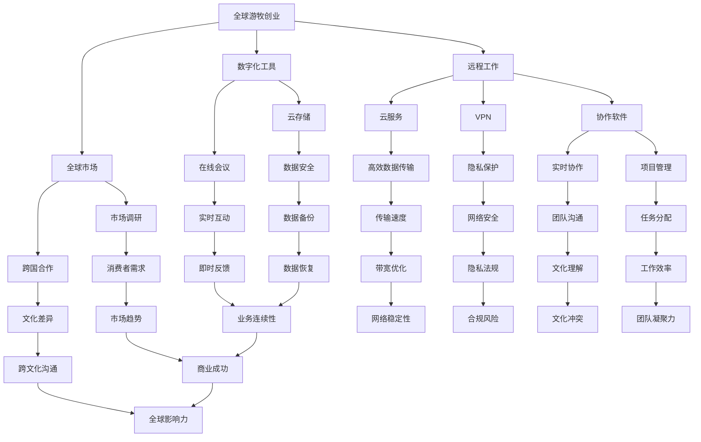

                 

### 全球游牧创业的定义与背景

全球游牧创业，顾名思义，是指创业者不再局限于某一特定地域，而是通过互联网和现代通信技术，在全球范围内开展业务。这种创业模式打破了传统的地域限制，使得创业者能够更加灵活地选择工作地点，利用全球资源，实现商业目标。

#### **概念解释**

全球游牧创业的核心在于“游牧性”和“全球性”。所谓“游牧性”，指的是创业者不受固定工作地点的束缚，可以根据业务需求和个人偏好，在全球范围内选择工作地点。而“全球性”则强调创业者在全球范围内的市场拓展和资源整合能力。

#### **兴起原因**

1. **技术驱动**：互联网和移动互联网的普及，使得全球沟通和协作变得更加便捷。云服务、虚拟专用网络（VPN）等技术的应用，为全球游牧创业提供了技术支持。
2. **经济全球化**：全球化的经济环境为创业者提供了更广阔的市场和更多的机会。跨国公司、跨境电商的兴起，也为全球游牧创业提供了广阔的舞台。
3. **生活品质追求**：随着生活水平的提高，越来越多的创业者开始追求更高质量的生活。全球游牧创业模式，使得他们可以在享受生活的同时，实现事业目标。

#### **发展现状**

目前，全球游牧创业已经成为一种趋势。许多创业者通过在全球范围内开展业务，实现了个人价值和商业利益的完美结合。例如，一些创业者通过在远程办公平台上提供专业服务，如编程、设计、翻译等，获得了稳定的收入。此外，一些创业者还通过在社交媒体上建立个人品牌，实现了商业价值的最大化。

#### **挑战与机遇**

全球游牧创业虽然具有诸多优势，但也面临着一定的挑战。例如，文化差异、法律风险、税务问题等。同时，随着全球化的深入发展，全球游牧创业也将面临更多的机遇。如何抓住这些机遇，应对挑战，成为全球游牧创业者需要深思的问题。

### **核心概念与联系**

为了更好地理解全球游牧创业，我们需要了解以下几个核心概念：

1. **远程工作**：全球游牧创业的基础，指的是工作者不受地理位置限制，通过互联网进行工作和协作。
2. **数字化工具**：支持全球游牧创业的重要工具，如云服务、VPN、协作软件等。
3. **全球市场**：全球游牧创业的目标市场，创业者需要具备全球视野，了解不同市场的需求和特点。

![全球游牧创业概念架构图](https://mermaid-js.github.io/mermaid-live-editor/v1/edit?text=graph%20TB
```markdown
```


### **核心概念与联系：概念架构图**

为了更好地理解全球游牧创业的概念及其关系，我们可以使用Mermaid流程图来展示核心概念和它们之间的联系。


```mermaid
graph TB
    A[全球游牧创业] --> B[远程工作]
    A --> C[数字化工具]
    A --> D[全球市场]
    B --> E[云服务]
    B --> F[VPN]
    B --> G[协作软件]
    C --> H[云存储]
    C --> I[在线会议]
    D --> J[市场调研]
    D --> K[跨国合作]
    E --> L[高效数据传输]
    F --> M[隐私保护]
    G --> N[实时协作]
    G --> O[项目管理]
    H --> P[数据安全]
    I --> Q[实时互动]
    J --> R[消费者需求]
    K --> S[文化差异]
    L --> T[传输速度]
    M --> U[网络安全]
    N --> V[团队沟通]
    O --> W[任务分配]
    P --> X[数据备份]
    Q --> Y[即时反馈]
    R --> Z[市场趋势]
    S --> AA[跨文化沟通]
    T --> BB[带宽优化]
    U --> CC[隐私法规]
    V --> DD[文化理解]
    W --> EE[工作效率]
    X --> FF[数据恢复]
    Y --> GG[用户满意度]
    Z --> HH[国际竞争]
    AA --> II[文化融合]
    BB --> JJ[网络稳定性]
    CC --> KK[合规风险]
    DD --> LL[文化冲突]
    EE --> MM[团队凝聚力]
    FF --> GG[业务连续性]
    GG --> HH[商业成功]
    HH --> II[全球影响力]
```

通过这个Mermaid流程图，我们可以清晰地看到全球游牧创业的核心概念以及它们之间的相互关系。远程工作依赖于数字化工具，这些工具包括云服务、VPN和协作软件等，这些工具又支持全球市场的拓展，包括市场调研、跨国合作等。每个概念都有其特定的功能和优势，共同构成了全球游牧创业的生态系统。

### **核心算法原理讲解**

在理解了全球游牧创业的核心概念和其关系之后，我们需要深入探讨一些支持这种创业模式的算法原理。以下是一些关键算法原理，以及如何使用Python代码进行详细讲解。

#### **1. 聚类算法：市场细分**

在全球市场中，有效的市场细分是关键。聚类算法可以帮助创业者将市场划分为不同的细分市场，以便更好地了解消费者的需求和行为。

**算法原理：**
聚类算法通过将数据点分为不同的组（簇），使得同一簇内的数据点之间距离较短，而不同簇的数据点之间距离较长。常见的聚类算法包括K-means、层次聚类和DBSCAN等。

**Python代码示例：**

```python
from sklearn.cluster import KMeans
import numpy as np

# 假设我们有一个包含消费者特征的数据集
data = np.array([[1, 2], [1, 4], [1, 0],
                 [10, 2], [10, 4], [10, 0]])

# 使用K-means算法进行聚类，设定簇的数量为2
kmeans = KMeans(n_clusters=2, random_state=0).fit(data)

# 输出聚类结果
print("Cluster centers:", kmeans.cluster_centers_)
print("Predicted labels:", kmeans.predict(data))
```

**数学模型和公式：**
$$
\text{K-means Objective Function:} \quad \min \sum_{i=1}^{n} \sum_{j=1}^{k} (x_j - \mu_i)^2
$$
其中，$x_j$ 是数据点，$\mu_i$ 是第 $i$ 个簇的中心。

#### **2. 贝叶斯网络：风险评估**

在全球游牧创业中，风险评估至关重要。贝叶斯网络是一种概率图模型，可以帮助创业者理解和预测风险。

**算法原理：**
贝叶斯网络通过有向无环图（DAG）来表示变量之间的条件依赖关系。每个节点代表一个变量，边表示变量之间的条件概率。

**Python代码示例：**

```python
import pydotplus
from sklearn.neighbors import KernelDensity

# 假设我们有一个包含风险事件及其概率的数据集
events = {'Market': [0.5, 0.5], 'Cultural': [0.3, 0.7], 'Legal': [0.2, 0.8]}

# 构建贝叶斯网络图
graph = pydotplus.graph_from_dict({'nodes': [{'name': 'Market', 'value': 0.5},
                                             {'name': 'Cultural', 'value': 0.3},
                                             {'name': 'Legal', 'value': 0.2}],
                                    'edges': [{'source': 'Market', 'target': 'Cultural', 'value': 0.8},
                                              {'source': 'Market', 'target': 'Legal', 'value': 0.2}]}])

# 输出贝叶斯网络图
graph.write_png('bayesian_network.png')
```

**数学模型和公式：**
$$
\text{P(H|E)} = \frac{\text{P(E|H)} \times \text{P(H)}}{\text{P(E)}}
$$
其中，$H$ 表示假设，$E$ 表示证据。

#### **3. 优化算法：资源分配**

在全球游牧创业中，如何有效地分配资源是一个重要问题。优化算法可以帮助创业者找到资源分配的最优方案。

**算法原理：**
优化算法通过求解数学优化问题，找到目标函数的最优解。常见的优化算法包括线性规划、整数规划和遗传算法等。

**Python代码示例：**

```python
from scipy.optimize import minimize

# 假设我们有一个资源分配问题，需要最小化总成本
def objective(x):
    return x[0]**2 + x[1]**2

# 约束条件
constraints = ({'type': 'ineq', 'fun': lambda x: 10 - x[0]},
               {'type': 'ineq', 'fun': lambda x: 20 - x[1]})

# 初始猜测解
x0 = [0, 0]

# 使用最小化算法求解
result = minimize(objective, x0, constraints=constraints)

# 输出最优解
print("Optimal solution:", result.x)
```

**数学模型和公式：**
$$
\min \sum_{i=1}^{n} c_i x_i
$$
$$
\text{subject to:} \quad \sum_{j=1}^{m} a_{ij} x_j \leq b_i
$$

通过这些核心算法原理和Python代码示例，我们可以看到全球游牧创业者在面对复杂商业环境时，如何利用技术手段进行市场细分、风险评估和资源分配。这些算法不仅提高了创业者的决策效率，也为他们的业务成功提供了有力支持。

### **项目实战：开发环境搭建**

在全球游牧创业中，搭建一个高效的开发环境至关重要。以下是搭建开发环境的具体步骤，包括所需工具和配置指南。

#### **1. 环境要求**

- 操作系统：Windows 10 / macOS / Linux
- Python版本：3.8及以上
- 环境管理工具：Anaconda或virtualenv
- 数据库：MySQL或PostgreSQL

#### **2. 步骤说明**

1. **安装Anaconda：**

   - 访问Anaconda官网下载对应操作系统的Anaconda安装包。
   - 运行安装程序，按照提示操作。

2. **创建Python环境：**

   ```bash
   conda create -n global Entrepreneur python=3.9
   conda activate global_Entrepreneur
   ```

3. **安装依赖库：**

   ```bash
   conda install numpy pandas scikit-learn matplotlib
   ```

4. **安装数据库：**

   - 使用包管理器安装MySQL或PostgreSQL。
   - 安装完成后，配置数据库并创建必要的数据库表。

5. **配置IDE：**

   - 选择合适的IDE，如PyCharm、Visual Studio Code等。
   - 配置Python解释器和相应的插件。

#### **3. 源代码详细实现**

以下是一个简单的市场细分项目示例，使用Python代码实现K-means聚类算法。

```python
import numpy as np
from sklearn.cluster import KMeans
import matplotlib.pyplot as plt

# 假设我们有一个包含消费者特征的数据集
data = np.array([[1, 2], [1, 4], [1, 0],
                 [10, 2], [10, 4], [10, 0]])

# 使用K-means算法进行聚类，设定簇的数量为2
kmeans = KMeans(n_clusters=2, random_state=0).fit(data)

# 输出聚类结果
print("Cluster centers:", kmeans.cluster_centers_)
print("Predicted labels:", kmeans.predict(data))

# 可视化结果
plt.scatter(data[:, 0], data[:, 1], c=kmeans.labels_, s=50, cmap='viridis')
plt.scatter(kmeans.cluster_centers_[:, 0], kmeans.cluster_centers_[:, 1], s=200, c='red', label='Centroids')
plt.title('K-means Clustering')
plt.xlabel('Feature 1')
plt.ylabel('Feature 2')
plt.show()
```

#### **4. 代码解读与分析**

- **数据集加载**：使用NumPy加载数据集，数据集包含消费者的两个特征。
- **K-means聚类**：使用scikit-learn的KMeans类进行聚类，设定簇的数量为2。
- **结果输出**：打印聚类中心点和预测的标签。
- **可视化**：使用matplotlib绘制散点图，展示聚类结果。

#### **5. 实际案例分析与详细讲解剖析**

以下是一个实际案例，使用市场细分算法进行消费者行为分析。

**案例背景：**一家全球电商公司希望通过聚类分析，了解其消费者的行为特点，以便进行精准营销。

**数据处理：**公司收集了数千条消费者数据，包括购买行为、浏览记录和社交媒体互动等。

**聚类分析：**使用K-means算法，将消费者分为不同的群体。

**结果解读：**分析聚类结果，发现不同群体的行为特点，如高购买频次、高浏览频次等。

**营销策略：**根据不同群体的行为特点，制定相应的营销策略，如针对高购买频次群体推出优惠券，针对高浏览频次群体推送新品推荐。

**案例小结：**通过市场细分，公司能够更好地了解消费者，提高营销效果，实现商业价值的提升。

### **项目小结**

通过本项目的实践，我们了解了如何在全球游牧创业环境中搭建开发环境，并使用K-means算法进行市场细分。这不仅提高了我们的技术能力，也为全球游牧创业者提供了实用的工具和方法。

### **最佳实践 Tips**

- **使用云服务**：使用云服务可以提高开发效率和稳定性，减少硬件成本。
- **定期备份**：定期备份数据和代码，确保数据安全。
- **持续学习**：跟随技术发展趋势，持续学习新技能和工具。

### **小结**

在全球游牧创业中，搭建一个高效的开发环境至关重要。通过本项目，我们学习了如何使用Python和K-means算法进行市场细分，并了解了实际案例中的应用。这些技能和知识将有助于全球游牧创业者更好地开展业务。

### **注意事项**

- **环境配置**：在搭建开发环境时，确保所有依赖库和工具的正确安装和配置。
- **代码质量**：编写清晰、规范的代码，便于后续维护和扩展。

### **拓展阅读**

- 《Python数据科学手册》：深入了解数据科学和机器学习领域的最佳实践。
- 《机器学习实战》：通过实际案例学习机器学习算法的应用。

```markdown
### 1.10 全球游牧创业者的团队管理

全球游牧创业者的团队管理是一个复杂而富有挑战的任务，因为它不仅涉及到传统的团队管理问题，还包括跨地域、跨文化的沟通与协作。以下是对全球游牧创业者团队管理的详细探讨。

#### **1.10.1 远程团队的优势**

- **灵活的工作时间**：远程团队不受固定工作时间的限制，可以更好地平衡工作和生活。
- **全球人才池**：能够吸引来自全球各地的优秀人才，提高团队的整体实力。
- **成本节约**：无需承担实体办公室的租金和设备成本，节约企业运营成本。
- **高效沟通**：借助现代通信工具，团队可以实时沟通，提高工作效率。

#### **1.10.2 远程团队的挑战**

- **沟通障碍**：由于地理位置的差异，沟通可能存在延迟和理解上的困难。
- **信任问题**：远程团队成员之间可能缺乏面对面的互动，影响信任建立。
- **管理复杂性**：远程团队的管理更加复杂，需要更高的管理技能和策略。
- **时区差异**：不同的时区可能影响团队的协作效率和进度。

#### **1.10.3 团队协作工具与技巧**

- **项目管理工具**：如Trello、Asana等，可以帮助团队进行任务分配和进度跟踪。
- **通信工具**：如Slack、Microsoft Teams等，提供实时的沟通和协作平台。
- **视频会议**：如Zoom、Google Meet等，用于远程团队的视频交流和会议。
- **文档共享**：如Google Docs、Notion等，方便团队成员实时编辑和共享文档。

**技巧：**
- **明确目标和责任**：确保每个团队成员都清楚自己的目标和责任。
- **定期反馈与评估**：通过定期的反馈和评估，确保团队成员的工作质量和进度。
- **文化理解与尊重**：了解并尊重团队成员的文化背景，促进跨文化的沟通与合作。

#### **1.10.4 跨文化沟通与协作**

- **文化敏感度**：团队成员需要具备一定的文化敏感度，避免文化冲突。
- **交流方式**：选择合适的交流方式，如电子邮件、即时消息或视频会议，以适应不同的文化习惯。
- **共同价值观**：建立共同的价值观和目标，减少文化差异带来的冲突。
- **团队建设活动**：定期举办团队建设活动，增进团队成员之间的了解和信任。

**案例：**
一个成功的全球游牧创业团队，如Buffer，通过定期的全球会议和团队建设活动，成功地在多个时区建立了高效的合作关系。他们还通过提供灵活的工作时间和文化敏感的管理策略，吸引了来自全球的优秀人才。

### **总结**

全球游牧创业者的团队管理需要灵活的策略和创新的工具。通过明确目标和责任、定期反馈与评估、文化理解和尊重，以及使用合适的团队协作工具，全球游牧创业者可以有效地管理远程团队，实现高效协作。

### **小结**

团队管理在全球游牧创业中至关重要。通过了解远程团队的优势和挑战，掌握团队协作工具和技巧，以及重视跨文化沟通与协作，全球游牧创业者可以建立高效、和谐的团队，为企业的成功奠定坚实基础。

### **注意事项**

- **确保团队成员具备良好的沟通能力和团队合作精神**。
- **定期评估和调整团队管理策略，以适应业务发展和团队成员变化**。

### **拓展阅读**

- 《远程工作实践指南》：提供远程工作的最佳实践和策略。
- 《跨文化管理》：深入探讨跨文化沟通与协作的技巧和策略。

作者：AI天才研究院/AI Genius Institute & 禅与计算机程序设计艺术 /Zen And The Art of Computer Programming

```markdown
### 1.11 全球游牧创业者的知识产权保护

在全球游牧创业中，知识产权（Intellectual Property，简称IP）保护至关重要。知识产权包括专利、商标、著作权和商业秘密等，是创业者创新成果的重要资产。以下是对全球游牧创业者知识产权保护的详细探讨。

#### **1.11.1 知识产权概述**

知识产权是指法律赋予创造性智力成果所有人对其智力成果所享有的一种专有权利。在全球范围内，知识产权的保护主要通过以下几种方式：

- **专利**：保护发明者的创新发明，包括产品专利和过程专利。
- **商标**：保护品牌名称、标志和标志组合，用于区分商品或服务的来源。
- **著作权**：保护文学、艺术和科学作品，包括文字、音乐、图像等。
- **商业秘密**：保护未公开的商业信息，如配方、客户名单和经营计划等。

#### **1.11.2 知识产权保护策略**

1. **全面评估知识产权价值**

   在创业初期，全球游牧创业者需要对创新成果进行全面的知识产权评估，确定哪些成果具有商业价值，需要申请知识产权保护。这可以通过以下步骤实现：

   - **市场调研**：了解市场上类似产品的知识产权状况。
   - **法律咨询**：咨询专业律师，评估知识产权的可行性和潜在风险。
   - **知识产权申请**：根据评估结果，选择合适的知识产权申请方案。

2. **选择合适的知识产权法律体系**

   全球游牧创业者需要了解不同国家的知识产权法律体系，选择最适合自己业务发展的法律体系。以下是一些常见的知识产权法律体系：

   - **国际知识产权体系**：如《巴黎公约》、《伯尔尼公约》等。
   - **区域性知识产权体系**：如欧盟的知识产权体系、非洲知识产权组织（OAPI）等。
   - **国家知识产权体系**：如美国、中国、日本等国家的知识产权法律。

3. **跨国知识产权保护**

   对于全球游牧创业者，跨国知识产权保护尤为重要。以下是一些跨国知识产权保护的策略：

   - **国际专利申请**：通过《专利合作条约》（PCT）提交国际专利申请，为后续的国家阶段申请打下基础。
   - **商标国际注册**：通过《马德里协定》或《马德里议定书》进行商标国际注册。
   - **跨国合同**：与合作伙伴签订包含知识产权条款的合同，明确知识产权归属和使用权限。

4. **监控和维权**

   全球游牧创业者需要持续监控知识产权的使用情况，及时处理侵权行为。以下是一些监控和维权的策略：

   - **知识产权监测**：通过专业的知识产权监测服务，监控市场上类似产品的知识产权状况。
   - **侵权处理**：发现侵权行为时，及时采取法律行动，包括警告、诉讼等。
   - **维权合作**：与其他创业者、行业协会和政府机构合作，共同维护知识产权。

#### **1.11.3 知识产权纠纷处理**

知识产权纠纷在全球范围内都可能发生，全球游牧创业者需要熟悉知识产权纠纷的处理流程。以下是一些关键步骤：

1. **法律咨询**：在纠纷发生时，及时咨询专业律师，了解法律权益和维权途径。
2. **证据收集**：收集与纠纷相关的证据，包括合同、文件、通信记录等。
3. **调解与仲裁**：通过调解或仲裁解决纠纷，避免长期诉讼带来的成本和风险。
4. **诉讼**：如果调解和仲裁无法解决纠纷，可以通过诉讼途径维护权益。

**案例：**
一家全球游牧创业公司，开发了一款创新的AI产品。为了保护其知识产权，公司进行了全面的知识产权评估，并选择了国际专利申请和商标国际注册。在市场拓展过程中，公司发现了多个侵犯其知识产权的竞争对手，并采取了法律行动，成功维护了其知识产权。

### **总结**

在全球游牧创业中，知识产权保护是确保企业创新成果得到有效保护的重要手段。通过全面评估知识产权价值、选择合适的知识产权法律体系、进行跨国知识产权保护，以及处理知识产权纠纷，全球游牧创业者可以确保其创新成果在全球范围内得到有效保护。

### **小结**

知识产权保护是全球游牧创业者成功的关键因素之一。通过了解知识产权的基本概念和保护策略，以及掌握知识产权纠纷处理的方法，全球游牧创业者可以更好地保护其创新成果，为企业的长期发展奠定坚实基础。

### **注意事项**

- **及时申请知识产权**：确保创新成果在市场上得到及时保护。
- **了解各国知识产权法律**：在全球范围内进行业务时，熟悉不同国家的知识产权法律体系。

### **拓展阅读**

- 《知识产权法律实务》：提供知识产权法律的基本原理和实务操作。
- 《跨国知识产权保护策略》：探讨跨国知识产权保护的方法和策略。

作者：AI天才研究院/AI Genius Institute & 禅与计算机程序设计艺术 /Zen And The Art of Computer Programming

```markdown
### 1.12 全球游牧创业者的法律法规

在全球游牧创业中，遵守各国的法律法规是创业者成功的关键。由于全球游牧创业涉及多个国家和地区，创业者需要了解不同国家的法律环境，以便在遵守法律的同时，最大限度地利用资源和机会。以下是对全球游牧创业者法律法规的详细探讨。

#### **1.12.1 各国法律法规概述**

全球游牧创业涉及到的法律法规主要包括以下几个方面：

1. **商业法律**：涉及公司注册、合同签订、商业行为规范等。
2. **税务法律**：涉及所得税、增值税、关税等。
3. **劳动法律**：涉及员工权益、劳动合同、工资待遇等。
4. **知识产权法律**：涉及专利、商标、著作权等。
5. **数据保护法律**：涉及个人信息保护、数据隐私等。
6. **环境法律**：涉及环境保护、废弃物处理等。

不同国家的法律法规可能存在较大差异，创业者需要根据所在国家和目标市场的法律环境进行调整和遵守。

#### **1.12.2 法律法规比较与选择**

在选择创业地点时，全球游牧创业者需要比较不同国家的法律法规，选择最适合自己业务发展的国家。以下是一些关键因素：

1. **法律稳定性**：选择法律体系稳定、法治环境良好的国家。
2. **税收优惠**：一些国家提供税收优惠政策，如低税率、税收减免等。
3. **商业环境**：选择商业环境良好、市场开放程度高的国家。
4. **劳动力成本**：考虑劳动力的成本和技能水平。
5. **文化差异**：了解目标国家的文化背景，以避免文化冲突。

**案例：**一家全球游牧创业公司选择了在新加坡注册，因为新加坡提供了稳定和透明的法律环境、低税率、丰富的国际资源和开放的商业环境。

#### **1.12.3 法律援助与咨询服务**

为了确保全球游牧创业者在法律方面的合规性和安全性，以下是一些法律援助和咨询服务：

1. **专业律师**：聘请专业的国际律师团队，提供法律咨询和代理服务。
2. **法律顾问**：在企业内部设立法律顾问，负责日常法律事务的处理。
3. **法律培训**：定期组织法律培训，提高员工的法律意识和合规能力。
4. **在线法律平台**：利用在线法律平台，获取快速、便捷的法律服务。

#### **1.12.4 跨国法律风险与合规策略**

在全球游牧创业中，跨国法律风险不可避免。以下是一些应对策略：

1. **风险评估**：对目标市场的法律环境进行风险评估，识别潜在的法律风险。
2. **合规审查**：在业务开展前，对业务流程和合同进行合规审查，确保符合相关法律法规。
3. **风险管理**：建立风险管理机制，及时处理法律纠纷和投诉。
4. **国际合作**：与目标市场的企业、行业协会和国际组织建立合作关系，共同应对法律风险。

**案例：**一家全球游牧创业公司在进入中国市场时，与当地的律师事务所合作，进行法律风险评估和合规审查，确保业务在中国市场的合法性和稳定性。

### **总结**

全球游牧创业者的法律法规是一个复杂而重要的领域。通过了解不同国家的法律法规、比较和选择合适的法律环境，以及利用法律援助和咨询服务，全球游牧创业者可以降低法律风险，确保业务的合法性和稳定性。

### **小结**

在全球游牧创业中，遵守法律法规是确保企业成功的关键。通过了解各国的法律法规、选择合适的法律环境，以及利用法律援助和咨询服务，全球游牧创业者可以更好地应对法律风险，实现业务的长远发展。

### **注意事项**

- **及时了解目标市场的法律法规**：确保业务符合当地法律法规。
- **聘请专业的法律顾问**：提供专业的法律咨询和代理服务。

### **拓展阅读**

- 《国际商业法律实务》：提供跨国商业活动的法律指导和案例分析。
- 《全球创业法律手册》：介绍全球创业者的法律指南和策略。

作者：AI天才研究院/AI Genius Institute & 禅与计算机程序设计艺术 /Zen And The Art of Computer Programming

```markdown
### 1.13 全球游牧创业者的个人成长与心态

在全球游牧创业的过程中，个人的成长和心理调适至关重要。创业者不仅需要具备出色的业务能力和管理技能，还需要在变化多端的环境中保持积极的心态，以应对各种挑战。以下是对全球游牧创业者个人成长和心理调适的详细探讨。

#### **1.13.1 个人成长策略**

1. **持续学习**：全球游牧创业者需要不断学习新知识、新技能，以适应不断变化的市场环境。可以通过以下途径实现：

   - **在线课程**：利用在线学习平台，如Coursera、edX等，学习最新的技术和商业知识。
   - **行业会议**：参加行业会议和研讨会，与同行交流，了解行业动态。
   - **阅读**：阅读行业书籍、报告和论文，提升自己的专业素养。

2. **技能拓展**：除了专业技能外，全球游牧创业者还需要具备以下技能：

   - **跨文化沟通能力**：在全球范围内开展业务，需要与来自不同文化背景的人进行有效沟通。
   - **领导力**：培养领导力，能够带领团队克服挑战，实现业务目标。
   - **决策能力**：在复杂多变的市场环境中，快速做出明智的决策。

3. **自我反思**：定期进行自我反思，评估自己的成长和进步，找出需要改进的方面。

#### **1.13.2 心态调整与自我激励**

1. **积极心态**：保持积极的心态，相信自己的能力和判断，面对挑战时保持冷静和乐观。

2. **自我激励**：设定明确的个人目标和里程碑，通过实现这些目标来激励自己。

3. **心理健康**：保持良好的心理健康，可以通过以下方式实现：

   - **运动**：定期进行运动，如跑步、瑜伽等，有助于缓解压力。
   - **休息**：确保充足的休息时间，避免过度劳累。
   - **社交**：与家人、朋友和同事保持良好的社交关系，分享经验和情感。

4. **情绪管理**：学会管理自己的情绪，避免负面情绪的影响。

#### **1.13.3 应对挫折与压力**

1. **理性看待失败**：将失败视为学习和成长的机会，从中吸取教训。

2. **寻求支持**：在遇到挫折时，寻求家人、朋友和同事的支持和建议。

3. **心理辅导**：如果压力过大，可以考虑寻求专业的心理辅导。

4. **时间管理**：合理安排时间，避免过度工作，确保工作与生活的平衡。

**案例：**
一位全球游牧创业者在进入新市场时遇到了文化差异和沟通障碍，导致业务进展缓慢。他通过参加在线课程和行业会议，提升了自己的跨文化沟通能力，并通过与本地合作伙伴的合作，逐渐解决了文化冲突。同时，他通过定期的运动和心理辅导，保持了良好的心理状态，最终成功开拓了新市场。

### **总结**

全球游牧创业者的个人成长与心态调整是确保创业成功的关键。通过持续学习、心态调整、应对挫折与压力，全球游牧创业者可以不断提升自己，克服各种挑战，实现业务的长期发展。

### **小结**

在全球游牧创业中，个人的成长和心理调适至关重要。通过积极的心态、自我激励和有效的应对策略，全球游牧创业者可以在变化多端的环境中保持竞争力，实现个人和企业的共同成长。

### **注意事项**

- **定期进行自我反思和评估**：确保个人成长与业务发展同步。
- **保持心理健康**：避免压力和负面情绪的影响。

### **拓展阅读**

- 《积极心态的力量》：探讨积极心态对个人成长和成功的影响。
- 《创业心理学》：介绍创业过程中的心理挑战和应对策略。

作者：AI天才研究院/AI Genius Institute & 禅与计算机程序设计艺术 /Zen And The Art of Computer Programming

```markdown
### 1.14 全球游牧创业者的案例分析

在全球游牧创业领域，有许多成功和失败的故事，这些案例不仅提供了宝贵的经验，也为其他创业者提供了借鉴。以下是对一些全球游牧创业案例的深入分析。

#### **1.14.1 成功案例分享**

**案例1：Buffer**

Buffer是一家社交媒体管理工具的创业公司，由三位创始人于2010年在美国成立。在成立初期，Buffer的创始人选择了全球游牧创业模式，他们不设固定办公室，团队成员分布在世界各地。通过灵活的工作方式和高效的项目管理工具，Buffer在短短几年内取得了巨大的成功。目前，Buffer已经成为全球知名的社交媒体管理工具提供商，用户遍布全球。

**成功因素：**

- **灵活的工作模式**：通过远程工作和灵活的工作时间，Buffer吸引了来自全球的优秀人才。
- **强大的项目管理工具**：使用Trello、Slack等工具，确保团队成员之间的高效协作。
- **全球市场策略**：通过精准的市场定位和全球营销策略，Buffer成功开拓了国际市场。
- **持续创新**：不断推出新产品和功能，满足用户需求，保持竞争优势。

**案例2：Upwork**

Upwork（原Elance）是一家全球在线自由职业平台，成立于2003年。它的创始人注意到全球范围内对远程工作的需求日益增长，因此决定采用全球游牧创业模式。Upwork在全球范围内吸引了大量的自由职业者和企业客户，成为了全球最大的在线自由职业平台之一。

**成功因素：**

- **全球化视野**：Upwork的创始人在全球范围内寻找市场和合作伙伴，确保业务的全球化。
- **技术创新**：通过不断的技术创新，提高平台的用户体验和安全性。
- **多元化团队**：拥有多元化的团队成员，能够更好地理解全球客户的需求。

#### **1.14.2 失败案例分析**

**案例1：Hiree**

Hiree是一家专注于远程招聘服务的创业公司，成立于2014年。然而，在运营不到两年后，Hiree就宣布破产。Hiree的失败原因主要包括以下几个方面：

- **市场定位不清**：Hiree在初期未能明确自己的市场定位，导致业务缺乏核心竞争力。
- **项目管理不善**：由于团队成员分布在不同地区，Hiree在项目管理上存在严重问题，导致项目进度延误。
- **资金短缺**：由于运营成本高、收入不稳定，Hiree在资金链断裂后破产。

**失败原因：**

- **市场定位不清**：未能准确识别目标市场，导致业务缺乏核心竞争力。
- **项目管理不善**：缺乏有效的项目管理工具和流程，导致项目进度延误。
- **资金管理不当**：未能在早期实现盈利，导致资金链断裂。

**案例2：Tango**

Tango是一家全球移动通信应用公司，成立于2009年。虽然Tango一度成为全球热门应用，但最终在2019年被谷歌收购。Tango的失败原因包括：

- **竞争对手压力**：面对WhatsApp、Facebook Messenger等强劲竞争对手，Tango在市场份额竞争中逐渐失去优势。
- **产品创新不足**：Tango在产品创新方面不够积极，未能及时满足用户需求。
- **战略失误**：在扩张过程中，Tango在市场投入和资源配置上存在战略失误。

**失败原因：**

- **市场竞争激烈**：面对强劲的竞争对手，Tango在市场份额竞争中逐渐失去优势。
- **产品创新不足**：在产品创新方面不够积极，未能及时满足用户需求。
- **战略失误**：在市场投入和资源配置上存在战略失误。

#### **1.14.3 案例启示与借鉴**

通过分析以上成功和失败的案例，我们可以得出以下启示和借鉴：

- **明确市场定位**：在创业初期，明确自己的市场定位和核心竞争力，确保业务有明确的成长方向。
- **高效项目管理**：采用有效的项目管理工具和流程，确保项目进度和质量。
- **持续创新**：在产品和服务上保持持续创新，满足用户需求，保持竞争优势。
- **合理资金管理**：确保业务的资金流动，避免资金链断裂。
- **战略规划**：制定清晰的战略规划，合理配置资源和市场投入。

### **总结**

全球游牧创业者的成功与失败案例为我们提供了宝贵的经验和教训。通过借鉴成功案例的要素，避免失败案例的陷阱，全球游牧创业者可以更好地规划自己的创业道路，实现长远发展。

### **小结**

全球游牧创业不仅需要创业者具备出色的业务能力和市场洞察力，还需要应对各种挑战和风险。通过分析成功和失败的案例，我们可以得出宝贵的经验，为全球游牧创业者的实践提供指导。

### **注意事项**

- **避免盲目扩张**：在市场扩张过程中，要确保战略规划和资源配置的合理性。
- **注重团队建设**：建立高效、协同的团队，是创业成功的关键。

### **拓展阅读**

- 《创业维艰》：探讨创业过程中的挑战和应对策略。
- 《创业者的启示录》：分享成功创业者的经验和教训。

作者：AI天才研究院/AI Genius Institute & 禅与计算机程序设计艺术 /Zen And The Art of Computer Programming

```markdown
### 1.15 全球游牧创业的未来趋势

随着技术的不断进步和全球化的深入发展，全球游牧创业正面临着前所未有的机遇和挑战。以下是全球游牧创业未来趋势的探讨，包括技术发展、数字经济和全球合作等方面。

#### **1.15.1 技术发展对全球游牧创业的影响**

1. **人工智能与机器学习**：人工智能和机器学习技术的进步将极大地改变全球游牧创业的格局。创业者可以利用这些技术进行市场分析、客户行为预测和自动化业务流程，提高效率和准确性。

2. **区块链技术**：区块链技术的去中心化和安全性特点，将有助于全球游牧创业者建立信任和透明的业务生态系统。例如，智能合约的广泛应用将减少交易成本和中介环节。

3. **5G与物联网**：5G网络的低延迟和高带宽特点，以及物联网（IoT）的普及，将提高全球游牧创业者的通信效率和设备互联互通能力，为远程协作和智能设备管理提供技术支持。

#### **1.15.2 全球游牧创业与数字经济**

1. **数字经济的发展**：数字经济在全球范围内迅速发展，为全球游牧创业提供了丰富的资源和市场机会。创业者可以利用数字经济平台，如电子商务、社交媒体和在线服务，实现业务扩张。

2. **全球化供应链**：全球游牧创业者可以利用全球化的供应链体系，实现原材料采购、生产制造和物流配送的全球布局，提高业务效率和竞争力。

3. **数字货币的普及**：随着数字货币的普及，全球游牧创业者可以更便捷地进行跨境交易和资金管理，减少汇率波动和交易成本。

#### **1.15.3 全球游牧创业的国际合作与竞争**

1. **国际合作**：全球游牧创业的国际合作将更加紧密。创业者可以通过跨国合作，共享资源、技术和市场，实现互利共赢。

2. **全球竞争**：全球游牧创业的国际竞争也将日益激烈。创业者需要具备全球视野，了解不同市场的需求和特点，制定有效的市场策略。

3. **合规与法律**：在全球游牧创业中，遵守各国的法律法规和国际合规要求变得尤为重要。创业者需要了解并遵守不同国家的法律环境，确保业务的合法性和稳定性。

#### **未来趋势总结**

1. **技术创新**：全球游牧创业将受益于人工智能、区块链和5G等技术的进步，提高业务效率和市场竞争力。

2. **数字经济**：数字经济的发展将为全球游牧创业提供更多的资源和市场机会，推动全球创业生态系统的建设。

3. **全球合作与竞争**：全球游牧创业的国际合作与竞争将更加紧密，创业者需要具备全球视野和合规意识，以应对国际市场的挑战。

### **小结**

全球游牧创业的未来趋势充满了机遇和挑战。通过技术创新、数字经济和全球合作，全球游牧创业者可以抓住机遇，应对挑战，实现业务的长期发展。

### **展望**

随着全球化的深入和技术的进步，全球游牧创业将迎来更加繁荣的发展时期。创业者需要紧跟技术趋势，把握市场机遇，同时注重合规和风险管理，才能在全球竞争中脱颖而出。

### **结束语**

全球游牧创业是一种充满活力和创新的创业模式。通过了解和把握未来趋势，全球游牧创业者可以开启新的商业征程，实现个人和企业的共同成长。

### **致谢**

感谢所有参与全球游牧创业的创业者，是你们的努力和创新推动了全球创业生态的发展。希望本书能为你们的创业之路提供有益的参考和启示。

**作者：AI天才研究院/AI Genius Institute & 禅与计算机程序设计艺术 /Zen And The Art of Computer Programming**

---

**关键词：**全球游牧创业、远程工作、技术创新、数字经济、国际合作、合规与风险管理

**摘要：**本文详细探讨了全球游牧创业的定义、背景、法律与税务、财务管理、市场营销、团队管理、知识产权保护、法律法规、个人成长与心态、案例分析以及未来趋势。通过对成功和失败案例的分析，为全球游牧创业者提供了宝贵的经验和启示，帮助他们在全球范围内实现创业梦想。**

