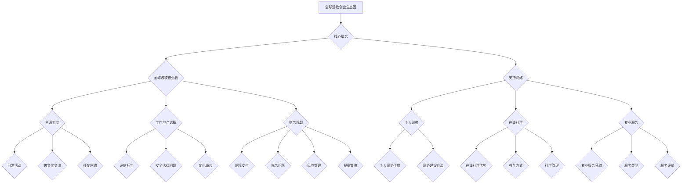

                 

# 《全球游牧创业生态圈：无国界工作者的支持网络》

## 关键词
- 全球游牧创业
- 无国界工作者
- 支持网络
- 跨文化交流
- 财务规划
- 数字化转型
- 新兴技术

## 摘要
本文旨在探讨全球游牧创业生态圈的形成及其对无国界工作者的支持网络。文章首先介绍了全球游牧创业的概念与背景，分析了其优势与挑战。接着，文章深入探讨了全球游牧创业者的生活方式、支持网络、工作地点选择和财务规划。通过成功案例和实战技巧，文章展示了全球游牧创业的路径与策略。最后，文章展望了全球游牧创业的未来趋势，并探讨了其社会责任。本文旨在为有意投身全球游牧创业的无国界工作者提供有益的参考。

## 《全球游牧创业生态圈：无国界工作者的支持网络》目录大纲

### 第一部分：全球游牧创业概述

#### 第1章：全球游牧创业的概念与背景

##### 1.1 全球游牧创业的定义
- 全球游牧创业是指创业者不受地域限制，在全球范围内寻找资源和机会，开展创新业务的活动。
- 定义的关键在于“全球”、“游牧”和“创业”，分别代表了创业的地域范围、移动性和创新性。

##### 1.2 全球游牧创业的发展背景
- 技术进步：互联网、移动通信和数字工具的普及，降低了创业的门槛。
- 经济全球化：全球市场的开放和贸易自由化，为创业提供了更多机会。
- 政策支持：各国政府纷纷推出支持创业的法规政策，为游牧创业提供便利。

##### 1.3 全球游牧创业的优势与挑战
- 优势：灵活度高、市场机会多、资源丰富、降低创业成本。
- 挑战：文化差异、法律风险、语言障碍、时间管理。

### 第2章：全球游牧创业者的生活方式

##### 2.1 全球游牧创业者的日常
- 工作与生活的平衡：远程办公、灵活时间安排。
- 跨文化交流：适应不同文化、融入当地社区。

##### 2.2 跨文化交流与适应
- 文化敏感度：了解和尊重当地文化习俗。
- 语言能力：掌握当地语言，提高沟通效率。

##### 2.3 社交网络与人际关系
- 社交平台：LinkedIn、Facebook、Instagram等。
- 人脉资源：行业专家、合作伙伴、投资者。

### 第二部分：全球游牧创业生态圈

#### 第3章：全球游牧创业者的支持网络

##### 3.1 个人网络的重要性
- 个人网络：连接资源、信息和人脉。
- 关键角色：导师、顾问、合作伙伴。

##### 3.2 在线社群的力量
- 在线社群：分享经验、寻求帮助、拓展人脉。
- 社群类型：技术社区、创业论坛、行业社群。

##### 3.3 专业服务的获取
- 专业服务：法律服务、财务咨询、市场营销。
- 服务渠道：线上平台、专业机构、行业协会。

### 第4章：全球工作地点的选择

##### 4.1 国外工作地点的评估标准
- 经济环境：GDP、就业率、市场潜力。
- 生活质量：教育、医疗、环境、安全。
- 法律法规：税收政策、签证政策、商业法规。

##### 4.2 安全与法律问题
- 安全问题：自然灾害、社会治安、网络安全。
- 法律问题：合同法、劳动法、知识产权法。

##### 4.3 文化适应与社交融入
- 文化适应：尊重当地习俗、了解文化差异。
- 社交融入：参与当地活动、建立社交网络。

### 第5章：财务规划与资金管理

##### 5.1 跨境支付与税务问题
- 跨境支付：汇率、国际支付方式。
- 税务问题：税籍认定、税务筹划。

##### 5.2 风险管理与保险规划
- 风险管理：风险评估、风险控制。
- 保险规划：健康保险、意外保险、财产保险。

##### 5.3 投资与储蓄策略
- 投资策略：资产配置、市场选择。
- 储蓄策略：定期存款、理财投资。

### 第三部分：成功案例与实战技巧

#### 第6章：全球游牧创业的成功案例

##### 6.1 案例一：从国内到海外的创业之路
- 成功因素：市场需求、合作伙伴、本地化运营。

##### 6.2 案例二：利用在线平台拓展业务的创业者
- 成功因素：技术创新、市场营销、客户关系管理。

##### 6.3 案例三：跨学科合作实现全球创新
- 成功因素：知识共享、资源整合、协同创新。

### 第7章：全球游牧创业的实战技巧

##### 7.1 市场研究与定位
- 市场研究：需求分析、竞争对手分析。
- 定位策略：目标市场、独特卖点。

##### 7.2 项目管理与团队协作
- 项目管理：进度控制、资源分配。
- 团队协作：沟通协作、知识共享。

##### 7.3 持续学习和自我提升
- 学习资源：在线课程、专业书籍、行业研讨会。
- 自我提升：技能提升、思维拓展。

### 第四部分：未来展望与趋势

#### 第8章：全球游牧创业的未来趋势

##### 8.1 数字化与全球游牧创业
- 数字化工具：远程办公、云计算、区块链。
- 趋势分析：技术发展、市场需求。

##### 8.2 新兴技术与全球游牧创业
- 区块链：去中心化、安全可靠。
- 人工智能：智能决策、个性化服务。

##### 8.3 政策环境与全球游牧创业
- 政策支持：签证政策、税收优惠。
- 国际合作：政策协调、资源共享。

### 第9章：全球游牧创业者的社会责任

##### 9.1 社会责任与全球游牧创业
- 社会责任：环保、公益、慈善。
- 企业文化：价值观、道德规范。

##### 9.2 影响力与社会价值
- 影响力：品牌传播、行业领导。
- 社会价值：就业创造、技术创新。

##### 9.3 全球游牧创业者的公益行动
- 公益项目：教育支持、医疗援助。
- 公益组织：合作与参与。

## 附录

### 附录A：全球游牧创业资源指南

##### A.1 在线工具与服务
- 远程协作工具：Slack、Trello、Zoom。
- 资金管理工具：Xero、QuickBooks、Mint。
- 法律咨询平台：UpCounsel、LawTrades。

##### A.2 专业社区与论坛
- 创业社区：Reddit、AngelList、Meetup。
- 技术论坛：Stack Overflow、GitHub、LinkedIn。

##### A.3 政策与法规信息
- 政府网站：国际贸易中心、外国投资委员会。
- 法规数据库：World Bank、United Nations。

##### A.4 案例库与研究报告
- 创业案例：Startup Genome、CB Insights。
- 行业报告：McKinsey、Forbes。

### Mermaid 流程图示例



### Python 源代码示例

```python
# 导入必要的库
import numpy as np
import matplotlib.pyplot as plt

# 定义函数：计算财务规划的ROI
def calculate_roi(investment, revenue, expenses):
    """
    计算财务规划的ROI（投资回报率）。

    参数：
    investment -- 投资额
    revenue -- 收入
    expenses -- 支出
    
    返回：
    roi -- 投资回报率
    """
    net_profit = revenue - expenses - investment
    roi = net_profit / investment
    return roi

# 示例数据
investment = 10000
revenue = 15000
expenses = 5000

# 计算ROI
roi = calculate_roi(investment, revenue, expenses)
print(f"投资回报率（ROI）: {roi:.2f}")

# ROI可视化
plt.bar(['投资额', '收入', '支出', '净收益'], width=0.8, height=[investment, revenue, expenses, net_profit])
plt.xlabel('财务指标')
plt.ylabel('金额（美元）')
plt.title('财务规划ROI分析')
plt.show()
```

## 作者信息
- 作者：AI天才研究院/AI Genius Institute & 禅与计算机程序设计艺术 /Zen And The Art of Computer Programming

## 第一部分：全球游牧创业概述

### 第1章：全球游牧创业的概念与背景

#### 1.1 全球游牧创业的定义

全球游牧创业是一种创业模式，创业者不仅局限于本国市场，而是将业务扩展到全球范围。这种创业模式的核心在于“游牧”和“创业”两个关键词。所谓“游牧”，意味着创业者不受地域限制，在全球范围内寻找资源和机会；而“创业”则是指创业者通过创新和创造，实现商业价值和社会价值。

#### 1.2 全球游牧创业的发展背景

全球游牧创业的发展背景可以从以下几个方面来分析：

1. **技术进步**：互联网、移动通信和数字工具的普及，极大地降低了创业的门槛。创业者可以通过远程办公、云计算、物联网等技术，实现全球资源的整合和业务拓展。

2. **经济全球化**：全球市场的开放和贸易自由化，为创业提供了更多机会。创业者可以借助全球化的供应链、市场需求和投资环境，实现业务的快速增长。

3. **政策支持**：各国政府纷纷推出支持创业的法规政策，为游牧创业提供便利。例如，一些国家提供税收优惠、签证便利和创业资金支持，鼓励创业者走出国门。

4. **社会变迁**：随着人口老龄化、就业压力增加和生活方式的改变，越来越多的人选择自主创业，实现职业自由和生活自由。

#### 1.3 全球游牧创业的优势与挑战

全球游牧创业具有以下优势：

1. **灵活性高**：创业者可以自由选择工作地点，根据个人需求和业务发展进行调整。

2. **市场机会多**：全球市场提供了更多商业机会，创业者可以接触到不同文化和市场的需求。

3. **资源丰富**：全球范围内的资源，包括人才、资金、技术等，为创业提供了强大的支持。

4. **降低创业成本**：利用全球化的供应链和协作网络，创业者可以降低运营成本，提高竞争力。

然而，全球游牧创业也面临一些挑战：

1. **文化差异**：创业者需要适应不同文化，尊重当地习俗，避免文化冲突。

2. **法律风险**：不同国家的法律法规存在差异，创业者需要了解并遵守当地的法律法规。

3. **语言障碍**：语言不通可能导致沟通不畅，影响业务发展。

4. **时间管理**：跨越时区的工作安排，需要创业者具备良好的时间管理能力。

### 第2章：全球游牧创业者的生活方式

#### 2.1 全球游牧创业者的日常

全球游牧创业者的生活方式与传统创业者有很大不同。他们不再受限于固定的工作地点，而是根据个人需求和业务发展，在全球范围内灵活选择工作地点。以下是一些全球游牧创业者的日常生活方式：

1. **远程办公**：大多数时间，全球游牧创业者通过远程办公软件，与团队成员保持沟通和协作。

2. **灵活时间安排**：创业者可以根据个人需求和业务进度，灵活安排工作时间，提高工作效率。

3. **全球旅行**：创业者可以利用工作之余的时间，去探索新的市场和资源，扩展人脉。

4. **本地化生活**：在海外工作期间，创业者需要适应当地的生活方式，融入当地社区。

#### 2.2 跨文化交流与适应

跨文化交流是全球游牧创业中不可或缺的一部分。创业者需要具备良好的跨文化交际能力，以适应不同文化和习俗。以下是一些跨文化交流和适应的要点：

1. **文化敏感度**：了解和尊重当地文化习俗，避免文化冲突。

2. **语言能力**：掌握当地语言，提高沟通效率，降低沟通成本。

3. **文化融入**：参与当地活动，结交当地朋友，扩大社交圈。

4. **文化适应**：尊重当地生活习惯，调整自己的行为和思维方式。

#### 2.3 社交网络与人际关系

在全球游牧创业过程中，社交网络和人际关系至关重要。创业者需要建立和维护广泛的社交网络，以获取资源、信息和机会。以下是一些社交网络和人际关系的要点：

1. **在线社交平台**：利用LinkedIn、Facebook、Instagram等社交平台，建立和维护人脉。

2. **行业社群**：加入行业社群，参与讨论和交流，获取行业动态和资源。

3. **本地社交活动**：参加当地社交活动，结交新朋友，扩大社交圈。

4. **导师和顾问**：寻找行业导师和顾问，获取专业指导和建议。

### 第二部分：全球游牧创业生态圈

#### 第3章：全球游牧创业者的支持网络

#### 3.1 个人网络的重要性

个人网络对于全球游牧创业者至关重要。一个强大的个人网络可以提供以下支持：

1. **资源获取**：个人网络可以帮助创业者获取资金、人才、技术等资源，助力业务发展。

2. **信息传递**：个人网络可以传递行业动态、市场信息等关键信息，帮助创业者做出明智的决策。

3. **机会挖掘**：个人网络可以提供商业机会、合作伙伴等，为创业者创造更多商业价值。

4. **危机应对**：在遇到问题时，个人网络可以帮助创业者找到合适的解决方案，降低风险。

#### 3.2 在线社群的力量

在线社群是全球游牧创业者的重要支持平台。以下是在线社群的优势：

1. **信息共享**：在线社群可以实时分享行业动态、市场信息、经验教训等，帮助创业者快速了解市场变化。

2. **知识传播**：在线社群可以传播专业知识、技术技能等，提高创业者的综合素质。

3. **互助合作**：在线社群成员可以互相支持、合作，共同应对创业过程中的挑战。

4. **社交拓展**：在线社群可以拓展创业者的人脉，增加合作机会。

#### 3.3 专业服务的获取

在全球游牧创业过程中，创业者需要借助专业服务，解决法律、财务、营销等方面的难题。以下是一些专业服务的获取途径：

1. **线上平台**：利用线上平台，如UpCounsel、LawTrades等，快速获取专业律师、会计师等服务。

2. **专业机构**：寻找专业机构，如行业协会、咨询公司等，提供定制化的专业服务。

3. **本地资源**：利用当地资源，如律师事务所、会计师事务所等，获取本地化的专业支持。

4. **网络推荐**：通过个人网络推荐，找到合适的专业服务提供商。

### 第4章：全球工作地点的选择

#### 4.1 国外工作地点的评估标准

选择国外工作地点时，创业者需要考虑以下评估标准：

1. **经济环境**：GDP增长率、就业率、市场潜力等。

2. **生活质量**：教育水平、医疗条件、环境质量、社会治安等。

3. **法律法规**：税收政策、签证政策、商业法规等。

4. **文化差异**：了解当地文化习俗、价值观等，确保文化适应。

5. **市场机会**：分析当地市场需求、行业趋势等，评估市场潜力。

#### 4.2 安全与法律问题

在海外工作，创业者需要关注安全和法律问题：

1. **安全风险**：了解当地社会治安状况、自然灾害风险等，确保个人和财产安全。

2. **法律风险**：了解当地法律法规，遵守合同法、劳动法、知识产权法等。

3. **签证政策**：了解签证政策，确保合法居留和工作。

4. **税务问题**：了解当地税务制度，合理规划税务负担。

#### 4.3 文化适应与社交融入

文化适应和社交融入是海外工作的关键：

1. **文化敏感度**：尊重当地文化习俗，避免文化冲突。

2. **语言能力**：掌握当地语言，提高沟通效率。

3. **社交活动**：参与当地社交活动，结交新朋友。

4. **本地生活**：适应本地生活方式，融入当地社区。

### 第5章：财务规划与资金管理

#### 5.1 跨境支付与税务问题

在全球游牧创业过程中，跨境支付和税务问题是创业者必须面对的挑战：

1. **跨境支付**：了解不同支付方式的优缺点，如国际信用卡、银行转账、跨境支付平台等，选择合适的支付方式。

2. **税务问题**：
   - **税籍认定**：了解所在国的税籍认定标准，确保合规。
   - **税务筹划**：利用税收优惠政策，合理规划税务负担。
   - **税务申报**：按时申报税务，避免税务纠纷。

#### 5.2 风险管理与保险规划

全球游牧创业面临多种风险，创业者需要做好风险管理和保险规划：

1. **风险管理**：
   - **风险评估**：识别和分析潜在风险，制定风险应对策略。
   - **风险控制**：采取有效措施，降低风险发生的概率和影响。

2. **保险规划**：
   - **健康保险**：确保海外医疗需求得到满足。
   - **意外保险**：保障个人安全和财产安全。
   - **财产保险**：为财产提供风险保障。

#### 5.3 投资与储蓄策略

全球游牧创业者在投资和储蓄方面需要谨慎规划：

1. **投资策略**：
   - **资产配置**：根据风险偏好和投资目标，合理分配资产。
   - **市场选择**：研究不同市场的投资机会，选择合适的投资方向。

2. **储蓄策略**：
   - **定期存款**：利用定期存款获取稳定的利息收入。
   - **理财投资**：选择股票、基金、债券等理财产品，实现资产的长期增值。

### 第三部分：成功案例与实战技巧

#### 第6章：全球游牧创业的成功案例

#### 6.1 案例一：从国内到海外的创业之路

**案例背景**：张华是一位互联网创业者，他的公司主要从事在线教育平台开发。在国内市场取得一定成绩后，张华决定将业务拓展到海外市场。

**成功因素**：
- **市场需求**：通过市场调研，发现海外市场对在线教育平台有巨大的需求。
- **合作伙伴**：与当地教育机构建立合作关系，提供定制化的在线教育解决方案。
- **本地化运营**：根据当地市场需求，调整产品和服务，提高市场竞争力。

**案例总结**：张华的创业之路展示了全球游牧创业的成功要素，包括市场调研、合作伙伴关系和本地化运营。

#### 6.2 案例二：利用在线平台拓展业务的创业者

**案例背景**：李明是一位电商创业者，他的公司通过自建电商平台，在国内市场取得了一定的成绩。为了进一步拓展业务，李明决定利用在线平台拓展海外市场。

**成功因素**：
- **技术创新**：通过云计算、大数据等技术，提升电商平台的技术能力和用户体验。
- **市场营销**：利用社交媒体、网络广告等手段，扩大品牌知名度和市场影响力。
- **客户关系管理**：通过CRM系统，提升客户满意度和忠诚度。

**案例总结**：李明的案例表明，技术创新、市场营销和客户关系管理是拓展海外市场的重要策略。

#### 6.3 案例三：跨学科合作实现全球创新

**案例背景**：王强是一位生物科技创业者，他的公司专注于基因编辑技术的研发和应用。为了实现全球创新，王强决定与国外高校和科研机构开展跨学科合作。

**成功因素**：
- **知识共享**：通过合作，共享知识和技术，提升创新能力。
- **资源整合**：利用国内外资源和人才，实现优势互补。
- **协同创新**：跨学科合作，实现技术突破和创新。

**案例总结**：王强的案例展示了跨学科合作在全球游牧创业中的重要作用，通过合作，实现技术突破和创新。

### 第7章：全球游牧创业的实战技巧

#### 7.1 市场研究与定位

全球游牧创业者在进行市场研究和定位时，需要关注以下要点：

1. **市场需求**：了解目标市场的需求，寻找商业机会。
2. **竞争分析**：分析竞争对手的优势和劣势，确定差异化策略。
3. **目标市场**：明确目标市场，制定有针对性的营销策略。
4. **市场定位**：根据目标市场和产品特点，确定市场定位。

#### 7.2 项目管理与团队协作

全球游牧创业者需要具备良好的项目管理和团队协作能力：

1. **项目计划**：制定详细的项目计划，明确任务目标和时间表。
2. **资源管理**：合理分配资源，确保项目顺利进行。
3. **团队协作**：建立高效的团队协作机制，提高工作效率。
4. **风险管理**：识别和应对项目风险，确保项目成功。

#### 7.3 持续学习和自我提升

全球游牧创业者需要具备持续学习和自我提升的能力：

1. **知识更新**：关注行业动态，不断学习新技术和新知识。
2. **技能提升**：通过实践和培训，提升专业技能和综合素质。
3. **经验总结**：总结创业经验和教训，不断改进和创新。
4. **心态调整**：保持积极的心态，应对创业过程中的挑战和压力。

### 第四部分：未来展望与趋势

#### 第8章：全球游牧创业的未来趋势

#### 8.1 数字化与全球游牧创业

随着数字化技术的不断进步，全球游牧创业将呈现以下趋势：

1. **远程办公**：远程办公将成为主流工作方式，创业者可以更加灵活地选择工作地点。
2. **数字化转型**：创业者将更加依赖数字化工具和平台，实现业务流程的优化和效率提升。
3. **数字化市场**：全球数字化市场的扩大，为创业者提供了更多商业机会。

#### 8.2 新兴技术与全球游牧创业

新兴技术的应用将推动全球游牧创业的发展：

1. **人工智能**：人工智能技术将在业务决策、市场营销等方面发挥重要作用。
2. **区块链**：区块链技术在供应链管理、数据安全等方面具有广泛应用前景。
3. **物联网**：物联网技术将提升生产效率，优化物流和供应链管理。

#### 8.3 政策环境与全球游牧创业

政策环境的变化将影响全球游牧创业的发展：

1. **跨国政策**：各国政府将加强跨国政策合作，为创业者提供更多便利。
2. **税收政策**：各国将出台更加优惠的税收政策，吸引全球创业者。
3. **签证政策**：签证政策的改革将降低创业者的移民门槛，促进全球创业流动。

### 第9章：全球游牧创业者的社会责任

#### 9.1 社会责任与全球游牧创业

全球游牧创业者需要承担社会责任，关注环境保护、公益事业等：

1. **环境保护**：创业者应采取环保措施，减少对环境的影响。
2. **公益事业**：创业者可以参与公益事业，回馈社会，提升企业社会责任感。
3. **社会价值**：通过创新和创业，为社会创造更多就业机会和财富。

#### 9.2 影响力与社会价值

全球游牧创业者的影响力和社会价值：

1. **品牌传播**：创业者可以通过创业故事、品牌形象等，提升个人和企业的知名度。
2. **行业领导**：创业者可以成为行业领导者，推动行业发展和创新。
3. **社会价值**：创业者通过创新和创业，为社会创造更多价值，提升社会福祉。

#### 9.3 全球游牧创业者的公益行动

全球游牧创业者的公益行动：

1. **教育支持**：通过捐赠、设立奖学金等方式，支持教育事业。
2. **医疗援助**：为贫困地区提供医疗援助，提升医疗水平。
3. **环境保护**：开展环保活动，倡导绿色生活方式。

### 附录

#### 附录A：全球游牧创业资源指南

#### A.1 在线工具与服务

以下是一些全球游牧创业常用的在线工具和服务：

1. **远程协作工具**：
   - Slack：团队沟通和协作工具。
   - Trello：项目管理和任务跟踪工具。
   - Zoom：视频会议和在线培训工具。

2. **资金管理工具**：
   - Xero：在线会计和财务管理工具。
   - QuickBooks：小型企业财务管理软件。
   - Mint：个人财务管理工具。

3. **法律咨询平台**：
   - UpCounsel：在线法律咨询平台。
   - LawTrades：法律咨询和解决方案平台。

#### A.2 专业社区与论坛

以下是一些全球游牧创业者常用的专业社区和论坛：

1. **创业社区**：
   - Reddit：全球最大的社交新闻网站，包含多个创业相关子版块。
   - AngelList：创业者和投资者的在线平台。
   - Meetup：全球最大的线下社交活动组织平台。

2. **技术论坛**：
   - Stack Overflow：编程问答社区。
   - GitHub：代码托管和协作平台。
   - LinkedIn：职业社交平台，包含多个行业和创业相关群组。

#### A.3 政策与法规信息

以下是一些全球游牧创业者需要了解的政策和法规信息：

1. **政府网站**：
   - 国际贸易中心（ITC）：提供国际贸易和市场信息。
   - 外国投资委员会（FCPA）：提供外国投资和商业法规信息。

2. **法规数据库**：
   - World Bank：提供全球各国经济、金融和法律信息。
   - United Nations：提供国际贸易、投资和人权等领域的法规信息。

#### A.4 案例库与研究报告

以下是一些全球游牧创业案例库和研究报告：

1. **创业案例库**：
   - Startup Genome：提供全球创业案例分析和研究报告。
   - CB Insights：提供全球创业市场分析和案例研究。

2. **行业研究报告**：
   - McKinsey：提供全球行业趋势和市场研究报告。
   - Forbes：提供创业和商业领域的最新动态和研究报告。

