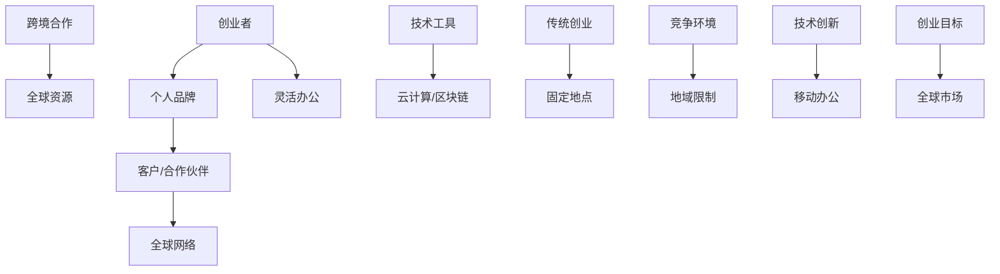
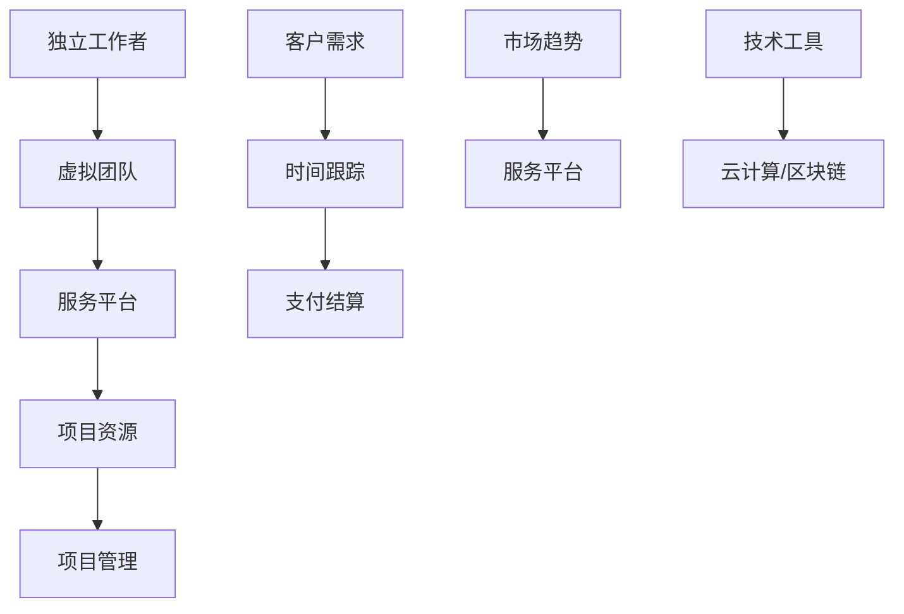

                 

### 第1章 引言

#### 1.1 全球游牧创业的背景

在全球化的浪潮中，远程工作和移动办公逐渐成为一种趋势。这一趋势不仅改变了人们的工作方式，也催生了游牧创业这一新兴概念。游牧创业，顾名思义，指的是创业者在全球范围内选择工作地点，不受地域限制，灵活地开展业务。

首先，**全球化趋势与远程工作需求**是游牧创业兴起的重要因素。随着互联网的普及和移动通信技术的发展，人们可以轻松地在全球范围内进行沟通和协作。这种技术基础为游牧创业提供了可能。此外，越来越多的企业和创业者意识到，远程工作不仅可以降低运营成本，还能吸引和留住优秀人才。

其次，**技术发展对游牧创业的影响**不容忽视。云计算、人工智能、区块链等新兴技术的应用，为游牧创业者提供了强大的工具和平台。例如，云计算平台可以让创业者随时随地访问数据和资源，人工智能技术可以帮助创业者进行智能决策，而区块链技术则保证了交易和数据的安全性和透明度。

最后，**无国界工作的重要性**日益凸显。在全球化背景下，越来越多的创业者希望在全球范围内寻找商机，而不再局限于某一个国家或地区。无国界工作不仅为创业者提供了更广阔的发展空间，也促进了国际间的经济合作和文化交流。

#### 1.2 本书的目的与结构

本书的目的是为想要在全球范围内创业的人提供全面的支持系统。具体来说，本书将涵盖以下几个方面：

首先，本书将**理解游牧创业的定义与特点**，帮助读者深入了解这一新兴概念。通过分析游牧创业与传统创业的不同之处，读者可以更好地理解游牧创业的运作模式和优势。

其次，本书将**探索无国界工作的支持系统**，包括法律、财务、技术等方面的支持体系。这部分内容将详细介绍如何在全球范围内进行创业，解决可能遇到的各种问题。

最后，本书将**提供实用的工具和方法**，帮助读者成功实践游牧创业。无论是选择合适的创业地点，还是搭建团队，本书都将提供详细的指导和建议。

总的来说，本书旨在为游牧创业者提供一个全方位的支持系统，帮助他们克服各种挑战，实现创业梦想。

### 游牧创业的概念与模式

#### 2.1 游牧创业的定义

游牧创业，从字面上理解，指的是创业者在全球范围内自由选择工作地点，不受地域限制，灵活地开展业务。这种创业模式与传统的固定地点创业有着显著的不同。

首先，**个人品牌与自由职业**是游牧创业的核心。在游牧创业中，创业者通过个人品牌的影响力吸引客户和合作伙伴，而不再依赖于传统的公司结构。这种模式下，创业者可以更加专注于自身的专业领域，发挥个人特长。

其次，**跨境合作与全球网络**是游牧创业的重要特点。游牧创业者通常通过互联网和社交媒体等工具，与全球各地的合作伙伴进行沟通和协作。这种跨境合作模式不仅拓宽了创业者的视野，也增强了他们的竞争力。

为了更好地理解游牧创业，我们可以通过一个**Mermaid流程图**来展示其核心概念和实体之间的关系架构：

#### 2.2 游牧创业的运作模式

游牧创业的运作模式相对灵活，创业者可以根据自身需求和市场环境进行调整。以下是一些常见的运作模式：

首先，**独立工作者与虚拟团队**是游牧创业的核心模式。独立工作者通常是个人品牌的核心，他们通过自己的专业知识和技能为客户提供服务。虚拟团队则由多个独立工作者组成，共同完成一个项目或业务。这种模式的优势在于，可以快速组建团队，灵活应对市场需求。

其次，**服务平台与市场趋势**也是游牧创业的重要组成部分。随着互联网技术的发展，各种服务平台应运而生，如Upwork、Freelancer等，为游牧创业者提供了广阔的市场。这些平台不仅提供了丰富的项目资源，还帮助创业者进行项目管理、时间跟踪和支付结算等。

为了更好地理解游牧创业的运作模式，我们可以通过一个**Mermaid流程图**来展示其关键组成部分和运作流程：

#### 2.3 游牧创业的优势与挑战

游牧创业具有许多优势，但也面临一些挑战。

首先，**自由与灵活性**是游牧创业的最大优势。创业者可以自由选择工作地点，甚至可以在全球范围内进行工作。这种灵活性使得创业者能够更好地平衡工作和生活，提高工作效率。

其次，**全球视野**也是游牧创业的一大优势。通过与全球各地的合作伙伴进行合作，创业者可以接触到不同的文化、市场和资源，从而拓宽视野，提高竞争力。

然而，游牧创业也面临一些挑战。**文化与法律障碍**是创业者需要面对的重要问题。在不同的国家和地区，法律和文化的差异可能导致创业过程中遇到各种困难。此外，**技术风险**也是游牧创业需要关注的问题。互联网和通信技术的不稳定可能导致业务中断，影响创业者的正常运营。

为了解决这些问题，创业者需要提前做好**文化差异**和**法律环境**的调研，确保业务合法合规。同时，建立**稳定的技术基础设施**，如云计算平台和区块链技术，可以提高业务稳定性和数据安全性。

总的来说，游牧创业具有巨大的潜力和挑战。只有通过深入了解其运作模式和优势，创业者才能在全球范围内取得成功。

### 无国界工作的支持系统

在游牧创业中，无国界工作的支持系统至关重要。这一系统涵盖了法律、财务、技术等多个方面，为游牧创业者提供了全面的保障。以下将分别探讨这些支持系统的关键要素和具体应用。

#### 3.1 法律与税务

无国界工作的法律环境复杂多变，创业者需要熟悉各国的法律和税务规定。首先，**全球税务筹划**是游牧创业者必须面对的挑战。由于不同国家的税率和税收政策不同，创业者需要通过合理规划，降低税负，提高资金使用效率。

具体来说，创业者可以采取以下措施：

1. **跨国公司税务筹划**：创业者可以注册离岸公司，利用税收优惠政策，合理避税。
2. **跨境合同与劳动法**：在签订跨境合同时，创业者需要了解各国的劳动法律，确保合同合法有效，避免法律纠纷。

此外，创业者还应关注**国际合同与劳动法**的细节。例如，合同中应明确双方的权利和义务，避免因条款不清而产生的争议。同时，创业者还需要了解各国的劳动法律，确保雇佣关系的合法合规。

#### 3.2 资金与财务管理

资金和财务管理是游牧创业者成功的关键。在全球范围内运营业务，创业者需要灵活管理资金流动，确保资金的安全和有效利用。

首先，**外汇管理**是创业者需要关注的重要方面。由于不同国家的货币政策和汇率波动，创业者需要制定合适的外汇管理策略，降低汇率风险。

具体措施包括：

1. **货币选择**：在跨境交易中，创业者可以选择使用稳定货币，如美元或欧元，以降低汇率风险。
2. **外汇锁定**：在汇率波动较大时，创业者可以提前锁定汇率，确保交易的汇率风险。

其次，**资金流动与风险管理**也是创业者需要重点关注的方面。创业者需要确保资金的流动性，以便随时应对市场变化和业务需求。

具体措施包括：

1. **多币种账户**：创业者可以在多个国家开设银行账户，以适应不同的资金流动需求。
2. **风险管理工具**：创业者可以使用金融衍生品，如期权和期货，进行风险管理，降低市场波动带来的风险。

#### 3.3 技术支持

技术支持是游牧创业成功的重要保障。在全球范围内运营业务，创业者需要依靠先进的技术工具和平台，确保业务的高效运作和数据安全。

首先，**云服务与协作工具**是创业者不可或缺的工具。云计算平台提供了强大的计算和存储能力，创业者可以随时随地访问数据和资源。同时，协作工具如Slack、Trello等，帮助创业者实现团队的高效协作。

其次，**数据安全与隐私保护**也是创业者需要重视的方面。在全球范围内运营业务，创业者需要确保数据的安全性和隐私性，防止数据泄露和滥用。

具体措施包括：

1. **数据加密**：创业者需要对敏感数据进行加密处理，确保数据在传输和存储过程中的安全。
2. **访问控制**：创业者需要设置严格的访问控制策略，确保只有授权人员才能访问重要数据。

此外，**区块链技术**也在游牧创业中发挥了重要作用。区块链技术提供了透明、安全的交易记录，有助于提高业务的透明度和可信度。

总的来说，无国界工作的支持系统为游牧创业者提供了全面的保障。通过合理利用法律、财务和技术工具，创业者可以降低风险，提高运营效率，实现全球范围内的成功创业。

### 游牧创业的平台与工具

在游牧创业的生态系统中，平台与工具是不可或缺的组成部分。它们不仅为创业者提供了技术支持，还为他们提供了广泛的资源和服务。以下将详细探讨几种主要的平台与工具，包括在线协作平台、数字货币与区块链，以及在线教育和培训。

#### 4.1 在线协作平台

在线协作平台是游牧创业者的核心工具，它们帮助团队实现高效沟通和协作。以下是一些流行的在线协作平台：

1. **Slack**：Slack是一个流行的即时通讯工具，提供了丰富的功能，如群组聊天、文件共享和集成第三方应用。它非常适合团队内部沟通和项目协作。

2. **Trello**：Trello是一个基于看板的任务管理工具，它通过卡片和列表的形式，帮助团队清晰地规划和管理任务。它简单易用，非常适合小型团队和项目。

3. **Asana**：Asana是一个全面的任务和项目管理系统，它提供了详细的任务分配、进度跟踪和报告功能。它适合大型团队和复杂的项目管理。

4. **Zoom**：Zoom是一个视频会议和远程协作工具，提供了高质量的视频和音频通话、屏幕共享和虚拟会议房间等功能。它非常适合远程团队和跨地区协作。

#### 4.2 数字货币与区块链

数字货币和区块链技术正在改变传统的金融和商业模式，为游牧创业者提供了新的机遇。以下是一些关键概念和应用：

1. **比特币（Bitcoin）**：比特币是最早的数字货币，它通过区块链技术实现去中心化的交易，不需要通过金融机构进行验证。比特币的交易速度快，手续费低，适合跨境支付和投资。

2. **以太坊（Ethereum）**：以太坊是一个智能合约平台，它允许开发者创建和部署去中心化的应用程序（DApps）。以太坊的区块链技术支持多种数字货币和金融工具，为游牧创业者提供了更广泛的金融选择。

3. **区块链**：区块链技术是一种分布式数据库技术，通过加密和共识算法，实现了数据的透明和安全。区块链技术在供应链管理、身份验证和数字版权保护等领域有广泛应用，为游牧创业者提供了可靠的解决方案。

#### 4.3 在线教育和培训

在线教育和培训为游牧创业者提供了不断学习和提升技能的机会。以下是一些重要的在线教育平台：

1. **Coursera**：Coursera是一个全球知名的教育平台，提供了大量的在线课程，涵盖了计算机科学、商业管理、数据科学等多个领域。它适合希望提升专业技能的创业者。

2. **Udemy**：Udemy是一个开放式的在线学习平台，提供了丰富的课程内容，包括编程、设计、营销等。它适合各种水平的学员，从初学者到专业人士。

3. **edX**：edX是一个由哈佛大学和麻省理工学院共同创立的在线教育平台，提供了高质量的大学课程和专业认证。它适合希望获得正式学位和认证的创业者。

4. **Khan Academy**：Khan Academy是一个非营利性在线教育平台，提供了丰富的免费教育资源，涵盖了数学、科学、计算机科学等多个领域。它适合自学和基础教育的创业者。

总的来说，在线协作平台、数字货币与区块链技术，以及在线教育和培训，为游牧创业者提供了强大的支持。通过合理利用这些平台和工具，创业者可以更高效地协作、管理资金和提升技能，从而在全球范围内取得成功。

### 游牧创业的生态系统

游牧创业不仅仅是个体行为，它依赖于一个复杂的生态系统，这个系统包括了全球社区与网络、创业支持组织以及游牧生活的实践等多个层面。

#### 5.1 全球社区与网络

全球社区与网络是游牧创业者获取资源和机会的重要渠道。通过社交媒体、专业论坛和线上会议，创业者可以与全球的同行和潜在合作伙伴建立联系。

首先，**社交媒体**如LinkedIn、Twitter和Facebook等，提供了平台，使得创业者可以展示自己的专业知识和工作成果，同时发现和联系潜在的合作伙伴和客户。在这些平台上，创业者可以通过发布有价值的内容、参与讨论和分享经验，提升个人品牌知名度。

其次，**专业论坛**如Reddit、Stack Overflow和Quora等，是创业者获取专业知识和解决技术难题的重要资源。在这些论坛上，创业者可以提问、回答问题，并与其他专业人士进行深度交流，从而获取宝贵的建议和灵感。

此外，**线上会议**工具如Zoom、Webex和Microsoft Teams等，也为创业者提供了远程协作和交流的机会。通过参加线上会议，创业者可以与全球的团队和专家进行实时沟通，共同探讨项目进展和市场动态。

#### 5.2 创业支持组织

创业支持组织在全球游牧创业生态系统中扮演着至关重要的角色。这些组织为创业者提供了从资金、技术到市场推广等多方面的支持。

首先，**专业协会与联盟**如国际自由职业者协会（International Freelancers Union）和全球创业联盟（Global Entrepreneurship Alliance）等，为创业者提供了资源对接、政策解读和行业动态。这些组织通常组织定期的线上和线下活动，帮助创业者建立人脉网络，获取最新的创业资讯。

其次，**创业孵化器与加速器**如Techstars、Y Combinator和500 Startups等，为创业者提供了资金、导师指导、办公空间和市场推广等全方位的支持。这些孵化器和加速器通常具有严格的筛选机制，旨在为最具潜力的创业项目提供支持，帮助他们快速成长。

此外，**非营利组织**如Global Innovation Fund和Kiva等，为创业者提供了低息贷款和资金支持。这些组织关注于支持那些在传统金融机构难以获得资金的创业者，特别是来自新兴市场的创业者。

#### 5.3 游牧生活的实践

游牧生活是游牧创业的重要一环，它不仅影响了创业者的生活质量，也影响着他们的工作效率和创造力。

首先，**生活质量与工作平衡**是游牧创业者需要重点关注的问题。通过合理规划旅行路线和工作计划，创业者可以确保在享受生活的同时，保持高效率的工作状态。例如，创业者可以选择在一些风景优美、生活成本较低的城市居住一段时间，以降低生活成本，同时享受优质的生活环境。

其次，**环境与可持续发展**也是游牧创业者需要考虑的因素。在旅行过程中，创业者应该注重环保，减少浪费，选择可持续的住宿和交通方式。例如，选择住宿在生态友好型的酒店，使用公共交通或共享出行工具，减少碳足迹。

此外，**远程办公技巧**是游牧创业者必备的技能。通过掌握有效的远程协作工具和管理方法，创业者可以更好地管理时间和团队，确保项目的顺利进行。例如，使用时间管理工具如Trello和Asana，以及沟通工具如Slack和Zoom，来提高团队协作效率。

总之，游牧创业生态系统是一个复杂而多样的网络，它为创业者提供了丰富的资源和支持。通过积极参与全球社区与网络、加入创业支持组织以及实践游牧生活，创业者可以更好地实现自己的创业梦想。

### 成功案例与经验分享

在游牧创业的浪潮中，许多创业者通过灵活运用无国界工作的支持系统，取得了显著的成就。以下将介绍几个典型的游牧创业案例，探讨他们的创业历程、经验教训以及成功的关键因素。

#### 6.1 游牧创业者的故事

**案例1：全球咨询公司创始人**

一个成功的游牧创业故事来自于一位名叫艾米丽的全球咨询公司创始人。艾米丽在传统咨询行业工作了多年，积累了丰富的经验和广泛的人脉。在意识到远程工作和全球化趋势带来的机会后，她决定辞职，成立了一家全球咨询公司。

艾米丽的创业历程并非一帆风顺。在刚开始创业时，她遇到了资金短缺、客户获取难以及文化差异等挑战。然而，她通过以下几个关键因素克服了这些困难：

1. **全球视野**：艾米丽利用自己的人脉和经验，迅速建立了全球客户网络。她通过社交媒体和专业论坛展示自己的专业能力，吸引了来自世界各地的客户。

2. **灵活办公**：艾米丽采用了虚拟团队模式，组建了一个由独立咨询顾问组成的团队。通过在线协作平台如Slack和Zoom，她确保了团队的高效沟通和协作。

3. **技术创新**：艾米丽利用云计算和区块链技术，为客户提供高效、安全的服务。她通过智能合约平台进行合同管理，确保了交易的透明性和安全性。

**案例2：数字营销创业团队**

另一个成功的游牧创业故事来自于一个数字营销创业团队。这个团队由三个志同道合的年轻人组成，他们在大学期间就开始合作，积累了丰富的营销经验。毕业后，他们决定一起创业，成立了一家数字营销公司。

在创业初期，这个团队面临了市场竞争激烈、资源有限等挑战。但他们通过以下几个成功因素，逐步取得了成功：

1. **专业能力**：团队成员在数字营销领域有深厚的专业知识和实践经验，他们能够为客户提供高质量的营销方案。

2. **技术创新**：团队利用先进的数字营销工具和技术，如人工智能和大数据分析，为客户提供精准、高效的营销服务。

3. **灵活运营**：团队采用了虚拟团队模式，成员分布在不同的城市和国家，通过在线协作平台保持紧密的沟通和协作。

**案例3：社交媒体管理专家**

最后一个案例是一个专注于社交媒体管理的专家。他利用自己的专业知识和技能，为客户提供社交媒体策略和内容创作服务。

这个专家的成功主要归功于以下几个因素：

1. **个人品牌**：他通过持续发布高质量的内容，建立了强大的个人品牌，吸引了大量的粉丝和客户。

2. **全球合作**：他通过与全球各地的社交媒体专家合作，构建了一个广泛的合作网络，提高了自己的专业影响力。

3. **技术创新**：他利用先进的社交媒体分析工具，为客户提供精准的数据分析和策略建议。

#### 成功的关键因素

从上述案例中，我们可以总结出几个关键的成功因素：

1. **全球视野**：游牧创业者需要具备全球视野，积极拓展国际市场，利用全球资源和机会。

2. **技术创新**：利用先进的技术工具和平台，提高工作效率和业务质量，确保在竞争激烈的市场中脱颖而出。

3. **灵活运营**：采用虚拟团队和灵活办公模式，确保团队的高效协作和灵活应对市场变化。

4. **个人品牌**：建立强大的个人品牌，提高专业影响力，吸引客户和合作伙伴。

5. **持续学习**：不断学习和提升自己的技能和知识，适应快速变化的市场环境。

通过这些成功因素，游牧创业者可以在全球范围内取得成功，实现自己的创业梦想。

### 总结与展望

在全球化的背景下，游牧创业作为一种创新的商业模式，展现了巨大的潜力和广阔的前景。通过无国界工作的支持系统，创业者可以充分利用全球资源，灵活应对市场变化，实现个人和企业的双重成功。

#### 7.1 游牧创业的未来趋势

首先，随着技术的不断进步，**人工智能、大数据和物联网**等技术将在游牧创业中发挥越来越重要的作用。这些技术不仅提高了创业者的工作效率，还为他们提供了更为精准的市场洞察和决策支持。例如，人工智能可以帮助创业者进行客户细分和市场预测，而大数据则可以提供丰富的市场数据，指导创业者的战略决策。

其次，**区块链技术**的成熟和普及也为游牧创业带来了新的机遇。区块链技术提供了透明、安全的交易环境，有助于解决跨境支付和知识产权保护等问题。未来，随着区块链技术的进一步发展，创业者可以利用这一技术实现更高效、更安全的业务运作。

此外，**虚拟现实（VR）和增强现实（AR）**技术也将在游牧创业中发挥重要作用。通过VR和AR技术，创业者可以提供沉浸式的产品体验，吸引更多的客户。例如，在数字营销领域，创业者可以利用VR技术创建虚拟展览，让客户能够身临其境地体验产品。

#### 7.2 游牧创业的挑战与机遇

尽管游牧创业具有许多优势，但创业者仍需面对一系列挑战。首先，**文化差异**和**法律障碍**是创业者需要克服的重要难题。在不同的国家和地区，文化和法律环境存在显著差异，这可能导致创业过程中的误解和纠纷。为了应对这些挑战，创业者需要进行充分的文化和法律调研，确保业务的合法合规。

其次，**技术风险**也是游牧创业者需要关注的问题。互联网和通信技术的依赖性使得业务容易受到技术故障和网络攻击的影响。为了降低技术风险，创业者需要建立稳定的技术基础设施，采用先进的数据保护和网络安全措施。

然而，挑战背后也蕴含着机遇。通过克服这些挑战，创业者不仅可以提升自身的竞争力，还可以在全球化市场中找到新的商机。例如，**全球化供应链**的优化和**跨国合作**的深化，将为游牧创业者提供更多的发展空间。

总的来说，游牧创业的未来充满机遇与挑战。创业者需要紧跟技术发展趋势，灵活应对市场变化，充分利用全球资源和网络，实现自身的创业梦想。

### 附录

#### 7.1 游牧创业资源汇总

为了帮助读者更好地了解和参与游牧创业，以下是一些有用的网站和工具：

1. **在线协作平台**：
   - **Slack**：https://slack.com/
   - **Trello**：https://trello.com/
   - **Asana**：https://asana.com/
   - **Zoom**：https://zoom.us/

2. **数字货币与区块链**：
   - **比特币（Bitcoin）**：https://bitcoin.org/
   - **以太坊（Ethereum）**：https://ethereum.org/
   - **区块链浏览器**：https://blockchain.com/

3. **在线教育和培训**：
   - **Coursera**：https://www.coursera.org/
   - **Udemy**：https://www.udemy.com/
   - **edX**：https://www.edx.org/
   - **Khan Academy**：https://www.khanacademy.org/

4. **专业论坛和社区**：
   - **Reddit**：https://www.reddit.com/
   - **Stack Overflow**：https://stackoverflow.com/
   - **Quora**：https://www.quora.com/

5. **创业孵化器和加速器**：
   - **Techstars**：https://www.techstars.com/
   - **Y Combinator**：https://www.ycombinator.com/
   - **500 Startups**：https://500.co/

6. **非营利组织**：
   - **国际自由职业者协会（International Freelancers Union）**：https://www.freelancersunion.org/
   - **全球创业联盟（Global Entrepreneurship Alliance）**：https://globalentrepreneurshipalliance.org/

#### 7.2 常见问题解答

**1. 如何在多个国家进行税务筹划？**
   - 在多个国家进行税务筹划时，可以考虑以下策略：
     - **注册离岸公司**：利用某些国家的税收优惠政策，如巴哈马、开曼等，降低税负。
     - **转让定价**：通过合理设置跨国公司之间的交易价格，将利润转移到低税率国家。
     - **税务协定**：利用国际税务协定，避免双重征税。

**2. 如何确保跨境支付的安全和效率？**
   - 为了确保跨境支付的安全和效率，可以考虑以下措施：
     - **选择可靠的支付平台**：如PayPal、TransferWise等，确保支付的安全和快捷。
     - **货币锁定**：在汇率波动较大时，提前锁定汇率，降低汇率风险。
     - **使用加密货币**：如比特币、以太坊等，通过区块链技术实现去中心化的支付，提高支付的安全性和透明度。

**3. 如何管理全球团队的协作和沟通？**
   - 管理全球团队的协作和沟通，可以考虑以下策略：
     - **使用在线协作平台**：如Slack、Trello、Asana等，确保团队成员之间的实时沟通和协作。
     - **定期会议**：定期举行视频会议，确保团队成员之间的信息同步和协调。
     - **文化培训**：对团队成员进行文化培训，提高跨文化沟通能力，减少误解和冲突。

**4. 如何保护数据安全和隐私？**
   - 保护数据安全和隐私，可以考虑以下措施：
     - **数据加密**：对传输和存储的数据进行加密处理，确保数据在传输和存储过程中的安全。
     - **访问控制**：设置严格的访问控制策略，确保只有授权人员才能访问重要数据。
     - **安全审计**：定期进行安全审计，检测和修复系统漏洞，确保数据安全。

### 目录大纲总结

本书《全球游牧创业生态：无国界工作的支持系统》旨在为想要在全球范围内创业的人提供全面的支持系统。从介绍游牧创业的概念与模式，到探讨无国界工作的支持系统，再到分享成功案例与经验，本书将帮助读者理解并成功实践游牧创业。希望通过本书，能够激发更多人的创业热情，打造一个无国界的全球创业生态系统。

### 文章标题

《全球游牧创业生态：无国界工作的支持系统》

### 关键词

- 全球游牧创业
- 无国界工作
- 法律与税务
- 资金与财务管理
- 技术支持
- 在线协作平台
- 数字货币与区块链
- 在线教育和培训
- 创业支持组织
- 成功案例与经验分享

### 文章摘要

《全球游牧创业生态：无国界工作的支持系统》是一本关于在全球范围内自由选择工作地点，灵活开展业务的书。本书首先介绍了全球游牧创业的背景、定义与模式，然后探讨了无国界工作的法律、财务和技术支持系统。接着，详细介绍了游牧创业的平台与工具，包括在线协作平台、数字货币与区块链，以及在线教育和培训。书中还分析了游牧创业的生态系统，包括全球社区与网络、创业支持组织以及游牧生活的实践。通过成功案例与经验分享，本书为读者提供了实用的创业指导，帮助他们在全球范围内实现创业梦想。最后，本书总结了游牧创业的未来趋势和挑战，为读者指明了创业方向。

### 作者信息

作者：AI天才研究院/AI Genius Institute & 禅与计算机程序设计艺术 /Zen And The Art of Computer Programming

---

### 附录

#### 7.1 游牧创业资源汇总

- **在线协作平台**：Slack、Trello、Asana、Zoom等。
- **数字货币与区块链平台**：比特币、以太坊、区块链浏览器等。
- **在线教育和培训平台**：Coursera、Udemy、edX、Khan Academy等。
- **专业论坛和社区**：Reddit、Stack Overflow、Quora等。
- **创业孵化器和加速器**：Techstars、Y Combinator、500 Startups等。
- **非营利组织**：国际自由职业者协会、全球创业联盟等。

#### 7.2 常见问题解答

1. **如何在多个国家进行税务筹划？**：可以通过注册离岸公司、转让定价和利用国际税务协定等方式进行税务筹划。
2. **如何确保跨境支付的安全和效率？**：选择可靠的支付平台、货币锁定和使用加密货币等方式。
3. **如何管理全球团队的协作和沟通？**：使用在线协作平台、定期会议和文化培训。
4. **如何保护数据安全和隐私？**：数据加密、访问控制和定期安全审计。

# 全书目录总结

本书《全球游牧创业生态：无国界工作的支持系统》旨在为想要在全球范围内创业的人提供全面的支持系统。从介绍游牧创业的概念与模式，到探讨无国界工作的支持系统，再到分享成功案例与经验，本书将帮助读者理解并成功实践游牧创业。希望通过本书，能够激发更多人的创业热情，打造一个无国界的全球创业生态系统。# 全书目录总结

本书《全球游牧创业生态：无国界工作的支持系统》系统地探讨了全球游牧创业的各个方面，从背景介绍到支持系统的构建，再到实际操作中的工具应用和生态系统构建，为创业者提供了一整套的指导和策略。

### 目录结构概述

1. **引言**：
   - **1.1 全球游牧创业的背景**：分析全球化趋势和远程工作需求。
   - **1.2 本书的目的与结构**：介绍游牧创业的定义和本书的主要内容。

2. **游牧创业的概念与模式**：
   - **2.1 游牧创业的定义**：探讨个人品牌与自由职业、跨境合作与全球网络。
   - **2.2 游牧创业的运作模式**：分析独立工作者与虚拟团队的运作模式。
   - **2.3 游牧创业的优势与挑战**：讨论自由与灵活性的优势以及面临的文化与法律障碍。

3. **无国界工作的支持系统**：
   - **3.1 法律与税务**：介绍全球税务筹划、国际合同与劳动法。
   - **3.2 资金与财务管理**：探讨外汇管理、资金流动与风险管理。
   - **3.3 技术支持**：分析云服务与协作工具、数据安全与隐私保护。

4. **游牧创业的平台与工具**：
   - **4.1 在线协作平台**：介绍Slack、Trello、Asana、Zoom等。
   - **4.2 数字货币与区块链**：探讨比特币、以太坊等。
   - **4.3 在线教育和培训**：介绍Coursera、Udemy、edX、Khan Academy等。

5. **游牧创业的生态系统**：
   - **5.1 全球社区与网络**：分析社交媒体、专业论坛和线上会议的作用。
   - **5.2 创业支持组织**：介绍专业协会、联盟、孵化器和加速器。
   - **5.3 游牧生活的实践**：讨论生活质量、工作平衡和环境可持续发展。

6. **成功案例与经验分享**：
   - **6.1 游牧创业者的故事**：分享成功创业者的经历和教训。
   - **6.2 无国界工作的实践**：探讨跨境合作案例和企业全球化战略。

7. **总结与展望**：
   - **7.1 游牧创业的未来趋势**：分析技术发展带来的机遇。
   - **7.2 游牧创业的挑战与机遇**：探讨如何应对文化差异与管理策略。

8. **附录**：
   - **7.1 游牧创业资源汇总**：提供在线协作平台、数字货币与区块链、在线教育和培训等资源的汇总。
   - **7.2 常见问题解答**：解答关于税务筹划、跨境支付、团队协作和数据处理等常见问题。

本书通过系统的结构和详细的内容，为全球游牧创业提供了全面的理论和实践指导，旨在帮助创业者成功打造无国界的全球创业生态系统。

