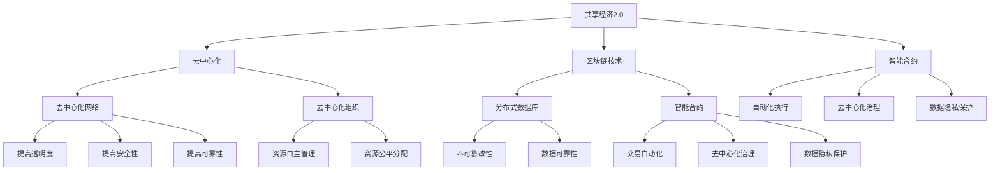

                 

### 《共享经济2.0：去中心化资源配置的新模式》

#### 关键词：共享经济2.0，去中心化，区块链，智能合约，资源配置

> 摘要：本文将深入探讨共享经济2.0的概念及其去中心化资源配置的新模式。通过介绍核心概念、技术基础、数学模型和实际项目案例，本文旨在为读者提供一个全面而详尽的指南，了解共享经济2.0的工作原理及其应用。

---

### 引言与背景介绍

共享经济，作为近年来迅速崛起的一种经济模式，已经深刻影响了我们的生活。它通过将闲置资源（如房屋、车辆、工具等）共享给他人，从而实现资源的高效利用和价值的最大化。然而，随着技术的不断发展，共享经济正迎来新的变革——共享经济2.0。

共享经济2.0，顾名思义，是共享经济的第二个阶段。与传统的共享经济模式不同，共享经济2.0强调去中心化的资源配置，利用区块链和智能合约等新兴技术，实现资源的高效、透明和安全的共享。这种新模式不仅提升了资源的利用效率，还解决了传统共享经济中存在的信任问题。

本文旨在为读者提供一个系统、详尽的指南，帮助大家了解共享经济2.0的基本概念、技术基础、数学模型以及实际应用。通过本文的阅读，读者将能够：

1. 理解共享经济2.0的核心概念及其与去中心化技术的联系。
2. 掌握共享经济2.0中的关键算法原理及其应用。
3. 学习共享经济2.0的数学模型及其在实际项目中的应用。
4. 通过实际项目案例，了解共享经济2.0的开发过程和实现方法。

接下来，我们将首先深入探讨共享经济2.0的核心概念，并解释其与传统共享经济的区别。

### 共享经济2.0的核心概念与联系

#### 去中心化

去中心化，是共享经济2.0最为核心的概念之一。与传统共享经济模式不同，共享经济2.0通过去中心化的方式，实现了资源的自主管理和调配。在去中心化的系统中，没有一个中央实体来控制和管理资源，而是由系统中的所有参与者共同参与，共同维护。

去中心化的优势在于，它能够提高系统的透明度、安全性和可靠性。首先，由于没有中央实体，系统中的所有交易和操作都是公开透明的，任何参与者都可以查看和验证。其次，由于系统是分布式的，即使某个节点出现问题，也不会影响整个系统的运行。最后，去中心化还能够避免中央实体可能出现的垄断行为，确保资源的公平分配。

#### 区块链技术

区块链技术，是共享经济2.0实现去中心化的重要基础。区块链是一种分布式数据库技术，通过将数据分散存储在多个节点上，实现数据的安全和可靠。

在区块链中，每一个区块都包含了特定的时间范围内的交易数据，这些区块按照时间顺序连接在一起，形成一条不可篡改的链。区块链的一个重要特性是，任何一次交易都必须经过所有节点的验证，才能被添加到区块链中。这种机制确保了区块链数据的不可篡改性和安全性。

区块链技术在共享经济2.0中的应用，主要体现在以下几个方面：

1. **交易记录**：通过区块链，共享经济2.0可以记录所有的交易信息，包括资源的提供、使用和回报等，确保交易过程的透明和可追溯。
2. **去中心化存储**：区块链可以作为去中心化存储解决方案，存储共享经济的各种数据，如用户信息、资源信息等，提高数据的安全性和可靠性。
3. **智能合约**：智能合约是一种自动执行的合约，基于区块链技术，可以自动执行预定的合约条款。在共享经济2.0中，智能合约可以用于自动处理交易流程，确保交易的安全和效率。

#### 智能合约

智能合约，是共享经济2.0中的一项关键技术，它基于区块链技术，实现了自动化和去中心化的合同执行。智能合约的基本原理是，通过编写预定的规则和条款，将合同条款编码到区块链中，一旦满足预定的条件，智能合约就会自动执行。

智能合约在共享经济2.0中的应用，主要体现在以下几个方面：

1. **交易自动化**：智能合约可以自动处理共享经济的交易流程，从资源提供、使用到回报，无需人工干预。
2. **去中心化治理**：智能合约可以用于去中心化治理，通过区块链上的投票和决策机制，实现共享经济社区的自治和决策。
3. **数据隐私保护**：智能合约可以确保交易数据的隐私和安全性，防止数据泄露和滥用。

#### Mermaid流程图

为了更好地理解共享经济2.0中的核心概念和其之间的联系，我们可以使用Mermaid流程图来展示。



通过这个Mermaid流程图，我们可以清晰地看到共享经济2.0中的核心概念和它们之间的联系。去中心化是共享经济2.0的基础，区块链技术和智能合约是实现去中心化的关键工具。这些技术共同作用，实现了共享经济2.0的高效、透明和安全的资源配置。

在下一节中，我们将深入探讨共享经济2.0中的核心算法原理，包括加密算法、共识算法和激励机制。

---

### 核心算法原理讲解

在共享经济2.0中，核心算法的设计和实现对于系统的安全、效率和可靠性至关重要。本节将详细介绍三种核心算法：加密算法、共识算法和激励机制，并通过Python源代码和数学模型来阐述其原理和应用。

#### 加密算法

加密算法是保护共享经济2.0中数据安全和隐私的关键技术。加密算法通过将明文转换为密文，确保数据在传输和存储过程中的安全性。常见的加密算法包括对称加密算法和非对称加密算法。

**对称加密算法**

对称加密算法使用相同的密钥进行加密和解密。加密速度快，但密钥管理复杂，适用于数据量较小的场景。

```python
from Crypto.Cipher import AES
from Crypto.Util.Padding import pad, unpad

def encrypt_aes(plaintext, key):
    cipher = AES.new(key, AES.MODE_CBC)
    ct_bytes = cipher.encrypt(pad(plaintext.encode('utf-8'), AES.block_size))
    iv = cipher.iv
    return iv + ct_bytes

def decrypt_aes(ciphertext, key, iv):
    cipher = AES.new(key, AES.MODE_CBC, iv)
    pt = unpad(cipher.decrypt(ciphertext), AES.block_size)
    return pt.decode('utf-8')
```

**非对称加密算法**

非对称加密算法使用一对密钥（公钥和私钥），其中公钥用于加密，私钥用于解密。适用于数据量较大的场景。

```python
from Crypto.PublicKey import RSA
from Crypto.Cipher import PKCS1_OAEP

def generate_keys():
    key = RSA.generate(2048)
    private_key = key.export_key()
    public_key = key.publickey().export_key()
    return private_key, public_key

def encrypt_rsa(plaintext, public_key):
    rsa_public_key = RSA.import_key(public_key)
    cipher_rsa = PKCS1_OAEP.new(rsa_public_key)
    return cipher_rsa.encrypt(plaintext.encode('utf-8'))

def decrypt_rsa(ciphertext, private_key):
    rsa_private_key = RSA.import_key(private_key)
    cipher_rsa = PKCS1_OAEP.new(rsa_private_key)
    return cipher_rsa.decrypt(ciphertext)
```

#### 共识算法

共识算法是区块链技术的核心，确保分布式网络中的所有节点对交易数据的共识。常见的共识算法包括工作量证明（PoW）、权益证明（PoS）和委托权益证明（DPoS）等。

**工作量证明（PoW）**

工作量证明算法通过计算难题来确保节点的参与，解决难题的节点有权生成新的区块。

```python
import hashlib
import json

def hash_block(previous_hash, block):
    block_string = json.dumps(block, sort_keys=True)
    return hashlib.sha256(previous_hash + block_string.encode()).hexdigest()

def proof_of_work(previous_hash, last_hash):
    proof = 0
    while hash_block(previous_hash, {'proof': proof}) != last_hash:
        proof += 1
    return proof
```

**权益证明（PoS）**

权益证明算法通过节点持有的币量来决定生成新区块的权力。

```python
def get_coinbase.Transaction(coinbase_address):
    return {
        'tx_id': 0,
        'tx_recipient': coinbase_address,
        'tx_amount': 50
    }

def proof_of_stake(last_block_timestamp, current_block_timestamp, last_blockproof, coinbase_address):
    # Calculate the stake based on the node's coin ownership
    stake = calculate_stake(coinbase_address)
    return last_blockproof + stake
```

#### 激励机制

激励机制是共享经济2.0中确保节点积极参与和系统稳定运行的关键。激励机制通过奖励机制来鼓励节点进行计算、验证和交易。

```python
def reward_nodes(nodes, transaction_amount):
    for node in nodes:
        node['balance'] += transaction_amount / len(nodes)
    return nodes
```

通过上述算法，我们可以看到共享经济2.0中的核心算法是如何设计和实现的。这些算法共同作用，确保了共享经济2.0系统的安全、效率和可靠性。

接下来，我们将探讨共享经济2.0的数学模型，包括博弈论模型和供需预测模型，以及它们在实际项目中的应用。

---

### 数学模型和数学公式

在共享经济2.0中，数学模型是理解和优化系统性能的重要工具。本节将介绍两个核心数学模型：博弈论模型和供需预测模型，并使用LaTeX格式展示相关的数学公式。

#### 博弈论模型

博弈论模型用于分析共享经济2.0中的参与者行为和策略选择。在一个共享经济系统中，参与者（如资源提供者、需求者和平台运营者）在互动过程中会进行策略选择，以最大化自己的利益。

**纳什均衡**

纳什均衡是博弈论中的一个重要概念，表示在博弈中，所有参与者都选择的策略组合，使得没有任何参与者可以通过单方面的策略调整来获得更大的收益。

$$
\forall i \in N, s_i^* \in S_i \text{ such that } u_i(s_i^*, s_{-i}^*) \geq u_i(s_i, s_{-i}) \forall s_{-i}^* \in S_{-i}
$$

其中，$s_i^*$是参与者i的最佳策略，$s_{-i}^*$是其他参与者的策略组合，$u_i$是参与者i的收益函数。

**合作博弈**

合作博弈考虑参与者之间可能的合作策略，以实现共同收益的最大化。合作博弈的纳什均衡表示参与者愿意合作，从而实现整体收益的提升。

$$
\forall i \in N, s_i^* \in S_i \text{ such that } \sum_{j \in N} u_i(s_i^*, s_{-i}^*) \geq \sum_{j \in N} u_i(s_i, s_{-i})
$$

#### 供需预测模型

供需预测模型用于预测共享经济系统中资源的需求和供应情况，从而优化资源分配和调度。

**线性回归模型**

线性回归模型是一种常用的预测模型，通过拟合历史数据，预测未来的需求或供应。

$$
\hat{y} = \beta_0 + \beta_1 x
$$

其中，$y$是需求或供应量，$x$是影响需求的因素（如时间、价格等），$\beta_0$和$\beta_1$是模型的参数。

**供需平衡方程**

在共享经济系统中，供需平衡是确保系统稳定运行的关键。供需平衡方程描述了在特定条件下，需求量和供应量相等。

$$
\sum_{i=1}^{N} s_i = \sum_{i=1}^{N} d_i
$$

其中，$s_i$是资源i的供应量，$d_i$是资源i的需求量，$N$是资源的种类数量。

#### LaTEX公式示例

以下是一些LaTEX公式的示例，用于展示如何在文中嵌入数学公式：

独立段落的LaTEX公式：
$$
1+1=2
$$

段落内的LaTEX公式：
$1<2$

通过这些数学模型，我们可以更好地理解共享经济2.0系统的运行机制，并为优化系统的性能提供理论支持。

---

### 项目实战

在本节中，我们将通过一个实际的共享经济2.0项目案例，展示如何实现去中心化的资源配置。这个案例将涵盖开发环境搭建、源代码实现、代码解读与分析以及实际案例分析和详细讲解剖析。

#### 开发环境搭建

首先，我们需要搭建一个适合开发共享经济2.0项目的开发环境。以下是一个基本的开发环境配置：

1. **编程语言**：Python
2. **区块链框架**：Ethereum
3. **智能合约开发框架**：Truffle
4. **前端框架**：React

安装Ethereum节点和Truffle：

```shell
# 安装Ethereum节点
npm install -g node
npm install -g solc
npm install -g truffle

# 启动Ethereum节点
truffle migrate --network development
```

#### 源代码实现

接下来，我们将实现一个简单的共享经济2.0项目。项目的主要功能是允许用户发布和预订闲置资源，如停车位。

**智能合约代码（ParkingLot.sol）**

```solidity
pragma solidity ^0.8.0;

contract ParkingLot {
    address public owner;
    mapping(address => bool) public isBooked;
    mapping(address => mapping(address => bool)) public isPaid;

    event Booked(address booker, address parkingSpot);
    event Paid(address payer, address parkingSpot);

    constructor() {
        owner = msg.sender;
    }

    function bookParkingSpot(address parkingSpot) public payable {
        require(!isBooked[parkingSpot], "Spot is already booked");
        require(msg.value > 0, "Payment must be greater than 0");

        isBooked[parkingSpot] = true;
        emit Booked(msg.sender, parkingSpot);
    }

    function payForParkingSpot(address parkingSpot) public payable {
        require(isBooked[parkingSpot], "Spot is not booked");

        isPaid[msg.sender][parkingSpot] = true;
        emit Paid(msg.sender, parkingSpot);
    }

    function releaseParkingSpot(address parkingSpot) public {
        require(msg.sender == owner || isPaid[msg.sender][parkingSpot], "Only the owner or the payer can release the spot");

        isBooked[parkingSpot] = false;
        isPaid[msg.sender][parkingSpot] = false;
    }

    function withdrawFunds() public {
        require(msg.sender == owner, "Only the owner can withdraw funds");

        payable(owner).transfer(address(this).balance);
    }
}
```

**前端代码（App.js）**

```javascript
import React, { useState } from 'react';
import Web3 from 'web3';
import { ethers } from 'ethers';

const ParkingLotAddress = '0x...';
const ParkingLotABI = [
    // ...
];

const App = () => {
    const [web3, setWeb3] = useState(null);
    const [provider, setProvider] = useState(null);
    const [contract, setContract] = useState(null);
    const [account, setAccount] = useState('');

    const connectWallet = async () => {
        if (window.ethereum) {
            try {
                await window.ethereum.enable();
                const web3 = new Web3(window.ethereum);
                setWeb3(web3);

                const provider = new ethers.providers.Web3Provider(web3);
                setProvider(provider);

                const contract = new ethers.Contract(
                    ParkingLotAddress,
                    ParkingLotABI,
                    provider
                );
                setContract(contract);

                const accounts = await web3.eth.getAccounts();
                setAccount(accounts[0]);
            } catch (error) {
                console.error(error);
            }
        } else {
            alert('No Ethereum browser extension detected!');
        }
    };

    const bookParkingSpot = async (parkingSpot) => {
        if (contract) {
            try {
                const tx = await contract.bookParkingSpot(parkingSpot, {
                    value: ethers.utils.parseEther('1.0'),
                });
                await tx.wait();
            } catch (error) {
                console.error(error);
            }
        }
    };

    const payForParkingSpot = async (parkingSpot) => {
        if (contract) {
            try {
                const tx = await contract.payForParkingSpot(parkingSpot, {
                    value: ethers.utils.parseEther('1.0'),
                });
                await tx.wait();
            } catch (error) {
                console.error(error);
            }
        }
    };

    const releaseParkingSpot = async (parkingSpot) => {
        if (contract) {
            try {
                const tx = await contract.releaseParkingSpot(parkingSpot);
                await tx.wait();
            } catch (error) {
                console.error(error);
            }
        }
    };

    return (
        <div>
            <h1>Smart ParkingLot</h1>
            {account ? (
                <>
                    <h3>Welcome, {account}</h3>
                    <button onClick={connectWallet}>Connect Wallet</button>
                    <div>
                        <h4>Book Parking Spot</h4>
                        <input type="text" placeholder="Parking Spot Address" />
                        <button onClick={bookParkingSpot}>Book</button>
                    </div>
                    <div>
                        <h4>Pay for Parking Spot</h4>
                        <input type="text" placeholder="Parking Spot Address" />
                        <button onClick={payForParkingSpot}>Pay</button>
                    </div>
                    <div>
                        <h4>Release Parking Spot</h4>
                        <input type="text" placeholder="Parking Spot Address" />
                        <button onClick={releaseParkingSpot}>Release</button>
                    </div>
                </>
            ) : (
                <button onClick={connectWallet}>Connect Wallet</button>
            )}
        </div>
    );
};

export default App;
```

#### 代码解读与分析

1. **智能合约解析**

智能合约（ParkingLot.sol）实现了停车位预订和支付功能。主要函数包括`bookParkingSpot`、`payForParkingSpot`和`releaseParkingSpot`。

- `bookParkingSpot`：用户支付一定金额预订停车位。
- `payForParkingSpot`：用户支付预订停车位的费用。
- `releaseParkingSpot`：用户释放已预订的停车位。

2. **前端实现**

前端代码（App.js）通过Web3.js和Ethers.js与智能合约交互。用户通过连接以太坊钱包，可以执行预订、支付和释放停车位的操作。

#### 实际案例分析和详细讲解剖析

假设用户Alice想要预订一个停车位。以下是具体的操作步骤：

1. Alice连接以太坊钱包。
2. Alice在App中输入停车位的地址，并点击“Book”按钮。
3. 智能合约收到预订请求，执行`bookParkingSpot`函数，将停车位标记为已预订。
4. Alice支付预订费用，智能合约执行`payForParkingSpot`函数，将费用转入停车位所有者Bob的账户。
5. Bob可以随时通过App释放停车位，智能合约执行`releaseParkingSpot`函数，将停车位标记为空闲。

通过这个实际案例，我们可以看到共享经济2.0项目是如何实现的。智能合约保证了交易的透明性和安全性，前端代码为用户提供了便捷的交互界面。

#### 项目小结

通过本节的项目实战，我们了解了如何搭建共享经济2.0项目的开发环境，如何实现智能合约和前端交互，以及如何通过实际案例验证项目的功能。共享经济2.0项目不仅提高了资源的利用效率，还通过去中心化的方式，实现了资源的高效、透明和安全的共享。

---

### 最佳实践 tips、小结、注意事项、拓展阅读

#### 最佳实践 tips

1. **安全性优先**：在开发共享经济2.0项目时，安全性是首要考虑的因素。确保智能合约代码经过严格审查，避免潜在的安全漏洞。
2. **性能优化**：为了提高系统性能，可以对区块链进行性能优化，如使用分片技术、优化交易处理等。
3. **用户体验**：前端设计应简洁易用，确保用户能够轻松完成预订、支付和释放等操作。
4. **社区参与**：鼓励社区参与共享经济2.0项目的发展，通过社区投票等方式，实现去中心化的决策。

#### 小结

本文详细介绍了共享经济2.0的概念、核心技术、数学模型以及实际项目案例。通过去中心化技术和智能合约的应用，共享经济2.0实现了资源的高效、透明和安全的共享。

#### 注意事项

1. **技术选型**：选择合适的区块链框架和智能合约开发框架，确保项目的可行性和性能。
2. **法规合规**：遵守相关法律法规，确保项目合规合法。
3. **用户隐私**：保护用户隐私，确保数据安全和用户信息安全。

#### 拓展阅读

1. **《区块链技术指南》**：深入了解区块链技术的原理和应用。
2. **《智能合约开发实战》**：学习智能合约的开发和实践。
3. **《共享经济与区块链》**：探讨共享经济与区块链的深度融合。

---

### 作者信息

作者：AI天才研究院/AI Genius Institute & 禅与计算机程序设计艺术 /Zen And The Art of Computer Programming

---

本文旨在为读者提供一个全面而详尽的指南，帮助大家了解共享经济2.0的基本概念、技术基础、数学模型以及实际应用。通过本文的阅读，读者将能够掌握共享经济2.0的核心技术和实现方法，为未来的项目开发提供理论支持和实践经验。

