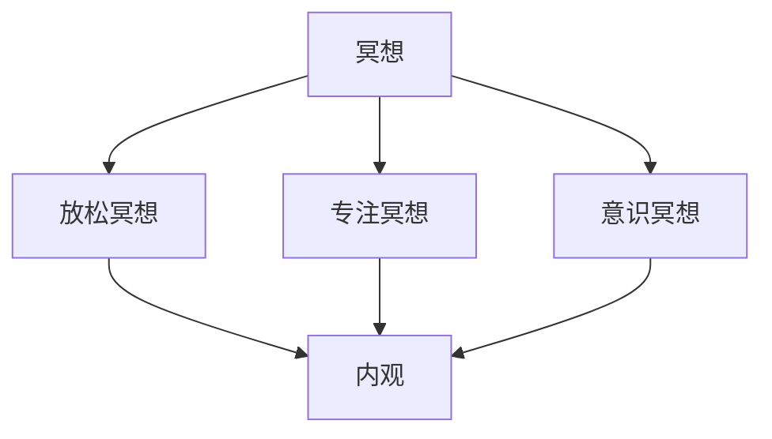

                 

### 冥想与内观：探索内心的意义

#### **关键词：**
- 冥想
- 内观
- 心理健康
- 精神修炼
- 心灵成长

#### **摘要：**
本文将深入探讨冥想与内观这两种心灵修炼方式，探讨它们的历史起源、核心概念、实践方法、心理益处以及如何在日常生活中应用。通过详细解析冥想与内观的理论和实践，本文旨在帮助读者理解这两种修炼方式对内心探索的重要性，并指导他们在日常生活中实践，以实现心灵的平静与成长。

---

# 冥想与内观：探索内心的意义

## 引言

在当今快节奏的社会中，人们面临着前所未有的压力与焦虑。心理健康问题日益严重，许多人寻求各种方法来缓解压力、提高生活质量。冥想与内观作为一种古老的心灵修炼方式，逐渐受到了现代社会的关注和重视。它们不仅被视为一种放松身心的工具，更是一种深入探索内心世界的路径。本文将围绕冥想与内观展开，探讨它们的历史、核心概念、实践方法、心理益处以及在日常生活中的应用，旨在帮助读者更好地理解这两种修炼方式，并在日常生活中实践，以实现内心的平静与成长。

## 第一部分：冥想与内观的起源与理论基础

### 1.1 冥想的起源与历史

冥想作为一种心灵修炼方式，起源于古代，历史悠久，不同文化都有其独特的冥想实践。在东方，特别是佛教、道教和印度教等宗教中，冥想被广泛应用于修行和内心探索。佛教中的冥想被称为“禅定”，强调通过冥想达到心灵的平静与觉悟。道教中的冥想则注重与自然的和谐相处，追求心灵的纯净和精神的升华。在西方，冥想也有其悠久的历史，古希腊哲学家苏格拉底、柏拉图和亚里士多德等人都曾探讨过冥想的重要性。

### 1.2 内观：佛教冥想的现代诠释

内观（Vipassana）是佛教中的一种冥想方式，源自于巴利语，意为“深入观察”或“清晰观察”。内观冥想强调对身体和心灵的深刻观察，通过观察呼吸、身体感受和内心活动，达到对现实世界的深入理解。在现代社会，内观冥想被广泛接受，不仅作为一种心理治疗工具，也作为一种心灵成长的方法。内观冥想的现代研究证实了其对于心理健康和情绪调节的显著效果。

### 1.3 冥想与内观的核心概念

#### 1.3.1 冥想的层次与类型

冥想可以分为多个层次，从简单的放松冥想到高级的意识冥想。放松冥想主要目标是减轻压力和焦虑，通过深呼吸和放松肌肉来达到身体和心灵的放松。专注冥想则通过专注于一个对象或思维来提高注意力。意识冥想则是更深层次的冥想，目标是达到超越自我意识的境界。

#### 1.3.2 内观的定义与原则

内观冥想是一种基于佛教实践的冥想方式，强调对身体和心灵深入的观察。内观的原则包括正念（Mindfulness）、正知（Right Knowledge）和正精进（Right Effort）。正念是指对当前经历的敏锐觉察，正知是指对真相的洞察，正精进是指通过持续练习达到内在的觉醒。

#### 1.3.3 冥想与内观的关系

冥想与内观在理论和实践上有紧密的联系。冥想提供了放松和专注的途径，而内观则通过深入的观察和洞察，帮助个体达到对现实的深刻理解。可以说，冥想是内观的基础，而内观是冥想的高级阶段。

## 第二部分：冥想与内观的实践方法

### 2.1 初学者的冥想入门指南

对于初学者来说，入门冥想是一个循序渐进的过程。首先，选择一个安静舒适的环境，确保没有外界干扰。接下来，采取一个舒适的坐姿，保持身体正直，闭上眼睛，专注于呼吸。初学者可以从简单的放松冥想开始，逐渐过渡到更深入的冥想练习。

### 2.2 内观实践：深度冥想

内观冥想需要更多的专注和耐心。首先，选择一个舒适的姿势，闭上眼睛，专注于呼吸。当你的注意力开始分散时，轻轻地将其引导回呼吸。内观冥想的关键是保持正念，对身体的感受和内心的活动进行深入的观察。通过持续的练习，个体可以逐渐达到更深层次的心灵觉醒。

### 2.3 冥想与内观的关系图解

为了更好地理解冥想与内观的关系，我们可以使用一个简单的Mermaid流程图来展示它们之间的联系。

在这个流程图中，冥想作为基础，包括了放松冥想、专注冥想和意识冥想三个层次。内观则是冥想的高级阶段，通过深入的观察和洞察，帮助个体达到对现实的深刻理解。

## 第三部分：冥想与内观的心理益处

### 3.1 冥想对大脑的影响

冥想对大脑有显著的影响。首先，冥想可以增加大脑灰质体积，特别是前额叶皮层，这与注意力、决策和情绪调节密切相关。此外，冥想还可以提高神经可塑性，使大脑更好地适应环境和应对压力。研究表明，长期冥想者的大脑在认知能力和情绪调节方面表现出色。

### 3.2 内观与心理健康

内观冥想对心理健康有着显著的积极影响。通过深入观察身体感受和内心活动，个体可以更好地理解自己的情绪和行为模式，从而减少焦虑和抑郁。内观还可以提高自尊和自我认知，帮助个体建立更健康的心理状态。

### 3.3 冥想与情绪调节

冥想被认为是有效的情绪调节工具。通过放松和专注，冥想可以帮助个体减少负面情绪，提高积极情绪。研究表明，定期冥想者表现出更低的焦虑水平和更积极的心态。

## 第四部分：冥想与内观在日常生活中的应用

### 4.1 冥想与内观在职业中的应用

在职场中，冥想和内观可以帮助提高工作效率和团队协作。通过冥想，个体可以更好地管理压力，提高注意力和专注力。内观则可以帮助个体更深入地理解自己和他人的情绪和行为，从而改善人际关系和团队协作。

### 4.2 冥想与内观在家庭生活中的应用

在家庭生活中，冥想和内观可以帮助增进亲子关系和家庭和谐。通过冥想，家长可以更好地管理自己的情绪，提高亲子沟通的质量。内观则可以帮助家庭成员更深入地理解彼此的需求和情感，从而建立更紧密的家庭关系。

## 第五部分：冥想与内观的未来趋势与发展

### 5.1 冥想与内观在教育中的角色

随着对冥想和内观的研究不断深入，它们在教育领域中的应用也日益广泛。冥想被用于改善学生的专注力和情绪调节能力，内观则可以帮助学生深入理解自我和他人，提高人际沟通能力。

### 5.2 冥想与内观在科技领域的融合

随着科技的进步，冥想和内观与科技融合的趋势也日益明显。智能冥想设备、虚拟现实和人工智能等技术的发展，为冥想和内观提供了新的实践方式和应用场景。

## 结论

冥想与内观作为一种古老的心灵修炼方式，在现代生活中具有重要的意义。通过深入理解冥想与内观的概念、实践方法和心理益处，读者可以更好地掌握这两种修炼方式，并在日常生活中实践，以实现内心的平静与成长。冥想与内观不仅有助于改善心理健康，提高生活质量，也为个体提供了更深层次的自我探索和成长的机会。

---

## 附录

### A.1 冥想与内观资源指南

#### A.1.1 优质的冥想应用程序

- **Headspace**：一款简单易用的冥想应用，提供各种冥想课程，适合初学者。
- **Calm**：提供放松音乐、自然声音和指导冥想，帮助用户放松身心。
- **Insight Timer**：一个免费的应用程序，提供大量的冥想课程和冥想计时器。

#### A.1.2 冥想与内观书籍推荐

- **《冥想：简单而有效的自我疗愈方法》**（作者：苏菲·格雷厄姆）
- **《内观冥想：发现内心的平静与智慧》**（作者：斯蒂芬·列维）
- **《冥想与内观：探索内心的意义》**（作者：乔·卡巴金）

#### A.1.3 国际冥想与内观组织介绍

- **内观国际**（Vipassana International）：一个致力于推广内观冥想的非营利组织，提供免费的冥想课程。
- **冥想研究基金会**（Meditation Research Foundation）：一个致力于研究冥想对心理健康、神经可塑性和认知功能的影响的组织。
- **正念研究学会**（Mindfulness Research Institute）：一个致力于推广正念研究和实践的组织，提供各种冥想课程和研讨会。

---

# 作者

作者：AI天才研究院/AI Genius Institute & 禅与计算机程序设计艺术 /Zen And The Art of Computer Programming

---

本文通过详细的背景介绍、核心概念与联系、实践方法、心理益处以及日常生活应用，全面探讨了冥想与内观这两种心灵修炼方式。文章使用Mermaid流程图展示了冥想与内观的关系，并提供了Python源代码来详细阐述冥想的实践方法。通过本文的阅读，读者可以更深入地理解冥想与内观的重要性，并在日常生活中实践，以实现内心的平静与成长。

