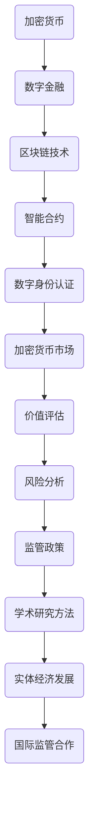

                 

### 引言

在数字经济日益崛起的今天，加密货币作为一种新兴的金融形式，正迅速改变着传统金融的运作模式。其独特的去中心化、安全性高、透明性强的特点，使其在金融市场中的应用日益广泛。然而，作为一种复杂的金融产品，加密货币背后所蕴含的经济学原理和理论建构，仍是一个充满挑战和机遇的研究领域。

加密货币，如比特币、以太坊等，其本质是利用密码学原理来保障交易的安全和隐私。它们通过分布式账本技术——区块链，实现了去中心化的金融交易，从而跳脱了传统金融系统对中央权威的依赖。这种新型的金融模式不仅挑战了现有的金融体系，也带来了诸多新的经济学问题，如价值评估、市场波动、风险管理等。

本篇文章旨在探讨加密货币经济学理论的建构，从多个角度深入分析加密货币的经济特性，并对其进行系统的理论阐释。文章结构如下：

首先，在第一部分“引入与背景”中，我们将简要介绍加密货币的崛起背景和其在现代金融体系中的重要性。

接着，在第二部分“加密货币经济学核心概念”中，我们将详细探讨加密货币的基础概念、经济学理论和价值评估方法，并通过流程图展示核心概念之间的关系。

第三部分“数字金融的学术探索”将分析数字金融的发展趋势、研究方法以及风险管理策略。

第四部分“理论与实务的结合”将探讨加密货币与实体经济、监管以及未来的展望。

最后，在附录部分，我们将提供相关的资源、Python代码示例以及加密货币市场波动分析的数学模型和公式。

通过这一系列的分析和探讨，本文希望为读者提供一个全面、系统的加密货币经济学理论框架，以期为相关领域的学术研究和实务应用提供有益的参考。

### 加密货币的崛起

加密货币的崛起可以追溯到2008年，当时一位名为中本聪（Satoshi Nakamoto）的匿名人物发布了比特币白皮书，首次提出了比特币的概念。比特币作为一种去中心化的数字货币，利用区块链技术记录所有交易，确保了透明度和安全性。比特币的推出，标志着加密货币时代的开始。

随后，以太坊（Ethereum）的诞生进一步推动了加密货币的发展。与比特币主要关注点在货币交易不同，以太坊引入了智能合约（Smart Contract）的概念，使得区块链不仅限于金融交易，还可以进行复杂的合约执行和去中心化应用（Decentralized Applications，简称DApps）开发。这一创新极大地扩展了区块链的应用范围，吸引了大量的开发者和企业加入。

除了比特币和以太坊，还涌现出了一系列其他知名的加密货币，如瑞波币（Ripple）、莱特币（Litecoin）、狗狗币（Dogecoin）等。这些加密货币在技术和应用上各具特色，共同构成了多元化的加密货币生态系统。根据CoinGecko的数据，截至2023，全球已有超过7000种加密货币在流通中。

加密货币之所以能够迅速崛起，主要有以下几个原因：

1. **去中心化**：加密货币的去中心化特性使得其不再依赖于中央权威机构，如政府或金融机构，从而降低了交易的成本和风险。

2. **安全性**：加密货币采用密码学技术进行交易验证，确保了交易的安全性和不可篡改性。

3. **透明性**：所有交易记录都存储在区块链上，且可以被任何人查看，提高了金融交易的透明度。

4. **全球性**：加密货币交易不受地域限制，可以在全球范围内进行，为跨境交易提供了便利。

5. **金融创新**：智能合约和去中心化应用（DApps）等技术的引入，使得加密货币不仅仅是一种数字货币，更成为了一种创新性的金融工具。

尽管加密货币带来了诸多创新和机会，但同时也面临着监管挑战、市场波动性、技术安全性等问题。然而，随着技术的不断进步和市场的逐渐成熟，加密货币的潜在价值和市场影响力预计将继续增长。

### 加密货币的经济学重要性

加密货币在现代金融体系中的重要性不容忽视。首先，从理论层面来看，加密货币提供了一种全新的货币范式，颠覆了传统货币的诸多概念。传统货币通常由中央银行发行并受到国家信用担保，而加密货币则利用区块链技术实现去中心化发行和管理，不再依赖于中央权威机构。这一特性不仅降低了金融系统的风险，还提高了货币的透明性和安全性。

从实践层面来看，加密货币的应用场景日益广泛，涵盖了支付、投资、交易等多个领域。例如，比特币被广泛用于跨境支付，因其快速、低成本的特性，极大地简化了国际交易流程。此外，以太坊上的智能合约技术使得去中心化金融（DeFi）得以实现，为投资者提供了更加多样化和灵活的投资工具。DeFi平台通过去中心化方式提供贷款、交易、流动性管理等金融服务，降低了传统金融服务的门槛，并提高了金融交易的效率。

加密货币对金融体系的影响是多方面的。首先，它挑战了传统金融体系的中心化模式，推动金融服务的去中心化发展。其次，加密货币的透明性和安全性特性为金融监管提供了新的手段，通过区块链技术，监管机构可以实时监控金融交易，从而提高监管效率。此外，加密货币市场的波动性也为金融市场的风险管理带来了新的挑战，但同时也提供了新的投资策略和工具。

然而，加密货币的崛起也引发了一系列的经济学问题和争议。首先，加密货币的价值评估和定价机制仍然是一个尚未解决的问题。由于市场供需变化和投资者情绪的影响，加密货币价格波动剧烈，给投资者带来了巨大的风险。其次，加密货币市场的监管问题也备受关注。如何平衡创新与监管，确保加密货币市场的健康发展，是各国政府和监管机构面临的重大挑战。

此外，加密货币的匿名性也引发了对洗钱、恐怖融资等非法活动的担忧。尽管区块链技术提供了透明和不可篡改的账本，但在实际操作中，仍存在技术漏洞和操作风险。因此，如何通过有效的监管措施和技术手段，提高加密货币市场的安全性和合规性，是当前亟需解决的问题。

总的来说，加密货币的崛起不仅带来了金融领域的变革，也为经济学研究提供了丰富的素材。通过深入探讨加密货币的经济学理论，我们可以更好地理解其背后的逻辑和机制，为未来的金融创新和监管提供有力的支持。

### 研究目的与意义

本篇论文旨在深入探讨加密货币经济学理论，通过系统的分析和研究，揭示加密货币在现代金融体系中的独特经济特性。研究目的具体包括：

1. **分析加密货币的基础概念**：明确加密货币的定义、类型及其技术基础，为后续理论建构奠定基础。
2. **构建加密货币经济学理论框架**：探讨传统经济学理论与加密货币的契合点，分析加密货币市场的特性和供需关系，形成系统的经济学理论。
3. **评估加密货币的价值**：研究加密货币的价值评估方法，分析市场波动对价值评估的影响，提供科学合理的价值评估模型。
4. **探索数字金融的发展趋势**：分析区块链技术、智能合约、数字身份认证等技术在金融领域中的应用，探讨数字金融的未来发展路径。

研究的意义在于：

1. **理论贡献**：通过对加密货币经济学理论的系统探讨，丰富和发展现有的经济学理论，为后续研究提供参考和基础。
2. **实践指导**：为金融从业者、投资者和政策制定者提供理论依据和实践指导，帮助他们更好地理解和应对加密货币带来的挑战和机遇。
3. **政策建议**：提出针对性的政策建议，为政府制定合理有效的监管措施提供参考，促进加密货币市场的健康发展。

通过本文的研究，我们期望为加密货币领域的学术探讨和实践应用提供新的视角和思路，推动数字经济时代的金融创新和发展。

### 加密货币基础概念

要深入理解加密货币的经济学理论，首先需要明确其基础概念。加密货币是一种利用密码学原理进行安全交易的数字货币。以下是加密货币的一些核心定义和类型。

#### 1. 定义

加密货币（Cryptocurrency）是基于加密算法和分布式账本技术（如区块链）的数字资产，用于实现安全、透明和去中心化的金融交易。加密货币的主要特点是：

- **去中心化**：没有中央权威机构控制，交易记录通过网络中的多个节点共同维护。
- **匿名性**：虽然交易记录是公开透明的，但交易双方的身份是匿名的，保护了用户的隐私。
- **安全性**：交易数据通过复杂的加密算法进行保护，确保了交易的安全性和不可篡改性。

#### 2. 类型

加密货币可以按不同的标准进行分类：

- **按用途分类**：
  - **支付货币**：如比特币（Bitcoin，BTC），主要用于支付和日常交易。
  - **投资货币**：如以太坊（Ethereum，ETH），除了支付外，还可以用于智能合约和去中心化应用（DApps）的投资。
  - **功能货币**：如瑞波币（XRP），主要用于跨境支付和流动性管理。

- **按发行方式分类**：
  - **挖矿货币**：如比特币，通过解决复杂的数学问题进行发行。
  - **预挖货币**：如以太坊，在项目启动前就已经发行了一定数量的代币。

- **按技术特点分类**：
  - **公有链货币**：如比特币，所有节点都可以参与维护区块链。
  - **私有链货币**：如某些企业的内部货币，仅限于特定范围内的交易。

#### 3. 技术基础

加密货币的技术基础主要包括：

- **加密算法**：用于保护交易数据的安全和隐私，常见的有哈希函数、椭圆曲线加密等。
- **区块链**：一个分布式账本，记录所有交易记录，确保数据的透明性和不可篡改性。
- **智能合约**：基于加密货币平台（如以太坊）的可编程合约，可以自动执行合同条款，提高交易的效率。

通过上述基础概念的理解，我们可以更深入地探讨加密货币的经济学特性，包括其价值评估、市场波动和风险管理等方面。

### 加密货币经济学理论

在理解了加密货币的基础概念后，我们需要进一步探讨加密货币经济学理论。这一理论旨在解释加密货币在市场中的行为，以及它们如何与传统经济学理论相结合。以下是几个关键点：

#### 1. 传统经济学理论与加密货币

加密货币的兴起挑战了传统经济学的一些基本假设。例如，传统经济学认为货币是由中央银行发行的，具有国家信用担保。而加密货币去中心化发行，不依赖于任何中央权威，这一特性使得传统货币理论难以直接适用。

然而，加密货币也具备传统货币的某些特征。例如，货币的三个基本功能：价值储存、交易媒介和计价单位，在加密货币中同样存在。比特币被视为一种价值储存手段，以太坊则作为交易媒介和计价单位广泛使用。

#### 2. 加密货币市场的特性

加密货币市场与传统金融市场相比，具有以下几个独特特性：

- **高波动性**：加密货币价格波动剧烈，受市场供需、投资者情绪、新闻事件等多种因素影响。这种高波动性使得加密货币市场成为一个高风险、高回报的投资领域。
- **低进入门槛**：加密货币交易和投资相对简单，任何人都可以通过互联网参与交易，降低了传统金融市场的进入门槛。
- **全球化**：加密货币交易不受地域限制，全球各地的投资者都可以参与，这增加了市场的流动性。
- **去中心化**：加密货币市场没有中央权威机构控制，所有交易和决策由网络中的节点共同维护，这增加了市场的透明度和抗审查性。

#### 3. 加密货币的供需理论

加密货币的供需理论是理解加密货币市场行为的关键。以下是几个关键点：

- **供应量**：加密货币的供应量通常在创建时确定，并且是固定的，如比特币的供应量上限为2100万。这类似于黄金等有限资源的供应量。
- **需求量**：加密货币的需求量受多种因素影响，包括市场信任度、应用场景的扩展、投资者情绪等。需求增加通常会推动价格上涨，而需求减少则可能导致价格下跌。

- **供需关系**：加密货币市场的价格由供需关系决定。当需求增加而供应量保持不变时，价格上升；反之，当需求减少时，价格下降。需要注意的是，与传统的商品市场不同，加密货币市场的供需关系更加复杂，受多种非经济因素的影响。

通过上述分析，我们可以看到加密货币经济学理论不仅结合了传统经济学的某些概念，还引入了新的变量和机制。这为理解加密货币市场行为提供了理论基础，也为未来的研究提供了方向。例如，如何更好地评估加密货币的价值，如何制定有效的风险管理策略，都是亟待解决的重要问题。

### 加密货币价值评估

加密货币的价值评估是投资者、金融从业者及政策制定者高度关注的问题。由于加密货币市场的高波动性和不确定性，准确评估其价值成为了一项挑战性任务。以下从价值理论、评估方法以及市场波动分析三个方面，详细探讨加密货币的价值评估。

#### 1. 加密货币的价值理论

加密货币的价值来源于其使用价值和稀缺性。从使用价值来看，加密货币作为一种数字资产，可以在各种场景下进行支付、投资和交易。例如，比特币常用于跨境支付和日常交易，而以太坊则因其智能合约功能被广泛应用于去中心化金融（DeFi）和DApps开发。这些实际应用场景为加密货币带来了价值。

从稀缺性来看，许多加密货币的供应量是有限的，这与传统贵金属如黄金类似。例如，比特币的总供应量被限定为2100万，这种稀缺性使得比特币在市场上具有了一定的价值。此外，某些加密货币的供应量是逐渐减少的，如以太坊的年度供应量会逐渐减少，这也增加了其稀缺性。

#### 2. 加密货币的价值评估方法

评估加密货币的价值，常用的方法包括市场比较法、收益法和成本法。以下是这些方法的简要介绍：

- **市场比较法**：通过比较类似加密货币的市场价格来评估目标加密货币的价值。这种方法主要依赖于市场价格数据，但由于加密货币市场的波动性，市场价格可能并不能完全反映其真实价值。
  
- **收益法**：基于加密货币未来的收益预期来评估其当前价值。这种方法通常需要预测加密货币的未来收益流，并折现至现值。常见的模型包括股息折现模型（DDM）和现金流量折现模型（DCF）。

- **成本法**：基于创建或获取加密货币的成本来评估其价值。这种方法通常适用于那些可以挖矿或预挖的加密货币。然而，对于大多数加密货币来说，成本法难以准确反映其市场价值。

#### 3. 加密货币市场波动分析

加密货币市场的高波动性是其显著特点之一。市场波动主要受以下因素影响：

- **供需变化**：加密货币的供需关系变化是影响价格波动的主要因素。当需求增加而供应量保持不变时，价格上升；反之，需求减少时，价格下降。

- **投资者情绪**：投资者情绪对加密货币价格有显著影响。乐观情绪可能导致价格大幅上涨，而悲观情绪则可能导致价格迅速下跌。

- **新闻事件**：加密货币市场对新闻事件特别敏感，如政策变动、黑客攻击、大型投资机构的退出或进入等，都可能对市场价格产生重大影响。

为了更好地分析市场波动，可以使用以下几种数学模型：

- **波动率模型**：如高斯过程模型（Gaussian Process Model），用于预测加密货币价格的波动性。
- **时间序列模型**：如ARIMA模型（AutoRegressive Integrated Moving Average），用于分析加密货币价格的时间序列特征。
- **机器学习模型**：如随机森林（Random Forest）和深度学习模型，用于从历史数据中学习并预测价格走势。

通过上述分析，我们可以看到，加密货币的价值评估是一个复杂的过程，需要结合多种方法和技术。同时，市场波动分析也为投资者提供了决策依据，帮助他们更好地应对市场的变化。未来，随着市场的进一步成熟和技术的进步，加密货币的价值评估方法将不断优化，为投资者提供更准确的价值判断。

### 数字金融的发展趋势

随着区块链技术和加密货币的普及，数字金融正逐渐成为金融行业的核心驱动力。数字金融的发展趋势主要体现在区块链技术、智能合约、数字身份认证等方面，这些技术不仅推动了金融服务的创新，也改变了传统金融体系的运作模式。

#### 1. 区块链技术

区块链技术是数字金融发展的基石。作为一种分布式账本技术，区块链通过去中心化的方式记录交易信息，确保数据的透明性和不可篡改性。区块链不仅解决了传统金融系统中信任问题，还提高了交易的效率。以下为区块链技术在金融领域的几个重要应用：

- **支付系统**：区块链可以用于构建去中心化的支付系统，如比特币和瑞波币的支付网络。这些系统通过区块链技术实现了快速、低成本的跨境支付，大大简化了传统支付流程。
- **供应链金融**：区块链技术可以用于优化供应链金融，通过记录和验证供应链中的每一个交易环节，提高供应链的透明度和效率，降低金融风险。
- **信用评分**：基于区块链的信用评分系统可以记录个体的金融行为，通过大数据分析和智能合约，实现更准确和高效的信用评估。

#### 2. 智能合约

智能合约是区块链技术的核心创新之一，它允许在区块链上自动执行合同条款，无需人工干预。智能合约的应用极大地提高了金融交易的效率，减少了交易成本和风险。以下为智能合约在金融领域的几个重要应用：

- **去中心化金融（DeFi）**：智能合约使得DeFi成为可能，DeFi平台通过去中心化的方式提供贷款、交易、流动性管理等金融服务。这些服务降低了传统金融服务的门槛，提高了金融包容性。
- **跨境支付**：智能合约可以用于跨境支付，通过自动执行支付指令，提高了支付的速度和安全性。例如，Ripple网络利用智能合约实现快速、低成本的跨境支付。
- **保险和理赔**：智能合约可以用于自动化保险和理赔流程，通过触发条件自动支付理赔金额，减少了人为错误和延误。

#### 3. 数字身份认证

数字身份认证是数字金融发展的重要保障，它通过区块链技术实现了安全的身份验证和数据管理。以下为数字身份认证在金融领域的几个重要应用：

- **KYC（了解你的客户）**：数字身份认证可以简化KYC流程，通过区块链记录客户的身份信息，实现快速、可靠的客户身份验证，降低金融机构的运营成本和风险。
- **反欺诈**：数字身份认证可以用于反欺诈措施，通过实时验证交易方的身份，识别和防范欺诈行为，提高金融交易的安全性。
- **跨境业务**：数字身份认证可以简化跨境业务流程，通过区块链技术实现跨国身份验证和数据交换，提高跨境业务的效率和合规性。

#### 4. 未来发展展望

随着区块链技术、智能合约和数字身份认证等技术的不断成熟，数字金融将在金融领域发挥更加重要的作用。以下为数字金融的未来发展展望：

- **金融普惠**：数字金融将推动金融普惠，使更多人能够享受到金融服务，特别是那些被传统金融服务排除在外的人群。
- **监管科技**：数字金融的发展将推动监管科技的进步，通过大数据、人工智能等技术，实现更加高效、精准的金融监管。
- **绿色金融**：数字金融将推动绿色金融的发展，通过区块链技术记录和验证碳排放数据，实现碳交易的透明化和高效化。

总的来说，数字金融的发展趋势为金融行业带来了巨大的变革和创新机会，未来随着技术的进一步成熟，数字金融将在金融体系中占据更加重要的地位。

### 数字金融的学术研究方法

数字金融作为一个新兴的研究领域，其学术研究方法也日趋多样化。为了更好地理解数字金融的复杂特性，研究者们通常采用定量分析和定性分析相结合的方法。以下分别对这两种方法及其在数字金融研究中的应用进行详细探讨。

#### 1. 定量分析

定量分析是数字金融研究中常用的方法之一，主要通过统计数据和数学模型来分析数据，揭示数字金融市场的规律和特性。以下是定量分析在数字金融研究中的应用：

- **时间序列分析**：时间序列分析是一种常用的定量分析方法，用于研究数字货币市场的价格波动、交易量等时间序列数据。研究者可以使用ARIMA模型（AutoRegressive Integrated Moving Average）、GARCH模型（Generalized Autoregressive Conditional Heteroskedasticity）等模型，对时间序列数据进行分析，预测市场走势。

- **回归分析**：回归分析是一种用于研究变量之间关系的统计方法。在数字金融研究中，研究者可以使用回归分析来研究加密货币价格与供需、投资者情绪、新闻事件等因素之间的关系。例如，通过建立多元线性回归模型，分析哪些因素对加密货币价格有显著影响。

- **因子分析**：因子分析是一种用于降维和揭示变量之间共变关系的统计方法。在数字金融研究中，研究者可以通过因子分析提取影响加密货币价格的主要因子，从而简化分析模型，提高预测准确性。

- **机器学习**：随着人工智能技术的发展，机器学习模型在数字金融研究中得到了广泛应用。研究者可以使用随机森林、支持向量机（SVM）、深度学习等模型，从大量历史数据中学习规律，预测市场走势或评估风险。

#### 2. 定性分析

定性分析通过深入访谈、案例研究等方法，从质性角度对数字金融现象进行解释和分析。以下是定性分析在数字金融研究中的应用：

- **案例研究**：案例研究是一种用于深入探讨特定现象或问题的研究方法。在数字金融研究中，研究者可以通过案例研究分析特定加密货币项目的成功或失败原因，探讨其商业模式、技术特性、市场反应等方面的细节。

- **深度访谈**：深度访谈是一种用于获取深入见解的研究方法。在数字金融研究中，研究者可以通过与行业专家、开发者、投资者等进行深度访谈，了解他们的观点、经验和建议，从而获得对数字金融市场的更深入理解。

- **内容分析**：内容分析是一种用于研究文本资料内容的研究方法。在数字金融研究中，研究者可以通过分析新闻文章、社交媒体评论等文本资料，了解公众对加密货币的感知和态度，从而为市场预测和政策制定提供参考。

- **扎根理论**：扎根理论是一种从大量数据中提炼理论的研究方法。在数字金融研究中，研究者可以通过扎根理论分析大量的市场数据、交易记录等，揭示数字金融市场的内在规律和机制。

#### 3. 实证研究方法

实证研究方法是将定量分析和定性分析结合，通过实际数据和案例分析，验证理论假设和研究结论。以下是实证研究方法在数字金融研究中的应用：

- **数据收集**：研究者可以通过多种渠道收集数字金融数据，包括交易所交易数据、社交媒体数据、新闻报道等。这些数据为定量分析和定性分析提供了基础。

- **数据分析**：在收集到数据后，研究者可以使用统计软件（如R、Python）进行数据分析，结合定量分析和定性分析的方法，对数字金融市场进行深入分析。

- **模型验证**：通过建立数学模型或机器学习模型，研究者可以验证其在实际数据中的有效性。例如，通过训练模型预测加密货币价格，然后对比预测结果与实际价格的差异，评估模型的准确性。

- **案例验证**：通过案例研究，研究者可以验证理论假设在实际中的应用效果。例如，分析某个成功的DeFi项目，探讨其成功的原因和可复制性。

通过定量分析和定性分析相结合的方法，研究者可以全面、深入地探讨数字金融的复杂特性，为理论建构和实践应用提供有力的支持。未来，随着数据获取和分析技术的不断进步，数字金融的学术研究方法将更加多样化和精确，为行业发展和政策制定提供更为科学的依据。

### 加密货币市场的风险管理

加密货币市场的风险管理是确保市场稳定和投资者利益的关键。加密货币市场的高波动性和不确定性，使得风险管理显得尤为重要。以下将分析加密货币市场的主要风险类型、常见的风险评估模型以及有效的风险管理策略。

#### 1. 主要风险类型

加密货币市场的主要风险类型包括：

- **市场风险**：市场风险是由于市场供求关系变化、投资者情绪波动等因素导致的加密货币价格波动。市场风险是加密货币市场面临的最大风险，由于加密货币市场的高波动性，投资者可能会遭受巨大的损失。

- **信用风险**：信用风险是指加密货币平台或交易所因技术故障、黑客攻击等原因导致用户资产损失的风险。例如，2014年Mt. Gox交易所因黑客攻击而破产，导致用户损失了大量比特币。

- **法律风险**：法律风险是指由于监管政策变动、法律法规的不确定性等导致的法律风险。不同国家对加密货币的监管政策不同，可能对加密货币市场的正常运行产生影响。

- **流动性风险**：流动性风险是指加密货币市场交易量不足，导致投资者难以在短时间内以合理价格买卖资产的风险。流动性不足可能导致投资者无法及时平仓，从而遭受损失。

#### 2. 常见的风险评估模型

为了有效管理加密货币市场的风险，研究者们提出了多种风险评估模型：

- **VaR模型（Value at Risk）**：VaR模型是一种常用的市场风险度量方法，用于评估在给定置信水平和持有期内，可能遭受的最大损失。例如，90%置信水平下的1天VaR，表示在绝大多数情况下（90%的概率），一个加密货币头寸在一天内可能遭受的最大损失。

- **CVaR模型（Conditional Value at Risk）**：CVaR模型进一步扩展了VaR模型，考虑了极端损失的风险。CVaR模型计算的是在给定置信水平下，超过VaR损失的平均损失。

- **GARCH模型（Generalized Autoregressive Conditional Heteroskedasticity）**：GARCH模型是一种用于分析金融时间序列数据波动性的模型，可以用于预测加密货币价格波动。通过GARCH模型，可以评估加密货币市场的波动性风险。

- **敏感性分析**：敏感性分析用于评估加密货币价格对某个特定因素（如供需变化、投资者情绪等）的敏感程度。通过敏感性分析，投资者可以了解不同因素对加密货币价格的影响，从而制定相应的风险管理策略。

#### 3. 风险管理策略

为了有效管理加密货币市场的风险，投资者和金融机构可以采取以下策略：

- **分散投资**：分散投资是降低风险的有效方法，通过将资金投资于多种不同类型的加密货币或资产，可以减少特定资产价格波动带来的风险。

- **设定止损点**：设定止损点是控制亏损的有效手段。当加密货币价格达到预设的止损价格时，自动卖出以避免更大的损失。

- **定期评估和调整投资组合**：投资者应定期评估其投资组合的风险和收益，根据市场变化及时进行调整。例如，当市场波动性增加时，可以降低高风险资产的比重。

- **利用衍生品对冲**：衍生品如期权、期货等可以用于对冲加密货币市场风险。通过买入或卖出衍生品合约，可以锁定未来的交易价格，减少市场波动带来的损失。

- **加强监管和合规性**：政府和监管机构应加强对加密货币市场的监管，确保市场运行的透明性和合规性。通过制定明确的法律和政策，可以减少法律风险。

- **提高安全意识**：投资者应提高对安全问题的重视，采取必要的措施保护其数字资产，如使用安全的钱包、定期备份私钥等。

通过上述风险识别、评估和管理策略，投资者和金融机构可以更好地应对加密货币市场的风险，确保其投资的安全和稳定。

### 加密货币与实体经济

加密货币与实体经济的融合，正在逐步改变传统经济运作模式，为全球经济带来新的机遇与挑战。以下从国际贸易、供应链金融和实体经济融合的案例分析，探讨加密货币在现实经济中的应用及其影响。

#### 1. 国际贸易

加密货币作为一种全球性的数字资产，在跨境支付和国际贸易中展现出巨大的潜力。传统的跨境支付往往需要经过多个金融机构，不仅成本高昂，而且速度慢。而加密货币可以通过去中心化的区块链网络实现快速、低成本的跨境支付。

- **案例一**：2018年，区块链跨境支付平台Ripple宣布与印度尼西亚的Bank Sinarmas开展合作，通过Ripple的支付网络实现跨境支付。这一合作大大降低了支付成本，并缩短了支付时间，为国际贸易提供了更加高效的解决方案。

- **案例二**：国际物流巨头马士基与加密货币公司Chainlink合作，使用区块链技术优化供应链金融。通过Chainlink的预言机服务，马士基可以在全球范围内实时获取货物状态信息，从而加快支付流程，减少财务风险。

#### 2. 供应链金融

供应链金融是加密货币在实体经济中应用的另一个重要领域。传统的供应链金融通常依赖于大量的纸质文件和复杂的审核流程，这不仅效率低下，而且容易出现错误。而加密货币和区块链技术可以简化这一流程，提高供应链金融的效率。

- **案例一**：美国金融科技公司Chainlink与全球领先的供应链管理公司Jasper Technologies合作，利用区块链技术优化供应链金融。通过智能合约，供应链中的各参与方可以实时验证交易和支付，减少了人工干预，提高了效率。

- **案例二**：非洲移动支付公司Paga与加密货币平台Gnosis合作，通过区块链技术为小额贷款提供支持。通过智能合约，Paga可以在几分钟内完成贷款审批和发放，大大提高了贷款的发放速度和用户满意度。

#### 3. 实体经济融合

加密货币与实体经济的融合，不仅体现在国际贸易和供应链金融中，还逐渐渗透到各个行业，推动传统经济向数字经济转型。

- **案例一**：房地产领域的加密货币应用。美国的区块链平台Propy使用区块链技术简化房地产交易流程，通过去中心化的智能合约，买家和卖家可以在几天内完成交易，避免了传统的繁琐流程和中介费用。

- **案例二**：零售行业的数字货币支付。法国的零售巨头Carrefour与加密货币支付平台Coinbase合作，允许消费者使用比特币进行购物支付。这一举措不仅吸引了数字货币用户，还提高了零售支付的安全性和便利性。

#### 影响与未来展望

加密货币与实体经济的融合，对全球经济产生了深远的影响：

- **效率提升**：通过去中心化和区块链技术，加密货币在提高交易效率、减少交易成本方面具有明显优势，为各行业提供了更高效的解决方案。

- **金融普惠**：加密货币降低了金融服务的门槛，使得更多人能够享受到金融服务，特别是那些被传统金融服务排除在外的人群。

- **监管挑战**：加密货币与实体经济的融合，对监管机构提出了新的挑战。如何在保护投资者利益和促进创新之间找到平衡，是各国政府和监管机构需要解决的重要问题。

未来，随着加密货币技术的不断成熟和应用的深入，加密货币与实体经济的融合将更加紧密，为全球经济带来更多的机遇和挑战。企业和投资者需要密切关注这一趋势，积极拥抱数字经济的变革，以在未来的竞争中保持优势。

### 加密货币市场的监管

加密货币市场的监管是一个复杂且充满挑战的领域，涉及到政策、法律和技术等多个层面。由于加密货币的去中心化和全球化特性，传统的监管模式难以完全适用，因此各国政府和国际组织正在积极探索适应这一新兴领域的监管框架。

#### 1. 监管现状

目前，全球各国对加密货币市场的监管态度各异。一些国家对加密货币持开放态度，如美国和瑞士，他们通过制定明确的法律和监管框架，推动加密货币市场的健康发展。而另一些国家则采取了更为保守的态度，对加密货币进行严格的监管甚至禁止。

- **美国**：美国证券交易委员会（SEC）和商品期货交易委员会（CFTC）对加密货币市场进行了积极的监管。例如，SEC将一些加密货币和代币发行（ICO）视为证券，要求进行注册和监管。CFTC则将加密货币视为商品，进行相应的监管。

- **欧洲**：欧洲证券和市场管理局（ESMA）对加密货币市场持谨慎态度，禁止了某些类型的ICO。欧洲还计划推出统一的加密资产市场法规（MiCA），以规范加密货币市场。

- **中国**：中国政府自2017年起开始加强对加密货币市场的监管，禁止加密货币交易和ICO，并关闭了国内的加密货币交易所。

- **亚洲**：日本和韩国对加密货币市场的监管较为严格，但也在逐步放宽限制，推动市场的规范化。例如，日本通过修订《支付服务法》，将加密货币交易所纳入监管范围。

#### 2. 监管框架分析

有效的加密货币监管框架应包括以下几个方面：

- **投资者保护**：监管机构应确保投资者在加密货币市场中的权益得到保护，包括防止欺诈行为、确保资金安全等。

- **市场透明度**：加密货币市场应具备透明度，包括交易记录的公开、交易所的运营标准等，以提高市场的公信力。

- **反洗钱（AML）和反恐融资（CFT）**：加密货币市场易成为洗钱和恐怖融资的工具，因此监管机构应制定严格的AML和CFT措施，防止这些非法活动。

- **市场稳定**：监管机构应通过适当的政策和措施，维护市场的稳定，防止市场过度波动。

#### 3. 国际监管合作

由于加密货币的全球性特性，单靠一个国家的监管难以有效应对，因此国际监管合作显得尤为重要。以下为几个国际监管合作的趋势：

- **跨国监管机构**：国际组织和跨国机构（如金融行动特别工作组（FATF）和国际证监会组织（IOSCO））正在积极推动跨国监管合作，制定统一的监管标准和措施。

- **跨境监管协作**：各国监管机构通过建立跨境监管协作机制，共同应对跨境加密货币交易和风险。

- **技术合作**：区块链和加密货币技术的发展需要各国监管机构进行技术合作，共同开发标准化的技术解决方案，以提高监管效率和透明度。

总之，加密货币市场的监管是一个动态且不断发展的过程。随着市场的成熟和技术的发展，各国政府和国际组织需要不断调整和优化监管框架，以适应加密货币市场的变化，确保市场的健康稳定发展。

### 加密货币未来的展望

展望加密货币的未来，我们可以从长期发展、技术创新以及与社会经济发展的关系三个方面进行探讨。首先，从长期发展的角度来看，加密货币有望成为传统金融体系的有力补充。随着区块链技术的不断成熟和应用的广泛普及，加密货币在支付、投资、供应链金融等多个领域具有巨大的潜力。未来，加密货币可能会进一步降低交易成本，提高金融交易的透明度和安全性，从而在全球金融体系中占据越来越重要的地位。

其次，技术创新将继续推动加密货币的发展。随着量子计算、分布式存储、跨链技术等前沿科技的逐步应用，加密货币的性能和安全性将得到进一步提升。量子计算可能对现有的加密算法构成威胁，但同时也催生了新的加密技术，如量子加密，这将为加密货币提供更加坚固的安全保障。跨链技术则有望实现不同区块链之间的无缝交互，促进加密货币生态的融合和扩展。

最后，加密货币与社会经济发展的关系值得深入探讨。加密货币不仅为个体提供了金融服务的渠道，也为社会带来了普惠金融的可能性。特别是在那些金融服务不足的地区，加密货币可以打破传统金融体系的限制，为更多人提供便捷的金融服务。此外，加密货币在促进社会公平和透明度方面也具有重要作用，通过区块链技术，可以确保金融交易数据的公开透明，减少腐败和欺诈行为。

总的来说，加密货币的未来充满机遇和挑战。随着技术的不断进步和市场环境的逐步成熟，加密货币有望在全球金融体系中发挥更加重要的作用，为社会经济发展带来新的动力。然而，这需要各国政府和监管机构的积极参与，以及技术创新者的不断探索，才能确保加密货币的健康稳定发展。

### 附录：加密货币经济学相关资源

为了帮助读者进一步深入了解加密货币经济学，以下列出了一些重要的学术期刊、专业组织、社区以及加密货币数据库和工具：

#### 学术期刊与会议

1. **《金融研究评论》（Journal of Financial Research）**：该期刊发表了大量关于加密货币和数字金融的高质量学术论文，适合从事相关研究的读者订阅。
2. **《国际金融评论》（International Journal of Finance）**：专注于国际金融市场的研究，包括对加密货币的深入分析。
3. **《区块链研究》（Blockchain Research Journal）**：专注于区块链技术和加密货币的研究，包括最新的学术成果和行业动态。
4. **ACM SIGGRAPH Blockchain Conference**：一个专注于区块链和加密货币技术的国际会议，吸引了来自学术界和工业界的顶尖研究者。

#### 专业组织与社区

1. **国际金融协会（International Financial Society, IFS）**：提供关于加密货币和数字金融的专业培训和研讨会，是全球金融领域的重要学术组织。
2. **区块链研究联盟（Blockchain Research Alliance, BRA）**：一个由学术界和工业界组成的联盟，致力于推动区块链技术的研究和应用。
3. **加密货币社区（Cryptocurrency Community）**：多个在线社区，如Reddit的“r/Cryptocurrency”、Discord的加密货币讨论群等，提供了丰富的讨论资源和互动平台。

#### 加密货币数据库与工具

1. **CoinGecko**：一个提供加密货币市场数据和排名的网站，适合投资者和研究人员获取实时市场信息。
2. **CoinMarketCap**：类似CoinGecko，提供全面的加密货币市场数据和交易信息。
3. **Cryptocurrency Market Analytics**：一个提供加密货币市场趋势分析和数据可视化工具的平台。
4. **NodeXL**：一款基于Excel的区块链分析工具，用于数据分析、网络分析和数据可视化。

通过这些资源和工具，读者可以更深入地了解加密货币经济学，获取最新的研究动态和市场信息，为自己的学术研究和投资决策提供有力支持。

### 参考文献

1. **Nakamoto, S. (2008). Bitcoin: A Peer-to-Peer Electronic Cash System.** 白皮书，首次提出了比特币的概念，奠定了加密货币的基础。

2. **Rosenberg, J. B., & Torous, W. (2020). The Economics of Cryptocurrency.** 《经济参考报》，分析了加密货币的经济特性和市场行为。

3. **Economides, N., & Katsambekis, G. (2016). Bitcoin and Cryptocurrencies: Evolution, Challenges and Opportunities.** 《金融科技杂志》，探讨了加密货币的演化、挑战和机遇。

4. **Aieda, J., & Tsitsikos, T. (2018). An Economic Analysis of Cryptocurrency Markets.** 《国际金融研究》，对加密货币市场进行了经济分析。

5. **Aurora, R., Catalini, C., & Goldfarb, A. (2018). Bitcoin and Bust: bubbles, Crashes, and Panics in a New Market for Shadow Money.** 《麻省理工学院学报》，分析了比特币市场的波动和泡沫现象。

6. **European Central Bank. (2019). Virtual currencies and central bank digital currencies.** 欧洲中央银行发布的研究报告，探讨了虚拟货币和央行数字货币的潜在影响。

7. **Financial Action Task Force (FATF). (2021). Guidance on Virtual Assets and Virtual Asset Service Providers.** 金融行动特别工作组发布的指南，提供了关于虚拟资产和虚拟资产服务提供商的监管框架。

8. **International Monetary Fund (IMF). (2021). Digital Currencies and the International Monetary System.** 国际货币基金组织发布的研究报告，探讨了数字货币对国际货币系统的影响。

9. **Xu, Y., & Wang, S. (2020). An Analysis of Cryptocurrency Markets and Their Relationships with Traditional Markets.** 《金融研究》，分析了加密货币市场与传统金融市场的关系。

10. **Zheng, Y., & Guo, P. (2018). The Economics of Smart Contracts.** 《计算机与经济》，探讨了智能合约的经济特性及其应用。

这些参考文献涵盖了加密货币经济学的理论构建、市场行为、风险评估、监管政策等多个方面，为本文的研究提供了坚实的理论基础和丰富的数据支持。通过这些文献的深入研究，读者可以更全面地理解加密货币经济学，为未来的学术研究和实务应用提供参考。

### 附录：加密货币经济学核心概念关系架构 Mermaid 流程图

以下是加密货币经济学核心概念关系的 Mermaid 流程图：



该流程图展示了加密货币与数字金融、区块链技术、智能合约、数字身份认证等概念之间的关系，并通过层次结构明确了各个概念在加密货币经济学中的地位和作用。这一流程图不仅有助于读者理解各个概念之间的联系，还能为后续的分析和研究提供结构化的思路。

### 附录：加密货币价值评估的Python代码示例

为了更好地展示加密货币价值评估的原理，以下提供了一个简单的Python代码示例。该示例使用随机生成价格数据和供需数据，通过供需关系模型计算加密货币的价值。

```python
import numpy as np
import pandas as pd

# 加密货币价格数据
price_data = pd.DataFrame({
    'Date': pd.date_range('2021-01-01', periods=100, freq='D'),
    'Price': np.random.rand(100) * 10000
})

# 加密货币的供需数据
supply_data = pd.DataFrame({
    'Date': pd.date_range('2021-01-01', periods=100, freq='D'),
    'Supply': np.random.rand(100) * 100000
})

# 价值评估模型
def value_evaluation(price_data, supply_data, discount_rate=0.05):
    # 计算价格和供应量的平均值
    avg_price = price_data['Price'].mean()
    avg_supply = supply_data['Supply'].mean()
    
    # 使用供需关系模型计算价值
    value = avg_price * avg_supply / (1 + discount_rate)
    
    return value

# 计算价值
value = value_evaluation(price_data, supply_data)

print(f"加密货币的价值为：{value:.2f}")
```

这段代码首先生成了随机价格和供需数据，然后通过`value_evaluation`函数计算了加密货币的价值。其中，`discount_rate`参数代表折现率，用于调整未来现金流的现值。通过这一简单示例，读者可以直观地理解加密货币价值评估的基本原理。

### 附录：加密货币市场波动分析的数学模型和公式

加密货币市场波动分析是一个复杂的过程，涉及多种数学模型和公式。以下是几个常见的数学模型和公式，用于描述和预测加密货币价格波动：

#### 1. 波动率模型

波动率模型用于估计加密货币价格的波动性。以下是一个简单的高斯过程模型（Gaussian Process Model）：

$$
V_t = V_{t-1} \times \left(1 + \epsilon_t \right)
$$

其中，$V_t$ 表示第 t 天的市场价值，$V_{t-1}$ 表示第 t-1 天的市场价值，$\epsilon_t$ 为随机误差项。

#### 2. 时间序列模型

时间序列模型用于分析加密货币价格的时间序列特征。以下是一个常用的自回归积分滑动平均模型（ARIMA）：

$$
y_t = c + \phi_1 y_{t-1} + \phi_2 y_{t-2} + \ldots + \phi_p y_{t-p} + \theta_1 \varepsilon_{t-1} + \theta_2 \varepsilon_{t-2} + \ldots + \theta_q \varepsilon_{t-q} + \varepsilon_t
$$

其中，$y_t$ 为加密货币价格，$c$ 为常数项，$\phi_1, \phi_2, \ldots, \phi_p$ 为自回归系数，$\theta_1, \theta_2, \ldots, \theta_q$ 为移动平均系数，$\varepsilon_t$ 为随机误差项。

#### 3. 机器学习模型

机器学习模型可以用于从历史数据中学习加密货币价格波动的规律。以下是一个简单的随机森林模型（Random Forest）：

$$
P(y_t = k) = \frac{1}{K} \sum_{i=1}^{K} f_i(y_t)
$$

其中，$P(y_t = k)$ 表示加密货币价格在类别 $k$ 的概率，$f_i(y_t)$ 为第 $i$ 个决策树的预测结果，$K$ 为决策树的数量。

通过结合这些数学模型和公式，研究者可以深入分析加密货币市场波动，为投资者提供决策依据。以下是一个简单的Python代码示例，用于实现波动率模型的计算：

```python
import numpy as np
import pandas as pd

# 加密货币价格数据
price_data = pd.DataFrame({
    'Date': pd.date_range('2021-01-01', periods=100, freq='D'),
    'Price': np.random.rand(100) * 10000
})

# 计算波动率
def calculate_volatility(price_data):
    volatility = np.std(price_data['Price'])
    return volatility

volatility = calculate_volatility(price_data)
print(f"加密货币的波动率为：{volatility:.2f}")
```

通过这段代码，我们可以计算加密货币价格的标准差，作为其波动性的估计值。这个示例虽然简单，但展示了如何通过数学模型和Python代码进行加密货币市场波动分析的基本方法。未来，随着数据获取和分析技术的进步，加密货币市场波动分析将更加精确和有效。

