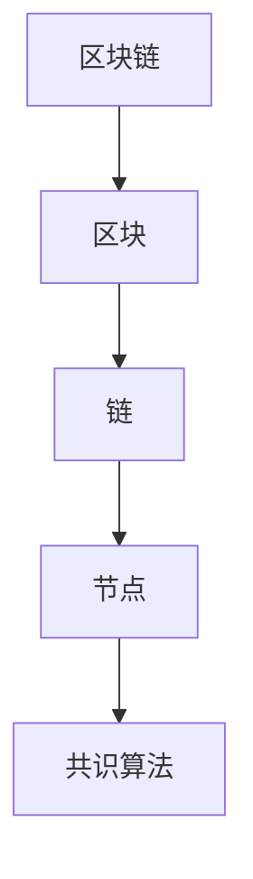

                 

### 《区块链与去中心化：重构信任的意义》

在当今数字化时代，信任成为了一个关键议题。传统的信任机制依赖于第三方中心化机构，这些机构在许多情况下可能会出现信任危机，从而导致系统崩溃。然而，区块链和去中心化技术提供了一种全新的方式来重构信任，为各种应用场景带来全新的可能性。本文将深入探讨区块链与去中心化技术的核心概念、原理以及它们如何重构信任。

**关键词：**区块链，去中心化，信任，重构，应用

**摘要：**本文首先介绍了区块链和去中心化的基本概念，然后详细阐述了它们的工作原理和应用案例。接着，文章探讨了区块链如何改变传统的信任机制，并分析了这一变革对社会、经济和技术方面的影响。最后，文章对区块链技术的发展趋势和面临的挑战进行了展望，并提供了相关领域的最佳实践和小结。

### 第一部分：区块链技术基础

区块链是一种分布式数据库技术，其核心特性包括去中心化、不可篡改、安全性和可追溯性。区块链的发展历程可以分为三个阶段：区块链1.0、区块链2.0和区块链3.0。

#### 第1章：区块链的基本概念与历史

区块链是一种去中心化的数据库，其数据存储在多个节点上，每个节点都保存着完整的区块链副本。区块链通过加密算法和共识算法确保数据的完整性和安全性。区块链的发展历程可以追溯到2008年，当时中本聪（Satoshi Nakamoto）发布了比特币白皮书，提出了区块链的概念。比特币是第一个基于区块链技术的数字货币，它标志着区块链1.0时代的开始。

随着区块链技术的发展，人们开始探索如何在其他领域应用区块链。智能合约的概念在区块链2.0时代应运而生。智能合约是一种自动执行、控制和管理交易的计算机程序，它可以减少中介成本，提高交易效率。区块链3.0时代则是关于跨链和分布式计算的研究，旨在实现不同区块链之间的互操作性。

#### 第2章：区块链的工作原理与架构

区块链的工作原理包括以下几个关键组件：

1. **区块**：区块是区块链的基本单位，包含一定数量的交易记录。每个区块都有一个唯一的标识符，称为“哈希值”。哈希值是通过加密算法计算得出的，保证了数据的完整性和不可篡改性。
   
2. **链**：区块链是一个由多个区块按时间顺序链接而成的链条。一旦一个区块被添加到链上，就无法被篡改。这种链接方式保证了数据的持久性和可追溯性。

3. **节点**：节点是区块链网络中的参与者，每个节点都保存着完整的区块链副本。节点通过加密算法和共识算法确保区块链的完整性和安全性。

4. **共识算法**：共识算法是节点之间达成一致的方式。不同的共识算法有不同的优缺点，如工作量证明（PoW）、权益证明（PoS）和委托权益证明（DPoS）等。

为了更直观地理解区块链的架构，我们可以使用Mermaid流程图来展示其基本组件和关系：

### 第二部分：去中心化原理

去中心化网络与传统的中心化网络相比，具有更高的安全性、透明度和效率。去中心化网络的工作机制包括节点协作、共识达成和激励机制。

#### 第3章：去中心化网络的工作机制

去中心化网络中的节点通过协作来维护网络的稳定性和安全性。节点之间通过P2P（点对点）协议进行通信，每个节点都保存着完整的网络状态。这种分布式存储方式保证了数据的安全性，因为任何单一节点都无法控制整个网络。

共识算法是节点之间达成一致的方式。不同的共识算法有不同的工作原理，但目标都是确保网络中的所有节点都能达成共识。例如，工作量证明（PoW）算法通过计算复杂任务来竞争成为下一个区块的生成者，从而确保网络的去中心化和安全性。

激励机制是去中心化网络的重要组成部分。激励机制通过奖励节点来鼓励它们参与网络维护。常见的激励机制包括币种奖励、交易费和奖励积分等。

#### 第4章：去中心化协议与共识算法

去中心化协议是去中心化网络的核心组成部分，它定义了节点之间如何交互和协作。常见的去中心化协议包括P2P协议、区块链协议和分布式存储协议等。

共识算法是节点之间达成一致的关键机制。不同的共识算法有不同的优缺点，选择合适的共识算法对网络的性能和安全性至关重要。以下是几种常见的共识算法：

1. **工作量证明（PoW）**：节点通过计算复杂任务（如挖矿）来竞争成为下一个区块的生成者。PoW算法具有较高的安全性，但计算资源消耗较大。

2. **权益证明（PoS）**：节点根据其在网络中的权益（如币龄和币量）来竞争成为下一个区块的生成者。PoS算法相较于PoW算法具有更高的效率和安全性。

3. **委托权益证明（DPoS）**：节点通过投票选举产生下一个区块的生成者。DPoS算法具有较高的效率和安全性，但可能导致权力集中。

### 第三部分：区块链应用案例

区块链技术已经在多个领域得到广泛应用，如金融、供应链、身份验证等。以下是一些具体的区块链应用案例。

#### 第5章：区块链在金融领域的应用

区块链在金融领域具有广泛的应用前景。例如，区块链可以用于加密货币交易、点对点借贷和证券交易等。以比特币为例，比特币是一种基于区块链技术的加密货币，其交易记录存储在区块链上，确保了交易的安全性和不可篡改性。

#### 第6章：区块链在其他领域的应用

除了金融领域，区块链技术在其他领域也具有广泛的应用。例如，在供应链管理中，区块链可以用于记录商品的来源和流向，确保供应链的透明度和可信度。在身份验证领域，区块链可以用于存储和管理个人身份信息，提高身份验证的安全性和隐私性。

### 第四部分：信任重构的意义

区块链和去中心化技术为重构信任提供了新的途径。通过去中心化和分布式存储，区块链技术能够消除对第三方机构的依赖，从而降低信任风险。以下是一些关于信任重构的讨论。

#### 第7章：区块链与信任重构

区块链技术通过去中心化和分布式存储，实现了数据的安全性和不可篡改性。这使得区块链在许多场景下能够取代传统的第三方中心化机构，从而重构信任机制。例如，在供应链管理中，区块链可以确保商品的来源和流向，提高供应链的透明度和可信度。

#### 第8章：信任重构的影响

区块链和去中心化技术对信任重构的影响是多方面的。在社会层面，区块链技术可以减少对第三方机构的依赖，提高社会的信任水平。在经济层面，区块链技术可以降低交易成本，提高交易效率，从而推动经济的发展。在技术层面，区块链技术为各种应用场景提供了新的可能性，推动了技术的创新和发展。

### 第五部分：未来展望与挑战

区块链技术具有巨大的发展潜力，但同时也面临着一些挑战。以下是对区块链技术未来发展的展望和面临的挑战。

#### 第9章：区块链技术的未来发展

区块链技术的发展前景广阔，未来可能会实现跨链和分布式计算。跨链技术将实现不同区块链之间的互操作性，推动区块链生态系统的繁荣发展。分布式计算将进一步提高区块链的性能和可扩展性，满足更多应用场景的需求。

#### 第10章：区块链面临的挑战

尽管区块链技术具有巨大的潜力，但同时也面临着一些挑战。例如，性能瓶颈、规模效应和法规与监管等问题。如何解决这些问题将决定区块链技术的未来发展和应用。

### 结论

区块链和去中心化技术为重构信任提供了新的途径。通过去中心化和分布式存储，区块链技术能够消除对第三方机构的依赖，从而降低信任风险。在未来的发展中，区块链技术有望在更多领域得到应用，推动社会的进步和发展。

**作者：** AI天才研究院/AI Genius Institute & 禅与计算机程序设计艺术 /Zen And The Art of Computer Programming

本文为《区块链与去中心化：重构信任的意义》的初步大纲，旨在为读者提供对区块链和去中心化技术的全面了解。随着技术的发展，本文将不断更新和完善，以期为读者提供最准确和最有价值的信息。欢迎读者提出宝贵的意见和建议，共同推动区块链技术的创新和发展。

**注意：**本文仅为大纲，未包含详细的技术实现和案例分析。在实际应用中，区块链技术需要结合具体业务场景进行深入研究和开发。本文提供的观点仅供参考，不构成任何投资建议。

