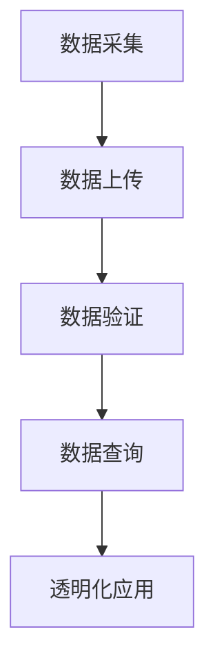

                 

### 《区块链在供应链追溯中的透明化应用》

> 关键词：区块链，供应链追溯，透明化，透明化应用，区块链供应链追溯系统

> 摘要：本文深入探讨了区块链技术在供应链追溯中的应用，尤其是透明化方面的实践和挑战。通过详细分析区块链的特点、供应链管理的基础知识以及区块链在供应链追溯中的应用，本文揭示了区块链如何为供应链管理带来透明化和可信度，并提出了实际应用案例和未来发展趋势。

## 《区块链在供应链追溯中的透明化应用》目录大纲

### 第一部分：区块链与供应链基础

#### 第1章：区块链技术概述
- **1.1 区块链的定义与特点**
- **1.2 区块链的技术原理**
- **1.3 区块链的主要分类**
- **1.4 区块链的优缺点与应用场景**

#### 第2章：供应链管理基础
- **2.1 供应链的定义与重要性**
- **2.2 供应链的基本流程**
- **2.3 供应链管理的关键要素**
- **2.4 供应链管理的发展趋势**

#### 第3章：区块链在供应链管理中的应用
- **3.1 区块链在供应链管理中的挑战与机遇**
- **3.2 区块链在供应链管理中的应用领域**
- **3.3 区块链在供应链管理中的典型案例**
- **3.4 区块链在供应链管理中的未来趋势**

### 第二部分：区块链供应链追溯技术

#### 第4章：供应链追溯概述
- **4.1 供应链追溯的定义与目的**
- **4.2 供应链追溯的技术原理**
- **4.3 供应链追溯的主要方法**
- **4.4 供应链追溯的关键技术**

#### 第5章：区块链在供应链追溯中的应用
- **5.1 区块链在供应链追溯中的作用**
- **5.2 区块链在供应链追溯中的实现方式**
- **5.3 区块链在供应链追溯中的案例研究**
- **5.4 区块链在供应链追溯中的挑战与解决方案**

#### 第6章：区块链供应链追溯系统设计与实现
- **6.1 区块链供应链追溯系统的设计原则**
- **6.2 区块链供应链追溯系统的架构**
- **6.3 区块链供应链追溯系统的关键技术**
- **6.4 区块链供应链追溯系统的实现流程**
- **6.5 区块链供应链追溯系统的性能优化**

#### 第7章：区块链供应链追溯系统应用案例分析
- **7.1 某食品企业区块链供应链追溯系统应用**
- **7.2 某服装企业区块链供应链追溯系统应用**
- **7.3 某医药企业区块链供应链追溯系统应用**
- **7.4 区块链供应链追溯系统的未来发展趋势**

### 第三部分：区块链供应链追溯案例分析

#### 第8章：区块链在供应链追溯中的透明化应用
- **8.1 区块链在供应链追溯中的透明化定义与意义**
- **8.2 区块链在供应链追溯中的透明化实现方式**
- **8.3 区块链在供应链追溯中的透明化案例研究**
- **8.4 区块链在供应链追溯中的透明化挑战与解决方案**

#### 第9章：区块链在供应链安全与合规中的应用
- **9.1 区块链在供应链安全中的应用**
- **9.2 区块链在供应链合规中的应用**
- **9.3 区块链在供应链安全与合规中的案例研究**
- **9.4 区块链在供应链安全与合规中的未来发展趋势**

#### 第10章：区块链供应链追溯系统评估与优化
- **10.1 区块链供应链追溯系统的评估指标**
- **10.2 区块链供应链追溯系统的优化策略**
- **10.3 区块链供应链追溯系统的实施路径**
- **10.4 区块链供应链追溯系统的可持续发展策略**

## 附录

- **附录A：区块链供应链追溯技术相关资源**
- **附录B：区块链供应链追溯系统开发工具与框架**
- **附录C：区块链供应链追溯案例分析参考文献**
- **附录D：区块链在供应链追溯中的透明化应用 Mermaid 流程图**

# 引言

供应链管理是现代企业运营中至关重要的一环。随着全球化和信息技术的迅猛发展，供应链的复杂性不断增加，使得追溯供应链中的每一个环节变得至关重要。然而，传统的供应链管理方法往往存在数据不透明、易篡改等问题，难以满足现代企业对透明化和可信度的需求。为了解决这一问题，区块链技术被引入供应链管理领域，为供应链追溯提供了全新的解决方案。

区块链技术以其去中心化、不可篡改、透明化等特性，在供应链追溯中发挥着重要作用。本文将深入探讨区块链在供应链追溯中的应用，重点关注透明化方面的实践和挑战。首先，我们将介绍区块链技术和供应链管理的基础知识，然后分析区块链在供应链追溯中的应用领域和实现方式，并通过案例研究揭示其优势和局限性。最后，我们将探讨区块链供应链追溯系统的设计和优化策略，以及其在未来发展的趋势。

## 第一部分：区块链与供应链基础

### 第1章：区块链技术概述

#### 1.1 区块链的定义与特点

区块链是一种去中心化的分布式数据库技术，通过加密算法和时间戳技术，确保数据的不可篡改性和透明性。区块链的基本单位是“区块”，每个区块包含一定数量的交易记录，并通过密码学算法与前一个区块连接，形成一个链式数据结构。这种链式结构使得区块链具有去中心化的特性，即数据不再依赖于单一的中心服务器，而是由网络中的多个节点共同维护。

区块链的主要特点包括：

1. **去中心化**：区块链通过分布式的网络结构，实现了去中心化的数据处理和管理。这使得数据存储和管理更加透明、公正和高效。
2. **不可篡改性**：区块链采用加密算法和时间戳技术，确保数据的完整性和不可篡改性。一旦数据被记录在区块链上，便无法被修改或删除。
3. **透明性**：区块链上的数据对所有网络参与者可见，且数据记录具有时间戳和加密签名，确保了数据的可信度和透明性。
4. **安全性**：区块链的加密算法和时间戳技术，使得数据在传输和存储过程中具有较高的安全性。

#### 1.2 区块链的技术原理

区块链的技术原理主要包括以下几个方面：

1. **分布式账本**：区块链通过分布式账本技术，将数据分散存储在多个节点上，实现了数据的去中心化管理。每个节点都保存了一份完整的账本副本，当节点间的数据发生冲突时，通过共识算法进行一致性处理。
2. **加密算法**：区块链采用加密算法对数据进行加密和签名，确保数据的隐私性和完整性。常见的加密算法包括SHA-256、RSA等。
3. **时间戳**：区块链通过时间戳技术，确保数据的记录顺序和不可篡改性。时间戳是由区块链网络中的节点共同生成的，具有高可信度。
4. **共识算法**：共识算法是区块链网络中节点达成一致意见的关键机制。常见的共识算法包括工作量证明（PoW）、权益证明（PoS）等。

#### 1.3 区块链的主要分类

区块链主要分为公有链、私有链和联盟链三种类型：

1. **公有链**：公有链是任何人都可以参与的区块链网络，具有去中心化和公开透明的特点。比特币和以太坊等公有链项目在全球范围内得到了广泛应用。
2. **私有链**：私有链是仅限特定机构或组织内部的区块链网络，具有较高的安全性、可扩展性和可控性。私有链通常用于企业内部的供应链管理、金融等领域。
3. **联盟链**：联盟链是多个机构或组织共同参与的区块链网络，具有部分去中心化的特性。联盟链在网络成员间建立信任，实现数据共享和协作。

#### 1.4 区块链的优缺点与应用场景

区块链的优缺点及其应用场景如下：

1. **优点**：
   - **去中心化**：降低了对中心化机构的依赖，提高了系统的容错性和抗攻击能力。
   - **不可篡改**：确保了数据的真实性和可靠性，降低了数据篡改的风险。
   - **透明性**：数据对所有参与者可见，提高了系统的透明度和信任度。
   - **安全性**：采用加密算法和共识算法，确保了数据的安全性和隐私性。

2. **缺点**：
   - **性能瓶颈**：区块链处理大量交易的速度较慢，可能导致系统拥堵。
   - **能源消耗**：部分区块链采用的工作量证明机制，可能导致大量的能源消耗。
   - **复杂性**：区块链技术相对复杂，对技术人员的专业要求较高。

3. **应用场景**：
   - **供应链管理**：实现供应链的透明化、可追溯性和可信度。
   - **金融服务**：提高金融交易的透明度、安全性和效率。
   - **身份验证**：实现身份信息的可信验证和管理。
   - **物联网**：实现物联网设备之间的数据共享和信任建立。

### 第2章：供应链管理基础

#### 2.1 供应链的定义与重要性

供应链是指产品或服务从原材料供应商到最终消费者的整个流程。供应链管理则是指企业通过计划、组织、协调、控制等一系列活动，实现对供应链的优化和管理。供应链管理的重要性体现在以下几个方面：

1. **提高生产效率**：通过优化供应链管理，企业可以降低生产成本、提高生产效率，从而提升市场竞争力。
2. **保证产品质量**：供应链管理有助于企业确保产品质量，从原材料采购到最终产品交付，每个环节都得到有效监控和控制。
3. **提升客户满意度**：供应链管理有助于企业实现准时交付，提高客户满意度，增强客户忠诚度。
4. **降低运营成本**：通过优化供应链管理，企业可以降低库存成本、运输成本等，提高整体运营效率。

#### 2.2 供应链的基本流程

供应链的基本流程包括以下环节：

1. **原材料采购**：企业根据生产计划，从供应商处采购原材料。
2. **生产制造**：企业将原材料转化为半成品或成品。
3. **仓储管理**：企业对原材料、半成品和成品进行储存和管理。
4. **物流运输**：企业将产品从仓库运输到销售渠道或最终消费者。
5. **售后服务**：企业对产品售后问题进行处理，提供售后服务。

#### 2.3 供应链管理的关键要素

供应链管理的关键要素包括：

1. **信息流管理**：信息流管理是指对供应链各个环节的信息进行收集、处理和传递。信息流管理有助于企业实现供应链的透明化、可视化和高效化。
2. **物流管理**：物流管理是指对供应链中的运输、仓储、配送等环节进行优化和管理。物流管理有助于企业降低运输成本、提高配送效率。
3. **资金流管理**：资金流管理是指对供应链中的资金流动进行监控和管理。资金流管理有助于企业实现现金流管理、降低库存成本。
4. **质量管理**：质量管理是指对供应链中的产品质量进行监控和改进。质量管理有助于企业提高产品竞争力、降低产品投诉率。
5. **风险管理**：风险管理是指对供应链中的各种风险进行识别、评估和控制。风险管理有助于企业降低供应链中断的风险、提高供应链的稳健性。

#### 2.4 供应链管理的发展趋势

供应链管理的发展趋势主要包括以下几个方面：

1. **智能化**：随着人工智能、大数据、物联网等技术的发展，供应链管理正朝着智能化方向演进。智能化供应链管理可以提高供应链的预测准确性、优化决策制定。
2. **全球化**：全球供应链管理是企业应对全球化挑战的重要手段。全球化供应链管理有助于企业拓展国际市场、降低生产成本。
3. **绿色供应链**：绿色供应链是指企业在供应链管理中考虑环境保护和可持续发展。绿色供应链管理有助于企业实现社会责任、提高品牌形象。
4. **供应链金融**：供应链金融是指企业利用供应链中的信用关系和物流资产，进行融资和风险管理。供应链金融有助于企业优化资金流、提高资金使用效率。

### 第3章：区块链在供应链管理中的应用

#### 3.1 区块链在供应链管理中的挑战与机遇

区块链技术在供应链管理中的应用面临一系列挑战与机遇：

1. **挑战**：
   - **技术复杂性**：区块链技术相对复杂，对企业的技术能力和人才储备提出了较高要求。
   - **数据隐私与安全**：区块链上的数据透明度较高，如何保护企业的敏感数据成为一大挑战。
   - **法律法规**：区块链技术在供应链管理中的应用尚处于探索阶段，法律法规体系尚未完善。
   - **标准化**：区块链技术的标准化工作尚需进一步推进，以促进不同区块链平台之间的互操作性。

2. **机遇**：
   - **透明化与可信度**：区块链技术可以提供透明的数据记录和不可篡改的证明，提高供应链的透明度和可信度。
   - **供应链金融**：区块链技术可以为供应链金融提供解决方案，降低融资成本、提高融资效率。
   - **智能合约**：区块链技术可以实现智能合约的自动化执行，提高供应链管理的效率和质量。
   - **数据共享与协作**：区块链技术可以实现供应链成员之间的数据共享和协作，提高供应链的协同效应。

#### 3.2 区块链在供应链管理中的应用领域

区块链在供应链管理中的应用领域主要包括：

1. **供应链追溯**：通过区块链技术，企业可以实现对供应链的全程追溯，确保产品的真实性和安全性。
2. **供应链金融**：区块链技术可以为供应链中的企业提供融资和风险管理服务，降低融资成本、提高资金使用效率。
3. **智能合约**：区块链技术可以实现智能合约的自动化执行，提高供应链管理的效率和质量。
4. **供应链协同**：区块链技术可以实现供应链成员之间的数据共享和协作，提高供应链的协同效应。

#### 3.3 区块链在供应链管理中的典型案例

以下是一些区块链在供应链管理中的典型案例：

1. **IBM Food Trust**：IBM Food Trust 是一个基于区块链技术的食品供应链追溯平台。该平台实现了从农场到餐桌的全程追溯，提高了食品的安全性和透明度。
2. **Maersk TradeLens**：Maersk TradeLens 是一个基于区块链技术的全球货运供应链平台。该平台实现了全球货运供应链的透明化和高效化，降低了物流成本。
3. **Agricultural Block**：Agricultural Block 是一个基于区块链技术的农业供应链平台。该平台通过区块链技术实现了农产品的全程追溯，提高了农产品的质量和信任度。
4. **VeChain**：VeChain 是一个基于区块链技术的物联网平台。该平台在供应链管理中应用了区块链技术，实现了产品的防伪追溯和智能合约的自动化执行。

#### 3.4 区块链在供应链管理中的未来趋势

区块链在供应链管理中的未来趋势主要包括：

1. **规模化应用**：随着区块链技术的成熟和普及，区块链在供应链管理中的应用将逐渐规模化。
2. **标准化**：区块链技术的标准化工作将有助于不同区块链平台之间的互操作性和兼容性。
3. **跨界融合**：区块链技术将与人工智能、大数据、物联网等技术进行跨界融合，形成更加智能、高效的供应链管理体系。
4. **政策支持**：政府和企业将加大对区块链技术的支持力度，推动其在供应链管理中的应用。

### 第二部分：区块链供应链追溯技术

#### 第4章：供应链追溯概述

#### 4.1 供应链追溯的定义与目的

供应链追溯是指通过记录和追踪供应链中各个环节的信息，实现对产品来源、生产过程、运输过程、销售过程等的全面了解。供应链追溯的目的主要包括：

1. **提高产品质量**：通过追溯产品的生产过程，企业可以及时发现和解决问题，提高产品质量。
2. **增强消费者信任**：供应链追溯可以提高产品的透明度，增强消费者对产品的信任。
3. **降低成本**：通过追溯产品的运输过程，企业可以优化物流配送，降低物流成本。
4. **提高竞争力**：供应链追溯可以提高企业的市场竞争力，帮助企业赢得市场份额。

#### 4.2 供应链追溯的技术原理

供应链追溯的技术原理主要包括以下几个方面：

1. **数据记录**：供应链追溯系统通过记录各个环节的信息，实现对产品来源、生产过程、运输过程等的全面了解。
2. **数据存储**：供应链追溯系统将记录的数据存储在数据库中，以便后续查询和分析。
3. **数据传输**：供应链追溯系统通过数据传输技术，实现各个环节之间的信息共享和协同。
4. **数据验证**：供应链追溯系统通过加密算法和时间戳等技术，确保数据的真实性和完整性。

#### 4.3 供应链追溯的主要方法

供应链追溯的主要方法包括：

1. **二维码追溯**：通过在产品上贴上二维码，消费者可以扫码查询产品的相关信息。
2. **RFID追溯**：通过在产品上贴上RFID标签，实现对产品的实时跟踪和监控。
3. **区块链追溯**：通过区块链技术，实现产品的全程追溯和不可篡改。

#### 4.4 供应链追溯的关键技术

供应链追溯的关键技术包括：

1. **数据采集技术**：通过传感器、摄像头等设备，实现对供应链各个环节的信息采集。
2. **数据存储技术**：通过数据库、云存储等技术，实现对供应链数据的存储和管理。
3. **数据传输技术**：通过网络、物联网等技术，实现供应链数据的高效传输和共享。
4. **数据加密技术**：通过加密算法，确保供应链数据的真实性和安全性。

### 第5章：区块链在供应链追溯中的应用

#### 5.1 区块链在供应链追溯中的作用

区块链在供应链追溯中的作用主要包括：

1. **提高透明度**：区块链技术可以实现供应链数据的全程记录和透明化，提高供应链的透明度。
2. **增强可信度**：区块链技术采用加密算法和时间戳等技术，确保供应链数据的真实性和可信度。
3. **降低风险**：区块链技术可以降低供应链数据篡改和欺诈的风险，提高供应链的安全性和稳定性。
4. **提高效率**：区块链技术可以实现供应链数据的实时共享和协同，提高供应链的运行效率。

#### 5.2 区块链在供应链追溯中的实现方式

区块链在供应链追溯中的实现方式主要包括：

1. **数据采集**：通过传感器、RFID等设备，实现对供应链数据的实时采集。
2. **数据上传**：将采集到的数据上传至区块链网络，实现数据的分布式存储和共享。
3. **数据验证**：通过对上传的数据进行加密和签名，确保数据的真实性和完整性。
4. **数据查询**：通过区块链网络，实现对供应链数据的实时查询和追溯。

#### 5.3 区块链在供应链追溯中的案例研究

以下是一些区块链在供应链追溯中的案例研究：

1. **IBM Food Trust**：IBM Food Trust 是一个基于区块链技术的食品供应链追溯平台。该平台实现了从农场到餐桌的全程追溯，提高了食品的安全性和透明度。
2. **VeChain**：VeChain 是一个基于区块链技术的物联网平台。该平台在供应链管理中应用了区块链技术，实现了产品的防伪追溯和智能合约的自动化执行。
3. **Agricultural Block**：Agricultural Block 是一个基于区块链技术的农业供应链平台。该平台通过区块链技术实现了农产品的全程追溯，提高了农产品的质量和信任度。

#### 5.4 区块链在供应链追溯中的挑战与解决方案

区块链在供应链追溯中面临的挑战主要包括：

1. **数据隐私与安全**：如何保护供应链数据的隐私和安全是一个重要挑战。解决方案包括采用加密算法和时间戳技术，确保数据的加密存储和传输。
2. **数据质量与可靠性**：如何确保供应链数据的真实性和可靠性是一个重要挑战。解决方案包括建立数据质量控制机制，对数据进行验证和清洗。
3. **技术复杂性**：区块链技术的复杂性对企业的技术能力提出了较高要求。解决方案包括提供培训和支持，帮助企业掌握区块链技术。

### 第6章：区块链供应链追溯系统设计与实现

#### 6.1 区块链供应链追溯系统的设计原则

区块链供应链追溯系统的设计原则主要包括：

1. **分布式存储**：系统采用分布式存储技术，确保数据的可靠性和可用性。
2. **透明性**：系统应确保数据的透明性，便于供应链各环节的信息共享和协同。
3. **安全性**：系统应采用加密算法和时间戳等技术，确保数据的安全性和完整性。
4. **可扩展性**：系统应具备可扩展性，以适应不断增长的数据和处理需求。

#### 6.2 区块链供应链追溯系统的架构

区块链供应链追溯系统的架构主要包括：

1. **数据采集模块**：负责采集供应链各环节的数据，如传感器、RFID等设备。
2. **数据上传模块**：负责将采集到的数据上传至区块链网络，实现数据的分布式存储和共享。
3. **数据验证模块**：负责对上传的数据进行加密和签名，确保数据的真实性和完整性。
4. **数据查询模块**：负责通过区块链网络，实现对供应链数据的实时查询和追溯。

#### 6.3 区块链供应链追溯系统的关键技术

区块链供应链追溯系统的关键技术主要包括：

1. **区块链技术**：系统采用区块链技术，实现供应链数据的分布式存储和共享。
2. **加密技术**：系统采用加密算法，确保供应链数据的加密存储和传输。
3. **时间戳技术**：系统采用时间戳技术，确保供应链数据的记录顺序和不可篡改性。
4. **共识算法**：系统采用共识算法，确保区块链网络中的节点达成一致意见。

#### 6.4 区块链供应链追溯系统的实现流程

区块链供应链追溯系统的实现流程主要包括：

1. **数据采集**：通过传感器、RFID等设备，采集供应链各环节的数据。
2. **数据上传**：将采集到的数据上传至区块链网络，实现数据的分布式存储和共享。
3. **数据验证**：对上传的数据进行加密和签名，确保数据的真实性和完整性。
4. **数据查询**：通过区块链网络，实现对供应链数据的实时查询和追溯。
5. **数据可视化**：将查询到的数据通过可视化工具进行展示，便于供应链各环节的信息共享和协同。

#### 6.5 区块链供应链追溯系统的性能优化

区块链供应链追溯系统的性能优化主要包括以下几个方面：

1. **并发处理能力**：提高系统的并发处理能力，确保系统在高并发场景下的稳定运行。
2. **数据存储优化**：优化数据存储结构，提高数据查询和访问速度。
3. **网络传输优化**：优化网络传输协议和算法，降低数据传输延迟和带宽消耗。
4. **缓存机制**：引入缓存机制，提高数据访问速度和系统性能。

### 第7章：区块链供应链追溯系统应用案例分析

#### 7.1 某食品企业区块链供应链追溯系统应用

某食品企业通过引入区块链供应链追溯系统，实现了从农场到餐桌的全程追溯。系统采用区块链技术，对农产品的种植、采摘、加工、运输等环节进行数据记录和共享。以下是该企业区块链供应链追溯系统的具体应用：

1. **数据采集**：通过传感器和RFID设备，对农产品的生长环境、采摘时间、加工过程等信息进行实时采集。
2. **数据上传**：将采集到的数据上传至区块链网络，实现数据的分布式存储和共享。
3. **数据验证**：对上传的数据进行加密和签名，确保数据的真实性和完整性。
4. **数据查询**：消费者通过扫描产品上的二维码，可以查询农产品的种植、采摘、加工等环节的信息，提高产品的透明度和可信度。

#### 7.2 某服装企业区块链供应链追溯系统应用

某服装企业通过引入区块链供应链追溯系统，实现了从原材料采购到成品销售的全程追溯。系统采用区块链技术，对原材料的来源、加工、生产、运输等环节进行数据记录和共享。以下是该企业区块链供应链追溯系统的具体应用：

1. **数据采集**：通过传感器和RFID设备，对原材料的采购、加工、生产、运输等信息进行实时采集。
2. **数据上传**：将采集到的数据上传至区块链网络，实现数据的分布式存储和共享。
3. **数据验证**：对上传的数据进行加密和签名，确保数据的真实性和完整性。
4. **数据查询**：销售终端通过扫描产品上的二维码，可以查询原材料的来源、加工、生产等环节的信息，提高产品的透明度和可信度。

#### 7.3 某医药企业区块链供应链追溯系统应用

某医药企业通过引入区块链供应链追溯系统，实现了从原材料采购到药品销售的全程追溯。系统采用区块链技术，对原材料的采购、加工、生产、运输、销售等环节进行数据记录和共享。以下是该企业区块链供应链追溯系统的具体应用：

1. **数据采集**：通过传感器和RFID设备，对原材料的采购、加工、生产、运输、销售等环节的信息进行实时采集。
2. **数据上传**：将采集到的数据上传至区块链网络，实现数据的分布式存储和共享。
3. **数据验证**：对上传的数据进行加密和签名，确保数据的真实性和完整性。
4. **数据查询**：销售终端通过扫描药品上的二维码，可以查询药品的采购、加工、生产、运输、销售等环节的信息，提高药品的透明度和可信度。

#### 7.4 区块链供应链追溯系统的未来发展趋势

区块链供应链追溯系统在未来发展趋势主要包括以下几个方面：

1. **规模化应用**：随着区块链技术的成熟和普及，区块链供应链追溯系统将得到更广泛的应用。
2. **跨界融合**：区块链技术将与物联网、大数据、人工智能等技术进行跨界融合，形成更加智能、高效的供应链追溯系统。
3. **标准化**：区块链供应链追溯系统的标准化工作将得到进一步推进，促进不同系统之间的互操作性和兼容性。
4. **政策支持**：政府和企业将加大对区块链供应链追溯系统的支持力度，推动其发展。

### 第三部分：区块链供应链追溯案例分析

#### 第8章：区块链在供应链追溯中的透明化应用

#### 8.1 区块链在供应链追溯中的透明化定义与意义

区块链在供应链追溯中的透明化是指通过区块链技术实现供应链数据的公开透明、不可篡改，从而提高供应链的可追溯性和可信度。透明化在供应链追溯中的意义主要体现在以下几个方面：

1. **提高产品质量**：透明化可以帮助企业追溯产品的生产过程，及时发现质量问题，从而提高产品质量。
2. **增强消费者信任**：透明化使得消费者能够了解产品的来源、生产过程等信息，增强消费者对产品的信任。
3. **降低供应链风险**：透明化可以帮助企业识别和降低供应链中的风险，提高供应链的稳定性和可靠性。
4. **提高供应链效率**：透明化可以简化供应链管理流程，提高供应链的协同效率。

#### 8.2 区块链在供应链追溯中的透明化实现方式

区块链在供应链追溯中的透明化实现方式主要包括以下几个方面：

1. **数据记录**：区块链技术可以记录供应链各个环节的信息，包括生产、加工、运输、销售等环节。
2. **数据加密**：区块链技术采用加密算法，确保数据的隐私性和安全性。
3. **分布式存储**：区块链技术将数据分布式存储在多个节点上，确保数据的不可篡改性和可靠性。
4. **透明查询**：区块链技术允许供应链各参与方透明查询数据，提高供应链的可追溯性。

#### 8.3 区块链在供应链追溯中的透明化案例研究

以下是一些区块链在供应链追溯中的透明化案例研究：

1. **IBM Food Trust**：IBM Food Trust 是一个基于区块链技术的食品供应链追溯平台，通过区块链技术实现了食品供应链的透明化。消费者可以通过扫描食品包装上的二维码，查询食品的生产、加工、运输等信息。

2. **VeChain**：VeChain 是一个基于区块链技术的物联网平台，通过区块链技术实现了供应链的透明化。VeChain 的平台可以帮助企业实现从原材料采购到产品销售的全过程追溯，提高供应链的透明度和可信度。

3. **Agricultural Block**：Agricultural Block 是一个基于区块链技术的农业供应链平台，通过区块链技术实现了农产品的透明化追溯。该平台可以帮助农民记录农产品的生长环境、施肥情况等，提高农产品的质量和信任度。

#### 8.4 区块链在供应链追溯中的透明化挑战与解决方案

区块链在供应链追溯中的透明化面临一些挑战，主要包括：

1. **数据隐私与安全**：如何保护供应链数据的隐私和安全是一个重要挑战。解决方案包括采用加密算法和时间戳技术，确保数据的加密存储和传输。

2. **数据质量与可靠性**：如何确保供应链数据的真实性和可靠性是一个重要挑战。解决方案包括建立数据质量控制机制，对数据进行验证和清洗。

3. **技术复杂性**：区块链技术的复杂性对企业的技术能力提出了较高要求。解决方案包括提供培训和支持，帮助企业掌握区块链技术。

### 第9章：区块链在供应链安全与合规中的应用

#### 9.1 区块链在供应链安全中的应用

区块链技术在供应链安全中的应用主要包括以下几个方面：

1. **防篡改**：区块链技术通过分布式存储和加密算法，确保数据在传输和存储过程中的不可篡改性。这有助于防止供应链数据被恶意篡改。

2. **身份验证**：区块链技术可以实现供应链参与方的身份验证，确保只有授权人员可以访问和操作供应链数据。

3. **智能合约**：区块链技术中的智能合约可以实现自动化执行，确保供应链各环节的合同和协议按照预定规则执行，提高供应链的合规性。

4. **实时监控**：区块链技术可以实现供应链数据的实时监控，及时发现异常情况并采取措施，提高供应链的安全性和反应速度。

#### 9.2 区块链在供应链合规中的应用

区块链技术在供应链合规中的应用主要包括以下几个方面：

1. **合规记录**：区块链技术可以记录供应链各个环节的合规信息，包括原材料采购、生产加工、物流运输等，确保合规操作的透明性和可追溯性。

2. **审计追踪**：区块链技术可以提供详细的审计追踪功能，帮助企业和监管部门追溯供应链中的合规情况，提高供应链的合规性。

3. **合规报告**：区块链技术可以自动生成合规报告，提高报告的准确性和及时性，帮助企业满足合规要求。

4. **供应链金融**：区块链技术可以为供应链金融提供解决方案，通过智能合约实现贷款、融资等金融服务的自动化和高效化，提高供应链的融资效率。

#### 9.3 区块链在供应链安全与合规中的案例研究

以下是一些区块链在供应链安全与合规中的案例研究：

1. **IBM Blockchain World Wire**：IBM Blockchain World Wire 是一个跨境支付网络，通过区块链技术实现跨境支付的安全和合规。该网络利用智能合约实现快速、低成本的跨境支付，提高了金融服务的安全性。

2. **Atonomi**：Atonomi 是一个基于区块链技术的工业物联网安全平台，通过区块链技术实现设备身份验证和设备间的安全通信。该平台帮助工业物联网设备提高安全性和合规性。

3. **Bullish Crypto**：Bullish Crypto 是一个基于区块链技术的供应链金融平台，通过智能合约实现供应链中的贷款和融资服务。该平台提高了供应链金融的效率和安全性。

#### 9.4 区块链在供应链安全与合规中的未来发展趋势

区块链在供应链安全与合规中的未来发展趋势主要包括：

1. **技术成熟**：随着区块链技术的不断成熟，供应链安全与合规的应用将更加广泛。

2. **政策支持**：政府和监管机构将加大对区块链技术的支持力度，推动其在供应链安全与合规中的应用。

3. **跨行业合作**：供应链安全与合规将需要跨行业的合作，区块链技术将成为跨行业合作的重要基础。

4. **标准化**：供应链安全与合规的标准化工作将得到进一步推进，促进不同系统之间的互操作性和兼容性。

### 第10章：区块链供应链追溯系统评估与优化

#### 10.1 区块链供应链追溯系统的评估指标

区块链供应链追溯系统的评估指标主要包括以下几个方面：

1. **数据完整性**：系统应确保供应链数据的完整性，包括数据的采集、上传、存储和传输过程。

2. **数据安全性**：系统应采用加密算法和时间戳技术，确保供应链数据的安全性和隐私性。

3. **数据可用性**：系统应确保供应链数据的实时可用性，提高供应链管理的效率和决策准确性。

4. **系统可靠性**：系统应具备高可靠性，确保在故障情况下能够快速恢复和数据不丢失。

5. **系统性能**：系统应具备高性能，能够处理大规模的数据量和复杂的查询需求。

#### 10.2 区块链供应链追溯系统的优化策略

区块链供应链追溯系统的优化策略主要包括以下几个方面：

1. **数据优化**：对供应链数据进行分析，去除冗余数据，提高数据质量。

2. **存储优化**：采用分布式存储和缓存技术，提高数据存储的效率和安全性。

3. **查询优化**：优化数据库查询算法和索引结构，提高数据查询的速度和准确性。

4. **网络优化**：优化区块链网络传输协议和算法，降低数据传输延迟和带宽消耗。

5. **系统稳定性**：通过系统监控和故障恢复机制，提高系统的稳定性和可靠性。

#### 10.3 区块链供应链追溯系统的实施路径

区块链供应链追溯系统的实施路径主要包括以下几个阶段：

1. **需求分析**：分析企业的供应链管理需求，明确区块链供应链追溯系统的目标和功能。

2. **技术选型**：选择适合企业需求的区块链平台和开发工具，确定系统的架构和技术方案。

3. **系统设计**：设计区块链供应链追溯系统的架构和模块，包括数据采集、数据上传、数据验证、数据查询等。

4. **系统开发**：根据系统设计文档，进行区块链供应链追溯系统的开发，包括前端界面、后端服务和数据库管理等。

5. **系统测试**：对开发完成的系统进行全面的测试，确保系统的功能、性能和安全性。

6. **系统部署**：将测试通过的区块链供应链追溯系统部署到生产环境，确保系统的正常运行。

7. **系统维护**：对系统进行长期的维护和更新，确保系统的稳定性和适应性。

#### 10.4 区块链供应链追溯系统的可持续发展策略

区块链供应链追溯系统的可持续发展策略主要包括以下几个方面：

1. **技术升级**：随着区块链技术的不断进步，企业应持续跟踪和引入新技术，保持系统的先进性和竞争力。

2. **人才培养**：企业应加强对区块链技术人才的培养和引进，提高系统开发和维护的能力。

3. **政策合规**：企业应密切关注政策动态，确保系统的合规性和合法性。

4. **市场推广**：企业应通过市场推广和宣传，提高区块链供应链追溯系统的知名度和影响力。

5. **合作共赢**：企业应与其他企业、研究机构、政府等合作，共同推动区块链供应链追溯系统的发展。

### 附录

#### 附录A：区块链供应链追溯技术相关资源

1. **区块链技术书籍**：《区块链：从数字货币到企业应用》、《区块链技术指南》等。

2. **区块链技术文档**：区块链开源平台（如Ethereum、Hyperledger Fabric）的官方文档。

3. **区块链技术社区**：区块链技术论坛、博客、社交媒体等。

#### 附录B：区块链供应链追溯系统开发工具与框架

1. **区块链平台**：Ethereum、Hyperledger Fabric、EOS等。

2. **开发框架**：Truffle、Ganache、Node.js、Java等。

3. **数据库**：MongoDB、MySQL、PostgreSQL等。

#### 附录C：区块链供应链追溯案例分析参考文献

1. **IBM Food Trust 案例分析**：《IBM Food Trust：区块链技术在食品供应链中的应用》。

2. **VeChain 案例分析**：《VeChain：物联网与区块链在供应链管理中的应用》。

3. **Agricultural Block 案例分析**：《Agricultural Block：区块链技术在农业供应链中的应用》。

#### 附录D：区块链在供应链追溯中的透明化应用 Mermaid 流程图

### 总结

区块链技术在供应链追溯中的应用，为供应链管理带来了透明化、安全性和高效性。通过本文的探讨，我们了解了区块链技术的基础知识、供应链管理的基本概念以及区块链在供应链追溯中的应用和挑战。我们通过案例分析展示了区块链在供应链追溯中的实际应用，并提出了优化策略和可持续发展策略。未来，随着区块链技术的不断成熟，区块链在供应链追溯中的应用将更加广泛，为供应链管理带来更多创新和变革。希望本文能为读者提供有益的参考和启示。

