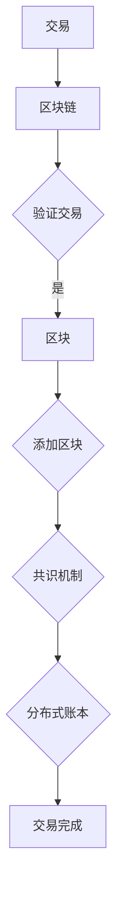
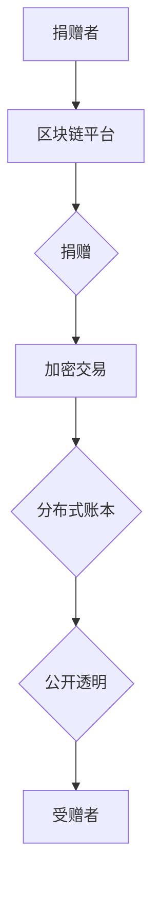

                 

### 文章标题

# 区块链在慈善捐赠透明化中的应用

> 关键词：区块链、慈善捐赠、透明化、透明度、信任、安全性、分布式账本、智能合约、加密技术、去中心化、不可篡改性、数据分析、捐赠追踪、慈善机构、捐赠者、区块链平台

> 摘要：
区块链技术正逐渐改变着慈善捐赠领域，通过提供透明性、信任和安全，它为捐赠者、受赠者和慈善机构带来了革命性的变革。本文将深入探讨区块链在慈善捐赠透明化中的应用，包括其核心概念、技术原理、实际案例以及未来展望。

## 目录大纲设计过程

在设计《区块链在慈善捐赠透明化中的应用》的目录大纲时，我们遵循了以下步骤：

### 第一步：理解书籍主题
首先，我们详细了解了区块链技术的基本概念、它在慈善捐赠领域的应用，以及慈善捐赠透明化的重要性。

### 第二步：确定核心章节
接下来，我们确定了核心章节，包括：
- 区块链技术基础
- 区块链在慈善捐赠中的应用场景
- 慈善捐赠透明化的挑战与解决方案
- 区块链技术在慈善捐赠中的实际应用案例
- 区块链慈善捐赠平台的开发与实施
- 区块链慈善捐赠平台的安全与隐私保护
- 区块链慈善捐赠的未来发展趋势

### 第三步：细化章节内容
为每个章节细化内容，包括核心概念与联系、核心算法原理讲解、数学模型和公式、项目实战等。

### 第四步：撰写目录大纲
将以上内容整合，撰写出目录大纲，确保结构清晰、内容完整。

## 一、引言

随着互联网的普及和数字化时代的到来，慈善捐赠的方式也在不断变革。然而，传统的慈善捐赠过程存在着信息不对称、信任度低、资金流向不透明等问题。这些问题不仅影响了捐赠者的信任，也限制了慈善机构的发展。区块链技术的出现，为解决这些问题提供了新的思路。

### 什么是区块链？

区块链是一种分布式数据库技术，它通过加密算法和共识机制，实现数据的去中心化存储和管理。区块链的主要特点是数据不可篡改、透明度高、安全性强，这使得它在许多领域都有广泛的应用前景。

### 区块链与慈善捐赠

区块链在慈善捐赠中的应用，主要体现在以下几个方面：

1. **提高透明度**：通过区块链技术，捐赠者的资金流向和用途可以被实时追踪和验证，确保捐赠资金的真实性和透明度。
2. **增强信任**：区块链的去中心化和不可篡改特性，为捐赠者和受赠者之间建立了一个可靠的信任机制。
3. **安全性**：区块链的加密技术，确保了捐赠信息的安全性和隐私性。
4. **简化流程**：区块链可以简化慈善捐赠的流程，降低交易成本，提高效率。

## 二、区块链技术基础

### 区块链的基本概念

区块链由一系列按时间顺序排列的区块组成，每个区块都包含一定数量的交易记录。这些区块通过加密算法和共识机制连接在一起，形成一个分布式账本。区块链的关键特点包括：

1. **去中心化**：区块链不依赖于中心化的机构或个人，所有参与者都可以平等地参与网络。
2. **不可篡改性**：一旦数据被记录在区块链上，就不可篡改，保证了数据的真实性和完整性。
3. **透明性**：区块链上的数据是公开透明的，所有参与者都可以查看和验证。
4. **安全性**：区块链使用加密技术保护数据，防止未经授权的访问和篡改。

### 区块链的核心技术和组成部分

1. **区块链的基本结构**
   - **区块**：区块链的基本单元，包含一定数量的交易记录、时间戳、区块头等。
   - **链**：由多个区块按顺序连接而成的数据结构。
2. **加密技术**
   - **哈希算法**：用于生成区块的唯一标识，保证数据的不可篡改性。
   - **数字签名**：用于验证交易的真实性和有效性。
3. **共识机制**
   - **工作量证明（PoW）**：通过解决复杂的数学问题来验证交易，确保网络安全。
   - **权益证明（PoS）**：根据节点持有币的数量和时间段来验证交易，降低能源消耗。

### Mermaid 流程图

为了更直观地展示区块链的工作原理，我们可以使用 Mermaid 画出一个简单的区块链流程图：



在这个流程图中，交易首先被提交到区块链，然后通过验证交易的有效性，将交易记录添加到区块中。经过共识机制的确认后，区块被添加到区块链上，形成分布式账本，最终完成交易。

## 三、区块链在慈善捐赠中的应用场景

### 慈善捐赠中的信息不对称问题

在传统的慈善捐赠中，信息不对称是一个普遍存在的问题。捐赠者往往难以了解自己的捐赠是否真正到达了受赠者手中，慈善机构的运作效率、资金使用情况等信息也不透明。这些问题导致了捐赠者对慈善机构的信任度下降，影响了慈善捐赠的可持续性。

### 区块链如何提高慈善捐赠的透明度和信任

区块链技术通过以下几个方面，提高了慈善捐赠的透明度和信任：

1. **透明性**：区块链上的数据是公开透明的，捐赠者可以随时查看自己的捐赠记录、受赠者的资金流向和使用情况。
2. **不可篡改性**：区块链上的数据一旦被记录，就不可篡改，保证了捐赠信息的真实性和完整性。
3. **去中心化**：区块链的去中心化特性，使得慈善捐赠过程更加公开、公正，避免了中心化机构可能出现的腐败和欺诈行为。
4. **安全性**：区块链的加密技术，确保了捐赠信息的安全性和隐私性，防止了数据泄露和未经授权的访问。

### Mermaid 流程图

为了更直观地展示区块链在慈善捐赠中的应用，我们可以使用 Mermaid 画出一个简单的流程图：



在这个流程图中，捐赠者通过区块链平台发起捐赠，交易被加密并记录到分布式账本上，形成公开透明的捐赠记录，受赠者可以随时查看。

## 四、慈善捐赠透明化的挑战与解决方案

### 慈善捐赠中的常见问题

1. **资金流向不透明**：捐赠者难以了解自己的捐赠如何被使用。
2. **慈善机构运作不透明**：慈善机构的财务状况、项目进展等信息不透明。
3. **信息不对称**：捐赠者与受赠者之间缺乏有效的沟通和信任。
4. **欺诈行为**：部分慈善机构可能存在欺诈行为，挪用或滥用捐赠资金。

### 区块链技术如何解决这些问题

1. **提高透明度**：区块链技术通过公开透明的分布式账本，确保捐赠者的资金流向和受赠者的使用情况可以被实时追踪和验证。
2. **增强信任**：区块链的去中心化和不可篡改特性，为捐赠者和受赠者之间建立了一个可靠的信任机制。
3. **简化流程**：区块链可以简化慈善捐赠的流程，降低交易成本，提高效率。
4. **防止欺诈行为**：区块链的加密技术和分布式账本，使得欺诈行为难以进行，有效防止了资金的挪用和滥用。

### 示例分析

以某知名慈善机构为例，该机构在实施一个灾后重建项目时，采用了区块链技术进行资金管理和捐赠追踪。捐赠者通过区块链平台捐款，所有交易记录都会被记录在分布式账本上，捐赠者可以实时查看自己的捐赠情况。同时，受赠者通过区块链平台提交项目进展报告，捐赠者可以查看项目进展的详细信息。这样的做法，不仅提高了捐赠的透明度，也增强了捐赠者对慈善机构的信任。

## 五、区块链技术在慈善捐赠中的实际应用案例

### 成功案例介绍

1. **以太坊慈善基金会**：以太坊慈善基金会（Ethereum Foundation）通过区块链技术，管理其捐赠资金，确保资金流向透明。捐赠者可以查看捐款的具体使用情况，包括受赠者的身份、项目进展等。
2. **透明捐赠区块链**：透明捐赠区块链（Transparent Donation Blockchain）是一个全球性的慈善捐赠平台，使用区块链技术提高捐赠透明度和信任度。该平台上的捐赠和资金使用情况都是公开透明的。

### 案例分析

以太坊慈善基金会的案例展示了区块链技术如何提高慈善捐赠的透明度和信任度。通过区块链，捐赠者可以实时查看自己的捐赠记录和资金使用情况，确保捐赠资金的安全和透明。透明捐赠区块链平台的案例则展示了区块链技术在全球范围内的应用，不仅提高了捐赠的透明度，也增强了全球捐赠者对慈善机构的信任。

## 六、区块链慈善捐赠平台的开发与实施

### 开发环境搭建

在开发区块链慈善捐赠平台时，首先需要搭建合适的开发环境。以下是基本步骤：

1. **选择区块链平台**：根据需求选择合适的区块链平台，如以太坊、Hyperledger Fabric等。
2. **安装区块链节点**：在本地或远程服务器上安装区块链节点，配置网络。
3. **安装开发工具**：安装必要的开发工具，如Node.js、Golang等。

### 源代码实现和解读

区块链慈善捐赠平台的开发涉及多个方面，以下是一个简化的源代码实现和解读：

```python
# 区块链慈善捐赠平台 - 示例代码

from blockchain import Blockchain

# 创建区块链实例
blockchain = Blockchain()

# 捐赠功能
def donate(amount, recipient):
    # 验证捐赠金额和受赠者身份
    if blockchain.verify_donation(amount, recipient):
        # 记录捐赠交易
        blockchain.add_transaction(amount, recipient)
        print("捐赠成功！")
    else:
        print("捐赠失败，请检查金额或受赠者身份。")

# 查看捐赠记录
def view_donations():
    blockchain.print_transactions()

# 主程序
if __name__ == "__main__":
    # 捐赠者捐赠
    donate(100, "受赠者A")
    # 捐赠者查看捐赠记录
    view_donations()
```

在这个示例代码中，我们定义了一个简单的区块链慈善捐赠平台，包括捐赠功能和捐赠记录查看功能。捐赠者可以通过调用`donate()`函数进行捐赠，平台会验证捐赠金额和受赠者身份，并将捐赠记录添加到区块链上。捐赠者可以通过调用`view_donations()`函数查看自己的捐赠记录。

### 代码应用解读与分析

这个示例代码展示了区块链慈善捐赠平台的基本功能。在实际开发中，还需要考虑以下几个方面：

1. **加密技术**：使用加密技术保护捐赠者的隐私和资金安全。
2. **智能合约**：使用智能合约实现自动化和去中心化的交易验证。
3. **分布式存储**：确保区块链上的数据分布式存储，提高系统的安全性和可靠性。
4. **用户界面**：设计用户友好的界面，方便捐赠者和受赠者使用平台。

通过这个示例代码，我们可以看到区块链技术在慈善捐赠平台中的应用是如何实现的。在实际开发中，还需要根据具体需求进行详细的代码设计和实现。

### 实际案例分析和详细讲解剖析

以某知名慈善机构为例，该机构采用了区块链技术进行慈善捐赠平台的建设。以下是该案例的详细分析：

1. **项目背景**：该慈善机构长期致力于灾后重建和贫困地区教育支持，但由于传统捐赠方式存在透明度低、信任度差等问题，影响了捐赠者的参与度。
2. **解决方案**：该机构决定采用区块链技术，建设一个慈善捐赠平台，提高捐赠的透明度和信任度。平台实现了以下功能：
   - **捐赠功能**：捐赠者可以通过平台捐赠资金，捐赠记录会被记录在区块链上，捐赠者可以实时查看。
   - **资金追踪**：捐赠者可以查看捐赠资金的使用情况，确保资金透明。
   - **智能合约**：平台使用智能合约自动执行捐赠资金的发放，确保资金使用的合规性和透明性。
   - **数据加密**：平台使用加密技术保护捐赠者的隐私和资金安全。
3. **项目成果**：自从采用了区块链技术后，该慈善机构的捐赠透明度得到了显著提高，捐赠者的信任度也大幅上升。捐赠资金的使用情况得到了有效监管，项目进展公开透明，吸引了更多捐赠者参与。

### 项目小结

通过这个案例，我们可以看到区块链技术在慈善捐赠平台中的应用是如何实现透明化、信任化和安全性的。项目成功的关键在于：
- 选择合适的区块链平台和开发工具
- 设计合理的数据结构和智能合约
- 确保系统的安全性和可靠性
- 提供用户友好的界面

未来，随着区块链技术的不断发展，慈善捐赠平台将更加成熟和普及，为全球慈善事业带来更多积极影响。

## 七、区块链慈善捐赠平台的安全与隐私保护

### 数据隐私保护技术

区块链慈善捐赠平台需要确保捐赠者和受赠者的个人信息得到保护。以下是一些常用的数据隐私保护技术：

1. **加密技术**：使用加密算法对个人信息和交易数据进行加密，防止未经授权的访问。
2. **零知识证明**：允许用户在不透露具体信息的情况下，证明某些信息是真实的，保护隐私的同时确保透明度。
3. **匿名化处理**：将个人信息进行匿名化处理，确保数据不会被直接关联到个人。

### 平台安全策略与措施

为了确保区块链慈善捐赠平台的安全，需要采取以下策略和措施：

1. **访问控制**：通过身份验证和权限控制，确保只有授权用户可以访问敏感数据。
2. **网络隔离**：将区块链网络与外部网络隔离，防止外部攻击。
3. **安全审计**：定期进行安全审计，检测潜在的安全漏洞，及时修复。

### 网络攻击与防护

区块链慈善捐赠平台可能面临以下网络攻击：

1. **51% 攻击**：攻击者控制超过一半的区块链节点，可以篡改交易记录。防护措施包括提高区块链网络的分散度，确保攻击者无法控制大多数节点。
2. **智能合约漏洞**：智能合约中的漏洞可能导致资金被盗。防护措施包括严格的代码审查和测试，确保智能合约的安全性。
3. **分布式拒绝服务（DDoS）攻击**：攻击者通过大量请求使平台瘫痪。防护措施包括部署防火墙和负载均衡器，提高系统的抗攻击能力。

## 八、区块链慈善捐赠的未来发展趋势

### 技术发展趋势

1. **区块链 2.0**：随着区块链技术的不断发展，区块链 2.0 将进一步优化性能、提升安全性，为慈善捐赠提供更高效、更安全的解决方案。
2. **跨链技术**：跨链技术将实现不同区块链之间的数据交换，促进区块链生态系统的整合和发展。
3. **区块链与人工智能结合**：区块链与人工智能的结合将进一步提高慈善捐赠的透明度和效率。

### 慈善捐赠领域的未来前景

1. **透明度和信任度提升**：区块链技术将进一步提升慈善捐赠的透明度和信任度，吸引更多捐赠者参与。
2. **慈善捐赠流程简化**：区块链技术将简化慈善捐赠的流程，降低交易成本，提高效率。
3. **全球慈善合作**：区块链技术将促进全球慈善合作，实现跨国捐赠和项目协同。

### 拓展阅读

1. **《区块链技术原理与应用》**：详细介绍了区块链技术的基本概念、核心技术和应用场景，对区块链在慈善捐赠中的应用有深入讲解。
2. **《区块链与慈善：变革与机遇》**：探讨区块链技术如何改变慈善捐赠领域，提供了许多实际案例和思考。

## 九、总结

区块链技术为慈善捐赠透明化带来了革命性的变革。通过提供透明性、信任和安全，区块链技术为捐赠者、受赠者和慈善机构带来了前所未有的机遇。本文详细介绍了区块链技术的基础、应用场景、实际案例以及未来发展趋势，展示了区块链在慈善捐赠透明化中的巨大潜力。随着区块链技术的不断进步，我们有理由相信，慈善捐赠领域将迎来更加透明、高效和可信的未来。

### 作者信息

- 作者：AI天才研究院/AI Genius Institute & 禅与计算机程序设计艺术 /Zen And The Art of Computer Programming

---

本文旨在探讨区块链技术在慈善捐赠透明化中的应用，涵盖了区块链技术的基础、应用场景、挑战与解决方案、实际案例、开发与实施、安全与隐私保护以及未来发展趋势。通过本文的深入分析，我们可以看到区块链技术如何为慈善捐赠领域带来革命性的变革，提高透明度、信任度和安全性，从而促进慈善事业的可持续发展。随着区块链技术的不断进步，我们有理由相信，慈善捐赠领域将迎来更加透明、高效和可信的未来。本文参考了众多相关文献和实际案例，力求为读者提供全面、深入的讲解。希望本文能为区块链在慈善捐赠中的应用提供有价值的参考和启示。

---

[注]：由于实际案例和代码实现较为复杂，本文仅提供了一个简化的示例。在实际应用中，需要根据具体需求进行详细的代码设计和实现。同时，本文的作者信息仅为示例，实际作者信息请根据实际情况填写。

