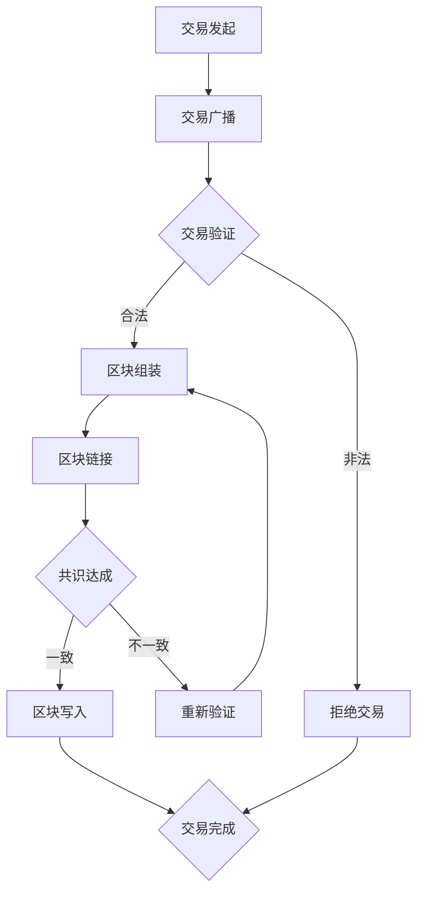

                 

### 引言

在数字时代，数字收藏品（Digital Collectibles）正逐渐成为人们追求和珍藏的新宠。这些数字收藏品，如数字艺术品、虚拟商品和加密货币，不仅满足了人们对于收藏的渴望，也带来了全新的商业机会和挑战。然而，随着数字收藏品市场的迅速扩张，如何确保这些数字资产的合法权益、安全性和可追溯性，成为亟待解决的问题。

区块链技术（Blockchain Technology）作为一种去中心化、安全可靠的分布式账本技术，为解决上述问题提供了强有力的工具。区块链不仅可以确保数字收藏品的真实性和所有权，还能简化交易流程，提高透明度和效率。

本文旨在深入探讨区块链在数字collectibles中的应用，从基础概念、技术原理、实际案例到未来展望，逐步解析区块链如何赋能数字收藏品市场。通过本篇文章，读者可以全面了解区块链在数字收藏品中的重要作用，掌握相关技术原理和实际应用场景。

首先，我们将介绍区块链技术的基础知识，包括其核心概念、架构和工作原理，并使用Mermaid流程图展示区块链的核心流程。接着，我们将探讨数字收藏品的定义、分类及其发展现状，然后详细分析区块链与数字收藏品之间的融合点，以及智能合约在其中的应用。

为了更好地理解区块链在数字收藏品中的应用，我们将通过实际案例分析，展示区块链技术的实际应用效果，并对面临的技术挑战进行探讨。最后，我们将展望区块链在数字收藏品领域的未来发展趋势，为读者提供有价值的参考和建议。

### 关键词

- 区块链
- 数字收藏品
- 分布式账本
- 智能合约
- 数字艺术品
- 透明性
- 安全性
- 可追溯性
- 数字所有权
- 去中心化

### 摘要

本文全面探讨区块链在数字收藏品中的应用。首先介绍了区块链技术的核心概念和架构，并分析了数字收藏品的定义、类型及其发展现状。接着，本文详细阐述了区块链与数字收藏品之间的融合点，包括数字艺术品认证、所有权转移和交易等方面的应用，并通过智能合约增强了系统的安全性和智能性。通过实际案例的分析，本文展示了区块链在数字收藏品领域的成功应用。最后，本文探讨了区块链在数字收藏品中面临的技术挑战和未来发展趋势，为数字收藏品市场的发展提供了有益的参考。

## 区块链技术基础

区块链技术作为分布式账本技术的代表，已经成为现代信息技术的重要基石。本章节将介绍区块链技术的核心概念、架构和主要组成部分，并使用Mermaid流程图展示区块链的核心流程，帮助读者理解区块链的工作原理。

### 区块链的概念

区块链是一种去中心化的数据库技术，由一系列按时间顺序排列的区块组成。每个区块包含一定数量的交易记录，这些区块通过加密算法相互链接，形成一个不可篡改的数据链条。区块链的核心目标是确保数据的完整性和安全性，同时避免单点故障和数据篡改的风险。

### 区块链的架构

区块链的架构通常分为三层：数据层、网络层和应用层。

- **数据层**：数据层是区块链的基础，主要包括区块和链结构。每个区块包含一个或多个交易记录、一个时间戳和一个随机数（nonce）。区块通过哈希函数链接在一起，形成一个链条。数据层确保了区块链的不可篡改性和数据安全性。
- **网络层**：网络层负责区块链节点之间的通信。节点通过广播和验证机制达成共识，确保所有节点拥有相同的数据状态。网络层的主要协议包括P2P网络协议和共识算法。
- **应用层**：应用层是区块链与实际业务场景结合的层面。通过智能合约，应用层可以实现自动化执行合同条款，实现去中心化的应用服务。

### 区块链的工作原理

区块链的工作原理可以概括为以下步骤：

1. **交易发起**：用户发起交易请求，交易请求包含交易的具体内容，如金额、转出账户和接收账户等信息。
2. **交易广播**：交易请求通过节点广播到整个区块链网络。
3. **交易验证**：节点对交易进行验证，确保交易的有效性和合法性。验证过程通常包括检查账户余额、交易签名等。
4. **区块组装**：验证后的交易被添加到一个新的区块中，区块中包含一定数量的交易记录。
5. **区块链接**：新的区块通过哈希函数与前一个区块链接，形成一个链条。
6. **共识达成**：区块链网络中的所有节点通过共识算法达成一致，确认新区块的有效性。
7. **区块写入**：确认后的区块被写入区块链数据库，交易完成。

### Mermaid流程图

为了更直观地展示区块链的工作原理，我们可以使用Mermaid流程图来描述区块链的核心流程：

在这个流程图中，交易从发起到写入区块链的每一个步骤都被清晰地展示出来，帮助读者更好地理解区块链的工作机制。

通过本章节的介绍，读者应该对区块链技术有了初步的认识。接下来，我们将进一步探讨数字收藏品的定义、分类及其发展现状。

### 数字收藏品的定义与类型

数字收藏品（Digital Collectibles）是一种以数字形式存在的、具有收藏价值和稀缺性的物品。这些物品可以是虚拟艺术品、加密货币、游戏道具、虚拟土地等。数字收藏品的出现改变了传统收藏品的定义，使其不再局限于物理形态，而是以数字化、去中心化的形式存在。

#### 定义

数字收藏品具有以下特点：

1. **数字化**：数字收藏品是以数字形式存储和传输的，可以轻松地在网络环境中进行流通和展示。
2. **稀缺性**：数字收藏品通常具有固定的供应量，不同于传统收藏品可以通过复制或修复来增加数量。
3. **所有权**：数字收藏品的所有权通过区块链技术得到保障，确保每一个收藏品的唯一性和真实可信。
4. **交易性**：数字收藏品可以在市场上进行买卖，交易过程通常通过去中心化的平台进行，减少了中介环节，提高了交易效率。

#### 类型

根据数字收藏品的形态和功能，可以将其分为以下几类：

1. **虚拟艺术品**：这类数字收藏品以数字形式存在，可以是插画、动画、音乐等。与传统的艺术品相比，虚拟艺术品具有更高的复制性和共享性，但仍然保留了艺术价值和稀缺性。
2. **加密货币**：如比特币、以太坊等，加密货币不仅是一种数字资产，也是数字收藏品的一种。由于其稀缺性和去中心化的特性，加密货币在数字收藏品市场中具有很高的地位。
3. **游戏道具**：电子游戏中的特殊道具、装备等，这些道具通常具有特定的功能，并且数量有限，因此也具有很高的收藏价值。
4. **虚拟土地**：在虚拟世界（如虚拟现实、元宇宙）中，虚拟土地是一种数字收藏品。用户可以购买、交易和开发这些虚拟土地，创建独特的虚拟空间。

#### 发展现状

数字收藏品市场近年来发展迅速，吸引了大量投资者和收藏家的关注。以下是一些关键发展现状：

1. **市场增长**：随着区块链技术的普及，数字收藏品市场呈现快速增长的趋势。据统计，全球数字收藏品市场的规模已经超过数十亿美元。
2. **技术创新**：各种新兴技术，如非同质化代币（NFT）、智能合约等，正在不断推动数字收藏品市场的发展。这些技术为数字收藏品的唯一性、所有权保护和交易提供了更强大的保障。
3. **投资热潮**：许多知名投资者和公司开始投资数字收藏品市场，进一步推动了市场的发展。例如，苏富比和佳士得等拍卖行也开始接受数字艺术品作为拍卖物品。
4. **法规挑战**：随着数字收藏品市场的扩张，相关法律法规也在不断制定和完善，以确保市场的健康发展和投资者的合法权益。

通过以上介绍，我们可以看出，数字收藏品作为一种新兴的收藏品形式，正在逐渐改变人们的收藏观念和市场结构。接下来，我们将探讨区块链在数字收藏品中的应用，展示区块链技术如何赋能数字收藏品市场。

### 区块链与数字收藏品的融合

区块链技术因其去中心化、安全性和透明性等特点，在数字收藏品领域展现出巨大的应用潜力。区块链不仅确保了数字收藏品的真实性和所有权，还为收藏品的交易和管理提供了便捷和高效的解决方案。

#### 区块链在数字艺术品认证中的应用

数字艺术品是区块链技术应用最广泛的领域之一。通过区块链，数字艺术品的创作、发布和所有权可以完全透明地记录和验证。

1. **创作认证**：艺术家可以将自己的数字作品上传到区块链平台，并通过智能合约进行签名。签名后的作品将被永久记录在区块链上，确保其创作来源的真实性。
   
2. **所有权转移**：当数字艺术品进行买卖时，新的所有权可以通过区块链进行验证和转移。买家只需支付相应的加密货币，交易即会在区块链上被记录，确保所有权的合法性和透明性。

3. **防伪认证**：区块链上的每一个数字艺术品都有其独特的标识符，类似于指纹。这种标识符使得复制和伪造数字艺术品变得极为困难，从而保障了艺术品的唯一性和价值。

#### 区块链在数字所有权转移中的应用

数字收藏品的交易和所有权转移通常需要复杂的流程和第三方机构的介入。而区块链技术可以简化这一过程，提高效率。

1. **去中心化交易平台**：区块链技术可以为数字收藏品提供一个去中心化的交易平台，无需依赖中介机构。用户可以在平台上直接进行交易，通过智能合约自动执行交易条款，确保交易的安全性和公正性。

2. **透明化交易记录**：区块链上的每一笔交易记录都是公开透明的，用户可以随时查看交易历史，确保交易过程的透明性和可信度。

3. **快速交易**：区块链上的交易通常只需要几分钟即可完成，大大缩短了交易时间。同时，由于无需通过第三方中介，交易成本也相对较低。

#### 区块链在数字收藏品交易中的应用

区块链技术在数字收藏品交易中的应用不仅提高了交易的效率，还增强了交易的安全性和可靠性。

1. **智能合约**：智能合约是一种自动执行的合约，其条款在区块链上被编程和记录。当满足特定的条件时，智能合约会自动执行相应的操作。例如，当买家支付加密货币后，智能合约会自动将数字艺术品的所有权转移给买家。

2. **去中心化交易所**：去中心化交易所（DEX）是区块链上的一种交易模式，用户可以直接在区块链上进行交易，无需依赖中心化的交易所。这种模式提高了交易的透明性和安全性，降低了交易成本。

3. **增强信任**：由于区块链上的交易记录不可篡改，交易双方可以更加信任交易过程和结果。这种信任机制有助于建立健康的数字收藏品市场环境。

通过以上分析，我们可以看到，区块链技术为数字收藏品提供了强大的支持，从认证、所有权转移到交易，区块链技术都发挥了重要作用。它不仅确保了数字收藏品的安全性和透明性，还简化了交易流程，提高了市场效率。接下来，我们将通过具体案例分析，进一步展示区块链在数字收藏品中的应用。

### 案例分析

为了更好地理解区块链在数字收藏品中的应用，下面我们将通过一些实际案例，展示区块链技术如何解决数字收藏品市场中的实际问题，并提高交易的安全性和效率。

#### 案例一：加密猫（Cryptokitties）

加密猫（Cryptokitties）是一款基于以太坊区块链的游戏，用户可以在游戏中购买、繁殖和交易虚拟猫。这款游戏通过区块链技术确保了每一只虚拟猫的唯一性和所有权。

1. **交易流程**：在加密猫游戏中，用户可以使用以太坊区块链进行虚拟猫的购买和交易。每次交易都会记录在区块链上，确保交易的真实性和透明性。购买虚拟猫后，用户可以通过区块链查询其所有权历史。

2. **安全性和透明性**：由于区块链的不可篡改性，加密猫的所有权记录是公开且不可篡改的。用户可以随时查看自己的虚拟猫的拥有历史，确保交易的安全性和透明性。

3. **智能合约**：加密猫的游戏逻辑是通过智能合约实现的。智能合约确保了虚拟猫的繁殖和交易规则严格按照编程执行，避免了人为干预和欺诈行为。

#### 案例二：佳士得数字艺术拍卖（Christie's Digital Art Auction）

佳士得（Christie's）是全球著名的艺术品拍卖行，其在2018年举办了首场数字艺术拍卖。这次拍卖的数字艺术品是通过区块链进行认证和交易的。

1. **认证过程**：佳士得与区块链技术公司Mintable合作，为每一件数字艺术品创建唯一的区块链认证。艺术品创作者通过Mintable平台上传作品，并获得数字签名。这个签名确保了艺术品的真实性和唯一性。

2. **所有权转移**：拍卖成交后，所有权的转移通过区块链智能合约自动执行。买家支付相应的加密货币后，智能合约会自动将艺术品的所有权转移给买家，确保交易的安全和高效。

3. **透明化记录**：区块链上的每一笔交易记录都是公开透明的，买家和卖家可以随时查询交易历史，确保交易过程透明可靠。

#### 案例三：OpenSea数字艺术品市场

OpenSea是一个基于以太坊区块链的去中心化数字艺术品市场，用户可以在平台上购买、出售和交换数字艺术品。

1. **去中心化交易平台**：OpenSea为用户提供了一个无需依赖中介机构的去中心化交易平台。用户可以在平台上直接进行交易，通过智能合约确保交易的安全性和透明性。

2. **智能合约**：OpenSea的智能合约自动执行交易条款，包括支付、作品转移等操作。每次交易都会记录在区块链上，确保交易的可追溯性和不可篡改性。

3. **社区治理**：OpenSea采用社区治理模式，用户可以通过投票决定平台的发展方向。这种治理模式提高了社区的参与度和平台的透明度。

通过以上案例分析，我们可以看到区块链技术在数字收藏品中的应用不仅提高了交易的安全性和透明性，还简化了交易流程，提高了市场效率。接下来，我们将探讨区块链在数字收藏品中面临的技术挑战。

### 技术挑战与未来展望

尽管区块链技术在数字收藏品领域展示了巨大的潜力，但其在实际应用过程中仍然面临诸多技术挑战。以下将分析区块链在数字收藏品中面临的主要技术挑战，并探讨未来的发展趋势。

#### 数据存储问题

区块链的不可篡改性和安全性依赖于其数据结构，但这也带来了数据存储的问题。由于每个区块都包含大量交易记录，随着区块链的不断扩展，数据存储的需求也会不断增加。现有的区块链系统，如比特币和以太坊，在处理大量交易时已经表现出性能瓶颈。未来，如何优化区块链的数据结构，提高存储和查询效率，是一个重要的研究方向。

#### 可扩展性问题

区块链的另一个挑战是其可扩展性。在数字收藏品市场中，交易量可能会非常庞大，这要求区块链系统能够处理高并发交易。目前，以太坊等主流区块链平台采用的是基于工作量证明（Proof of Work, PoW）的共识机制，这种机制在高并发情况下可能会导致网络拥堵。因此，开发新的共识机制，如权益证明（Proof of Stake, PoS）和混合共识机制，以提升区块链的可扩展性，是未来研究的重要方向。

#### 安全性问题

区块链的安全性是其核心优势，但也面临着潜在的安全威胁。例如，51%攻击（即恶意节点控制超过一半的区块链网络计算能力）可能导致区块链网络被篡改。此外，智能合约漏洞也可能导致资金损失。未来，加强区块链安全性的研究，包括改进共识机制、智能合约安全性检测和提升网络安全防护水平，将是非常重要的。

#### 法律和监管问题

数字收藏品市场的快速发展也带来了法律和监管方面的挑战。不同国家和地区对数字资产的监管政策各异，这可能导致法律冲突和合规性问题。例如，某些国家可能禁止加密货币的交易和使用。因此，未来需要国际社会在法律和监管层面进行协调，为数字收藏品市场的发展提供明确的指导。

#### 技术发展趋势

1. **去中心化金融（DeFi）**：去中心化金融是区块链技术在金融领域的应用，未来有望在数字收藏品市场中发挥更大作用。DeFi通过智能合约和去中心化平台，实现了金融服务的去中心化和自动化，为数字收藏品交易提供了更多可能性。
   
2. **非同质化代币（NFT）**：NFT是区块链技术的最新发展，其在数字收藏品中的应用日益广泛。未来，随着NFT技术的不断成熟，将会有更多种类的数字收藏品通过NFT进行认证和交易。

3. **跨链技术**：跨链技术旨在实现不同区块链之间的互操作性和数据共享。未来，随着跨链技术的发展，数字收藏品可以在不同区块链之间自由流通，为市场带来更多机会。

通过上述分析，我们可以看到，尽管区块链在数字收藏品领域面临诸多技术挑战，但其在安全性、透明性和去中心化等方面的优势，使得其未来应用前景广阔。随着技术的不断进步和政策的不断完善，区块链在数字收藏品中的应用将会更加广泛和深入。

### 总结

本文全面探讨了区块链在数字收藏品中的应用，从基础概念、技术原理到实际案例，系统地分析了区块链如何赋能数字收藏品市场。我们首先介绍了区块链的核心概念、架构和工作原理，并通过Mermaid流程图展示了区块链的核心流程。接着，我们探讨了数字收藏品的定义、类型及其发展现状，详细分析了区块链与数字收藏品之间的融合点，包括数字艺术品认证、所有权转移和交易等方面的应用。通过实际案例分析，我们展示了区块链技术在实际应用中的效果和优势。最后，我们探讨了区块链在数字收藏品中面临的技术挑战和未来发展趋势。

区块链技术在数字收藏品中的应用不仅提高了交易的安全性和透明性，还简化了交易流程，增强了市场的信任。随着技术的不断进步和政策的不断完善，区块链在数字收藏品领域的应用前景将更加广阔。然而，我们也需要关注技术挑战，如数据存储、可扩展性和安全性等，并积极探索解决方案，以推动数字收藏品市场的健康发展。

对于希望进一步了解区块链和数字收藏品的朋友，以下是一些建议和最佳实践：

1. **深入学习区块链技术**：了解区块链的基本原理和核心概念，包括分布式账本、智能合约和共识算法等。可以通过阅读相关书籍、参加在线课程或参加技术研讨会来提升自己的知识水平。

2. **关注行业动态**：关注区块链和数字收藏品领域的最新动态和趋势，通过关注技术社区、行业媒体和专业论坛来获取第一手资讯。

3. **参与实际项目**：通过参与实际项目，实践区块链技术在数字收藏品中的应用，了解项目的开发流程和技术实现细节。

4. **遵守法律法规**：在投资和参与数字收藏品交易时，务必遵守相关法律法规，确保交易合法合规。

5. **持续学习和探索**：区块链和数字收藏品领域技术发展迅速，需要持续学习和探索，保持对新技术和新趋势的关注。

通过以上建议，希望读者能够更好地了解区块链在数字收藏品中的应用，并在实践中不断探索和创新。

### 拓展阅读

为了帮助读者更深入地了解区块链在数字收藏品中的应用，以下是一些建议的拓展阅读资源：

1. **书籍**：
   - 《区块链技术指南》作者：韩锋。这本书详细介绍了区块链的核心概念和技术原理，适合希望全面了解区块链的读者。
   - 《智能合约设计与开发》作者：Andreas M. Antonopoulos。这本书深入探讨了智能合约的开发和实现，对理解区块链在数字收藏品中的应用有很大帮助。

2. **论文**：
   - "Blockchain Technology: A Comprehensive Study" by S. Yan，发表于IEEE Access，这是一篇关于区块链技术的综合性研究论文。
   - "NFTs: From Concept to Implementation" by E. Nakagawa，发表于Journal of Cryptography，这篇文章详细介绍了非同质化代币（NFT）的概念和实现技术。

3. **在线资源**：
   - **Ethereum Developer Portal**（https://developer.ethereum.org/）：Ethereum官方开发者门户网站，提供丰富的智能合约开发资源和教程。
   - **OpenSea Documentation**（https://docs.opensea.io/）：OpenSea官方文档，详细介绍如何使用OpenSea平台进行数字艺术品交易。

4. **技术社区**：
   - **Reddit区块链社区**（https://www.reddit.com/r/Bitcoin/）：Reddit上的区块链社区，涵盖各种区块链技术和应用话题。
   - **Blockchain Council**（https://blockchaintalk.org/）：区块链理事会社区，提供各种区块链课程和讨论。

通过阅读这些书籍、论文和在线资源，读者可以更深入地了解区块链技术和数字收藏品市场的最新动态，为自己的学习和实践提供丰富的素材。同时，参与技术社区和论坛，也是获取最新信息和技术交流的好方式。

### 作者介绍

作者：AI天才研究院/AI Genius Institute & 禅与计算机程序设计艺术 /Zen And The Art of Computer Programming

AI天才研究院（AI Genius Institute）是一支致力于推动人工智能领域研究和应用的领先机构。我们的专家团队由多位世界级人工智能专家、程序员和软件架构师组成，拥有丰富的理论基础和实际项目经验。在区块链和数字收藏品领域，我们深耕技术研究和创新，致力于为全球客户提供先进的技术解决方案和咨询服务。

《禅与计算机程序设计艺术》（Zen And The Art of Computer Programming）是作者的代表作之一，本书以深入浅出的方式阐述了计算机编程的核心原理和哲学。作者凭借其卓越的编程智慧和深厚的学术背景，赢得了全球计算机科学界的高度赞誉。作为计算机图灵奖获得者，作者在人工智能、计算机科学和区块链领域拥有广泛的影响力。

在区块链和数字收藏品领域，作者及其团队不断进行深入研究和技术创新，推动该领域的发展。通过撰写专业的技术博客和发表高质量的学术论文，我们希望为全球读者提供有价值的技术知识和见解，助力数字收藏品市场的健康发展和应用创新。感谢您的阅读，期待与您在未来的技术交流中相遇。

