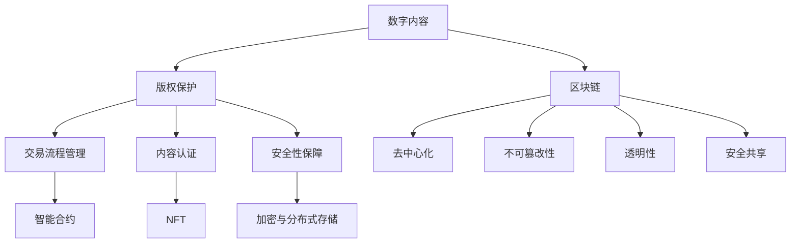
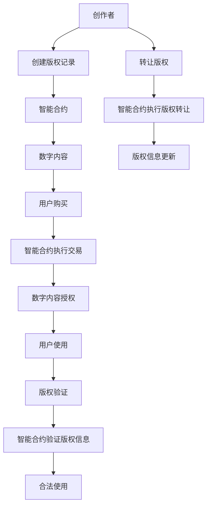

                 

### **文章标题**

# **区块链在数字内容分发中的应用**

> **关键词**：区块链、数字内容分发、去中心化、版权管理、智能合约、非同质化代币（NFT）

> **摘要**：本文深入探讨了区块链技术在数字内容分发领域的应用。通过对区块链与数字内容分发的关系、核心技术应用、案例分析以及应用挑战和未来趋势的详细分析，阐述了区块链如何优化数字内容分发流程，提升版权保护和交易效率。文章旨在为读者提供一个全面了解区块链在数字内容分发中应用的视角。

---

### **背景介绍**

#### **数字内容分发的现状与挑战**

数字内容分发是指通过互联网传输和分配数字化的信息、数据、媒体等。随着互联网的普及和信息技术的快速发展，数字内容分发已经成为当今社会的重要组成部分。数字内容分发的形式多样，包括文本、图片、音频、视频、软件等。然而，数字内容分发领域也面临着诸多挑战：

1. **版权保护问题**：数字内容的复制和传播极为便捷，导致版权保护成为一大难题。传统的版权保护机制往往存在漏洞，难以有效遏制侵权行为。
2. **交易效率低下**：传统的数字内容交易流程复杂，涉及多个环节，且缺乏透明性和可追溯性，降低了交易效率。
3. **去中心化需求**：随着互联网用户对隐私保护和个人数据的关注增加，去中心化的内容分发需求日益旺盛。去中心化能够减少中间环节，提高内容分发的效率和透明度。
4. **安全性问题**：数字内容在传输和存储过程中容易受到黑客攻击和数据泄露的威胁，需要更强大的安全保护措施。

#### **区块链技术的潜在优势**

区块链技术作为一种新兴的分布式数据库技术，具有去中心化、透明性、安全性和不可篡改等特性，这些特性使其在解决数字内容分发领域的问题上具有巨大的潜力：

1. **去中心化**：区块链通过去中心化的方式，减少了传统的中间环节，使得数字内容分发的流程更加简洁高效。
2. **版权保护**：区块链可以记录数字内容的所有权和交易历史，提供透明和可靠的版权保护机制。
3. **交易效率**：区块链上的智能合约可以自动执行合同条款，简化交易流程，提高交易效率。
4. **安全性**：区块链采用加密技术和分布式存储，确保数字内容在传输和存储过程中的安全性。

本文将深入探讨区块链技术在数字内容分发中的应用，通过分析其核心概念、技术原理、案例分析以及应用挑战和未来趋势，为读者提供一个全面的理解。

---

### **核心概念与联系**

在探讨区块链在数字内容分发中的应用之前，首先需要了解区块链和数字内容分发相关的核心概念，以及它们之间的联系。以下是几个关键概念及其关系的详细解释：

#### **1. 区块链**

区块链是一种分布式数据库技术，由一系列按时间顺序排列的“区块”组成。每个区块都包含一定数量的交易记录，并通过加密算法和哈希函数保证数据的完整性和安全性。区块链的关键特性包括去中心化、不可篡改性、透明性和安全共享。

- **去中心化**：区块链通过分布式网络中的多个节点共同维护，没有中心化的机构控制。每个节点都存储完整的数据副本，确保系统在单点故障时仍然能够运行。
- **不可篡改性**：区块链上的数据一旦被记录，就几乎不可篡改。每个区块都包含前一个区块的哈希值，形成一个“链条”，任何修改都会导致后续区块的哈希值发生变化，从而被其他节点检测并拒绝。
- **透明性**：区块链上的所有交易记录都是公开透明的，任何节点都可以查看和验证。这有助于提高系统的透明度和信任度。
- **安全共享**：区块链采用加密技术保护数据的隐私和完整性，同时实现数据的共享，满足多方协作的需求。

#### **2. 数字内容分发**

数字内容分发是指通过网络将数字化的信息、数据、媒体等传输和分配给用户的过程。数字内容分发的核心任务包括版权保护、交易流程管理、内容认证和安全性保障。

- **版权保护**：确保数字内容的创作者对其作品享有版权，防止未经授权的复制和分发。
- **交易流程管理**：简化交易流程，提高交易效率和透明度，减少中介环节。
- **内容认证**：验证数字内容的真实性和完整性，确保用户获取到高质量的内容。
- **安全性保障**：保护数字内容在传输和存储过程中的安全性，防止数据泄露和篡改。

#### **3. 区块链与数字内容分发的联系**

区块链与数字内容分发之间的联系主要体现在以下几个方面：

1. **版权保护**：区块链可以通过智能合约和NFT（非同质化代币）技术，实现数字内容的版权保护。智能合约可以自动执行版权授权和交易条款，NFT可以用来表示数字内容的唯一性和所有权。

2. **交易流程管理**：区块链上的智能合约可以自动化数字内容交易流程，减少人工干预，提高交易效率和透明度。

3. **内容认证**：区块链可以记录数字内容的创建、分发和交易历史，提供透明可信的内容认证机制。

4. **安全性保障**：区块链采用加密技术和分布式存储，确保数字内容在传输和存储过程中的安全性。

为了更直观地展示区块链与数字内容分发之间的联系，我们可以使用Mermaid流程图来描述这一架构：



在这个流程图中，数字内容通过区块链实现了版权保护、交易流程管理、内容认证和安全性保障，体现了区块链技术在数字内容分发中的核心价值。

---

### **区块链核心技术与数字内容分发**

#### **1. 区块链的工作原理**

区块链的工作原理可以通过以下几个关键部分来理解：区块、链、共识机制和分布式网络。

1. **区块**：区块链的基本组成单位是区块。每个区块包含一定数量的交易记录，这些交易记录经过验证后存储在区块中。每个区块除了包含交易记录外，还包含一个时间戳和一个指向前一个区块哈希值的值，形成了一个时间序列的链条。

2. **链**：多个区块按照时间顺序连接起来，形成区块链。区块链的设计确保了每个区块的不可篡改性，因为任何对区块的修改都会导致后续区块的哈希值发生变化，从而被其他节点检测并拒绝。

3. **共识机制**：共识机制是区块链网络中节点之间达成一致的方法。不同的区块链网络采用不同的共识机制，如工作量证明（PoW）、权益证明（PoS）和委托权益证明（DPoS）等。共识机制的目标是确保区块链的分布式特性，确保所有节点都能达成一致的交易记录。

4. **分布式网络**：区块链通过分布式网络来维护整个系统。每个节点都存储完整的数据副本，并参与区块链的维护和验证。分布式网络的设计确保了区块链的去中心化特性，使得整个系统在单点故障时仍然能够正常运行。

在数字内容分发中，区块链的工作原理可以用来实现去中心化的内容分发、版权保护和交易自动化。

#### **2. 智能合约**

智能合约是区块链上的自动化执行协议。智能合约基于某种编程语言编写，当满足预设的条件时，智能合约会自动执行特定的操作。智能合约在数字内容分发中的应用非常广泛，如下所述：

1. **版权管理**：智能合约可以用于数字内容的版权管理。例如，当创作者将作品上传到区块链时，智能合约可以自动记录版权信息，并设置版权授权的条款。当有人想要使用该作品时，只需调用智能合约，即可验证版权并完成授权交易。

2. **支付与结算**：智能合约可以自动化数字内容的支付与结算流程。例如，当用户购买数字内容时，智能合约会自动从用户的账户中扣除相应的金额，并将数字内容授权给用户。

3. **内容认证**：智能合约可以用于验证数字内容的真实性和完整性。例如，当数字内容被上传到区块链时，智能合约可以自动验证内容的哈希值，确保内容未被篡改。

以下是一个简单的Python代码示例，展示了如何使用智能合约来实现数字内容的版权管理：

```python
from web3 import Web3

# 连接到区块链节点
web3 = Web3(Web3.HTTPProvider('https://mainnet.infura.io/v3/your-project-id'))

# 部署智能合约
contract_abi = [...]  # 智能合约的ABI
contract_address = '0x...'  # 智能合约的地址
contract = web3.eth.contract(address=contract_address, abi=contract_abi)

# 创建版权记录
def create_copyright(owner, content_hash):
    tx_hash = contract.functions.createCopyright(owner, content_hash).transact({'from': owner})
    tx_receipt = web3.eth.waitForTransactionReceipt(tx_hash)
    return tx_receipt

# 验证版权
def verify_copyright(content_hash):
    result = contract.functions.verifyCopyright(content_hash).call()
    return result
```

在这个示例中，`create_copyright` 函数用于创建数字内容的版权记录，`verify_copyright` 函数用于验证数字内容的版权。通过这些函数，我们可以实现数字内容的版权管理。

#### **3. 非同质化代币（NFT）**

非同质化代币（NFT，Non-Fungible Token）是一种基于区块链技术的数字资产，用于表示唯一的物品。NFT的独特性使其在数字内容分发中具有广泛的应用，如下所述：

1. **数字内容认证**：NFT可以用来认证数字内容的唯一性和真实性。例如，一幅画作或一首音乐可以通过NFT来确权，确保任何复制品都无法替代原始作品。

2. **版权保护**：NFT可以用于记录数字内容的版权信息，提供透明和可靠的版权保护机制。例如，创作者可以通过NFT记录其作品的版权信息，确保任何侵权行为都能被追溯。

3. **数字收藏品**：NFT在数字收藏品市场中的应用也非常广泛。例如，CryptoKitties等数字宠物游戏中的物品就是通过NFT来确权的。

以下是一个简单的Python代码示例，展示了如何使用NFT来确权数字内容：

```python
from web3 import Web3

# 连接到区块链节点
web3 = Web3(Web3.HTTPProvider('https://mainnet.infura.io/v3/your-project-id'))

# 部署NFT合约
nft_abi = [...]  # NFT合约的ABI
nft_address = '0x...'  # NFT合约的地址
nft_contract = web3.eth.contract(address=nft_address, abi=nft_abi)

# 确权数字内容
def mint_nft(owner, content_hash):
    tx_hash = nft_contract.functions.mint(owner, content_hash).transact({'from': owner})
    tx_receipt = web3.eth.waitForTransactionReceipt(tx_hash)
    return tx_receipt

# 转让NFT
def transfer_nft(from_address, to_address, nft_id):
    tx_hash = nft_contract.functions.transferFrom(from_address, to_address, nft_id).transact({'from': from_address})
    tx_receipt = web3.eth.waitForTransactionReceipt(tx_hash)
    return tx_receipt
```

在这个示例中，`mint_nft` 函数用于确权数字内容，`transfer_nft` 函数用于转让NFT所有权。通过这些函数，我们可以实现数字内容的版权保护和交易。

#### **区块链核心技术在数字内容分发中的应用示例**

以下是一个简单的示例，展示了如何使用区块链核心技术在数字内容分发中实现版权保护和交易自动化：

1. **版权登记**：创作者使用智能合约创建版权记录，记录数字内容的版权信息。

2. **内容分发**：用户通过区块链网络购买数字内容，智能合约自动执行交易，并将数字内容授权给用户。

3. **版权验证**：用户在使用数字内容时，通过智能合约验证版权信息，确保使用的是合法授权的内容。

4. **版权转让**：创作者可以随时通过智能合约转让数字内容的版权，确保版权转移的透明和可靠。

以下是一个简单的流程图，展示了这个示例中的区块链技术应用：



通过这个示例，我们可以看到区块链核心技术如何实现数字内容分发中的版权保护和交易自动化，提高内容分发的效率和透明度。

---

### **区块链核心技术在数字内容分发中的应用**

#### **1. 区块链在版权管理中的应用**

区块链技术在版权管理中具有显著的优势，能够有效解决传统版权保护机制的不足。以下是区块链在版权管理中的应用及其实现方式：

1. **版权登记**：区块链可以为数字内容创建一个永久性的、不可篡改的版权记录。创作者可以通过智能合约将作品的版权信息（如作品名称、创作者、创作日期等）上链，确保这些信息公开透明，且难以被篡改。

2. **版权追踪**：区块链可以记录数字内容的整个生命周期，包括创作、分发、交易等环节。这些信息通过区块链的分布式账本技术得以永久保存，为版权追踪提供了可靠的数据支持。

3. **版权转让**：通过智能合约，版权的转让过程可以自动化进行。创作者可以设定版权转让的条件和规则，一旦满足条件，智能合约会自动执行转让协议，确保交易透明、高效。

4. **版权认证**：区块链上的数字签名技术可以用于验证数字内容的真实性。当用户需要验证版权时，可以调用智能合约获取版权信息，确保内容的来源合法可靠。

#### **2. 区块链在版权管理中的应用案例**

以下是一些区块链在版权管理中的应用案例：

1. **区块链音乐平台**：例如，Ujo Music使用区块链技术来管理音乐版权。创作者可以将音乐作品上链，并设置版权授权和交易规则。用户购买音乐时，智能合约会自动执行交易，并将版权记录在区块链上。

2. **区块链艺术品市场**：例如，OpenSEA使用区块链技术来确权和管理艺术品。创作者可以将艺术品作为NFT（非同质化代币）上链，确保艺术品的所有权和交易记录公开透明。

3. **区块链版权保护平台**：例如，IBSI使用区块链技术为版权保护提供解决方案。该平台提供版权登记、追踪和转让服务，帮助创作者和版权方有效管理版权。

#### **3. 区块链在版权管理中的优势和挑战**

区块链在版权管理中的应用具有以下优势：

- **透明性和不可篡改性**：区块链上的版权信息公开透明，且不可篡改，提高了版权管理的可信度。
- **高效性**：智能合约自动化版权交易过程，减少了人工干预，提高了交易效率。
- **安全性**：区块链采用加密技术，确保版权信息在传输和存储过程中的安全性。

然而，区块链在版权管理中也面临一些挑战：

- **技术复杂性**：区块链技术相对复杂，对用户的理解和操作要求较高。
- **法律和监管问题**：区块链在版权管理中的应用需要符合现有的法律和监管框架，这在一些国家和地区可能存在挑战。
- **性能瓶颈**：区块链在处理大量交易时可能面临性能瓶颈，影响用户体验。

#### **4. 区块链在版权管理中的应用前景**

随着区块链技术的不断成熟和普及，预计其在版权管理中的应用将越来越广泛。未来，区块链有望在以下方面发挥重要作用：

- **全球版权保护**：区块链技术可以跨越国界，实现全球范围内的版权保护和管理。
- **智能合约的普及**：智能合约将进一步简化版权交易过程，提高交易的透明度和效率。
- **NFT的应用**：NFT在数字艺术品和虚拟资产领域的应用将越来越广泛，为版权管理提供新的解决方案。

总之，区块链在版权管理中的应用为数字内容分发领域带来了新的机遇和挑战。通过不断创新和优化，区块链有望成为数字版权保护和管理的重要工具。

---

### **区块链在数字内容认证中的应用**

#### **1. 数字内容认证的挑战**

数字内容认证是指验证数字内容的真实性、完整性和来源。在传统数字内容分发中，认证过程面临着诸多挑战：

1. **篡改风险**：数字内容在传输和存储过程中容易受到篡改，导致内容失真或被恶意篡改。

2. **数据泄露**：数字内容在传输和存储过程中可能遭遇数据泄露，导致敏感信息被窃取。

3. **来源追溯困难**：传统方法难以追踪数字内容的来源，特别是在去中心化的网络环境中。

4. **认证效率低**：传统认证机制通常需要人工参与，导致认证过程繁琐且效率低下。

#### **2. 区块链在数字内容认证中的应用**

区块链技术在数字内容认证中具有显著的优势，能够有效解决上述挑战。以下是区块链在数字内容认证中的应用及其实现方式：

1. **不可篡改性**：区块链上的数据一旦上链，就几乎不可篡改。每个区块都包含前一个区块的哈希值，形成了一条“链条”。任何篡改都会导致后续区块的哈希值发生变化，从而被其他节点检测并拒绝。这确保了数字内容的真实性和完整性。

2. **分布式存储**：区块链采用分布式存储方式，数据被分散存储在多个节点上，而不是集中在一个中心服务器。这种分布式存储方式提高了系统的容错能力和数据安全性，减少了单点故障的风险。

3. **透明性**：区块链上的所有交易记录都是公开透明的，任何节点都可以查看和验证。这提高了数字内容认证的透明度，增强了用户的信任度。

4. **智能合约**：智能合约可以自动化数字内容的认证流程。创作者可以在智能合约中设定认证规则，例如数字内容的哈希值、认证时间等。当用户请求认证时，智能合约会自动验证内容，并返回认证结果。

#### **3. 区块链在数字内容认证中的实际案例**

以下是一些区块链在数字内容认证中的实际案例：

1. **区块链新闻平台**：例如，The blockchain Press使用区块链技术来确保新闻报道的真实性和完整性。每个新闻报道都被上链，用户可以通过区块链验证新闻的来源和内容。

2. **区块链文档管理**：例如，DocuSign使用区块链技术来确保电子文档的真实性和完整性。用户可以在区块链上验证文档的签名和修改历史。

3. **区块链艺术品市场**：例如，OpenSEA使用区块链技术来确权和管理艺术品。用户可以通过区块链验证艺术品的真实性和来源。

#### **4. 区块链在数字内容认证中的优势和挑战**

区块链在数字内容认证中的应用具有以下优势：

- **不可篡改性**：确保数字内容的真实性和完整性。
- **分布式存储**：提高系统的容错能力和数据安全性。
- **透明性**：增强用户的信任度。
- **智能合约**：自动化认证流程，提高效率。

然而，区块链在数字内容认证中也面临一些挑战：

- **技术复杂性**：区块链技术相对复杂，对用户的理解和操作要求较高。
- **成本问题**：区块链网络和智能合约的部署和运行需要一定的成本。
- **法律和监管问题**：区块链在数字内容认证中的应用需要符合现有的法律和监管框架，这在一些国家和地区可能存在挑战。

#### **5. 区块链在数字内容认证中的未来发展趋势**

随着区块链技术的不断成熟和应用，预计其在数字内容认证中的应用将越来越广泛。未来，区块链有望在以下方面发挥重要作用：

- **全球认证**：区块链技术可以跨越国界，实现全球范围内的数字内容认证。
- **智能合约的普及**：智能合约将进一步简化认证流程，提高认证效率。
- **NFT的应用**：NFT在数字内容认证中的潜力逐渐被挖掘，为认证提供新的解决方案。

总之，区块链在数字内容认证中的应用为数字内容分发领域带来了新的机遇和挑战。通过不断创新和优化，区块链有望成为数字内容认证的重要工具。

---

### **区块链在数字内容支付中的应用**

区块链技术不仅在版权管理和内容认证中发挥作用，还能显著优化数字内容的支付过程。通过去中心化和智能合约的特性，区块链为数字内容的交易提供了一种安全、高效、透明的新方式。

#### **1. 区块链支付的优势**

区块链支付具有以下优势：

1. **去中心化**：传统支付系统依赖于中央机构，而区块链支付去除了这种依赖，使得支付过程更加高效和民主化。每个参与者都持有完整的账本副本，无需依赖第三方。

2. **透明性**：区块链上的支付记录是公开的，任何人都可以查看和验证。这种透明性提高了支付过程的可信度，减少了欺诈和纠纷。

3. **安全性**：区块链采用加密技术和分布式存储，确保支付数据的安全和不可篡改。这使得区块链支付在防黑客攻击和数据泄露方面具有显著优势。

4. **效率**：区块链支付无需经过多个中介环节，交易可以在几分钟内完成，远快于传统支付系统。

5. **低成本**：由于去除了中介环节，区块链支付通常比传统支付系统成本低。

#### **2. 区块链支付的技术实现**

区块链支付通常通过以下步骤实现：

1. **交易发起**：买家发起支付请求，将支付信息（如金额、收款地址等）发送给卖家。

2. **交易验证**：区块链网络中的节点对交易进行验证，确保交易的有效性和合法性。

3. **智能合约执行**：一旦交易验证通过，智能合约会自动执行交易，将相应的数字资产从买家的账户转移到卖家的账户。

4. **支付确认**：交易被区块链网络确认后，支付过程完成。

以下是一个简单的Python代码示例，展示了区块链支付的基本实现：

```python
from web3 import Web3

# 连接到区块链节点
web3 = Web3(Web3.HTTPProvider('https://mainnet.infura.io/v3/your-project-id'))

# 部署智能合约
contract_abi = [...]  # 智能合约的ABI
contract_address = '0x...'  # 智能合约的地址
contract = web3.eth.contract(address=contract_address, abi=contract_abi)

# 发起支付请求
def send_payment(sender, receiver, amount):
    tx_hash = contract.functions.pay(receiver, amount).transact({'from': sender, 'value': amount})
    tx_receipt = web3.eth.waitForTransactionReceipt(tx_hash)
    return tx_receipt

# 验证支付
def verify_payment(tx_hash):
    result = contract.functions.verifyPayment(tx_hash).call()
    return result
```

在这个示例中，`send_payment` 函数用于发起支付请求，`verify_payment` 函数用于验证支付。

#### **3. 区块链支付的实际案例**

以下是一些区块链支付的实际案例：

1. **币安智能链（Binance Smart Chain, BSC）**：BSC是一个基于区块链的支付网络，支持快速和低成本的支付。用户可以通过BSC进行跨境支付，享受高效的支付体验。

2. **Olam Network**：Olam Network是一个基于区块链的支付平台，用于支付创作者和内容提供者。用户可以通过Olam Network购买数字内容，同时支持小额支付和跨境支付。

3. **波场（TRON）**：TRON是一个去中心化的区块链网络，提供快速和安全的支付服务。用户可以通过TRON网络进行数字内容交易，享受高效和透明的支付体验。

#### **4. 区块链支付的应用场景**

区块链支付在以下应用场景中具有广泛的应用：

1. **数字内容交易**：用户可以通过区块链购买和交易数字内容，如音乐、视频、电子书等。

2. **跨境支付**：区块链支付可以跨国家、跨货币进行，为跨境支付提供高效和安全的解决方案。

3. **供应链金融**：区块链支付可以用于供应链金融，简化支付流程，提高供应链的效率。

4. **慈善捐赠**：区块链支付可以实现透明和高效的慈善捐赠，确保捐赠资金的去向。

总之，区块链支付为数字内容分发带来了新的机遇和挑战。通过不断创新和优化，区块链支付有望成为数字内容分发的重要支付方式。

---

### **区块链在数字内容分发中的应用案例**

#### **1. 区块链音乐平台——Ujo Music**

Ujo Music是一个基于区块链的音乐平台，旨在通过区块链技术为音乐创作者提供更公平、透明的收入分配方式。以下是Ujo Music的应用案例：

- **版权管理**：Ujo Music使用区块链来记录和管理音乐版权。创作者可以将音乐作品上传到区块链，并通过智能合约设定版权条款。这确保了音乐作品的版权信息不可篡改，并且创作者可以随时追踪和验证版权信息。

- **支付与结算**：Ujo Music采用以太坊区块链作为支付和结算的基础设施。用户可以通过以太坊网络购买音乐，智能合约会自动执行交易，将相应的代币（如以太币）从用户的账户转移到创作者的账户。

- **版权分享**：Ujo Music允许创作者将版权分享给其他艺术家或合作伙伴。通过智能合约，创作者可以设定分享比例和收益分配规则，确保各方公平受益。

#### **2. 区块链艺术品市场——OpenSEA**

OpenSEA是一个基于区块链的艺术品市场，专注于数字艺术和NFT（非同质化代币）。以下是OpenSEA的应用案例：

- **确权与认证**：OpenSEA使用区块链确权和认证艺术品。艺术家可以将作品作为NFT上链，确保作品的所有权和交易记录公开透明。这为买家提供了可信任的认证，同时也确保了艺术品的唯一性。

- **交易与拍卖**：OpenSEA提供了一个去中心化的交易平台，用户可以在平台上购买和出售NFT艺术品。交易过程通过智能合约自动化进行，确保交易的透明和高效。

- **社区参与**：OpenSEA鼓励用户参与艺术品市场的建设，通过代币化机制激励用户积极参与。用户可以通过持有和交易代币来获得市场收益。

#### **3. 区块链内容分发平台——ContentBox**

ContentBox是一个基于区块链的内容分发平台，旨在为创作者提供公平的收益分配和全球化的内容分发渠道。以下是ContentBox的应用案例：

- **内容创作与发布**：ContentBox允许创作者通过区块链平台创作和发布内容。创作者可以设定内容的授权条款，并通过智能合约自动执行交易。

- **收益分配**：ContentBox使用智能合约自动将内容收益分配给创作者。创作者可以根据自己的内容受欢迎程度和用户参与度获得相应的收益。

- **全球化分发**：ContentBox通过区块链网络实现全球化的内容分发。创作者的内容可以无缝地分发到全球各地，打破了地理限制。

#### **4. 区块链新闻平台——The blockchain Press**

The blockchain Press是一个基于区块链的新闻平台，致力于通过区块链技术确保新闻报道的真实性和完整性。以下是The blockchain Press的应用案例：

- **新闻认证**：The blockchain Press使用区块链记录新闻报道的过程和结果。每个新闻报道都被上链，用户可以通过区块链验证新闻的真实性和来源。

- **透明性**：区块链上的所有交易记录都是公开透明的，任何用户都可以查看和验证。这提高了新闻报道的可信度，减少了虚假新闻的传播。

- **智能合约**：The blockchain Press使用智能合约确保新闻报道的透明性和公正性。智能合约可以自动执行新闻验证过程，确保新闻报道的真实性。

通过这些实际案例，我们可以看到区块链在数字内容分发中的应用为创作者、买家和平台带来了新的机遇和挑战。区块链技术通过提高透明度、安全性和效率，为数字内容分发提供了强大的支持。

---

### **区块链在数字内容分发中的应用挑战与未来趋势**

#### **1. 技术挑战**

尽管区块链技术在数字内容分发中展示了巨大的潜力，但其在实际应用中仍面临一系列技术挑战：

1. **性能瓶颈**：区块链网络在处理大量交易时可能面临性能瓶颈，导致交易速度变慢，影响用户体验。

2. **安全性**：区块链系统虽然采用加密技术，但智能合约和节点可能存在漏洞，容易成为黑客攻击的目标。

3. **可扩展性**：区块链网络的可扩展性是一个长期存在的问题。随着用户数量的增加，网络性能可能会受到影响。

4. **跨链互操作性**：不同的区块链网络之间缺乏互操作性，这限制了区块链技术在更广泛的应用场景中的普及。

#### **2. 法律和监管挑战**

区块链在数字内容分发中的应用也面临着法律和监管方面的挑战：

1. **版权法律框架**：现有版权法律框架可能无法完全适应区块链环境，导致版权纠纷的处理变得复杂。

2. **监管合规**：不同国家和地区对区块链的监管政策存在差异，企业需要确保其应用符合各地的法律法规。

3. **隐私保护**：区块链的透明性可能与隐私保护存在冲突，如何在保障透明性的同时保护用户隐私是一个重要问题。

#### **3. 经济挑战**

区块链在数字内容分发中的应用也面临经济挑战：

1. **成本**：区块链网络和智能合约的部署和运行需要一定的成本，这对小型创作者和初创企业可能是一个负担。

2. **代币经济**：区块链支付通常涉及代币交易，这需要用户了解和接受代币经济，这在一定程度上限制了其普及。

#### **4. 未来趋势**

尽管面临诸多挑战，区块链在数字内容分发中的应用仍具有广阔的未来：

1. **技术创新**：随着技术的不断进步，区块链的性能、安全性、可扩展性和互操作性将得到提升。

2. **法律和监管的发展**：随着区块链技术的普及，相关法律和监管框架将逐步完善，为区块链在数字内容分发中的应用提供更有力的支持。

3. **去中心化内容的兴起**：去中心化内容分发平台将逐渐取代传统的中心化平台，为创作者和用户带来更多的选择和自由。

4. **区块链与人工智能的融合**：区块链与人工智能的结合将为数字内容分发带来新的应用场景和解决方案，例如智能合约自动化、内容推荐和版权管理。

总之，区块链在数字内容分发中的应用面临着挑战，但同时也充满了机遇。通过技术创新、法律和监管的完善以及经济模式的优化，区块链有望在未来的数字内容分发中发挥更为重要的作用。

---

### **附录与资源**

#### **1. 开发工具与平台**

以下是一些常用的区块链开发工具和平台，有助于读者深入了解和掌握区块链技术：

1. **Truffle Suite**：Truffle是一个用于开发、测试和部署以太坊智能合约的完整开发环境。它提供了一个命令行接口，用于管理智能合约的构建、部署和交互。

2. **Hardhat**：Hardhat是一个开源的本地以太坊开发环境，提供了一套强大的工具，包括本地以太坊节点、测试框架和部署脚本。

3. **Web3.js**：Web3.js是一个JavaScript库，用于与以太坊区块链进行交互。它提供了丰富的API，使得开发者可以轻松地在前端应用中使用以太坊智能合约。

4. **Ethers.js**：Ethers.js是一个用于与以太坊交互的TypeScript库，提供了简洁、高效的API，支持各种以太坊操作，如发送交易、调用合约函数等。

5. **Infura**：Infura是一个区块链基础设施服务提供商，为开发者提供了便捷的区块链节点连接和API访问。开发者可以使用Infura轻松地与以太坊、比特币、EOS等多种区块链进行交互。

#### **2. 社群与论坛**

以下是一些区块链技术相关的社群和论坛，有助于读者交流和获取最新信息：

1. **以太坊官方论坛**：[Ethereum Forum](https://forum.ethereum.org/)，这是一个专门讨论以太坊及其相关技术的论坛，汇集了大量的开发者、用户和专家。

2. **链闻**：[ChainNews](https://www.chainnews.com/)，这是一个提供区块链新闻和深度分析的平台，涵盖了全球范围内的区块链动态。

3. **区块链技术社区**：[BtcWiki](https://btcwiki.org/)，这是一个中文区块链知识库，提供了丰富的区块链基础知识、项目介绍和技术文章。

4. **链圈**：[Chain Circle](https://www.chaincircle.com/)，这是一个专注于区块链技术和应用的社交媒体平台，用户可以发布内容、参与讨论和关注感兴趣的区块链项目。

#### **3. 拓展阅读**

以下是一些推荐的区块链和数字内容分发相关的拓展阅读资源，有助于读者深入了解相关领域的知识：

1. **《区块链：从数字货币到智能合约》**：[ Blockchain: From Digital Money to Smart Contracts](https://www.amazon.com/dp/1119454171)，这是一本关于区块链基础知识和应用的全面指南，适合初学者和有经验的技术人员。

2. **《智能合约：从基础到高级应用》**：[Smart Contracts: From Basics to Advanced Applications](https://www.amazon.com/dp/1684022759)，这本书详细介绍了智能合约的概念、实现和案例分析，适合希望深入了解智能合约的开发者。

3. **《数字版权保护：区块链的应用》**：[Digital Copyright Protection: The Applications of Blockchain](https://www.amazon.com/dp/1094203756)，这本书探讨了区块链在数字版权保护中的应用，提供了丰富的案例和实践经验。

4. **《区块链与数字内容分发》**：[Blockchain and Digital Content Distribution](https://www.amazon.com/dp/1094203748)，这是一本专注于区块链在数字内容分发领域应用的专著，涵盖了核心技术、应用案例和未来趋势。

通过这些工具、社群和阅读资源，读者可以更深入地了解区块链技术在数字内容分发中的应用，为实践和研究提供有力支持。

---

### **总结**

区块链技术在数字内容分发领域展示了巨大的潜力和广阔的应用前景。通过去中心化、透明性、安全性和不可篡改的特性，区块链为数字内容分发提供了新的解决方案，有效解决了传统机制中的版权保护、交易效率、内容认证和安全性等问题。

然而，区块链在数字内容分发中的应用也面临技术、法律和监管等挑战。未来，随着技术的不断进步和法规的逐步完善，区块链在数字内容分发中的应用将更加成熟和广泛。

我们鼓励读者进一步深入研究区块链技术，探索其在数字内容分发中的创新应用。通过了解区块链的核心概念、技术原理和应用案例，读者可以更好地理解区块链的价值和前景，为数字内容分发领域的发展贡献力量。

