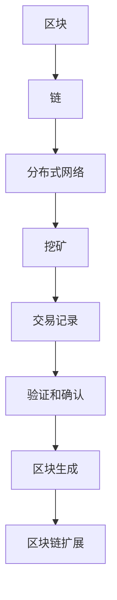
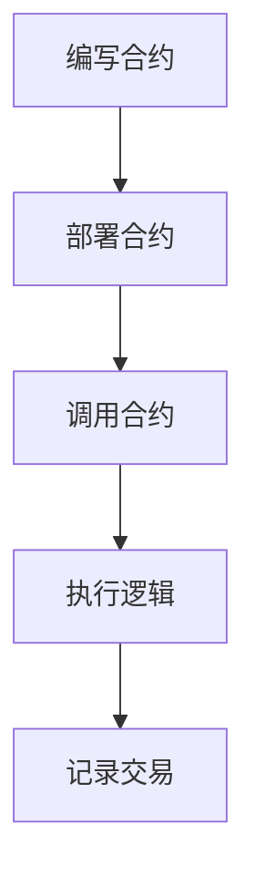
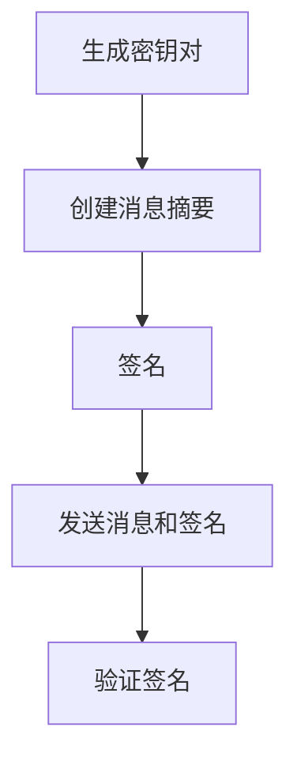
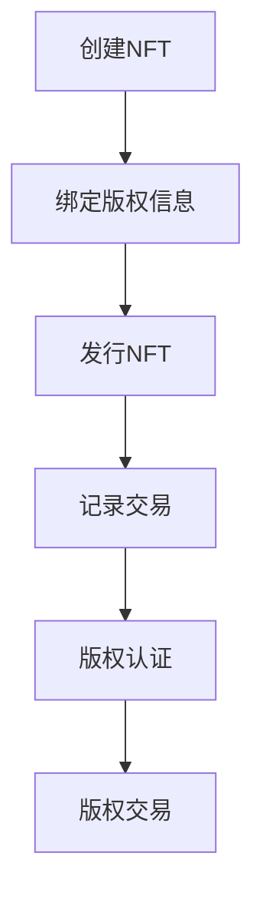

                 

## 引言

### 书籍背景与目标

《区块链在数字内容版权追踪中的应用》是一本旨在探讨区块链技术在数字内容版权追踪中应用的专著。随着互联网和信息技术的飞速发展，数字内容创作和分发已成为文化传播的重要方式。然而，数字内容的版权追踪和保护成为了一个严峻的挑战。传统的版权追踪机制存在着效率低下、成本高昂、安全性不足等问题，无法满足日益增长的数字内容版权保护需求。

本书的目标是详细介绍区块链技术在数字内容版权追踪中的应用，通过深入剖析区块链的核心技术原理，展示其在数字版权保护中的优势和应用场景。通过本书的学习，读者可以全面了解区块链在数字内容版权追踪中的重要作用，掌握相关技术原理和实践方法，为数字版权保护提供新的思路和解决方案。

### 区块链与数字内容版权的关联

区块链是一种去中心化的分布式数据库技术，具有不可篡改、透明性和可追溯性等特点。这些特性使得区块链在数字内容版权追踪中具有独特的优势。具体来说，区块链与数字内容版权之间的关联主要体现在以下几个方面：

1. **去中心化存储**：区块链通过分布式网络存储数据，确保版权信息不会被任何单一节点控制，从而防止了数据的篡改和删除。

2. **不可篡改性**：区块链上的数据一旦被记录，将无法被篡改。这为数字内容的版权信息提供了强有力的保障，防止了版权侵权行为的发生。

3. **透明性和可追溯性**：区块链上的数据是公开透明的，任何参与者都可以查看和验证。这有助于建立数字内容版权的透明体系，方便各方追溯版权的流转过程。

4. **智能合约**：区块链上的智能合约可以自动执行预定义的合同条款，确保版权交易的高效和安全。

5. **非同质化代币（NFT）**：NFT作为一种基于区块链的数字资产，可以用来代表数字内容的唯一所有权，从而实现对数字内容的精准追踪和保护。

通过以上分析，我们可以看到，区块链技术在数字内容版权追踪中具有巨大的潜力和应用价值。本书将围绕这些技术原理和实际应用，展开深入探讨，旨在为读者提供一本全面、系统的区块链版权追踪指南。

### 阅读指南

为了更好地理解本书内容，我们为读者提供以下阅读指南：

1. **基础概念**：本书首先介绍区块链的基础概念，包括区块链的组成、工作原理等，帮助读者建立对区块链技术的初步认识。

2. **核心技术原理**：接着，本书详细讲解区块链在数字内容版权追踪中的核心技术原理，如智能合约、数字签名、非同质化代币（NFT）等，并使用Python源代码进行说明。

3. **应用案例**：本书将通过多个实际应用案例，展示区块链技术在数字内容版权追踪中的具体应用，包括音乐、电影等领域的案例。

4. **未来发展**：最后，本书将探讨区块链在数字内容版权追踪中的未来发展趋势，分析面临的挑战和机遇。

通过以上结构化的阅读，读者可以逐步掌握区块链在数字内容版权追踪中的知识体系，为实际应用提供理论基础和实践指导。希望本书能成为您在区块链版权追踪领域的良师益友。

## 摘要

本书《区块链在数字内容版权追踪中的应用》旨在深入探讨区块链技术在数字内容版权追踪中的应用，通过剖析区块链的核心技术原理，如去中心化存储、不可篡改性、透明性和智能合约等，展示其在数字内容版权保护中的独特优势。书中首先介绍了区块链的基础概念和组成部分，随后详细讲解了智能合约、数字签名和非同质化代币（NFT）等关键技术，并使用Python源代码和数学模型进行深入阐述。通过多个实际应用案例，包括音乐和电影版权追踪，读者可以直观地了解区块链技术在版权保护中的具体应用。最后，本书探讨了区块链在数字内容版权追踪领域的未来发展，分析了当前面临的挑战和机遇。本书旨在为读者提供一本全面、系统的区块链版权追踪指南，助力数字内容创作者和版权持有者实现高效、安全的版权保护。

## 区块链基础

区块链是一种分布式账本技术，通过分布式网络维护一个不断增长的数据库记录，这些记录被称为“区块”，并以时间顺序相连形成“链条”。每个区块包含一系列交易记录，一旦记录被添加到区块链中，就几乎不可篡改。以下是区块链的基础组成部分及其工作原理的详细解释。

### 区块链的组成

1. **区块**：区块是区块链的基本组成单元，包含一定数量的交易记录。每个区块有一个唯一的标识符（哈希值），用于确保区块的完整性和唯一性。

2. **链**：区块链是由一系列按时间顺序排列的区块组成的链条。每个区块都包含一个指向前一个区块的哈希值，形成一个链接关系。

3. **分布式网络**：区块链通过分布式网络维护其数据库，网络中的每个节点都保存了一份完整的区块链副本。分布式网络使得区块链具有去中心化的特性，即没有单一节点可以控制或篡改整个系统。

4. **挖矿**：为了确保新区块的生成和区块链的安全，区块链采用了一种共识机制，如工作量证明（PoW）或权益证明（PoS）。在PoW机制中，节点需要通过解决复杂的数学问题（如比特币的SHA-256哈希运算）来竞争生成新区块，这个过程被称为“挖矿”。

### 工作原理

1. **交易记录**：区块链上的交易记录是区块链的核心内容。交易记录包含发送方、接收方、金额和附加信息等。每个交易记录都需要经过验证和确认，才能被添加到区块链中。

2. **验证和确认**：在区块链网络中，交易记录必须经过多个节点的验证和确认。节点通过共识机制对交易进行验证，确保交易的有效性和合法性。

3. **区块生成**：当一个区块满载交易记录时，节点开始竞争生成新区块。通过挖矿过程，一个节点将成功生成新区块并将其广播到网络中，其他节点会验证新区块的有效性。

4. **区块链扩展**：新区块生成后，会被添加到区块链的末尾，从而延长区块链的链条。每次新区块生成，区块链的总长度都会增加。

### Mermaid流程图：区块链核心概念联系

以下是一个简化的Mermaid流程图，展示了区块链的核心概念和它们之间的关系：



### 核心算法原理讲解

区块链的核心算法包括哈希函数、工作量证明（PoW）和共识机制。以下使用Python代码和LaTeX公式进行详细讲解。

#### 哈希函数

哈希函数是区块链中的一个关键组件，用于生成数据摘要。以下是一个简单的Python代码示例，用于计算字符串的SHA-256哈希值：

```python
import hashlib

def calculate_hash(data):
    hash_object = hashlib.sha256(data.encode())
    hex_dig = hash_object.hexdigest()
    return hex_dig

data = "Hello, World!"
hash_value = calculate_hash(data)
print(f"SHA-256 Hash of '{data}': {hash_value}")
```

LaTeX公式表示：

$$
H = SHA-256(data)
$$

#### 工作量证明（PoW）

工作量证明（PoW）是区块链的一种共识机制，用于确保新区块的生成和区块链的安全。以下是PoW的基本原理：

1. **问题生成**：系统生成一个数学难题，需要通过计算找到满足特定条件的解。
2. **解决难题**：节点通过尝试不同的解决方案来求解难题。这个过程需要大量的计算资源。
3. **验证解**：一旦找到解，节点将解决方案广播到网络中，其他节点验证解的有效性。
4. **奖励**：验证成功的节点获得生成新区块的奖励。

Python代码示例：

```python
import hashlib
import time

def proof_of_work(last_proof, difficulty):
    nonce = 0
    while not valid_proof(last_proof, nonce, difficulty):
        nonce += 1
    return nonce

def valid_proof(last_proof, nonce, difficulty):
    hash = hashlib.sha256(f"{last_proof}{nonce}".encode()).hexdigest()
    return hash[:difficulty] == "0" * difficulty

last_proof = 100
difficulty = 4
proof = proof_of_work(last_proof, difficulty)
print(f"Proof: {proof}")
```

LaTeX公式表示：

$$
PoW: f_{PoW}(last\_proof, nonce) = H(f_{PoW}(last\_proof) + nonce)
$$

#### 共识机制

共识机制是区块链中多个节点如何达成一致的方法。常见的共识机制包括工作量证明（PoW）、权益证明（PoS）、委托权益证明（DPoS）等。

PoW机制如前文所述。PoS机制基于节点持有的代币数量来决定其参与共识的概率。节点持有代币越多，其参与共识的概率越大。

Python代码示例：

```python
def proof_of_stake(stake, total_stake):
    return stake / total_stake

total_stake = 1000
stakes = [100, 300, 500, 100]
probs = [proof_of_stake(stake, total_stake) for stake in stakes]
print(f"Probability Distribution: {probs}")
```

LaTeX公式表示：

$$
PoS: P_{node} = \frac{S_{node}}{S_{total}}
$$

### 总结

区块链通过其独特的去中心化、不可篡改和透明性等特性，为数字内容版权追踪提供了强有力的支持。通过哈希函数、工作量证明和共识机制等核心算法，区块链确保了数据的安全性和一致性。在接下来的章节中，我们将进一步探讨智能合约、数字签名和NFT等关键技术，以深入了解区块链在数字内容版权追踪中的应用。

## 智能合约

智能合约是一种运行在区块链上的自动化协议，通过代码形式定义了参与方之间的合同条款和执行逻辑。智能合约的核心优势在于其自动执行性和透明性，这使得它们在数字内容版权追踪中具有广泛的应用潜力。以下是智能合约的基本概念、工作原理以及其在数字版权追踪中的应用。

### 智能合约概述

智能合约最早由密码学家尼克·萨博（Nick Szabo）提出，他将其描述为“一种以数字形式定义的承诺，触发或控制参与方的交换行为”。智能合约的核心理念在于将合同条款代码化，并将其运行在区块链上，确保合同的自动执行和不可篡改性。

智能合约的基本组成包括：

1. **条款**：定义合同各方的权利和义务。
2. **触发器**：当某个条件满足时，触发合同的执行。
3. **执行逻辑**：合同条款的具体执行过程，通常使用编程语言编写。

### 工作原理

智能合约的工作原理可以分为以下几个步骤：

1. **编写合约**：开发者使用特定的编程语言（如Solidity）编写智能合约的代码，并将其部署到区块链上。

2. **部署合约**：智能合约的代码被上传到区块链网络，并通过共识机制进行验证和存储。部署完成后，智能合约即处于活动状态。

3. **调用合约**：合约的参与方通过区块链网络调用智能合约的函数，以执行合同条款。这些调用可以是自动触发的，也可以是手动触发的。

4. **执行逻辑**：智能合约执行其预定义的逻辑，根据触发器和条款自动执行相应的操作，如转账、解锁资源等。

5. **记录交易**：执行结果被记录在区块链上，确保其透明性和不可篡改性。

### Mermaid流程图：智能合约工作流程

以下是一个简化的Mermaid流程图，展示了智能合约的基本工作流程：



### 区块链在数字内容版权追踪中的优势

智能合约在数字内容版权追踪中的优势主要体现在以下几个方面：

1. **自动执行**：智能合约可以自动执行合同条款，无需人工干预。这大大提高了版权交易和授权的效率。

2. **透明性**：智能合约的执行过程记录在区块链上，任何参与方都可以查看和验证，确保交易的透明性和公正性。

3. **不可篡改性**：一旦智能合约被部署到区块链上，其代码和执行结果将无法被篡改，这为数字内容版权的长期保护提供了可靠保障。

4. **去中心化**：智能合约运行在去中心化的区块链上，没有单一节点可以控制，这使得版权追踪和管理更加安全可靠。

### 实际应用案例

智能合约在数字内容版权追踪中的应用案例非常广泛。以下是一个简单的应用案例：

**案例：音乐版权追踪**

假设一个音乐创作者与多个平台有版权合作，每个平台都有不同的版权授权条款。使用智能合约，可以自动执行以下操作：

1. **版权注册**：音乐创作者将版权信息（如歌曲名称、创作者信息等）上传到区块链，并通过智能合约进行注册和验证。

2. **授权管理**：每个平台与创作者签订授权合同，智能合约根据授权条款自动发放权限。例如，一个平台可以智能合约授权播放某首歌曲30天。

3. **版权收费**：在授权期限内，平台每次播放音乐时，智能合约会自动扣除相应的版权费用并转入创作者的账户。

4. **违约处理**：若平台违反授权条款，智能合约可以自动执行违约处罚，如暂停授权或扣除违约金。

### Python代码示例：版权注册与授权

以下是一个简化的Python代码示例，展示如何使用智能合约注册版权信息和管理授权：

```solidity
// SPDX-License-Identifier: MIT
pragma solidity ^0.8.0;

contract CopyrightTracking {
    struct License {
        address licensee;
        string songTitle;
        uint256 expirationDate;
        bool isLicensed;
    }

    mapping(string => License[]) public licenses;

    function registerCopyright(string memory title) public {
        licenses[title].push(License(msg.sender, title, block.timestamp + 365 days, true));
    }

    function grantLicense(string memory title, address licensee, uint256 expirationDate) public {
        for (uint256 i = 0; i < licenses[title].length; i++) {
            if (licenses[title][i].isLicensed) {
                licenses[title][i].licensee = licensee;
                licenses[title][i].expirationDate = expirationDate;
                licenses[title][i].isLicensed = true;
                break;
            }
        }
    }

    function checkLicense(string memory title, address licensee) public view returns (bool) {
        for (uint256 i = 0; i < licenses[title].length; i++) {
            if (licenses[title][i].licensee == licensee && licenses[title][i].isLicensed && licenses[title][i].expirationDate > block.timestamp) {
                return true;
            }
        }
        return false;
    }
}
```

### 总结

智能合约通过其自动执行、透明性和不可篡改性，为数字内容版权追踪提供了强大的技术支持。通过实际应用案例，我们可以看到智能合约如何简化版权管理流程，提高效率，确保透明和公正。在接下来的章节中，我们将继续探讨数字签名和NFT等技术，进一步深入探讨区块链在数字内容版权追踪中的应用。

## 数字签名

数字签名是一种加密技术，用于验证信息的完整性和验证发送者的身份。在区块链技术中，数字签名发挥着重要作用，尤其是在数字内容版权追踪中，确保版权信息的真实性和不可篡改性。以下是数字签名的概述、工作原理和其在区块链中的应用。

### 数字签名概述

数字签名类似于传统的物理签名，但它是通过加密算法生成的，具有更强的安全性和可靠性。数字签名的主要功能包括：

1. **验证身份**：数字签名可以验证消息的发送者身份，确保消息确实来自指定的发送者。
2. **保证完整性**：数字签名可以验证消息在传输过程中未被篡改，确保消息的完整性。
3. **防止否认**：数字签名使得发送者无法否认发送了该消息，因为数字签名与发送者的私钥相关联。

### 工作原理

数字签名的工作原理可以分为以下几个步骤：

1. **生成密钥对**：数字签名使用一对密钥，即公钥和私钥。私钥是保密的，由用户自己保管；公钥是公开的，可以自由分发。

2. **创建消息摘要**：在发送消息之前，使用哈希函数生成消息摘要，即将消息转换为一个固定长度的数字摘要。

3. **签名**：发送者使用自己的私钥对消息摘要进行加密，生成数字签名。签名过程涉及复杂的数学运算，确保签名与私钥相关联。

4. **发送消息和签名**：发送者将原始消息和数字签名一起发送给接收者。

5. **验证签名**：接收者使用发送者的公钥对数字签名进行解密，并生成消息摘要。然后，接收者将接收到的消息摘要与发送者提供的消息摘要进行对比，以验证消息的完整性和发送者身份。

### Mermaid流程图：数字签名流程

以下是一个简化的Mermaid流程图，展示了数字签名的基本流程：



### 数字签名算法

数字签名算法有多种，其中最常用的包括RSA和ECDSA。以下是ECDSA算法的Python代码示例：

```python
from cryptography.hazmat.backends import default_backend
from cryptography.hazmat.primitives.asymmetric import ec
from cryptography.hazmat.primitives import hashes
from cryptography.hazmat.primitives.asymmetric import padding

def generate_ecdsa_key():
    private_key = ec.generate_private_key(
        ec.SECP256R1(),
        default_backend()
    )
    public_key = private_key.public_key()
    return private_key, public_key

def sign_message(private_key, message):
    signer = private_key.signer(
        padding.PSS(
            mgf=padding.MGF1(hashes.SHA256()),
            salt_length=padding.PSS.MAX_LENGTH
        ),
        hashes.SHA256()
    )
    signer.update(message)
    signature = signer.finalize()
    return signature

def verify_signature(public_key, message, signature):
    verifier = public_key.verifier(
        signature,
        padding.PSS(
            mgf=padding.MGF1(hashes.SHA256()),
            salt_length=padding.PSS.MAX_LENGTH
        ),
        hashes.SHA256()
    )
    verifier.update(message)
    try:
        verifier.finalize()
        return True
    except ValueError:
        return False

# 使用示例
private_key, public_key = generate_ecdsa_key()
message = b"Hello, World!"
signature = sign_message(private_key, message)
is_valid = verify_signature(public_key, message, signature)
print(f"Signature is valid: {is_valid}")
```

### 数学模型和公式

数字签名算法涉及到复杂的数学运算，主要包括椭圆曲线加密和离散对数问题。以下是相关的数学模型和公式：

$$
E: y^2 = x^3 + ax + b \quad (a, b \text{为常数})
$$

- **椭圆曲线**：定义了椭圆曲线上的点集。
- **基点**：椭圆曲线上一个特定点G，用于生成椭圆曲线加密算法。
- **私钥**：一个随机整数\(k\)。
- **公钥**：\(P = kG\)，即椭圆曲线上的点。
- **签名**：\((r, s)\)，其中\(r = x(P)\)，\(s = \frac{k^{-1}(m + xr)}{2}\)。

### 案例说明

假设有一个用户想要对一段文本进行数字签名，过程如下：

1. **生成密钥对**：用户生成一个私钥\(d\)和对应的公钥\(Q\)。
2. **创建消息摘要**：用户对要签名的文本使用SHA-256生成一个摘要\(h(m)\)。
3. **签名**：用户随机选择一个整数\(k\)，计算\(r = x(Q)\)，\(s = \frac{k^{-1}(h(m) + rd)}{2}\)。将\(r\)和\(s\)作为签名。
4. **验证签名**：接收者使用用户的公钥验证签名，验证\(s \times Q\)是否等于\(r \times G + h(m) \times R\)。

通过上述步骤，我们可以确保消息的真实性和完整性，同时防止伪造和否认。

### 总结

数字签名在区块链技术中扮演着至关重要的角色，通过其强大的安全性和不可篡改性，为数字内容版权追踪提供了可靠保障。通过实际案例和Python代码示例，我们深入了解了数字签名的原理和实现方法。在接下来的章节中，我们将继续探讨非同质化代币（NFT）及其在数字内容版权追踪中的应用。

## 非同质化代币（NFT）

非同质化代币（Non-Fungible Tokens，简称NFT）是一种基于区块链技术的数字资产，用于代表独特和不可分割的物品。与同质化代币（如比特币和以太币）不同，NFT具有独特的标识符，可以代表艺术品、收藏品、游戏物品、数字内容等。NFT在数字内容版权追踪中具有显著的应用价值，能够为创作者提供强有力的版权保护和价值验证。

### NFT概述

NFT的核心特点是其独特性和不可替代性。每个NFT都是独一无二的，具有唯一的标识符和所有权记录。以下是NFT的关键组成部分：

1. **数字内容**：NFT所代表的数字内容可以是图片、音频、视频、文档等，这些内容本身可以是复制的，但NFT确保每个副本具有不同的所有权记录。
2. **区块链**：NFT通常基于以太坊区块链或其他支持ERC-721或ERC-1155标准的区块链平台。
3. **智能合约**：NFT的发行和交易通常通过智能合约进行管理，智能合约包含NFT的创建、转移、权限管理等功能。

### NFT在版权追踪中的应用

NFT在数字内容版权追踪中具有以下应用：

1. **版权确权**：创作者可以将数字内容的版权信息编码到NFT中，通过NFT的不可篡改性，确保版权的原始性和真实性。
2. **版权认证**：每次NFT转移时，都会在区块链上记录新的所有权信息，这为版权的认证提供了透明和可靠的记录。
3. **版权交易**：NFT使得版权交易更加便捷和高效，买家可以通过购买NFT获得数字内容的版权，交易过程记录在区块链上，不可篡改。
4. **版权保护**：NFT的不可篡改性确保了数字内容版权的长期保护，防止侵权行为的发生。

### Mermaid流程图：NFT版权追踪流程

以下是一个简化的Mermaid流程图，展示了NFT在数字内容版权追踪中的基本流程：



### 案例分析：数字艺术品版权追踪

以下是一个实际案例，展示如何使用NFT进行数字艺术品版权追踪：

**案例背景**：一个数字艺术家创作了一幅数字画作，并将其转换为NFT，希望通过区块链技术进行版权保护和交易。

**步骤1：创建NFT**：艺术家使用NFT生成工具创建NFT，并将其与画作版权信息绑定，如创作者姓名、创作时间、版权声明等。

**步骤2：绑定版权信息**：艺术家将NFT上传到区块链平台，通过智能合约将版权信息嵌入到NFT中，确保信息不可篡改。

**步骤3：发行NFT**：艺术家将NFT放入市场进行销售，买家通过购买NFT获得画作的所有权。

**步骤4：记录交易**：每次NFT交易都会在区块链上记录，形成一条透明和不可篡改的交易记录。

**步骤5：版权认证**：当需要认证版权时，任何人都可以查看NFT交易记录，验证版权信息的真实性和合法性。

**步骤6：版权交易**：如果艺术家希望将NFT再次出售，可以将其重新放入市场，买家通过购买NFT获得画作的所有权。

### Python代码示例：NFT创建和交易

以下是一个简化的Python代码示例，展示如何创建和交易NFT：

```solidity
// SPDX-License-Identifier: MIT
pragma solidity ^0.8.0;

contract NFTMarketplace {
    mapping(uint256 => address) public nftOwners;
    mapping(uint256 => string) public nftInfo;

    function createNFT(uint256 tokenId, string memory info) public {
        nftOwners[tokenId] = msg.sender;
        nftInfo[tokenId] = info;
    }

    function buyNFT(uint256 tokenId) public payable {
        require(nftOwners[tokenId] != msg.sender, "NFT already owned");
        require(msg.value >= 0.01 ether, "Insufficient payment");
        address seller = nftOwners[tokenId];
        nftOwners[tokenId] = msg.sender;
        payable(seller).transfer(msg.value);
    }

    function getNFTInfo(uint256 tokenId) public view returns (string memory) {
        return nftInfo[tokenId];
    }
}
```

### 总结

NFT通过其独特的不可替代性和区块链的不可篡改性，为数字内容版权追踪提供了强大的工具。在实际应用中，NFT能够简化版权确权、认证和交易流程，提高版权保护的效率和透明度。通过上述案例和代码示例，我们可以看到NFT在数字内容版权追踪中的重要性和实际应用价值。在接下来的章节中，我们将进一步探讨区块链在数字内容版权追踪中的实际应用案例。

## 区块链在数字内容版权追踪中的实际应用案例

在数字内容创作和分发日益繁荣的今天，区块链技术为数字内容版权追踪提供了全新的解决方案。以下将介绍区块链技术在音乐和电影版权追踪中的实际应用，并通过具体案例分析其效果和挑战。

### 音乐版权追踪

**案例背景**：音乐行业是一个高度依赖版权保护和授权的行业。然而，传统的版权追踪机制存在效率低下、成本高昂和安全性不足等问题，使得音乐创作者面临巨大的版权侵权风险。

**应用方案**：区块链技术为音乐版权追踪提供了透明、安全和高效的解决方案。以下是区块链在音乐版权追踪中的具体应用步骤：

1. **版权注册**：音乐创作者将作品信息（如歌曲名称、创作者、版权声明等）上传到区块链平台，并通过智能合约进行注册和验证。这一步骤确保了版权信息的不可篡改和永久保存。

2. **版权认证**：每次版权信息发生变化（如转让、授权等）时，都会在区块链上记录相应的交易记录。任何参与方都可以通过区块链查询版权信息的完整历史，确保版权的透明性和公正性。

3. **版权交易**：音乐创作者或版权持有者可以通过区块链平台进行版权交易，买家可以直接购买NFT形式的版权，交易过程透明且高效。此外，智能合约可以自动执行版权费用的支付和转移，简化了交易流程。

**案例分析**：以区块链平台Museum of Digital Art（MoDA）为例，该平台允许艺术家将数字艺术作品转换为NFT，并通过区块链进行版权追踪和保护。艺术家通过MoDA平台发行NFT后，可以在全球范围内快速且安全地进行版权交易。这不仅提高了版权保护效率，还为艺术家创造了额外的收入来源。

### 电影版权追踪

**案例背景**：电影行业涉及多个版权方，包括制片人、导演、编剧、演员等，版权追踪和管理过程复杂且繁琐。传统版权追踪机制的不足使得电影版权侵权问题频发。

**应用方案**：区块链技术在电影版权追踪中的应用主要包括以下几个方面：

1. **版权注册**：电影制作方将电影的相关版权信息（如电影名称、剧本、拍摄地点、参与人员等）上传到区块链平台，确保版权信息的真实性和不可篡改性。

2. **版权认证**：区块链平台可以记录电影版权的授权、转让和使用情况，任何参与方都可以查看和验证这些信息。这为电影的合法分发和授权提供了可靠的保障。

3. **版权交易**：电影版权方可以通过区块链平台进行版权交易，确保交易过程透明、高效和安全。智能合约可以自动执行交易条款，简化版权授权和管理流程。

**案例分析**：LIVE.FM是一个利用区块链技术的音乐版权追踪平台，该平台不仅为音乐创作者提供版权注册和认证服务，还支持音乐版权的交易。通过LIVE.FM，创作者可以轻松追踪其作品的版权信息，同时买家可以安全地购买和授权音乐版权。

### 项目小结

通过上述案例分析，我们可以看到区块链技术在数字内容版权追踪中的应用具有显著的效果：

1. **透明性和安全性**：区块链的不可篡改性和透明性为版权信息提供了强有力的保障，防止了版权侵权行为的发生。
2. **高效性和低成本**：智能合约和NFT的应用简化了版权交易和授权流程，提高了效率和降低了成本。
3. **全球性**：区块链技术使得版权信息在全球范围内可查询和验证，为国际版权合作提供了便利。

然而，区块链在数字内容版权追踪中也面临一些挑战：

1. **技术门槛**：区块链技术的应用需要一定的技术基础，对非专业人士来说可能存在一定的学习成本。
2. **法律和监管**：各国对于区块链技术在版权追踪中的应用还存在法律和监管的不确定性，需要进一步明确相关法规和政策。
3. **隐私保护**：尽管区块链技术提供了强大的安全保障，但在版权信息查询和验证过程中，如何平衡隐私保护与透明性也是一个重要问题。

总之，区块链技术在数字内容版权追踪中展示了巨大的潜力，通过不断的技术创新和法律完善，有望为数字版权保护提供更加完善和可靠的解决方案。

### 总结与展望

区块链技术在数字内容版权追踪中的应用不仅提高了版权保护的透明性和安全性，还简化了版权管理和交易流程，为创作者和版权持有者带来了新的机遇。通过音乐和电影版权追踪的实际案例，我们可以看到区块链技术的广泛应用和显著效果。未来，随着区块链技术的进一步发展和成熟，预计将在更多数字内容领域（如文学、设计等）得到广泛应用。

然而，区块链在数字版权追踪中也面临一些挑战，如技术门槛、法律和监管不确定性以及隐私保护等问题。因此，未来需要进一步加强技术创新和法规建设，推动区块链技术在数字版权追踪领域的全面应用，为数字内容的创作者和版权持有者提供更加可靠和高效的保护解决方案。

### 附录

在本附录中，我们将提供一些关于区块链开发工具、实际项目案例以及相关资源和最佳实践，以帮助读者更好地理解和应用区块链技术在数字内容版权追踪中的知识。

#### 1. 开发工具与资源

**1.1 区块链开发框架**

- **Truffle**：Truffle是一个用于以太坊区块链的智能合约开发框架，提供了一套完整的开发、测试和部署工具。
- **Ganache**：Ganache是一个本地以太坊节点，用于开发和测试智能合约。它允许开发者创建自定义的区块链网络，方便进行测试。
- **Hardhat**：Hardhat是一个新型的以太坊开发框架，提供了一套强大的工具，包括本地节点、测试框架和交互工具。

**1.2 区块链浏览器**

- **Etherscan**：Etherscan是一个以太坊区块链的浏览器，提供详细的交易记录、智能合约源码和区块链数据分析。
- **Blockchair**：Blockchair支持多个区块链网络，如比特币、以太坊等，提供全面的区块链数据查询和监控。

**1.3 开发工具库**

- **Web3.js**：Web3.js是一个JavaScript库，用于与以太坊区块链交互，支持智能合约调用、交易发送等操作。
- **ethers.js**：ethers.js是一个现代的以太坊JavaScript库，提供了一套简单、高效的API，支持各种区块链操作。

#### 2. 实际项目案例

**2.1 数字艺术品版权追踪项目**

- **Museum of Digital Art (MoDA)**：MoDA是一个基于区块链的数字艺术品平台，允许艺术家将数字艺术品转换为NFT，进行版权追踪和保护。
- **Foundation**：Foundation是一个基于以太坊的数字艺术品市场，提供NFT的创建、购买和版权追踪服务。

**2.2 音乐版权追踪项目**

- **LIVE.FM**：LIVE.FM是一个音乐版权追踪平台，支持音乐创作者和版权持有者进行版权注册、认证和交易。
- **Soundcoin**：Soundcoin是一个基于区块链的音乐平台，提供音乐版权追踪和支付解决方案。

#### 3. 相关资源与最佳实践

**3.1 学习资源**

- **《区块链技术指南》**：本书提供全面、系统的区块链基础知识，适合初学者和进阶者阅读。
- **《智能合约设计与开发》**：本书详细介绍了智能合约的设计原则和开发方法，是智能合约开发者必备的参考书。

**3.2 最佳实践**

- **代码审查与测试**：在部署智能合约前，进行充分的代码审查和测试，确保合约的安全性和正确性。
- **数据备份与恢复**：定期备份区块链数据，确保数据的安全性和可恢复性。
- **用户权限管理**：合理设置用户权限，防止未经授权的访问和操作。

**3.3 注意事项**

- **隐私保护**：在区块链应用中，要注意保护用户的隐私信息，避免泄露敏感数据。
- **法律合规**：遵循相关法律法规，确保区块链应用在合法合规的范围内运行。

**3.4 拓展阅读**

- **《区块链技术简明教程》**：本书以通俗易懂的语言介绍区块链技术的基本原理和应用场景。
- **《区块链：从原理到实践》**：本书详细介绍了区块链技术的原理、应用和实践，适合有一定技术基础的读者。

通过本附录，读者可以进一步了解区块链开发工具、实际项目案例和相关资源，为在数字内容版权追踪中的实践提供有力支持。希望这些内容能够帮助读者更好地掌握区块链技术，并在实际应用中取得成功。

