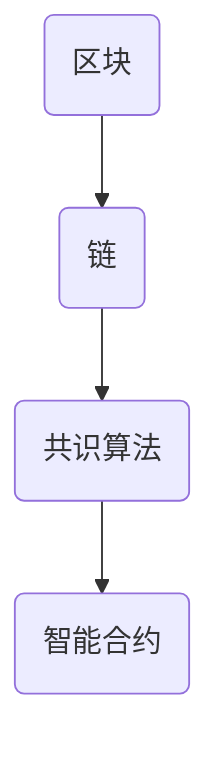
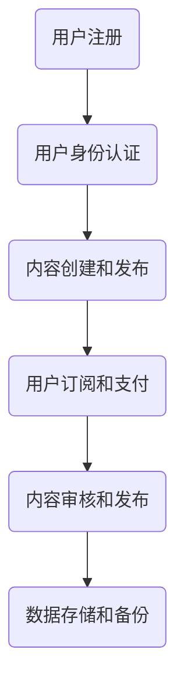
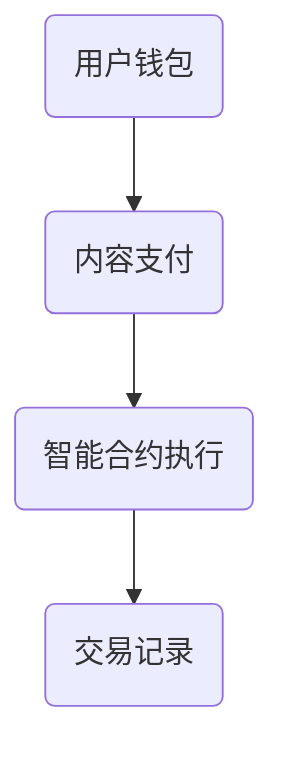

                 

### 《区块链在数字内容订阅中的微支付应用》

#### 关键词
- 区块链
- 微支付
- 数字内容订阅
- 智能合约
- 共识算法
- 隐私保护

#### 摘要
本文深入探讨了区块链技术在数字内容订阅领域中的微支付应用。通过对区块链的基本概念和微支付的需求背景进行分析，本文阐述了区块链在数字内容订阅中的潜在应用场景及其优势。随后，文章详细讨论了区块链与微支付结合的核心架构、关键算法以及实现方式，并通过实际案例展示了区块链在数字内容订阅中的成功应用。此外，本文还探讨了区块链在数字内容订阅中的法律与伦理问题，并对未来发展趋势进行了展望。通过全面的分析和讲解，本文旨在为区块链在数字内容订阅领域的应用提供有力的理论支持和实践指导。

### 第1章 绪论

#### 1.1 区块链技术概述

区块链技术是一种分布式数据库技术，它通过密码学算法确保数据的不可篡改性和安全性。区块链的基本概念可以追溯到2008年，由一个化名为中本聪（Satoshi Nakamoto）的人首次提出，其目标是构建一种去中心化的电子现金系统——比特币（Bitcoin）。自比特币诞生以来，区块链技术迅速发展，并逐渐应用于金融、供应链、医疗等多个领域。

##### 区块链的定义与发展历程

区块链是一种去中心化的数据结构，它由一系列按时间顺序排列的“区块”组成。每个区块都包含了若干交易记录，并通过密码学算法与前一区块相连，形成一个链条。这种链条结构确保了数据的完整性和不可篡改性。区块链的发展历程可以分为几个阶段：

1. **比特币**：区块链技术的诞生，以比特币为代表，首次实现了去中心化的电子货币系统。
2. **以太坊**：以太坊（Ethereum）的推出，将区块链技术从单一货币应用扩展到支持智能合约和去中心化应用（DApp）。
3. **其他公链**：如EOS、TRON等，进一步推动了区块链技术的多样化应用。
4. **联盟链**：在公链基础上，联盟链（如R3 Corda、Hyperledger Fabric）旨在提高交易性能和隐私性，适应企业级应用。

##### 区块链的核心特点与技术原理

区块链技术具有以下核心特点：

1. **去中心化**：区块链通过分布式网络维护数据，无需依赖中心机构，降低了交易成本，提高了系统的容错性和抗攻击能力。
2. **不可篡改性**：区块链上的数据一旦被记录，便无法被篡改，保证了数据的真实性和可靠性。
3. **安全性**：区块链采用密码学算法，如哈希函数、数字签名等，确保数据传输和存储的安全性。
4. **透明性**：区块链上的数据对全网节点都是透明的，用户可以随时查看和验证交易信息。

区块链的核心技术包括：

1. **区块**：区块是区块链的基本组成单位，包含了交易记录、时间戳、区块头等数据。
2. **链**：链是由多个区块按时间顺序链接而成的数据结构。
3. **共识算法**：共识算法是区块链网络中的节点达成一致性的机制，如工作量证明（PoW）、权益证明（PoS）等。
4. **智能合约**：智能合约是一种自执行的合约，它基于预定义的条件和规则自动执行合约条款，无需中介参与。

##### 区块链与其他技术的区别与联系

区块链与其他技术如数据库、分布式存储、加密技术等有明显的区别与联系：

1. **与数据库的区别**：
   - **数据库**：是一种中心化的数据存储和管理系统，由中央数据库管理。
   - **区块链**：是一种分布式数据库，数据分散存储在全网节点上，无需中心化管理。

2. **与分布式存储的区别**：
   - **分布式存储**：主要用于数据存储，实现数据冗余和容错。
   - **区块链**：不仅提供数据存储功能，还通过共识算法确保数据的完整性和安全性。

3. **与加密技术的联系**：
   - **加密技术**：是区块链技术的重要组成部分，用于数据加密、数字签名等。
   - **区块链**：通过加密技术确保数据传输和存储的安全性，防止篡改和伪造。

##### 1.2 数字内容订阅市场现状与问题

随着互联网技术的飞速发展，数字内容订阅已经成为人们获取信息和服务的重要方式。数字内容订阅市场具有以下特点：

1. **用户需求多样化**：用户对内容的需求越来越多样化，包括新闻、娱乐、教育等多个领域。
2. **市场潜力巨大**：根据市场调研数据，全球数字内容订阅市场持续增长，预计未来市场规模将进一步扩大。
3. **商业模式多样**：数字内容订阅的商业模式多样，包括订阅制、付费墙、广告支持等。

然而，当前数字内容订阅市场也面临一些问题：

1. **用户支付门槛高**：高昂的订阅费用和复杂的支付流程让部分用户望而却步。
2. **版权保护不足**：数字内容的版权保护问题突出，侵权行为频繁发生，影响了内容创作者的权益。
3. **用户体验不佳**：订阅服务的个性化推荐、内容更新速度、用户界面等方面仍有改进空间。

##### 1.3 微支付概念与价值

微支付是指金额较小的支付行为，通常涉及小额交易。微支付在数字内容订阅中的应用具有重要意义：

1. **降低用户支付门槛**：微支付允许用户以极低的成本进行支付，从而降低订阅门槛，吸引更多用户。
2. **提高用户参与度**：通过微支付，用户可以更加灵活地选择和消费内容，提高参与度。
3. **减少版权纠纷**：微支付有助于确保内容创作者获得合理的报酬，减少版权纠纷。

### 第2章 区块链与数字内容订阅的关系

#### 2.1 区块链技术在数字内容订阅中的应用

区块链技术为数字内容订阅提供了多种潜在应用场景，包括但不限于以下几个方面：

1. **版权保护**：区块链技术可以确保数字内容的所有权和使用权得到明确记录和保障，防止侵权行为发生。
2. **支付与结算**：区块链技术提供了一种去中心化的支付解决方案，可以实现即时、安全、低成本的小额支付。
3. **透明与可信**：区块链技术确保订阅过程和交易数据的透明性，增强用户对平台的信任。
4. **智能合约应用**：智能合约可以实现订阅合同的自动执行，减少人工干预和纠纷。

##### 区块链在数字内容订阅中的优势与挑战

区块链在数字内容订阅中的优势主要体现在以下几个方面：

1. **去中心化**：去中心化的特性降低了平台的运营成本，提高了系统的容错性和抗攻击能力。
2. **不可篡改性**：区块链上的数据一旦被记录，就无法被篡改，确保了交易数据的真实性和可靠性。
3. **安全性**：区块链采用加密技术，确保数据传输和存储的安全性，防止信息泄露和欺诈行为。
4. **透明性**：区块链上的数据对所有用户都是透明的，用户可以随时查看和验证交易信息。

然而，区块链在数字内容订阅中也面临一些挑战：

1. **性能瓶颈**：区块链系统的性能相对于传统的中心化系统较低，可能无法满足大规模、高并发交易的需求。
2. **隐私保护**：区块链的透明性可能暴露用户的隐私信息，需要采用隐私保护技术进行改进。
3. **法律监管**：区块链技术的应用需要符合相关法律法规，尤其是在数字版权保护、支付结算等方面。
4. **用户接受度**：区块链技术对于普通用户来说较为陌生，需要通过教育和推广提高用户的接受度。

##### 2.2 微支付在数字内容订阅中的应用

微支付在数字内容订阅中的应用具有以下特点：

1. **小额支付**：微支付允许用户以极小的金额进行支付，降低了订阅门槛。
2. **即时结算**：区块链技术可以实现即时结算，提高了用户的支付体验。
3. **低手续费**：去中心化的支付网络降低了交易手续费，降低了平台的运营成本。
4. **灵活的支付方式**：用户可以使用多种加密货币进行支付，增加了支付方式的灵活性。

##### 微支付在数字内容订阅中的优势与挑战

微支付在数字内容订阅中的优势主要包括：

1. **降低支付门槛**：微支付使得用户可以以极低的成本获取内容，从而吸引更多用户。
2. **提高用户参与度**：微支付鼓励用户更多地参与内容消费，提高平台活跃度。
3. **减少欺诈行为**：小额支付减少了欺诈行为的发生，降低了平台的运营风险。

然而，微支付也面临一些挑战：

1. **安全风险**：微支付涉及小额资金，容易成为网络攻击的目标，需要加强安全防护措施。
2. **法律风险**：微支付在法律监管方面可能存在一定风险，需要遵守相关法律法规。
3. **用户体验**：微支付可能对用户体验产生一定影响，需要优化支付流程和界面设计。

##### 2.3 区块链与微支付结合的案例分析

区块链与微支付的结合已经在多个实际案例中得到了验证，以下是一些典型的案例：

1. **Steemit**：Steemit是一个基于区块链的内容平台，用户可以通过创建和分享内容获得代币奖励，实现了内容创作和订阅的微支付机制。
2. **ContentBox**：ContentBox是一个基于以太坊的数字内容订阅平台，用户可以通过智能合约进行内容购买和订阅。
3. **Ujo Music**：Ujo Music是一个基于区块链的音乐平台，音乐创作者可以通过智能合约直接与粉丝进行交易，实现了微支付和版权保护。

这些案例展示了区块链与微支付在数字内容订阅中的成功应用，不仅提高了用户参与度和内容质量，还降低了平台的运营成本。

### 第3章 区块链在数字内容订阅中的核心架构

#### 3.1 区块链核心架构介绍

区块链的核心架构主要包括以下几个关键组件：

1. **区块**：区块是区块链的基本组成单元，包含了交易数据、时间戳、区块头等。每个区块通过哈希函数与前一个区块相连，形成链条结构。
2. **链**：链是由多个区块按时间顺序链接而成的数据结构。区块链的不可篡改性取决于链结构的完整性。
3. **共识算法**：共识算法是区块链网络中的节点达成一致性的机制。常见的共识算法包括工作量证明（PoW）、权益证明（PoS）等。
4. **智能合约**：智能合约是一种自执行的合约，基于区块链平台，可以实现自动化交易和合约执行。

##### 区块链核心架构的Mermaid流程图

以下是一个简单的Mermaid流程图，展示了区块链核心架构的组成：



#### 3.2 数字内容订阅中的区块链架构设计

在数字内容订阅中，区块链架构的设计需要考虑以下几个关键方面：

1. **用户角色**：包括内容创作者、订阅者和平台管理员。
2. **交易流程**：用户通过区块链进行内容订阅和支付，平台管理员负责内容审核和智能合约执行。
3. **数据存储**：区块链用于存储交易记录和用户数据，确保数据的不可篡改性。

##### 数字内容订阅中的区块链架构设计思路

数字内容订阅中的区块链架构设计思路如下：

1. **用户注册和身份认证**：用户在平台上注册并完成身份认证，确保交易的安全性。
2. **内容创建和发布**：内容创作者在平台上创建和发布内容，并设置订阅价格。
3. **用户订阅和支付**：用户通过区块链进行内容订阅和支付，平台通过智能合约执行支付流程。
4. **内容审核和发布**：平台管理员对用户发布的内容进行审核，确保内容质量。
5. **数据存储和备份**：区块链上的交易记录和数据需要进行存储和备份，确保数据的完整性。

##### 区块链在数字内容订阅中的架构实现

区块链在数字内容订阅中的架构实现需要考虑以下几个方面：

1. **选择合适的区块链平台**：如以太坊、EOS等，根据应用需求选择合适的区块链平台。
2. **设计智能合约**：智能合约负责内容订阅和支付流程的自动化执行，确保交易的透明性和安全性。
3. **用户接口和前端设计**：设计用户友好的前端界面，方便用户进行内容订阅和支付。
4. **后端服务和数据存储**：搭建后端服务器，负责处理用户请求、存储用户数据和交易记录。

以下是一个简单的Mermaid流程图，展示了数字内容订阅中的区块链架构实现：



#### 3.3 区块链在数字内容订阅中的微支付架构

在数字内容订阅中，微支付是用户获取内容的支付方式。区块链在微支付中的架构设计需要考虑以下几个关键方面：

1. **支付流程**：用户通过区块链进行内容订阅和支付，确保支付的安全性和可靠性。
2. **支付协议**：设计适用于微支付的区块链支付协议，如ETH支付协议、TRC支付协议等。
3. **手续费设置**：根据交易金额设置合理的交易手续费，降低用户的支付成本。

##### 微支付在区块链中的架构设计

微支付在区块链中的架构设计思路如下：

1. **用户钱包**：用户在区块链平台上创建钱包，用于存储和管理加密货币。
2. **内容支付**：用户通过钱包发起内容支付请求，将加密货币发送给内容创作者或平台。
3. **智能合约执行**：智能合约接收支付请求，验证支付金额和内容权限，执行支付流程。
4. **交易记录**：区块链记录交易信息，确保支付过程的透明性和不可篡改性。

以下是一个简单的Mermaid流程图，展示了区块链中的微支付架构：



### 第4章 区块链在数字内容订阅中的核心算法

#### 4.1 区块链共识算法原理

共识算法是区块链网络中的关键组件，它确保网络中的所有节点对数据的真实性达成一致。共识算法的原理和实现对于区块链的安全性和效率至关重要。

##### 共识算法的定义与作用

共识算法是指在分布式系统中，多个节点就某一数据或状态达成一致的过程。在区块链中，共识算法用于确保区块链上的所有节点能够正确地记录和验证交易，从而保证区块链的完整性和安全性。

共识算法的主要作用包括：

1. **数据一致性**：确保区块链上的所有节点记录相同的数据。
2. **安全性**：防止恶意节点篡改数据，保证区块链的不可篡改性。
3. **去中心化**：共识算法确保区块链网络不需要中心化的权威机构，而是通过分布式的方式维护数据。

##### 常见共识算法的原理与比较

在区块链领域，常见的共识算法包括工作量证明（PoW）、权益证明（PoS）和委托权益证明（DPoS）等。以下是这些算法的原理和比较：

1. **工作量证明（PoW）**：
   - **原理**：PoW通过要求节点解决一个计算难题来证明其工作量，从而获得记账权。节点需要消耗大量计算资源来寻找一个满足特定条件的区块，这个条件通常是一个随机的哈希值。
   - **优点**：去中心化，安全性高。
   - **缺点**：计算资源消耗大，交易速度慢。

2. **权益证明（PoS）**：
   - **原理**：PoS通过节点持有的代币数量和持币时间来证明其权益，从而获得记账权。持币时间越长、代币数量越多的节点，记账概率越高。
   - **优点**：计算资源消耗小，交易速度快。
   - **缺点**：可能导致富者愈富，去中心化程度较低。

3. **委托权益证明（DPoS）**：
   - **原理**：DPoS通过投票机制选举产生记账节点，持币者可以委托其他节点代表自己进行投票。被委托节点根据持币量和投票结果获得记账权。
   - **优点**：交易速度快，记账效率高。
   - **缺点**：可能存在委托集中化风险。

##### 区块链共识算法在数字内容订阅中的应用

在数字内容订阅中，共识算法的应用主要体现在以下几个方面：

1. **交易确认**：共识算法确保用户订阅交易得到全网节点的确认，提高交易的安全性和可靠性。
2. **内容审核**：通过共识算法，平台管理员可以对用户发布的内容进行审核，确保内容的质量和合规性。
3. **权益分配**：智能合约可以根据共识算法的结果，自动分配内容创作者的收益，提高订阅平台的透明性和公正性。

##### 数字内容订阅中的共识算法优化

为了提高数字内容订阅中的共识算法性能，可以考虑以下优化策略：

1. **算法改进**：研究和开发更高效的共识算法，如权益证明改进算法、混合共识算法等。
2. **网络优化**：优化区块链网络架构，提高交易处理速度和系统稳定性。
3. **去中心化程度**：提高区块链网络的去中心化程度，减少中心化风险。
4. **隐私保护**：增强共识算法的隐私保护功能，防止用户隐私信息泄露。

#### 4.2 数字内容订阅中的区块链共识算法

区块链共识算法在数字内容订阅中的应用具有以下几个关键方面：

1. **交易确认**：共识算法确保用户订阅交易得到全网节点的确认，提高交易的安全性和可靠性。例如，在以太坊上，使用PoS算法确保交易得到正确记录。
2. **内容审核**：通过共识算法，平台管理员可以对用户发布的内容进行审核，确保内容的质量和合规性。例如，Steemit平台使用DPoS算法，由节点对内容进行投票审核。
3. **权益分配**：智能合约可以根据共识算法的结果，自动分配内容创作者的收益，提高订阅平台的透明性和公正性。例如，ContentBox平台使用PoS算法，根据节点的贡献分配收益。

##### 数字内容订阅中的共识算法优化

为了提高数字内容订阅中的共识算法性能，可以考虑以下优化策略：

1. **算法改进**：研究和开发更高效的共识算法，如权益证明改进算法、混合共识算法等。例如，TRON平台采用BFT算法，提高了交易速度和处理能力。
2. **网络优化**：优化区块链网络架构，提高交易处理速度和系统稳定性。例如，EOS平台通过分布式架构和DPOS算法，实现了高效的去中心化处理。
3. **去中心化程度**：提高区块链网络的去中心化程度，减少中心化风险。例如，KuCoin平台通过去中心化交易所模式，确保交易的透明性和安全性。
4. **隐私保护**：增强共识算法的隐私保护功能，防止用户隐私信息泄露。例如，Zcash平台采用零知识证明技术，保护用户交易隐私。

#### 4.3 区块链在数字内容订阅中的隐私保护算法

在数字内容订阅中，隐私保护是确保用户数据安全和隐私的重要手段。区块链技术通过一系列隐私保护算法，为用户提供了安全、可靠的隐私保护机制。

##### 隐私保护算法在数字内容订阅中的重要性

隐私保护算法在数字内容订阅中的重要性体现在以下几个方面：

1. **用户数据安全**：确保用户在订阅内容时，个人数据和交易记录不被未授权方访问和篡改。
2. **数据匿名性**：通过匿名化处理，隐藏用户身份和交易信息，防止隐私泄露。
3. **透明与可信**：虽然隐私得到保护，但交易数据的完整性和可靠性依然得到保证，增强用户对平台的信任。

##### 区块链隐私保护算法的实现与应用

区块链隐私保护算法主要包括零知识证明（ZKP）、同态加密（HE）和多签名（Multi-signature）等。

1. **零知识证明（ZKP）**：
   - **原理**：零知识证明允许一方（证明者）向另一方（验证者）证明某个陈述是真实的，而无需透露任何具体信息。
   - **应用**：在数字内容订阅中，ZKP可以用于验证用户的订阅权限，确保用户身份匿名性，同时保证交易数据的可信性。

2. **同态加密（HE）**：
   - **原理**：同态加密允许在加密数据上直接进行计算，而无需解密。计算结果可以在解密后得到正确的结果。
   - **应用**：在数字内容订阅中，HE可以用于保护用户支付信息，确保支付过程的安全性和隐私性。

3. **多签名（Multi-signature）**：
   - **原理**：多签名要求多个参与者共同验证交易，增加交易的安全性和隐私性。
   - **应用**：在数字内容订阅中，多签名可以用于确保内容创作者和平台管理员共同确认交易，提高交易的透明性和安全性。

以下是一个简单的示例，展示如何使用零知识证明（ZKP）实现数字内容订阅中的隐私保护：

```python
# 假设存在一个内容创作者Alice和一个订阅者Bob

# Alice创建内容并设定价格
content = "最新科技新闻"
price = 0.01

# Alice生成一个零知识证明，证明内容所有权
proof = generate_zkp(content, price)

# Bob支付价格并接收零知识证明
payment = 0.01
proof_received = bob_pay(price, payment)

# Bob验证零知识证明，确保内容所有权和支付金额正确
is_valid = verify_zkp(proof_received, payment, content, price)

# 如果验证通过，Bob可以获取内容
if is_valid:
    bob_receive_content(content)
else:
    print("交易验证失败，请检查支付金额和内容所有权。")
```

在实际应用中，上述算法需要结合区块链平台和智能合约进行实现，确保隐私保护和数据安全的同步实现。

### 第5章 数字内容订阅中的区块链平台实现

#### 5.1 区块链平台搭建基础

搭建一个区块链平台是数字内容订阅应用的基础。以下是在搭建区块链平台时需要考虑的关键步骤：

##### 区块链开发环境搭建

1. **选择区块链平台**：根据应用需求选择合适的区块链平台，如以太坊、EOS等。
2. **安装节点软件**：下载并安装所选平台的节点软件，如Geth（以太坊节点软件）、EOSIO（EOS节点软件）等。
3. **配置节点**：配置节点参数，如节点地址、端口、网络配置等，确保节点能够正常连接区块链网络。
4. **同步区块链数据**：启动节点并同步区块链数据，确保节点能够参与到区块链网络的交易验证和记账过程。

##### 区块链平台基本组件介绍

区块链平台的基本组件包括：

1. **节点**：区块链网络中的参与者，负责验证交易和记账。节点可以是全节点（完整同步区块链数据）或轻节点（仅同步部分数据）。
2. **智能合约**：智能合约是自动执行合约条款的程序，用于实现数字内容订阅的逻辑，如订阅费用计算、内容访问权限管理等。
3. **钱包**：钱包用于存储和管理用户的加密货币，包括公钥、私钥等，确保用户能够进行安全的交易。
4. **前端界面**：前端界面用于用户与区块链平台的交互，包括注册、登录、订阅内容等功能。

##### 搭建区块链平台的过程

搭建区块链平台的过程如下：

1. **环境准备**：安装节点软件、配置节点参数、下载区块链数据。
2. **节点启动**：启动节点，确保节点能够连接到区块链网络。
3. **创建钱包**：为用户创建钱包，生成公钥和私钥。
4. **部署智能合约**：编写智能合约代码，并使用区块链开发工具部署到区块链平台。
5. **前端开发**：开发用户前端界面，实现与智能合约的交互功能。

#### 5.2 数字内容订阅平台的区块链化改造

将传统数字内容订阅平台改造成基于区块链的平台，需要考虑以下几个方面：

##### 数字内容订阅平台的区块链化改造策略

1. **需求分析**：分析现有平台的功能和需求，确定区块链平台需要实现的功能。
2. **技术选型**：选择合适的区块链平台和技术方案，如智能合约开发框架、钱包集成方案等。
3. **架构设计**：设计区块链平台的架构，包括节点配置、智能合约接口、数据存储等。
4. **开发与测试**：开发智能合约和前端界面，进行功能测试和性能测试。
5. **上线部署**：部署区块链平台，进行上线前的准备工作。

##### 改造过程中的技术难点与解决方案

在数字内容订阅平台的区块链化改造过程中，可能遇到以下技术难点：

1. **兼容性问题**：传统平台与区块链平台之间的数据兼容性是一个挑战，需要确保数据能够无缝迁移和集成。
2. **性能优化**：区块链平台在处理高并发交易时可能存在性能瓶颈，需要优化网络架构和共识算法。
3. **安全性提升**：区块链平台需要增强安全性，包括加密技术、隐私保护算法等。
4. **用户体验**：区块链平台的前端界面需要设计得更加友好，提高用户体验。

解决方案包括：

1. **数据迁移**：采用数据迁移工具，确保传统平台的数据能够无缝迁移到区块链平台。
2. **性能优化**：通过优化共识算法、网络架构和数据存储方案，提高平台性能。
3. **安全性提升**：采用先进的加密技术和隐私保护算法，确保用户数据和交易的安全性。
4. **用户体验优化**：优化前端界面设计，提供便捷的用户操作和良好的交互体验。

##### 5.3 区块链在数字内容订阅平台中的实战案例

以下是一个基于区块链的数字内容订阅平台的实战案例，展示了平台搭建和实现的关键步骤。

###### 案例背景

某数字内容订阅平台希望利用区块链技术提升内容订阅的安全性和用户体验，决定进行区块链化改造。

###### 技术选型

选择以太坊作为区块链平台，采用Solidity语言编写智能合约，使用Truffle框架进行智能合约开发和测试。

###### 搭建区块链平台

1. **环境准备**：在本地计算机上安装Geth节点软件，配置节点参数，下载以太坊区块链数据。
2. **智能合约开发**：使用Truffle框架编写智能合约代码，包括用户注册、订阅内容、支付处理等功能。
3. **测试网络部署**：在Ropsten测试网络上部署智能合约，进行功能测试和性能测试。

###### 实现步骤

1. **用户注册与身份认证**：用户在平台上注册并完成身份认证，确保交易的安全性。
2. **内容发布与订阅**：内容创作者在平台上发布内容，用户可以订阅并支付费用。
3. **智能合约执行**：智能合约负责执行内容订阅和支付流程，确保交易的透明性和安全性。
4. **数据存储**：区块链平台记录交易信息，确保数据的完整性和不可篡改性。

###### 案例效果分析

通过区块链化改造，平台实现了以下效果：

1. **安全性提升**：用户数据和安全交易记录在区块链上得到保障，提高了平台的可信度。
2. **用户体验优化**：支付流程简化，交易即时到账，提高了用户的订阅体验。
3. **内容版权保护**：区块链技术确保内容创作者的权益得到保护，减少了版权纠纷。

#### 第6章 区块链在数字内容订阅中的法律与伦理问题

区块链技术在数字内容订阅中的应用虽然带来了许多创新和机遇，但同时也引发了一系列法律和伦理问题，需要引起足够的重视。

##### 6.1 区块链在数字内容订阅中的法律问题

区块链技术在数字内容订阅中的法律问题主要包括以下几个方面：

1. **版权保护**：数字内容的版权保护是区块链技术面临的一个主要法律问题。虽然区块链技术可以确保内容的唯一性和不可篡改性，但在实际操作中，如何界定版权、防止侵权行为仍然是一个复杂的法律问题。
2. **合同法**：区块链技术下的智能合约虽然可以自动化执行，但在合同法层面，智能合约的法律效力、违约责任等仍需明确。不同国家和地区的合同法对此有不同的规定，需要仔细考量。
3. **交易合法性**：区块链上的交易是否合法，特别是涉及跨境交易时，需要遵守各国的法律法规。某些国家和地区可能对加密货币和区块链技术存在限制，需要特别注意。
4. **隐私保护**：尽管区块链技术本身具有高度透明性，但用户的隐私保护也是一个重要的法律问题。需要确保用户数据在区块链上的存储和使用符合隐私保护法律法规。

##### 6.2 区块链在数字内容订阅中的伦理问题

区块链技术在数字内容订阅中的伦理问题主要包括以下几个方面：

1. **数据隐私**：区块链技术的高透明性可能侵犯用户的隐私权。如何在保护用户隐私和确保交易透明性之间找到平衡，是一个重要的伦理问题。
2. **算法公平性**：区块链共识算法的设计和实施可能影响系统的公平性。例如，PoW算法可能导致能源浪费，而PoS算法可能带来“富者愈富”的问题。如何确保算法的公平性和可持续性，是一个需要考虑的伦理问题。
3. **信息透明**：区块链技术的信息透明性虽然有助于提高信任度，但也可能导致信息过度披露，影响个人隐私和安全。如何在保障用户隐私和提供足够信息透明性之间取得平衡，是一个重要的伦理挑战。
4. **社会影响**：区块链技术在数字内容订阅中的应用可能会对社会结构和商业模式产生深远影响。如何确保这种影响是积极和可持续的，也是一个重要的伦理问题。

##### 6.3 国际法规与标准对区块链数字内容订阅的影响

国际法规和标准对区块链数字内容订阅的影响主要体现在以下几个方面：

1. **合规性**：不同国家和地区对区块链技术的法规不同，如美国、欧盟和中国等。数字内容订阅平台需要遵守所在国家的法律法规，确保合规性。
2. **数据保护**：国际数据保护法规，如欧盟的《通用数据保护条例》（GDPR）等，对区块链数字内容订阅中的数据保护提出了严格要求。平台需要确保用户数据的安全和隐私。
3. **技术标准**：国际技术标准，如ISO/IEC 27001等，提供了数据保护和管理的技术指导。平台可以参考这些标准，提高系统的安全性和可靠性。
4. **跨地区合作**：区块链数字内容订阅平台可能涉及多个国家和地区，需要建立跨国合作机制，确保跨境交易的顺利进行。

### 第7章 未来展望与趋势

随着区块链技术的不断发展和成熟，其在数字内容订阅领域的应用前景广阔。未来，区块链在数字内容订阅中将呈现出以下趋势和挑战：

#### 7.1 区块链在数字内容订阅中的未来发展趋势

1. **去中心化内容平台兴起**：区块链技术将推动去中心化内容平台的兴起，用户可以直接与内容创作者进行交易，减少中间环节，提高收益分配的透明性和公正性。
2. **智能合约的广泛应用**：智能合约将实现订阅服务的自动化执行，提高交易效率，降低交易成本，为用户提供更便捷的订阅体验。
3. **隐私保护技术的融合**：区块链与隐私保护技术的结合，如零知识证明、同态加密等，将提供更强大的隐私保护机制，满足用户对数据安全和隐私的需求。
4. **跨链技术的应用**：跨链技术将实现不同区块链之间的互操作性，打破数据孤岛，促进数字内容订阅平台之间的协同和融合。

#### 7.2 区块链在数字内容订阅中的挑战与机遇

1. **技术挑战**：区块链技术本身仍存在性能瓶颈、安全漏洞等问题，需要持续优化和改进，以满足大规模、高并发交易的需求。
2. **法律监管**：区块链技术涉及法律和伦理问题，需要各国政府和监管机构制定明确的法规和标准，确保交易的合法性和合规性。
3. **用户接受度**：区块链技术对于普通用户来说较为陌生，需要通过教育和推广提高用户的接受度和信任度。
4. **商业模式创新**：区块链在数字内容订阅中的应用将推动商业模式创新，如去中心化的内容付费模式、基于区块链的版权交易平台等，为行业带来新的增长点。

#### 7.3 推动区块链在数字内容订阅中的应用策略

1. **技术研发与优化**：加强区块链技术的研发和优化，提高系统的性能、安全性和可靠性。
2. **政策支持与法规制定**：政府应出台支持区块链发展的政策，同时制定明确的法规和标准，引导和规范区块链应用。
3. **跨行业合作**：推动区块链与其他行业如媒体、娱乐、金融等的合作，实现跨界应用和共赢发展。
4. **用户教育与推广**：通过教育和推广，提高用户对区块链技术的了解和接受度，促进区块链在数字内容订阅中的广泛应用。

### 结论

本文通过对区块链技术在数字内容订阅中的微支付应用进行深入分析，探讨了区块链与微支付的结合及其在数字内容订阅中的核心架构、关键算法和实际应用案例。同时，本文还分析了区块链在数字内容订阅中的法律和伦理问题，并对未来发展趋势进行了展望。通过全面的分析和讲解，本文旨在为区块链在数字内容订阅领域的应用提供有力的理论支持和实践指导。随着区块链技术的不断进步和成熟，我们有理由相信，区块链将为数字内容订阅领域带来更多创新和机遇。  

#### 作者信息

- 作者：AI天才研究院/AI Genius Institute & 禅与计算机程序设计艺术 /Zen And The Art of Computer Programming

