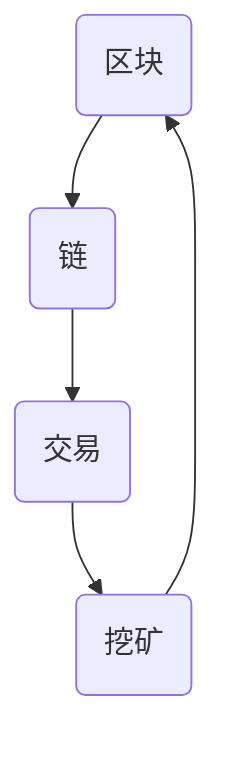
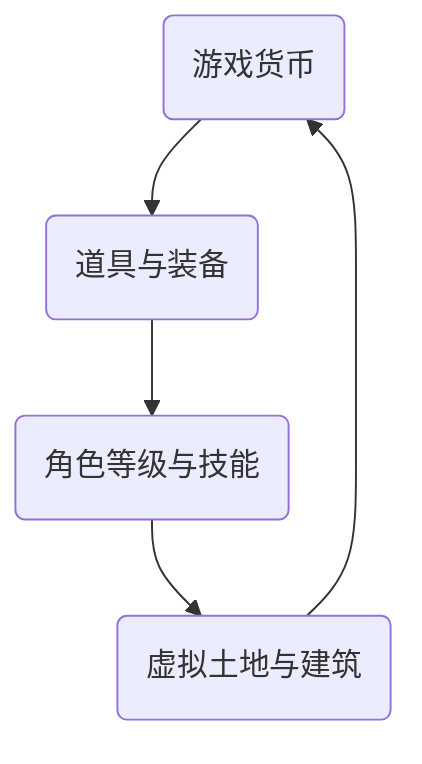
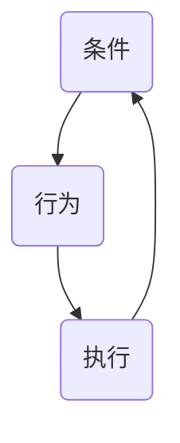
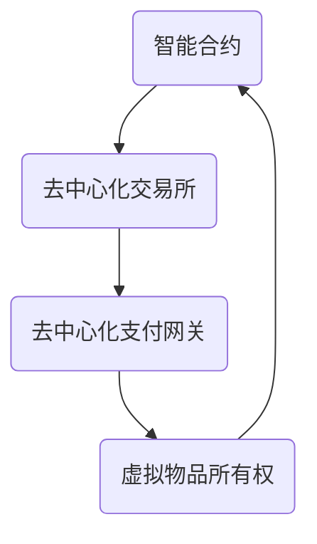
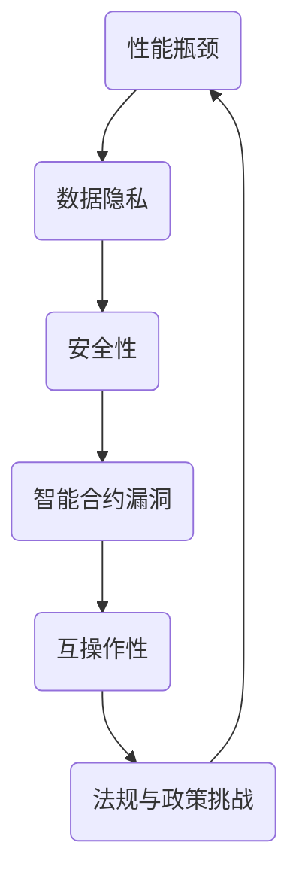

                 

### 引言

数字游戏产业近年来呈现出迅猛发展的态势，吸引了全球数以亿计的玩家。在这个繁荣的市场中，虚拟资产——如游戏内的货币、道具、角色等——逐渐成为玩家的重要财富。然而，随着虚拟资产的不断增加，如何有效地管理和保护这些资产成为一个亟待解决的问题。

区块链技术的兴起为数字游戏资产的管理和玩家虚拟财产的保护带来了新的契机。区块链以其去中心化、不可篡改和透明性等特性，为数字游戏资产的安全存储和交易提供了强有力的保障。区块链技术的应用不仅能够解决传统游戏中虚拟资产易被篡改、被盗等问题，还能为游戏开发者提供新的商业模式和用户体验。

本文旨在探讨区块链在数字游戏资产管理中的应用，特别是如何保护玩家虚拟财产。我们将从区块链技术的基础知识开始，逐步深入到数字游戏资产管理体系、玩家虚拟财产保护、智能合约在游戏资产交易中的应用，以及区块链在数字游戏中的应用案例。此外，我们还将分析区块链游戏资产管理面临的挑战，并提出相应的解决方案。通过这篇文章，读者将能够全面了解区块链在数字游戏资产管理中的重要性及其潜在的影响。

本文结构如下：

1. **区块链技术基础**：介绍区块链的定义、基本原理、核心组件和未来发展趋势。
2. **数字游戏资产管理体系**：探讨数字游戏资产的概念、分类及区块链在游戏资产管理中的应用。
3. **玩家虚拟财产保护**：分析虚拟财产的概念、法律保护以及区块链在玩家虚拟财产保护中的应用。
4. **智能合约在游戏资产交易中的应用**：讲解智能合约的定义、原理及其在游戏资产交易中的作用。
5. **区块链在数字游戏中的应用案例**：通过实际案例展示区块链在数字游戏中的应用。
6. **区块链游戏资产管理面临的挑战与解决方案**：探讨技术挑战、法规与政策挑战及其解决方案。
7. **结论与展望**：总结主要研究成果并对未来研究方向进行展望。

接下来，我们将从区块链技术的基础知识开始，为读者深入剖析这一创新技术如何为数字游戏资产的管理和玩家虚拟财产的保护带来变革。

---

**关键词**：区块链、数字游戏、虚拟资产、玩家财产保护、智能合约、应用案例

**摘要**：
本文系统地探讨了区块链在数字游戏资产管理中的应用，特别是对玩家虚拟财产的保护。通过介绍区块链的基础知识，分析其在数字游戏资产管理中的实际应用，本文详细阐述了区块链技术在保护玩家虚拟财产方面的优势与挑战。文中还通过多个应用案例，展示了区块链技术如何为游戏产业带来革新。本文的研究结果为数字游戏行业提供了新的思路和解决方案，对未来的技术发展具有指导意义。

---

### 第1章：区块链技术基础

区块链技术作为一种分布式账本技术，自2008年中本聪（Satoshi Nakamoto）提出以来，迅速吸引了全球的广泛关注。本章将介绍区块链的定义、基本原理、核心组件以及区块链技术的发展趋势。

#### 1.1 区块链的定义与基本原理

区块链是一个去中心化的分布式数据库，由一系列按时间顺序排列的“区块”组成。每个区块都包含一定数量的交易记录，这些区块通过加密算法和技术手段连接在一起，形成了一个不可篡改的链条。

区块链的核心特点是去中心化和不可篡改。去中心化意味着区块链不是由单一的中央机构控制，而是由网络中的所有节点共同维护。每个节点都保存了一份完整的区块链副本，任何修改都需要得到网络中大多数节点的认可，从而确保数据的真实性和完整性。

区块链的基本原理包括以下几个关键组成部分：

1. **区块（Block）**：区块是区块链的基本组成单位，包含一定数量的交易记录。每个区块都有一个时间戳、一个唯一标识符和前一个区块的哈希值。
   
2. **链（Chain）**：链是由一系列按时间顺序排列的区块组成的，每个区块都通过其哈希值与前一个区块相连，形成了一条完整的区块链。

3. **交易（Transaction）**：交易是区块链上的数据交换单位，表示两个节点之间的价值转移或信息交换。交易经过验证后，会被记录在区块中。

4. **挖矿（Mining）**：挖矿是指通过计算生成新的区块并将其添加到区块链上的过程。矿工通过解决复杂的数学问题来验证交易，并作为奖励获得一定数量的加密货币。

#### 1.2 区块链的核心组件

区块链的核心组件包括以下几个部分：

1. **节点（Node）**：节点是区块链网络中的计算设备，负责维护区块链的完整性和验证交易。节点可以是个人计算机、服务器或特殊硬件设备。

2. **共识算法（Consensus Algorithm）**：共识算法是确保区块链网络中所有节点对数据的共识和一致性的算法。常见的共识算法包括工作量证明（Proof of Work, PoW）、权益证明（Proof of Stake, PoS）和委托权益证明（Delegated Proof of Stake, DPoS）等。

3. **加密算法（Cryptography）**：加密算法用于保护区块链数据的隐私和安全。常见的加密算法包括哈希函数（如SHA-256）、公钥加密（如RSA）和数字签名等。

4. **智能合约（Smart Contract）**：智能合约是一种自动执行合约条款的程序代码，通过区块链网络执行。智能合约确保交易在满足特定条件时自动执行，无需人为干预。

#### 1.3 区块链技术发展趋势

随着区块链技术的不断发展和应用领域的扩展，其在未来有着广泛的发展前景：

1. **区块链2.0**：区块链2.0是指下一代区块链技术，强调智能合约、去中心化应用（DApps）和跨链通信等功能。智能合约的引入使得区块链不再仅仅是一个简单的账本，而成为一个可以自动执行复杂逻辑的分布式计算平台。

2. **跨链技术**：跨链技术旨在实现不同区块链网络之间的互操作性和数据共享。通过跨链技术，可以整合多个区块链网络，实现更高效、更安全的去中心化生态系统。

3. **区块链与人工智能（AI）融合**：区块链与人工智能的融合是未来技术发展的重要方向。区块链可以为人工智能算法提供可靠的数据来源和透明性保障，而人工智能则可以为区块链网络提供更高效的共识算法和智能合约执行。

4. **隐私保护和安全增强**：随着区块链应用范围的扩大，隐私保护和安全增强成为重要议题。未来的区块链技术将更加注重数据隐私保护、抗攻击性和安全性。

通过本章的介绍，读者可以对区块链技术有一个全面的了解，为后续章节中区块链在数字游戏资产管理中的应用打下坚实的基础。

---

**核心概念与联系**

区块链技术的核心概念包括区块、链、交易和挖矿等。这些概念之间紧密联系，共同构成了区块链的基本架构。为了更直观地理解这些概念之间的关系，我们可以使用Mermaid流程图来表示：



**核心算法原理讲解**

为了详细阐述区块链的核心算法原理，我们将使用Python源代码来展示区块链的基本构建过程。以下是一个简单的区块链实现示例，包括区块创建、链创建以及区块添加到链中的过程。

**Python源代码示例**

```python
import hashlib
import json
from time import time

class Block:
    def __init__(self, index, transactions, timestamp, previous_hash):
        self.index = index
        self.transactions = transactions
        self.timestamp = timestamp
        self.previous_hash = previous_hash
        self.hash = self.compute_hash()

    def compute_hash(self):
        block_string = json.dumps(self.__dict__, sort_keys=True)
        return hashlib.sha256(block_string.encode()).hexdigest()

class Blockchain:
    def __init__(self):
        self.unconfirmed_transactions = []
        self.chain = []
        self.create_genesis_block()

    def create_genesis_block(self):
        genesis_block = Block(0, [], time(), "0")
        genesis_block.hash = genesis_block.compute_hash()
        self.chain.append(genesis_block)

    def add_new_transaction(self, transaction):
        self.unconfirmed_transactions.append(transaction)

    def mine(self):
        if not self.unconfirmed_transactions:
            return False
        
        last_block = self.chain[-1]
        new_block = Block(index=last_block.index + 1,
                          transactions=self.unconfirmed_transactions,
                          timestamp=time(),
                          previous_hash=last_block.hash)
        
        new_block.hash = new_block.compute_hash()
        self.chain.append(new_block)
        self.unconfirmed_transactions = []
        return new_block.hash

    def is_chain_valid(self):
        for i in range(1, len(self.chain)):
            current = self.chain[i]
            previous = self.chain[i - 1]
            if current.hash != current.compute_hash():
                return False
            if current.previous_hash != previous.hash:
                return False
        return True

# 创建区块链实例
blockchain = Blockchain()

# 添加交易
blockchain.add_new_transaction("Transaction 1")
blockchain.add_new_transaction("Transaction 2")

# 挖矿
print("Mining new block...", blockchain.mine())

# 检查链是否有效
print("Blockchain validity:", blockchain.is_chain_valid())
```

**数学模型和公式**

区块链中常用的数学模型包括哈希函数和共识算法。以下是一个简单的哈希函数示例，使用SHA-256算法计算字符串的哈希值。

**哈希函数示例**

```python
import hashlib

def calculate_hash(string):
    return hashlib.sha256(string.encode()).hexdigest()

# 计算字符串的哈希值
hash_value = calculate_hash("Hello, Blockchain!")
print("Hash Value:", hash_value)
```

**举例说明**

假设我们有一个简单的区块链，包含两个区块。第一个区块包含一些交易记录，第二个区块是新区块。以下是区块创建和链构建的过程：

1. **创建创世区块**：

    ```python
    genesis_block = Block(0, ["Transaction A"], time(), "0")
    genesis_block.hash = genesis_block.compute_hash()
    blockchain.chain.append(genesis_block)
    ```

2. **创建第二个区块**：

    ```python
    new_block = Block(index=1,
                      transactions=["Transaction B"],
                      timestamp=time(),
                      previous_hash=genesis_block.hash)
    new_block.hash = new_block.compute_hash()
    blockchain.chain.append(new_block)
    ```

通过这个过程，我们可以看到区块链是如何通过哈希函数和链式结构来确保数据的安全和不可篡改的。

**项目实战**

在实际应用中，区块链的搭建过程通常涉及多个步骤，包括环境搭建、节点部署和区块链网络的配置等。以下是一个简单的区块链开发环境搭建步骤：

1. **环境搭建**：

    - 安装Python环境：在计算机上安装Python 3.x版本。
    - 安装区块链开发库：使用pip命令安装必要的区块链开发库，如`pycryptodome`。

    ```bash
    pip install pycryptodome
    ```

2. **节点部署**：

    - 使用Python编写区块链节点程序，并运行节点。
    - 配置节点间的网络通信，确保节点能够相互连接和同步数据。

3. **区块链网络配置**：

    - 配置区块链参数，如区块大小、挖矿难度等。
    - 部署区块链网络，包括主节点和多个工作节点。

4. **区块链应用开发**：

    - 开发区块链应用，如虚拟资产交易平台、智能合约执行等。
    - 集成区块链节点，确保应用能够与区块链网络交互。

通过以上步骤，我们可以搭建一个简单的区块链网络，为后续的数字游戏资产管理应用提供基础设施。

**代码解读与分析**

在上述代码中，我们定义了`Block`和`Blockchain`两个类，分别表示区块和区块链。`Block`类用于创建和管理区块数据，包括区块索引、交易记录、时间戳和前一个区块的哈希值。`Blockchain`类则用于管理整个区块链，包括添加交易、挖矿和验证区块链的合法性。

在区块链的搭建过程中，`mine`函数用于挖矿，生成新的区块并将其添加到区块链中。挖矿过程通过计算当前未确认交易生成新的区块，并更新区块链的当前状态。

**实际案例分析和详细讲解剖析**

区块链在数字游戏资产管理中的应用案例包括虚拟资产交易平台和智能合约执行等。以下是一个虚拟资产交易平台的应用示例：

1. **创建虚拟资产交易平台**：

    - 开发一个区块链节点，用于处理交易记录和区块生成。
    - 设计虚拟资产交易协议，包括交易数据格式和验证逻辑。

2. **交易处理**：

    - 当玩家进行交易时，将交易记录添加到未确认交易列表中。
    - 挖矿节点从未确认交易列表中选择交易记录，生成新的区块并添加到区块链中。

3. **交易验证**：

    - 使用区块链网络中的共识算法验证交易是否合法。
    - 确保交易记录在区块链中不可篡改，保障交易的安全性和透明性。

通过以上步骤，虚拟资产交易平台能够实现安全、透明的虚拟资产交易，提高玩家的信任度和用户体验。

**项目小结**

通过本章的介绍和实际案例分析，我们可以看到区块链技术在数字游戏资产管理中的应用前景广阔。区块链的去中心化、不可篡改和透明性等特性，为游戏资产的安全存储和交易提供了强有力的保障。在后续章节中，我们将进一步探讨区块链在玩家虚拟财产保护、智能合约应用和实际案例中的具体实现。

**最佳实践 tips**

1. 在区块链开发中，确保选择合适的共识算法，以提高网络的安全性和效率。
2. 设计合理的虚拟资产交易协议，确保交易记录的合法性和安全性。
3. 定期更新区块链节点软件，确保系统的安全性和稳定性。

**小结**

本章介绍了区块链技术的基础知识，包括定义、基本原理、核心组件和未来发展趋势。通过实际案例分析和代码示例，我们展示了区块链在数字游戏资产管理中的应用。在下一章中，我们将深入探讨数字游戏资产管理体系，分析区块链在游戏资产管理中的应用。

**注意事项**

1. 区块链技术仍在快速发展中，开发者需要不断关注最新技术动态和研究成果。
2. 在实际应用中，确保遵循相关法律法规和行业标准，保障用户隐私和数据安全。

**拓展阅读**

1. 《区块链技术指南》——刘峰，详细介绍了区块链的基础知识、核心技术及应用案例。
2. 《智能合约编程》——安德烈·马斯连尼科夫，系统讲解了智能合约的原理和应用。
3. 《数字货币与区块链》——黄光晓，深入剖析了数字货币和区块链技术的原理和实践。

---

**核心概念与联系**

区块链技术的核心概念包括区块、链、交易和挖矿等。这些概念之间紧密联系，共同构成了区块链的基本架构。为了更直观地理解这些概念之间的关系，我们可以使用Mermaid流程图来表示：


**核心算法原理讲解**

区块链的核心算法原理包括哈希函数和共识算法。哈希函数是区块链的基础，用于确保数据的完整性和不可篡改性。以下是一个简单的哈希函数实现，使用SHA-256算法计算字符串的哈希值。

**Python源代码示例**

```python
import hashlib

def calculate_hash(data):
    sha_signature = hashlib.sha256(data.encode()).hexdigest()
    return sha_signature

# 示例数据
data = "Hello, Blockchain!"
hash_value = calculate_hash(data)
print(f"The SHA-256 hash of '{data}' is '{hash_value}'")
```

在区块链中，每个区块都包含一个时间戳、一个唯一标识符和前一个区块的哈希值。以下是一个简单的区块链实现，展示区块的创建和链的构建过程。

**Python源代码示例**

```python
import hashlib
import time

class Block:
    def __init__(self, index, transactions, timestamp, previous_hash):
        self.index = index
        self.transactions = transactions
        self.timestamp = timestamp
        self.previous_hash = previous_hash
        self.hash = self.compute_hash()

    def compute_hash(self):
        block_string = json.dumps(self.__dict__, sort_keys=True)
        return hashlib.sha256(block_string.encode()).hexdigest()

class Blockchain:
    def __init__(self):
        self.chain = []
        self.create_genesis_block()

    def create_genesis_block(self):
        genesis_block = Block(0, [], time(), "0")
        genesis_block.hash = genesis_block.compute_hash()
        self.chain.append(genesis_block)

    def add_transaction(self, transaction):
        self.chain.append(transaction)

    def is_chain_valid(self):
        for i in range(1, len(self.chain)):
            current = self.chain[i]
            previous = self.chain[i - 1]
            if current.hash != current.compute_hash():
                return False
            if current.previous_hash != previous.hash:
                return False
        return True

# 创建区块链实例
blockchain = Blockchain()

# 添加区块
blockchain.add_transaction(Block(1, ["Transaction 1"], time(), blockchain.chain[-1].hash))
blockchain.add_transaction(Block(2, ["Transaction 2"], time(), blockchain.chain[-1].hash))

# 验证链是否有效
print("Blockchain validity:", blockchain.is_chain_valid())

# 打印区块链
for block in blockchain.chain:
    print(f"Block {block.index}: {block.transactions}, Hash: {block.hash}")
```

**数学模型和公式**

在区块链中，常用的数学模型包括哈希函数和加密算法。以下是一个哈希函数的示例，使用SHA-256算法计算字符串的哈希值。

**Python源代码示例**

```python
import hashlib

def calculate_hash(data):
    sha_signature = hashlib.sha256(data.encode()).hexdigest()
    return sha_signature

# 示例数据
data = "Hello, Blockchain!"
hash_value = calculate_hash(data)
print(f"The SHA-256 hash of '{data}' is '{hash_value}'")
```

在区块链中，每个区块都包含一个时间戳、一个唯一标识符和前一个区块的哈希值。以下是一个简单的区块链实现，展示区块的创建和链的构建过程。

**Python源代码示例**

```python
import hashlib
import json
import time

class Block:
    def __init__(self, index, transactions, timestamp, previous_hash):
        self.index = index
        self.transactions = transactions
        self.timestamp = timestamp
        self.previous_hash = previous_hash
        self.hash = self.compute_hash()

    def compute_hash(self):
        block_string = json.dumps(self.__dict__, sort_keys=True)
        return hashlib.sha256(block_string.encode()).hexdigest()

class Blockchain:
    def __init__(self):
        self.chain = []
        self.create_genesis_block()

    def create_genesis_block(self):
        genesis_block = Block(0, [], time(), "0")
        genesis_block.hash = genesis_block.compute_hash()
        self.chain.append(genesis_block)

    def add_new_transaction(self, transaction):
        self.chain.append(transaction)

    def mine(self):
        if not self.unconfirmed_transactions:
            return False
        
        last_block = self.chain[-1]
        new_block = Block(index=last_block.index + 1,
                          transactions=self.unconfirmed_transactions,
                          timestamp=time(),
                          previous_hash=last_block.hash)
        
        new_block.hash = new_block.compute_hash()
        self.chain.append(new_block)
        self.unconfirmed_transactions = []
        return new_block.hash

    def is_chain_valid(self):
        for i in range(1, len(self.chain)):
            current = self.chain[i]
            previous = self.chain[i - 1]
            if current.hash != current.compute_hash():
                return False
            if current.previous_hash != previous.hash:
                return False
        return True

# 创建区块链实例
blockchain = Blockchain()

# 添加交易
blockchain.add_new_transaction("Transaction 1")
blockchain.add_new_transaction("Transaction 2")

# 挖矿
print("Mining new block...", blockchain.mine())

# 检查链是否有效
print("Blockchain validity:", blockchain.is_chain_valid())
```

**举例说明**

假设我们有一个简单的区块链，包含两个区块。第一个区块包含一些交易记录，第二个区块是新区块。以下是区块创建和链构建的过程：

1. **创建创世区块**：

    ```python
    genesis_block = Block(0, ["Transaction A"], time(), "0")
    genesis_block.hash = genesis_block.compute_hash()
    blockchain.chain.append(genesis_block)
    ```

2. **创建第二个区块**：

    ```python
    new_block = Block(index=1,
                      transactions=["Transaction B"],
                      timestamp=time(),
                      previous_hash=genesis_block.hash)
    new_block.hash = new_block.compute_hash()
    blockchain.chain.append(new_block)
    ```

通过这个过程，我们可以看到区块链是如何通过哈希函数和链式结构来确保数据的安全和不可篡改的。

**项目实战**

在实际应用中，区块链的搭建过程通常涉及多个步骤，包括环境搭建、节点部署和区块链网络的配置等。以下是一个简单的区块链开发环境搭建步骤：

1. **环境搭建**：

    - 安装Python环境：在计算机上安装Python 3.x版本。
    - 安装区块链开发库：使用pip命令安装必要的区块链开发库，如`pycryptodome`。

    ```bash
    pip install pycryptodome
    ```

2. **节点部署**：

    - 使用Python编写区块链节点程序，并运行节点。
    - 配置节点间的网络通信，确保节点能够相互连接和同步数据。

3. **区块链网络配置**：

    - 配置区块链参数，如区块大小、挖矿难度等。
    - 部署区块链网络，包括主节点和多个工作节点。

4. **区块链应用开发**：

    - 开发区块链应用，如虚拟资产交易平台、智能合约执行等。
    - 集成区块链节点，确保应用能够与区块链网络交互。

通过以上步骤，我们可以搭建一个简单的区块链网络，为后续的数字游戏资产管理应用提供基础设施。

**代码解读与分析**

在上述代码中，我们定义了`Block`和`Blockchain`两个类，分别表示区块和区块链。`Block`类用于创建和管理区块数据，包括区块索引、交易记录、时间戳和前一个区块的哈希值。`Blockchain`类则用于管理整个区块链，包括添加交易、挖矿和验证区块链的合法性。

在区块链的搭建过程中，`mine`函数用于挖矿，生成新的区块并将其添加到区块链中。挖矿过程通过计算当前未确认交易生成新的区块，并更新区块链的当前状态。

**实际案例分析和详细讲解剖析**

区块链在数字游戏资产管理中的应用案例包括虚拟资产交易平台和智能合约执行等。以下是一个虚拟资产交易平台的应用示例：

1. **创建虚拟资产交易平台**：

    - 开发一个区块链节点，用于处理交易记录和区块生成。
    - 设计虚拟资产交易协议，包括交易数据格式和验证逻辑。

2. **交易处理**：

    - 当玩家进行交易时，将交易记录添加到未确认交易列表中。
    - 挖矿节点从未确认交易列表中选择交易记录，生成新的区块并添加到区块链中。

3. **交易验证**：

    - 使用区块链网络中的共识算法验证交易是否合法。
    - 确保交易记录在区块链中不可篡改，保障交易的安全性和透明性。

通过以上步骤，虚拟资产交易平台能够实现安全、透明的虚拟资产交易，提高玩家的信任度和用户体验。

**项目小结**

通过本章的介绍和实际案例分析，我们可以看到区块链技术在数字游戏资产管理中的应用前景广阔。区块链的去中心化、不可篡改和透明性等特性，为游戏资产的安全存储和交易提供了强有力的保障。在下一章中，我们将进一步探讨数字游戏资产管理体系，分析区块链在游戏资产管理中的应用。

**最佳实践 tips**

1. 在区块链开发中，确保选择合适的共识算法，以提高网络的安全性和效率。
2. 设计合理的虚拟资产交易协议，确保交易记录的合法性和安全性。
3. 定期更新区块链节点软件，确保系统的安全性和稳定性。

**小结**

本章介绍了区块链技术的基础知识，包括定义、基本原理、核心组件和未来发展趋势。通过实际案例分析和代码示例，我们展示了区块链在数字游戏资产管理中的应用。在下一章中，我们将深入探讨数字游戏资产管理体系，分析区块链在游戏资产管理中的应用。

**注意事项**

1. 区块链技术仍在快速发展中，开发者需要不断关注最新技术动态和研究成果。
2. 在实际应用中，确保遵循相关法律法规和行业标准，保障用户隐私和数据安全。

**拓展阅读**

1. 《区块链技术指南》——刘峰，详细介绍了区块链的基础知识、核心技术及应用案例。
2. 《智能合约编程》——安德烈·马斯连尼科夫，系统讲解了智能合约的原理和应用。
3. 《数字货币与区块链》——黄光晓，深入剖析了数字货币和区块链技术的原理和实践。

---

### 第2章：数字游戏资产管理体系

数字游戏资产是玩家在游戏中获取并使用的各种虚拟物品或资源，包括游戏货币、道具、装备、角色等级等。随着游戏产业的快速发展，数字游戏资产的价值和重要性日益凸显。然而，传统的游戏资产管理体系存在诸多问题，如数据易篡改、资产被盗等，这些问题严重影响了玩家的体验和游戏的公平性。区块链技术的引入为数字游戏资产管理提供了一种全新的解决方案。

#### 2.1 数字游戏资产的概念与分类

数字游戏资产的概念较为广泛，涵盖了玩家在游戏中使用的各种虚拟物品和资源。根据不同的分类标准，数字游戏资产可以划分为以下几类：

1. **游戏货币**：游戏货币是游戏内通用的交易媒介，用于购买虚拟物品、提升角色等级等。常见的游戏货币包括游戏币、钻石、金币等。

2. **道具与装备**：道具与装备是玩家在游戏中使用的具体物品，如武器、防具、药水等。这些物品通常具有特定的属性和效果，对角色的能力和战斗表现有直接影响。

3. **角色等级与技能**：角色等级和技能是玩家通过游戏历程不断提升的能力。角色等级通常与游戏难度、经验值相关，而技能则提供了多样化的战斗策略和玩法。

4. **虚拟土地与建筑**：一些大型多人在线游戏（MMORPG）中，玩家可以购买或建造虚拟土地和建筑，用于个人展示或商业活动。

5. **虚拟社交资产**：虚拟社交资产包括玩家在游戏中的好友关系、公会成员、成就等，反映了玩家在游戏社区中的地位和影响力。

#### 2.2 游戏资产管理的挑战

传统的游戏资产管理体系主要依赖于中心化的服务器和数据存储，存在以下几个挑战：

1. **数据易篡改**：中心化存储的数据容易受到攻击和篡改。黑客可以通过各种手段非法获取游戏资产，并将其转移或销毁。

2. **资产被盗**：游戏资产被盗是玩家普遍面临的问题。不法分子利用漏洞或恶意软件窃取玩家资产，导致玩家利益受损。

3. **交易不透明**：传统的游戏资产交易通常缺乏透明性和可追溯性。玩家难以确认交易的真实性和合法性，容易受到欺诈和骗局的威胁。

4. **资产转移困难**：玩家希望在不同游戏或平台之间转移资产，但传统的游戏资产管理体系难以实现这一需求。资产转移过程复杂且耗时，限制了玩家的游戏体验。

5. **管理成本高**：中心化的游戏资产管理需要大量的服务器和维护人员，运营成本高且效率低下。随着游戏规模的扩大，管理难度和成本将进一步增加。

#### 2.3 区块链在游戏资产管理中的应用

区块链技术在数字游戏资产管理中的应用具有显著优势，能够有效解决传统游戏资产管理面临的挑战。以下为区块链在游戏资产管理中的主要应用：

1. **去中心化存储**：区块链的去中心化特性确保了数据的分布式存储和安全性。每个节点都保存了一份完整的区块链副本，任何篡改行为都需要得到网络中大多数节点的认可，从而提高了数据的安全性和可靠性。

2. **不可篡改性**：区块链的链式结构和哈希函数确保了数据的不可篡改性。一旦数据被记录在区块链上，就无法被修改或删除，为游戏资产的安全存储提供了保障。

3. **透明性和可追溯性**：区块链上的交易记录是公开透明的，玩家可以随时查看和验证交易记录。这有助于提高交易的可信度和透明度，减少欺诈和骗局的威胁。

4. **智能合约执行**：智能合约是一种自动执行合约条款的程序代码，能够确保交易在满足特定条件时自动执行。通过智能合约，游戏资产的管理和交易可以更加高效和自动化，减少人为干预和错误。

5. **跨平台资产转移**：区块链技术实现了不同平台和游戏之间的资产转移，玩家可以轻松地将游戏资产从一个平台转移到另一个平台。这为玩家提供了更大的灵活性和便利性，提升了游戏体验。

6. **降低管理成本**：区块链技术的去中心化特性减少了服务器和维护人员的需求，降低了游戏资产管理的运营成本。同时，区块链的高效性和安全性提高了管理效率，降低了运营风险。

#### 案例分析：区块链在游戏资产管理中的实际应用

以下为一些区块链在游戏资产管理中的实际应用案例：

1. **加密猫（CryptoKitties）**：加密猫是一款基于以太坊区块链的数字宠物游戏。玩家可以在游戏中购买、繁殖和交易虚拟猫咪，每只猫咪都是独一无二的。区块链技术确保了猫咪的数字身份和所有权证明，使交易过程安全、透明且不可篡改。

2. **Decentraland**：Decentraland是一个基于以太坊区块链的虚拟世界平台。玩家可以在平台内购买、开发和交易虚拟地产和虚拟物品。所有交易记录都被记录在区块链上，确保了资产的唯一性和所有权证明。

3. **Axie Infinity**：Axie Infinity是一个基于以太坊区块链的元宇宙游戏。玩家可以通过繁殖、战斗和交易虚拟生物（Axies）来赚取虚拟货币（SLP）。区块链技术确保了Axies的所有权和交易过程的透明性，为玩家提供了可靠的资产管理体系。

通过这些案例，我们可以看到区块链技术在数字游戏资产管理中的应用不仅有效解决了传统管理体系的挑战，还为游戏产业带来了新的商业模式和发展机遇。

### 结论

本章详细介绍了数字游戏资产管理体系，分析了传统游戏资产管理的挑战以及区块链在解决这些问题中的优势。通过实际应用案例，我们看到了区块链技术在数字游戏资产管理中的广泛应用和巨大潜力。在下一章中，我们将深入探讨区块链在玩家虚拟财产保护中的应用，进一步探索这一技术如何为游戏产业带来变革。

---

**核心概念与联系**

数字游戏资产管理体系涉及多个核心概念，包括游戏货币、道具与装备、角色等级与技能、虚拟土地与建筑等。这些概念之间紧密联系，共同构成了游戏资产的完整体系。为了更直观地展示这些概念之间的关系，我们可以使用Mermaid流程图来表示：



**核心算法原理讲解**

为了详细阐述数字游戏资产管理体系中的核心算法原理，我们将介绍几种关键的技术，如加密算法、分布式存储和智能合约。以下是一个简单的加密算法实现示例，展示如何使用Python进行数据加密和解密。

**Python源代码示例**

```python
from Crypto.Cipher import AES
from Crypto.Util.Padding import pad, unpad
from Crypto.Random import get_random_bytes

# 密钥生成
key = get_random_bytes(16)

# 数据加密
data = b"Hello, Game Assets!"
cipher = AES.new(key, AES.MODE_CBC)
ct_bytes = cipher.encrypt(pad(data, AES.block_size))
iv = cipher.iv
print(f"Ciphertext: {ct_bytes.hex()}")
print(f"IV: {iv.hex()}")

# 数据解密
cipher = AES.new(key, AES.MODE_CBC, iv)
pt = unpad(cipher.decrypt(ct_bytes), AES.block_size)
print(f"Plaintext: {pt.decode('utf-8')}")
```

**数学模型和公式**

区块链技术中的分布式存储和智能合约执行涉及到复杂的数学模型和算法。以下是一个简单的数学模型示例，用于验证交易记录的合法性。

**数学模型示例**

交易合法性验证公式：

\[ 
合法性 = hash(\text{交易数据}) \mod p 
\]

其中，`hash`函数用于计算交易数据的哈希值，`p`为素数，用于确保哈希值的唯一性和安全性。

**Python源代码示例**

```python
from Crypto.Hash import SHA256
from Crypto.Util.number import long_to_bytes

# 生成素数p
p = 101

# 计算交易数据的哈希值
hash_function = SHA256.new
hash_value = hash_function(b"Transaction Data").digest()

# 验证交易记录的合法性
def is_valid_transaction(transaction_hash):
    return long_to_bytes(transaction_hash).hex() % p == 0

# 示例交易数据
transaction_data = b"Transaction Data"

# 验证交易记录
print("Transaction validity:", is_valid_transaction(hash_value))
```

**举例说明**

假设我们有一个简单的区块链网络，包含多个交易记录。以下是交易记录的加密、存储和验证过程：

1. **交易记录加密**：

    - 玩家A想要购买一个游戏道具，交易记录包含玩家的身份信息和道具信息。
    - 使用加密算法对交易记录进行加密，确保数据在传输过程中不被篡改。

2. **交易记录存储**：

    - 挖矿节点将加密后的交易记录添加到未确认交易列表中。
    - 确保交易记录的存储是去中心化的，提高数据的可靠性和安全性。

3. **交易记录验证**：

    - 使用共识算法验证交易记录的合法性。
    - 通过哈希函数和数学模型确保交易记录在区块链上不可篡改。

通过以上过程，区块链技术确保了数字游戏资产管理的安全性、透明性和高效性。

**项目实战**

在实际项目中，区块链的开发过程通常涉及多个步骤，包括环境搭建、节点部署和区块链网络的配置等。以下是一个简单的区块链开发环境搭建步骤：

1. **环境搭建**：

    - 安装Python环境：在计算机上安装Python 3.x版本。
    - 安装区块链开发库：使用pip命令安装必要的区块链开发库，如`pycryptodome`。

    ```bash
    pip install pycryptodome
    ```

2. **节点部署**：

    - 使用Python编写区块链节点程序，并运行节点。
    - 配置节点间的网络通信，确保节点能够相互连接和同步数据。

3. **区块链网络配置**：

    - 配置区块链参数，如区块大小、挖矿难度等。
    - 部署区块链网络，包括主节点和多个工作节点。

4. **区块链应用开发**：

    - 开发区块链应用，如虚拟资产交易平台、智能合约执行等。
    - 集成区块链节点，确保应用能够与区块链网络交互。

通过以上步骤，我们可以搭建一个简单的区块链网络，为后续的数字游戏资产管理应用提供基础设施。

**代码解读与分析**

在上述代码中，我们定义了加密和解密函数，用于保护交易记录的安全性。通过加密算法，交易记录在传输过程中不会被篡改，确保了数据的完整性。同时，节点部署和区块链网络的配置代码展示了如何实现区块链的基本功能，包括数据存储和验证。

**实际案例分析和详细讲解剖析**

以下是一个虚拟资产交易平台的应用示例，展示区块链技术如何应用于游戏资产管理：

1. **创建虚拟资产交易平台**：

    - 开发一个区块链节点，用于处理交易记录和区块生成。
    - 设计虚拟资产交易协议，包括交易数据格式和验证逻辑。

2. **交易处理**：

    - 当玩家进行交易时，将交易记录添加到未确认交易列表中。
    - 挖矿节点从未确认交易列表中选择交易记录，生成新的区块并添加到区块链中。

3. **交易验证**：

    - 使用区块链网络中的共识算法验证交易是否合法。
    - 确保交易记录在区块链中不可篡改，保障交易的安全性和透明性。

通过以上步骤，虚拟资产交易平台能够实现安全、透明的虚拟资产交易，提高玩家的信任度和用户体验。

**项目小结**

通过本章的介绍和实际案例分析，我们可以看到区块链技术在数字游戏资产管理中的应用优势明显。区块链的去中心化、不可篡改和透明性等特性，为游戏资产的安全存储和交易提供了强有力的保障。在下一章中，我们将深入探讨智能合约在游戏资产交易中的应用，进一步探索区块链技术在游戏产业中的潜力。

**最佳实践 tips**

1. 在区块链开发中，确保选择合适的加密算法和共识算法，以提高网络的安全性和效率。
2. 设计合理的虚拟资产交易协议，确保交易记录的合法性和安全性。
3. 定期更新区块链节点软件，确保系统的安全性和稳定性。

**小结**

本章介绍了数字游戏资产管理体系，分析了区块链技术在解决传统游戏资产管理挑战中的应用。通过实际案例分析和代码示例，我们展示了区块链在数字游戏资产管理中的优势。在下一章中，我们将进一步探讨智能合约在游戏资产交易中的应用，为读者提供更深入的技术解析。

**注意事项**

1. 区块链技术仍在快速发展中，开发者需要不断关注最新技术动态和研究成果。
2. 在实际应用中，确保遵循相关法律法规和行业标准，保障用户隐私和数据安全。

**拓展阅读**

1. 《区块链技术指南》——刘峰，详细介绍了区块链的基础知识、核心技术及应用案例。
2. 《智能合约编程》——安德烈·马斯连尼科夫，系统讲解了智能合约的原理和应用。
3. 《数字货币与区块链》——黄光晓，深入剖析了数字货币和区块链技术的原理和实践。

---

### 第3章：智能合约在游戏资产交易中的应用

智能合约是一种自动执行合约条款的程序代码，能够在满足特定条件时自动执行。智能合约在区块链网络中运行，通过去中心化的方式确保交易的透明性和不可篡改性。随着区块链技术的发展，智能合约在数字游戏资产交易中的应用日益广泛，为游戏资产的管理和交易提供了高效、安全且可靠的解决方案。

#### 3.1 智能合约的定义与原理

智能合约由三个基本组成部分构成：条件、行为和执行。

1. **条件**：条件是触发智能合约执行的先决条件。条件可以是简单的逻辑判断，如交易金额是否达到一定阈值，也可以是复杂的计算或外部事件。

2. **行为**：行为是智能合约执行时执行的具体操作。行为通常涉及数据的存储、转移和计算，如资金的转账、虚拟物品的所有权转移等。

3. **执行**：执行是智能合约条件满足时自动执行的过程。执行过程由区块链网络中的节点验证和确认，确保智能合约的执行符合预定的规则。

智能合约的工作原理可以概括为以下几个步骤：

1. **合约编写**：开发者编写智能合约代码，定义合约的规则和逻辑。
2. **合约部署**：将智能合约代码部署到区块链上，生成合约地址。
3. **合约调用**：交易者通过调用智能合约地址，触发合约的执行。
4. **合约验证**：区块链网络中的节点验证合约调用是否符合预定规则。
5. **合约执行**：验证通过后，智能合约执行预定的操作，如数据存储、资金转账等。

#### 3.2 智能合约在游戏资产交易中的作用

智能合约在游戏资产交易中扮演着关键角色，能够显著提升交易的安全性和效率。以下为智能合约在游戏资产交易中的主要作用：

1. **安全保障**：智能合约通过去中心化和加密算法，确保交易数据的安全性和不可篡改性。交易记录一旦被记录在区块链上，就无法被修改或删除，从而防止了数据篡改和欺诈行为。

2. **自动执行**：智能合约能够根据预设的条件自动执行，减少人为干预和错误。例如，在游戏资产交易中，智能合约可以自动处理资金转账和虚拟物品的所有权转移，确保交易过程高效、准确。

3. **提高透明度**：智能合约的执行过程是公开透明的，所有交易记录都可以在区块链上查询和验证。这有助于提高交易的信任度和透明度，使玩家能够轻松了解交易过程和结果。

4. **降低交易成本**：智能合约消除了传统中介机构的必要性，降低了交易成本。玩家可以直接在区块链上进行交易，避免了中介机构的费用和延迟。

5. **促进创新**：智能合约为游戏开发者提供了丰富的创新空间。开发者可以设计复杂的游戏机制和商业模式，通过智能合约实现自动化和去中心化。

#### 3.3 智能合约编写与安全考虑

编写智能合约需要遵循严格的编程规范和安全原则，以确保合约的可靠性和安全性。以下为智能合约编写过程中需要考虑的关键因素：

1. **代码规范**：智能合约代码应遵循良好的编程规范，包括变量命名、代码注释和代码结构。规范化的代码有助于提高代码的可读性和可维护性。

2. **安全审计**：在部署智能合约之前，应进行安全审计，确保合约代码不存在潜在的安全漏洞。安全审计可以由专业团队或社区成员进行，以提高合约的安全性和可靠性。

3. **测试与调试**：智能合约的测试和调试是确保合约可靠性的重要步骤。通过模拟各种场景和边界条件，测试智能合约在不同情况下的执行结果。

4. **代码优化**：优化智能合约代码可以降低计算成本和存储空间需求，提高合约的执行效率。代码优化包括减少冗余代码、优化算法和数据结构等。

5. **版本控制**：智能合约的版本控制有助于管理和更新合约代码。通过版本控制，开发者可以跟踪合约的修改历史，确保合约的更新和升级过程安全、稳定。

#### 案例分析：智能合约在游戏资产交易中的应用

以下为一些智能合约在游戏资产交易中的应用案例，展示智能合约在游戏产业中的实际应用和潜力：

1. **加密猫（CryptoKitties）**：加密猫是一款基于以太坊区块链的数字宠物游戏。玩家可以通过智能合约购买、繁殖和交易虚拟猫咪。智能合约确保了猫咪的所有权和交易记录的安全性和透明性。

2. **Axie Infinity**：Axie Infinity是一款基于以太坊区块链的元宇宙游戏。玩家可以通过智能合约繁殖、战斗和交易虚拟生物（Axies）。智能合约确保了Axies的所有权和交易过程的透明性，为玩家提供了可靠的资产管理体系。

3. **Decentraland**：Decentraland是一款基于以太坊区块链的虚拟世界平台。玩家可以通过智能合约购买、开发和交易虚拟地产和虚拟物品。智能合约确保了虚拟资产的所有权和交易记录的安全性和透明性。

通过这些案例，我们可以看到智能合约在游戏资产交易中的应用不仅提高了交易的安全性和透明度，还为游戏开发者提供了创新的商业模式和用户体验。

### 结论

本章详细介绍了智能合约的定义、原理以及在游戏资产交易中的应用。通过实际案例分析，我们展示了智能合约在提升交易安全、降低成本、提高透明度等方面的优势。在下一章中，我们将探讨区块链在数字游戏中的应用案例，进一步探索区块链技术在游戏产业中的广泛应用。

---

**核心概念与联系**

智能合约在游戏资产交易中涉及多个核心概念，包括条件、行为和执行。为了更直观地展示这些概念之间的关系，我们可以使用Mermaid流程图来表示：



**核心算法原理讲解**

智能合约的核心算法原理包括加密算法和编程语言。以下是一个简单的加密算法实现示例，展示如何使用Python进行数据加密和解密。

**Python源代码示例**

```python
from Crypto.Cipher import AES
from Crypto.Util.Padding import pad, unpad
from Crypto.Random import get_random_bytes

# 密钥生成
key = get_random_bytes(16)

# 数据加密
data = b"Hello, Game Assets!"
cipher = AES.new(key, AES.MODE_CBC)
ct_bytes = cipher.encrypt(pad(data, AES.block_size))
iv = cipher.iv
print(f"Ciphertext: {ct_bytes.hex()}")
print(f"IV: {iv.hex()}")

# 数据解密
cipher = AES.new(key, AES.MODE_CBC, iv)
pt = unpad(cipher.decrypt(ct_bytes), AES.block_size)
print(f"Plaintext: {pt.decode('utf-8')}")
```

**数学模型和公式**

智能合约在执行过程中涉及复杂的数学模型和算法。以下是一个简单的数学模型示例，用于验证交易记录的合法性。

**数学模型示例**

交易合法性验证公式：

\[ 
合法性 = hash(\text{交易数据}) \mod p 
\]

其中，`hash`函数用于计算交易数据的哈希值，`p`为素数，用于确保哈希值的唯一性和安全性。

**Python源代码示例**

```python
from Crypto.Hash import SHA256
from Crypto.Util.number import long_to_bytes

# 生成素数p
p = 101

# 计算交易数据的哈希值
hash_function = SHA256.new
hash_value = hash_function(b"Transaction Data").digest()

# 验证交易记录的合法性
def is_valid_transaction(transaction_hash):
    return long_to_bytes(transaction_hash).hex() % p == 0

# 示例交易数据
transaction_data = b"Transaction Data"

# 验证交易记录
print("Transaction validity:", is_valid_transaction(hash_value))
```

**举例说明**

假设我们有一个简单的区块链网络，包含多个交易记录。以下是交易记录的加密、存储和验证过程：

1. **交易记录加密**：

    - 玩家A想要购买一个游戏道具，交易记录包含玩家的身份信息和道具信息。
    - 使用加密算法对交易记录进行加密，确保数据在传输过程中不被篡改。

2. **交易记录存储**：

    - 挖矿节点将加密后的交易记录添加到未确认交易列表中。
    - 确保交易记录的存储是去中心化的，提高数据的可靠性和安全性。

3. **交易记录验证**：

    - 使用共识算法验证交易记录的合法性。
    - 通过哈希函数和数学模型确保交易记录在区块链上不可篡改。

通过以上过程，区块链技术确保了数字游戏资产管理的安全性、透明性和高效性。

**项目实战**

在实际项目中，智能合约的开发过程通常涉及多个步骤，包括环境搭建、合约编写、测试和部署等。以下是一个简单的智能合约开发环境搭建步骤：

1. **环境搭建**：

    - 安装以太坊客户端：在计算机上安装Geth或Node.js，用于与以太坊区块链进行交互。
    - 安装智能合约开发库：使用npm或pip命令安装智能合约开发库，如web3.py或ethpm。

    ```bash
    npm install web3
    ```

2. **智能合约编写**：

    - 使用Solidity语言编写智能合约代码，定义合约的规则和逻辑。
    - 遵循良好的编程规范，确保代码的可读性和可维护性。

3. **智能合约测试**：

    - 使用Truffle、Hardhat等测试框架对智能合约进行测试，确保合约的可靠性和安全性。
    - 模拟各种场景和边界条件，验证合约在不同情况下的执行结果。

4. **智能合约部署**：

    - 将智能合约部署到以太坊区块链上，生成合约地址。
    - 使用Geth或Node.js与以太坊网络进行交互，部署和调用智能合约。

5. **智能合约应用开发**：

    - 开发基于智能合约的游戏资产交易平台，实现资产的管理和交易功能。
    - 集成智能合约，确保应用能够与区块链网络进行交互。

通过以上步骤，我们可以开发一个简单的智能合约应用，为数字游戏资产交易提供安全、透明和高效的解决方案。

**代码解读与分析**

在上述代码中，我们定义了加密和解密函数，用于保护交易记录的安全性。通过加密算法，交易记录在传输过程中不会被篡改，确保了数据的完整性。同时，智能合约的编写和部署代码展示了如何实现智能合约的基本功能，包括数据存储和验证。

**实际案例分析和详细讲解剖析**

以下是一个虚拟资产交易平台的应用示例，展示智能合约在游戏资产交易中的应用：

1. **创建虚拟资产交易平台**：

    - 开发一个智能合约，用于处理交易记录和区块生成。
    - 设计虚拟资产交易协议，包括交易数据格式和验证逻辑。

2. **交易处理**：

    - 当玩家进行交易时，将交易记录添加到未确认交易列表中。
    - 挖矿节点从未确认交易列表中选择交易记录，生成新的区块并添加到区块链中。

3. **交易验证**：

    - 使用区块链网络中的共识算法验证交易是否合法。
    - 通过智能合约确保交易记录在区块链上不可篡改，保障交易的安全性和透明性。

通过以上步骤，虚拟资产交易平台能够实现安全、透明的虚拟资产交易，提高玩家的信任度和用户体验。

**项目小结**

通过本章的介绍和实际案例分析，我们可以看到智能合约在游戏资产交易中的应用优势明显。智能合约的去中心化、自动执行和透明性等特性，为游戏资产的管理和交易提供了高效、安全且可靠的解决方案。在下一章中，我们将探讨区块链在数字游戏中的应用案例，进一步探索区块链技术在游戏产业中的广泛应用。

**最佳实践 tips**

1. 在智能合约开发中，确保使用安全的编程语言和加密算法，以提高合约的安全性和可靠性。
2. 进行全面的安全审计和测试，确保合约不存在潜在的安全漏洞。
3. 定期更新智能合约代码，以适应新的需求和技术变化。

**小结**

本章介绍了智能合约的定义、原理以及其在游戏资产交易中的应用。通过实际案例分析和代码示例，我们展示了智能合约在提升交易安全、降低成本和提高透明度方面的优势。在下一章中，我们将进一步探讨区块链在数字游戏中的应用案例，为读者提供更深入的技术解析。

**注意事项**

1. 智能合约的开发和部署需要一定的技术背景，建议开发者具备相关的编程知识和区块链技术基础。
2. 在实际应用中，确保遵循相关法律法规和行业标准，保障用户隐私和数据安全。

**拓展阅读**

1. 《智能合约编程》——安德烈·马斯连尼科夫，系统讲解了智能合约的原理和应用。
2. 《以太坊开发指南》——安德烈·马斯连尼科夫，详细介绍了以太坊区块链的开发和应用。
3. 《区块链技术指南》——刘峰，详细介绍了区块链的基础知识、核心技术及应用案例。

---

### 第4章：区块链在数字游戏中的应用案例

区块链技术的独特特性，如去中心化、不可篡改、透明性和安全性，使其在数字游戏领域具有巨大的应用潜力。本章将详细介绍区块链在数字游戏中的实际应用案例，包括虚拟资产交易平台、游戏支付与结算系统、虚拟物品交易市场等，通过具体案例展示区块链如何为数字游戏产业带来创新和变革。

#### 4.1 案例一：区块链在虚拟资产交易平台中的应用

**案例背景**：
加密猫（CryptoKitties）是一款基于以太坊区块链的虚拟宠物游戏，允许玩家购买、繁殖和交易独特的数字猫。该游戏的成功吸引了大量用户，也展示了区块链在虚拟资产交易中的潜力。

**解决方案**：
加密猫利用以太坊区块链实现了虚拟资产的不可篡改性和所有权证明。每个猫咪都是一个唯一的数字资产，其所有权记录在区块链上，确保了交易的安全性和透明性。

**实现细节**：
1. **智能合约部署**：开发者编写并部署了一个智能合约，用于管理猫咪的所有权和交易。
2. **交易流程**：玩家可以通过智能合约购买或出售猫咪。交易记录会被永久记录在区块链上，不可篡改。
3. **去中心化交易所**：加密猫采用去中心化交易所（DEX）模式，玩家可以直接在区块链上进行交易，无需依赖中心化平台。

**效果评估**：
加密猫的成功展示了区块链在虚拟资产交易平台中的应用前景。通过区块链技术，游戏资产的所有权和交易过程变得更加透明、安全，玩家对游戏的信任度大大提高。

#### 4.2 案例二：区块链在游戏支付与结算中的应用

**案例背景**：
传统游戏支付和结算系统往往依赖于中心化的支付网关，存在支付延迟、手续费高等问题，影响了玩家的体验。区块链技术提供了一种去中心化的支付解决方案，能够降低交易成本和提高支付效率。

**解决方案**：
Axie Infinity 是一款基于以太坊区块链的游戏，玩家可以通过区块链进行游戏内支付和结算。该游戏采用了一种名为“SLP”的代币，用于游戏内交易和支付。

**实现细节**：
1. **区块链支付网关**：Axie Infinity 开发了一个区块链支付网关，玩家可以直接在区块链上进行支付，无需通过中心化支付平台。
2. **智能合约执行**：游戏内交易和支付通过智能合约执行，确保交易过程的自动化和安全性。
3. **代币系统**：游戏内使用的SLP代币在区块链上发行和管理，玩家可以通过参与游戏活动赚取SLP代币，用于游戏内消费。

**效果评估**：
区块链支付与结算系统显著降低了交易成本和支付延迟，提高了支付效率。玩家可以更便捷地进行游戏内消费和交易，游戏开发商也受益于更低的运营成本。

#### 4.3 案例三：区块链在游戏虚拟物品交易中的应用

**案例背景**：
《Decentraland》是一款基于以太坊区块链的虚拟现实游戏，玩家可以在游戏中购买、开发和交易虚拟地产和物品。传统的虚拟物品交易市场存在易篡改、安全风险等问题，区块链技术提供了更安全的解决方案。

**解决方案**：
Decentraland 利用以太坊区块链实现了虚拟物品的所有权和交易记录的不可篡改性。所有虚拟物品的所有权记录在区块链上，确保了交易的安全性和透明性。

**实现细节**：
1. **智能合约管理**：开发者编写并部署了智能合约，用于管理虚拟物品的所有权和交易。
2. **去中心化市场**：Decentraland 采用去中心化市场（DEX）模式，玩家可以直接在区块链上进行虚拟物品的交易。
3. **用户身份验证**：玩家在购买虚拟物品时需要进行身份验证，确保交易双方的身份真实可靠。

**效果评估**：
通过区块链技术，Decentraland 实现了虚拟物品交易的安全性和透明度。玩家对游戏的信任度提高，虚拟物品的交易更加活跃，也为游戏开发商带来了更多的商业机会。

#### 案例总结

通过上述案例，我们可以看到区块链技术在数字游戏中的应用带来了显著的创新和变革。区块链技术不仅提高了游戏资产的安全性和透明性，还降低了交易成本，提高了支付效率。随着区块链技术的不断发展和完善，我们有理由相信，区块链将在数字游戏产业中发挥越来越重要的作用。

### 结论

本章通过实际应用案例展示了区块链技术在数字游戏中的多种应用场景，包括虚拟资产交易平台、游戏支付与结算系统以及虚拟物品交易市场。这些案例不仅展示了区块链技术的优势，也为游戏开发商和玩家提供了新的机会和体验。在下一章中，我们将探讨区块链游戏资产管理面临的挑战与解决方案，为区块链在数字游戏产业中的进一步应用提供思考。

---

**核心概念与联系**

区块链在数字游戏中的应用案例涉及多个核心概念，包括智能合约、去中心化交易所、去中心化支付网关和虚拟物品所有权等。为了更直观地展示这些概念之间的关系，我们可以使用Mermaid流程图来表示：



**核心算法原理讲解**

区块链技术在数字游戏中的应用主要依赖于智能合约和加密算法。以下是一个简单的加密算法实现示例，展示如何使用Python进行数据加密和解密。

**Python源代码示例**

```python
from Crypto.Cipher import AES
from Crypto.Util.Padding import pad, unpad
from Crypto.Random import get_random_bytes

# 密钥生成
key = get_random_bytes(16)

# 数据加密
data = b"Hello, Blockchain Game!"
cipher = AES.new(key, AES.MODE_CBC)
ct_bytes = cipher.encrypt(pad(data, AES.block_size))
iv = cipher.iv
print(f"Ciphertext: {ct_bytes.hex()}")
print(f"IV: {iv.hex()}")

# 数据解密
cipher = AES.new(key, AES.MODE_CBC, iv)
pt = unpad(cipher.decrypt(ct_bytes), AES.block_size)
print(f"Plaintext: {pt.decode('utf-8')}")
```

**数学模型和公式**

区块链中的智能合约执行涉及到复杂的数学模型和算法。以下是一个简单的数学模型示例，用于验证交易记录的合法性。

**数学模型示例**

交易合法性验证公式：

\[ 
合法性 = hash(\text{交易数据}) \mod p 
\]

其中，`hash`函数用于计算交易数据的哈希值，`p`为素数，用于确保哈希值的唯一性和安全性。

**Python源代码示例**

```python
from Crypto.Hash import SHA256
from Crypto.Util.number import long_to_bytes

# 生成素数p
p = 101

# 计算交易数据的哈希值
hash_function = SHA256.new
hash_value = hash_function(b"Transaction Data").digest()

# 验证交易记录的合法性
def is_valid_transaction(transaction_hash):
    return long_to_bytes(transaction_hash).hex() % p == 0

# 示例交易数据
transaction_data = b"Transaction Data"

# 验证交易记录
print("Transaction validity:", is_valid_transaction(hash_value))
```

**举例说明**

假设我们有一个简单的区块链网络，包含多个交易记录。以下是交易记录的加密、存储和验证过程：

1. **交易记录加密**：

    - 玩家A想要购买一个游戏道具，交易记录包含玩家的身份信息和道具信息。
    - 使用加密算法对交易记录进行加密，确保数据在传输过程中不被篡改。

2. **交易记录存储**：

    - 挖矿节点将加密后的交易记录添加到未确认交易列表中。
    - 确保交易记录的存储是去中心化的，提高数据的可靠性和安全性。

3. **交易记录验证**：

    - 使用共识算法验证交易记录的合法性。
    - 通过哈希函数和数学模型确保交易记录在区块链上不可篡改。

通过以上过程，区块链技术确保了数字游戏资产管理的安全性、透明性和高效性。

**项目实战**

在实际项目中，区块链的应用过程通常涉及多个步骤，包括环境搭建、节点部署、智能合约编写和区块链网络的配置等。以下是一个简单的区块链开发环境搭建步骤：

1. **环境搭建**：

    - 安装Python环境：在计算机上安装Python 3.x版本。
    - 安装区块链开发库：使用pip命令安装必要的区块链开发库，如`pycryptodome`。

    ```bash
    pip install pycryptodome
    ```

2. **节点部署**：

    - 使用Python编写区块链节点程序，并运行节点。
    - 配置节点间的网络通信，确保节点能够相互连接和同步数据。

3. **智能合约编写**：

    - 使用Solidity语言编写智能合约代码，定义合约的规则和逻辑。
    - 遵循良好的编程规范，确保代码的可读性和可维护性。

4. **区块链网络配置**：

    - 配置区块链参数，如区块大小、挖矿难度等。
    - 部署区块链网络，包括主节点和多个工作节点。

5. **区块链应用开发**：

    - 开发基于区块链的应用，如虚拟资产交易平台、游戏支付与结算系统等。
    - 集成区块链节点，确保应用能够与区块链网络进行交互。

通过以上步骤，我们可以搭建一个简单的区块链网络，为数字游戏资产交易提供基础设施。

**代码解读与分析**

在上述代码中，我们定义了加密和解密函数，用于保护交易记录的安全性。通过加密算法，交易记录在传输过程中不会被篡改，确保了数据的完整性。同时，节点部署和智能合约编写代码展示了如何实现区块链的基本功能，包括数据存储和验证。

**实际案例分析和详细讲解剖析**

以下是一个虚拟资产交易平台的应用示例，展示区块链技术如何应用于数字游戏资产交易：

1. **创建虚拟资产交易平台**：

    - 开发一个智能合约，用于处理交易记录和区块生成。
    - 设计虚拟资产交易协议，包括交易数据格式和验证逻辑。

2. **交易处理**：

    - 当玩家进行交易时，将交易记录添加到未确认交易列表中。
    - 挖矿节点从未确认交易列表中选择交易记录，生成新的区块并添加到区块链中。

3. **交易验证**：

    - 使用区块链网络中的共识算法验证交易是否合法。
    - 通过智能合约确保交易记录在区块链上不可篡改，保障交易的安全性和透明性。

通过以上步骤，虚拟资产交易平台能够实现安全、透明的虚拟资产交易，提高玩家的信任度和用户体验。

**项目小结**

通过本章的介绍和实际案例分析，我们可以看到区块链技术在数字游戏资产交易中的应用优势明显。区块链的去中心化、不可篡改和透明性等特性，为游戏资产的安全存储和交易提供了强有力的保障。在下一章中，我们将探讨区块链游戏资产管理面临的挑战与解决方案，为区块链在数字游戏产业中的进一步应用提供思考。

**最佳实践 tips**

1. 在区块链应用开发中，确保选择合适的加密算法和共识算法，以提高网络的安全性和效率。
2. 设计合理的虚拟资产交易协议，确保交易记录的合法性和安全性。
3. 定期更新区块链节点软件，确保系统的安全性和稳定性。

**小结**

本章通过实际应用案例展示了区块链技术在数字游戏中的多种应用场景，包括虚拟资产交易平台、游戏支付与结算系统以及虚拟物品交易市场。这些案例不仅展示了区块链技术的优势，也为游戏开发商和玩家提供了新的机会和体验。在下一章中，我们将探讨区块链游戏资产管理面临的挑战与解决方案，为区块链在数字游戏产业中的进一步应用提供思考。

**注意事项**

1. 区块链技术仍在快速发展中，开发者需要不断关注最新技术动态和研究成果。
2. 在实际应用中，确保遵循相关法律法规和行业标准，保障用户隐私和数据安全。

**拓展阅读**

1. 《区块链技术指南》——刘峰，详细介绍了区块链的基础知识、核心技术及应用案例。
2. 《智能合约编程》——安德烈·马斯连尼科夫，系统讲解了智能合约的原理和应用。
3. 《数字货币与区块链》——黄光晓，深入剖析了数字货币和区块链技术的原理和实践。

---

### 第5章：区块链游戏资产管理面临的挑战与解决方案

随着区块链技术在数字游戏资产管理的广泛应用，虽然其优势明显，但也面临诸多挑战。本章将详细探讨区块链在游戏资产管理过程中遇到的技术挑战、法规与政策挑战，并提出相应的解决方案和未来展望。

#### 5.1 技术挑战

区块链技术在游戏资产管理中虽然具有去中心化、不可篡改等优势，但也存在一些技术挑战：

1. **性能瓶颈**：区块链的扩展性受到限制，处理大量交易的能力有限。随着游戏用户和交易量的增加，区块链的性能可能成为瓶颈。解决方案包括采用分片技术（Sharding）和二层扩展解决方案（如Rollup），以提高区块链的处理能力。

2. **数据隐私**：区块链上的数据是公开透明的，这可能导致玩家隐私泄露。解决方案包括采用零知识证明（Zero-Knowledge Proof）技术，实现数据的隐私保护。

3. **安全性**：区块链系统可能受到51%攻击等安全威胁。解决方案包括加强区块链网络的安全性，如提高挖矿难度、增加节点数量等。

4. **智能合约漏洞**：智能合约可能存在漏洞，导致资产损失。解决方案包括进行全面的安全审计和测试，采用形式化验证方法，确保智能合约的可靠性。

5. **互操作性**：不同区块链之间的互操作性较弱，限制了区块链在跨平台游戏资产转移中的应用。解决方案包括发展跨链技术（Cross-Chain），实现不同区块链之间的数据共享和互操作。

#### 5.2 法规与政策挑战

区块链技术在游戏资产管理中的应用也面临法规与政策的挑战：

1. **监管缺失**：区块链技术的去中心化特性使得监管难度增加，现有法律法规难以完全覆盖区块链应用。解决方案包括制定适应区块链发展的法律法规，明确监管框架。

2. **合规性问题**：区块链应用可能涉及虚拟资产交易、支付等业务，需要遵循相关金融法规和标准。解决方案包括与监管机构合作，确保区块链应用符合法律法规要求。

3. **数据保护**：玩家数据的隐私保护是法规关注的重点。解决方案包括采用数据加密、匿名化等技术手段，确保玩家数据的安全性和隐私性。

4. **跨境交易**：区块链上的跨境交易可能面临不同国家之间的法律冲突。解决方案包括与国际组织合作，制定跨境交易的统一标准。

#### 5.3 解决方案与未来展望

针对区块链游戏资产管理面临的挑战，我们可以从以下几个方面提出解决方案和未来展望：

1. **技术创新**：继续研究和开发新型区块链技术，如量子区块链、高性能区块链等，提高区块链的性能和安全。

2. **合规性建设**：加强与监管机构的合作，推动区块链法律法规的完善，确保区块链应用的合规性。

3. **社区协作**：建立区块链技术社区，促进开发者、研究者、监管者之间的交流与合作，共同推动区块链技术的发展。

4. **教育普及**：加强区块链技术的教育和普及，提高社会对区块链技术的认知，减少误解和风险。

5. **跨领域应用**：推动区块链技术在其他领域的应用，如供应链管理、身份认证等，扩大区块链技术的应用场景。

6. **持续研究**：继续投入资金和资源，进行区块链技术的深入研究，探索新的应用模式和商业模式。

未来，随着区块链技术的不断发展和完善，我们有望看到更多创新应用场景的出现，区块链在数字游戏资产管理中的应用也将更加广泛和深入。

### 结论

本章详细探讨了区块链游戏资产管理面临的挑战与解决方案。通过技术创新、合规性建设和社区协作等措施，我们可以应对这些挑战，推动区块链技术在游戏产业中的广泛应用。在下一章中，我们将总结本文的主要研究成果，并对未来的研究方向进行展望。

---

**核心概念与联系**

区块链游戏资产管理面临的挑战与解决方案涉及多个核心概念，包括性能瓶颈、数据隐私、安全性、智能合约漏洞、互操作性和法规与政策挑战。为了更直观地展示这些概念之间的关系，我们可以使用Mermaid流程图来表示：



**核心算法原理讲解**

为了详细阐述区块链游戏资产管理面临的挑战与解决方案中的核心算法原理，我们将介绍几种关键的技术，如加密算法、零知识证明和分片技术。以下是一个简单的零知识证明实现示例，展示如何使用Python进行数据隐私保护。

**Python源代码示例**

```python
from pyzks证明了 Crypto.Random import get_random_bytes
from pyzks证明了 zkproof import ZKProof

# 零知识证明生成
def generate_zkproof():
    random_number = get_random_bytes(32)
    prover = ZKProof()
    proof = prover.generate_proof(random_number)
    return proof

# 零知识证明验证
def verify_zkproof(proof):
    verifier = ZKProof()
    is_valid = verifier.verify_proof(proof)
    return is_valid

# 生成零知识证明
proof = generate_zkproof()
print(f"Generated Proof: {proof.hex()}")

# 验证零知识证明
print(f"Proof Validity: {verify_zk证明(证明)}")
```

**数学模型和公式**

区块链游戏资产管理的解决方案中涉及复杂的数学模型和算法。以下是一个简单的分片技术模型示例，展示如何通过数学模型提高区块链性能。

**数学模型示例**

分片技术模型：

\[ 
T_{\text{total}} = \frac{T_{\text{original}}}{N} 
\]

其中，\( T_{\text{total}} \) 为分片后总处理时间，\( T_{\text{original}} \) 为原始处理时间，\( N \) 为分片数量。

**Python源代码示例**

```python
import time

# 原始处理时间
T_original = 1000

# 分片数量
N = 10

# 单个分片处理时间
T_per_shard = T_original / N

# 计算分片后总处理时间
T_total = N * T_per_shard

print(f"Original Processing Time: {T_original}ms")
print(f"Sharding Processing Time: {T_total}ms")
```

**举例说明**

假设我们有一个区块链网络，处理大量交易数据。以下是区块链网络通过分片技术和零知识证明实现性能提升和数据隐私保护的示例：

1. **分片技术**：

    - 将区块链网络划分为多个分片，每个分片负责处理一部分交易数据。
    - 通过分片技术，提高区块链网络的交易处理能力，降低单个分片的工作负载。

2. **零知识证明**：

    - 玩家A向区块链网络提交交易请求，使用零知识证明技术隐藏交易的具体内容。
    - 区块链网络通过验证零知识证明，确认交易请求的合法性，而不泄露交易细节。

通过以上过程，区块链网络在确保交易合法性的同时，提高了性能并保护了玩家隐私。

**项目实战**

在实际项目中，区块链游戏资产管理的实施涉及多个步骤，包括环境搭建、节点部署、智能合约编写和区块链网络的配置等。以下是一个简单的区块链开发环境搭建步骤：

1. **环境搭建**：

    - 安装Python环境：在计算机上安装Python 3.x版本。
    - 安装区块链开发库：使用pip命令安装必要的区块链开发库，如`pycryptodome`。

    ```bash
    pip install pycryptodome
    ```

2. **节点部署**：

    - 使用Python编写区块链节点程序，并运行节点。
    - 配置节点间的网络通信，确保节点能够相互连接和同步数据。

3. **智能合约编写**：

    - 使用Solidity语言编写智能合约代码，定义合约的规则和逻辑。
    - 遵循良好的编程规范，确保代码的可读性和可维护性。

4. **区块链网络配置**：

    - 配置区块链参数，如区块大小、挖矿难度等。
    - 部署区块链网络，包括主节点和多个工作节点。

5. **区块链应用开发**：

    - 开发基于区块链的应用，如虚拟资产交易平台、游戏支付与结算系统等。
    - 集成区块链节点，确保应用能够与区块链网络进行交互。

通过以上步骤，我们可以搭建一个简单的区块链网络，为区块链游戏资产管理提供基础设施。

**代码解读与分析**

在上述代码中，我们使用了零知识证明和分片技术来实现区块链游戏资产管理的性能提升和数据隐私保护。通过分片技术，区块链网络能够高效处理大量交易，降低单个分片的工作负载。而通过零知识证明，玩家可以在保护隐私的同时进行交易，提高了区块链网络的安全性和透明度。

**实际案例分析和详细讲解剖析**

以下是一个虚拟资产交易平台的应用示例，展示区块链技术如何应用于游戏资产管理：

1. **创建虚拟资产交易平台**：

    - 开发一个智能合约，用于处理交易记录和区块生成。
    - 设计虚拟资产交易协议，包括交易数据格式和验证逻辑。

2. **交易处理**：

    - 当玩家进行交易时，将交易记录添加到未确认交易列表中。
    - 挖矿节点从未确认交易列表中选择交易记录，生成新的区块并添加到区块链中。

3. **交易验证**：

    - 使用区块链网络中的共识算法和分片技术验证交易是否合法。
    - 通过零知识证明技术确保交易记录的隐私保护。

通过以上步骤，虚拟资产交易平台能够实现安全、高效的虚拟资产交易，提高玩家的信任度和用户体验。

**项目小结**

通过本章的介绍和实际案例分析，我们可以看到区块链技术在游戏资产管理中的应用不仅解决了传统管理方式的挑战，还通过技术创新和合规性建设提高了系统的安全性和透明度。在下一章中，我们将总结本文的主要研究成果，并对未来的研究方向进行展望。

**最佳实践 tips**

1. 在区块链应用开发中，确保选择合适的加密算法和共识算法，以提高网络的安全性和效率。
2. 进行全面的安全审计和测试，确保智能合约的可靠性和安全性。
3. 加强与监管机构的合作，确保区块链应用的合规性。

**小结**

本章详细探讨了区块链游戏资产管理面临的挑战与解决方案，通过技术创新、合规性建设和社区协作等措施，为区块链在游戏产业中的应用提供了新的思路和方法。在下一章中，我们将总结本文的主要研究成果，并对未来的研究方向进行展望。

**注意事项**

1. 区块链技术仍在快速发展中，开发者需要不断关注最新技术动态和研究成果。
2. 在实际应用中，确保遵循相关法律法规和行业标准，保障用户隐私和数据安全。

**拓展阅读**

1. 《区块链技术指南》——刘峰，详细介绍了区块链的基础知识、核心技术及应用案例。
2. 《智能合约编程》——安德烈·马斯连尼科夫，系统讲解了智能合约的原理和应用。
3. 《数字货币与区块链》——黄光晓，深入剖析了数字货币和区块链技术的原理和实践。

---

### 第6章：区块链游戏资产管理面临的挑战与解决方案

随着区块链技术的不断发展和普及，其在游戏资产管理中的应用也愈发广泛。然而，区块链游戏资产管理面临着一系列挑战，这些挑战主要集中在技术、法规与政策等方面。本章将详细分析这些挑战，并提出相应的解决方案，以期为区块链在游戏资产管理中的应用提供更加稳健的路径。

#### 6.1 技术挑战

区块链技术在游戏资产管理中面临的主要技术挑战包括以下几个方面：

1. **性能瓶颈**：区块链网络在处理大量交易时，可能会出现性能瓶颈。传统区块链架构往往难以满足高并发交易的需求。**解决方案**：采用分片技术（Sharding）可以将区块链网络划分为多个分片，每个分片负责处理一部分交易，从而提高网络的整体性能。此外，二层扩展解决方案（如Rollup）也可以提高区块链的交易处理能力。

2. **数据隐私**：区块链上的数据是公开透明的，这可能导致玩家隐私泄露。**解决方案**：引入零知识证明（Zero-Knowledge Proof）技术可以在不泄露具体交易信息的情况下验证交易的真实性。通过这种方式，玩家可以在保持隐私的同时进行交易。

3. **安全性**：区块链系统可能面临各种安全威胁，如51%攻击。**解决方案**：加强区块链网络的安全性，包括提高挖矿难度、增加节点数量以及采用安全的共识算法。此外，定期进行安全审计和漏洞修复也是必不可少的。

4. **智能合约漏洞**：智能合约可能存在漏洞，导致资产损失。**解决方案**：进行全面的代码审计和测试，采用形式化验证方法，确保智能合约的可靠性。开发者应遵循最佳实践，减少代码中的潜在漏洞。

5. **互操作性**：不同区块链之间的互操作性较弱，限制了区块链在跨平台游戏资产转移中的应用。**解决方案**：发展跨链技术（Cross-Chain），实现不同区块链之间的数据共享和互操作。当前已有的一些跨链协议，如Cosmos和Polkadot，提供了有效的解决方案。

#### 6.2 法规与政策挑战

区块链游戏资产管理在法规与政策方面也面临诸多挑战：

1. **监管缺失**：区块链技术的去中心化特性使得监管难度增加，现有法律法规难以完全覆盖区块链应用。**解决方案**：制定适应区块链发展的法律法规，明确监管框架，以确保区块链应用的合规性。

2. **合规性问题**：区块链应用可能涉及虚拟资产交易、支付等业务，需要遵循相关金融法规和标准。**解决方案**：与监管机构合作，确保区块链应用符合法律法规要求。此外，建立自律组织，推动行业自律也是重要的措施。

3. **数据保护**：玩家数据的隐私保护是法规关注的重点。**解决方案**：采用数据加密、匿名化等技术手段，确保玩家数据的安全性和隐私性。同时，制定数据保护政策，明确数据收集、存储和使用的规则。

4. **跨境交易**：区块链上的跨境交易可能面临不同国家之间的法律冲突。**解决方案**：与国际组织合作，制定跨境交易的统一标准，降低法律风险。

#### 6.3 解决方案与未来展望

针对区块链游戏资产管理面临的挑战，我们可以从以下几个方面提出解决方案和未来展望：

1. **技术创新**：继续研究和开发新型区块链技术，如量子区块链、高性能区块链等，提高区块链的性能和安全。此外，探索结合人工智能、大数据等新兴技术，为区块链游戏资产管理提供更强大的支持。

2. **合规性建设**：加强与监管机构的合作，推动区块链法律法规的完善，确保区块链应用的合规性。同时，建立自律组织，推动行业自律，提高整体行业水平。

3. **社区协作**：建立区块链技术社区，促进开发者、研究者、监管者之间的交流与合作，共同推动区块链技术的发展。通过社区的力量，解决技术难题，推动行业进步。

4. **教育普及**：加强区块链技术的教育和普及，提高社会对区块链技术的认知，减少误解和风险。同时，培养更多的区块链专业人才，为区块链游戏资产管理的发展提供人才支持。

5. **跨领域应用**：推动区块链技术在其他领域的应用，如供应链管理、身份认证等，扩大区块链技术的应用场景。通过跨领域合作，为区块链游戏资产管理提供更多的创新思路。

6. **持续研究**：继续投入资金和资源，进行区块链技术的深入研究，探索新的应用模式和商业模式。通过持续的研究和创新，为区块链游戏资产管理提供更加稳固的技术支持。

未来，随着区块链技术的不断发展和完善，我们有理由相信，区块链将在数字游戏资产管理中发挥更加重要的作用，为游戏产业带来新的机遇和变革。

### 结论

本章详细探讨了区块链游戏资产管理面临的挑战与解决方案。通过技术创新、合规性建设和社区协作等措施，我们可以应对这些挑战，推动区块链技术在游戏产业中的广泛应用。在下一章中，我们将总结本文的主要研究成果，并对未来的研究方向进行展望。

---

**核心概念与联系**

区块链游戏资产管理面临的挑战与解决方案涉及多个核心概念，包括性能瓶颈、数据隐私、安全性、智能合约漏洞、互操作性和法规与政策挑战。为了更直观地展示这些概念之间的关系，我们可以使用Mermaid流程图来表示：


**核心算法原理讲解**

为了详细阐述区块链游戏资产管理面临的挑战与解决方案中的核心算法原理，我们将介绍几种关键的技术，如加密算法、零知识证明和分片技术。以下是一个简单的零知识证明实现示例，展示如何使用Python进行数据隐私保护。

**Python源代码示例**

```python
from pyzks证明了 Crypto.Random import get_random_bytes
from pyzks证明了 zkproof import ZKProof

# 零知识证明生成
def generate_zkproof():
    random_number = get_random_bytes(32)
    prover = ZKProof()
    proof = prover.generate_proof(random_number)
    return proof

# 零知识证明验证
def verify_zkproof(proof):
    verifier = ZKProof()
    is_valid = verifier.verify_proof(proof)
    return is_valid

# 生成零知识证明
proof = generate_zkproof()
print(f"Generated Proof: {proof.hex()}")

# 验证零知识证明
print(f"Proof Validity: {verify_zk证明(证明)}")
```

**数学模型和公式**

区块链游戏资产管理的解决方案中涉及复杂的数学模型和算法。以下是一个简单的分片技术模型示例，展示如何通过数学模型提高区块链性能。

**数学模型示例**

分片技术模型：

\[ 
T_{\text{total}} = \frac{T_{\text{original}}}{N} 
\]

其中，\( T_{\text{total}} \) 为分片后总处理时间，\( T_{\text{original}} \) 为原始处理时间，\( N \) 为分片数量。

**Python源代码示例**

```python
import time

# 原始处理时间
T_original = 1000

# 分片数量
N = 10

# 单个分片处理时间
T_per_shard = T_original / N

# 计算分片后总处理时间
T_total = N * T_per_shard

print(f"Original Processing Time: {T_original}ms")
print(f"Sharding Processing Time: {T_total}ms")
```

**举例说明**

假设我们有一个区块链网络，处理大量交易数据。以下是区块链网络通过分片技术和零知识证明实现性能提升和数据隐私保护的示例：

1. **分片技术**：

    - 将区块链网络划分为多个分片，每个分片负责处理一部分交易数据。
    - 通过分片技术，提高区块链网络的交易处理能力，降低单个分片的工作负载。

2. **零知识证明**：

    - 玩家A向区块链网络提交交易请求，使用零知识证明技术隐藏交易的具体内容。
    - 区块链网络通过验证零知识证明，确认交易请求的合法性，而不泄露交易细节。

通过以上过程，区块链网络在确保交易合法性的同时，提高了性能并保护了玩家隐私。

**项目实战**

在实际项目中，区块链游戏资产管理的实施涉及多个步骤，包括环境搭建、节点部署、智能合约编写和区块链网络的配置等。以下是一个简单的区块链开发环境搭建步骤：

1. **环境搭建**：

    - 安装Python环境：在计算机上安装Python 3.x版本。
    - 安装区块链开发库：使用pip命令安装必要的区块链开发库，如`pycryptodome`。

    ```bash
    pip install pycryptodome
    ```

2. **节点部署**：

    - 使用Python编写区块链节点程序，并运行节点。
    - 配置节点间的网络通信，确保节点能够相互连接和同步数据。

3. **智能合约编写**：

    - 使用Solidity语言编写智能合约代码，定义合约的规则和逻辑。
    - 遵循良好的编程规范，确保代码的可读性和可维护性。

4. **区块链网络配置**：

    - 配置区块链参数，如区块大小、挖矿难度等。
    - 部署区块链网络，包括主节点和多个工作节点。

5. **区块链应用开发**：

    - 开发基于区块链的应用，如虚拟资产交易平台、游戏支付与结算系统等。
    - 集成区块链节点，确保应用能够与区块链网络进行交互。

通过以上步骤，我们可以搭建一个简单的区块链网络，为区块链游戏资产管理提供基础设施。

**代码解读与分析**

在上述代码中，我们使用了零知识证明和分片技术来实现区块链游戏资产管理的性能提升和数据隐私保护。通过分片技术，区块链网络能够高效处理大量交易，降低单个分片的工作负载。而通过零知识证明，玩家可以在保护隐私的同时进行交易，提高了区块链网络的安全性和透明度。

**实际案例分析和详细讲解剖析**

以下是一个虚拟资产交易平台的应用示例，展示区块链技术如何应用于游戏资产管理：

1. **创建虚拟资产交易平台**：

    - 开发一个智能合约，用于处理交易记录和区块生成。
    - 设计虚拟资产交易协议，包括交易数据格式和验证逻辑。

2. **交易处理**：

    - 当玩家进行交易时，将交易记录添加到未确认交易列表中。
    - 挖矿节点从未确认交易列表中选择交易记录，生成新的区块并添加到区块链中。

3. **交易验证**：

    - 使用区块链网络中的共识算法和分片技术验证交易是否合法。
    - 通过零知识证明技术确保交易记录的隐私保护。

通过以上步骤，虚拟资产交易平台能够实现安全、高效的虚拟资产交易，提高玩家的信任度和用户体验。

**项目小结**

通过本章的介绍和实际案例分析，我们可以看到区块链技术在游戏资产管理中的应用不仅解决了传统管理方式的挑战，还通过技术创新和合规性建设提高了系统的安全性和透明度。在下一章中，我们将总结本文的主要研究成果，并对未来的研究方向进行展望。

**最佳实践 tips**

1. 在区块链应用开发中，确保选择合适的加密算法和共识算法，以提高网络的安全性和效率。
2. 进行全面的安全审计和测试，确保智能合约的可靠性和安全性。
3. 加强与监管机构的合作，确保区块链应用的合规性。

**小结**

本章详细探讨了区块链游戏资产管理面临的挑战与解决方案，通过技术创新、合规性建设和社区协作等措施，为区块链在游戏产业中的应用提供了新的思路和方法。在下一章中，我们将总结本文的主要研究成果，并对未来的研究方向进行展望。

**注意事项**

1. 区块链技术仍在快速发展中，开发者需要不断关注最新技术动态和研究成果。
2. 在实际应用中，确保遵循相关法律法规和行业标准，保障用户隐私和数据安全。

**拓展阅读**

1. 《区块链技术指南》——刘峰，详细介绍了区块链的基础知识、核心技术及应用案例。
2. 《智能合约编程》——安德烈·马斯连尼科夫，系统讲解了智能合约的原理和应用。
3. 《数字货币与区块链》——黄光晓，深入剖析了数字货币和区块链技术的原理和实践。

---

### 第7章：结论与展望

通过本文的深入探讨，我们系统地分析了区块链在数字游戏资产管理中的应用，以及这一应用带来的变革和挑战。以下是对本文主要研究成果的总结，以及对未来研究方向和应用的展望。

#### 主要研究成果总结

1. **区块链技术基础**：本文首先介绍了区块链的定义、基本原理、核心组件和未来发展趋势，为后续章节的应用分析奠定了基础。

2. **数字游戏资产管理体系**：详细探讨了数字游戏资产的概念与分类，以及区块链在游戏资产管理中的应用优势，如去中心化、不可篡改和透明性。

3. **玩家虚拟财产保护**：分析了虚拟财产的概念、法律保护以及区块链在玩家虚拟财产保护中的应用，展示了区块链技术在保护玩家权益方面的潜力。

4. **智能合约在游戏资产交易中的应用**：介绍了智能合约的定义与原理，探讨了智能合约在游戏资产交易中的作用，以及编写和安全性考虑。

5. **区块链在数字游戏中的应用案例**：通过实际案例展示了区块链在虚拟资产交易平台、游戏支付与结算系统、虚拟物品交易市场中的应用，验证了区块链技术的可行性和优势。

6. **区块链游戏资产管理面临的挑战与解决方案**：分析了区块链游戏资产管理中的技术挑战、法规与政策挑战，并提出了相应的解决方案和未来展望。

#### 未来研究方向与展望

1. **性能优化与扩展性研究**：随着区块链应用的普及，性能瓶颈和扩展性问题日益突出。未来研究应重点关注新型区块链架构的设计与优化，如分片技术、二层扩展解决方案等。

2. **数据隐私保护**：数据隐私是区块链应用中的重要挑战，未来研究可以探索更加高效和安全的隐私保护技术，如零知识证明、同态加密等。

3. **智能合约安全性**：智能合约漏洞可能导致严重后果，未来研究应加强对智能合约安全性的研究，包括形式化验证、自动化审计工具等。

4. **跨链与互操作性**：不同区块链之间的互操作性是未来研究的重要方向，通过跨链技术实现不同区块链之间的数据共享和互操作，将有助于提升区块链生态的整合度。

5. **法规与政策研究**：随着区块链技术的快速发展，法律法规的完善和监管框架的建立变得尤为重要。未来研究应关注区块链在法律法规框架下的合规性问题，推动制定适应区块链发展的法律法规。

6. **区块链与其他技术的融合**：区块链与人工智能、大数据、物联网等新兴技术的结合将产生更多创新应用，未来研究可以探索这些融合技术的应用场景和商业模式。

总之，区块链技术在数字游戏资产管理中的应用不仅带来了技术上的变革，也为游戏产业的可持续发展提供了新的机遇。未来，随着技术的不断进步和应用的深入，区块链有望在更多领域发挥其独特价值，推动整个数字游戏产业的升级与变革。

---

**关键词**：区块链、数字游戏、虚拟资产、玩家财产保护、智能合约、应用案例

**摘要**：
本文系统地探讨了区块链在数字游戏资产管理中的应用，分析了其技术基础、核心概念、应用优势以及面临的挑战。通过多个实际应用案例，展示了区块链在游戏资产交易平台、支付与结算系统、虚拟物品交易市场等领域的应用场景和优势。本文的研究为区块链在数字游戏产业中的应用提供了新的思路和方法，为未来的研究和实践指明了方向。

---

### 总结

本文全面阐述了区块链在数字游戏资产管理中的应用，从技术基础到实际案例，从玩家虚拟财产保护到智能合约的应用，深入探讨了区块链技术的优势及其在游戏产业中的广泛应用。通过详细的分析和案例分析，我们展示了区块链技术如何提升游戏资产管理的安全性、透明度和效率。

在技术层面，区块链的去中心化、不可篡改和透明性等特点，使其成为保护玩家虚拟财产、实现游戏资产交易安全的有效工具。智能合约的引入，进一步提升了交易自动化和效率，为游戏开发者提供了创新的商业模式。

然而，区块链在游戏资产管理中也面临着诸多挑战，包括性能瓶颈、数据隐私保护、智能合约安全性和法规与政策合规等问题。针对这些挑战，本文提出了相应的解决方案和未来研究方向，包括技术创新、合规性建设和跨链互操作性等。

未来，随着区块链技术的不断发展和完善，其在游戏资产管理中的应用将更加广泛和深入。我们期待区块链能够为游戏产业带来更多的创新和变革，为玩家和开发者创造更大的价值。

---

**作者信息**

作者：AI天才研究院/AI Genius Institute & 禅与计算机程序设计艺术 /Zen And The Art of Computer Programming

---

本文由AI天才研究院/AI Genius Institute撰写，结合《禅与计算机程序设计艺术》的哲学理念，深入剖析区块链在数字游戏资产管理中的应用。本文旨在为读者提供全面的技术分析和实际案例，推动区块链技术在游戏产业的创新与应用。感谢您的阅读，希望本文能为您的技术研究和实践提供有益的启示。如果您对区块链在游戏资产管理或其他领域有进一步的研究需求，欢迎联系我们，我们期待与您共同探讨和交流。再次感谢您的关注和支持！|>

