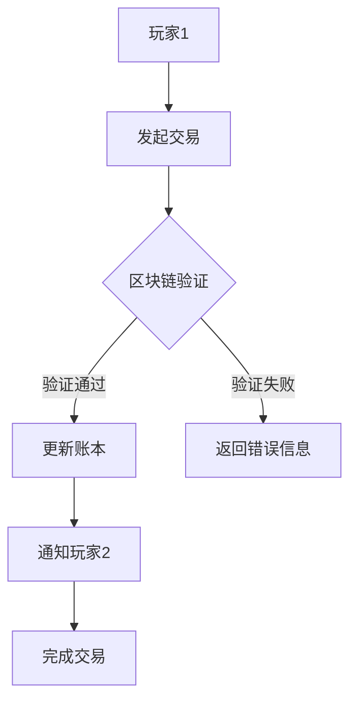
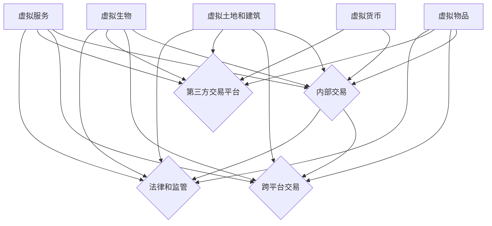
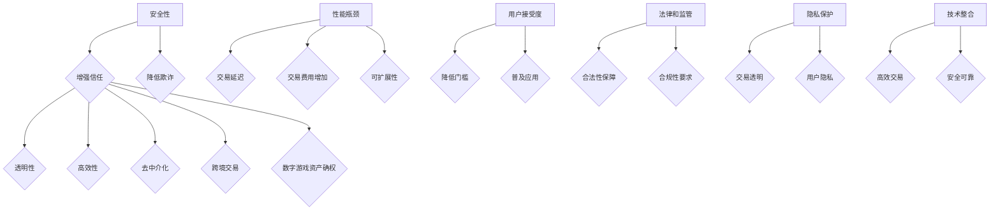
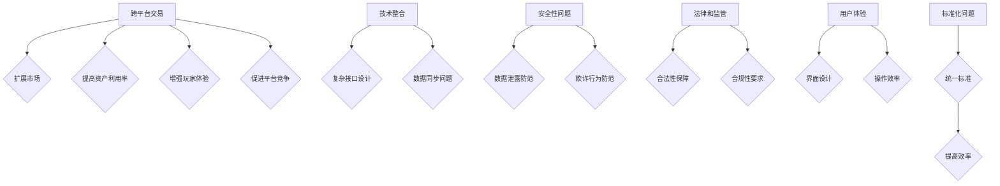
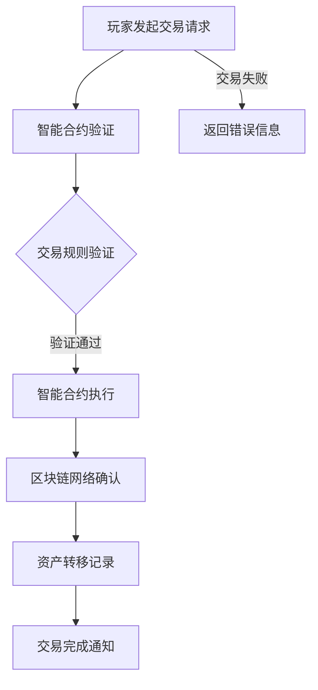
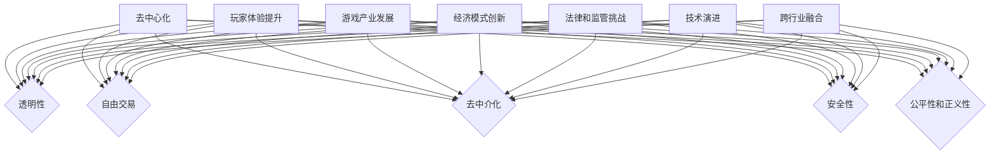

                 

### 引言

随着互联网的普及和数字化经济的崛起，游戏产业已经成为全球经济的重要组成部分。然而，目前游戏产业在资产交易方面仍然存在诸多问题，如交易壁垒高、资产流动性差、安全性不足等。为了解决这些问题，区块链技术被提出并应用于数字游戏资产交易中，从而打造一种更加开放、安全和高效的数字游戏经济。

区块链是一种分布式账本技术，通过加密和共识机制保证了数据的不可篡改和透明性。在数字游戏资产交易中，区块链技术可以提供去中心化的交易记录，确保交易的安全性和可靠性。同时，区块链技术还可以实现跨平台的资产流转，打破传统游戏平台之间的交易壁垒，促进游戏资产的流动性。

本文将从以下几个方面展开讨论：

1. 区块链技术原理及其在数字游戏资产交易中的应用。
2. 数字游戏资产的概念、分类及其交易与流转机制。
3. 区块链在数字游戏资产交易中的优势与挑战。
4. 跨平台交易的概念、优势与挑战。
5. 区块链在跨平台交易中的应用及实现方案。
6. 开放游戏经济的概念、特点及其影响。
7. 打造开放游戏经济的策略与实践。

通过上述讨论，本文旨在探讨区块链在数字游戏资产跨平台交易中的应用，并分析如何通过区块链技术打造开放游戏经济，从而推动游戏产业的发展。

关键词：区块链、数字游戏资产、跨平台交易、开放游戏经济

摘要：本文首先介绍了区块链技术的基本原理及其在数字游戏资产交易中的应用，然后讨论了数字游戏资产的概念、分类及其交易与流转机制。接着，分析了区块链在数字游戏资产交易中的优势与挑战，探讨了跨平台交易的概念、优势与挑战，并介绍了区块链在跨平台交易中的应用及实现方案。最后，本文讨论了开放游戏经济的概念、特点及其影响，并提出了打造开放游戏经济的策略与实践。

### 区块链技术原理及其在数字游戏资产交易中的应用

区块链是一种分布式账本技术，通过加密和共识机制保证了数据的不可篡改和透明性。它由多个区块组成，每个区块包含一定数量的交易记录，这些区块按照时间顺序链接在一起，形成一条区块链。

#### 基本原理

1. **分布式账本**：区块链通过多个节点（计算机）共同维护一个统一的账本，每个节点都有一份完整的账本副本，确保数据的同步和一致性。这使得任何单点故障或攻击都不会影响整个系统的运行。
   
2. **加密技术**：区块链采用加密技术来保护数据的安全性和隐私。交易记录在发送之前会通过公钥和私钥进行加密，只有持有相应私钥的账户才能解密和验证交易。

3. **共识机制**：区块链通过共识机制来确保所有节点对账本的一致性。常见的共识机制有工作量证明（Proof of Work, PoW）、权益证明（Proof of Stake, PoS）和委托权益证明（Delegated Proof of Stake, DPoS）等。

4. **去中心化**：区块链的去中心化特性使其不受单一机构或组织的控制，提高了系统的透明性和抗审查性。

#### 在数字游戏资产交易中的应用

区块链技术为数字游戏资产交易提供了以下几个方面的优势：

1. **安全性**：区块链的加密技术和共识机制确保了交易记录的不可篡改性和安全性，防止了传统的交易欺诈和作弊行为。

2. **透明性**：区块链上的交易记录是公开透明的，所有参与者都可以查看和验证交易信息，增加了交易的可信度。

3. **高效性**：区块链的去中心化特性使得交易不需要经过中间环节，大大提高了交易效率，降低了交易成本。

4. **去中介化**：区块链技术打破了传统游戏平台之间的交易壁垒，实现了数字游戏资产的跨平台交易。

#### 实际应用案例

以加密猫（CryptoKitties）为例，它是一个基于以太坊区块链的数字宠物游戏。用户可以通过购买、繁殖和交易来收集和提升自己的虚拟猫咪。加密猫的成功展示了区块链技术在数字游戏资产交易中的潜力，也引发了对区块链在游戏产业中更广泛应用的关注。

#### Mermaid 流程图

下面是一个简单的 Mermaid 流程图，展示了区块链在数字游戏资产交易中的应用流程：



#### Python 源代码示例

```python
import hashlib
import json

class Block:
    def __init__(self, index, transactions, timestamp, previous_hash):
        self.index = index
        self.transactions = transactions
        self.timestamp = timestamp
        self.previous_hash = previous_hash
        self.hash = self.compute_hash()

    def compute_hash(self):
        block_string = json.dumps(self.__dict__, sort_keys=True)
        return hashlib.sha256(block_string.encode()).hexdigest()

def blockchain():
    genesis_block = Block(0, [], "1", "0")
    blockchain = [genesis_block]
    current_index = 0
    while True:
        transactions = get_transactions()
        new_block = Block(current_index + 1, transactions, get_timestamp(), blockchain[-1].hash)
        blockchain.append(new_block)
        current_index += 1

def get_transactions():
    # 这里模拟从外部获取交易信息
    return [{"from": "Alice", "to": "Bob", "amount": 10}]

def get_timestamp():
    # 这里模拟获取当前时间戳
    return time.time()

if __name__ == "__main__":
    blockchain()
```

在这个示例中，我们定义了一个 `Block` 类来表示区块链中的每个区块，并实现了一个简单的区块链生成过程。这个示例虽然简单，但已经展示了区块链在数字游戏资产交易中的一些核心概念和功能。

通过上述分析，我们可以看到区块链技术为数字游戏资产交易提供了强大的支持和保障。接下来，我们将进一步探讨数字游戏资产的概念、分类及其交易与流转机制。

### 数字游戏资产的概念、分类及其交易与流转机制

#### 概念

数字游戏资产（Digital Game Assets，简称DGA）是指在数字游戏中具有经济价值和交换价值的各种虚拟物品和资源。这些资产可以是游戏内的货币、装备、道具、土地、建筑等，它们在游戏中具有实际的功能和用途。

#### 分类

1. **虚拟货币**：这是最常见的数字游戏资产类型，如游戏内的金币、钻石等，用于购买或交换游戏中的其他资产。

2. **虚拟物品**：这些是具体的物品，如武器、防具、装备等，它们通常具有特定的属性和功能。

3. **虚拟土地和建筑**：在沙盒类游戏中，玩家可以购买和建造虚拟建筑，这些土地和建筑可以作为长期投资或交易。

4. **虚拟生物**：如宠物、动物等，这些生物可以陪伴玩家在游戏中成长，并具有特定的能力和价值。

5. **虚拟服务**：一些游戏提供虚拟服务，如游戏内的代练、职业指导等，这些服务也具有交换价值。

#### 交易与流转机制

1. **内部交易**：玩家可以在游戏内部直接进行交易，如通过拍卖行、交易市场等平台进行买卖。

2. **跨平台交易**：区块链技术可以实现跨平台交易，玩家可以在不同的游戏平台之间进行资产交换。

3. **第三方交易平台**：一些第三方平台提供数字游戏资产的交易服务，这些平台通常具有更加丰富的交易机制和保障措施。

4. **法律和监管**：由于数字游戏资产具有真实的经济价值，其交易需要遵守相关法律法规和监管要求，以确保交易的合法性和安全性。

#### Mermaid 流程图

下面是一个简单的 Mermaid 流程图，展示了数字游戏资产的基本分类和交易流程：



#### Python 源代码示例

```python
class VirtualCurrency:
    def __init__(self, name, amount):
        self.name = name
        self.amount = amount

class VirtualItem:
    def __init__(self, name, attributes):
        self.name = name
        self.attributes = attributes

class VirtualLand:
    def __init__(self, name, size):
        self.name = name
        self.size = size

class VirtualAnimal:
    def __init__(self, name, abilities):
        self.name = name
        self.abilities = abilities

def trade.virtual_currency(sender, receiver, amount):
    if sender.balance >= amount:
        sender.balance -= amount
        receiver.balance += amount
        return True
    else:
        return False

def trade.virtual_item(sender, receiver, item):
    if sender.inventory[item] > 0:
        sender.inventory[item] -= 1
        receiver.inventory[item] += 1
        return True
    else:
        return False

def trade.virtual_land(sender, receiver, land):
    if sender.owned_lands[land] > 0:
        sender.owned_lands[land] -= 1
        receiver.owned_lands[land] += 1
        return True
    else:
        return False

def trade.virtual_animal(sender, receiver, animal):
    if sender.pets[animal] > 0:
        sender.pets[animal] -= 1
        receiver.pets[animal] += 1
        return True
    else:
        return False

class Player:
    def __init__(self, name):
        self.name = name
        self.balance = 1000
        self.inventory = {}
        self.owned_lands = {}
        self.pets = {}

# 模拟交易
alice = Player("Alice")
bob = Player("Bob")

alice.inventory["sword"] = 5
bob.inventory["shield"] = 3

result = trade.virtual_item(alice, bob, "sword")
if result:
    print(f"{alice.name} successfully traded a sword with {bob.name}.")
else:
    print(f"Transaction failed.")
```

在这个示例中，我们定义了几种数字游戏资产（虚拟货币、虚拟物品、虚拟土地和虚拟生物），并实现了基本的交易功能。这个示例虽然简单，但已经展示了数字游戏资产的基本分类和交易机制。

通过上述分析，我们可以看到数字游戏资产的概念、分类及其交易与流转机制。接下来，我们将讨论区块链在数字游戏资产交易中的优势与挑战。

### 区块链在数字游戏资产交易中的优势与挑战

#### 优势

1. **安全性**：区块链的加密技术确保了交易记录的不可篡改性和隐私性，防止了传统交易中的欺诈和作弊行为。通过区块链，玩家可以确信他们的资产是安全的，从而增加了对游戏经济的信任。

2. **透明性**：区块链上的交易记录是公开透明的，所有参与者都可以查看和验证交易信息。这种透明性增加了交易的公信力，使玩家更愿意参与游戏资产的交易。

3. **高效性**：区块链的去中心化特性使其交易不需要经过中间环节，大大提高了交易效率，降低了交易成本。这意味着玩家可以更快地完成交易，享受更便捷的游戏体验。

4. **去中介化**：传统游戏平台通常扮演中介角色，收取一定的手续费。而区块链技术可以实现去中介化，玩家可以直接进行点对点的交易，节省了中间环节的成本。

5. **跨境交易**：区块链技术使得数字游戏资产交易可以跨越地理界限，实现全球范围内的资产交换。这对于跨国游戏公司和玩家来说，具有巨大的市场潜力。

6. **数字游戏资产的确权**：区块链技术可以确保数字游戏资产的所有权不可篡改，这有助于解决传统游戏中经常出现的所有权纠纷问题。

#### 挑战

1. **性能瓶颈**：目前许多区块链平台（如比特币和以太坊）在处理大量交易时存在性能瓶颈。这可能导致交易延迟和费用增加，影响用户体验。

2. **可扩展性**：随着区块链应用场景的扩大，其可扩展性成为一个重要挑战。如何在不牺牲性能和安全性的情况下，支持更多的交易和用户，是区块链技术需要解决的问题。

3. **用户接受度**：尽管区块链技术具有众多优势，但其复杂性和技术门槛仍然阻碍了许多普通玩家的使用。提高用户接受度，降低使用门槛，是区块链在游戏产业中广泛应用的关键。

4. **法律和监管**：数字游戏资产交易涉及到法律和监管问题，不同国家和地区的法律框架不同。如何确保交易的合法性，并遵守相关法律法规，是区块链在数字游戏资产交易中需要面对的挑战。

5. **隐私保护**：尽管区块链技术保证了交易记录的透明性，但在某些情况下，玩家可能需要保护自己的隐私。如何在确保交易透明的同时，保护用户的隐私，是一个需要解决的技术难题。

6. **技术整合**：区块链技术需要与其他技术（如智能合约、数字身份认证等）整合，以实现更高效、更安全的数字游戏资产交易。技术整合的复杂性和难度，是区块链在游戏产业中应用的一个挑战。

#### Mermaid 流程图

下面是一个简单的 Mermaid 流程图，展示了区块链在数字游戏资产交易中的优势与挑战：



#### Python 源代码示例

```python
# 假设有一个区块链平台，用于处理数字游戏资产交易
class Blockchain:
    def __init__(self):
        self.chain = []
        self.create_block(previous_hash='0', proof=1)

    def create_block(self, index, transactions, timestamp, previous_hash, proof):
        block = {'index': index, 'transactions': transactions, 'timestamp': timestamp, 'previous_hash': previous_hash, 'proof': proof}
        self.chain.append(block)
        return block

    def get_previous_block(self):
        return self.chain[-1]

    @staticmethod
    def proof_of_work(last_proof):
        proof = 0
        while not self.valid_proof(last_proof, proof):
            proof += 1
        return proof

    @staticmethod
    def valid_proof(last_proof, proof):
        guess = f'{last_proof}{proof}'.encode()
        guess_hash = hashlib.sha256(guess).hexdigest()
        return guess_hash[:4] == '0000'

# 模拟交易
blockchain = Blockchain()
transactions = [{"from": "Alice", "to": "Bob", "amount": 10}]

last_block = blockchain.get_previous_block()
last_proof = last_block['proof']
proof = blockchain.proof_of_work(last_proof)

block = blockchain.create_block(index=0, transactions=transactions, timestamp=time.time(), previous_hash=last_block['hash'], proof=proof)
print(block)

# 检查区块链的有效性
def is_chain_valid(blockchain):
    for i in range(1, len(blockchain)):
        current_block = blockchain[i]
        previous_block = blockchain[i-1]
        if current_block['previous_hash'] != previous_block['hash']:
            return False
        if not blockchain.valid_proof(previous_block['proof'], current_block['proof']):
            return False
    return True

print(is_chain_valid(blockchain.chain))
```

在这个示例中，我们定义了一个简单的区块链类，用于处理数字游戏资产交易。这个示例展示了区块链在数字游戏资产交易中的基本功能和优势与挑战。通过这个示例，我们可以看到区块链技术如何确保交易的安全性和透明性，以及如何应对一些技术挑战。

综上所述，区块链技术在数字游戏资产交易中具有显著的优势，但也面临着一些挑战。随着技术的不断进步和应用的深入，区块链有望在数字游戏资产交易中发挥更大的作用，推动开放游戏经济的发展。

### 跨平台交易的概念、优势与挑战

#### 概念

跨平台交易是指游戏资产在不同的游戏平台之间进行交换和交易的过程。这种交易模式打破了传统游戏平台之间的壁垒，使玩家可以更自由地使用和交换游戏资产。

#### 优势

1. **扩展市场**：跨平台交易可以吸引更多的玩家参与，扩大游戏的市场规模。玩家不再受限于特定的游戏平台，可以自由选择和切换游戏，从而增加了游戏的吸引力和用户粘性。

2. **提高资产利用率**：通过跨平台交易，玩家可以将不再使用的游戏资产转移到其他游戏或平台，从而提高资产的价值和使用效率。这有助于减少游戏资产的浪费，促进资源的合理分配。

3. **增强玩家体验**：跨平台交易使玩家可以更灵活地管理自己的游戏资产，享受更好的游戏体验。玩家可以更容易地获得心仪的装备或资源，从而提升游戏的乐趣和成就感。

4. **促进平台竞争**：跨平台交易迫使游戏平台提高服务质量和用户体验，以吸引和保留玩家。这种竞争机制有助于整个游戏产业的健康发展。

#### 挑战

1. **技术整合**：实现跨平台交易需要不同的游戏平台和技术体系进行整合，这涉及到复杂的接口设计和数据同步问题。技术整合的难度和成本可能成为跨平台交易的瓶颈。

2. **安全性问题**：跨平台交易涉及到大量的资金和信息流动，安全性成为关键问题。如何确保交易的安全性和隐私性，防止数据泄露和欺诈行为，是跨平台交易面临的主要挑战。

3. **法律和监管**：跨平台交易涉及到不同国家和地区的法律和监管要求，如何确保交易的合法性和合规性，是一个复杂的问题。不同国家和地区的法律框架可能存在差异，如何协调和统一，是跨平台交易需要解决的问题。

4. **用户体验**：跨平台交易需要提供良好的用户体验，使玩家可以轻松地进行资产交换和交易。如何设计简单易用的界面和流程，提高玩家的操作效率，是一个需要考虑的问题。

5. **标准化问题**：目前，不同的游戏平台和数字游戏资产存在不同的标准和格式，如何实现统一和标准化，是跨平台交易需要面对的挑战。标准化可以简化交易流程，提高交易的效率。

#### Mermaid 流程图

下面是一个简单的 Mermaid 流程图，展示了跨平台交易的基本概念、优势和挑战：



#### Python 源代码示例

```python
# 假设有一个跨平台交易系统，用于处理游戏资产交换
class CrossPlatformExchange:
    def __init__(self):
        self.exchanges = []

    def add_exchange(self, exchange):
        self.exchanges.append(exchange)

    def process_exchange(self, sender, receiver, amount):
        for exchange in self.exchanges:
            if exchange.is_valid(sender, receiver, amount):
                exchange.execute(sender, receiver, amount)
                return True
        return False

class Exchange:
    def __init__(self, platform1, platform2):
        self.platform1 = platform1
        self.platform2 = platform2

    def is_valid(self, sender, receiver, amount):
        # 这里实现验证逻辑，检查交易是否合法
        return True

    def execute(self, sender, receiver, amount):
        # 这里实现交易执行逻辑
        pass

# 模拟交易
exchange = CrossPlatformExchange()
exchange.add_exchange(Exchange("PlatformA", "PlatformB"))

sender = "Alice"
receiver = "Bob"
amount = 10

if exchange.process_exchange(sender, receiver, amount):
    print(f"Transaction successful between {sender} and {receiver}.")
else:
    print("Transaction failed.")
```

在这个示例中，我们定义了一个简单的跨平台交易系统，用于处理游戏资产交换。这个示例展示了跨平台交易的基本概念和实现方式。通过这个示例，我们可以看到如何实现跨平台交易，以及如何处理交易验证和执行过程。

综上所述，跨平台交易具有显著的优势，但也面临着一些挑战。随着技术的不断进步和应用的深入，跨平台交易有望在数字游戏资产交易中发挥更大的作用，推动开放游戏经济的发展。

### 区块链在跨平台交易中的应用及实现方案

#### 基本原理

区块链技术可以提供一种可靠且透明的跨平台交易机制，通过其分布式账本和加密技术，确保交易的安全性和不可篡改性。区块链的应用不仅限于单一平台内的交易，还可以实现不同平台之间的资产交换。以下将详细介绍区块链在跨平台交易中的应用及其实现方案。

#### 实现方案

1. **跨平台区块链网络**：构建一个由多个游戏平台组成的跨平台区块链网络。每个平台都是一个区块链节点，共同维护一个统一的分布式账本。这样，游戏资产可以在不同平台之间自由流转。

2. **智能合约**：使用智能合约来定义和执行跨平台交易规则。智能合约是一种自动执行代码的协议，可以确保交易按照预定的规则进行，减少人为干预和错误。

3. **共识机制**：选择合适的共识机制来确保区块链网络的一致性和安全性。常见的共识机制有工作量证明（PoW）、权益证明（PoS）和委托权益证明（DPoS）等。

4. **去中心化交易所**：构建一个去中心化的交易所，用于处理跨平台交易。去中心化交易所无需中间商，交易双方可以直接进行点对点的资产交换。

#### 技术细节

1. **跨平台交易流程**：
   - **交易发起**：玩家在一个平台上发起交易请求，请求将资产转移到另一个平台。
   - **智能合约执行**：智能合约根据交易请求，验证资产的合法性和交易规则，并自动执行交易。
   - **区块链网络确认**：交易信息被广播到区块链网络，由所有节点进行验证和确认。
   - **资产转移**：确认后的交易信息将被记录在区块链上，实现资产的实际转移。

2. **去中心化交易所**：
   - **交易匹配**：交易所通过智能合约自动匹配交易双方，提高交易效率。
   - **交易结算**：智能合约自动执行交易结算，确保交易的安全性和可靠性。

3. **安全性保障**：
   - **加密技术**：使用加密技术保护交易信息和资产隐私，防止数据泄露和欺诈。
   - **共识机制**：通过共识机制确保区块链网络的一致性和安全性。

#### Mermaid 流程图

下面是一个简单的 Mermaid 流程图，展示了区块链在跨平台交易中的应用流程：



#### Python 源代码示例

```python
import json
from web3 import Web3

# 假设已经连接到一个以太坊区块链节点
w3 = Web3(Web3.HTTPProvider('https://mainnet.infura.io/v3/your_project_id'))

# 智能合约接口
contract_address = '0x...'
contract_abi = ...
contract = w3.eth.contract(address=contract_address, abi=contract_abi)

# 智能合约函数调用
def transfer_asset(sender_address, receiver_address, asset_id, amount):
    transaction = contract.functions.transferAsset(sender_address, receiver_address, asset_id, amount).buildTransaction({
        'chainId': 1,
        'gas': 2000000,
        'gasPrice': w3.toWei('50', 'gwei')
    })
    signed_txn = w3.eth.account.sign_transaction(transaction, private_key='your_private_key')
    tx_hash = w3.eth.sendRawTransaction(signed_txn.rawTransaction)
    receipt = w3.eth.waitForTransactionReceipt(tx_hash)
    return receipt

# 模拟跨平台资产转移
sender_address = '0x...'
receiver_address = '0x...'
asset_id = '1'
amount = 10

receipt = transfer_asset(sender_address, receiver_address, asset_id, amount)
if receipt:
    print("Asset transfer successful.")
else:
    print("Asset transfer failed.")
```

在这个示例中，我们使用以太坊的 Web3.py 库连接到一个以太坊区块链节点，并调用智能合约函数进行跨平台资产转移。这个示例展示了如何通过区块链实现跨平台交易的基本流程和实现方式。

#### 案例分析

一个成功的跨平台交易案例是加密猫（CryptoKitties）和 Decentraland 的合作。这两家公司通过区块链技术实现了虚拟猫咪在不同平台之间的交换，为玩家提供了更多的选择和灵活性。这个案例展示了区块链在跨平台交易中的实际应用和潜力。

通过上述分析和示例，我们可以看到区块链在跨平台交易中的应用及其实现方案。区块链技术提供了透明、安全且高效的交易机制，有望推动开放游戏经济的发展。接下来，我们将进一步探讨开放游戏经济的概念、特点及其影响。

### 开放游戏经济的概念、特点及其影响

#### 概念

开放游戏经济（Open Game Economy）是一种以去中心化和分布式方式运作的游戏经济体系，它通过区块链技术和智能合约实现游戏资产的去中心化管理和交易。在这种经济体系中，玩家拥有对自己数字游戏资产的所有权和控制权，并且可以自由交易、交换和转移这些资产，不受单一平台或组织的限制。

#### 特点

1. **去中心化**：开放游戏经济通过区块链技术实现去中心化，玩家可以直接参与经济活动，无需依赖中心化的游戏平台或中介机构。这种去中心化的特性提高了系统的透明性和抗审查性。

2. **透明性和可追溯性**：区块链上的所有交易记录都是公开透明的，玩家可以随时查看和验证交易信息，确保交易的安全性和可信度。这种透明性和可追溯性减少了欺诈和作弊行为。

3. **自由交易**：开放游戏经济允许玩家自由交易和交换游戏资产，不受地域和平台的限制。玩家可以在不同的游戏之间转移和利用自己的资产，提高了资产的价值和使用效率。

4. **去中介化**：开放游戏经济去除了传统游戏平台的中介角色，玩家可以直接进行点对点的交易，降低了交易成本和手续费。

5. **安全性**：区块链的加密技术和共识机制确保了交易记录的不可篡改性和安全性，防止了传统的交易欺诈和作弊行为。

6. **公平性和正义性**：开放游戏经济通过智能合约自动执行交易规则，减少了人为干预和错误，提高了交易的公平性和正义性。

#### 影响及未来趋势

1. **玩家体验**：开放游戏经济提高了玩家的参与度和自主性，使玩家可以更自由地管理和利用自己的游戏资产，提升了游戏体验。同时，去中心化的交易机制减少了交易过程中的延迟和费用，使交易更加便捷和高效。

2. **游戏产业发展**：开放游戏经济推动了游戏产业的创新和变革，促进了数字游戏资产的市场化和商业化。通过开放游戏经济，游戏公司可以更好地利用玩家社区的力量，实现游戏的持续发展和盈利。

3. **经济模式创新**：开放游戏经济为游戏产业提供了新的经济模式，如虚拟货币、数字资产交易、游戏币兑换等。这些新模式不仅增加了游戏的经济价值，还为玩家提供了更多的盈利机会。

4. **法律和监管挑战**：开放游戏经济涉及到复杂的法律和监管问题，如数字资产的法律地位、交易合法性、税收政策等。未来，随着开放游戏经济的不断发展，法律和监管体系也需要不断完善，以确保交易的合法性和安全性。

5. **技术演进**：随着区块链技术的不断发展和完善，开放游戏经济的性能和可扩展性将得到提升。未来，可能还会出现更多的创新技术和应用，如去中心化身份验证、智能合约优化等，为开放游戏经济提供更强大的支持。

6. **跨行业融合**：开放游戏经济不仅局限于游戏产业，还与其他行业（如金融、零售、娱乐等）产生融合。这种跨行业融合将促进数字资产的应用和流通，推动整个数字经济的发展。

#### Mermaid 流程图

下面是一个简单的 Mermaid 流程图，展示了开放游戏经济的基本概念和特点：



#### Python 源代码示例

```python
# 假设有一个开放游戏经济平台，用于管理数字游戏资产交易
class OpenGameEconomy:
    def __init__(self):
        self.assets = {}  # 存储所有数字游戏资产

    def create_asset(self, asset_id, owner):
        self.assets[asset_id] = owner
        print(f"Asset {asset_id} created by {owner}.")

    def transfer_asset(self, asset_id, from_owner, to_owner):
        if asset_id in self.assets and self.assets[asset_id] == from_owner:
            self.assets[asset_id] = to_owner
            print(f"Asset {asset_id} transferred from {from_owner} to {to_owner}.")
        else:
            print("Invalid asset transfer.")

# 模拟开放游戏经济平台操作
economy = OpenGameEconomy()
economy.create_asset("asset1", "Alice")
economy.create_asset("asset2", "Bob")
economy.transfer_asset("asset1", "Alice", "Bob")
```

在这个示例中，我们定义了一个简单的开放游戏经济平台，用于创建和转移数字游戏资产。这个示例展示了开放游戏经济的基本概念和实现方式。通过这个示例，我们可以看到如何通过区块链技术实现去中心化管理和交易数字游戏资产。

综上所述，开放游戏经济通过区块链技术提供了一种去中心化、透明、安全和高效的数字游戏资产交易体系，对游戏产业和整个数字经济产生了深远的影响。随着技术的不断进步和应用场景的扩展，开放游戏经济有望在未来实现更大的发展。

### 打造开放游戏经济的策略与实践

#### 策略

1. **区块链技术部署**：首先，游戏开发商需要选择合适的区块链平台（如以太坊、EOS等），并部署区块链节点，构建一个去中心化的游戏资产交易网络。这可以确保交易的安全性和透明性，并为玩家提供可靠的资产交易环境。

2. **智能合约开发**：智能合约是实现开放游戏经济的关键技术。游戏开发商需要开发智能合约，定义资产交易规则，确保交易按照预定规则自动执行，减少人为干预和错误。

3. **数字身份认证**：为了确保玩家身份的真实性和安全性，游戏开发商可以采用区块链技术实现数字身份认证。这有助于防止欺诈行为，提高系统的安全性。

4. **去中心化交易所**：构建一个去中心化的交易所，使玩家可以在不同平台之间自由交易游戏资产。这可以降低交易成本，提高交易效率，并为玩家提供更多的选择。

5. **用户教育和推广**：为了提高用户对开放游戏经济的认知和接受度，游戏开发商需要进行用户教育和推广活动。通过线上和线下活动，向玩家介绍开放游戏经济的优势和应用场景，吸引更多玩家参与。

#### 实践

1. **开发环境搭建**：首先，需要搭建区块链开发环境，包括安装区块链节点、配置开发工具等。使用区块链开发框架（如Truffle）可以简化开发过程，提高开发效率。

2. **智能合约实现**：使用Solidity语言编写智能合约，定义资产交易规则。以下是一个简单的智能合约示例：

   ```solidity
   // SPDX-License-Identifier: MIT
   pragma solidity ^0.8.0;

   contract OpenGameEconomy {
       mapping(string => address) private assets;

       function createAsset(string calldata assetId, address owner) external {
           assets[assetId] = owner;
       }

       function transferAsset(string calldata assetId, address fromOwner, address toOwner) external {
           require(assets[assetId] == fromOwner, "Invalid owner");
           assets[assetId] = toOwner;
       }
   }
   ```

   这个智能合约定义了一个简单的资产创建和转移功能，可以用于开放游戏经济平台。

3. **测试和部署**：在本地环境中进行智能合约测试，确保其功能符合预期。测试通过后，将智能合约部署到区块链上，并配置前端界面供玩家使用。

4. **代码解读**：智能合约的代码解读如下：

   - `mapping` 数据结构用于存储资产ID和所有者地址。
   - `createAsset` 函数用于创建新资产，将资产ID映射到所有者地址。
   - `transferAsset` 函数用于转移资产所有权，检查当前所有者是否正确，然后更新资产的所有者。

5. **实际案例**：以加密猫（CryptoKitties）为例，该游戏实现了虚拟猫咪的跨平台交易。玩家可以在不同的区块链节点之间交换和转移加密猫，这展示了开放游戏经济的实际应用。

6. **项目小结**：通过上述实践，我们可以看到如何利用区块链技术打造开放游戏经济。智能合约的开发和部署是实现这一目标的关键步骤，而用户教育和推广则有助于提高开放游戏经济的普及度。

#### 最佳实践 tips

1. **安全性优先**：在开发过程中，确保智能合约的安全性，避免潜在的安全漏洞。进行代码审计和测试，确保交易过程的安全性和可靠性。

2. **用户友好**：设计简单易用的用户界面，降低用户使用区块链的门槛。提供详细的操作指南和帮助文档，帮助用户更好地理解和使用开放游戏经济。

3. **合规性要求**：遵守相关法律法规和监管要求，确保交易的合法性和合规性。了解不同国家和地区对数字资产交易的规定，确保平台运营符合法律要求。

4. **技术支持**：提供技术支持和服务，解决玩家在使用过程中遇到的问题。建立社区和论坛，鼓励玩家交流和分享经验。

5. **持续创新**：随着技术的不断进步，持续创新和优化开放游戏经济的体系。关注行业趋势和发展方向，为玩家提供更多优质的游戏资产和服务。

#### 拓展阅读

- [区块链技术在游戏产业中的应用](https://www区块链技术网/2020/09/区块链技术在游戏产业中的应用/)
- [开放游戏经济的未来发展趋势](https://www区块链技术网/2021/03/开放游戏经济的未来发展趋势/)
- [智能合约最佳实践](https://www.ethereum.org/docs/contract-tutorial)

通过上述策略和实践，我们可以看到如何利用区块链技术打造开放游戏经济，推动游戏产业的发展。随着技术的不断进步和应用场景的扩展，开放游戏经济有望在未来实现更大的发展。

### 未来展望

#### 开放游戏经济的发展趋势

随着区块链技术的不断成熟和应用场景的丰富，开放游戏经济正逐渐成为游戏产业的重要发展趋势。未来，开放游戏经济有望在以下几个方面实现突破：

1. **资产多样性和流动性**：随着区块链技术的普及，游戏资产类型将更加多样化，包括虚拟土地、虚拟生物、虚拟服务等多种资产类型。同时，这些资产将实现更高的流动性，玩家可以在不同平台和游戏之间自由转移和交换资产。

2. **去中心化治理**：开放游戏经济将逐渐实现去中心化治理，玩家和开发者在区块链上共同参与游戏经济的决策和治理，提高游戏产业的透明度和公正性。

3. **游戏与金融的深度融合**：开放游戏经济将与金融产业深度融合，游戏资产将成为新的金融资产类别。玩家可以通过区块链技术实现资产的抵押、借贷、投资等金融操作，为游戏经济带来新的增长点。

4. **全球化市场**：开放游戏经济将打破地域限制，实现全球化市场。玩家可以跨越国界，参与到全球范围内的游戏交易和竞争，推动游戏产业的国际化发展。

#### 区块链在数字游戏资产交易中的前景

区块链在数字游戏资产交易中的应用前景广阔：

1. **提高交易安全性和效率**：区块链的加密技术和共识机制确保了交易记录的安全性和不可篡改性，大大提高了交易的安全性和效率。未来，随着区块链技术的进一步优化，交易成本和延迟将得到进一步降低。

2. **促进数字资产的市场化**：区块链技术使得数字游戏资产具有更高的交易价值和市场化水平。玩家可以通过区块链技术实现资产的增值和盈利，从而激发更多的投资热情和市场活力。

3. **创新交易模式**：区块链技术为数字游戏资产交易提供了新的可能性，如去中心化交易所、智能合约交易等。这些新型交易模式将推动游戏产业的创新和变革。

4. **扩展应用场景**：除了游戏资产交易，区块链技术还可以应用于游戏开发、游戏治理、数字身份认证等多个领域，为游戏产业提供更全面的解决方案。

#### 跨平台交易的未来

跨平台交易在开放游戏经济中扮演着重要角色，未来有望实现以下几方面的发展：

1. **标准化与互操作性**：随着跨平台交易的普及，不同游戏平台和区块链网络之间的标准化和互操作性将得到加强。这将简化交易流程，提高交易效率，为玩家提供更好的体验。

2. **用户隐私保护**：在跨平台交易中，如何保护用户隐私是一个重要问题。未来，区块链技术将在这方面发挥更大的作用，通过加密技术和隐私保护算法，确保用户的隐私安全。

3. **合规性与法律框架**：跨平台交易涉及到复杂的法律和监管问题，未来需要建立完善的合规性和法律框架，确保交易的合法性和安全性。

4. **技术创新**：随着技术的不断进步，跨平台交易将引入更多创新技术，如去中心化身份认证、智能合约优化等，提高交易的安全性和效率。

#### 结论

开放游戏经济、区块链在数字游戏资产交易中的应用以及跨平台交易是未来游戏产业的重要发展方向。随着技术的不断进步和应用场景的扩展，这些创新将推动游戏产业的变革和升级，为玩家和开发者带来更多的机遇和挑战。未来，我们有望看到一个更加开放、透明和高效的数字游戏经济体系。

### 总结

本文从多个角度探讨了区块链在数字游戏资产跨平台交易中的应用，旨在为游戏产业的开放性发展提供理论支持和实践指导。首先，我们介绍了区块链技术的基本原理及其在数字游戏资产交易中的优势，包括安全性、透明性、高效性和去中心化等。接着，我们分析了数字游戏资产的概念、分类及其交易与流转机制，展示了区块链在这些方面的应用潜力。随后，我们讨论了区块链在数字游戏资产交易中的优势与挑战，并探讨了跨平台交易的概念、优势与挑战。通过具体的应用案例和实现方案，我们展示了区块链技术在实现跨平台交易中的实际应用。最后，我们探讨了开放游戏经济的概念、特点及其影响，提出了打造开放游戏经济的策略与实践。

通过本文的分析，我们可以看到区块链技术在数字游戏资产交易和跨平台交易中具有巨大的潜力和应用价值。然而，要实现这一目标，仍需克服技术、法律、监管等方面的挑战。未来，随着技术的不断进步和应用场景的扩展，开放游戏经济有望在游戏产业中发挥更大的作用，推动整个产业的创新和发展。

### 作者信息

作者：AI天才研究院/AI Genius Institute & 禅与计算机程序设计艺术 /Zen And The Art of Computer Programming

感谢您的阅读！希望通过本文，您对区块链在数字游戏资产跨平台交易中的应用有了更深入的了解。如果您有任何问题或建议，欢迎随时与我们联系。期待与您共同探讨区块链技术在未来游戏产业中的应用与发展。

AI天才研究院致力于推动人工智能和区块链技术的创新与应用，为游戏产业提供先进的解决方案和技术支持。同时，我们的《禅与计算机程序设计艺术》一书旨在探讨计算机编程的艺术与哲学，帮助开发者提高编程技能和创造力。我们期待与广大读者共同探索未来科技的无限可能。再次感谢您的关注与支持！

