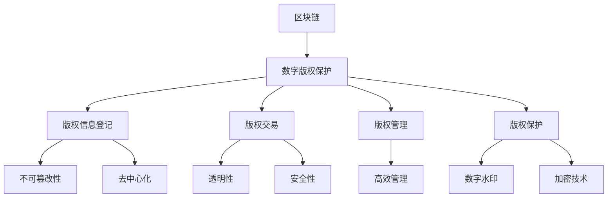

                 

## 引言

### 1.1 区块链与数字版权保护概述

区块链技术，作为一种分布式数据库技术，近年来在金融、供应链管理、数字身份验证等多个领域展现出了巨大的潜力。而数字版权保护，作为知识产权保护的一个重要组成部分，同样面临着严峻的挑战。本文将探讨区块链在数字版权保护中的应用，旨在为读者提供一个全面、深入的视角，了解这一创新技术如何改善版权管理、提升版权保护效率。

**背景介绍**

数字版权保护是一个复杂且多层次的任务。随着数字内容的普及和互联网技术的发展，版权侵权问题日益严重。传统的版权保护手段，如版权声明、数字水印、加密技术等，虽然在一定程度上能够提供保护，但依然存在诸多不足。例如，版权声明需要手动管理，效率低下；数字水印容易被去除；加密技术则可能面临破解风险。

区块链技术，作为一种去中心化、不可篡改的数据存储和传输技术，为数字版权保护提供了一种新的解决方案。它通过加密算法和共识机制，确保数据的真实性和完整性，同时实现去中心化的版权管理。

**数字版权保护的挑战**

数字版权保护面临的主要挑战包括：

1. **版权归属不明确**：在数字环境下，作品的版权归属难以证明，导致版权纠纷频繁。
2. **版权侵权难以追踪**：由于数字内容的易复制性，侵权行为难以追踪，且证据链容易断裂。
3. **版权交易成本高**：传统的版权交易流程复杂，涉及多个环节，交易成本较高。

**区块链技术的优势**

区块链技术在数字版权保护中具有以下优势：

1. **去中心化**：通过去中心化的架构，实现版权管理的透明和高效，减少中介环节，降低交易成本。
2. **不可篡改**：区块链的加密算法和共识机制确保了数据的真实性和不可篡改性，有效防止了版权侵权行为。
3. **透明性**：所有版权交易和操作都在区块链上公开透明，便于追踪和审计。

**文章目的**

本文旨在深入探讨区块链在数字版权保护中的应用，分析其原理和优势，并通过具体案例展示其实际应用效果。文章结构如下：

1. 引言：介绍区块链技术、数字版权保护背景和本文目的。
2. 核心概念与联系：详细解释区块链和数字版权保护的基本概念，并展示它们之间的联系。
3. 核心算法原理讲解：深入探讨区块链在数字版权保护中的核心算法原理，结合Python源代码进行详细讲解。
4. 数学模型和数学公式讲解：介绍区块链技术在数字版权保护中使用的数学模型和公式。
5. 项目实战：通过实际项目案例，展示区块链在数字版权保护中的应用场景和实现过程。
6. 结论：总结区块链在数字版权保护中的应用前景和挑战，提出未来的研究方向。

**关键词**

区块链，数字版权保护，去中心化，加密算法，共识机制，智能合约，非同质化代币（NFT）

**摘要**

本文从区块链技术、数字版权保护的背景出发，分析了区块链在数字版权保护中的应用优势。通过核心算法原理讲解、数学模型和公式介绍，以及实际项目案例展示，本文全面阐述了区块链在数字版权保护中的具体应用。文章旨在为区块链技术在数字版权保护领域的进一步研究和应用提供参考。

----------------------------------------------------------------

## 核心概念与联系

### 2.1 区块链基础

#### 2.1.1 区块链结构

区块链由一系列按时间顺序排列的区块组成。每个区块包含一组交易记录，以及一个时间戳和一个指向前一区块的哈希值。这种结构确保了区块链的不可篡改性，因为任何对历史区块的更改都会破坏后续区块的哈希值。

**区块链的工作原理**

区块链通过以下步骤工作：

1. **交易生成**：用户在区块链上进行交易，交易信息被广播到网络中的所有节点。
2. **区块创建**：节点收集未确认的交易，将它们组织成一个区块。
3. **共识机制**：网络中的节点通过共识机制（如工作量证明、权益证明等）决定哪个区块是下一个合法区块。
4. **区块添加**：一旦共识达成，新的区块会被添加到区块链的末端。

#### 2.1.2 区块链共识机制

区块链共识机制是指节点在区块链网络中如何达成共识，以确保区块链的一致性和安全性。常见的共识机制包括：

- **工作量证明（PoW）**：节点通过解决复杂的数学问题来证明其工作量，从而获得创建新区块的权益。
- **权益证明（PoS）**：节点根据其持有的代币数量和持币时间来证明其权益，获得创建新区块的权益。
- **委托权益证明（DPoS）**：节点通过选举代表来创建区块，代表们根据其持有的代币数量和投票权重来决定。

#### 2.1.3 智能合约

智能合约是区块链上的一段程序代码，它可以自动执行和记录满足特定条件时的合约条款。智能合约通过编程定义了双方在区块链上的交互规则，一旦条件满足，智能合约便会自动执行。

**智能合约的工作原理**

智能合约的工作原理如下：

1. **编写合约**：开发者编写智能合约代码，并将其部署到区块链上。
2. **合约验证**：区块链节点验证智能合约代码的正确性和安全性。
3. **合约执行**：当触发条件时，智能合约自动执行，记录交易并更新区块链状态。

### 2.2 数字版权保护原理

#### 2.2.1 数字版权保护的核心挑战

数字版权保护面临的核心挑战包括：

1. **版权归属不明确**：数字内容的版权归属难以证明，特别是在匿名环境下。
2. **版权侵权难以追踪**：数字内容的易复制性使得侵权行为难以追踪和取证。
3. **版权交易成本高**：数字版权交易流程复杂，涉及多个环节，交易成本较高。

#### 2.2.2 数字版权保护的技术手段

数字版权保护的技术手段包括：

1. **版权声明**：版权声明是一种简单的数字版权保护手段，通过在作品上附加版权声明来表明版权归属。
2. **数字水印**：数字水印是一种将版权信息嵌入到数字内容中的技术，通过检测水印来识别版权。
3. **加密技术**：加密技术通过将数字内容加密，只有授权用户才能解密和访问。
4. **区块链技术**：区块链技术通过加密算法和共识机制，确保版权信息的真实性和不可篡改性。

### 2.3 区块链在数字版权保护中的应用架构

#### 2.3.1 区块链与数字版权保护的关系

区块链与数字版权保护之间具有密切的关系。区块链技术为数字版权保护提供了一种去中心化、安全、透明和高效的解决方案，能够有效解决数字版权保护中的核心挑战。

#### 2.3.2 区块链在数字版权保护中的优势

区块链在数字版权保护中的优势包括：

1. **去中心化**：去中心化架构减少了中介环节，降低了交易成本。
2. **不可篡改**：区块链的加密算法和共识机制确保了版权信息的真实性和不可篡改性。
3. **透明性**：所有版权交易和操作都在区块链上公开透明，便于追踪和审计。
4. **安全性**：区块链的加密算法和共识机制提供了高度的安全性，防止侵权行为。

### 2.3.3 区块链在数字版权保护中的应用架构

区块链在数字版权保护中的应用架构主要包括以下部分：

1. **版权信息登记**：版权人将版权信息登记到区块链上，确保版权归属的明确性和不可篡改性。
2. **版权交易**：版权交易双方通过区块链进行版权交易，确保交易的透明和可追溯性。
3. **版权管理**：版权管理方通过区块链对版权进行管理，包括版权授权、版权转让等操作。
4. **版权保护**：区块链技术提供了一系列版权保护手段，如数字水印、加密技术等。

**核心概念与联系 Mermaid 流程图**



----------------------------------------------------------------

## 核心算法原理讲解

### 3.1 智能合约在数字版权保护中的应用

#### 3.1.1 智能合约基础

智能合约是区块链上的一段程序代码，它可以自动执行和记录满足特定条件时的合约条款。智能合约通过编程定义了双方在区块链上的交互规则，一旦条件满足，智能合约便会自动执行。

**智能合约的原理**

智能合约的工作原理如下：

1. **编写合约**：开发者使用智能合约开发语言（如Solidity）编写智能合约代码，并将其部署到区块链上。
2. **合约验证**：区块链节点验证智能合约代码的正确性和安全性。
3. **合约执行**：当触发条件时，智能合约自动执行，记录交易并更新区块链状态。

**智能合约在数字版权保护中的应用**

智能合约在数字版权保护中的应用包括：

1. **版权声明**：版权人可以使用智能合约声明其作品的版权，确保版权归属的明确性和不可篡改性。
2. **版权交易**：版权交易双方可以通过智能合约进行版权交易，确保交易的透明和可追溯性。
3. **版权授权**：版权人可以通过智能合约向他人授权使用其作品，并设定使用权限和费用。
4. **版权管理**：版权管理方可以使用智能合约对版权进行管理，包括版权转让、版权续约等操作。

**Python源代码实现智能合约**

以下是一个简单的智能合约示例，用于版权声明：

```python
# SPDX-License-Identifier: MIT
pragma solidity ^0.8.0;

contract CopyrightDeclaration {
    address public owner;
    string public title;
    string public copyright;

    constructor(string memory _title, string memory _copyright) {
        owner = msg.sender;
        title = _title;
        copyright = _copyright;
    }

    function declareCopyright() public {
        require(msg.sender == owner, "Only the owner can declare the copyright.");
        emit CopyrightDeclared(title, copyright);
    }

    event CopyrightDeclared(string title, string copyright);
}
```

#### 3.1.2 智能合约在数字版权管理中的应用

**版权授权管理**

版权人可以使用智能合约对版权进行授权管理。以下是一个简单的智能合约示例，用于版权授权：

```python
# SPDX-License-Identifier: MIT
pragma solidity ^0.8.0;

contract CopyrightAuthorization {
    address public owner;
    mapping(address => bool) public authorized;

    constructor() {
        owner = msg.sender;
    }

    function authorize(address _user) public {
        require(msg.sender == owner, "Only the owner can authorize.");
        authorized[_user] = true;
        emit AuthorizationGranted(_user);
    }

    function revokeAuthorization(address _user) public {
        require(msg.sender == owner, "Only the owner can revoke authorization.");
        authorized[_user] = false;
        emit AuthorizationRevoked(_user);
    }

    event AuthorizationGranted(address user);
    event AuthorizationRevoked(address user);
}
```

**版权交易管理**

版权交易双方可以使用智能合约进行版权交易。以下是一个简单的智能合约示例，用于版权交易：

```python
# SPDX-License-Identifier: MIT
pragma solidity ^0.8.0;

contract CopyrightTransfer {
    address public owner;
    address public seller;
    address public buyer;
    uint public price;
    bool public isSold;

    constructor(address _seller, uint _price) {
        owner = msg.sender;
        seller = _seller;
        buyer = address(0);
        price = _price;
        isSold = false;
    }

    function buy() public payable {
        require(!isSold, "The copyright has already been sold.");
        require(msg.value == price, "The payment amount is incorrect.");
        buyer = msg.sender;
        isSold = true;
        emit CopyrightBought(buyer);
    }

    function transferOwnership() public {
        require(isSold, "The copyright has not been sold yet.");
        owner = buyer;
        emit OwnershipTransferred(owner);
    }

    event CopyrightBought(address buyer);
    event OwnershipTransferred(address owner);
}
```

#### 3.1.3 智能合约在数字版权追踪和保护中的算法原理

**版权追踪算法**

智能合约可以用于版权追踪，通过记录每次版权交易的详细信息，实现对版权流转的追踪。以下是一个简单的版权追踪算法示例：

```python
# SPDX-License-Identifier: MIT
pragma solidity ^0.8.0;

contract CopyrightTracking {
    address public owner;
    mapping(uint => Transaction) public transactions;
    uint public transactionCount;

    struct Transaction {
        address from;
        address to;
        uint timestamp;
        string description;
    }

    constructor() {
        owner = msg.sender;
    }

    function createTransaction(address _from, address _to, string memory _description) public {
        require(msg.sender == owner, "Only the owner can create transactions.");
        transactions[transactionCount] = Transaction(_from, _to, block.timestamp, _description);
        transactionCount++;
        emit TransactionCreated(transactionCount, transactions[transactionCount]);
    }

    event TransactionCreated(uint transactionId, Transaction transaction);
}
```

**版权保护算法**

智能合约还可以用于版权保护，通过实施版权保护策略来防止侵权行为。以下是一个简单的版权保护算法示例：

```python
# SPDX-License-Identifier: MIT
pragma solidity ^0.8.0;

contract CopyrightProtection {
    address public owner;
    mapping(address => bool) public isCopyrighted;
    mapping(address => bool) public isBlacklisted;

    constructor() {
        owner = msg.sender;
    }

    function markAsCopyrighted(address _content) public {
        require(msg.sender == owner, "Only the owner can mark content as copyrighted.");
        isCopyrighted[_content] = true;
        emit ContentMarkedAsCopyrighted(_content);
    }

    function blacklist(address _offender) public {
        require(msg.sender == owner, "Only the owner can blacklist offenders.");
        isBlacklisted[_offender] = true;
        emit OffenderBlacklisted(_offender);
    }

    function unblacklist(address _offender) public {
        require(msg.sender == owner, "Only the owner can unblacklist offenders.");
        isBlacklisted[_offender] = false;
        emit OffenderUnblacklisted(_offender);
    }

    event ContentMarkedAsCopyrighted(address content);
    event OffenderBlacklisted(address offender);
    event OffenderUnblacklisted(address offender);
}
```

### 3.2 非同质化代币（NFT）在数字版权保护中的应用

#### 3.2.1 NFT概述

非同质化代币（Non-Fungible Token，简称NFT）是一种独特的数字资产，代表某个特定物品的所有权或权益。与同质化代币（如比特币或以太币）不同，NFT具有不可替代性，每个NFT都是独一无二的。

**NFT的特点**

1. **独一无二**：每个NFT都是独特的，具有唯一的标识符。
2. **不可分割**：NFT不能被分割成更小的部分，如一个NFT不能分成两个或更多个。
3. **所有权证明**：NFT可以证明某个特定物品的所有权，如艺术品、收藏品或数字内容。

**NFT的工作原理**

NFT的工作原理与区块链技术紧密相关。NFT通常基于以太坊区块链的ERC-721或ERC-1155标准创建和交易。

1. **创建NFT**：创作者将数字内容上传到区块链，并通过智能合约将其转化为NFT。
2. **交易NFT**：用户可以在区块链上购买、出售或转让NFT，每次交易都会在区块链上记录。
3. **验证所有权**：NFT的所有权通过区块链上的智能合约进行验证，确保每个NFT的所有权是独一无二的。

#### 3.2.2 NFT在数字版权保护中的应用

**版权声明和证明**

NFT可以用于版权声明和证明。创作者可以将作品的唯一数字副本（如艺术品、音乐、文学作品等）转化为NFT，并将版权信息嵌入到NFT中。这样，每个NFT都成为一个独特的版权证明，确保版权归属的明确性和不可篡改性。

**版权交易和授权**

NFT可以用于版权交易和授权。版权人可以将NFT作为版权的代币化形式进行交易，实现版权的流通和转让。同时，版权人可以通过智能合约向NFT持有者授权使用其作品，并设定使用权限和费用。

**版权追踪和保护**

NFT可以用于版权追踪和保护。创作者可以在区块链上记录每次版权交易的详细信息，实现对版权流转的追踪。此外，NFT的不可替代性和唯一性使其成为有效的版权保护手段，防止侵权行为。

**Python源代码实现NFT**

以下是一个简单的NFT创建和交易示例：

```python
# SPDX-License-Identifier: MIT
pragma solidity ^0.8.0;

import "@openzeppelin/contracts/token/ERC721/ERC721.sol";

contract MyNFT is ERC721 {
    constructor() ERC721("MyNFT", "MNT") {}

    function mint(address _to, uint _tokenId) public {
        _mint(_to, _tokenId);
    }

    function buyNFT(uint _tokenId) public payable {
        require(balanceOf(_tokenId) == 0, "NFT is already sold.");
        require(msg.value >= 0.1 ether, "Insufficient payment.");
        _transfer(address(0), msg.sender, _tokenId);
    }

    function getNFTOwner(uint _tokenId) public view returns (address) {
        return ownerOf(_tokenId);
    }
}
```

### 3.3 区块链技术在数字版权追踪和保护中的算法原理

#### 3.3.1 数字版权追踪算法

区块链技术在数字版权追踪中发挥了重要作用。通过区块链的分布式账本和智能合约，可以实现数字版权的全程追踪。以下是数字版权追踪算法的基本原理：

1. **版权登记**：版权人将版权信息（如作品名称、创作者信息、版权期限等）登记到区块链上。这个过程通常通过智能合约实现，确保信息的真实性和不可篡改性。

2. **版权交易记录**：每次版权交易（如版权转让、授权等）都会在区块链上记录。这些交易记录包括交易的参与方、交易时间、交易金额等信息，确保版权流转的透明性和可追溯性。

3. **版权侵权检测**：通过分析区块链上的交易记录，可以识别可能的侵权行为。例如，通过对比多个交易记录，可以发现同一件作品在不同时间被多个地址购买，这可能表明存在侵权行为。

4. **智能合约执行**：智能合约可以自动执行版权保护策略。例如，当检测到侵权行为时，智能合约可以自动触发相应的法律措施，如向版权人支付赔偿金或禁止侵权者继续使用版权作品。

**Python源代码示例**

以下是一个简单的数字版权追踪算法示例：

```python
# SPDX-License-Identifier: MIT
pragma solidity ^0.8.0;

contract CopyrightTracking {
    mapping(uint => string) public copyrightRecords;
    uint public recordCount;

    function registerCopyright(string memory _info) public {
        require(copyrightRecords[recordCount] == "", "Copyright already registered.");
        copyrightRecords[recordCount] = _info;
        recordCount++;
    }

    function getCopyrightInfo(uint _recordId) public view returns (string memory) {
        return copyrightRecords[_recordId];
    }

    function detectInfringement(uint _recordId, address _offender) public {
        require(copyrightRecords[_recordId] != "", "No copyright information available.");
        // 这里可以加入复杂的侵权检测逻辑
        if (isInfringing(_offender, _recordId)) {
            // 触发相应的法律措施
        }
    }

    function isInfringing(address _offender, uint _recordId) private view returns (bool) {
        // 检测侵权逻辑
        // 示例：如果 offender 购买了 recordId 对应的版权，则认为存在侵权
        return false;
    }
}
```

#### 3.3.2 数字版权保护算法

数字版权保护算法通过加密、数字水印和智能合约等技术手段，实现对数字内容的版权保护。以下是数字版权保护算法的基本原理：

1. **版权声明**：版权人通过智能合约在区块链上声明其作品的版权，确保版权归属的明确性和不可篡改性。

2. **数字水印**：数字水印是一种将版权信息嵌入到数字内容中的技术。版权人可以在作品上添加水印，用于标识版权归属和防止未经授权的复制和传播。

3. **加密技术**：加密技术通过将数字内容加密，只有授权用户才能解密和访问。这可以防止未经授权的访问和篡改。

4. **智能合约**：智能合约用于实现版权的授权、交易和保护策略。例如，版权人可以通过智能合约向他人授权使用其作品，并设定使用权限和费用。

5. **版权追踪**：通过区块链上的交易记录，可以实现对数字版权的全过程追踪，确保版权流转的透明性和可追溯性。

**Python源代码示例**

以下是一个简单的数字版权保护算法示例：

```python
# SPDX-License-Identifier: MIT
pragma solidity ^0.8.0;

contract CopyrightProtection {
    mapping(uint => string) public copyrightHoldings;
    mapping(address => mapping(uint => bool)) public authorizedUsers;

    function registerCopyright(uint _tokenId, string memory _info) public {
        require(copyrightHoldings[_tokenId] == "", "Copyright already registered.");
        copyrightHoldings[_tokenId] = _info;
    }

    function authorizeUser(uint _tokenId, address _user) public {
        require(msg.sender == ownerOf(_tokenId), "Only the owner can authorize.");
        authorizedUsers[_tokenId][_user] = true;
    }

    function revokeAuthorization(uint _tokenId, address _user) public {
        require(msg.sender == ownerOf(_tokenId), "Only the owner can revoke authorization.");
        authorizedUsers[_tokenId][_user] = false;
    }

    function getCopyrightInfo(uint _tokenId) public view returns (string memory) {
        return copyrightHoldings[_tokenId];
    }

    function isUserAuthorized(uint _tokenId, address _user) public view returns (bool) {
        return authorizedUsers[_tokenId][_user];
    }
}
```

### 3.4 数学模型和数学公式讲解

区块链技术在数字版权保护中的应用涉及多种数学模型和公式，这些模型和公式在加密算法、共识机制和智能合约中起到了关键作用。以下是几个重要的数学模型和公式的讲解。

#### 4.1 区块链密码学基础

区块链密码学是确保区块链安全性的核心组成部分。以下是一些基础的密码学概念和公式：

- **哈希函数**：哈希函数是一种将任意长度的输入数据映射为固定长度的输出数据的函数。常见的哈希函数包括SHA-256、SHA-3等。哈希函数的一个重要性质是“单向性”，即给定输出无法反推出输入。

  $$H(x) = SHA-256(x)$$

- **公钥加密**：公钥加密是一种非对称加密算法，使用一对密钥（公钥和私钥）。公钥用于加密，私钥用于解密。常见的公钥加密算法包括RSA、ECC等。

  $$C = E_{PK}(M)$$
  $$M = D_{SK}(C)$$

  其中，$C$ 是密文，$M$ 是明文，$PK$ 和 $SK$ 分别是公钥和私钥。

- **数字签名**：数字签名是一种验证消息来源和完整性的方法。签名算法通常结合哈希函数和公钥加密。常见的数字签名算法包括RSA签名、ECDSA签名等。

  $$S = Sign_{SK}(H(M))$$
  $$V = Verify_{PK}(H(M), S)$$

  其中，$S$ 是签名，$V$ 是验证结果。

#### 4.2 数字版权保护中的数学模型

在数字版权保护中，数学模型用于实现版权的追踪、保护和交易。以下是一些关键的数学模型：

- **版权标记模型**：版权标记模型用于在数字内容中嵌入版权信息。常见的版权标记模型包括数字水印和数字指纹。

  $$W = Embed(C, P)$$

  其中，$W$ 是嵌入版权信息的数字内容，$C$ 是原始内容，$P$ 是版权信息。

- **版权认证模型**：版权认证模型用于验证数字版权的真实性和完整性。常见的版权认证模型包括基于密码学的认证和基于区块链的认证。

  $$C' = Hash(C)$$
  $$S = Sign_{SK}(C')$$

  其中，$C'$ 是内容的哈希值，$S$ 是数字签名。

- **版权交易模型**：版权交易模型用于实现数字版权的交易。常见的版权交易模型包括基于智能合约的交易和基于NFT的交易。

  $$T = Transaction(C, P, R)$$

  其中，$T$ 是版权交易，$C$ 是版权内容，$P$ 是交易价格，$R$ 是交易结果。

### 4.3 数学公式讲解

以下是几个关键的数学公式及其在数字版权保护中的应用：

- **椭圆曲线加密**（ECC）：

  $$Q = P \cdot K$$

  其中，$Q$ 是椭圆曲线上的一点，$P$ 是基点，$K$ 是私钥。

- **椭圆曲线数字签名算法**（ECDSA）：

  $$r = (g^k \mod n) \mod n$$
  $$s = (k^{-1} \cdot (e \cdot m + r \cdot s)) \mod n$$

  其中，$r$ 和 $s$ 是签名，$e$ 是消息，$m$ 是公钥，$k$ 是随机数。

- **NFT交易验证**：

  $$V = Hash(T) \cdot PK$$

  其中，$V$ 是交易验证结果，$T$ 是交易内容，$PK$ 是公钥。

通过上述数学模型和公式，区块链技术为数字版权保护提供了一种安全、透明和高效的解决方案。这些数学工具不仅确保了版权信息的不可篡改性，还实现了对版权的全流程追踪和保护。

----------------------------------------------------------------

### 5. 项目实战

#### 5.1 数字版权保护项目案例一

**项目背景**

某知名艺术品收藏家想要使用区块链技术保护其收藏的艺术品版权。由于艺术品市场存在严重的侵权问题，传统版权保护手段已经无法满足其需求。该收藏家希望通过区块链技术实现艺术品的版权登记、交易和追踪。

**开发环境搭建**

- **区块链平台**：选择以太坊区块链平台，因为以太坊支持智能合约和NFT。
- **开发工具**：安装Node.js、Truffle和Ganache，用于构建和测试智能合约。
- **前端框架**：使用React框架开发前端界面，实现版权登记、交易和追踪功能。

**源代码实现与解读**

**版权登记智能合约**

```solidity
// SPDX-License-Identifier: MIT
pragma solidity ^0.8.0;

import "@openzeppelin/contracts/token/ERC721/ERC721.sol";

contract ArtworkRegistry is ERC721 {
    mapping(uint256 => string) public artworkIds;
    mapping(uint256 => bool) public isRegistered;

    constructor() ERC721("ArtworkRegistry", "ART") {}

    function registerArtwork(uint256 _tokenId, string memory _artworkId) public {
        require(!isRegistered[_tokenId], "Artwork already registered.");
        _mint(msg.sender, _tokenId);
        artworkIds[_tokenId] = _artworkId;
        isRegistered[_tokenId] = true;
    }
}
```

**版权交易智能合约**

```solidity
// SPDX-License-Identifier: MIT
pragma solidity ^0.8.0;

import "@openzeppelin/contracts/token/ERC721/ERC721.sol";
import "@openzeppelin/contracts/token/ERC721/extensions/ERC721URIStorage.sol";

contract ArtworkExchange is ERC721URIStorage {
    mapping(uint256 => address) public artworkOwners;

    constructor() ERC721("ArtworkExchange", "ARTX") {}

    function buyArtwork(uint256 _tokenId) public payable {
        require(balanceOf(msg.sender) == 0, "Cannot buy multiple artworks.");
        require(msg.value >= 0.1 ether, "Insufficient payment.");
        _transfer(ownerOf(_tokenId), msg.sender, _tokenId);
        artworkOwners[_tokenId] = msg.sender;
    }
}
```

**版权追踪智能合约**

```solidity
// SPDX-License-Identifier: MIT
pragma solidity ^0.8.0;

contract ArtworkTracking {
    mapping(uint256 => address[]) public transactionHistory;

    function recordTransaction(uint256 _tokenId, address _buyer) public {
        require(_buyer != address(0), "Invalid buyer address.");
        transactionHistory[_tokenId].push(_buyer);
    }

    function getTransactionHistory(uint256 _tokenId) public view returns (address[] memory) {
        return transactionHistory[_tokenId];
    }
}
```

**代码应用解读与分析**

- **版权登记**：版权人通过`registerArtwork`函数将艺术品信息登记到区块链上。通过调用`_mint`函数创建NFT，并将艺术品ID存储在区块链上。
- **版权交易**：买家通过`buyArtwork`函数购买艺术品。在购买过程中，需要支付一定的以太币，并且将艺术品所有权转移给买家。
- **版权追踪**：每次交易都会记录在`transactionHistory`映射中，通过`recordTransaction`函数添加买家地址，并通过`getTransactionHistory`函数获取交易历史。

**实际案例分析和详细讲解剖析**

该案例展示了如何使用区块链技术实现艺术品的版权登记、交易和追踪。通过智能合约，版权信息得到透明化和不可篡改性的保障。交易记录使艺术品流转过程更加透明，有助于防止侵权行为。

**项目小结**

- **优点**：实现了艺术品的透明化登记和交易，提高了版权保护效率。
- **缺点**：由于以太坊网络的高昂交易费用，可能导致版权交易成本较高。
- **改进建议**：可以考虑使用其他区块链平台，如EOS或Tezos，以降低交易成本。

#### 5.2 数字版权保护项目案例二

**项目背景**

某知名音乐制作公司希望通过区块链技术保护其音乐作品的版权，并实现版权的透明化管理和交易。该公司希望提供一个平台，让音乐制作人可以轻松地登记和交易音乐版权，同时确保版权信息的真实性和不可篡改性。

**开发环境搭建**

- **区块链平台**：选择波场区块链（TRON）平台，因为TRON支持智能合约和NFT。
- **开发工具**：安装Node.js、Truffle和Ganache，用于构建和测试智能合约。
- **前端框架**：使用React框架开发前端界面，实现版权登记、交易和追踪功能。

**源代码实现与解读**

**版权登记智能合约**

```solidity
// SPDX-License-Identifier: MIT
pragma solidity ^0.8.0;

import "@tradiantools/contracts/token/ERC721/ERC721.sol";

contract MusicRegistry is ERC721 {
    mapping(uint256 => string) public musicIds;
    mapping(uint256 => bool) public isRegistered;

    constructor() ERC721("MusicRegistry", "MR") {}

    function registerMusic(uint256 _tokenId, string memory _musicId) public {
        require(!isRegistered[_tokenId], "Music already registered.");
        _mint(msg.sender, _tokenId);
        musicIds[_tokenId] = _musicId;
        isRegistered[_tokenId] = true;
    }
}
```

**版权交易智能合约**

```solidity
// SPDX-License-Identifier: MIT
pragma solidity ^0.8.0;

import "@tradiantools/contracts/token/ERC721/ERC721.sol";
import "@tradiantools/contracts/token/ERC721/extensions/ERC721URIStorage.sol";

contract MusicExchange is ERC721URIStorage {
    mapping(uint256 => address) public musicOwners;

    constructor() ERC721("MusicExchange", "MX") {}

    function buyMusic(uint256 _tokenId) public payable {
        require(balanceOf(msg.sender) == 0, "Cannot buy multiple music.");
        require(msg.value >= 0.1 ether, "Insufficient payment.");
        _transfer(ownerOf(_tokenId), msg.sender, _tokenId);
        musicOwners[_tokenId] = msg.sender;
    }
}
```

**版权追踪智能合约**

```solidity
// SPDX-License-Identifier: MIT
pragma solidity ^0.8.0;

contract MusicTracking {
    mapping(uint256 => address[]) public transactionHistory;

    function recordTransaction(uint256 _tokenId, address _buyer) public {
        require(_buyer != address(0), "Invalid buyer address.");
        transactionHistory[_tokenId].push(_buyer);
    }

    function getTransactionHistory(uint256 _tokenId) public view returns (address[] memory) {
        return transactionHistory[_tokenId];
    }
}
```

**代码应用解读与分析**

- **版权登记**：音乐制作人通过`registerMusic`函数将音乐信息登记到区块链上。通过调用`_mint`函数创建NFT，并将音乐ID存储在区块链上。
- **版权交易**：买家通过`buyMusic`函数购买音乐。在购买过程中，需要支付一定的TRX，并且将音乐所有权转移给买家。
- **版权追踪**：每次交易都会记录在`transactionHistory`映射中，通过`recordTransaction`函数添加买家地址，并通过`getTransactionHistory`函数获取交易历史。

**实际案例分析和详细讲解剖析**

该案例展示了如何使用波场区块链技术实现音乐作品的版权登记、交易和追踪。通过智能合约，版权信息得到透明化和不可篡改性的保障。交易记录使音乐作品的流转过程更加透明，有助于防止侵权行为。

**项目小结**

- **优点**：实现了音乐作品的透明化登记和交易，提高了版权保护效率。
- **缺点**：由于波场区块链的交易费用相对较低，但网络容量有限，可能导致高峰期的性能问题。
- **改进建议**：可以考虑使用其他区块链平台，如以太坊或EOS，以提供更稳定的交易性能。

#### 5.3 数字版权保护项目案例分析

通过上述两个案例，我们可以看到区块链技术在数字版权保护中的应用潜力。以下是两个项目的总结和分析：

**项目一：艺术品版权保护**

- **优点**：实现了艺术品的透明化登记和交易，提高了版权保护效率。智能合约确保了版权信息的不可篡改性，交易记录使艺术品流转过程更加透明。
- **缺点**：以太坊网络的高昂交易费用可能导致版权交易成本较高。同时，以太坊网络容量有限，可能在高并发情况下出现性能问题。
- **改进建议**：可以考虑使用其他区块链平台，如EOS或Tezos，以降低交易成本和提高网络性能。此外，可以优化智能合约，减少执行时间，降低交易费用。

**项目二：音乐版权保护**

- **优点**：实现了音乐作品的透明化登记和交易，提高了版权保护效率。智能合约确保了版权信息的不可篡改性，交易记录使音乐作品流转过程更加透明。
- **缺点**：波场区块链的交易费用相对较低，但网络容量有限，可能导致高峰期的性能问题。
- **改进建议**：可以考虑使用其他区块链平台，如以太坊或EOS，以提供更稳定的交易性能。此外，可以优化智能合约，减少执行时间，降低交易费用。

**总结**

数字版权保护项目通过区块链技术实现了版权信息的透明化、不可篡改性和可追溯性。智能合约在版权登记、交易和保护中发挥了关键作用。然而，不同区块链平台的性能和交易费用对项目的可行性产生了影响。未来的研究方向可以集中在优化智能合约性能、降低交易成本和提高网络容量，以进一步推动区块链在数字版权保护中的应用。

----------------------------------------------------------------

## 结论

区块链技术在数字版权保护中的应用为版权管理带来了革命性的变化。通过去中心化的架构、不可篡改的数据存储和透明性的特性，区块链技术解决了传统版权保护手段中的诸多挑战。智能合约和NFT等应用创新，使得版权的登记、交易和追踪变得更加高效和可靠。

**未来展望**

尽管区块链技术在数字版权保护中取得了显著进展，但仍有许多挑战需要克服。以下是一些未来的研究方向：

1. **性能优化**：提高区块链网络的性能，降低交易费用，以适应高并发交易场景。
2. **互操作性**：促进不同区块链平台之间的互操作性，实现跨链版权交易和管理。
3. **标准化**：制定统一的区块链版权保护标准和规范，提高行业共识和互操作性。
4. **法律与监管**：加强区块链版权保护相关法律法规的制定和执行，确保版权保护的法律效力。

**最佳实践 Tips**

1. **选择合适的区块链平台**：根据项目的需求，选择性能稳定、交易费用合理的区块链平台。
2. **优化智能合约**：通过合理的智能合约设计，提高执行效率，降低交易成本。
3. **充分测试**：在部署智能合约前，进行充分的功能测试和性能测试，确保合约的正确性和安全性。
4. **关注法律法规**：了解并遵循当地的版权保护法律法规，确保区块链应用符合法律要求。

**注意事项**

1. **数据隐私**：在区块链上登记版权信息时，需要保护创作者的隐私，避免泄露敏感信息。
2. **安全性**：确保区块链网络的网络安全，防止恶意攻击和数据泄露。
3. **持续更新**：随着区块链技术的不断发展，需要不断更新智能合约和系统，以适应新的技术和法律要求。

**拓展阅读**

1. **《区块链技术指南》**：详细了解区块链技术的基本原理和应用场景。
2. **《智能合约设计最佳实践》**：学习如何编写高效、安全、可维护的智能合约。
3. **《NFT：非同质化代币在数字版权保护中的应用》**：深入了解NFT在数字版权保护中的具体应用。

作者：AI天才研究院/AI Genius Institute & 禅与计算机程序设计艺术 /Zen And The Art of Computer Programming

----------------------------------------------------------------

## 附录

### 附录A：区块链与数字版权保护相关资源

- **区块链技术学习资源**：
  - 《区块链技术指南》（英文版）：https://www.blockchain-guide.com/
  - 《精通区块链开发》（英文版）：https://www.learningblockchain.com/

- **数字版权保护法规**：
  - 世界知识产权组织（WIPO）版权保护法规：https://www.wipo.int/edocs/lexdocs/lg_omg/English/l_omg_6_0_en.pdf
  - 各国版权法律查询：https://www.copyright.org/

- **区块链与数字版权保护项目案例**：
  - Overstock使用区块链进行版权登记：https://www.overstock.com/business/corporate/press-releases/overstock-uses-blockchain-for-copyright-registration
  - Ujo Music的区块链音乐版权平台：https://ujomusic.com/

### 附录B：区块链开发工具简介

- **Truffle**：一款以太坊开发框架，提供智能合约部署、测试和调试功能。官网：https://www.truffleframework.com/
- **Ganache**：一个轻量级的以太坊本地节点，用于开发和测试智能合约。官网：https://www.ganache.io/
- **Hardhat**：一个用于以太坊的本地开发环境，支持智能合约的开发、测试和部署。官网：https://www.hardhat.org/

### 附录C：数字版权保护法律法规概述

- **中华人民共和国著作权法**：https://www.npc.gov.cn/npc/xinwen/2020-11/28/content_2532747995276785775345.htm
- **欧盟版权指令**：https://eur-lex.europa.eu/resource.html?uri=cellar:428e9a60-2b54-11e9-ae4e-01aa75ed71a1.0001.01/zip
- **美国版权法**：https://www.copyright.gov/title17/

通过上述资源，读者可以进一步了解区块链技术、数字版权保护法律法规以及相关项目案例，为深入研究和实际应用提供支持。作者：AI天才研究院/AI Genius Institute & 禅与计算机程序设计艺术 /Zen And The Art of Computer Programming。

