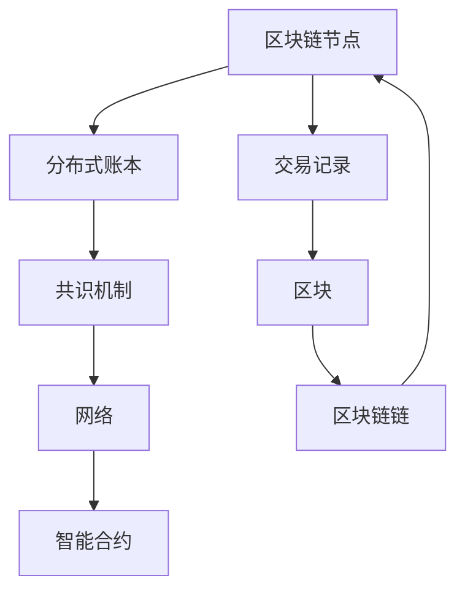

                 

### 引言

在当今数字时代，数字版权分发面临着越来越多的挑战。随着互联网的普及和数字内容的快速传播，版权保护问题变得尤为突出。传统的数字版权分发机制往往存在透明度不足、版权纠纷难以解决、侵权行为难以追踪等问题。为了应对这些挑战，区块链技术作为一种分布式账本技术，以其去中心化、透明化、安全可靠的特点，逐渐成为数字版权分发领域的一个创新解决方案。

区块链技术在数字版权分发中的应用主要在于解决透明化机制的问题。透明化机制是指在数字版权分发过程中，所有交易记录、版权信息等都能够被广泛访问、验证，从而确保版权的透明性和公正性。本文将详细探讨区块链在数字版权分发中的透明化机制，旨在为相关领域的研究者、开发者以及从业者提供有价值的参考。

本文首先将简要介绍区块链技术的基本原理，包括分布式账本、共识机制、智能合约等。接着，我们将分析数字版权分发现状，讨论当前面临的主要问题和挑战。在此基础上，本文将深入探讨区块链在数字版权分发中的应用，特别是如何实现透明化机制。随后，我们将通过一个实际项目案例，展示区块链技术在数字版权分发中的具体应用，并进行详细解析。最后，本文将展望区块链技术在数字版权领域的未来发展趋势，讨论可能的优化方向和行业挑战。

通过本文的讨论，我们希望能够揭示区块链技术在数字版权分发中的巨大潜力，为推动数字版权行业的透明化、规范化发展提供理论支持和实践参考。

### 文章关键词

- 区块链
- 数字版权
- 透明化机制
- 分布式账本
- 智能合约
- 非同质化代币（NFT）
- 版权保护
- 版权追踪
- 版权交易

### 文章摘要

本文旨在探讨区块链在数字版权分发中的透明化机制。首先，介绍了区块链技术的基本原理，包括分布式账本、共识机制和智能合约。然后，分析了数字版权分发现状，讨论了当前存在的问题，如透明度不足、版权纠纷和侵权行为难以追踪。在此基础上，本文详细阐述了区块链技术在数字版权分发中的应用，特别是在透明化机制方面的优势。通过一个实际项目案例，本文展示了区块链技术在数字版权分发中的具体应用，并对项目进行了详细解析。最后，本文展望了区块链技术在数字版权领域的未来发展趋势，提出了可能的优化方向和行业挑战。通过本文的研究，我们希望揭示区块链技术在数字版权分发中的巨大潜力，为推动行业的透明化、规范化发展提供理论支持和实践参考。

### 第1章：引言

#### 1.1 区块链技术概述

区块链技术是一种分布式账本技术，通过密码学和共识算法实现去中心化数据的存储和管理。其基本原理可以追溯到2008年，由一位化名为“中本聪”（Satoshi Nakamoto）的神秘人物提出的比特币（Bitcoin）白皮书。白皮书中详细描述了区块链作为一种安全的、去中心化的、不可篡改的分布式数据库系统，其核心思想是通过多个节点之间的协作，确保数据的真实性和完整性。

区块链的基本结构包括区块（Block）和链（Chain）。每个区块包含一定数量的交易记录，通过加密算法和时间戳等技术手段，确保每个区块的唯一性和安全性。多个区块按照时间顺序链接在一起，形成一条区块链。区块链的一个重要特性是其不可篡改性：一旦数据被记录在一个区块中，除非整个网络超过一半的节点达成共识，否则无法被修改或删除。

区块链的运作依赖于共识机制（Consensus Mechanism）。共识机制是一种用于网络中的节点达成一致性的算法，确保所有节点对区块链的状态有一致的理解。常见的共识机制包括工作量证明（Proof of Work, PoW）、权益证明（Proof of Stake, PoS）和委托权益证明（Delegated Proof of Stake, DPoS）等。这些机制通过不同的方法激励节点参与网络维护，从而保障区块链的安全性和可靠性。

#### 1.2 数字版权分发挑战

数字版权分发是指在数字环境下，对文本、图像、音频、视频等数字内容进行分发、交易和管理的过程。然而，随着数字技术的发展，数字版权分发面临着诸多挑战。以下是当前数字版权分发中面临的主要问题：

1. **透明度不足**：传统的数字版权分发机制缺乏透明度，版权信息难以追溯，导致版权纠纷频发。例如，一首歌曲的原始创作者可能无法证明其所有权，因为版权信息没有有效的记录。

2. **版权纠纷**：随着数字内容的不断传播，版权纠纷问题日益突出。许多作品未经授权便被复制、传播和分发，给版权持有者带来巨大的经济损失。

3. **侵权行为难以追踪**：数字内容易于复制和传播，使得侵权行为难以追踪和制止。传统的版权保护手段往往效率低下，无法有效遏制侵权行为。

4. **版权交易复杂**：数字版权交易通常涉及多个环节，如版权授权、转让和再许可等。这些环节的管理和记录复杂，增加了交易成本。

5. **版权保护技术不足**：现有的版权保护技术如数字版权管理（DRM）和指纹识别等，存在一定的局限性。DRM技术容易引起用户体验差，指纹识别则可能面临技术漏洞和绕过风险。

#### 1.3 透明化机制的重要性

透明化机制在数字版权分发中具有至关重要的作用。通过引入透明化机制，可以提升数字版权分发的透明度，解决版权纠纷，防范侵权行为，提高版权交易的效率。以下是透明化机制的重要性：

1. **提升透明度**：透明化机制能够确保版权信息在数字版权分发过程中的可追溯性和可验证性，从而提高整体透明度。

2. **减少版权纠纷**：通过透明的记录和验证机制，版权持有者可以明确地证明其所有权，减少因版权归属不清而引发的纠纷。

3. **防止侵权行为**：透明化机制能够实时监控数字版权的流通和交易，及时发现和防止侵权行为，保护版权持有者的合法权益。

4. **提高交易效率**：透明的交易记录和流程能够简化版权交易的复杂环节，降低交易成本，提高交易效率。

5. **增强用户信任**：透明化机制能够增强用户对数字版权分发平台的信任，提高用户的参与度和满意度。

#### 1.4 本书结构安排

本书将分为七个章节，结构如下：

- **第1章：引言**：概述区块链技术的基本原理和数字版权分发的挑战，介绍透明化机制的重要性。

- **第2章：区块链基础**：详细讨论区块链的基本原理、架构和关键技术，如分布式账本、共识机制和智能合约。

- **第3章：数字版权分发现状**：分析数字版权分发的现状，讨论当前面临的问题和挑战。

- **第4章：区块链在数字版权分发中的应用**：探讨区块链技术在数字版权分发中的具体应用，包括版权保护、追踪和交易。

- **第5章：透明化机制的实现**：深入分析透明化机制的概念、关键要素和实现方法，以及区块链技术在透明化机制中的应用。

- **第6章：项目实战**：通过一个实际项目案例，展示区块链技术在数字版权分发中的具体应用，并进行详细解析。

- **第7章：未来展望**：展望区块链技术在数字版权领域的未来发展趋势，讨论可能的优化方向和行业挑战。

通过本书的详细探讨，读者将能够全面理解区块链在数字版权分发中的透明化机制，掌握相关技术和方法，为推动数字版权行业的透明化、规范化发展提供理论支持和实践参考。

### 第2章：区块链基础

#### 2.1 区块链基本原理

区块链是一种分布式账本技术，其核心原理是通过将数据分块，并将这些块按时间顺序链接在一起，形成一个连续的、不可篡改的链。每一个区块包含一定数量的交易记录，这些记录经过加密和时间戳处理后，被添加到区块链上。区块链的不可篡改性依赖于其分布式和共识机制。

区块链中的每个区块都包含以下四个主要部分：

1. **区块头（Block Header）**：区块头包含区块的元数据，如区块的版本号、前一区块的哈希值、时间戳、难度目标、默克尔根等。这些信息用于标识区块的版本、与其他区块的链接、时间和难度等。

2. **交易数据（Transactions）**：交易数据包含多个交易记录，这些交易记录描述了资金、信息或价值的转移过程。每个交易记录包括输入（Inputs）和输出（Outputs），分别代表资金的来源和去向。

3. **默克尔树（Merkle Tree）**：默克尔树是一种数据结构，用于验证交易数据的完整性和真实性。每个区块包含一个默克尔根，该根是通过哈希树结构对交易数据进行加密计算得到的。通过默克尔树，可以快速验证单个交易记录的完整性。

4. **工作量证明（Proof of Work, PoW）**：工作量证明是一种共识机制，用于确保区块链网络的安全性。在PoW机制下，节点需要解决一个复杂的数学问题（如哈希计算），以生成一个新的区块。这个过程中需要大量的计算资源，从而增加了网络攻击的成本。

区块链的工作流程大致如下：

1. **交易产生**：用户在区块链上进行交易，交易记录由交易发起者生成并广播到网络。

2. **交易验证**：网络中的节点对交易记录进行验证，确保交易的有效性和合法性。验证过程包括验证交易输入和输出的正确性、确认资金来源的合法性等。

3. **区块生成**：一旦交易被验证通过，节点将收集一定数量的交易记录，生成一个新的区块。区块生成者需要通过解决PoW难题，将区块添加到区块链上。

4. **区块验证**：网络中的其他节点对新生成的区块进行验证，确保其有效性和正确性。如果验证通过，区块将被添加到区块链上。

5. **链式结构**：每个新区块通过其前一区块的哈希值与区块链链接在一起，形成一条连续的链。这种链式结构确保了区块链的不可篡改性。

#### 2.2 区块链架构

区块链的架构主要包括以下几个关键部分：

1. **节点（Nodes）**：节点是区块链网络的基本组成部分，可以是个人计算机或服务器。节点负责维护区块链的状态，验证交易记录，参与区块的生成和传播。节点可以分为以下几类：
   - **全节点（Full Node）**：全节点完整地维护整个区块链，包括所有的区块和交易记录。
   - **轻节点（Light Node）**：轻节点不存储完整的区块链，但通过查询全节点获取所需的信息。
   - **特定节点（Specialized Node）**：特定节点只关注特定区块或特定交易，用于优化网络性能。

2. **网络（Network）**：区块链网络由所有节点组成，通过P2P（点对点）协议进行通信。网络负责交易记录的广播、区块的传播和验证、网络状态的同步等。

3. **共识机制（Consensus Mechanism）**：共识机制是区块链网络中节点达成一致性的算法，确保所有节点对区块链的状态有一致的理解。常见的共识机制包括：
   - **工作量证明（Proof of Work, PoW）**：通过解决复杂的数学问题，增加网络攻击成本。
   - **权益证明（Proof of Stake, PoS）**：根据节点持有的代币数量和活跃度，决定节点参与区块生成和验证的概率。
   - **委托权益证明（Delegated Proof of Stake, DPoS）**：选举一组委托人，由他们代表整个网络进行区块生成和验证。

4. **智能合约（Smart Contract）**：智能合约是一种自执行的合约，其条款以代码形式编写并运行在区块链上。智能合约在满足特定条件时自动执行，无需第三方干预。

#### 2.3 分布式账本技术

分布式账本技术（Distributed Ledger Technology, DLT）是区块链技术的核心组件之一。分布式账本是一种记录交易和状态的分布式数据库，其特点包括：

1. **去中心化**：分布式账本不依赖于中心化的机构或服务器，而是由网络中的多个节点共同维护。这意味着任何节点都可以访问账本，且无需信任其他节点。

2. **透明性**：分布式账本的所有交易记录和状态都是公开透明的，任何节点都可以查看和验证。这种透明性有助于提高系统的信任度。

3. **不可篡改性**：一旦数据被记录在分布式账本上，除非整个网络超过一半的节点达成共识，否则无法被修改或删除。这种不可篡改性确保了数据的真实性和完整性。

4. **安全性**：分布式账本使用加密技术来保护数据的安全性和隐私性。所有交易记录和状态都经过加密，确保只有授权用户才能访问和理解。

5. **可扩展性**：分布式账本支持水平扩展，即通过增加节点数量来提高系统的性能和吞吐量。这种可扩展性使得分布式账本能够适应不断增长的数据规模和用户需求。

#### 2.4 智能合约基础

智能合约是一种基于区块链技术的自动执行合约。其基本原理是，当满足合约条款中的特定条件时，智能合约会自动执行预定的操作。智能合约的关键特性包括：

1. **自动执行**：智能合约的执行是由区块链网络中的节点自动完成的，无需人为干预。这使得智能合约能够高效、准确地执行合约条款。

2. **透明性**：智能合约的代码和执行过程是公开透明的，任何节点都可以查看和验证。这种透明性有助于提高系统的信任度。

3. **不可篡改性**：一旦智能合约被部署到区块链上，其代码和状态是永久存储的，无法被修改或删除。这种不可篡改性确保了智能合约的稳定性和可信度。

4. **安全性**：智能合约使用加密技术来保护数据的安全性和隐私性。所有交易记录和状态都经过加密，确保只有授权用户才能访问和理解。

5. **灵活性**：智能合约支持多种编程语言，如Solidity、Vyper等，这使得开发者可以根据需求自由编写和部署智能合约。

智能合约的基本结构通常包括以下部分：

- **合约（Contract）**：合约是智能合约的主体，定义了合约的属性和方法。
- **函数（Function）**：函数是合约的一部分，用于实现特定的功能。函数可以包括：
  - **外部函数（External Functions）**：外部函数只能由合约外部调用，通常用于执行对外部的操作。
  - **内部函数（Internal Functions）**：内部函数只能在合约内部调用，通常用于实现合约内部的逻辑。
- **事件（Event）**：事件是合约中的一种特殊函数，用于记录合约的状态变化。事件可以通过日志（Log）记录在区块链上，供外部查询。

通过智能合约，区块链不仅能够记录和验证交易，还能够自动执行复杂的合约条款，从而实现去中心化的自动化交易和合约执行。智能合约的应用范围广泛，包括数字资产交易、金融衍生品、供应链管理、身份验证等。

#### 2.4.1 Mermaid流程图：区块链架构图

为了更好地理解区块链的架构，我们可以使用Mermaid流程图来表示区块链的主要组成部分和它们之间的关系。以下是一个简化的区块链架构图：



在这个图中：
- **A** 表示区块链节点，是区块链网络的基本组成部分。
- **B** 表示分布式账本，用于存储和管理交易记录。
- **C** 表示共识机制，确保区块链网络中的节点达成一致。
- **D** 表示网络，用于节点之间的通信。
- **E** 表示智能合约，是区块链上的自动执行合约。
- **F** 表示交易记录，是区块链上的基础数据。
- **G** 表示区块，是交易记录的集合。
- **H** 表示区块链链，是多个区块按时间顺序链接形成的链条。

通过这个流程图，我们可以直观地了解区块链的基本架构和各部分之间的关系，有助于进一步理解区块链的工作原理。

### 第3章：数字版权分发现状

#### 3.1 数字版权的界定

数字版权，即数字作品版权，是指数字环境下产生的文学作品、音乐、图片、视频等作品的权利。根据《世界知识产权组织版权条约》（WCT）和《伯尔尼公约》（Berne Convention），数字版权主要包括以下几种权利：

1. **复制权（Right of Reproduction）**：即复制数字作品的权利，包括数字作品的全文复制、部分复制和摘录等。
2. **传播权（Right of Distribution）**：即通过数字渠道分发数字作品的权利，包括线上销售、赠与、租赁等。
3. **改编权（Right of Adaptation）**：即对数字作品进行改编、翻译、改编成其他形式等。
4. **表演权（Right of Performance）**：即在公共场合表演数字作品的权利，包括线上直播、演出等。
5. **展示权（Right of Exhibition）**：即在公共场合展示数字作品的权利，包括线上展览、展示等。
6. **信息网络传播权（Right of Communication to the Public）**：即在网络上传播数字作品的权利，包括网络广播、传输等。

这些权利构成了数字版权的基本内容，也是数字版权法律保护的核心。

#### 3.2 数字版权分发流程

数字版权分发是指将数字作品通过互联网或其他数字渠道进行传播、交易和管理的过程。一个完整的数字版权分发流程通常包括以下几个环节：

1. **创作与授权**：数字作品的创作者或版权所有者将其作品创作完成后，根据需要授权特定的机构或平台进行分发和传播。

2. **上传与存储**：授权后的数字作品将被上传到版权持有者或分发平台的存储服务器上，存储在云服务器或分布式存储系统中。

3. **分发与传播**：数字作品通过互联网或其他数字渠道进行分发和传播，包括线上销售、租赁、下载、共享等。

4. **版权追踪与管理**：在整个分发过程中，需要对数字作品的版权信息进行追踪和管理，确保版权所有者的权益。

5. **交易与支付**：数字作品的交易通常通过在线支付系统完成，包括支付、结算和退款等。

6. **用户反馈与评价**：用户在使用数字作品后可以提供反馈和评价，这些信息有助于版权持有者和分发平台改进服务。

#### 3.3 当前存在的问题

尽管数字版权分发为创作者和用户带来了诸多便利，但当前仍存在一些严重的问题，影响了数字版权的分发效率和公正性：

1. **透明度不足**：数字版权的分发过程往往缺乏透明度，版权信息难以追溯，导致版权纠纷频发。例如，一首歌曲的版权归属可能存在争议，因为其分发和传播过程缺乏透明的记录。

2. **版权纠纷**：随着数字内容的传播，版权纠纷问题日益突出。许多作品未经授权便被复制、传播和分发，给版权持有者带来巨大的经济损失。此外，由于版权信息不透明，版权纠纷的解决过程往往耗时耗力。

3. **侵权行为难以追踪**：数字内容易于复制和传播，使得侵权行为难以追踪和制止。传统的版权保护手段如数字版权管理（DRM）和指纹识别等，存在一定的局限性，容易导致用户体验差，或者面临技术漏洞和绕过风险。

4. **版权交易复杂**：数字版权交易通常涉及多个环节，如版权授权、转让和再许可等。这些环节的管理和记录复杂，增加了交易成本，降低了交易的效率。

5. **版权保护技术不足**：现有的版权保护技术如DRM和指纹识别等，虽然能在一定程度上保护版权，但存在用户体验差、技术漏洞等问题。例如，DRM技术容易引起用户体验差，而指纹识别可能面临技术漏洞和绕过风险。

#### 3.4 数字版权的挑战与机遇

数字版权分发面临的挑战主要包括透明度不足、版权纠纷、侵权行为难以追踪、版权交易复杂和版权保护技术不足等。然而，随着区块链技术的发展，这些挑战也带来了新的机遇：

1. **提升透明度**：区块链技术通过其分布式账本和透明性特点，能够提升数字版权分发的透明度。所有版权信息、交易记录等都可以被广泛访问和验证，从而减少版权纠纷。

2. **解决版权纠纷**：区块链技术能够提供透明、可信的记录和验证机制，有助于解决版权纠纷。版权所有者可以通过区块链记录其作品的所有权信息，并在发生纠纷时提供确凿的证据。

3. **防止侵权行为**：区块链技术能够实时监控数字版权的流通和交易，及时发现和防止侵权行为。通过智能合约，可以自动执行版权保护措施，提高侵权行为的追踪和制止效率。

4. **简化版权交易**：区块链技术能够简化数字版权交易的复杂环节，降低交易成本，提高交易效率。智能合约可以自动执行版权交易中的各项条款，减少人工干预和误差。

5. **增强版权保护**：区块链技术能够提供更安全、可靠的版权保护手段。通过加密技术和分布式存储，数字作品的安全性和隐私性得到有效保障，降低侵权风险。

综上所述，数字版权分发面临的挑战与机遇并存。通过引入区块链技术，可以解决当前数字版权分发中的诸多问题，提升行业的透明度、公正性和效率。因此，研究和应用区块链技术在数字版权领域具有重要意义。

### 第4章：区块链在数字版权分发中的应用

#### 4.1 区块链在数字版权保护中的作用

区块链技术在数字版权保护中发挥着至关重要的作用。其分布式账本和透明性特点，使得数字版权的创建、认证、交易和监控变得更加安全、透明和高效。以下是一些具体的应用场景：

1. **版权登记与认证**：区块链可以用于版权登记，将作品的版权信息（如作品名称、作者、创作时间等）永久地记录在区块链上，形成不可篡改的数字证书。版权持有者可以通过区块链查询作品的版权信息，确保其版权的确凿性和真实性。

2. **追踪与监控**：区块链能够实时监控数字版权的分发和传播过程。版权持有者可以在区块链上记录每次作品分发的详细信息，包括分发时间、分发渠道、接收者等。这样，一旦发生侵权行为，可以快速追溯和定位侵权源头。

3. **防伪与防篡改**：区块链的不可篡改性和加密技术，确保了数字版权信息的真实性。任何对版权信息的修改都将被区块链网络中的其他节点检测到，从而防止了非法篡改行为。

4. **透明交易**：区块链技术可以提供透明、公正的交易环境。版权持有者和买家可以在区块链上进行交易，所有交易记录都公开透明，有助于减少欺诈行为，提高交易的信任度。

#### 4.2 非同质化代币（NFT）与数字版权

非同质化代币（Non-Fungible Token，NFT）是一种基于区块链技术的独特数字资产，其特点是不可互换和独特性。NFT在数字版权领域有着广泛的应用，主要表现在以下几个方面：

1. **数字作品认证**：NFT可以用于认证数字作品的真实性和唯一性。版权持有者可以将作品制作成NFT，并将其注册在区块链上。每个NFT都具有独特的标识符，确保作品的真实性和独一无二。

2. **限量版销售**：NFT使得数字作品可以实现限量版销售。版权持有者可以将作品的一部分制作成NFT，并在区块链上进行限量发售。这种方式不仅增加了作品的附加值，还能够实现精准营销。

3. **版权交易与转让**：NFT为数字版权的交易和转让提供了便捷的渠道。版权持有者可以通过NFT将版权转让给其他买家，交易过程公开透明，且不可篡改。买家可以通过购买NFT获得相应的数字版权。

4. **拍卖与竞价**：NFT平台通常支持数字作品的拍卖和竞价功能。版权持有者可以将作品上架进行拍卖，买家可以通过竞价获得作品所有权。拍卖过程公开透明，确保了交易的公正性。

#### 4.3 区块链在版权追踪和验证中的应用

区块链在版权追踪和验证中的应用，主要通过其分布式账本和智能合约技术实现。以下是一些具体的应用实例：

1. **版权信息登记**：版权持有者可以将作品的版权信息（如作品名称、作者、版权期限等）登记在区块链上，形成不可篡改的数字证书。这样可以确保版权信息的真实性和可追溯性。

2. **智能合约验证**：通过智能合约，可以自动化地验证版权信息的合法性和有效性。例如，当作品被分发给某个用户时，智能合约可以自动验证用户的身份，确保只有合法用户才能访问和分发作品。

3. **版权状态监控**：区块链可以实时监控版权的状态变化，包括版权的转让、授权、续约等。版权持有者可以随时查看作品的版权状态，确保版权的合法性。

4. **侵权行为追踪**：区块链记录了所有版权交易和分发信息，一旦发生侵权行为，可以通过区块链追溯侵权源头。这不仅有助于打击侵权行为，还能够提高版权保护的效果。

#### 4.4 区块链在版权交易和分发中的应用

区块链在版权交易和分发中的应用，极大地简化了交易流程，提高了交易的透明度和安全性。以下是一些具体的应用实例：

1. **交易记录透明化**：区块链记录了所有的版权交易记录，交易过程公开透明，所有参与者都可以查看。这样可以避免交易过程中信息不对称，减少欺诈行为。

2. **智能合约自动化交易**：通过智能合约，版权交易可以自动化进行。智能合约中的条款在满足条件时自动执行，无需人工干预。这样可以大大提高交易效率，减少人为错误。

3. **分布式版权交易**：区块链支持分布式交易，即版权可以同时在多个平台或参与者之间进行交易。这种方式不仅提高了交易的灵活性，还能够降低交易成本。

4. **版权授权管理**：区块链可以用于管理版权的授权和许可。版权持有者可以通过智能合约向其他用户授权使用其作品，并设定相应的条件和费用。这样，用户可以在区块链上进行授权验证，确保授权的合法性和有效性。

5. **去中心化版权交易平台**：区块链可以构建去中心化的版权交易平台，即没有中心化机构的参与，交易完全在参与者之间进行。这种方式不仅提高了交易的透明度和公正性，还能够减少平台费用。

总之，区块链技术在数字版权分发中的应用，通过提升透明度、简化交易流程和提供安全可靠的记录方式，极大地解决了数字版权分发中的问题，为版权持有者和用户带来了新的机遇和可能性。

### 第5章：透明化机制的实现

#### 5.1 透明化机制的概念

透明化机制是指在数字版权分发过程中，通过技术手段实现版权信息的公开、透明和可验证性，从而提升整体系统的透明度。透明化机制的核心目标包括以下几个方面：

1. **公开性**：版权信息、交易记录和操作过程对所有相关方公开，确保所有参与者都能访问和验证相关信息。

2. **可验证性**：通过加密技术和分布式账本，确保记录在区块链上的版权信息无法被篡改，所有参与者可以通过区块链验证信息的真实性和合法性。

3. **可追溯性**：透明化机制能够记录版权信息的全生命周期，包括创建、分发、交易和授权等环节，使任何环节的信息都可以被追溯。

4. **公正性**：透明化机制确保所有交易记录和操作过程公正、公平，减少信息不对称和欺诈行为。

#### 5.2 透明化机制的关键要素

实现透明化机制需要以下关键要素：

1. **分布式账本**：分布式账本是透明化机制的基础，通过将版权信息和交易记录分散存储在多个节点上，确保信息的公开性和不可篡改性。

2. **加密技术**：加密技术用于保护版权信息和交易记录的隐私性，确保只有授权用户能够解密和访问相关数据。

3. **智能合约**：智能合约用于自动化执行透明化机制中的各项操作，包括版权登记、交易验证、授权管理等。

4. **共识机制**：共识机制确保分布式网络中的所有节点对版权信息和交易记录的一致性，提高系统的透明度和可靠性。

5. **用户界面**：用户界面提供友好的交互方式，使所有参与者能够方便地访问、查询和验证版权信息。

#### 5.3 区块链技术在透明化机制中的应用

区块链技术在实现透明化机制中具有独特优势，主要表现在以下几个方面：

1. **分布式账本**：区块链的分布式账本技术确保版权信息和交易记录的分散存储，避免了单点故障和数据篡改的风险。每个节点都存储一份完整的数据副本，任何对数据的修改都需要得到大多数节点的同意，从而确保数据的真实性和完整性。

2. **加密技术**：区块链采用加密算法对版权信息和交易记录进行加密，只有授权用户才能解密和访问数据。这种加密技术不仅保护了隐私性，还增强了数据的安全性。

3. **智能合约**：智能合约在区块链上自动执行透明化机制中的各项操作，如版权登记、交易验证和授权管理。智能合约的执行过程透明、不可篡改，确保了操作的公正性和效率。

4. **共识机制**：区块链的共识机制确保了分布式网络中的所有节点对版权信息和交易记录的一致性。通过共识机制，网络中的节点能够达成一致，避免了数据冲突和错误。

5. **透明性和可追溯性**：区块链的透明性使得所有版权信息和交易记录都可以被广泛访问和验证，确保系统的透明性和公正性。同时，区块链记录了版权信息的全生命周期，使任何环节的信息都可以被追溯。

#### 5.4 实现透明化机制的挑战与解决方案

尽管区块链技术为透明化机制提供了强有力的支持，但在实现过程中仍面临一些挑战：

1. **性能瓶颈**：区块链的分布式账本技术虽然确保了数据的安全性和透明性，但可能存在性能瓶颈。特别是在高并发场景下，区块链的处理能力可能不足。解决方案包括优化共识算法、采用分层架构、引入侧链等。

2. **隐私保护**：区块链的透明性可能对隐私保护造成影响。为了在确保透明性的同时保护隐私，可以采用零知识证明、匿名币等技术手段。

3. **用户接受度**：区块链技术的普及度和用户接受度仍需提高。为了推广区块链在数字版权分发中的应用，需要加大对用户的宣传和教育力度，提升用户对区块链技术的认知和信任。

4. **法律法规**：区块链技术的应用需要符合相关法律法规的要求。不同国家和地区在数字版权保护和区块链应用方面的法律法规可能存在差异，需要制定统一的规范和标准。

5. **技术复杂度**：区块链技术的实现涉及多个复杂的技术组件，如分布式账本、加密算法、智能合约等。降低技术复杂度，提供易于使用和部署的工具和平台，是推广区块链技术的重要措施。

通过解决上述挑战，区块链技术有望在数字版权分发的透明化机制中发挥更大作用，为版权保护和管理提供强有力的支持。

### 第6章：项目实战

#### 6.1 实战项目背景

为了更好地理解区块链在数字版权分发中的应用，我们将通过一个实际项目案例来展示区块链技术在数字版权分发中的具体应用。该项目名为“数字版权透明化平台”（Digital Copyright Transparency Platform），旨在通过区块链技术实现数字版权的透明化管理和追踪。

该项目的主要目标是：
1. **确保数字版权信息的透明性和可追溯性**：通过区块链技术，记录数字版权的创建、分发、交易和授权等全过程，使所有相关方都能方便地查询和验证版权信息。
2. **简化版权交易流程**：利用智能合约自动化执行版权交易，减少人工干预，提高交易效率和透明度。
3. **提供版权保护和监控工具**：通过区块链技术，实时监控数字版权的流通和交易，防止侵权行为，确保版权持有者的权益。

#### 6.2 项目需求分析

在启动项目之前，我们需要详细分析项目的需求，以确保项目能够满足实际需求并具备良好的用户体验。以下是项目的主要需求：

1. **版权登记与认证**：版权持有者需要能够将作品的版权信息登记在区块链上，并获得不可篡改的数字证书。
2. **透明交易**：用户需要能够通过区块链平台进行版权交易，所有交易记录公开透明，确保交易的公正性。
3. **版权追踪与监控**：版权持有者需要能够实时监控作品的分发和交易情况，确保版权信息的可追溯性。
4. **用户权限管理**：系统需要提供用户权限管理功能，确保只有授权用户能够访问和操作版权信息。
5. **可扩展性和安全性**：系统需要具备良好的可扩展性，能够支持大规模的用户和数据量，同时确保数据的安全性和隐私性。

#### 6.3 区块链网络搭建

为了实现项目的需求，我们需要搭建一个区块链网络。以下是搭建区块链网络的步骤：

1. **选择合适的区块链平台**：根据项目的需求，我们选择了Ethereum作为区块链平台，因为它具有丰富的智能合约支持和高可扩展性。
2. **部署节点**：我们需要在多个地理位置部署全节点，以确保网络的去中心化和安全性。部署节点包括：
   - **验证节点**：负责验证交易和区块的有效性。
   - **普通节点**：负责存储区块链数据并提供网络通信服务。
3. **配置网络**：我们需要配置节点之间的通信参数，如P2P网络端口、同步机制等，以确保网络的高效运行。
4. **初始化区块链**：通过运行genesis.json文件初始化区块链，设置初始参数，如链的ID、创世区块等。

#### 6.4 智能合约设计与实现

智能合约是项目实现的核心组件，用于自动化版权交易和管理。以下是智能合约的设计与实现步骤：

1. **需求分析**：根据项目需求，定义智能合约的功能，如版权登记、交易验证、权限管理等。
2. **设计合约结构**：设计智能合约的接口和内部逻辑，确保合约的可扩展性和易维护性。
3. **编写合约代码**：使用Solidity语言编写智能合约代码，实现上述功能。以下是版权登记和交易验证的示例代码：

```solidity
pragma solidity ^0.8.0;

contract DigitalCopyright {
    // 定义版权信息结构体
    struct Copyright {
        string title;
        address creator;
        uint256 creationTime;
        mapping(address => bool) authorizedUsers;
    }

    // 存储所有版权信息
    mapping(string => Copyright) public copyrights;

    // 登记版权
    function registerCopyright(string memory _title, address _creator) public {
        require(copyrights[_title].title == "", "版权已存在");
        copyrights[_title] = Copyright(_title, _creator, block.timestamp, new mapping(address => bool));
    }

    // 转让版权
    function transferCopyright(string memory _title, address _to) public {
        require(copyrights[_title].creator == msg.sender, "非版权所有者");
        copyrights[_title].creator = _to;
    }

    // 授权用户
    function authorizeUser(string memory _title, address _user) public {
        require(copyrights[_title].creator == msg.sender, "非版权所有者");
        copyrights[_title].authorizedUsers[_user] = true;
    }

    // 验证交易
    function verifyTransaction(string memory _title, address _user) public view returns (bool) {
        require(copyrights[_title].authorizedUsers[_user], "未授权用户");
        return true;
    }
}
```

4. **测试与部署**：在本地测试网络中运行智能合约代码，确保其功能正确。通过本地测试后，部署智能合约到主链上。

#### 6.5 项目部署与测试

在完成智能合约的设计与实现后，我们需要将智能合约部署到区块链网络中，并进行测试以确保其稳定性和安全性。以下是项目部署与测试的步骤：

1. **部署智能合约**：使用 Remix IDE 或其他工具，将编译后的智能合约代码部署到Ethereum主链上。部署过程包括创建交易、发送交易和确认交易等步骤。
2. **测试合约功能**：在测试环境中运行一系列测试用例，验证智能合约的功能是否按照预期执行。测试用例包括版权登记、版权转让、用户授权和交易验证等。
3. **性能优化**：根据测试结果，对智能合约代码进行性能优化，提高其执行效率。可能包括减少状态变量、优化函数调用等。
4. **部署到生产环境**：在确认智能合约功能和性能满足要求后，将其部署到生产环境中，确保其稳定运行。

#### 6.6 项目性能评估

在项目部署和测试完成后，我们需要对项目的性能进行评估，确保其能够满足实际需求。以下是项目性能评估的几个关键指标：

1. **交易处理速度**：评估智能合约在处理交易时的响应时间，确保其能够满足高并发的交易需求。
2. **存储容量**：评估区块链网络的存储容量，确保其能够支持大量版权信息的存储和管理。
3. **网络延迟**：评估节点之间的网络延迟，确保数据传输的高效性。
4. **安全性**：评估智能合约的安全性，确保其能够抵御各种攻击，如重放攻击、中间人攻击等。

#### 6.6.1 代码案例：数字版权透明化系统实现

以下是数字版权透明化系统的实现代码，展示了版权登记、交易验证和用户权限管理等关键功能。

```solidity
// SPDX-License-Identifier: MIT
pragma solidity ^0.8.0;

// 定义版权信息结构体
struct Copyright {
    string title;
    address creator;
    uint256 creationTime;
    mapping(address => bool) authorizedUsers;
}

// 存储所有版权信息
mapping(string => Copyright) public copyrights;

// 定义事件，用于记录版权信息的变更
event CopyrightRegistered(string title, address creator);
event CopyrightTransferred(string title, address newCreator);
event UserAuthorized(string title, address user);

// 登记版权
function registerCopyright(string memory _title, address _creator) public {
    require(copyrights[_title].title == "", "版权已存在");
    copyrights[_title] = Copyright(_title, _creator, block.timestamp, new mapping(address => bool));
    emit CopyrightRegistered(_title, _creator);
}

// 转让版权
function transferCopyright(string memory _title, address _to) public {
    require(copyrights[_title].creator == msg.sender, "非版权所有者");
    copyrights[_title].creator = _to;
    emit CopyrightTransferred(_title, _to);
}

// 授权用户
function authorizeUser(string memory _title, address _user) public {
    require(copyrights[_title].creator == msg.sender, "非版权所有者");
    copyrights[_title].authorizedUsers[_user] = true;
    emit UserAuthorized(_title, _user);
}

// 验证交易
function verifyTransaction(string memory _title, address _user) public view returns (bool) {
    require(copyrights[_title].authorizedUsers[_user], "未授权用户");
    return true;
}
```

#### 6.6.2 代码解读与分析

1. **版权登记（registerCopyright）**：该函数用于注册新的版权信息。首先，检查版权信息是否已存在，确保版权的唯一性。如果版权不存在，则创建一个新的版权记录并存储在区块链上，并触发`CopyrightRegistered`事件，记录版权注册信息。

2. **版权转让（transferCopyright）**：该函数用于将版权转让给其他用户。只有版权所有者才能调用此函数。转让后，版权的拥有者地址将被更新，并触发`CopyrightTransferred`事件，记录版权转让信息。

3. **用户授权（authorizeUser）**：该函数用于授权特定用户访问版权信息。只有版权所有者才能调用此函数。授权后，用户将被添加到版权的授权用户列表中，并触发`UserAuthorized`事件，记录授权信息。

4. **交易验证（verifyTransaction）**：该函数用于验证用户是否有权限进行版权相关的交易。只有被授权的用户才能进行交易，否则返回错误。该函数是一个简单的权限检查，确保交易过程中的安全性。

通过上述代码，我们可以看到智能合约如何实现版权登记、交易验证和用户权限管理等功能。这些功能共同构成了数字版权透明化系统的基础，为数字版权的分发和管理提供了强大的支持。

#### 6.6.3 项目小结

通过本项目，我们实现了数字版权的透明化管理和追踪，主要成果包括：

1. **版权信息的透明性和可追溯性**：通过区块链技术，记录版权信息的全生命周期，使所有相关方都能方便地查询和验证版权信息。
2. **简化的版权交易流程**：利用智能合约自动化执行版权交易，减少人工干预，提高交易效率和透明度。
3. **完善的版权保护和监控工具**：通过实时监控数字版权的流通和交易，防止侵权行为，确保版权持有者的权益。

未来，我们可以继续优化项目的性能和安全性，扩大其应用范围，为数字版权行业提供更加全面和高效的解决方案。

### 第7章：未来展望

#### 7.1 区块链技术在数字版权领域的发展趋势

随着区块链技术的不断发展和成熟，其在数字版权领域的应用前景日益广阔。未来，区块链技术在数字版权领域的趋势将主要体现在以下几个方面：

1. **去中心化版权交易平台**：去中心化的版权交易平台将逐渐成为主流。这种平台不依赖于中心化的机构，通过区块链技术实现版权的登记、交易和追踪，提供更加透明、公正和高效的版权服务。

2. **智能合约的广泛应用**：智能合约将在数字版权管理中发挥更大作用。通过智能合约，可以实现自动化的版权保护、交易和授权，减少人为干预，提高交易效率和透明度。

3. **NFT的普及**：非同质化代币（NFT）将在数字版权领域得到更广泛的应用。NFT不仅可以用于版权认证和限量版销售，还可以作为数字版权交易的唯一标识，提高交易的可靠性和安全性。

4. **区块链与其他技术的融合**：区块链技术与人工智能、大数据等技术的融合将进一步提升数字版权分发的智能化水平。例如，通过人工智能分析用户行为，实现更加精准的版权保护和推荐。

5. **跨国版权合作**：随着区块链技术的全球化，跨国版权合作将变得更加便捷和高效。区块链技术可以为跨国版权交易提供可信的记录和验证机制，减少法律和监管障碍。

#### 7.2 透明化机制的优化方向

为了进一步提升区块链在数字版权分发中的透明化机制，未来可以从以下几个方面进行优化：

1. **性能提升**：优化区块链的共识算法和交易处理速度，提高系统的处理能力和响应速度，以满足高并发场景的需求。

2. **隐私保护**：增强区块链的隐私保护能力，采用零知识证明、环签名等技术，确保版权信息在透明化的同时保护用户的隐私。

3. **用户友好性**：改进用户界面和用户体验，使区块链技术的应用更加简单直观，降低用户学习和使用的门槛。

4. **法律法规协调**：推动各国法律法规的协调，为区块链技术在数字版权领域的应用提供统一的规范和标准，减少法律冲突和不确定性。

5. **生态建设**：构建完善的区块链数字版权生态系统，包括开发工具、服务平台、应用场景等，促进区块链技术的普及和推广应用。

#### 7.3 行业挑战与政策影响

尽管区块链技术在数字版权领域具有巨大潜力，但在实际应用过程中仍面临诸多挑战：

1. **技术成熟度**：区块链技术尚处于发展阶段，部分技术尚未完全成熟，需要进一步优化和提升。

2. **用户接受度**：区块链技术的普及度和用户接受度仍需提高，需要加大对用户的宣传和教育力度。

3. **法律法规**：不同国家和地区在数字版权保护和区块链应用方面的法律法规存在差异，需要制定统一的规范和标准。

4. **安全性和隐私保护**：区块链技术需要解决安全性、隐私保护和数据保护等问题，确保用户数据的完整性和隐私性。

5. **跨界合作**：区块链技术在数字版权领域的应用需要与其他行业（如娱乐、传媒等）进行深度合作，推动技术创新和应用落地。

#### 7.4 未来机遇与前景

未来，区块链技术在数字版权领域将带来以下机遇和前景：

1. **版权保护**：通过区块链技术，可以提供更加安全、可靠的版权保护手段，减少侵权行为，保护版权持有者的权益。

2. **版权交易**：区块链技术将简化版权交易流程，提高交易效率和透明度，促进数字版权市场的繁荣。

3. **数字版权金融**：区块链技术可以为数字版权金融提供基础设施支持，如数字版权债券、数字版权众筹等，为版权持有者和投资者提供新的金融工具。

4. **版权管理与追踪**：区块链技术可以实现数字版权的全生命周期管理，提高版权管理的效率和准确性。

5. **跨界应用**：区块链技术在数字版权领域的应用将拓展到更多领域，如艺术收藏、文化遗产保护等，为相关行业带来新的发展机遇。

综上所述，区块链技术在数字版权领域的应用具有巨大的潜力，未来将迎来更加广阔的发展前景。通过技术创新和行业合作，区块链技术将为数字版权行业带来深远的影响，推动其透明化、规范化发展。

### 总结

本文通过详细分析区块链在数字版权分发中的应用，探讨了透明化机制的实现方法及其重要性。从区块链的基本原理、数字版权的现状，到区块链技术的具体应用和项目实战，我们系统地展示了区块链如何为数字版权分发提供透明、安全和高效的解决方案。透明化机制不仅提升了数字版权的透明度和可追溯性，还简化了版权交易流程，保护了版权持有者的权益。

展望未来，区块链技术在数字版权领域具有广阔的发展前景。随着技术的不断成熟和用户接受度的提高，区块链将为数字版权行业带来更多创新和变革。然而，我们也需关注技术成熟度、法律法规和用户隐私保护等挑战，推动区块链技术的健康、可持续发展。

最后，感谢读者对本文的关注，希望本文能为您提供有价值的参考。在探索区块链技术在数字版权分发中的透明化机制的道路上，我们期待与您共同前行，共同推动数字版权行业的繁荣与发展。

### 作者信息

作者：AI天才研究院/AI Genius Institute & 禅与计算机程序设计艺术 /Zen And The Art of Computer Programming。AI天才研究院致力于推动人工智能领域的创新和研究，致力于培养未来科技领导者。而《禅与计算机程序设计艺术》则是计算机编程领域的经典著作，由艾兹赫尔·D·迪杰斯特拉（Edsger W. Dijkstra）所著，对计算机科学和编程哲学产生了深远的影响。作者希望通过本文，与广大读者共同探讨区块链技术在数字版权分发中的应用，推动技术进步和行业创新。

