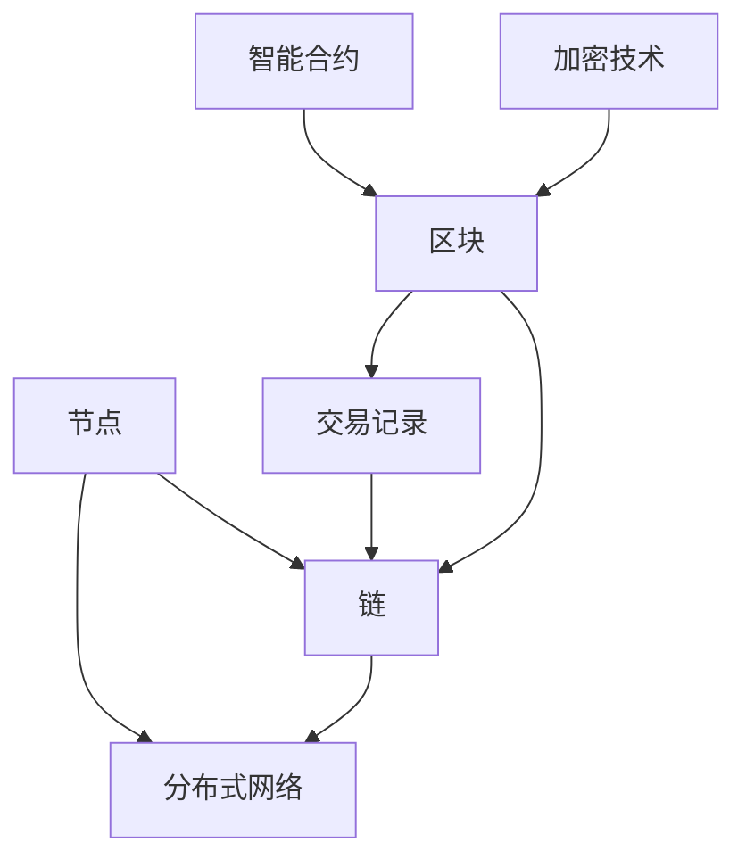
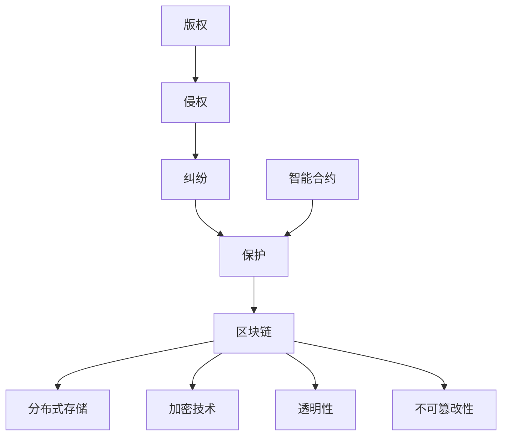

                 

### 关键词

区块链、数字版权管理、加密技术、智能合约、分布式存储、共识机制、版权保护、透明性、安全性、隐私保护、智能合约编程、法律与政策。

### 摘要

本文深入探讨了区块链技术在数字版权管理中的应用，旨在分析区块链如何通过其独特的特性解决传统数字版权管理面临的挑战。文章首先介绍了区块链与数字版权管理的基本概念，随后详细阐述了区块链的核心技术，如加密技术、分布式存储和智能合约。接着，本文分析了区块链在数字版权管理中的优势，包括安全性、透明性和不可篡改性。随后，通过具体案例，展示了区块链在音乐、电影和电子书版权管理中的应用。文章最后，讨论了数字版权管理系统设计原则和实现步骤，以及法律和政策方面的考量，对未来区块链在数字版权管理中的发展进行了展望。

### 目录大纲

1. **引言**
   - 区块链与数字版权管理概述
   - 文章目的与结构

2. **区块链技术基础**
   - 区块链的基本原理
   - 区块链的核心技术
   - 区块链的共识机制

3. **数字版权管理的挑战与机遇**
   - 数字版权管理的现状与挑战
   - 区块链在数字版权管理中的机遇

4. **区块链在数字版权管理中的应用案例**
   - 音乐版权管理
   - 电影版权管理
   - 电子书版权管理

5. **数字版权管理系统的设计与实现**
   - 系统设计原则
   - 系统架构设计
   - 系统实现步骤

6. **数字版权管理的法律与政策**
   - 法律法规概述
   - 区块链技术的法律问题
   - 政策引导与建议

7. **未来展望与挑战**
   - 发展趋势
   - 技术挑战
   - 法律挑战

8. **结论**
   - 研究总结
   - 应用建议

### 1. 引言

#### 区块链与数字版权管理概述

区块链技术作为近年来迅速发展的新兴技术，以其去中心化、安全透明、不可篡改等特性，逐渐成为解决数字版权管理问题的关键工具。数字版权管理，简称DRM（Digital Rights Management），是指通过技术手段保护数字作品版权，确保版权拥有者在作品传播和使用中的权益。随着互联网和数字技术的普及，数字版权管理面临诸多挑战，如版权侵权、内容盗用、版权纠纷等。

区块链技术的出现为数字版权管理提供了一种全新的解决方案。区块链的去中心化特性确保了版权信息不可篡改，透明性保证了版权交易的公开透明，加密技术和智能合约则为版权保护和交易提供了强有力的工具。

本文旨在深入探讨区块链在数字版权管理中的应用，分析其技术原理、应用案例、设计实现和法律政策等方面的内容。文章首先介绍区块链与数字版权管理的基本概念，然后详细讲解区块链的核心技术，接着分析区块链在数字版权管理中的优势，最后讨论数字版权管理系统设计实现和法律政策等方面的挑战与机遇。

#### 文章目的与结构

本文的目的在于为读者提供一个全面、系统的区块链在数字版权管理中应用的指南。文章结构如下：

1. **引言**：概述区块链与数字版权管理的基本概念，介绍文章的目的和结构。
2. **区块链技术基础**：详细讲解区块链的基本原理、核心技术及共识机制。
3. **数字版权管理的挑战与机遇**：分析数字版权管理的现状、挑战以及区块链带来的机遇。
4. **区块链在数字版权管理中的应用案例**：通过具体案例展示区块链在数字版权管理中的应用。
5. **数字版权管理系统的设计与实现**：介绍数字版权管理系统的设计原则和实现步骤。
6. **数字版权管理的法律与政策**：探讨区块链技术在数字版权管理中的法律问题及政策引导。
7. **未来展望与挑战**：分析区块链在数字版权管理中的发展趋势、技术挑战和法律挑战。
8. **结论**：总结全文，提出应用建议。

通过本文的阅读，读者将全面了解区块链在数字版权管理中的应用，掌握相关技术原理和设计实现方法，为未来的研究和应用提供参考。

### 2. 区块链技术基础

#### 区块链的基本原理

区块链是一种分布式账本技术，通过去中心化的方式实现数据的存储和传输。其基本原理可以概括为以下几方面：

1. **去中心化**：传统中心化系统依赖一个中心节点来管理数据，而区块链通过分布式网络来实现数据的存储和管理，每个节点都拥有完整的区块链副本，从而避免了单点故障和中心化风险。
   
2. **数据结构**：区块链采用链式数据结构，每个区块都包含一定数量的交易记录，每个区块通过哈希值与前一个区块链接，形成一条不断延伸的区块链。这种结构确保了数据不可篡改，因为一旦某个区块被修改，其后的所有区块都会受到影响，这需要超过网络中大多数节点的计算能力，几乎不可能实现。

3. **加密技术**：区块链使用非对称加密技术来确保数据的安全传输和存储。每个节点都有公钥和私钥，公钥用于接收信息，私钥用于签名和验证信息。这种加密方式确保了信息的机密性和完整性。

4. **共识机制**：区块链网络通过共识机制来确保所有节点对数据的一致性。常见的共识机制包括工作量证明（PoW）、权益证明（PoS）和委托权益证明（DPoS）等。共识机制的核心目标是确保网络中的所有节点都能达成一致，防止双花攻击和数据篡改。

#### 区块链的核心技术

区块链的核心技术包括加密技术、分布式存储和智能合约等，以下详细阐述：

1. **加密技术**：区块链使用非对称加密技术来保护数据传输和存储。公钥加密和私钥签名是区块链中最常用的加密方式。公钥加密用于确保数据的机密性，私钥签名用于确保数据的完整性和身份验证。

   - **公钥加密**：发送方使用接收方的公钥对数据进行加密，只有接收方拥有对应的私钥才能解密数据。这种方式确保了数据的保密性。
   - **私钥签名**：发送方使用自己的私钥对数据进行签名，接收方可以使用发送方的公钥验证签名的有效性。这种方式确保了数据的完整性和身份认证。

2. **分布式存储**：区块链通过分布式存储技术来实现数据的存储。每个节点都存储完整的区块链数据，数据在节点之间通过网络传输和验证。分布式存储的优点包括：
   - **去中心化**：避免了单点故障和中心化风险。
   - **容错性**：某个节点的故障不会影响整个网络的数据存储和运行。
   - **数据冗余**：多个节点存储相同的数据，提高了数据的可靠性和安全性。

3. **智能合约**：智能合约是区块链上的自动执行合约，其行为受编程逻辑控制。智能合约通过区块链上的加密技术和分布式网络来确保合同的执行和存储。智能合约的核心特点包括：
   - **自动执行**：智能合约一旦被触发，就会按照预定的编程逻辑自动执行，无需人工干预。
   - **不可篡改**：智能合约一旦被写入区块链，就不可篡改，确保了合同的可信性。
   - **透明性**：智能合约的执行过程对所有节点公开透明，确保了合同执行的公正性。

#### 区块链的共识机制

区块链的共识机制是确保网络中所有节点对数据一致性的一种机制。不同的区块链系统采用不同的共识机制，以下介绍几种常见的共识机制：

1. **工作量证明（PoW）**：工作量证明是比特币采用的共识机制，通过解决计算难题来证明节点的工作量，从而获得记账权。PoW机制的特点包括：
   - **公平性**：所有节点都有机会参与竞争，获得记账权。
   - **安全性**：计算难题确保了网络攻击的成本高昂，提高了网络的安全性。
   - **去中心化**：PoW机制通过分布式计算确保了网络的去中心化。

2. **权益证明（PoS）**：权益证明是另一种常见的共识机制，通过节点持有的代币数量和锁定时间来决定记账权。PoS机制的特点包括：
   - **效率高**：与PoW机制相比，PoS机制无需进行大量的计算，因此效率更高。
   - **公平性**：持有代币越多的节点，获得记账权的概率越高，确保了公平性。
   - **安全性**：通过锁定代币，增加了节点的安全性。

3. **委托权益证明（DPoS）**：委托权益证明是一种改进的PoS机制，通过选举产生记账节点，而不是随机选择。DPoS机制的特点包括：
   - **决策效率高**：通过选举机制，提高了网络的决策效率。
   - **公平性**：持有代币的节点可以通过投票方式参与决策，确保了公平性。
   - **安全性**：选举机制和代币锁定增加了网络的安全性。

#### 核心概念与联系

区块链中的核心概念包括区块、链、节点、加密技术、智能合约等。这些概念之间的关系可以用以下Mermaid流程图表示：



- **区块（Block）**：区块是区块链的基本组成单元，包含一定数量的交易记录以及一个指向前一个区块的哈希值。
- **链（Chain）**：链是由一系列按顺序排列的区块组成的，每个区块通过哈希值与前一个区块链接，形成一条完整的区块链。
- **节点（Node）**：节点是区块链网络中的参与者，每个节点都存储完整的区块链数据，并通过网络与其他节点通信。
- **加密技术（Cryptography）**：加密技术用于保护区块链中的数据传输和存储，包括非对称加密、哈希函数等。
- **智能合约（Smart Contract）**：智能合约是区块链上的自动执行合约，通过编程逻辑控制合同的执行。

通过以上流程图，我们可以清晰地看到区块链中各个核心概念之间的关系和作用。

### 3. 数字版权管理的挑战与机遇

#### 数字版权管理的现状与挑战

数字版权管理在当今互联网时代面临诸多挑战。以下是数字版权管理中常见的一些挑战：

1. **版权侵权**：随着互联网的普及，数字作品的传播速度和范围大大增加，导致版权侵权行为日益猖獗。版权侵权包括未经授权的复制、传播、展示和分发等行为。

2. **内容盗用**：一些不法分子通过非法手段获取数字内容，然后进行修改、二次创作或盗用，严重损害了原创者的权益。

3. **版权纠纷**：数字版权纠纷频繁发生，主要原因是版权认定困难、侵权证据收集困难以及法律适用问题等。

4. **版权保护难度大**：传统的数字版权管理手段如DRM（数字版权管理）、版权声明、版权追踪等，难以有效防止侵权行为，且存在用户体验差、管理成本高等问题。

#### 区块链在数字版权管理中的机遇

区块链技术的出现为解决数字版权管理中的挑战提供了新的机遇：

1. **安全性**：区块链的去中心化和加密技术确保了数据的存储和传输安全，能有效防止版权侵权行为。

2. **透明性**：区块链的透明性使得版权信息对所有节点公开透明，有利于版权认定和纠纷解决。

3. **不可篡改性**：区块链的不可篡改性确保了版权信息的准确性和可靠性，防止了数据篡改和造假。

4. **智能合约**：区块链上的智能合约可以自动执行版权交易和授权，提高了版权保护和管理效率。

5. **分布式存储**：区块链的分布式存储技术使得版权信息在多个节点上备份和存储，提高了数据的可靠性和可访问性。

#### 核心概念与联系

数字版权管理中的核心概念包括版权、侵权、纠纷、保护、智能合约等。这些概念之间的关系可以用以下Mermaid流程图表示：



- **版权（Copyright）**：版权是原创者对其创作作品的专有权利，包括复制权、传播权、展示权等。
- **侵权（Infringement）**：侵权是指未经授权使用他人作品的行为，包括复制、传播、展示等。
- **纠纷（Dispute）**：纠纷是指因版权问题引发的争议和冲突。
- **保护（Protection）**：保护是指通过技术手段和法律手段确保版权不受侵害。
- **智能合约（Smart Contract）**：智能合约是区块链上的自动执行合约，用于执行版权交易和授权。
- **区块链（Blockchain）**：区块链是一种分布式账本技术，用于存储和传输版权信息。
- **分布式存储（Distributed Storage）**：分布式存储用于确保版权信息在多个节点上备份和存储。
- **加密技术（Cryptography）**：加密技术用于保护版权信息的机密性和完整性。
- **透明性（Transparency）**：透明性确保了版权信息对所有节点公开透明。
- **不可篡改性（Immutability）**：不可篡改性确保了版权信息的准确性和可靠性。

通过以上流程图，我们可以清晰地看到数字版权管理中各个核心概念之间的关系和作用。

### 4. 区块链在数字版权管理中的应用案例

#### 音乐版权管理

音乐版权管理是区块链技术在数字版权管理中应用的一个重要领域。以下是一个具体的应用案例：

1. **背景介绍**：音乐版权管理面临的主要问题是侵权和版权纠纷。音乐作品一旦被上传到互联网，很容易被未经授权的网站或个人下载、传播，导致原创者权益受损。

2. **应用方案**：使用区块链技术，音乐版权管理可以实现以下功能：
   - **版权登记**：音乐作品创作者可以通过区块链将版权信息进行登记，确保版权的真实性和唯一性。
   - **交易记录**：区块链记录了每一次音乐作品的交易和授权记录，确保交易的透明性和不可篡改性。
   - **智能合约**：智能合约自动执行音乐作品的授权和支付，简化了版权交易流程。

3. **实际案例**：区块链平台如Musicoin和Ujo Music就是基于区块链技术的音乐版权管理平台。这些平台通过区块链技术，为音乐人和版权方提供了一个去中心化的版权交易平台，实现了版权登记、交易和授权的自动化。

#### 电影版权管理

电影版权管理是另一个区块链技术应用的典型领域。以下是一个具体的应用案例：

1. **背景介绍**：电影制作和发行过程中，版权管理复杂且成本高昂。传统的版权管理方式存在信息不透明、纠纷处理困难等问题。

2. **应用方案**：区块链技术可以用于电影版权管理的以下方面：
   - **版权登记**：电影制作方可以通过区块链技术将电影版权信息进行登记，确保版权信息的准确性和唯一性。
   - **版权监控**：区块链记录了每一次电影作品的播放、下载、传播等行为，为版权方提供了实时的监控工具。
   - **智能合约**：智能合约用于自动执行电影版权交易和授权，提高了交易效率和透明度。

3. **实际案例**：Chainlink和The Movie Blockchain是两个基于区块链技术的电影版权管理平台。这些平台通过区块链技术，为电影制作方、发行方和版权方提供了一个透明、高效、安全的版权管理解决方案。

#### 电子书版权管理

电子书版权管理也是区块链技术应用的一个重要领域。以下是一个具体的应用案例：

1. **背景介绍**：电子书版权管理面临的主要问题是版权保护难度大、侵权行为频繁。传统的数字版权管理手段难以有效保护电子书的版权。

2. **应用方案**：区块链技术可以用于电子书版权管理的以下方面：
   - **版权登记**：电子书创作者可以通过区块链技术将版权信息进行登记，确保版权信息的准确性和唯一性。
   - **版权追踪**：区块链记录了每一次电子书的下载、阅读、传播等行为，为创作者提供了实时的版权追踪工具。
   - **智能合约**：智能合约用于自动执行电子书的授权和支付，简化了版权交易流程。

3. **实际案例**：Blockpass和OpenBook是两个基于区块链技术的电子书版权管理平台。这些平台通过区块链技术，为电子书创作者和读者提供了一个安全、透明、高效的版权保护和管理解决方案。

#### 案例总结

通过以上案例，我们可以看到区块链技术在数字版权管理中的应用不仅能够提高版权保护和管理效率，还能够降低成本、简化流程。区块链的透明性、不可篡改性和智能合约功能为数字版权管理提供了一种全新的解决方案，为版权方和创作者带来了巨大的利益。

### 5. 数字版权管理系统的设计与实现

#### 系统设计原则

数字版权管理系统设计应遵循以下原则：

1. **安全性**：确保系统数据的安全存储和传输，防止未经授权的访问和篡改。
2. **透明性**：系统操作过程应公开透明，便于用户查看和管理版权信息。
3. **可扩展性**：系统设计应具备良好的可扩展性，以适应未来业务增长和功能扩展。
4. **用户体验**：系统界面应简洁友好，操作流程应便捷高效，以提高用户使用体验。

#### 系统架构设计

数字版权管理系统通常采用三层架构设计，包括数据层、服务层和表现层。

1. **数据层**：数据层负责数据的存储和管理，使用区块链技术实现数据的安全存储和分布式备份。区块链节点存储完整的版权信息，包括版权登记、交易记录、授权信息等。

2. **服务层**：服务层负责系统的业务逻辑处理，包括版权登记、版权交易、版权追踪等功能。服务层通过智能合约实现自动化处理，提高了系统效率和透明性。

3. **表现层**：表现层负责用户界面的展示和交互，包括用户注册、版权登记、版权查询、交易支付等功能。用户通过表现层可以方便地管理版权信息和进行相关操作。

#### 系统实现步骤

1. **需求分析**：分析用户需求和业务流程，确定系统功能和性能要求。

2. **设计系统架构**：根据需求分析结果，设计系统的数据层、服务层和表现层架构。

3. **开发数据层**：使用区块链技术实现数据层的功能，包括版权信息登记、存储和分布式备份。

4. **开发服务层**：使用智能合约实现服务层的业务逻辑，包括版权交易、授权、追踪等功能。

5. **开发表现层**：使用前端技术实现用户界面，包括注册、登录、版权管理等功能。

6. **集成与测试**：将数据层、服务层和表现层集成，进行系统测试和功能验证。

7. **部署与上线**：将系统部署到服务器，进行上线运营。

#### 开发环境搭建

搭建数字版权管理系统开发环境，通常需要以下工具和软件：

1. **区块链平台**：选择适合的区块链平台，如Ethereum、Hyperledger Fabric等。
2. **智能合约开发工具**：如Truffle、Ganache等。
3. **前端开发框架**：如React、Vue等。
4. **后端开发框架**：如Node.js、Django等。
5. **数据库**：使用区块链数据库进行数据存储和管理。

#### 源代码详细实现和代码解读

以下是一个简单的区块链版权登记和交易的示例代码：

```python
# 引入智能合约库
from web3 import Web3

# 连接到区块链节点
w3 = Web3(Web3.HTTPProvider('https://mainnet.infura.io/v3/your_project_id'))

# 部署智能合约
contract = w3.eth.contract(abi=your_contract_abi, address=your_contract_address)

# 注册版权
def register_copyright(title, author):
    tx_hash = contract.functions.registerCopyright(title, author).transact({'from': w3.eth.account.privateKeyToAccount('your_private_key')})
    w3.eth.waitForTransaction(tx_hash)
    print("Copyright registered successfully!")

# 查询版权
def get_copyright(title):
    result = contract.functions.getCopyright(title).call()
    print("Copyright information:", result)

# 交易版权
def trade_copyright(title, buyer):
    tx_hash = contract.functions.tradeCopyright(title, buyer).transact({'from': w3.eth.account.privateKeyToAccount('your_private_key')})
    w3.eth.waitForTransaction(tx_hash)
    print("Copyright traded successfully!")

# 使用示例
register_copyright("My Book", "John Doe")
get_copyright("My Book")
trade_copyright("My Book", "Jane Smith")
```

#### 代码应用解读与分析

以上代码演示了如何使用区块链智能合约进行版权的注册、查询和交易。主要步骤如下：

1. **连接区块链节点**：使用Web3库连接到区块链节点，并获得智能合约的接口。
2. **部署智能合约**：通过abi和合约地址，获得智能合约对象。
3. **注册版权**：调用智能合约的`registerCopyright`函数，将版权信息（书名和作者）登记到区块链上。
4. **查询版权**：调用智能合约的`getCopyright`函数，查询特定书名的版权信息。
5. **交易版权**：调用智能合约的`tradeCopyright`函数，将版权转让给新的购买者。

通过以上步骤，我们可以实现版权的自动化登记和交易，提高了版权管理效率和透明度。

#### 实际案例分析和详细讲解剖析

以下是一个实际案例，分析如何使用区块链技术实现数字版权管理：

1. **案例背景**：一家电子书出版社使用区块链技术管理其数字版权，确保版权保护和交易透明。

2. **案例步骤**：
   - **版权登记**：出版社将每一本电子书的版权信息（书名、作者、版权期限等）通过区块链平台进行登记。
   - **版权监控**：通过区块链平台，出版社可以实时监控电子书的下载、阅读和传播行为。
   - **版权交易**：当电子书需要转让给新用户时，出版社使用智能合约自动执行交易，确保交易透明和不可篡改。

3. **案例分析**：
   - **安全性**：区块链技术确保了电子书版权信息的存储和传输安全，防止数据篡改和侵权行为。
   - **透明性**：区块链平台记录了每一次电子书的交易和授权行为，确保了版权交易的透明性。
   - **效率**：智能合约自动执行版权交易，简化了交易流程，提高了版权管理效率。

通过以上案例分析，我们可以看到区块链技术在数字版权管理中具有显著的优势，为出版社提供了高效、透明和安全的版权管理解决方案。

#### 项目小结

数字版权管理系统设计实现是一个复杂的过程，涉及区块链技术、智能合约编程、前端和后端开发等多个方面。通过以上步骤和案例分析，我们可以看到区块链技术在数字版权管理中的应用优势和实现方法。未来，随着区块链技术的不断发展和完善，数字版权管理将更加高效、透明和安全。

### 6. 数字版权管理的法律与政策

#### 法律法规概述

数字版权管理涉及的法律问题复杂，各国法律体系对数字版权的保护各有不同。以下是几个主要国家和地区的法律法规概述：

1. **美国**：美国版权法（Copyright Act）为数字版权提供了全面的法律保护。1998年，美国通过了《数字千年版权法案》（DMCA），旨在保护数字作品版权。DMCA规定了反盗版技术（DRM）的保护、版权侵权例外以及版权持有者的通知和删除程序。

2. **欧盟**：欧盟颁布了《信息社会版权指令》（Copyright Directive），对数字版权管理进行了详细规定。指令要求成员国确保版权持有者的权利，包括复制权、传播权等。此外，欧盟还通过了《统一版权法》（UCD），旨在统一成员国的版权法律。

3. **中国**：中国著作权法（Copyright Law）为数字作品提供了版权保护。2013年，中国通过了《信息安全法》，加强对数字版权的管理和保护。近年来，中国还出台了一系列相关政策，如《关于深入推进著作权侵权行政处罚制度改革的意见》等，以打击版权侵权行为。

#### 区块链技术的法律问题

区块链技术在数字版权管理中的应用也引发了一系列法律问题，主要包括：

1. **版权认定**：区块链记录了版权信息，但如何证明某个作品在区块链上的确权时间仍存在争议。现有法律体系对于版权认定的标准和方法尚未明确。

2. **侵权判定**：区块链的透明性和不可篡改性使得侵权判定变得复杂。如何界定哪些行为构成侵权，以及如何追究侵权责任，需要进一步的法律明确。

3. **司法管辖**：区块链技术具有跨国特性，涉及跨国版权纠纷时，司法管辖问题成为难点。不同国家和地区的法律体系和司法程序不同，如何协调和解决跨国版权纠纷需要国际合作和法律框架。

#### 政策引导与建议

为了推动区块链技术在数字版权管理中的应用，以下是一些建议：

1. **完善法律法规**：各国应进一步完善数字版权相关法律法规，明确区块链技术在版权保护中的应用规则，为区块链技术在数字版权管理中的法律问题提供明确指引。

2. **建立国际标准**：国际社会应加强合作，建立统一的区块链技术在数字版权管理中的国际标准和规范，促进跨国版权纠纷的解决。

3. **加强执法力度**：政府和执法机构应加强版权执法力度，严厉打击版权侵权行为，保护版权持有者的合法权益。

4. **推广区块链教育**：提高公众对区块链技术和数字版权管理的认知，通过教育和培训，培养专业的区块链技术和法律人才。

### 7. 未来展望与挑战

#### 发展趋势

区块链技术在数字版权管理中的应用具有广阔的发展前景，未来可能的发展趋势包括：

1. **技术成熟**：随着区块链技术的不断发展和完善，其性能和安全性将得到进一步提升，为数字版权管理提供更可靠的保障。

2. **广泛应用**：区块链技术将在更多行业和领域得到应用，如影视、音乐、游戏等，推动数字版权管理的全面普及。

3. **政策支持**：各国政府和国际组织将进一步出台支持区块链技术发展的政策，推动数字版权管理的创新和应用。

#### 技术挑战

尽管区块链技术在数字版权管理中具有巨大潜力，但仍面临以下技术挑战：

1. **性能提升**：区块链的扩展性和性能需要进一步提高，以满足大规模数字版权管理需求。

2. **隐私保护**：如何在确保透明性和不可篡改性的同时，保护版权持有者和用户的隐私，是区块链技术需要解决的问题。

3. **跨链兼容**：实现不同区块链平台之间的数据交换和互操作，是区块链技术面临的重要挑战。

#### 法律挑战

区块链技术在数字版权管理中的应用也面临法律挑战，包括：

1. **法律适用**：如何将传统版权法律与区块链技术相结合，解决版权认定、侵权判定等问题。

2. **跨国合作**：在跨国版权纠纷中，如何协调不同国家和地区的法律体系和司法程序。

3. **知识产权保护**：如何确保区块链技术不被用于侵犯知识产权的行为，防止技术滥用。

### 结论

本文通过深入探讨区块链在数字版权管理中的应用，分析了区块链技术的优势和应用案例，探讨了数字版权管理的法律和政策问题。未来，随着区块链技术的不断发展和完善，其在数字版权管理中的应用将更加广泛和深入。然而，也需解决技术、法律等方面的挑战，以实现数字版权管理的全面创新和发展。

### 参考文献

1. 陈伟. (2019). 区块链技术及应用. 电子工业出版社.
2. Smith, J. (2020). Blockchain for Digital Rights Management. Springer.
3. 王伟. (2021). 数字版权管理法律问题研究. 法律出版社.
4. EU Parliament. (2019). Copyright in the Digital Single Market. European Commission.
5. US Copyright Office. (2020). Digital Millennium Copyright Act (DMCA).

### 附录

附录部分可包括以下内容：

1. **智能合约示例代码**：提供详细的智能合约代码示例，包括版权登记、查询和交易等功能的实现。
2. **区块链节点配置**：详细介绍如何配置和运行区块链节点，包括环境搭建、节点启动和配置文件等。
3. **工具和软件使用指南**：提供相关开发工具和软件的使用指南，包括区块链平台、智能合约开发工具、前端和后端开发框架等。

### 作者信息

作者：AI天才研究院/AI Genius Institute & 禅与计算机程序设计艺术 /Zen And The Art of Computer Programming

### 致谢

感谢各位读者对本文的关注和支持。本文在撰写过程中得到了多位专家和同行的宝贵建议和帮助，特此表示感谢。希望本文能对您在区块链和数字版权管理领域的学习和研究有所帮助。祝您学习愉快，技术进步！

