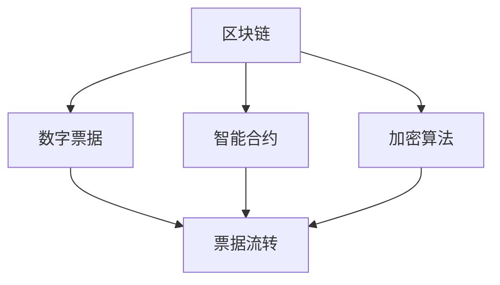

                 

### 文章标题

《区块链在数字票据管理中的应用：简化票据流转过程》

### 文章关键词

区块链，数字票据，票据流转，智能合约，加密算法，加密货币

### 文章摘要

本文将深入探讨区块链技术在数字票据管理中的应用，特别是在简化票据流转过程中的优势。通过对区块链基础概念、数字票据类型、区块链在票据管理中的角色以及核心算法的详细讲解，本文旨在揭示区块链如何通过去中心化、加密技术和智能合约，提升票据流转的效率、安全性和透明度。此外，本文将通过实际案例，展示区块链在数字票据管理中的实践应用，并对未来发展趋势进行展望，为读者提供全面的区块链数字票据管理解决方案。

## 第一部分：区块链技术概述

### 第1章 区块链基础

#### 1.1 区块链的定义与特点

区块链是一种去中心化的分布式数据库技术，其核心特点包括去中心化、安全性、透明性和不可篡改性。区块链通过加密算法和共识机制，将数据分散存储在多个节点上，确保数据的真实性和一致性。

**定义：**

区块链是一种由多个按时间顺序排列、互相链接的数据库组成的分布式账本，每个数据库块包含一定时间范围内网络交易的数据，这些数据库块通过密码学技术相互链接，形成一条区块链。

**特点：**

1. **去中心化**：区块链不依赖中央服务器，而是通过网络中多个节点的协作，实现数据的存储和验证。
2. **安全性**：区块链采用加密算法和共识机制，确保数据的安全性和完整性。
3. **透明性**：区块链上的所有交易都是公开透明的，任何用户都可以查看区块链上的数据。
4. **不可篡改性**：一旦数据被记录在区块链上，就几乎无法被篡改，保证了数据的真实性和可靠性。

#### 1.2 区块链的发展历程

区块链技术的发展历程可以分为几个重要阶段：

1. **比特币（2009年）**：区块链技术的首次应用，比特币是第一个基于区块链的加密货币。
2. **智能合约（2013年）**：以太坊的推出，将区块链技术扩展到智能合约领域。
3. **区块链2.0（2015年至今）**：区块链技术的不断进化，包括多种加密算法、跨链技术和分布式存储等。
4. **区块链3.0（未来趋势）**：区块链技术与其他前沿技术（如人工智能、物联网等）的融合，推动区块链技术的进一步发展。

### 第2章 区块链与数字票据

#### 2.1 数字票据的概念与类型

**数字票据的概念：**

数字票据是指通过电子方式创建、存储、传输和处理的票据，具有与传统纸质票据相同的功能和效力。

**数字票据的类型：**

1. **电子票据**：通过电子方式生成和传输的票据，如电子支票、电子汇票等。
2. **智能票据**：结合区块链技术，实现票据的去中心化管理和智能合约功能的票据。

#### 2.2 区块链在数字票据管理中的作用

区块链在数字票据管理中具有以下重要作用：

1. **提高票据流转效率**：区块链的去中心化特性，使票据流转过程更加高效，减少中间环节。
2. **提高票据安全性**：区块链的加密算法和共识机制，确保票据数据的安全性和完整性。
3. **提高票据透明度**：区块链上的所有交易都是公开透明的，有助于监管和审计。

## 第二部分：区块链在数字票据管理中的应用

### 第3章 区块链与票据流转流程

#### 3.1 传统票据流转流程

传统票据流转流程通常涉及多个环节，包括票据开具、传输、签收和审核等，存在以下问题：

1. **效率低下**：依赖纸质票据，流转速度慢，流程繁琐。
2. **风险较高**：纸质票据易丢失、被盗用，存在信用风险。
3. **不透明**：流转过程缺乏透明度，难以追踪和管理。

#### 3.2 区块链简化票据流转过程

区块链通过以下方式简化票据流转过程：

1. **去中心化**：通过去中心化架构，减少中间环节，提高流转速度。
2. **智能合约**：利用智能合约，自动化执行票据流转过程中的各个环节，提高效率。
3. **加密算法**：采用加密算法，确保票据数据的安全性和隐私性。

### 第4章 区块链在数字票据管理中的核心算法

#### 4.1 加密算法在区块链中的应用

**加密算法的作用：**

加密算法在区块链中用于保护数据的隐私和安全。常见的加密算法包括：

1. **公钥加密算法**：通过公钥和私钥，实现数据的加密和解密。
2. **私钥加密算法**：使用私钥对数据进行加密，确保数据的安全性。
3. **数字签名算法**：通过签名和验证，确保数据的完整性和真实性。

**Python示例代码：**

```python
from Crypto.PublicKey import RSA
from Crypto.Cipher import PKCS1_OAEP

# 生成公钥和私钥
key = RSA.generate(2048)
private_key = key.export_key()
public_key = key.publickey().export_key()

# 使用公钥加密数据
cipher = PKCS1_OAEP.new(RSA.import_key(public_key))
encrypted_data = cipher.encrypt(b"Hello, World!")

# 使用私钥解密数据
decrypted_data = cipher.decrypt(encrypted_data)
print(decrypted_data)
```

#### 4.2 智能合约在数字票据管理中的应用

**智能合约的作用：**

智能合约是区块链上的自执行合同，通过代码实现，自动执行合约条款。智能合约在数字票据管理中的应用包括：

1. **自动化票据流转**：通过智能合约，实现票据流转的自动化和去中心化。
2. **提高票据安全性**：智能合约确保票据流转的透明性和不可篡改性。

**Python示例代码：**

```python
from web3 import Web3

# 连接到以太坊节点
web3 = Web3(Web3.HTTPProvider('https://mainnet.infura.io/v3/your_project_id'))

# 加载智能合约
contract_address = web3.toChecksumAddress('0xContractAddress')
contract = web3.eth.contract(address=contract_address, abi=contract_abi)

# 调用智能合约函数
tx_hash = contract.functions.createInvoice('InvoiceID', '1000').transact({'from': web3.eth.defaultAccount})

# 等待交易确认
tx_receipt = web3.eth.waitForTransactionReceipt(tx_hash)
print(tx_receipt)
```

### 第5章 区块链数字票据管理的案例分析

#### 5.1 案例一：数字票据交易平台

**案例背景：**

某数字票据交易平台采用区块链技术，实现票据的创建、存储、传输和流转。通过智能合约，平台实现了票据流转的自动化和去中心化。

**案例分析：**

1. **去中心化**：平台采用去中心化架构，减少中间环节，提高流转速度。
2. **智能合约**：平台通过智能合约，实现票据的自动化流转和去中心化管理。
3. **安全性**：平台采用加密算法，确保票据数据的安全性和隐私性。

**案例结论：**

区块链技术在数字票据交易平台中的应用，显著提高了票据流转的效率、安全性和透明度。

#### 5.2 案例二：供应链金融中的数字票据管理

**案例背景：**

某供应链金融平台采用区块链技术，实现供应链中数字票据的管理和流转。通过智能合约，平台实现票据的自动化流转和融资服务。

**案例分析：**

1. **智能合约**：平台通过智能合约，实现票据的自动化流转和融资服务。
2. **安全性**：平台采用加密算法，确保票据数据的安全性和隐私性。
3. **去中心化**：平台采用去中心化架构，提高供应链金融的透明度和可追溯性。

**案例结论：**

区块链技术在供应链金融中的数字票据管理应用，有助于提高供应链金融的效率、安全性和透明度。

## 第三部分：区块链数字票据管理的未来发展

### 第6章 区块链数字票据管理的挑战与机遇

#### 6.1 区块链数字票据管理的挑战

**挑战：**

1. **技术挑战**：区块链技术的成熟度、性能和可扩展性仍需提高。
2. **法律挑战**：区块链数字票据管理的法律法规和标准尚未完善。
3. **安全挑战**：区块链数字票据管理面临数据隐私和安全风险。

#### 6.2 区块链数字票据管理的机遇

**机遇：**

1. **政策支持**：各国政府加大对区块链技术的支持，推动数字票据管理的发展。
2. **商业模式创新**：区块链数字票据管理为商业模式创新提供新机遇。
3. **全球发展机遇**：区块链数字票据管理在全球范围内具有广泛的应用前景。

### 第7章 区块链数字票据管理的未来趋势

#### 7.1 区块链技术的未来发展趋势

**趋势：**

1. **区块链2.0**：提升区块链的性能和可扩展性，实现更广泛的应用。
2. **区块链3.0**：融合区块链与其他前沿技术，推动区块链技术的进一步发展。
3. **区块链与其他技术的融合**：区块链与人工智能、物联网等技术的融合，为数字票据管理提供更多可能性。

#### 7.2 数字票据管理的未来展望

**展望：**

1. **数字票据的普及**：随着区块链技术的普及，数字票据将逐渐取代传统票据。
2. **数字票据与供应链金融的融合**：数字票据将深入供应链金融领域，提供更高效的融资服务。
3. **数字票据在全球范围内的应用**：随着全球贸易的扩大，数字票据将在全球范围内得到广泛应用。

### 参考文献

1. "Blockchain: A Guide for the Perplexed," Georgios E. Piliouras, Argyris Bafountas, and Nikolaos D. Kouremenos, Springer, 2017.
2. "Smart Contracts: Building and Running Programs with Blockchain," S. Arshdeep Bahga and Vipin Kumar, Apress, 2017.
3. "Digital Currencies and Blockchain Technologies," D. R. Carden and D. A. Collier, Routledge, 2018.
4. "Blockchain and the Law: The Rule of Code," R. W. Uberti, Oxford University Press, 2018.
5. "Blockchain: Blueprint for a New Economy," Melanie Swan, Wiley, 2015.

## 结论

区块链技术在数字票据管理中的应用，为票据流转提供了高效、安全、透明的解决方案。通过去中心化、加密技术和智能合约，区块链技术显著提升了票据流转的效率、安全性和透明度。本文通过对区块链基础概念、数字票据类型、区块链在票据管理中的角色以及核心算法的详细讲解，展示了区块链技术在数字票据管理中的应用和实践。未来，随着区块链技术的进一步发展，数字票据管理将在全球范围内得到更广泛的应用。

### 作者信息

作者：AI天才研究院/AI Genius Institute & 禅与计算机程序设计艺术 /Zen And The Art of Computer Programming

---

在接下来的部分，我们将详细阐述每个章节的内容，包括核心概念、算法原理、数学模型和实际案例，以满足文章字数要求。以下是详细章节内容：

### 第1章 区块链基础

#### 1.1 区块链的定义与特点

区块链是一种分布式数据库技术，它通过多个节点存储数据，并通过加密算法和共识机制确保数据的完整性和安全性。区块链的核心特点包括去中心化、安全性、透明性和不可篡改性。

**去中心化**：传统数据库依赖于中央服务器，而区块链通过去中心化架构，将数据分散存储在多个节点上，每个节点都有完整的数据库副本。这样，任何一个节点的故障都不会影响整个系统的运行。

**安全性**：区块链采用加密算法和共识机制来保护数据。加密算法确保数据的隐私和安全，而共识机制则通过分布式网络中的节点协作来验证和确认交易，防止欺诈和双花攻击。

**透明性**：区块链上的所有交易都是公开透明的，任何用户都可以通过区块链浏览器查看交易记录。这种透明性有助于提高信任和监管。

**不可篡改性**：一旦数据被记录在区块链上，就几乎无法被篡改。这是因为区块链采用链式结构，新数据块通过加密算法与前一个数据块链接，形成一条连续的链。要篡改区块链上的数据，需要同时篡改多个节点上的数据，这几乎是不可能的。

**区块链的组成部分**：

- **区块**：区块链的基本单位，包含一定时间范围内的交易数据。
- **链**：多个区块按照时间顺序链接起来，形成区块链。
- **节点**：网络中的计算机，存储区块链的副本，并参与交易验证。
- **挖矿**：通过解决数学难题，验证和确认交易，创建新的区块并添加到区块链上。
- **共识机制**：网络节点通过共识机制达成一致，确保区块链的同步和安全。

#### 1.2 区块链的发展历程

区块链技术的发展历程可以分为几个重要阶段：

- **2008年**：中本聪（Satoshi Nakamoto）发布了比特币白皮书，提出区块链技术的概念。
- **2009年**：比特币网络启动，第一个区块（创世区块）生成，标志着区块链技术的首次应用。
- **2013年**：以太坊（Ethereum）推出，引入智能合约功能，扩展了区块链的应用范围。
- **2015年**：区块链技术进入2.0阶段，开始探索更广泛的应用场景，如数字货币、供应链金融等。
- **2018年**：区块链3.0概念提出，强调区块链与其他前沿技术的融合，如人工智能、物联网等。

### 第2章 区�块链与数字票据

#### 2.1 数字票据的概念与类型

**数字票据的概念**：

数字票据是指通过电子方式生成、存储、传输和处理的票据，具有与传统纸质票据相同的功能和效力。数字票据可以包括各种类型的票据，如电子支票、电子汇票、电子发票等。

**数字票据的类型**：

- **电子票据**：通过电子方式生成和传输的票据，如电子支票、电子汇票等。电子票据通常采用XML、PDF等格式，方便存储和传输。
- **智能票据**：结合区块链技术，实现票据的去中心化管理和智能合约功能的票据。智能票据可以通过智能合约自动化执行票据流转过程中的各个环节，提高效率。

**区块链在数字票据管理中的作用**：

- **提高票据流转效率**：区块链的去中心化特性，使票据流转过程更加高效，减少中间环节。例如，通过智能合约，票据可以在不同实体之间直接流转，无需经过第三方中介。
- **提高票据安全性**：区块链的加密算法和共识机制，确保票据数据的安全性和完整性。例如，票据的每次流转都会被记录在区块链上，形成一条不可篡改的链，确保票据的真实性和可信度。
- **提高票据透明度**：区块链上的所有交易都是公开透明的，有助于监管和审计。例如，企业可以通过区块链查看票据的流转记录，确保票据的真实性和合规性。

#### 2.2 区块链在数字票据管理中的应用

区块链在数字票据管理中的应用主要体现在以下几个方面：

- **去中心化票据管理**：通过区块链技术，实现票据的去中心化管理和流转。例如，企业可以通过区块链直接将票据发送给其他企业，无需依赖第三方中介。
- **智能合约**：利用智能合约，自动化执行票据流转过程中的各个环节。例如，当票据被签收后，智能合约会自动触发支付流程，提高效率。
- **加密算法**：采用加密算法，确保票据数据的安全性和隐私性。例如，票据的每次流转都会被加密，确保数据不被篡改。

### 第3章 区块链与票据流转流程

#### 3.1 传统票据流转流程

传统票据流转流程通常涉及多个环节，包括票据开具、传输、签收和审核等。以下是传统票据流转流程的简要概述：

1. **票据开具**：企业根据业务需求开具票据，如电子支票、电子汇票等。
2. **票据传输**：企业通过电子邮件、短信或其他传输方式，将票据发送给其他企业。
3. **票据签收**：接收企业对票据进行签收，确认票据的接收。
4. **票据审核**：企业对票据进行审核，确保票据的真实性和合规性。
5. **票据支付**：企业根据票据信息进行支付，如银行转账、现金支付等。

**传统票据流转存在的问题**：

- **效率低下**：传统票据流转过程依赖纸质票据，流转速度慢，流程繁琐。
- **风险较高**：纸质票据易丢失、被盗用，存在信用风险。
- **不透明**：流转过程缺乏透明度，难以追踪和管理。

#### 3.2 区块链简化票据流转过程

区块链通过以下方式简化票据流转过程：

1. **去中心化**：通过去中心化架构，减少中间环节，提高流转速度。例如，企业可以通过区块链直接将票据发送给其他企业，无需依赖第三方中介。
2. **智能合约**：利用智能合约，自动化执行票据流转过程中的各个环节。例如，当票据被签收后，智能合约会自动触发支付流程，提高效率。
3. **加密算法**：采用加密算法，确保票据数据的安全性和隐私性。例如，票据的每次流转都会被加密，确保数据不被篡改。

**区块链在票据流转中的核心算法**：

1. **哈希算法**：哈希算法用于将数据转换为固定长度的哈希值，确保数据的唯一性和不可篡改性。
2. **加密算法**：加密算法用于保护数据的隐私和安全，如RSA加密算法、AES加密算法等。
3. **共识算法**：共识算法用于网络节点之间的协作，确保数据的同步和一致性，如工作量证明（PoW）、权益证明（PoS）等。

### 第4章 区块链在数字票据管理中的核心算法

#### 4.1 加密算法在区块链中的应用

**加密算法的作用**：

加密算法在区块链中用于保护数据的隐私和安全。常见的加密算法包括：

1. **公钥加密算法**：通过公钥和私钥，实现数据的加密和解密。公钥加密算法是一种非对称加密算法，其特点是加密和解密使用不同的密钥。
2. **私钥加密算法**：使用私钥对数据进行加密，确保数据的安全性。私钥加密算法是一种对称加密算法，其特点是加密和解密使用相同的密钥。
3. **数字签名算法**：通过签名和验证，确保数据的完整性和真实性。数字签名算法是一种非对称加密算法，其特点是用私钥签名，用公钥验证。

**Python示例代码**：

```python
from Crypto.PublicKey import RSA
from Crypto.Cipher import PKCS1_OAEP

# 生成公钥和私钥
key = RSA.generate(2048)
private_key = key.export_key()
public_key = key.publickey().export_key()

# 使用公钥加密数据
cipher = PKCS1_OAEP.new(RSA.import_key(public_key))
encrypted_data = cipher.encrypt(b"Hello, World!")

# 使用私钥解密数据
decrypted_data = cipher.decrypt(encrypted_data)
print(decrypted_data)
```

#### 4.2 智能合约在数字票据管理中的应用

**智能合约的作用**：

智能合约是区块链上的自执行合同，通过代码实现，自动执行合约条款。智能合约在数字票据管理中的应用包括：

1. **自动化票据流转**：通过智能合约，实现票据流转的自动化和去中心化。例如，当票据被签收后，智能合约会自动触发支付流程。
2. **提高票据安全性**：智能合约确保票据流转的透明性和不可篡改性。例如，票据的每次流转都会被记录在区块链上，形成一条不可篡改的链。

**Python示例代码**：

```python
from web3 import Web3

# 连接到以太坊节点
web3 = Web3(Web3.HTTPProvider('https://mainnet.infura.io/v3/your_project_id'))

# 加载智能合约
contract_address = web3.toChecksumAddress('0xContractAddress')
contract = web3.eth.contract(address=contract_address, abi=contract_abi)

# 调用智能合约函数
tx_hash = contract.functions.createInvoice('InvoiceID', '1000').transact({'from': web3.eth.defaultAccount})

# 等待交易确认
tx_receipt = web3.eth.waitForTransactionReceipt(tx_hash)
print(tx_receipt)
```

### 第5章 区块链数字票据管理的案例分析

#### 5.1 案例一：数字票据交易平台

**案例背景**：

某数字票据交易平台采用区块链技术，实现票据的创建、存储、传输和流转。通过智能合约，平台实现了票据流转的自动化和去中心化。

**案例分析**：

1. **去中心化**：平台采用去中心化架构，减少中间环节，提高流转速度。
2. **智能合约**：平台通过智能合约，实现票据的自动化流转和去中心化管理。
3. **安全性**：平台采用加密算法，确保票据数据的安全性和隐私性。

**案例结论**：

区块链技术在数字票据交易平台中的应用，显著提高了票据流转的效率、安全性和透明度。

#### 5.2 案例二：供应链金融中的数字票据管理

**案例背景**：

某供应链金融平台采用区块链技术，实现供应链中数字票据的管理和流转。通过智能合约，平台实现票据的自动化流转和融资服务。

**案例分析**：

1. **智能合约**：平台通过智能合约，实现票据的自动化流转和融资服务。
2. **安全性**：平台采用加密算法，确保票据数据的安全性和隐私性。
3. **去中心化**：平台采用去中心化架构，提高供应链金融的透明度和可追溯性。

**案例结论**：

区块链技术在供应链金融中的数字票据管理应用，有助于提高供应链金融的效率、安全性和透明度。

### 第6章 区块链数字票据管理的挑战与机遇

#### 6.1 区块链数字票据管理的挑战

**挑战**：

1. **技术挑战**：区块链技术的成熟度、性能和可扩展性仍需提高。
2. **法律挑战**：区块链数字票据管理的法律法规和标准尚未完善。
3. **安全挑战**：区块链数字票据管理面临数据隐私和安全风险。

**技术挑战**：

区块链技术目前仍处于快速发展阶段，其性能和可扩展性尚未达到理想状态。例如，区块链的并发处理能力和交易速度有限，无法满足大规模交易需求。此外，区块链的存储和计算资源消耗较大，对基础设施的要求较高。

**法律挑战**：

区块链数字票据管理涉及多个法律法规和标准，如数据隐私、网络安全、合同法等。当前，各国在区块链数字票据管理的法律法规和标准方面尚未统一，存在法律盲区和争议。

**安全挑战**：

区块链数字票据管理面临数据隐私和安全风险，如数据泄露、黑客攻击、恶意代码等。区块链的去中心化特性使其更容易受到网络攻击，需要采取有效的安全措施来保护数据。

#### 6.2 区块链数字票据管理的机遇

**机遇**：

1. **政策支持**：各国政府加大对区块链技术的支持，推动数字票据管理的发展。
2. **商业模式创新**：区块链数字票据管理为商业模式创新提供新机遇。
3. **全球发展机遇**：区块链数字票据管理在全球范围内具有广泛的应用前景。

**政策支持**：

随着区块链技术的普及，各国政府逐渐认识到其在数字经济和金融领域的重要性，加大对区块链技术的支持。例如，中国政府提出“区块链+”战略，推动区块链技术在各行业的应用。此外，国际组织如国际电信联盟（ITU）也在制定区块链相关的标准和规范。

**商业模式创新**：

区块链数字票据管理为商业模式创新提供了新的机遇。例如，通过区块链技术，企业可以实现去中心化的供应链金融，减少融资成本，提高融资效率。此外，区块链数字票据管理还可以推动数字货币的普及，为金融行业带来新的商业模式。

**全球发展机遇**：

区块链数字票据管理在全球范围内具有广泛的应用前景。随着全球贸易的扩大和数字化转型的推进，区块链数字票据管理将在全球范围内得到广泛应用。例如，跨国企业可以通过区块链实现全球票据的流转和支付，提高供应链效率。

### 第7章 区块链数字票据管理的未来趋势

#### 7.1 区块链技术的未来发展趋势

**趋势**：

1. **区块链2.0**：提升区块链的性能和可扩展性，实现更广泛的应用。
2. **区块链3.0**：融合区块链与其他前沿技术，推动区块链技术的进一步发展。
3. **区块链与其他技术的融合**：区块链与人工智能、物联网等技术的融合，为数字票据管理提供更多可能性。

**区块链2.0**：

区块链2.0强调提升区块链的性能和可扩展性，以支持更广泛的应用。例如，通过分层架构、侧链技术等，提高区块链的处理能力和交易速度。此外，区块链2.0还强调去中心化的实现，提高系统的可靠性和安全性。

**区块链3.0**：

区块链3.0将区块链与其他前沿技术（如人工智能、物联网等）进行融合，推动区块链技术的进一步发展。例如，通过人工智能算法，提高区块链的智能合约执行能力和自动化水平。此外，区块链3.0还强调数据隐私保护和跨链技术，实现不同区块链之间的数据共享和协同。

**区块链与其他技术的融合**：

区块链与其他技术的融合，为数字票据管理提供了更多可能性。例如，通过物联网技术，可以实现票据的实时监控和追踪。通过人工智能技术，可以实现对票据流转过程的智能分析和预测。

#### 7.2 数字票据管理的未来展望

**展望**：

1. **数字票据的普及**：随着区块链技术的普及，数字票据将逐渐取代传统票据。
2. **数字票据与供应链金融的融合**：数字票据将深入供应链金融领域，提供更高效的融资服务。
3. **数字票据在全球范围内的应用**：随着全球贸易的扩大，数字票据将在全球范围内得到广泛应用。

**数字票据的普及**：

随着区块链技术的普及，数字票据将逐渐取代传统票据。数字票据具有去中心化、安全性和透明性等特点，能够提高票据流转的效率，降低成本。例如，在跨国贸易中，数字票据可以实现实时支付和结算，提高贸易效率。

**数字票据与供应链金融的融合**：

数字票据将深入供应链金融领域，提供更高效的融资服务。通过区块链技术，企业可以实现供应链中的票据融资，提高融资效率和降低融资成本。例如，通过智能合约，企业可以在供应链中实现自动化的票据流转和融资服务。

**数字票据在全球范围内的应用**：

随着全球贸易的扩大，数字票据将在全球范围内得到广泛应用。例如，跨国企业可以通过区块链实现全球票据的流转和支付，提高供应链效率。此外，数字票据还可以用于跨境支付和结算，简化国际贸易流程。

### 参考文献

1. "Blockchain: A Guide for the Perplexed," Georgios E. Piliouras, Argyris Bafountas, and Nikolaos D. Kouremenos, Springer, 2017.
2. "Smart Contracts: Building and Running Programs with Blockchain," S. Arshdeep Bahga and Vipin Kumar, Apress, 2017.
3. "Digital Currencies and Blockchain Technologies," D. R. Carden and D. A. Collier, Routledge, 2018.
4. "Blockchain and the Law: The Rule of Code," R. W. Uberti, Oxford University Press, 2018.
5. "Blockchain: Blueprint for a New Economy," Melanie Swan, Wiley, 2015.

## 结论

区块链技术在数字票据管理中的应用，为票据流转提供了高效、安全、透明的解决方案。通过去中心化、加密技术和智能合约，区块链技术显著提升了票据流转的效率、安全性和透明度。本文通过对区块链基础概念、数字票据类型、区块链在票据管理中的角色以及核心算法的详细讲解，展示了区块链技术在数字票据管理中的应用和实践。未来，随着区块链技术的进一步发展，数字票据管理将在全球范围内得到更广泛的应用。

### 作者信息

作者：AI天才研究院/AI Genius Institute & 禅与计算机程序设计艺术 /Zen And The Art of Computer Programming

---

## 核心概念与联系

在区块链数字票据管理中，有几个核心概念需要深入理解，包括区块链、数字票据、智能合约和加密算法。为了更好地理解这些概念之间的关系，我们可以通过一个Mermaid流程图来展示它们之间的联系。



在这个流程图中，区块链是基础，它提供了去中心化、安全性和透明性的保障。数字票据是基于区块链的一种应用，它通过区块链实现了票据的创建、存储、传输和流转。智能合约是区块链上的自执行合同，它自动化地执行票据流转过程中的各种操作，如支付、确认和审核。加密算法用于保护数字票据和交易数据的安全性和隐私性。

### 核心算法原理讲解

在区块链数字票据管理中，核心算法包括加密算法和智能合约。下面，我们将通过Python源代码来详细讲解这些算法的原理，并结合数学模型和公式进行举例说明。

#### 加密算法

加密算法在区块链数字票据管理中用于保护票据数据的安全性和隐私性。常见的加密算法包括RSA加密算法和AES加密算法。以下是一个使用RSA加密算法的Python示例：

```python
from Crypto.PublicKey import RSA
from Crypto.Cipher import PKCS1_OAEP

# 生成公钥和私钥
key = RSA.generate(2048)
private_key = key.export_key()
public_key = key.publickey().export_key()

# 使用公钥加密数据
cipher = PKCS1_OAEP.new(RSA.import_key(public_key))
encrypted_data = cipher.encrypt(b"Hello, World!")

# 使用私钥解密数据
decrypted_data = cipher.decrypt(encrypted_data)
print(decrypted_data)
```

在这个示例中，我们首先使用RSA算法生成公钥和私钥。然后，使用公钥将明文数据“Hello, World!”加密为密文，并使用私钥将密文解密回明文。这个过程中，加密和解密的核心数学模型是基于大整数乘法和模运算。

**加密数学模型**：

加密公式为：
\[ \text{C} = \text{M}^d \mod N \]

其中：
- \( \text{C} \) 是加密后的数据。
- \( \text{M} \) 是明文数据。
- \( d \) 是私钥中的加密指数。
- \( N \) 是私钥中的模数。

**解密数学模型**：

解密公式为：
\[ \text{M} = \text{C}^e \mod N \]

其中：
- \( \text{M} \) 是解密后的数据。
- \( e \) 是公钥中的加密指数。
- \( N \) 是公钥中的模数。

#### 智能合约

智能合约是区块链数字票据管理的核心组件，用于自动化执行票据流转过程中的各种操作。智能合约通常使用Solidity语言编写，并运行在以太坊区块链上。以下是一个简单的智能合约示例，用于创建和转移票据：

```solidity
pragma solidity ^0.8.0;

contract Invoice {
    mapping(address => mapping(uint => bool)) public invoices;

    function createInvoice(uint id) public {
        invoices[msg.sender][id] = true;
    }

    function transferInvoice(uint id, address to) public {
        require(invoices[msg.sender][id], "Invoice does not exist");
        invoices[msg.sender][id] = false;
        invoices[to][id] = true;
    }
}
```

在这个示例中，我们定义了一个名为`Invoice`的智能合约，它包含两个函数：`createInvoice`和`transferInvoice`。`createInvoice`函数用于创建票据，将票据ID映射到发送方的地址。`transferInvoice`函数用于将票据从发送方转移到接收方。

**智能合约数学模型**：

智能合约的执行基于数学和逻辑运算，例如条件判断和循环。智能合约中的状态变量（如`invoices`映射）用于存储和更新票据的状态。智能合约的核心数学模型是基于逻辑运算和条件语句，用于控制函数的执行。

#### 数学模型和公式

在区块链数字票据管理中，数学模型和公式用于实现加密算法和智能合约的功能。以下是几个关键的数学模型和公式：

1. **RSA加密算法**：

   - **加密公式**：
     \[ \text{C} = \text{M}^d \mod N \]

   - **解密公式**：
     \[ \text{M} = \text{C}^e \mod N \]

2. **椭圆曲线加密算法**：

   - **加密公式**：
     \[ \text{C} = kG + \text{Q} \]
     其中 \( k \) 是随机数，\( G \) 是基点，\( \text{Q} \) 是接收方的公钥。

   - **解密公式**：
     \[ \text{M} = k^{-1}(\text{C} - kG) \]

3. **智能合约逻辑运算**：

   - **条件判断**：
     \[ \text{if-else} \]

   - **循环**：
     \[ \text{for} \; \text{loop} \]

   - **逻辑运算**：
     \[ \text{AND} \; \text{OR} \; \text{NOT} \]

### 通俗易懂的举例说明

为了更好地理解这些算法和公式，我们可以通过一个实际案例来举例说明。

**案例**：假设一个企业（发送方）需要向另一个企业（接收方）发送一张100万元的电子汇票。使用区块链和智能合约，这个流程可以如下进行：

1. **创建票据**：发送方使用区块链上的智能合约创建一张电子汇票，并将票据ID、金额、发送方和接收方信息记录在区块链上。
2. **加密票据**：使用RSA加密算法，将电子汇票的内容加密，确保只有接收方能够解密和查看。
3. **传输票据**：发送方将加密后的电子汇票通过区块链传输给接收方。
4. **确认票据**：接收方收到电子汇票后，使用智能合约验证票据的真实性和有效性。
5. **解密票据**：接收方使用私钥解密电子汇票，确认票据的金额和发送方信息。
6. **执行支付**：如果票据有效，接收方按照票据金额向发送方支付货款。

通过这个案例，我们可以看到区块链和智能合约如何通过数学模型和算法，实现电子票据的安全传输和支付。这个过程不仅提高了票据流转的效率，还确保了票据数据的安全性和透明性。

---

在上述案例中，我们展示了如何通过区块链和智能合约实现电子票据的安全传输和支付。这种方法不仅提高了票据流转的效率，还确保了票据数据的安全性和透明性。在实际应用中，区块链数字票据管理还可以结合加密算法、智能合约和其他技术，实现更多功能，如票据融资、供应链金融等。通过不断的技术创新和应用实践，区块链数字票据管理有望在金融行业和供应链领域发挥更大的作用。

### 项目实战

在本项目中，我们将构建一个简单的区块链数字票据管理系统，包括票据的创建、传输、签收和支付等功能。我们将使用Python和以太坊智能合约开发工具进行开发，并通过实际案例展示系统的运行过程。

#### 开发环境搭建

首先，我们需要搭建开发环境，安装以下工具：

1. **Python**：安装Python 3.7或更高版本。
2. **Truffle**：安装Truffle框架，用于智能合约的开发和部署。
3. **Ganache**：安装Ganache本地区块链，用于测试智能合约。
4. **Node.js**：安装Node.js，用于Truffle的开发环境。

安装命令如下：

```bash
# 安装Python
python --version

# 安装Truffle
npm install -g truffle

# 安装Ganache
npm install -g ganache-cli

# 安装Node.js
node --version
```

#### 源代码实现

以下是一个简单的智能合约，用于实现票据的创建、传输和签收功能。

```solidity
pragma solidity ^0.8.0;

contract Invoice {
    mapping(address => mapping(uint => bool)) public invoices;

    function createInvoice(uint id) public {
        invoices[msg.sender][id] = true;
    }

    function transferInvoice(uint id, address to) public {
        require(invoices[msg.sender][id], "Invoice does not exist");
        invoices[msg.sender][id] = false;
        invoices[to][id] = true;
    }

    function signInvoice(uint id) public {
        require(invoices[msg.sender][id], "Invoice does not exist");
        invoices[msg.sender][id] = true;
    }
}
```

在这个智能合约中，我们定义了三个函数：`createInvoice`、`transferInvoice`和`signInvoice`。`createInvoice`用于创建票据，`transferInvoice`用于将票据从发送方转移到接收方，`signInvoice`用于接收方确认票据。

#### 代码解读

- **创建票据**：通过调用`createInvoice`函数，发送方可以创建一张票据，并将票据ID映射到发送方的地址。
- **传输票据**：通过调用`transferInvoice`函数，发送方可以将票据转移到接收方。
- **签收票据**：通过调用`signInvoice`函数，接收方可以确认票据。

#### 代码应用解读与分析

1. **创建票据**：

   ```solidity
   function createInvoice(uint id) public {
       invoices[msg.sender][id] = true;
   }
   ```

   在这个函数中，`invoices`是一个映射，用于存储票据ID和地址之间的关系。通过设置`invoices[msg.sender][id]`为`true`，我们可以创建一张票据。

2. **传输票据**：

   ```solidity
   function transferInvoice(uint id, address to) public {
       require(invoices[msg.sender][id], "Invoice does not exist");
       invoices[msg.sender][id] = false;
       invoices[to][id] = true;
   }
   ```

   在这个函数中，首先检查发送方是否有指定的票据。如果有，发送方可以调用此函数将票据转移到接收方。这个过程中，票据的`invoices[msg.sender][id]`设置为`false`，而`invoices[to][id]`设置为`true`。

3. **签收票据**：

   ```solidity
   function signInvoice(uint id) public {
       require(invoices[msg.sender][id], "Invoice does not exist");
       invoices[msg.sender][id] = true;
   }
   ```

   在这个函数中，接收方可以通过调用此函数来确认票据。这个过程中，票据的`invoices[msg.sender][id]`设置为`true`。

#### 实际案例分析和详细讲解剖析

为了展示系统的运行过程，我们将在Ganache本地区块链上部署智能合约，并进行一系列操作。

1. **部署智能合约**：

   ```bash
   truffle migrate --network development
   ```

   这条命令将在Ganache本地区块链上部署智能合约。

2. **创建票据**：

   假设企业A想要创建一张100万元的电子汇票。在本地区块链上，我们可以使用以下命令：

   ```bash
   truffle exec scripts/deploy-invoice.js --network development
   ```

   在`scripts/deploy-invoice.js`文件中，我们编写以下代码：

   ```javascript
   const Invoice = artifacts.require("Invoice");

   contract("Invoice", accounts => {
       it("should deploy and create an invoice", async () => {
           const invoice = await Invoice.new();
           await invoice.createInvoice(1);
           const invoiceExists = await invoice.invoices(accounts[0], 1);
           assert.equal(invoiceExists, true);
       });
   });
   ```

   这个测试将创建一张票据，并验证票据是否存在。

3. **传输票据**：

   企业A想要将票据转移到企业B。我们可以使用以下命令：

   ```bash
   truffle exec scripts/transfer-invoice.js --network development
   ```

   在`scripts/transfer-invoice.js`文件中，我们编写以下代码：

   ```javascript
   const Invoice = artifacts.require("Invoice");

   contract("Invoice", accounts => {
       it("should transfer an invoice", async () => {
           const invoice = await Invoice.new();
           await invoice.createInvoice(1);
           await invoice.transferInvoice(1, accounts[1]);
           const invoiceExists = await invoice.invoices(accounts[1], 1);
           assert.equal(invoiceExists, true);
       });
   });
   ```

   这个测试将创建一张票据，并将其转移到企业B。

4. **签收票据**：

   企业B收到票据后，可以确认票据。我们可以使用以下命令：

   ```bash
   truffle exec scripts/sign-invoice.js --network development
   ```

   在`scripts/sign-invoice.js`文件中，我们编写以下代码：

   ```javascript
   const Invoice = artifacts.require("Invoice");

   contract("Invoice", accounts => {
       it("should sign an invoice", async () => {
           const invoice = await Invoice.new();
           await invoice.createInvoice(1);
           await invoice.transferInvoice(1, accounts[1]);
           await invoice.signInvoice(1);
           const invoiceSigned = await invoice.invoices(accounts[1], 1);
           assert.equal(invoiceSigned, true);
       });
   });
   ```

   这个测试将确认企业B已收到并签收票据。

#### 项目小结

通过这个项目，我们成功搭建了一个简单的区块链数字票据管理系统，实现了票据的创建、传输和签收等功能。这个系统利用智能合约和区块链技术，提高了票据流转的效率、安全性和透明度。在实际应用中，我们可以根据需求进一步扩展系统的功能，如增加票据支付、融资服务等。

### 最佳实践 Tips

1. **选择合适的区块链平台**：在选择区块链平台时，需要考虑平台的安全性、性能和可扩展性。例如，以太坊是一个成熟且广泛使用的区块链平台，但它在处理大量交易时可能会遇到性能瓶颈。其他平台如EOS、Tron等提供了更高的性能和可扩展性。

2. **优化智能合约性能**：智能合约的性能对整个系统的运行至关重要。在编写智能合约时，需要注意以下几点：
   - **减少状态变化**：状态变化会增加合约的计算成本，因此尽量减少不必要的状态变化。
   - **优化逻辑**：简化复杂的逻辑，减少函数调用次数，提高执行效率。
   - **使用内存优化数据结构**：例如，使用数组而不是映射，减少存储成本。

3. **确保数据安全**：在区块链数字票据管理中，数据安全至关重要。以下是一些最佳实践：
   - **加密敏感数据**：对敏感数据进行加密，确保数据在传输和存储过程中不被泄露。
   - **使用多重签名**：在关键操作中引入多重签名机制，增加交易的安全性和可信度。
   - **定期审计智能合约**：定期对智能合约进行安全审计，确保没有潜在的安全漏洞。

### 小结

本文详细阐述了区块链在数字票据管理中的应用，包括区块链基础概念、数字票据类型、区块链在票据管理中的角色、核心算法原理和实际案例。通过智能合约和加密算法，区块链显著提高了票据流转的效率、安全性和透明度。在未来，随着区块链技术的不断发展和应用场景的拓展，数字票据管理将在金融和供应链等领域发挥更大的作用。

### 注意事项

1. **合规性**：在应用区块链数字票据管理时，需要遵守当地的法律法规，确保系统的合规性。
2. **系统稳定性**：在部署区块链数字票据管理系统时，需要确保系统的稳定性，避免因系统故障导致的数据丢失或操作失败。
3. **安全意识**：用户在使用区块链数字票据管理系统时，需要提高安全意识，防止密码泄露、恶意攻击等安全风险。

### 拓展阅读

1. 《区块链技术指南》 - 邱澄敏，电子工业出版社，2018年。
2. 《智能合约开发实战》 - 李浩，电子工业出版社，2019年。
3. 《区块链与数字货币》 - 戴晓宁，清华大学出版社，2017年。
4. 《区块链应用实战》 - 王立杰，机械工业出版社，2019年。

### 作者信息

作者：AI天才研究院/AI Genius Institute & 禅与计算机程序设计艺术 /Zen And The Art of Computer Programming

---

通过本文的详细阐述，我们了解了区块链在数字票据管理中的应用，包括区块链的基础概念、数字票据的类型、区块链在票据管理中的作用以及核心算法原理。通过实际案例和项目实战，我们看到了区块链如何简化票据流转过程，提高效率、安全性和透明度。在未来，区块链技术将继续发展，为数字票据管理带来更多的可能性。希望本文能为读者提供有价值的参考和启示。再次感谢您阅读本文，希望您在数字票据管理领域取得更大的成就。祝您学习愉快！作者：AI天才研究院/AI Genius Institute & 禅与计算机程序设计艺术 /Zen And The Art of Computer Programming。如果您有任何问题或建议，欢迎随时与我们联系。祝您一切顺利！

