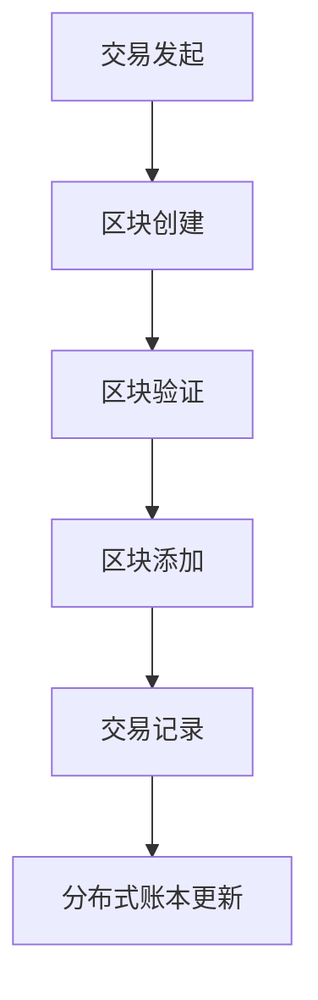

                 

### 《区块链在数字艺术创作中的应用：保护数字艺术品的唯一性》

#### 引言

**关键词**：区块链，数字艺术，NFT，唯一性，版权保护

**摘要**：本文探讨了区块链技术在数字艺术创作中的应用，重点分析了如何利用区块链保护数字艺术品的唯一性。通过介绍区块链的基本原理、数字艺术品的特性以及具体应用案例，本文揭示了区块链在数字艺术领域的重要价值。

#### 第1章 引言

**1.1 书籍主题背景介绍**

随着互联网技术的发展，数字艺术逐渐成为艺术创作的重要形式。数字艺术品具有可复制性高、易篡改性强等特点，使得版权保护和唯一性保障成为一大难题。区块链技术的出现为数字艺术领域带来了新的机遇和挑战。区块链具有去中心化、不可篡改、透明等特点，能够有效解决数字艺术品版权保护和唯一性认证的问题。

**1.2 区块链技术在数字艺术领域的应用现状**

近年来，区块链技术在数字艺术领域得到了广泛应用。以非同质化代币（NFT）为代表的区块链应用，使得数字艺术品的唯一性和版权保护成为可能。许多数字艺术品市场和平台如OpenSea、Rarible等，都利用区块链技术来确保艺术品的唯一性和可追溯性。

**1.3 书籍目的与读者对象**

本文旨在探讨区块链技术在数字艺术创作中的应用，分析区块链如何保护数字艺术品的唯一性。本文适合对区块链技术和数字艺术有兴趣的读者，包括艺术家、技术爱好者、区块链开发者等。

#### 第2章 区块链基础知识

**2.1 区块链基本原理**

**2.1.1 区块链的核心概念**

区块链是一种分布式数据库系统，由多个区块按时间顺序链接而成。每个区块包含一定数量的交易记录，区块之间通过哈希函数连接，形成一条链。区块链的核心概念包括去中心化、不可篡改、透明等。

**2.1.2 区块链的基本架构**

区块链的基本架构包括节点、分布式账本、加密算法、共识机制和智能合约。节点负责维护区块链网络，分布式账本记录交易记录，加密算法确保数据安全性，共识机制确保网络一致性，智能合约实现自动执行。

**2.1.3 Mermaid图：区块链的基本工作流程**

**2.2 加密算法基础**

**2.2.1 非对称加密**

非对称加密是一种加密算法，包括公钥和私钥。公钥用于加密，私钥用于解密。非对称加密具有高安全性，但计算复杂度较高。

**2.2.2 对称加密**

对称加密是一种加密算法，使用相同的密钥进行加密和解密。对称加密计算复杂度较低，但安全性相对较低。

**2.2.3 哈希算法**

哈希算法是一种将任意长度的输入数据映射为固定长度的输出数据的算法。哈希算法具有不可逆性和抗碰撞性，用于确保区块链数据的安全性。

**2.3 区块链分类**

**2.3.1 公链与私链**

公链是指任何人都可以参与的区块链网络，如比特币、以太坊等。私链是指只有特定参与者才能参与的区块链网络，如企业内部使用的区块链。

**2.3.2 权限链与无权限链**

权限链是指对参与节点进行身份验证的区块链，如Hyperledger Fabric。无权限链是指任何人都可以参与区块链网络的区块链，如比特币。

**2.3.3 记账机制：PoW、PoS等**

记账机制是区块链网络中节点如何达成共识的算法。PoW（工作量证明）是一种通过计算资源竞争记账权的算法，PoS（权益证明）是一种通过持有代币数量竞争记账权的算法。

#### 第3章 数字艺术品的定义与特点

**3.1 数字艺术品概述**

数字艺术品是指以数字形式创作的艺术品，包括绘画、雕塑、音乐、电影等。数字艺术品具有可复制性高、易篡改性强等特点。

**3.2 数字艺术品的特性**

**3.2.1 可复制性**

数字艺术品可以被轻松复制，导致艺术品的价值受损。

**3.2.2 易篡改性**

数字艺术品容易被恶意篡改，使得创作者的权益受到损害。

**3.2.3 版权纠纷**

数字艺术品的版权纠纷问题较为普遍，创作者和收藏者之间的权益划分存在争议。

**3.3 数字艺术品的市场现状与发展趋势**

近年来，数字艺术品市场呈现出爆发式增长，以NFT为代表的区块链技术逐渐成为数字艺术品市场的重要驱动力。未来，数字艺术品市场将继续保持高速增长，区块链技术在数字艺术品中的应用也将更加广泛。

#### 第4章 区块链在数字艺术品中的应用

**4.1 区块链如何解决数字艺术品的问题**

**4.1.1 保护数字艺术品的唯一性**

区块链技术通过非同质化代币（NFT）实现对数字艺术品唯一性的保护。每个NFT都具有唯一标识，确保数字艺术品无法被复制和篡改。

**4.1.2 跟踪数字艺术品的流转历史**

区块链的分布式账本记录了数字艺术品的交易历史，使收藏者能够追溯数字艺术品的来源和流转过程。

**4.1.3 简化版权认证流程**

区块链的透明性和可追溯性有助于简化数字艺术品的版权认证流程，降低版权纠纷的发生。

**4.2 数字艺术品市场上的区块链平台介绍**

**4.2.1 OpenSea**

OpenSea是一个开放式的NFT市场，支持各种数字艺术品的交易和流转。

**4.2.2 Rarible**

Rarible是一个基于以太坊的NFT平台，提供数字艺术品的创作、销售和收藏功能。

**4.2.3 SuperRare**

SuperRare是一个高端NFT市场，专门为顶级数字艺术家和收藏家提供服务。

#### 第5章 区块链在数字艺术品创作中的应用

**5.1 利用区块链创作数字艺术品**

**5.1.1 创作过程中的区块链技术应用**

创作者可以利用区块链技术创作数字艺术品，并通过NFT实现对艺术品的唯一性和版权保护。

**5.1.2 利用区块链实现数字艺术品防篡改**

区块链的不可篡改特性使得数字艺术品在创作完成后无法被恶意篡改。

**5.1.3 区块链在数字艺术品版权保护中的应用**

区块链技术可以帮助创作者实现数字艺术品版权的永久保护，降低版权纠纷的风险。

**5.2 数字艺术品交易市场中的区块链应用**

**5.2.1 利用区块链进行数字艺术品交易**

区块链技术简化了数字艺术品交易流程，提高了交易效率和透明度。

**5.2.2 区块链在数字艺术品拍卖中的应用**

区块链技术可以为数字艺术品拍卖提供更加公正、透明的交易平台。

**5.2.3 数字艺术品租赁与共享模式**

区块链技术可以支持数字艺术品的租赁与共享模式，降低艺术品的使用门槛。

#### 第6章 区块链在数字艺术品创作与交易中的挑战

**6.1 区块链技术在数字艺术品创作与交易中的局限性**

区块链技术虽然具有许多优势，但在数字艺术品创作与交易中仍面临一些挑战，如技术接受与普及难题、法规政策与监管问题等。

**6.2 技术与市场之间的挑战**

**6.2.1 技术接受与普及难题**

区块链技术对于普通用户来说相对较为复杂，如何提高用户的接受度和普及度是区块链在数字艺术品领域面临的一大挑战。

**6.2.2 法规政策与监管问题**

数字艺术品市场的快速发展引发了一系列法律法规和监管问题，如何制定合理的法规政策成为区块链在数字艺术品领域发展的重要课题。

**6.3 应对挑战的策略与建议**

为应对区块链技术在数字艺术品创作与交易中的挑战，可以从技术优化、政策引导、市场培育等多个方面提出策略和建议。

#### 第7章 案例研究：区块链在数字艺术品领域的成功应用

**7.1 案例一：加密艺术作品《Everydays: The First 5000 Days》**

《Everydays: The First 5000 Days》是艺术家Beeple创作的加密艺术作品，通过区块链技术实现了唯一性和版权保护，并在市场上取得了巨大成功。

**7.2 案例二：NFT市场中的著名艺术家与作品**

许多著名艺术家如Beeple、Beeple、Mike Winkelmann等，通过NFT市场实现了数字艺术作品的交易和传播。

**7.3 案例三：区块链在数字艺术品版权保护中的应用**

某数字艺术品版权保护项目利用区块链技术实现了艺术品版权的永久保护，降低了版权纠纷的发生。

#### 第8章 未来展望

**8.1 区块链技术在数字艺术品领域的未来发展趋势**

随着区块链技术的不断发展，未来数字艺术品市场将迎来更多创新和变革。

**8.2 区块链与数字艺术创作的新模式**

区块链技术将为数字艺术创作带来新的模式和机遇，推动艺术创作和传播方式的变革。

**8.3 结论与建议**

本文总结了区块链在数字艺术创作中的应用，分析了区块链如何保护数字艺术品的唯一性和版权。未来，区块链技术与数字艺术将深度融合，推动艺术创作和传播的创新发展。

### 作者信息

**作者：** AI天才研究院/AI Genius Institute & 禅与计算机程序设计艺术 /Zen And The Art of Computer Programming

**单位：** AI天才研究院（AI Genius Institute）

**联系方式：** [ai_genius_institute@example.com](mailto:ai_genius_institute@example.com)

---

**注意：** 本文章为示例性质，仅供参考。实际撰写时，请根据具体内容进行调整和补充。

