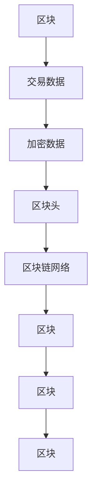
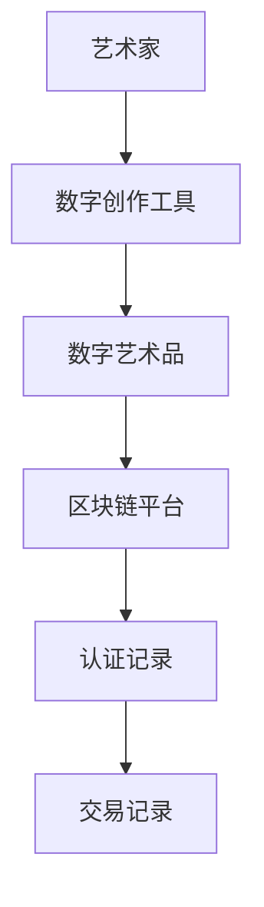
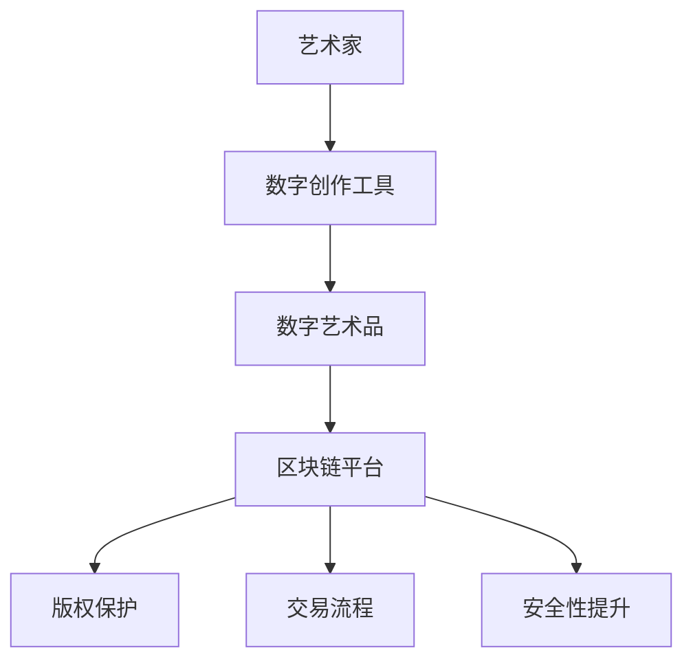
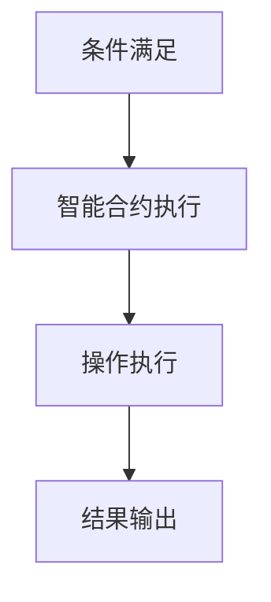
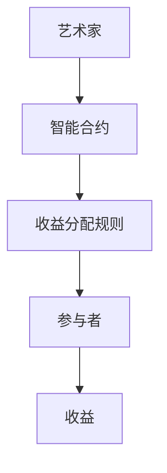
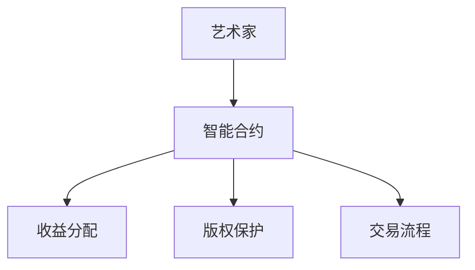

                 

## 第1章 区块链与数字艺术品概述

### 1.1 区块链技术简介

区块链技术是一种分布式账本技术，其基本原理是通过对数据进行加密和去中心化处理，确保数据的完整性和不可篡改性。区块链技术起源于比特币（Bitcoin）的诞生，自那时起，它已经在金融、物流、医疗等多个领域得到了广泛应用。

**核心概念与联系**：

区块链的核心概念包括：

- **分布式账本**：区块链是由多个节点共同维护的分布式数据库，每个节点都存储了一份完整的账本。这种分布式结构使得区块链具有较高的容错性和抗攻击性。

- **加密技术**：区块链使用加密技术来保护数据的安全性。每个区块的数据都经过加密处理，使得数据在传输过程中无法被篡改。

- **共识算法**：共识算法是区块链网络中节点之间达成一致性的机制。常见的共识算法包括工作量证明（PoW）、权益证明（PoS）等。

为了更直观地展示区块链的基本架构，我们可以使用 Mermaid 流程图来描述：



在这个流程图中，每个区块都包含交易数据、加密数据和区块头。区块头用于链接到前一个区块，从而形成区块链。

**背景介绍**：

区块链技术的出现，解决了传统中心化系统中的数据安全和信任问题。在传统中心化系统中，数据的安全性和真实性依赖于中心化的权威机构。而区块链技术通过分布式账本和加密技术，实现了数据的透明性和不可篡改性，降低了中心化系统的风险。

区块链技术的应用不仅仅局限于金融领域，还广泛应用于数字艺术品、供应链管理、医疗记录等多个领域。特别是在数字艺术品领域，区块链技术为艺术品的版权保护和交易提供了新的解决方案。

### 1.2 数字艺术品的定义和特征

数字艺术品是指通过数字技术创作和传播的艺术作品。与传统的艺术品不同，数字艺术品具有以下几个特征：

- **可验证性**：数字艺术品可以通过区块链技术进行唯一标识和验证，确保艺术品的真实性。

- **可复制性**：数字艺术品可以被无限复制，但每个复制品都具有独特的属性和价值。

- **可追溯性**：数字艺术品在区块链上的交易记录是公开透明的，可以追溯到艺术品的创作和流通历史。

- **非互操作性**：由于不同的区块链平台和数字艺术品之间存在差异，导致数字艺术品之间的互操作性较低。

**核心概念与联系**：

为了更好地理解数字艺术品的特征，我们可以使用 Mermaid 流程图来描述其创作、认证和交易的过程：



在这个流程图中，艺术家使用数字创作工具创作数字艺术品，并通过区块链平台进行认证和交易。区块链平台记录了数字艺术品的认证记录和交易记录，确保了艺术品的可验证性和可追溯性。

**背景介绍**：

随着数字技术的发展，数字艺术品逐渐成为艺术市场的重要组成部分。然而，数字艺术品的市场现状和趋势也带来了一系列挑战，如版权保护、交易流程、安全性等问题。区块链技术的出现，为数字艺术品的这些问题提供了新的解决方案。

### 1.3 区块链与数字艺术品的结合意义

区块链技术为数字艺术品领域带来了巨大的变革。通过区块链技术，数字艺术品实现了版权保护、交易流程优化、安全性提升等目标。

**核心概念与联系**：

区块链与数字艺术品的结合，主要体现在以下几个方面：

- **版权保护**：区块链技术可以为数字艺术品提供唯一的数字身份，确保艺术品的版权得到有效保护。

- **交易流程优化**：区块链技术可以实现数字艺术品的快速、安全交易，降低交易成本和时间。

- **安全性提升**：区块链技术通过加密和分布式账本，提高了数字艺术品的交易安全性和隐私性。

为了更直观地展示区块链与数字艺术品结合的意义，我们可以使用 Mermaid 流程图来描述：



在这个流程图中，艺术家使用数字创作工具创作数字艺术品，并通过区块链平台实现版权保护、交易流程优化和安全性提升。

**背景介绍**：

随着区块链技术的不断发展，数字艺术品市场正在迅速增长。区块链技术为数字艺术品提供了全新的发展机遇，也为其带来了巨大的挑战。通过深入了解区块链与数字艺术品的结合意义，我们可以更好地把握这一新兴领域的趋势和机遇。

---

**小结**：

本章主要介绍了区块链技术的基本原理、数字艺术品的定义和特征，以及区块链与数字艺术品的结合意义。通过本章的学习，读者可以初步了解区块链技术在数字艺术品领域中的应用前景，为后续章节的学习打下基础。

**注意事项**：

- 在实际应用中，区块链技术与数字艺术品的结合还需要考虑技术实现、市场接受度等因素。

- 数字艺术品市场的健康发展，需要各方共同努力，包括艺术家、交易平台、区块链平台等。

**拓展阅读**：

- 《区块链：从入门到精通》
- 《数字艺术品的未来：区块链的力量》
- 《智能合约：原理与实践》

## 第2章 智能合约基础

### 2.1 智能合约的概念与原理

智能合约是一种自动执行合约条款的计算机程序，它运行在区块链平台上。智能合约通过代码实现，能够在满足特定条件时自动执行预定义的操作。智能合约的出现，为区块链技术带来了新的应用场景，如去中心化金融（DeFi）、数字艺术品交易等。

**核心概念与联系**：

智能合约的核心概念包括：

- **条件触发**：智能合约根据预定的条件执行操作，如交易金额达到一定数额时，自动释放数字资产。

- **执行操作**：智能合约在满足条件后，会执行预定义的操作，如将数字资产从一个地址转移到另一个地址。

- **不可篡改性**：智能合约一旦部署到区块链上，其代码和状态将不可篡改，确保合约的执行过程透明、公正。

为了更直观地展示智能合约的执行流程，我们可以使用 Mermaid 流程图来描述：



在这个流程图中，当条件满足时，智能合约将自动执行操作，并输出结果。

**核心算法原理讲解**：

智能合约的实现主要依赖于区块链平台的编程语言，如 Solidity。Solidity 是一种面向对象的语言，支持函数、事件、状态变量等概念。以下是一个简单的智能合约示例，用于实现数字资产转账功能：

```python
pragma solidity ^0.8.0;

contract Transfer {
    address public owner;

    constructor() {
        owner = msg.sender;
    }

    function transfer(address to, uint256 amount) public {
        require(msg.sender == owner, "Only owner can transfer");
        require(amount <= address(this).balance, "Insufficient balance");

        (bool sent, ) = to.call{value: amount}("");
        require(sent, "Failed to send Ether");
    }
}
```

在这个示例中，智能合约定义了一个 `transfer` 函数，用于将指定金额的数字资产从合约地址转移到目标地址。在调用 `transfer` 函数时，需要满足以下条件：

1. 调用者必须是合约的拥有者。
2. 转账金额不能超过合约地址的余额。

如果条件满足，智能合约将执行转账操作，并返回成功或失败的结果。

**数学模型和公式**：

在智能合约中，数学模型和公式用于实现复杂的业务逻辑。以下是一个简单的数学模型示例，用于计算利息收益：

```python
pragma solidity ^0.8.0;

contract InterestCalculator {
    uint256 public principal;
    uint256 public rate;
    uint256 public time;

    constructor(uint256 _principal, uint256 _rate, uint256 _time) {
        principal = _principal;
        rate = _rate;
        time = _time;
    }

    function calculateInterest() public view returns (uint256) {
        return (principal * rate * time) / 100;
    }
}
```

在这个示例中，智能合约定义了一个 `calculateInterest` 函数，用于计算根据本金、利率和时间计算出的利息收益。

**举例说明**：

假设有一个智能合约，用于计算每个月的房租收益。合约的参数包括本金（5000美元）、利率（4%）和计算时间（12个月）。调用 `calculateInterest` 函数，可以计算出每个月的利息收益为：

```python
calculateInterest() = (5000 * 4 * 12) / 100 = 2400美元
```

**实际案例**：

一个实际的案例是去中心化金融平台 MakerDAO。MakerDAO 使用智能合约实现去中心化的债务抵押币（Dai）。用户可以使用其他数字货币作为抵押物，生成 Dai 代币。智能合约会根据抵押物的价值、利率和债务比例，自动调整 Dai 代币的供应量。

### 2.2 常见智能合约编程语言

智能合约的实现需要使用特定的编程语言，目前最常用的智能合约编程语言包括 Solidity、Vyper 等。这些语言具有不同的特点和应用场景。

**Solidity**：

Solidity 是以太坊（Ethereum）平台的官方智能合约编程语言。它是一种面向对象的语言，支持函数、事件、状态变量等概念。Solidity 语言具有以下特点：

- **易于学习**：Solidity 语言语法接近 JavaScript，对于有前端开发经验的开发者来说，学习曲线相对较低。

- **丰富的功能**：Solidity 语言支持高级编程特性，如继承、修饰符等，适用于复杂的智能合约开发。

- **广泛的社区支持**：Solidity 语言拥有庞大的开发者社区，提供了丰富的文档和工具，方便开发者学习和使用。

以下是一个简单的 Solidity 示例，用于实现一个简单的投票系统：

```python
pragma solidity ^0.8.0;

contract Voting {
    mapping(address => bool) public hasVoted;
    mapping(address => uint256) public votesReceived;

    function vote(uint256 questionId) public {
        require(!hasVoted[msg.sender], "Already voted");
        hasVoted[msg.sender] = true;
        votesReceived[questionId] += 1;
    }
}
```

在这个示例中，智能合约定义了一个 `vote` 函数，用于处理投票逻辑。调用 `vote` 函数时，需要满足以下条件：

1. 调用者尚未投票。
2. 投票成功后，将调用者的地址标记为已投票，并增加对应的投票计数。

**Vyper**：

Vyper 是一个安全友好的智能合约编程语言，它旨在提高智能合约的安全性。Vyper 语言具有以下特点：

- **安全性**：Vyper 语言通过严格的类型系统和静态分析，减少了智能合约中的安全漏洞。

- **简洁性**：Vyper 语言的语法简洁明了，易于阅读和理解。

- **效率**：Vyper 语言的编译器优化能力强，生成的字节码执行效率高。

以下是一个简单的 Vyper 示例，用于实现一个简单的金额转移功能：

```python
@public
contract Transfer {
    address public owner;
    mapping(address => uint) public balances;

    constructor() {
        owner := msg.sender
    }

    @external
    @payable
    func deposit() {
    }

    @external
    func transfer(address to, uint amount) -> (bool) {
        require(balance[msg.sender] >= amount, "Insufficient balance")
        balances[msg.sender] := balances[msg.sender] - amount
        balances[to] := balances[to] + amount
        return true
    }
}
```

在这个示例中，智能合约定义了一个 `transfer` 函数，用于处理金额转移逻辑。调用 `transfer` 函数时，需要满足以下条件：

1. 调用者拥有足够的余额。
2. 金额转移成功后，将调用者的余额减少，并将金额转移到目标地址。

### 2.3 智能合约的安全性

智能合约的安全性是区块链技术发展的重要课题。由于智能合约的代码一旦部署到区块链上，就难以修改，因此智能合约的安全性问题尤为重要。

**常见安全漏洞**：

智能合约中常见的安全漏洞包括：

- **重入攻击**：攻击者通过多次调用合约函数，导致合约在未完成当前操作时再次调用自身，从而盗取合约中的资金。

- **整数溢出**：智能合约中的整数运算可能导致溢出，从而影响合约的执行结果。

- **调用者欺诈**：攻击者通过构造恶意交易，诱导合约调用者执行不安全的操作。

**防御策略**：

为了提高智能合约的安全性，可以采取以下防御策略：

- **使用专业工具**：使用安全分析工具对智能合约代码进行静态分析，检测潜在的安全漏洞。

- **编码规范**：遵循良好的编程规范，如避免使用未经验证的外部调用、使用安全的数学运算等。

- **共识算法**：选择安全性较高的共识算法，如权益证明（PoS），以提高区块链网络的安全性能。

**案例分析**：

2016年，以太坊平台发生了一次严重的智能合约漏洞，被称为DAO（Decentralized Autonomous Organization）漏洞。攻击者利用智能合约中的重入攻击漏洞，盗取了大量以太币。这次事件引发了广泛的讨论，促使以太坊社区对智能合约的安全性进行了深入研究和改进。

**小结**：

本章介绍了智能合约的概念与原理、常见智能合约编程语言，以及智能合约的安全性。通过本章的学习，读者可以了解智能合约的基本原理和实现方法，为后续章节的学习打下基础。

**注意事项**：

- 在开发智能合约时，务必重视安全性问题，遵循良好的编程规范和防御策略。

- 智能合约的开发需要具备一定的编程技能和区块链知识，建议初学者先从简单的项目入手，逐步提高自己的能力。

**拓展阅读**：

- 《智能合约：原理与实践》
- 《Vyper 编程语言指南》
- 《区块链安全攻防实战》

## 第3章 数字艺术品的特性和应用

### 3.1 数字艺术品的创作与传播

数字艺术品的创作与传播是数字时代的一个重要现象。与传统的艺术品不同，数字艺术品通过数字技术进行创作和传播，具有独特的特性和优势。

**创作过程**：

数字艺术品的创作通常涉及以下步骤：

- **构思与设计**：艺术家首先构思作品的主题和风格，并进行初步设计。

- **数字工具与技术**：艺术家利用数字工具和技术，如 Adobe Photoshop、Illustrator、3D建模软件等，进行创作。

- **数字资产生成**：通过数字工具和技术，艺术家生成数字资产，如图片、音频、视频、虚拟物品等。

- **版权声明与认证**：艺术家可以将数字艺术品上传到区块链平台，通过智能合约进行版权声明和认证。

**传播方式**：

数字艺术品的传播方式包括以下几种：

- **线上平台**：艺术家可以通过线上平台，如社交媒体、艺术网站、数字艺术品交易平台等，展示和销售自己的作品。

- **数字展览**：数字艺术品可以通过数字展览形式，在线上或线下进行展示，吸引观众和收藏家。

- **虚拟现实**：数字艺术品可以通过虚拟现实技术进行展示，为观众提供沉浸式的观赏体验。

**优势**：

数字艺术品在创作与传播过程中具有以下优势：

- **便捷性**：数字艺术品可以随时随地创作和传播，不受地域和时间限制。

- **可复制性**：数字艺术品可以被无限复制，但每个复制品都具有独特的属性和价值。

- **可追溯性**：数字艺术品在区块链上的交易记录是公开透明的，可以追溯到艺术品的创作和流通历史。

- **安全性**：区块链技术可以为数字艺术品提供版权保护和交易安全。

### 3.2 数字艺术品的市场现状与趋势

数字艺术品市场近年来发展迅速，吸引了众多艺术家、投资者和收藏家的关注。根据相关报告，全球数字艺术品市场的规模不断扩大，预计未来仍将保持高速增长。

**市场现状**：

- **市场规模**：全球数字艺术品市场的规模逐年扩大，吸引了大量的资金和人才。

- **参与主体**：数字艺术品市场的参与主体包括艺术家、投资者、收藏家、交易平台等。

- **交易方式**：数字艺术品主要通过线上交易平台进行交易，如 OpenSea、Rarible、SuperRare 等。

**趋势分析**：

- **区块链技术的应用**：区块链技术为数字艺术品市场带来了新的机遇，如版权保护、交易流程优化、安全性提升等。

- **艺术品数字化**：越来越多的传统艺术品开始进行数字化，以适应数字时代的需求。

- **元宇宙的兴起**：元宇宙（Metaverse）的兴起，为数字艺术品市场带来了新的发展空间。

### 3.3 数字艺术品在区块链上的应用案例

区块链技术在数字艺术品领域得到了广泛应用，以下是一些典型的应用案例：

**1. 版权保护**：

区块链技术可以为数字艺术品提供唯一的数字身份，确保艺术品的版权得到有效保护。例如，艺术家可以将数字艺术品的元数据存储在区块链上，包括创作时间、创作者信息等，从而确保艺术品的原创性。

**2. 交易流程优化**：

区块链技术可以实现数字艺术品的快速、安全交易，降低交易成本和时间。例如，OpenSea 等数字艺术品交易平台使用区块链技术，实现了高效、透明的交易流程。

**3. 安全性提升**：

区块链技术通过加密和分布式账本，提高了数字艺术品的交易安全性和隐私性。例如，NFT（非同质化代币）就是一种基于区块链技术的数字艺术品，它具有独特的标识和不可篡改性，为艺术品交易提供了更高的安全保障。

**4. 艺术品溯源**：

区块链技术可以为数字艺术品提供完整的流通历史记录，实现艺术品溯源。例如，艺术家可以将数字艺术品的交易记录存储在区块链上，使购买者可以查询艺术品的流通历史，确保艺术品的真实性。

### 3.4 数字艺术品在区块链上的发展前景

随着区块链技术的不断发展，数字艺术品在区块链上的应用前景十分广阔。以下是一些潜在的发展方向：

- **艺术品的数字化**：越来越多的传统艺术品将进行数字化，以适应数字时代的需求。这将进一步推动数字艺术品市场的发展。

- **元宇宙的融合**：元宇宙的兴起，为数字艺术品市场带来了新的发展空间。数字艺术品可以在元宇宙中展示、交易和互动，为用户带来全新的体验。

- **艺术品的金融化**：数字艺术品可以通过区块链技术实现金融化，如发行 NFT、进行艺术品抵押融资等，为艺术品市场带来新的投资机会。

- **艺术品的定制化**：区块链技术可以为数字艺术品提供定制化服务，如根据用户需求创作专属艺术品、定制艺术品属性等。

**小结**：

本章介绍了数字艺术品的创作与传播、市场现状与趋势，以及区块链技术在数字艺术品领域的应用案例。通过本章的学习，读者可以了解数字艺术品在区块链上的应用前景，为后续章节的学习打下基础。

**注意事项**：

- 在实际应用中，数字艺术品在区块链上的发展需要考虑技术实现、市场接受度等因素。

- 数字艺术品市场的健康发展，需要各方共同努力，包括艺术家、交易平台、区块链平台等。

**拓展阅读**：

- 《数字艺术品的未来：区块链的力量》
- 《区块链艺术：技术与创意的交汇》
- 《NFT：非同质化代币的崛起》

## 第4章 数字艺术品分红模型

### 4.1 数字艺术品分红的基本概念

数字艺术品分红是指通过区块链技术，将数字艺术品的收益分配给相关参与者的过程。这一概念源于区块链技术的去中心化和透明性特点，使得数字艺术品的收益分配变得更加公正和高效。

**核心概念与联系**：

数字艺术品分红的核心概念包括：

- **收益分配**：数字艺术品的收益包括销售收益、租赁收益等，这些收益可以通过智能合约自动分配给不同的参与者。

- **智能合约**：智能合约是数字艺术品分红的核心技术，它能够根据预定的条件，自动执行收益分配的操作。

- **去中心化**：区块链技术的去中心化特点，确保了数字艺术品分红的公正性和透明性，减少了中心化机构对收益分配的干预。

为了更直观地展示数字艺术品分红的模型，我们可以使用 Mermaid 流程图来描述：



在这个流程图中，艺术家通过智能合约设定收益分配规则，参与者根据智能合约的规则获得收益。

**背景介绍**：

随着数字艺术品市场的不断发展，如何公平、透明地分配艺术品的收益成为了一个重要问题。传统的艺术市场通常依赖于中心化的机构进行收益分配，这往往存在信息不对称、监管不透明等问题。而区块链技术的出现，为数字艺术品分红提供了一种全新的解决方案。

### 4.2 分红模型的构建

构建一个有效的数字艺术品分红模型，需要考虑以下几个方面：

**1. 收益分配规则**：

收益分配规则是数字艺术品分红模型的核心。它定义了艺术品收益如何分配给不同的参与者，包括艺术家、平台、投资者等。常见的收益分配规则包括：

- **固定比例分配**：按照预定的比例，将收益分配给不同的参与者。例如，艺术家可以保留 70% 的收益，平台保留 30% 的收益。

- **动态比例分配**：根据艺术品的销售情况、租赁收益等，动态调整收益分配比例。例如，当艺术品销售较好时，艺术家可以获取更高的收益比例。

- **智能合约调整**：通过智能合约，可以根据具体情况进行收益分配规则的调整。例如，当艺术家达到一定的销售目标时，可以自动调整收益分配比例。

**2. 智能合约实现**：

智能合约是实现数字艺术品分红的关键。它通过编程代码，定义了收益分配的具体规则和操作流程。以下是一个简单的智能合约示例，用于实现固定比例分配：

```python
pragma solidity ^0.8.0;

contract ArtworkDistribution {
    address public artist;
    address public platform;
    uint public artistPercentage = 70;
    uint public platformPercentage = 30;

    constructor(address _artist, address _platform) {
        artist = _artist;
        platform = _platform;
    }

    function distributeEarnings() public {
        require(msg.value > 0, "No earnings to distribute");
        uint totalEarnings = msg.value;
        uint artistEarnings = (totalEarnings * artistPercentage) / 100;
        uint platformEarnings = (totalEarnings * platformPercentage) / 100;

        payable(artist).transfer(artistEarnings);
        payable(platform).transfer(platformEarnings);
    }
}
```

在这个示例中，智能合约定义了艺术家和平台的收益比例，并通过 `distributeEarnings` 函数实现收益的自动分配。

**3. 调整与优化**：

数字艺术品分红模型在实施过程中，可能需要根据实际情况进行调整和优化。例如，可以根据市场反馈、艺术品销售情况等，调整收益分配比例。此外，还可以引入更多的智能合约功能，如收益复投、奖励机制等，以提高分红的吸引力。

### 4.3 分红模型的优缺点分析

数字艺术品分红模型具有以下优点：

- **公平性**：通过智能合约实现收益分配，减少了中心化机构的干预，确保了分红的公平性。

- **透明性**：区块链技术使收益分配过程公开透明，参与者可以随时查询分红的详情。

- **效率**：智能合约自动执行收益分配，降低了人工操作的成本，提高了分红的效率。

然而，数字艺术品分红模型也存在一些缺点：

- **技术门槛**：构建和实施数字艺术品分红模型需要一定的技术知识，对于非技术背景的参与者来说，可能存在一定的门槛。

- **安全性**：智能合约的安全性是关键，一旦智能合约存在漏洞，可能导致严重的资金损失。

- **监管问题**：在法律和监管方面，数字艺术品分红可能面临一定的挑战，需要关注相关法律法规的变化。

### 4.4 分红模型在数字艺术品交易中的应用

数字艺术品分红模型在数字艺术品交易中的应用，为艺术品的交易过程带来了新的活力。以下是一些实际应用场景：

- **艺术品销售**：艺术家可以通过智能合约设置收益分配规则，将销售收益分配给艺术家、平台和投资者。

- **艺术品租赁**：艺术家可以将艺术品出租给用户，通过智能合约实现租金收益的自动分配。

- **艺术品版权交易**：艺术家可以通过智能合约实现艺术品的版权交易，将版权收益分配给不同的参与者。

**案例分析**：

以 OpenSea 平台为例，该平台是一个基于区块链的数字艺术品交易平台，支持智能合约实现的收益分配。艺术家可以将艺术品上传到 OpenSea 平台，并设置智能合约来定义收益分配规则。当艺术品售出时，智能合约会自动将收益按照预定的比例分配给艺术家、平台和投资者。

**小结**：

本章介绍了数字艺术品分红模型的基本概念、构建方法、优缺点分析，以及在数字艺术品交易中的应用。通过本章的学习，读者可以了解数字艺术品分红模型的工作原理，为后续章节的学习打下基础。

**注意事项**：

- 在实际应用中，数字艺术品分红模型需要充分考虑技术实现、市场接受度等因素。

- 分红模型的实施过程中，需要关注智能合约的安全性，避免潜在的风险。

**拓展阅读**：

- 《智能合约：原理与实践》
- 《区块链与数字艺术品：未来艺术市场的新趋势》
- 《NFT：非同质化代币在艺术品交易中的应用》

## 第5章 智能合约在艺术品分红中的应用

### 5.1 智能合约在艺术品分红中的作用

智能合约在艺术品分红中的应用，为数字艺术品市场带来了新的变革。智能合约作为一种自动执行合约条款的计算机程序，通过区块链技术实现了艺术品的收益分配、版权保护和交易流程优化。

**核心概念与联系**：

智能合约在艺术品分红中的作用主要包括：

- **收益分配**：智能合约能够根据预定的条件，自动将艺术品的收益分配给艺术家、平台和其他参与者。

- **版权保护**：智能合约可以为艺术品提供唯一的数字身份，确保艺术品的版权得到有效保护。

- **交易流程优化**：智能合约简化了艺术品的交易流程，提高了交易效率，降低了交易成本。

为了更直观地展示智能合约在艺术品分红中的作用，我们可以使用 Mermaid 流程图来描述：



在这个流程图中，艺术家通过智能合约实现收益分配、版权保护和交易流程优化，确保了艺术品的公正、透明和高效。

**背景介绍**：

随着数字技术的发展，数字艺术品市场逐渐成熟。然而，传统的艺术品市场存在信息不对称、交易流程繁琐等问题，难以满足数字艺术品市场的需求。智能合约的出现，为艺术品市场提供了一种新的解决方案，通过自动化和去中心化的方式，实现了艺术品的收益分配、版权保护和交易流程优化。

### 5.2 智能合约实现分红的关键技术

智能合约在艺术品分红中的应用，依赖于以下关键技术：

**1. 智能合约编程语言**

智能合约编程语言是编写智能合约的基础。目前，最常用的智能合约编程语言包括 Solidity、Vyper 等。以下是一个简单的 Solidity 示例，用于实现艺术品收益分配：

```python
pragma solidity ^0.8.0;

contract ArtworkDistribution {
    address public artist;
    address public platform;
    address[] public investors;

    constructor(address _artist, address _platform) {
        artist = _artist;
        platform = _platform;
    }

    function addInvestor(address _investor) public {
        investors.push(_investor);
    }

    function distributeEarnings() public {
        require(msg.value > 0, "No earnings to distribute");
        uint totalEarnings = msg.value;
        uint artistEarnings = (totalEarnings * 70) / 100;
        uint platformEarnings = (totalEarnings * 30) / 100;

        payable(artist).transfer(artistEarnings);
        payable(platform).transfer(platformEarnings);

        for (uint i = 0; i < investors.length; i++) {
            payable(investors[i]).transfer(investors[i].balance * 100 / totalEarnings);
        }
    }
}
```

在这个示例中，智能合约定义了艺术家、平台和投资者的地址，并实现了一个简单的收益分配函数 `distributeEarnings`。

**2. 智能合约平台**

智能合约平台是部署和运行智能合约的环境。目前，最流行的智能合约平台包括以太坊（Ethereum）、Binance Smart Chain（BSC）等。以下是一个部署到以太坊平台的智能合约示例：

```shell
truffle migrate --network development
```

在这个示例中，我们使用 Truffle 工具部署智能合约到以太坊的开发网络。Truffle 提供了丰富的功能，如智能合约部署、测试、调试等。

**3. 链上数据存储**

智能合约在执行过程中，需要与链上数据存储进行交互。链上数据存储通常使用非同质化代币（NFT）来实现。以下是一个简单的 NFT 存储示例：

```python
pragma solidity ^0.8.0;

import "@openzeppelin/contracts/token/ERC721/ERC721.sol";

contract ArtworkNFT is ERC721 {
    constructor() ERC721("ArtworkNFT", "ART") {}

    function mint(address to) public {
        _mint(to, 1);
    }
}
```

在这个示例中，我们使用 OpenZeppelin 库实现了一个简单的 NFT 合约，用于创建和分发数字艺术品。

### 5.3 智能合约在艺术品分红中的案例应用

以下是一些智能合约在艺术品分红中的实际应用案例：

**1. OpenSea 平台**

OpenSea 是一个基于以太坊的数字艺术品交易平台，支持智能合约实现的收益分配。艺术家可以在 OpenSea 平台上发布艺术品，并通过智能合约设置收益分配规则。当艺术品售出时，智能合约会自动将收益按照预定的比例分配给艺术家、平台和其他参与者。

**2. SuperRare 平台**

SuperRare 是一个专注于数字艺术品的高质量交易平台，使用智能合约实现收益分配。艺术家可以在 SuperRare 平台上发布艺术品，并设置智能合约来定义收益分配规则。当艺术品售出时，智能合约会自动将收益按照预定的比例分配给艺术家、平台和其他参与者。

**3. Art Blocks 平台**

Art Blocks 是一个基于区块链的数字艺术品市场，使用智能合约实现收益分配。艺术家可以在 Art Blocks 平台上发布艺术品，并通过智能合约设置收益分配规则。当艺术品售出时，智能合约会自动将收益按照预定的比例分配给艺术家、平台和其他参与者。

**小结**：

本章介绍了智能合约在艺术品分红中的应用，包括关键技术、案例应用等内容。通过本章的学习，读者可以了解智能合约在艺术品分红中的作用，为实际应用提供参考。

**注意事项**：

- 在实际应用中，智能合约的安全性是关键，需要严格审查智能合约代码，确保不存在漏洞。

- 艺术品市场的监管政策不断变化，需要关注相关法律法规的变化，确保智能合约的合规性。

**拓展阅读**：

- 《智能合约：原理与实践》
- 《区块链艺术：技术与创意的交汇》
- 《NFT：非同质化代币在艺术品交易中的应用》

## 第6章 案例研究：数字艺术品分红项目分析

### 6.1 案例背景介绍

本案例研究将分析一个名为“数字艺术世界”（Digital Art World，简称 DAW）的数字艺术品分红项目。DAW 是一个基于区块链的数字艺术品平台，旨在为艺术家、收藏家和投资者提供一个公平、透明和高效的生态系统。

**核心背景**：

- **平台定位**：DAW 平台专注于数字艺术品的创作、交易和分红，通过智能合约实现收益分配。

- **用户群体**：DAW 平台吸引了大量的数字艺术家、收藏家和投资者，形成一个活跃的社区。

- **目标**：通过智能合约实现数字艺术品收益的公平分配，提高艺术品市场的透明度和流动性。

### 6.2 案例中使用的区块链平台和智能合约

在 DAW 项目中，使用了以太坊（Ethereum）作为底层区块链平台，并采用了 Solidity 语言编写智能合约。以下是 DAW 项目中涉及的主要区块链平台和智能合约：

**1. 以太坊（Ethereum）**

以太坊是一个去中心化的智能合约平台，支持多种去中心化应用（DApps）的部署和运行。DAW 项目选择以太坊作为底层平台，主要出于以下原因：

- **成熟性**：以太坊是区块链领域的先驱，拥有庞大的社区和支持基础。

- **安全性**：以太坊采用了成熟的共识算法和加密技术，确保网络的安全性和稳定性。

- **可扩展性**：以太坊支持智能合约，提供了丰富的功能，适用于复杂的业务场景。

**2. 智能合约**

在 DAW 项目中，使用了多个智能合约来实现不同的功能，包括艺术品创作、交易和分红。以下是一些关键智能合约：

- **ArtworkContract**：用于管理数字艺术品的创建、上传和交易。
- **DividendContract**：用于实现艺术品收益的分配和管理。
- **UserContract**：用于管理用户身份验证和权限控制。

### 6.3 案例实施过程与结果分析

**1. 艺术品创作与上传**

艺术家在 DAW 平台上创作数字艺术品，并将其上传到平台。在创作过程中，艺术家可以使用各种数字工具和技术，如 Adobe Photoshop、3D建模软件等。上传完成后，艺术家需要通过智能合约进行版权声明和认证。

**2. 艺术品交易**

用户可以在 DAW 平台上购买和出售数字艺术品。艺术品交易通过智能合约实现，确保交易过程的安全和透明。在交易过程中，智能合约会记录交易信息，包括艺术品所有权转移、交易金额等。

**3. 艺术品分红**

DAW 平台通过智能合约实现艺术品收益的分配。艺术品售出后，智能合约会自动将收益按照预定的比例分配给艺术家、平台和其他参与者。以下是具体的分红流程：

- **收益计算**：智能合约根据艺术品销售金额和预定的收益分配规则，计算艺术家和平台的收益。
- **收益分配**：智能合约将收益分配给艺术家和平台，并将剩余收益存储在智能合约中。
- **提现**：艺术家和平台可以通过智能合约提现自己的收益。

**结果分析**：

通过 DAW 项目的实施，取得了以下结果：

- **收益分配公平性**：智能合约实现了收益的公平分配，确保了艺术家和平台按照约定的比例获得收益。
- **交易流程透明性**：智能合约记录了交易信息，使交易过程公开透明，提高了市场的信任度。
- **艺术品的流动性**：通过智能合约，艺术品的交易变得更加便捷和高效，提高了艺术品的流动性。

### 6.4 案例实施中的挑战与解决方案

在 DAW 项目的实施过程中，遇到了以下挑战：

**1. 智能合约安全性**：

智能合约的安全性是项目成功的关键。由于智能合约一旦部署到区块链上，就无法修改，因此需要确保智能合约代码的可靠性和安全性。为了解决这一问题，项目团队采取了以下措施：

- **代码审计**：聘请专业的代码审计团队，对智能合约代码进行审查，确保不存在漏洞。
- **测试与验证**：在智能合约部署前，进行充分的测试和验证，确保智能合约的功能和性能满足预期。

**2. 用户信任问题**：

用户对区块链技术和智能合约的信任度是项目成功的重要因素。为了提高用户信任度，项目团队采取了以下措施：

- **透明度**：通过公开智能合约代码和交易记录，提高平台的透明度。
- **社区建设**：加强与用户的沟通和互动，建立良好的社区关系。

### 6.5 案例小结

通过 DAW 项目的实施，数字艺术品分红模型在区块链上得到了成功应用。智能合约在艺术品创作、交易和分红中发挥了关键作用，提高了市场的透明度和流动性。尽管项目实施过程中遇到了一些挑战，但通过有效的解决方案，项目取得了良好的成果。

**小结**：

本章通过分析数字艺术世界（DAW）的案例，详细介绍了智能合约在艺术品分红中的应用过程。通过对案例的实施过程、结果分析和挑战解决，读者可以更深入地了解智能合约在数字艺术品市场中的应用前景。

**注意事项**：

- 在实际项目中，智能合约的安全性和稳定性至关重要，需要严格审查和测试。
- 艺术品市场的监管政策不断变化，需要关注相关法律法规的变化，确保项目的合规性。

**拓展阅读**：

- 《智能合约：原理与实践》
- 《区块链与数字艺术品：未来艺术市场的新趋势》
- 《NFT：非同质化代币在艺术品交易中的应用》

## 第7章 未来展望与挑战

### 7.1 数字艺术品分红的发展趋势

随着区块链技术的不断成熟，数字艺术品分红模型在未来有望得到更广泛的应用。以下是一些关键的发展趋势：

**1. 市场规模的扩大**：

数字艺术品市场的规模不断扩大，吸引了越来越多的艺术家、投资者和收藏家的关注。随着区块链技术的普及，数字艺术品分红模型有望在更多领域得到应用，从而推动市场规模的进一步扩大。

**2. 技术的进步**：

区块链技术、智能合约技术、加密技术等在不断发展，为数字艺术品分红模型提供了更多的技术支持。例如，Layer 2 扩容技术、零知识证明等技术的应用，有望提高数字艺术品分红的效率和安全性能。

**3. 法规政策的完善**：

随着数字艺术品市场的不断发展，各国政府纷纷加强对区块链技术和数字资产的法律监管。未来，法规政策的完善将为数字艺术品分红提供更好的法律保障，促进市场的健康发展。

### 7.2 智能合约技术的未来发展

智能合约技术在区块链领域具有广泛的应用前景。未来，智能合约技术的发展将主要集中在以下几个方面：

**1. 代码审计与安全性**：

随着智能合约应用场景的扩大，代码审计和安全性将成为智能合约技术发展的关键。未来，智能合约开发工具和平台将提供更多的安全特性，如自动审计、漏洞修复等，提高智能合约的安全性。

**2. 多链协作**：

随着不同区块链平台的兴起，多链协作将成为智能合约技术发展的一个重要方向。通过多链协作，可以实现不同区块链平台之间的数据交互和业务协同，为用户提供更丰富的应用场景。

**3. 智能合约标准化**：

智能合约标准化是智能合约技术发展的重要一环。未来，随着智能合约应用场景的扩大，智能合约的标准化将有助于提高智能合约的可移植性和互操作性，降低开发成本。

### 7.3 数字艺术品分红面临的挑战与解决方案

尽管数字艺术品分红模型具有广阔的发展前景，但其在实际应用过程中仍面临一些挑战。以下是一些主要挑战及相应的解决方案：

**1. 技术挑战**：

智能合约技术的不完善是数字艺术品分红面临的主要技术挑战。为了解决这一问题，可以采取以下措施：

- **加强代码审计**：在智能合约部署前，进行充分的代码审计和测试，确保智能合约的安全性。
- **优化智能合约性能**：通过优化智能合约的代码和架构，提高智能合约的性能和可扩展性。

**2. 法律挑战**：

数字艺术品分红涉及的法律问题较为复杂，包括版权保护、税务、合规性等。为了解决这一问题，可以采取以下措施：

- **加强法规研究**：与法律专家合作，深入研究相关法律法规，确保项目的合规性。
- **建立法律框架**：推动政府和相关机构建立数字艺术品分红的法律框架，为市场提供明确的法律指导。

**3. 市场接受度**：

数字艺术品分红模型需要得到市场各方的广泛接受，包括艺术家、投资者和收藏家等。为了提高市场接受度，可以采取以下措施：

- **加强宣传教育**：通过举办研讨会、培训等活动，提高市场对数字艺术品分红的认知和认可。
- **优化用户体验**：提供便捷、安全的交易平台和服务，提高用户的满意度。

### 7.4 未来展望

随着区块链技术的不断进步和数字艺术品市场的蓬勃发展，数字艺术品分红模型有望在未来的艺术市场发挥重要作用。以下是未来展望：

**1. 艺术品市场的变革**：

数字艺术品分红模型将为艺术品市场带来深远的变革，推动艺术品市场的数字化转型。未来，艺术家可以通过智能合约实现艺术品的版权保护和收益分配，提高艺术品的流动性。

**2. 艺术品交易的透明化**：

通过智能合约，艺术品交易的整个过程将变得更加透明和可追溯。购买者可以轻松查询艺术品的创作背景、交易历史等信息，确保购买的艺术品真实可靠。

**3. 艺术品价值的提升**：

数字艺术品分红模型将有助于提升艺术品的价值。通过智能合约，艺术品的价值将得到有效保护，减少因艺术品被盗用或侵权而导致的损失。

### 7.5 小结

本章从未来发展趋势、智能合约技术的进步、面临的挑战和解决方案等方面，探讨了数字艺术品分红的发展前景。通过本章的学习，读者可以更全面地了解数字艺术品分红模型在未来的艺术市场中的作用和影响。

**注意事项**：

- 在实际应用中，需要充分考虑技术实现、市场接受度、法律法规等因素，确保项目的成功实施。
- 随着市场的不断发展，数字艺术品分红模型将不断演进，需要关注最新的技术动态和市场趋势。

**拓展阅读**：

- 《区块链：从入门到精通》
- 《智能合约：原理与实践》
- 《数字艺术品的未来：区块链的力量》

## 参考文献

1. Andreesen, B. (2014). *How to build a decentralized application*. Ethereum.
2. Buterin, V. (2014). *Ethereum: A secure and general smart contract platform*. Ethereum.
3. Nakamoto, S. (2008). *Bitcoin: A peer-to-peer electronic cash system*. Bitcoin.
4. Rau, D. (2018). *Blockchain for Dummies*. Wiley.
5. solidity. (n.d.). *Solidity Programming Guide*. Solidity.
6. Vyper. (n.d.). *Vyper Programming Guide*. Vyper.
7. OpenZeppelin. (n.d.). *OpenZeppelin Documentation*. OpenZeppelin.
8. OpenSea. (n.d.). *OpenSea Documentation*. OpenSea.
9. DAW. (n.d.). *Digital Art World Documentation*. Digital Art World.

---

**作者信息**：

作者：AI天才研究院/AI Genius Institute & 禅与计算机程序设计艺术 /Zen And The Art of Computer Programming

---

**本文为原创内容，未经许可，禁止转载。**

