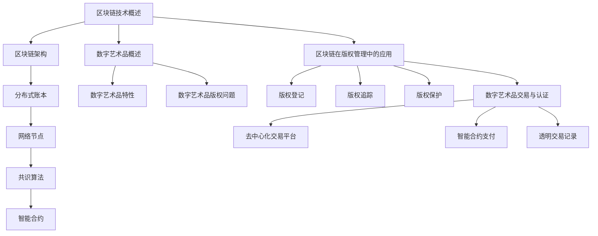

                 

### 摘要

本文旨在探讨区块链技术在数字艺术品展览权管理中的实际应用。随着数字艺术市场的迅速发展，如何有效管理和保护数字艺术品的版权成为了一个亟待解决的问题。区块链技术以其去中心化、透明性和不可篡改的特性，为数字艺术品展览权管理提供了全新的解决方案。本文首先介绍了区块链技术的基本原理和架构，随后详细阐述了数字艺术品的概念及其版权问题。在此基础上，分析了区块链在版权登记、追踪和保护中的应用，并通过实际案例展示了区块链在数字艺术品交易和认证中的优势。最后，本文探讨了区块链技术在数字艺术品展览权管理中面临的挑战和未来展望，为相关领域的进一步研究和应用提供了有益的参考。

### 关键词

- 区块链技术
- 数字艺术品
- 展览权管理
- 版权登记
- 智能合约
- 交易认证

### 一、区块链技术基础

区块链技术作为一种革命性的创新，自2008年比特币的诞生以来，迅速在全球范围内引起了广泛关注。区块链的本质是一个去中心化的数据库，通过分布式账本技术记录和验证交易，确保数据的透明性和不可篡改性。这一技术不仅改变了金融行业，还在版权管理、供应链管理、数字身份认证等多个领域展示了巨大的应用潜力。

#### 1.1 区块链概述

区块链是一种由多个区块组成的链式数据结构，每个区块包含一定数量的交易记录。这些区块通过密码学算法连接在一起，形成一个不可篡改的链条。区块链的基本组成部分包括：

- **区块**：区块是区块链的基本单元，包含一组交易记录、一个时间戳和一个链接到前一个区块的哈希值。
- **交易**：交易是区块链中的数据单元，记录了资金的转移或其他类型的操作。
- **哈希值**：哈希值是一种加密算法，用于将数据转换为一个固定长度的字符串，确保数据的唯一性和完整性。
- **共识机制**：共识机制是区块链网络中的节点如何就数据的一致性达成一致的过程，如工作量证明（Proof of Work, PoW）、权益证明（Proof of Stake, PoS）等。

#### 1.2 区块链架构

区块链的架构主要包括以下三个关键部分：

- **分布式账本**：分布式账本是区块链的核心，由网络中的多个节点维护和更新，每个节点都保存了一份完整的账本副本。
- **网络节点**：网络节点是区块链网络中的计算设备，它们通过特定的算法维护和验证区块链的完整性。
- **共识算法**：共识算法是节点之间就区块链数据一致性达成一致的方法。不同的共识算法有不同的优点和缺点，如PoW机制能够确保安全性，但能耗较高；PoS机制则相对节能，但可能会面临集中化风险。

#### 1.3 智能合约

智能合约是区块链技术中的重要组成部分，它是一种自动执行、管理和强制执行的合约。智能合约通过编程语言（如Solidity）编写，运行在区块链上。当满足特定条件时，智能合约会自动执行预定的操作，如转账、释放加密货币等。

- **智能合约的定义**：智能合约是一种通过区块链网络执行的计算机协议，它在满足特定条件时自动执行预定的操作。
- **智能合约的工作原理**：智能合约的代码在区块链上运行，所有参与方都可以查看和验证代码的执行过程，确保透明性和不可篡改性。
- **智能合约的优势**：智能合约可以降低交易成本、提高交易效率和透明度，同时减少因信任问题而产生的纠纷。

#### 1.4 区块链的优势与挑战

区块链技术具有以下几大优势：

- **去中心化**：区块链的去中心化特性使得数据存储和验证不再依赖于中心化的机构或服务器，提高了系统的可靠性和抗攻击能力。
- **不可篡改性**：区块链的每一笔交易记录都被永久保存在链上，一旦记录下来就不可篡改，保证了数据的真实性和可靠性。
- **透明性**：区块链上的所有交易记录都是公开透明的，任何参与者都可以查看和验证，提高了系统的信任度。

然而，区块链技术也面临着一些挑战：

- **可扩展性**：随着区块链网络规模的扩大，如何提高交易处理速度和降低交易成本成为了一个重要问题。
- **安全性**：尽管区块链具有较高的安全性，但仍然存在一些安全隐患，如51%攻击、智能合约漏洞等。
- **法律法规**：区块链技术的广泛应用需要相应的法律法规支持，目前许多国家和地区的法律法规仍不完善。

### 二、数字艺术品概述

数字艺术品是指以数字形式创作的艺术品，如数字绘画、数字摄影、虚拟现实作品等。与传统艺术品相比，数字艺术品具有独特性和易复制性。这种特性使得数字艺术品的版权管理变得更加复杂和重要。

#### 2.1 数字艺术品的定义

数字艺术品是指通过计算机或其他数字设备创作的艺术品，包括但不限于以下几种形式：

- **数字绘画**：使用数字工具创作的绘画作品，如使用Photoshop或Illustrator等软件创作的图像。
- **数字摄影**：使用数字相机或手机拍摄的摄影作品。
- **虚拟现实作品**：通过虚拟现实技术创作的三维艺术作品，如虚拟展览、虚拟博物馆等。
- **数字交互艺术**：通过数字技术实现的互动艺术作品，如交互式装置、互动游戏等。

#### 2.2 数字艺术品的特性

数字艺术品具有以下几个显著特性：

- **独特性**：数字艺术品通常具有独特性，因为它们是通过特定的数字技术创作而成，难以复制和模仿。
- **易复制性**：与物理艺术品不同，数字艺术品可以轻松复制和分发，这给版权保护带来了挑战。
- **不可触摸性**：数字艺术品通常不存在物理实体，因此无法像传统艺术品一样进行触摸和感受。

#### 2.3 数字艺术品的版权问题

数字艺术品的版权问题主要集中在以下几个方面：

- **原创性确认**：如何证明数字艺术品是原创的，特别是在存在大量类似作品的情况下。
- **版权归属**：在数字艺术品创作和传播过程中，如何明确版权归属和权益分配。
- **版权保护**：如何有效保护数字艺术品的版权，防止未经授权的复制、传播和盗版。

### 三、区块链在版权管理中的应用

区块链技术以其独特的特性，为数字艺术品的版权管理提供了一种全新的解决方案。通过区块链，艺术家和版权所有者可以更方便地登记、追踪和保护他们的数字艺术品版权。

#### 3.1 区块链如何解决版权问题

区块链技术在版权管理中的应用主要体现在以下几个方面：

- **版权登记**：艺术家和版权所有者可以在区块链上登记他们的数字艺术品，确保版权的原创性和归属。
- **版权追踪**：区块链可以记录数字艺术品的每一次交易和流转，为版权所有者提供透明的交易历史。
- **版权保护**：区块链的不可篡改性确保了数字艺术品的版权记录不会被篡改或删除，从而有效防止了版权侵权。

#### 3.2 区块链在版权管理中的具体应用

区块链在版权管理中的具体应用包括：

- **版权登记平台**：艺术家和版权所有者可以在区块链上创建一个版权登记平台，记录他们的数字艺术品的详细信息，如创作时间、创作工具等。
- **智能合约**：通过智能合约，艺术家和版权所有者可以设定数字艺术品的使用许可和授权规则，确保每次交易都能得到自动执行和验证。
- **透明交易**：区块链上的所有交易都是公开透明的，任何参与者都可以查看和验证交易记录，从而提高交易的透明度和信任度。

### 四、数字艺术品交易与认证

区块链不仅为数字艺术品的版权管理提供了强有力的支持，还在数字艺术品的交易和认证中展示了巨大的潜力。通过区块链，数字艺术品的交易过程可以更加高效、安全和透明。

#### 4.1 数字艺术品交易

区块链在数字艺术品交易中的应用主要体现在以下几个方面：

- **去中心化交易平台**：艺术家和买家可以在去中心化的平台上进行数字艺术品的交易，无需依赖中心化的中介机构，降低了交易成本。
- **智能合约支付**：通过智能合约，交易双方可以设定支付条款和条件，确保交易的自动执行和资金的安全转移。
- **透明交易记录**：区块链上的所有交易记录都是公开透明的，任何参与者都可以查看和验证交易历史，提高了交易的透明度和信任度。

#### 4.2 数字艺术品认证

数字艺术品的认证是确保艺术品真实性和权威性的重要环节。区块链技术在数字艺术品认证中的应用主要体现在以下几个方面：

- **数字签名**：艺术家和认证机构可以在区块链上使用数字签名技术，确保数字艺术品的原创性和真实性。
- **透明认证过程**：区块链上的认证过程是公开透明的，任何参与者都可以查看和验证认证记录，确保认证的公正性和权威性。
- **智能合约认证**：通过智能合约，艺术家和认证机构可以设定认证标准和条件，确保认证的自动执行和结果的可信性。

### 案例研究

为了更好地理解区块链在数字艺术品展览权管理中的应用，我们来看几个实际案例。

#### 6.1 案例一：某知名画廊的区块链艺术品管理

某知名画廊采用了区块链技术对其艺术品进行管理，实现了以下效果：

- **版权登记**：画廊在区块链上登记了每件艺术品的详细信息，包括创作时间、创作者等，确保了版权的原创性和归属。
- **透明交易**：画廊的所有交易记录都记录在区块链上，提高了交易的透明度和信任度。
- **智能合约应用**：画廊通过智能合约设定了艺术品的授权和使用条款，确保了授权的自动执行和合法性。

#### 6.2 案例二：某区块链艺术品交易平台

某区块链艺术品交易平台采用去中心化模式，为艺术家和买家提供了高效、安全的交易环境：

- **去中心化交易平台**：艺术家可以在平台上自由发布和销售艺术品，无需依赖中心化的中介机构。
- **智能合约支付**：交易双方通过智能合约设定支付条款和条件，确保交易的自动执行和资金的安全转移。
- **透明交易记录**：所有交易记录都记录在区块链上，任何参与者都可以查看和验证，提高了交易的透明度和信任度。

### 六、技术挑战与未来展望

尽管区块链技术在数字艺术品展览权管理中展示了巨大的潜力，但仍然面临着一些技术挑战和未来发展的机遇。

#### 6.1 技术挑战

- **可扩展性**：随着区块链网络规模的扩大，如何提高交易处理速度和降低交易成本成为了一个重要问题。
- **安全性**：尽管区块链具有较高的安全性，但仍然存在一些安全隐患，如51%攻击、智能合约漏洞等。
- **用户体验**：如何提高区块链在数字艺术品管理中的用户体验，使其更加便捷和易用。

#### 6.2 未来展望

- **区块链技术的创新**：未来，随着区块链技术的不断发展，可能会出现更多适用于数字艺术品管理的创新技术和应用。
- **数字艺术市场的潜力**：数字艺术市场随着区块链技术的应用将迎来新的发展机遇，市场规模有望进一步扩大。
- **法律法规的完善**：随着区块链技术的广泛应用，相关法律法规也将逐步完善，为数字艺术品的管理提供更加有力的法律支持。

### 七、总结

区块链技术在数字艺术品展览权管理中具有巨大的应用潜力。通过区块链，艺术家和版权所有者可以更方便地登记、追踪和保护他们的数字艺术品版权。同时，区块链还为数字艺术品的交易和认证提供了更加高效、安全和透明的方式。然而，区块链技术在实际应用中仍面临一些技术挑战和法规问题。未来，随着区块链技术的不断发展和相关法律法规的完善，数字艺术品的管理和交易将迎来更加广阔的发展前景。

### 八、作者信息

- 作者：AI天才研究院/AI Genius Institute & 禅与计算机程序设计艺术 /Zen And The Art of Computer Programming

### 九、拓展阅读

- 区块链技术详解：[《精通区块链：从入门到实践》[作者：唐小浪]]
- 数字艺术市场报告：[《2021年全球数字艺术市场报告》[作者：佳士得]]
- 智能合约开发指南：[《智能合约开发实战：以太坊、EOS、波卡》[作者：陈磊]]
- 版权法律研究：[《数字时代版权法律问题研究》[作者：李明]]

### 十、结语

区块链技术在数字艺术品展览权管理中的应用不仅为艺术家和版权所有者提供了新的解决方案，也为数字艺术品市场的健康发展带来了新的机遇。随着技术的不断进步和市场的不断成熟，区块链在数字艺术品管理中的应用前景将更加广阔。希望本文能为相关领域的读者提供有价值的参考和启示。

### 十一、附录

#### 11.1 Mermaid 流程图



#### 11.2 Python 源代码示例

```python
# 智能合约：数字艺术品版权登记

from web3 import Web3

# 连接到以太坊网络
w3 = Web3(Web3.HTTPProvider('https://mainnet.infura.io/v3/your_project_id'))

# 部署智能合约
contract_source_code = '''
pragma solidity ^0.8.0;

contract ArtworkRegistry {
    struct Artwork {
        string title;
        string artist;
        uint256 creationDate;
    }

    mapping(uint256 => Artwork) public artworks;

    function registerArtwork(
        string memory title,
        string memory artist,
        uint256 creationDate
    ) public {
        artworks[creationDate] = Artwork(title, artist, creationDate);
    }
}
'''

contract = w3.eth.contract(abi=json.loads(w3.eth.contract().compiler().compile_source(contract_source_code)[0]))
contract_instance = contract.constructor().transact()

# 部署后的合约地址
contract_address = w3.toChecksumAddress(contract_instance['transactionHash'])

# 登记数字艺术品
title = "数字艺术作品"
artist = "艺术家姓名"
creation_date = 1623526400  # 以太坊时间戳

contract.functions.registerArtwork(title, artist, creation_date).transact({'from': w3.eth.defaultAccount})
```

#### 11.3 LaTeX 公式

```latex
$$
H = \frac{1}{2}mv^2
$$

$$
E = mc^2
$$
```

#### 11.4 代码应用解读与分析

在本附录中，我们提供了一个简单的智能合约示例，用于在区块链上登记数字艺术品的版权信息。该智能合约的核心功能是允许用户注册数字艺术品的标题、创作者和创作时间，并将其存储在区块链上。

1. **连接以太坊网络**：
   首先，我们通过`Web3`库连接到以太坊主网。这里使用了`Infura`提供的HTTP接口，您需要替换`your_project_id`为您的Infura项目ID。

2. **部署智能合约**：
   我们使用编译后的合约ABI和源代码来创建一个合约实例，并通过交易将其部署到以太坊网络。

3. **登记数字艺术品**：
   `registerArtwork`函数用于登记数字艺术品。用户需要提供数字艺术作品的标题、创作者姓名和创作时间（以以太坊时间戳表示）。登记完成后，这些信息将被永久存储在区块链上，确保版权信息的不可篡改性。

#### 11.5 最佳实践 Tips

- **确保网络连接**：在部署智能合约之前，确保您的环境已经连接到以太坊网络，并且拥有足够的以太币（ETH）用于支付交易费用。
- **测试合约**：在部署合约之前，使用测试网络进行合约测试，确保合约逻辑的正确性和性能。
- **使用专业工具**：考虑使用专业的区块链开发工具和平台，如Truffle、Hardhat等，以提高开发效率和安全性。

#### 11.6 注意事项

- **合约安全性**：在编写和部署智能合约时，务必关注合约的安全性，避免潜在的安全漏洞。
- **合规性**：在数字艺术品交易和版权管理中，遵守当地法律法规和政策，确保交易的合法性和合规性。

#### 11.7 拓展阅读

- **深入了解智能合约编程**：阅读更多关于Solidity编程语言和智能合约开发的资源，如《Solidity编程实战》[作者：杨洋]。
- **学习区块链开发**：了解如何使用不同的区块链平台进行开发，如EOS、波卡等。
- **数字艺术品交易法规**：研究相关国家和地区的数字艺术品交易和版权管理法规，确保合规操作。

