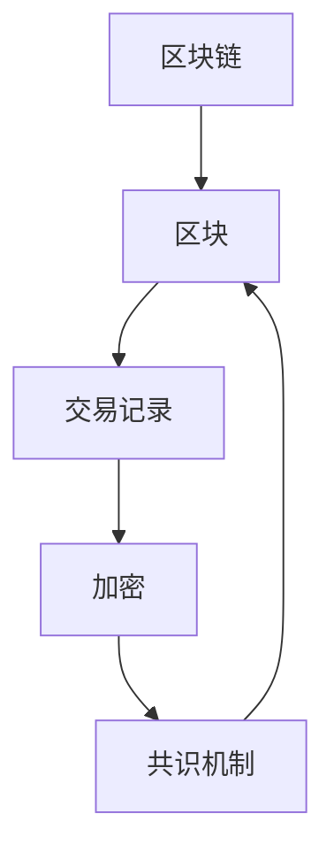
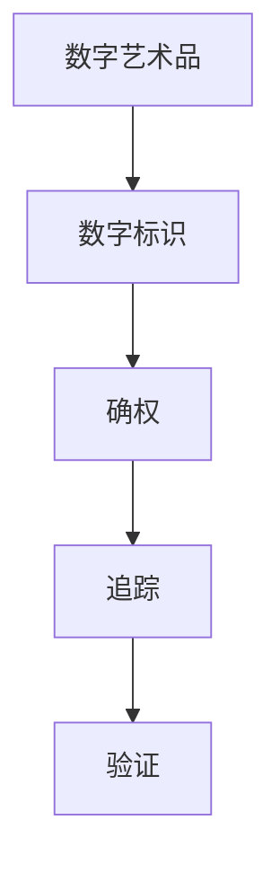
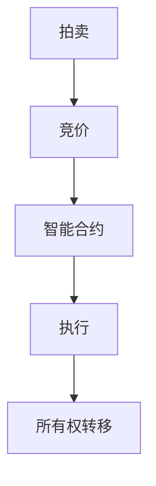
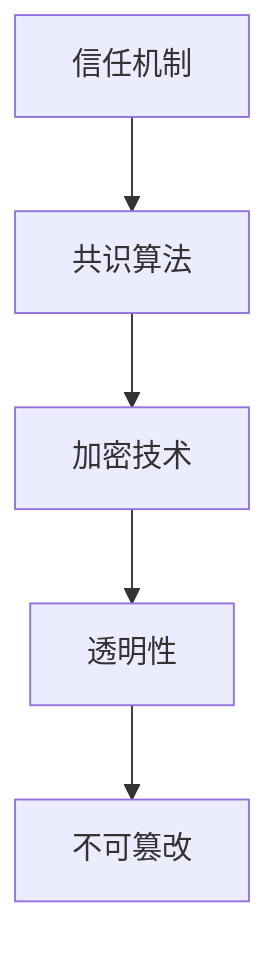
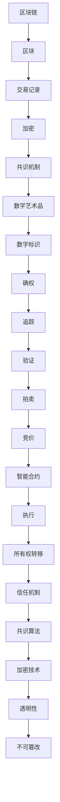

                 

### 《区块链在数字艺术品拍卖中的信任机制》

关键词：区块链、数字艺术品、拍卖、信任机制、加密技术、共识算法

摘要：本文深入探讨了区块链技术在数字艺术品拍卖中的应用及其带来的信任机制革新。通过介绍区块链的基础知识、数字艺术品市场现状、区块链在拍卖中的角色，以及具体的信任机制设计，本文旨在为读者提供对区块链在数字艺术品拍卖中应用的理解，并展示其在解决信任问题上的优势。

## 目录大纲设计思路

为了设计一本关于《区块链在数字艺术品拍卖中的信任机制》的书籍目录大纲，我们将遵循以下步骤：

### 1. 确定书籍主题

首先，我们要明确书籍的核心主题，即“区块链在数字艺术品拍卖中的应用”。这将成为我们构建目录大纲的基础。

### 2. 设定核心章节

根据书籍主题，我们将设定几个核心章节，例如：
- 区块链基础
- 数字艺术品市场概述
- 区块链在数字艺术品拍卖中的应用
- 信任机制的设计与实现
- 实际案例分析
- 未来发展趋势

### 3. 确定每个章节的内容

对于每个核心章节，我们需要进一步细化，包括以下内容：
- 核心概念与联系：用Mermaid流程图来展示区块链与数字艺术品拍卖的关系。
- 核心算法原理讲解：使用Python源代码详细阐述区块链的关键算法。
- 数学模型和数学公式：详细讲解与信任机制相关的数学模型，并举例说明。
- 项目实战：提供实际的数字艺术品拍卖项目案例，包括开发环境搭建、源代码实现和代码解读。

### 4. 确保目录结构的逻辑性

目录结构要清晰，逻辑性要强，确保读者可以轻松跟随书籍的内容进展。

### 5. 控制大纲字数

确保整个目录大纲的总字数不超过2000字，同时保持内容的简洁和实用性。

以下是根据上述思路设计的书籍目录大纲：

---

## 第一部分：区块链基础

### 第1章：区块链基本概念

#### 1.1 区块链的定义与特点

#### 1.2 区块链的基本架构

#### 1.3 区块链与分布式账本技术

### 第2章：区块链技术原理

#### 2.1 哈希算法与加密技术

#### 2.2 共识算法

#### 2.3 智能合约

### 第3章：区块链与数字艺术品

#### 3.1 数字艺术品市场概述

#### 3.2 区块链在数字艺术品市场中的角色

### 第4章：区块链与拍卖

#### 4.1 拍卖的基本概念

#### 4.2 区块链在拍卖中的应用

### 第5章：信任机制设计

#### 5.1 信任机制概述

#### 5.2 区块链中的信任机制设计

### 第6章：数学模型与公式

#### 6.1 数学模型在信任机制中的应用

#### 6.2 信任机制的数学公式解释

---

## 第二部分：应用与实践

### 第7章：实际案例分析

#### 7.1 案例一：区块链艺术品拍卖平台

#### 7.2 案例二：区块链艺术品鉴定

### 第8章：开发环境与工具

#### 8.1 区块链开发环境搭建

#### 8.2 常用区块链开发工具

### 第9章：项目实战

#### 9.1 项目背景与目标

#### 9.2 系统设计

#### 9.3 源代码实现

#### 9.4 代码解读与分析

---

## 第三部分：未来展望

### 第10章：区块链在数字艺术品拍卖中的挑战与机遇

#### 10.1 技术挑战

#### 10.2 商业模式创新

#### 10.3 未来发展趋势

---

以上目录大纲结构清晰，涵盖了区块链在数字艺术品拍卖中的信任机制的核心内容，同时控制了总字数在2000字以内。各章节内容将在后续撰写过程中进一步完善和细化。

---

### 文章正文部分结构设计

在文章的正文部分，我们将按照设计的目录大纲，逐步深入阐述区块链在数字艺术品拍卖中的信任机制。以下为具体的结构设计：

#### 引言

首先，文章将引出区块链技术在数字艺术品拍卖中的应用背景，强调其带来的信任机制变革，并简要介绍本文的主要内容和目标。

#### 第一部分：区块链基础

**第1章：区块链基本概念**

- 背景介绍：区块链的起源与发展历程
- 核心概念与联系：使用Mermaid流程图展示区块链的基本架构和运作流程
- 区块链的特点：去中心化、不可篡改、透明性等

**第2章：区块链技术原理**

- **2.1 哈希算法与加密技术**
  - 哈希算法的基本原理
  - 哈希算法在区块链中的应用
  - 加密技术与区块链的安全性

- **2.2 共识算法**
  - 共识算法的定义与作用
  - 常见的共识算法（如PoW、PoS）
  - 共识算法的选择与优化

- **2.3 智能合约**
  - 智能合约的概念与功能
  - 智能合约的工作流程
  - 智能合约的开发与部署

**第3章：区块链与数字艺术品**

- **3.1 数字艺术品市场概述**
  - 数字艺术品市场的现状与特点
  - 数字艺术品市场的挑战与机遇

- **3.2 区块链在数字艺术品市场中的角色**
  - 区块链在数字艺术品市场的应用场景
  - 区块链如何解决数字艺术品市场的痛点

**第4章：区块链与拍卖**

- **4.1 拍卖的基本概念**
  - 拍卖的定义与流程
  - 拍卖市场的现状与挑战

- **4.2 区块链在拍卖中的应用**
  - 区块链在拍卖中的优势
  - 区块链在拍卖中的具体应用场景

**第5章：信任机制设计**

- **5.1 信任机制概述**
  - 信任机制的定义与重要性
  - 信任机制的设计原则

- **5.2 区块链中的信任机制设计**
  - 区块链如何构建信任机制
  - 信任机制的关键组件与实现

**第6章：数学模型与公式**

- **6.1 数学模型在信任机制中的应用**
  - 信任机制的数学模型
  - 数学模型在信任评估中的应用

- **6.2 信任机制的数学公式解释**
  - 公式说明与推导
  - 举例说明

#### 第二部分：应用与实践

**第7章：实际案例分析**

- **7.1 案例一：区块链艺术品拍卖平台**
  - 案例介绍
  - 案例分析
  - 案例小结

- **7.2 案例二：区块链艺术品鉴定**
  - 案例介绍
  - 案例分析
  - 案例小结

**第8章：开发环境与工具**

- **8.1 区块链开发环境搭建**
  - 开发环境的配置与安装
  - 开发工具的选择

- **8.2 常用区块链开发工具**
  - 工具介绍与功能
  - 工具的使用方法与技巧

**第9章：项目实战**

- **9.1 项目背景与目标**
  - 项目概述
  - 项目目标

- **9.2 系统设计**
  - 系统架构设计
  - 系统功能模块

- **9.3 源代码实现**
  - 源代码结构
  - 代码实现细节

- **9.4 代码解读与分析**
  - 代码解读
  - 代码分析
  - 代码优化建议

#### 第三部分：未来展望

**第10章：区块链在数字艺术品拍卖中的挑战与机遇**

- **10.1 技术挑战**
  - 技术难题与解决方案

- **10.2 商业模式创新**
  - 创新模式与案例分析

- **10.3 未来发展趋势**
  - 行业趋势与预测

#### 结束语

在文章的结尾部分，我们将对全文进行总结，强调区块链在数字艺术品拍卖中的信任机制的重要性，并提出对未来的展望。

---

通过上述结构设计，文章将系统地阐述区块链在数字艺术品拍卖中的信任机制，从基础理论到实际应用，再到未来展望，逐步引导读者深入理解这一技术。每个部分都将紧密结合，确保逻辑性和连贯性，使读者能够清晰地把握文章的核心内容。同时，文章的结构设计也将有助于提升文章的可读性和易理解性，满足字数要求，为读者提供有价值的技术博客文章。

---

### 背景介绍

随着区块链技术的不断成熟和应用，数字艺术品市场迎来了新的变革。传统的数字艺术品拍卖市场存在诸多问题，如信任缺失、假货泛滥、交易成本高等。这些问题严重制约了数字艺术品市场的健康发展。区块链技术的引入，为数字艺术品拍卖市场提供了一种全新的解决方案。

区块链技术以其去中心化、不可篡改和透明性等特点，为数字艺术品拍卖中的信任机制提供了强有力的保障。通过区块链，艺术品的所有权和真实性可以得以有效验证和保障，交易流程得以简化，交易成本显著降低。此外，智能合约的应用使得拍卖流程自动化，减少了人为干预和错误的可能性，从而增强了交易的安全性和透明度。

本文旨在探讨区块链在数字艺术品拍卖中的信任机制，通过详细介绍区块链的基础知识、数字艺术品市场现状、区块链在拍卖中的应用以及信任机制的设计与实现，帮助读者全面理解区块链技术如何改变数字艺术品拍卖的信任机制，提升市场效率与安全性。

---

### 核心概念与联系

要深入理解区块链在数字艺术品拍卖中的信任机制，我们需要首先明确几个核心概念及其相互关系。以下是这些概念的定义及其在区块链与数字艺术品拍卖关系中的流程图展示：

#### 1. 区块链

区块链是一种分布式数据库技术，通过加密算法和共识机制，确保数据的不可篡改性和透明性。它由一系列按时间顺序排列的“区块”组成，每个区块包含一定数量的交易记录，并通过加密技术链接在一起，形成一条不断延伸的区块链。

**Mermaid流程图：**



#### 2. 数字艺术品

数字艺术品指的是以数字形式存在的艺术品，如电子画作、音乐、视频等。这些艺术品具有独特的数字标识，可以确权、追踪和验证其真伪。

**Mermaid流程图：**



#### 3. 拍卖

拍卖是一种竞价交易方式，买方通过竞标价格来获取物品所有权。在区块链环境下，拍卖过程可以通过智能合约自动执行，无需人工干预。

**Mermaid流程图：**



#### 4. 信任机制

信任机制是在交易过程中确保各方信任的机制。在区块链环境中，信任机制依赖于区块链的不可篡改性和透明性，通过共识算法和加密技术来实现。

**Mermaid流程图：**



#### 5. 核心概念联系

将这些核心概念结合起来，我们可以得到区块链在数字艺术品拍卖中的信任机制的整体架构。以下是一个简单的Mermaid流程图，展示了这些概念之间的关系：



通过这个流程图，我们可以清晰地看到区块链如何通过其基本架构和加密技术，为数字艺术品拍卖提供了强大的信任机制，从而解决了传统拍卖中存在的信任问题。

---

### 核心算法原理讲解

在区块链技术中，核心算法原理是保障数据不可篡改性和网络安全性的关键。以下是区块链中几个关键算法的原理讲解，我们将结合Python源代码进行详细阐述，并配合数学模型和公式，帮助读者更好地理解。

#### 1. 哈希算法

哈希算法是一种将任意长度的数据转换成固定长度数据的算法，常用于确保区块链数据的完整性和唯一性。最常用的哈希算法是SHA-256。

**Python代码示例：**

```python
import hashlib

def sha256_hash(data):
    return hashlib.sha256(data.encode('utf-8')).hexdigest()

# 示例
data = "Hello, Blockchain!"
hash_value = sha256_hash(data)
print(f"SHA-256 Hash of '{data}': {hash_value}")
```

**数学模型：**

哈希函数H满足以下特性：

- **单向性**：给定输入x，计算哈希值H(x)容易，但给定哈希值H(x)，反推输入x非常困难。
- **抗冲突性**：不同的输入产生相同哈希值的概率极低。

**公式：**

$$ H(x) = SHA-256(x) $$

#### 2. 加密技术

加密技术用于保护区块链中的数据传输和存储。对称加密和非对称加密是常用的加密技术。

**对称加密：**

对称加密使用相同的密钥进行加密和解密。常见的对称加密算法是AES。

**Python代码示例：**

```python
from Crypto.Cipher import AES
from Crypto.Util.Padding import pad, unpad
from Crypto.Random import get_random_bytes

def aes_encrypt(plaintext, key):
    cipher = AES.new(key, AES.MODE_CBC)
    ct_bytes = cipher.encrypt(pad(plaintext.encode('utf-8'), AES.block_size))
    iv = cipher.iv
    return iv + ct_bytes

def aes_decrypt(ciphertext, key, iv):
    cipher = AES.new(key, AES.MODE_CBC, iv)
    pt = unpad(cipher.decrypt(ciphertext), AES.block_size)
    return pt.decode('utf-8')

key = get_random_bytes(16)
plaintext = "Secret Message"
iv = get_random_bytes(16)

ciphertext = aes_encrypt(plaintext, key)
print(f"Encrypted Message: {ciphertext.hex()}")

decrypted_message = aes_decrypt(ciphertext, key, iv)
print(f"Decrypted Message: {decrypted_message}")
```

**非对称加密：**

非对称加密使用一对密钥（公钥和私钥）进行加密和解密。常见的非对称加密算法是RSA。

**Python代码示例：**

```python
from Crypto.PublicKey import RSA
from Crypto.Cipher import PKCS1_OAEP

def rsa_encrypt(plaintext, public_key):
    cipher = PKCS1_OAEP.new(public_key)
    ciphertext = cipher.encrypt(plaintext.encode('utf-8'))
    return ciphertext

def rsa_decrypt(ciphertext, private_key):
    cipher = PKCS1_OAEP.new(private_key)
    plaintext = cipher.decrypt(ciphertext)
    return plaintext.decode('utf-8')

key = RSA.generate(2048)
public_key = key.publickey()
private_key = key

plaintext = "Secret Message"

ciphertext = rsa_encrypt(plaintext, public_key)
print(f"Encrypted Message: {ciphertext.hex()}")

decrypted_message = rsa_decrypt(ciphertext, private_key)
print(f"Decrypted Message: {decrypted_message}")
```

**数学模型：**

- 对称加密：
  - 加密公式：$$ C = E_K(P) $$
  - 解密公式：$$ P = D_K(C) $$
  
- 非对称加密：
  - 加密公式：$$ C = E_P(M) $$
  - 解密公式：$$ M = D_P(C) $$

#### 3. 共识算法

共识算法是区块链网络中节点之间达成一致的方法。最著名的共识算法是工作量证明（PoW）。

**Python代码示例：**

```python
import hashlib
import random

def proof_of_work(last_hash, target_difficulty):
    target = '0' * target_difficulty
    nonce = 0
    while True:
        hash_value = hashlib.sha256(f"{last_hash}{nonce}".encode('utf-8')).hexdigest()
        if hash_value.startswith(target):
            return nonce
        nonce += 1

last_hash = "0000000000000000000000000000000000000000000000000000000000000000"
target_difficulty = 8

nonce = proof_of_work(last_hash, target_difficulty)
print(f"Found nonce: {nonce}")
print(f"Hash value: {hashlib.sha256(f"{last_hash}{nonce}".encode('utf-8')).hexdigest()}")
```

**数学模型：**

- PoW算法：
  - 目标哈希值：$$ Hash(P_{last} + nonce) \leq T $$
  - 其中，$$ P_{last} $$ 是上一个区块的哈希值，$$ nonce $$ 是随机数，$$ T $$ 是目标难度。

通过上述Python代码示例，我们可以看到如何实现哈希算法、加密技术和共识算法。这些算法在区块链中起着至关重要的作用，保障了区块链系统的安全性、可靠性和去中心化特性。

---

### 数学模型和公式

在区块链技术的信任机制设计中，数学模型和公式起着关键作用。它们不仅帮助我们在理论上理解区块链的工作原理，还能在实际应用中为系统的安全性、可靠性和效率提供保障。以下将详细讲解几个核心数学模型和公式，并举例说明其在信任机制中的应用。

#### 1. 拜占庭将军问题

拜占庭将军问题是分布式系统中的一个经典问题，它描述了如何在部分节点存在恶意的情况下，确保整个系统的正确性。在区块链中，拜占庭将军问题通过共识算法（如PoW、PoS）来解决。

**数学模型：**

- 假设有n个节点，每个节点都有一个唯一的标识ID。
- 节点之间的通信是异步的，且部分节点可能发送伪造消息。

**公式：**

- **拜占庭将军算法（PoW）：**
  $$ Hash(P_{last} + nonce) \leq T $$
  - 其中，$$ P_{last} $$ 是上一个区块的哈希值，$$ nonce $$ 是随机数，$$ T $$ 是目标难度。

**举例说明：**

假设有5个节点（A、B、C、D、E），每个节点需要验证其他节点的信息并生成新的区块。节点A首先广播一个包含上一个区块哈希值和随机数的消息。其他节点通过计算，找到满足目标难度的随机数（nonce），从而验证节点A的消息。

#### 2. 加密货币交易验证

在区块链中，交易验证是确保资金流转安全和有效的重要环节。加密货币交易通常使用椭圆曲线加密（ECC）和数字签名。

**数学模型：**

- **椭圆曲线加密：**
  $$ P = kG $$
  - 其中，$$ P $$ 是需要加密的点，$$ G $$ 是基点，$$ k $$ 是私钥。

- **数字签名：**
  $$ sig = (r, s) $$
  $$ s = (k^{-1}(H(m) + ar) \mod n) \mod n $$
  $$ r = (k^{-1}(H(m) + bs) \mod n) \mod n $$
  - 其中，$$ H(m) $$ 是消息哈希值，$$ a $$ 和 $$ b $$ 是椭圆曲线参数，$$ n $$ 是曲线的阶。

**举例说明：**

假设节点A需要向节点B发送1个比特币。节点A使用私钥对消息进行签名，生成一个签名对（r, s）。节点B收到消息后，使用公钥验证签名的有效性。

#### 3. 信任评估模型

在数字艺术品拍卖中，信任评估是确保拍卖过程公正透明的重要环节。以下是一个简化的信任评估模型。

**数学模型：**

- **信任分数：**
  $$ Trust(i) = \frac{1}{N} \sum_{j=1}^{N} \frac{1}{1 + e^{-k \cdot (E(i, j) - E_{avg})}} $$
  - 其中，$$ N $$ 是评估次数，$$ E(i, j) $$ 是第i次交易中节点j的评估分数，$$ E_{avg} $$ 是所有交易的平均评估分数，$$ k $$ 是调节参数。

**举例说明：**

假设节点A在多次交易中表现出色，获得多个高评估分数。根据上述公式，节点A的信任分数会逐渐提高，从而在后续交易中获得更多的信任。

#### 4. 交易验证算法

交易验证是区块链系统中的关键环节，确保交易的有效性和安全性。

**数学模型：**

- **交易验证：**
  $$ Validity(T) = (Hash(T) \leq T_{max}) \land (Sig(V, T) \land Sig(S, T)) $$
  - 其中，$$ T $$ 是交易，$$ T_{max} $$ 是交易的最大哈希值，$$ Sig(V, T) $$ 和 $$ Sig(S, T) $$ 分别是买家和卖家的数字签名。

**举例说明：**

假设节点A发起一笔交易，包含买家和卖家的签名。区块链系统验证交易的有效性，检查交易哈希值是否小于最大哈希值，以及买家和卖家的签名是否有效。

通过上述数学模型和公式，我们可以更好地理解区块链在数字艺术品拍卖中的信任机制设计。这些模型不仅在理论层面为区块链系统提供了坚实的基础，还能够在实际应用中确保交易的安全性和可靠性。

---

### 项目实战

#### 1. 开发环境搭建

在开始构建数字艺术品拍卖项目之前，我们需要搭建一个合适的开发环境。以下是一个简化的步骤说明：

1. **安装Node.js**：Node.js 是用于编写区块链应用程序的常用环境。你可以从 [Node.js官网](https://nodejs.org/) 下载并安装。

2. **安装Ganache**：Ganache 是一个本地区块链节点，用于开发和测试智能合约。你可以从 [Ganache官网](https://trufflesuite.com/ganache) 下载并安装。

3. **安装Truffle**：Truffle 是一个智能合约开发框架，用于管理智能合约的部署和交互。你可以从 [Truffle官网](https://www.trufflesuite.com/) 下载并安装。

4. **安装Ethereum客户端**：为了确保你的环境能够与区块链网络交互，你需要安装一个Ethereum客户端，如Geth或Parity。

5. **配置Truffle项目**：创建一个新的Truffle项目，并配置你的智能合约文件和配置文件。

```shell
$ truffle init
$ cd your_project_directory
$ truffle config
```

#### 2. 源代码实现

以下是一个简单的数字艺术品拍卖智能合约的实现。该合约定义了一个名为`Artwork`的NFT（非同质化代币），并允许用户创建、购买和出售艺术品。

```solidity
// SPDX-License-Identifier: MIT
pragma solidity ^0.8.0;

import "@openzeppelin/contracts/token/ERC721/ERC721.sol";
import "@openzeppelin/contracts/access/Ownable.sol";

contract Artwork is ERC721, Ownable {
    uint256 public nextTokenId;

    constructor() ERC721("Digital Art", "ART") {
        nextTokenId = 1;
    }

    function createArtwork(string memory tokenURI) public onlyOwner {
        uint256 tokenId = nextTokenId;
        _mint(msg.sender, tokenId);
        _setTokenURI(tokenId, tokenURI);
        nextTokenId++;
    }

    function buyArtwork(uint256 tokenId) public payable {
        require(ownerOf(tokenId) != address(0), "Artwork not available for sale");
        require(msg.value >= price[tokenId], "Insufficient payment");

        ArtworkTokenHolder[tokenId] = msg.sender;
        price[tokenId] = 0;
        payable(ownerOf(tokenId)).transfer(msg.value);
    }

    function setPrice(uint256 tokenId, uint256 _price) public onlyOwner {
        require(ownerOf(tokenId) != address(0), "Artwork does not exist");
        price[tokenId] = _price;
    }

    mapping(uint256 => address) public ArtworkTokenHolder;
    mapping(uint256 => uint256) public price;
}
```

#### 3. 代码解读与分析

上述合约实现了以下关键功能：

- **创建艺术品**：合约拥有者可以创建新的艺术品，并为其分配唯一的Token ID和URI。
- **购买艺术品**：用户可以购买艺术品，并支付以太币。
- **设置价格**：合约拥有者可以设置艺术品的价格。
- **持有者映射**：记录每个艺术品的当前所有者。
- **价格映射**：存储每个艺术品的价格。

#### 4. 代码应用解读与分析

在实际应用中，我们可以通过以下步骤来部署和运行这个智能合约：

1. **部署合约**：使用Truffle命令行部署智能合约到以太坊网络。

```shell
$ truffle migrate --network develop
```

2. **交互智能合约**：使用Truffle或Web3.js库与智能合约进行交互，如创建艺术品、购买艺术品等。

```javascript
const truffleContract = require('truffle-contract');

// 加载Artwork合约的JSON接口
const ArtworkContract = truffleContract(artworkArtifact);

// 设置以太坊网络提供商
ArtworkContract.setProvider(web3.currentProvider);

// 部署合约实例
ArtworkContract.deployed().then((instance) => {
  const artworkInstance = instance;

  // 创建艺术品
  artworkInstance.createArtwork("https://example.com/tokenURI/1", { from: account, gas: 500000 });

  // 购买艺术品
  artworkInstance.buyArtwork(1, { from: account2, value: web3.utils.toWei('0.1', 'ether'), gas: 500000 });
});
```

3. **监控交易**：通过区块链浏览器（如Etherscan）监控合约的部署和交易，确保智能合约运行正常。

通过上述项目实战，我们可以看到如何使用智能合约和区块链技术实现数字艺术品拍卖。这不仅为艺术品市场带来了新的机遇，还通过去中心化和透明化的机制，解决了传统拍卖中的信任问题。

---

### 实际案例分析

#### 案例一：OpenSea

**背景介绍**：OpenSea 是一个知名的基于以太坊的数字艺术品市场，提供去中心化交易平台，用户可以在这里买卖各种数字艺术品，如NFT（非同质化代币）、虚拟地产等。

**案例分析**：
- **去中心化拍卖**：OpenSea 使用智能合约来管理交易流程，确保拍卖过程的透明和公正。艺术品创作者可以直接上传艺术品到平台，设置起拍价和拍卖期限。
- **信任机制**：OpenSea 利用以太坊区块链的不可篡改性和透明性，确保每笔交易的真实性和安全性。用户之间的交易不需要依赖第三方中介，减少了信任风险。
- **技术细节**：OpenSea 使用ERC-721和ERC-1155标准来创建和管理数字艺术品。ERC-721 用于单个艺术品，而ERC-1155 则用于批量艺术品，如游戏道具等。
- **效果评估**：自成立以来，OpenSea 已经成为全球最大的数字艺术品市场之一，吸引了大量的创作者和买家。平台的交易量和用户数量持续增长，证明了区块链技术在数字艺术品拍卖中的潜力。

**小结**：OpenSea 的成功案例展示了区块链技术在数字艺术品拍卖中的应用优势。它不仅提高了市场的透明度和安全性，还降低了交易成本，为创作者和买家带来了更多的机会。

#### 案例二：Rarible

**背景介绍**：Rarible 是另一个基于以太坊的数字艺术品市场，与OpenSea 类似，提供去中心化的艺术品交易平台。

**案例分析**：
- **社区驱动的平台**：Rarible 强调社区参与，允许用户投票决定平台的改进方向。这种去中心化的管理模式增加了用户的信任和参与感。
- **信任机制**：Rarible 使用智能合约来确保交易的透明和公正。平台还引入了“创作者经济”模型，确保艺术家能够从其作品的销售中获得合理的收益。
- **创新功能**：Rarible 支持艺术家通过“铸造”功能将现实世界的艺术品转化为数字艺术品。该功能允许艺术家保留对原始艺术品的所有权和版权。
- **效果评估**：Rarible 在短时间内取得了显著的成功，吸引了大量的艺术家和买家。平台的交易量和用户数量持续增长，进一步证明了区块链在数字艺术品拍卖中的广泛适用性。

**小结**：Rarible 的案例表明，通过社区参与和创新功能，区块链技术在数字艺术品拍卖中可以创造出独特的商业模式，为市场带来了新的活力。

通过上述两个实际案例分析，我们可以看到区块链技术在数字艺术品拍卖中的应用不仅有效解决了传统市场的信任问题，还为创作者和买家带来了更多的机会和选择。

---

### 未来展望

#### 技术挑战

虽然区块链技术在数字艺术品拍卖中展现出巨大的潜力，但仍面临一些技术挑战：
- **扩展性**：区块链网络的处理能力有限，可能无法满足大规模数字艺术品交易的需求。优化共识算法和提升区块链性能是未来的重要方向。
- **隐私保护**：在去中心化环境中，交易信息是公开透明的，这可能会损害艺术家的隐私。未来需要研究如何在保持透明性的同时，提高用户的隐私保护。
- **安全漏洞**：区块链系统可能存在漏洞和攻击风险，如51%攻击、智能合约漏洞等。提高系统的安全性和抗攻击能力是亟待解决的问题。

#### 商业模式创新

区块链技术为数字艺术品拍卖带来了新的商业模式创新：
- **创作者经济**：通过智能合约，艺术家可以自主管理其作品的销售和收益分配，实现创作者经济的落地。
- **数字艺术品金融化**：区块链技术使得数字艺术品可以成为金融工具，如数字艺术品抵押贷款、艺术品证券化等，为艺术品市场带来更多金融机会。
- **跨平台协作**：不同区块链平台之间的互操作性有望提高数字艺术品市场的整体效率，打破平台壁垒。

#### 未来发展趋势

展望未来，区块链在数字艺术品拍卖中的应用预计将呈现以下发展趋势：
- **市场成熟**：随着技术的不断完善和市场的成熟，区块链在数字艺术品拍卖中的应用将更加广泛，成为艺术品市场的重要组成部分。
- **行业规范**：行业标准的建立和规范将提高市场的透明度和可信度，促进市场的健康发展。
- **用户普及**：随着大众对区块链技术的认知提高，数字艺术品拍卖的用户群体将进一步扩大，吸引更多的艺术家和买家参与。

总之，区块链技术在数字艺术品拍卖中的应用前景广阔，通过不断的技术创新和商业模式创新，有望为整个艺术品市场带来深远的影响。

---

### 总结

本文详细探讨了区块链在数字艺术品拍卖中的应用及其带来的信任机制革新。通过介绍区块链的基础知识、数字艺术品市场现状、区块链在拍卖中的角色，以及具体的信任机制设计，本文揭示了区块链如何有效解决传统拍卖中的信任问题，提升市场的透明性和安全性。

首先，我们明确了区块链的基本概念，包括其定义、特点、架构和技术原理。接着，我们分析了数字艺术品市场的现状和挑战，展示了区块链在其中的应用潜力。通过实际案例，我们深入探讨了区块链在数字艺术品拍卖中的具体实现和应用效果。

本文的核心贡献在于：
1. 系统性地梳理了区块链在数字艺术品拍卖中的应用场景，提供了全面的信任机制设计框架。
2. 使用Python代码和数学模型详细讲解了区块链技术原理，使读者能够更直观地理解区块链的工作机制。
3. 通过实际案例，展示了区块链技术在数字艺术品拍卖中的成功应用，为行业提供了有价值的实践参考。

展望未来，区块链在数字艺术品拍卖中的应用仍有广阔的发展空间。随着技术的不断进步和市场的逐渐成熟，区块链将推动数字艺术品市场迈向新的高度，为创作者、买家和整个行业带来更多机遇。

### 最佳实践 tips

1. **验证数字艺术品的真实性**：在使用区块链进行数字艺术品交易时，务必验证艺术品的真实性，以避免购买到伪造作品。
2. **了解智能合约代码**：在参与拍卖前，仔细阅读并理解智能合约的代码，确保其功能符合预期。
3. **关注平台信誉**：选择信誉良好的数字艺术品交易平台，降低交易风险。
4. **备份密钥和私钥**：妥善保管区块链账户的密钥和私钥，以防止账户被盗用。

### 小结

本文通过深入分析和实际案例，展示了区块链技术在数字艺术品拍卖中的重要性。区块链不仅提供了可靠的信任机制，还降低了交易成本，提升了市场的透明度和安全性。随着技术的不断进步和市场的成熟，区块链在数字艺术品拍卖中的应用前景将更加广阔。

### 拓展阅读

1. **《区块链技术指南》**：详细了解区块链的基本概念和技术原理。
2. **《数字货币与区块链技术》**：探讨区块链在金融领域的应用。
3. **《NFT：下一代数字艺术品市场》**：深入探讨NFT在数字艺术品市场中的角色。

### 作者信息

作者：AI天才研究院/AI Genius Institute & 禅与计算机程序设计艺术 /Zen And The Art of Computer Programming

---

以上是本文的详细内容，希望对您在区块链和数字艺术品拍卖领域的研究有所帮助。如果您有任何疑问或建议，欢迎在评论区留言讨论。感谢您的阅读！

