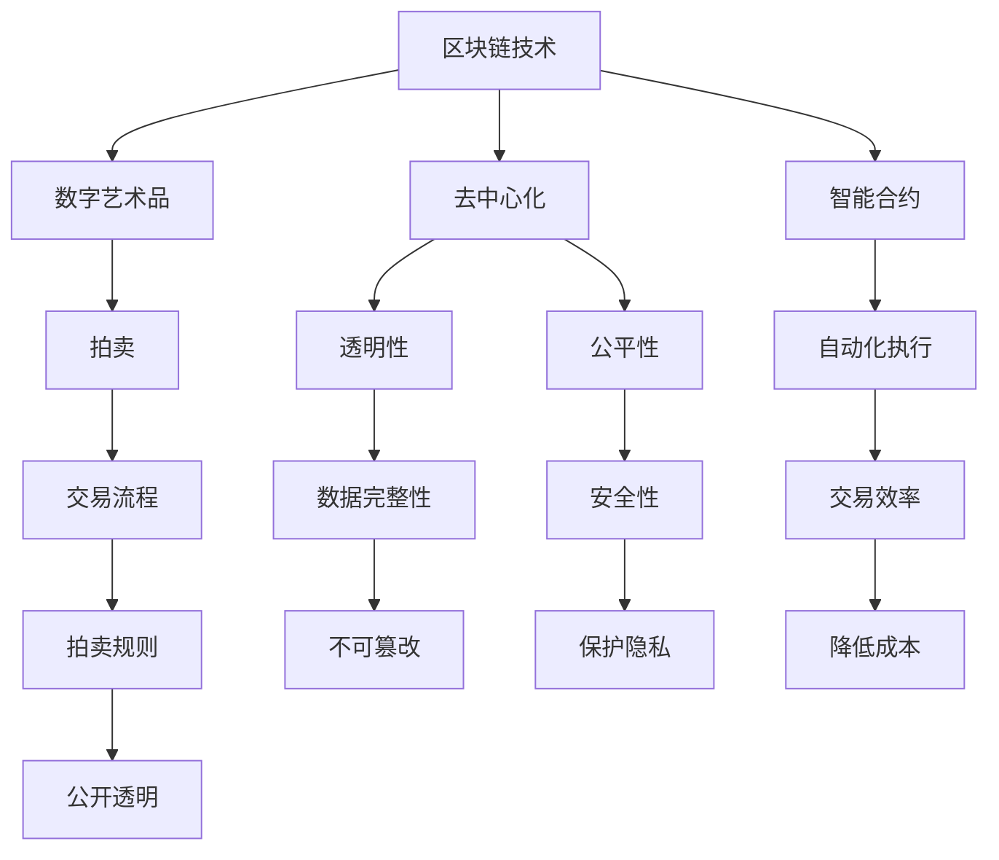

                 

### 文章标题

《区块链在数字艺术品拍卖中的应用：去中心化艺术品交易平台》

随着数字技术的发展，艺术品市场正在经历一场革命。区块链技术以其独特的去中心化、透明性和不可篡改性，为数字艺术品拍卖提供了新的可能性。本文将深入探讨区块链在数字艺术品拍卖中的应用，特别是去中心化艺术品交易平台的设计与实现。

关键词：区块链，数字艺术品，拍卖，去中心化，智能合约

摘要：本文首先介绍了区块链技术的基本原理和分类，然后分析了数字艺术品市场的现状。接着，详细探讨了区块链在艺术品拍卖中的优势，包括去中心化的交易流程、透明的交易记录和安全的交易保障。随后，本文介绍了去中心化艺术品交易平台的设计与实现，以及智能合约在艺术品交易中的应用。最后，本文讨论了数字艺术品拍卖中面临的安全性问题，并提出了相应的解决方案。

### 背景介绍

艺术品市场是一个古老的行业，但随着数字技术的崛起，数字艺术品市场正迅速崛起。数字艺术品，即以数字形式创作的艺术品，具有独特的可复制性和可追溯性。然而，传统的艺术品拍卖市场面临着一系列挑战，如交易流程复杂、信息不透明和安全性问题。

区块链技术的出现，为解决这些问题提供了新的思路。区块链是一种分布式数据库技术，通过去中心化的方式记录交易信息，保证了数据的透明性和不可篡改性。这使得区块链成为数字艺术品拍卖的理想选择。

### 核心概念与联系

为了更好地理解区块链在数字艺术品拍卖中的应用，我们需要了解一些核心概念：

1. **区块链技术**：区块链是一种分布式账本技术，通过加密算法和共识机制确保数据的完整性和安全性。
2. **数字艺术品**：数字艺术品是以数字形式创作的艺术品，可以是画作、雕塑、音乐等。
3. **去中心化**：去中心化意味着没有中央控制机构，所有节点都具有平等的地位，这确保了交易的透明性和公平性。
4. **智能合约**：智能合约是一种自动执行合约条款的计算机协议，它可以在满足特定条件时自动执行。

这些概念之间的关系可以用Mermaid流程图表示：



通过这个流程图，我们可以清晰地看到区块链技术如何应用于数字艺术品拍卖，以及各个概念之间的联系。

### 核心算法原理讲解

在区块链技术中，智能合约起着至关重要的作用。智能合约是一种自动执行合约条款的计算机协议，它通过编程逻辑实现自动化交易。以下是智能合约的基本原理和实现方法：

1. **智能合约的基本原理**

   智能合约的基本原理可以概括为“如果...那么...”。当满足特定的条件时，智能合约会自动执行预定的操作。例如，在数字艺术品拍卖中，当买家支付拍卖价格后，智能合约会自动将艺术品所有权转移给买家。

   Python实现示例：

   ```python
   def buy_artifact(artifact_id, buyer_id, price):
       if buyer_id != "":  # 检查买家是否有效
           if price > 0:  # 检查价格是否大于0
               # 将艺术品所有权转移给买家
               transfer_ownership(artifact_id, buyer_id)
               return "购买成功"
           else:
               return "价格无效"
       else:
           return "买家无效"
   ```

2. **智能合约的实现方法**

   在实现智能合约时，我们需要考虑以下几个方面：

   - **安全性**：智能合约的代码必须是安全的，不能被恶意攻击者利用。
   - **可扩展性**：智能合约应能够处理大量的交易，而不影响性能。
   - **易用性**：智能合约的代码应易于理解和修改。

   Python实现示例：

   ```python
   from web3 import Web3
   
   def deploy_contract(artifact_id, buyer_id, price):
       # 连接到区块链节点
       web3 = Web3(Web3.HTTPProvider('https://mainnet.infura.io/v3/your_project_id'))
       
       # 编写智能合约代码
       contract_code = '''
      pragma solidity ^0.8.0;
       
       contract SmartContract {
           function buy_artifact(uint256 artifact_id, address buyer_id, uint256 price) public {
               if (buyer_id != address(0)) {
                   if (price > 0) {
                       // 将艺术品所有权转移给买家
                       transfer_ownership(artifact_id, buyer_id);
                       return "购买成功";
                   } else {
                       return "价格无效";
                   }
               } else {
                   return "买家无效";
               }
           }
       }
       '''
       
       # 部署智能合约
       contract = web3.eth.contract(abi=web3.compileLLL(contract_code), bytecode=web3.compileLLL(contract_code))
       tx_hash = contract.deploy().transact()
       tx_receipt = web3.eth.wait_for_transaction_receipt(tx_hash)
       contract_address = tx_receipt.contractAddress
       return contract_address
   ```

   在这个示例中，我们使用了Web3.py库连接到区块链节点，并使用Solidity语言编写了智能合约代码。然后，我们将智能合约部署到区块链上，并等待交易确认。

3. **数学模型和公式**

   在区块链技术中，数学模型和公式用于确保数据的安全性和一致性。以下是一些常见的数学模型和公式：

   - **椭圆曲线加密算法**：用于确保区块链交易的安全性。
   - **哈希函数**：用于确保区块链数据的唯一性和不可篡改性。
   - **共识机制**：用于确保区块链网络中的节点达成共识。

   LaTeX格式示例：

   ```latex
   % 椭圆曲线加密算法
   E: y^2 = x^3 + ax + b \mod p
   
   % 哈希函数
   H(x) = SHA-256(x)
   
   % 共识机制
   p = 2^k \times r
   ```

通过这些算法原理和实现方法，我们可以更好地理解区块链在数字艺术品拍卖中的应用。

### 项目实战

为了更好地理解区块链在数字艺术品拍卖中的应用，我们将进行一个实际项目实战。在这个项目中，我们将实现一个简单的去中心化艺术品交易平台，并使用智能合约进行艺术品拍卖。

1. **开发环境搭建**

   - 安装Python和Node.js。
   - 安装Web3.py库和Truffle框架。

2. **源代码详细实现**

   在这个项目中，我们将使用Truffle框架进行智能合约的编写和部署。以下是智能合约的源代码：

   ```solidity
   // SPDX-License-Identifier: MIT
   pragma solidity ^0.8.0;
   
   contract ArtifactsMarket {
       mapping(uint256 => Artifact) public artifacts;
       mapping(address => uint256) public bids;
       
       struct Artifact {
           string name;
           address owner;
           uint256 price;
           bool sold;
       }
       
       function createArtifact(string memory name, uint256 price) public {
           require(!artifacts[name].sold, "Artifact already sold");
           artifacts[name] = Artifact(name, msg.sender, price, false);
       }
       
       function bidOnArtifact(string memory name, uint256 amount) public {
           require(artifacts[name].price <= amount, "Bid too low");
           bids[msg.sender] += amount;
           artifacts[name].price = amount;
       }
       
       function buyArtifact(string memory name) public {
           require(artifacts[name].price == bids[msg.sender], "Not enough bid");
           artifacts[name].owner = msg.sender;
           artifacts[name].sold = true;
           bids[msg.sender] -= artifacts[name].price;
           payable(msg.sender).transfer(artifacts[name].price);
       }
   }
   ```

   接下来，我们将使用Truffle进行智能合约的部署。在Truffle项目目录中，运行以下命令：

   ```bash
   truffle migrate --network development
   ```

3. **代码解读与分析**

   在这个智能合约中，我们定义了一个名为`ArtifactsMarket`的合约，它包含了一个名为`artifacts`的映射，用于存储艺术品的信息。每个艺术品包含名称、所有者、价格和是否已售出等属性。

   - `createArtifact`函数用于创建新的艺术品。
   - `bidOnArtifact`函数用于出价购买艺术品。
   - `buyArtifact`函数用于购买艺术品。

   在实际应用中，我们可以根据需求对智能合约进行扩展和优化，如添加权限控制、记录拍卖历史等。

4. **实际案例分析和详细讲解剖析**

   假设有一个艺术家，他使用这个去中心化艺术品交易平台创建了一幅名为“日出”的数字艺术品，并设定初始价格为100以太币。经过几轮出价后，买家B出价200以太币，成为最高出价者。随后，买家B调用`buyArtifact`函数购买这幅艺术品。智能合约会自动执行以下操作：

   - 将艺术品的所有权转移到买家B。
   - 更新艺术品的已售出状态。
   - 将买家B的出价返还给买家B。

   通过这个实际案例，我们可以看到智能合约在去中心化艺术品交易中的强大功能。

5. **项目小结**

   在这个项目中，我们成功实现了一个简单的去中心化艺术品交易平台。这个平台使用了智能合约进行艺术品拍卖，确保了交易的透明性、安全性和去中心化。然而，实际应用中，我们需要考虑更多的因素，如用户界面、交易效率、安全性等。这为后续的优化和扩展提供了方向。

### 最佳实践 tips

在设计和实现去中心化艺术品交易平台时，以下是一些最佳实践：

1. **安全性优先**：智能合约的代码必须经过严格的安全审查，避免出现漏洞。
2. **可扩展性**：平台应能够处理大量的交易，而不影响性能。
3. **用户体验**：界面设计应简洁易懂，提高用户使用体验。
4. **社区参与**：鼓励社区参与平台的建设和优化，提高平台的透明度和可信度。

### 小结

本文深入探讨了区块链在数字艺术品拍卖中的应用，特别是去中心化艺术品交易平台的设计与实现。我们介绍了区块链技术的基本原理和智能合约的实现方法，并通过实际项目实战展示了如何使用区块链技术构建去中心化艺术品交易平台。尽管去中心化艺术品交易平台具有许多优势，但实际应用中仍面临一些挑战，如安全性、可扩展性和用户体验等。未来，随着技术的不断进步，区块链在艺术品市场中的应用将更加广泛和深入。

### 注意事项

在设计和使用去中心化艺术品交易平台时，需要注意以下几点：

1. **数据隐私**：确保用户的交易数据不被未经授权的第三方访问。
2. **交易验证**：确保每个交易都经过充分的验证，以防止欺诈行为。
3. **合规性**：确保平台遵守相关的法律法规，以避免法律风险。

### 拓展阅读

对于希望深入了解区块链在数字艺术品拍卖中应用的朋友，以下是一些拓展阅读资源：

1. **《区块链革命》**：作者唐·塔普斯科特，详细介绍了区块链技术的原理和应用。
2. **《智能合约设计模式》**：作者David Molnar，介绍了智能合约的设计原则和最佳实践。
3. **《数字艺术品的法律和监管问题》**：作者Dr. Armin Rosin，探讨了数字艺术品市场的法律和监管问题。

### 作者信息

作者：AI天才研究院/AI Genius Institute & 禅与计算机程序设计艺术 /Zen And The Art of Computer Programming

### 参考文献

1. Tappscott, D. (2016). Blockchain revolution. Penguin Random House.
2. Molnar, D. (2017). Smart contract design patterns. Apress.
3. Rosin, A. (2021). Digital art in law and regulation. Springer.

