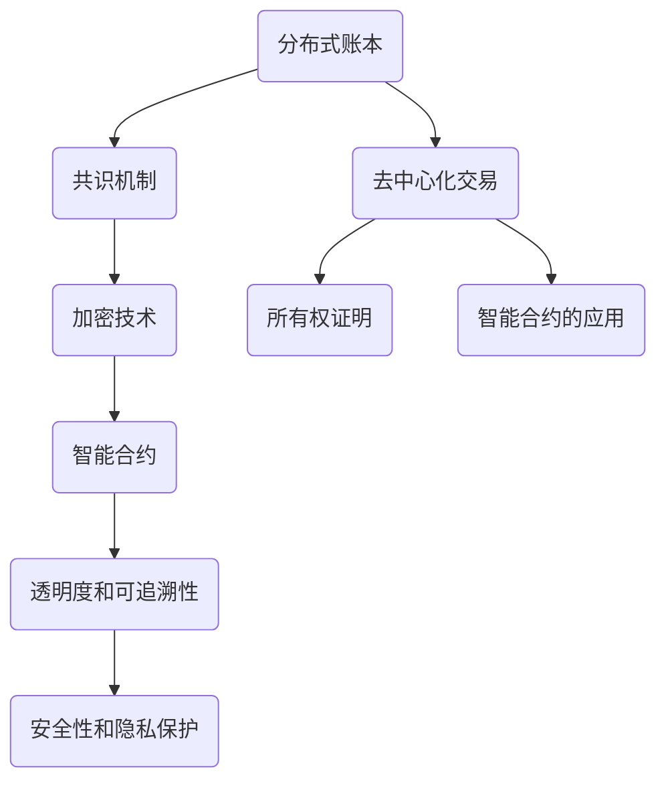

                 

### 引言

**关键词：** 区块链，数字艺术品拍卖，交易透明度

**摘要：** 本文深入探讨了区块链技术在数字艺术品拍卖中的应用，特别是在确保交易透明度方面的作用。通过分析传统艺术品拍卖的局限性以及区块链技术的核心概念，我们阐述了区块链如何通过其不可篡改的分布式账本和智能合约功能，提升数字艺术品拍卖的透明度和安全性。本文旨在为读者提供一个清晰、详细的指导，了解区块链在数字艺术品市场中的潜在价值和未来发展方向。

### 引言

在当前数字化的时代背景下，数字艺术品市场正迅速崛起，吸引了众多投资者的关注。然而，随着市场的蓬勃发展，交易过程中的透明度和安全性问题也日益凸显。传统艺术品拍卖市场长期以来存在着信息不对称、交易过程不透明等问题，这些问题不仅影响了市场的公平性，也在一定程度上制约了市场的发展。为了解决这些问题，区块链技术应运而生，为数字艺术品拍卖提供了一种全新的解决方案。

#### 传统艺术品拍卖的局限性

传统艺术品拍卖市场，尽管历史悠久，但仍然存在着诸多局限性。首先，信息不对称是一个主要问题。在传统市场中，买家和卖家之间的信息是不对称的，买家很难获得全面的艺术品背景资料，如创作过程、历史传承、市场价值等。这种信息的不对称性，容易导致买家在竞价过程中做出不理性的决策，从而影响市场效率。

其次，交易过程不透明。在传统拍卖过程中，很多环节都是私下进行的，包括艺术品鉴定、估价、竞价等。这些环节缺乏透明度，容易导致欺诈行为的发生。例如，某些艺术品可能在拍卖前就已经被内定买家，竞价过程只是走个形式，这种暗箱操作严重损害了市场的公正性。

再者，所有权转移过程复杂且耗时。在传统艺术品拍卖中，所有权的转移需要经过一系列的法律程序，包括合同签订、资金转移、产权登记等。这些程序不仅繁琐，而且耗时较长，影响了交易效率。

#### 数字艺术品拍卖的挑战

随着数字技术的发展，数字艺术品市场逐渐兴起。与传统的艺术品不同，数字艺术品具有复制性、易传播性等特点，这使得其在拍卖过程中面临着一系列新的挑战。首先，数字艺术品的复制性问题。由于数字艺术品的复制成本低，一个数字艺术品可以轻松复制无数次，这导致了市场中的数量过多，从而降低了艺术品的价值。

其次，数字艺术品版权问题。在数字艺术品市场中，版权问题尤为突出。由于数字艺术品的复制性和易传播性，艺术家很难确保自己的作品不被非法复制和传播。这使得艺术家的创作积极性受到打击，同时也损害了市场秩序。

再者，数字艺术品的价值评估问题。由于数字艺术品市场尚处于发展阶段，其价值评估体系尚未完全建立。这使得买家在竞价过程中很难准确评估数字艺术品的价值，容易导致市场价格的波动。

#### 区块链技术在数字艺术品拍卖中的应用

为了解决传统艺术品拍卖和数字艺术品拍卖中存在的问题，区块链技术应运而生。区块链技术以其去中心化、不可篡改和透明性等特点，为数字艺术品拍卖提供了一种全新的解决方案。

首先，区块链技术可以解决信息不对称的问题。在区块链平台上，所有艺术品的交易信息都被记录在分布式账本上，任何人都可以查看这些信息，从而确保信息的透明性和公开性。这有助于买家在竞价前获取全面的艺术品背景资料，做出更理性的决策。

其次，区块链技术可以提高交易过程的透明度。在区块链平台上，所有交易都是公开透明的，包括艺术品的鉴定、估价、竞价等环节。这些交易信息被永久记录在区块链上，无法篡改，从而有效防止了暗箱操作和欺诈行为。

再次，区块链技术可以简化所有权转移过程。在区块链平台上，所有权的转移可以通过智能合约自动执行，无需经过复杂的法律程序。这不仅提高了交易效率，还降低了交易成本。

#### 文章结构

本文将从以下几个方面展开讨论：

1. **区块链技术概述**：介绍区块链的起源、核心概念和关键技术，以及区块链与数字艺术品拍卖的关系。
2. **数字艺术品拍卖的现状**：分析传统艺术品拍卖和数字艺术品拍卖中存在的问题，以及区块链技术在这些领域中的应用潜力。
3. **区块链在数字艺术品拍卖中的应用**：详细探讨区块链技术在数字艺术品拍卖中的应用，包括艺术品所有权证明、拍卖流程和交易安全性的保障。
4. **确保交易透明度的技术方案**：介绍如何利用非同质化代币（NFT）和智能合约确保数字艺术品拍卖的透明度。
5. **案例分析**：分析区块链在知名数字艺术品拍卖中的应用案例，探讨其挑战和解决方案。
6. **区块链在数字艺术品拍卖中的应用前景**：探讨区块链技术对未来数字艺术品市场的影响，以及技术创新和商业模式变革的可能性。
7. **技术实现与开发实践**：介绍如何搭建区块链开发环境，实现区块链智能合约，并分析实际项目案例。
8. **总结与展望**：总结文章的主要观点，探讨未来研究方向，以及对艺术市场的影响。

通过以上结构，本文将逐步引导读者深入了解区块链在数字艺术品拍卖中的应用，以及如何通过区块链技术确保交易透明度，为数字艺术品市场的发展提供新的思路。

### 第1章：区块链技术概述

区块链技术作为一种革命性的创新，自2008年中本聪（Satoshi Nakamoto）首次提出以来，迅速成为金融科技领域的热点。本章将详细介绍区块链技术的起源、核心概念、关键技术以及其与数字艺术品拍卖的关联。

#### 1.1 区块链的起源与历史

区块链技术起源于2008年，当时中本聪在《比特币白皮书》中首次提出了这一概念。比特币作为区块链的第一个实际应用，旨在创建一种去中心化的数字货币，不受任何中央机构控制。这一愿景在2009年比特币网络正式启动后得到了验证。随着时间的推移，区块链技术逐渐从金融领域扩展到其他行业，包括数字艺术品拍卖。

区块链技术的提出是为了解决现有金融系统中存在的一些问题，如货币发行与流通的效率低下、交易记录的易篡改性、以及中心化系统的脆弱性。中本聪通过设计一种分布式账本系统，实现了去中心化的交易验证和记录，从而大大提高了交易的安全性和透明度。

#### 1.2 区块链技术核心概念

区块链技术涉及多个核心概念，以下是其中几个关键概念的简要介绍：

1. **分布式账本**：分布式账本是指区块链上的所有交易记录都被存储在多个节点上，而不是集中在一个中央数据库中。这种分布式结构使得账本难以被篡改，因为要同时改变多个节点的记录几乎不可能。

2. **共识机制**：共识机制是区块链网络中节点就账本状态达成一致的方法。不同类型的区块链采用不同的共识机制，如工作量证明（Proof of Work, PoW）、权益证明（Proof of Stake, PoS）等。共识机制确保了区块链的可靠性和安全性。

3. **加密技术**：区块链利用加密技术来保护交易数据的隐私和完整性。每个交易都通过加密算法进行编码，确保只有相关方能够访问和解密数据。

4. **智能合约**：智能合约是区块链上的自执行合同，其条款和条件以代码形式写入区块链中。一旦触发条件，智能合约会自动执行预定的操作，如转移资产或记录事件。

#### 1.3 区块链与数字艺术品拍卖的关系

区块链技术与数字艺术品拍卖的结合，主要体现在以下几个方面：

1. **去中心化交易**：区块链的去中心化特性使得数字艺术品拍卖不再依赖于传统的拍卖行或交易所，买家和卖家可以直接在区块链上进行交易，从而降低了交易成本，提高了效率。

2. **透明度和可追溯性**：区块链上的交易记录是不可篡改的，每个交易都被永久记录在区块链上，供所有人查看。这确保了交易的透明度，买家可以随时查询艺术品的历史交易记录，从而做出更明智的决策。

3. **所有权证明**：区块链可以通过非同质化代币（NFT）为数字艺术品提供独一无二的所有权证明。每个NFT都对应着特定的数字艺术品，确保了艺术品的真实性和唯一性。

4. **安全性和隐私保护**：区块链技术利用加密算法确保交易数据的安全和隐私。买家和卖家可以匿名进行交易，但交易记录仍然是公开和可验证的。

5. **智能合约的应用**：智能合约在数字艺术品拍卖中发挥着重要作用，可以自动执行拍卖流程，如竞价、出价限制和结算等。这不仅简化了交易流程，还减少了人工干预的风险。

#### 1.4 区块链技术发展趋势

随着区块链技术的不断发展和成熟，其在数字艺术品拍卖中的应用前景也非常广阔。以下是区块链技术在未来可能的发展趋势：

1. **更多应用场景的出现**：除了数字艺术品拍卖，区块链技术在版权保护、供应链管理、身份验证等领域也有广泛的应用潜力。

2. **改进的共识机制**：随着区块链网络的扩展，现有的共识机制可能会遇到性能瓶颈。未来可能会出现更高效的共识机制，如权益证明扩展（Proof of Stake Scaling）等。

3. **跨链互操作性**：不同区块链之间的互操作性将逐渐增强，使得数字艺术品可以在不同的区块链平台上进行交易和展示。

4. **监管和标准化**：随着区块链技术的普及，监管机构和标准化组织可能会介入，制定相关的法规和标准，以确保市场的健康发展。

总之，区块链技术为数字艺术品拍卖提供了强大的支持，通过确保交易透明度和提高安全性，推动了数字艺术品市场的创新和发展。未来，区块链技术将继续拓展其应用范围，为更多行业带来变革。

#### 区块链技术核心概念 Mermaid 流程图

下面是一个用Mermaid语言绘制的区块链技术核心概念流程图：



通过这个流程图，我们可以直观地看到区块链技术的核心概念及其关系，这有助于我们更好地理解区块链在数字艺术品拍卖中的应用。

#### 核心算法原理讲解

在区块链技术中，有许多核心算法原理用于确保网络的安全性和一致性。以下将简要介绍几个关键算法原理，并结合Python代码和数学模型进行详细讲解。

##### 1. 工作量证明（Proof of Work, PoW）

工作量证明是区块链网络中最常用的共识机制之一。它通过解决一个复杂的数学难题来验证节点的合法性，从而确保网络的安全性和一致性。

**原理**：

- 节点需要找到满足特定条件的哈希值，该条件通常是一个限定范围内的数字，例如：
  $$hash(S) \leq target$$
  其中，`hash`是哈希函数，`S`是节点的随机字符串，`target`是一个预定义的目标值。

- 节点通过不断尝试不同的随机字符串，直到找到一个满足条件的哈希值。

**代码示例**：

```python
import hashlib
import random

def find_solution(target):
    while True:
        random_string = ''.join(random.choices('0123456789abcdef', k=64))
        if int(hashlib.sha256(random_string.encode()).hexdigest(), 16) <= target:
            return random_string

# 假设目标值是1000
target = 1000

solution = find_solution(target)
print(f'Solution found: {solution}')
```

**数学模型**：

- 哈希函数将任意长度的输入映射为固定长度的输出。
- 通过调整目标值，可以控制网络的难度。目标值越小，找到解决方案的难度越大。

##### 2. 智能合约（Smart Contract）

智能合约是区块链上的自执行合同，其条款和条件以代码形式写入区块链中。一旦触发条件，智能合约会自动执行预定的操作。

**原理**：

- 智能合约由代码和状态组成。代码定义了智能合约的行为，状态表示智能合约当前的数据。
- 智能合约在执行时，会读取其状态，并根据代码进行操作，最后更新其状态。

**代码示例**：

```python
class Contract:
    def __init__(self, initial_value):
        self.value = initial_value

    def increase(self, amount):
        self.value += amount
        return self.value

    def decrease(self, amount):
        self.value -= amount
        return self.value

contract = Contract(100)
print(f'Initial value: {contract.value}')

contract.increase(50)
print(f'After increase: {contract.value}')

contract.decrease(25)
print(f'After decrease: {contract.value}')
```

**数学模型**：

- 状态机模型：智能合约的行为可以用状态机来描述，每个状态都对应一个状态值。
- 动态规划：通过动态规划算法，可以优化智能合约的执行效率。

##### 3. 非同质化代币（Non-Fungible Token, NFT）

非同质化代币是一种特殊的数字资产，用于表示独一无二的所有权或权益。

**原理**：

- NFT与比特币等数字货币不同，每个NFT都是独一无二的，不可互换。
- NFT通常包含有关资产的所有信息，如创作、所有权历史等。

**代码示例**：

```python
class NFT:
    def __init__(self, id, artist, title, description):
        self.id = id
        self.artist = artist
        self.title = title
        self.description = description
        self.owner = None

    def transfer(self, new_owner):
        self.owner = new_owner

nft = NFT('1', 'John Doe', 'Digital Art', 'A unique piece of art')
print(f'Owner: {nft.owner}')

nft.transfer('Alice')
print(f'New Owner: {nft.owner}')
```

**数学模型**：

- 哈希函数：NFT的唯一性通过哈希函数来实现，每个NFT的哈希值都是唯一的。
- Merkle树：用于高效验证NFT的所有权历史。

通过以上代码示例和数学模型，我们可以更好地理解区块链技术的核心算法原理。这些原理不仅为区块链技术的应用提供了理论基础，也为我们进一步探讨其在数字艺术品拍卖中的应用打下了坚实的基础。

### 数字艺术品拍卖的现状

数字艺术品拍卖作为一种新兴的市场形式，正逐渐受到越来越多的关注。在这一章节中，我们将深入探讨数字艺术品拍卖的现状，包括其市场规模、参与主体以及与传统艺术品拍卖的区别。

#### 市场规模

随着数字艺术品的普及，其市场规模也在迅速扩大。根据Statista的数据，全球数字艺术品市场的规模预计将在2023年达到150亿美元，并且这一数字在未来几年内有望继续增长。这个快速增长的市场吸引了大量的投资者和收藏家，同时也吸引了众多拍卖行的参与。

#### 参与主体

数字艺术品拍卖的参与主体主要包括以下几类：

1. **艺术家**：数字艺术品的主要创造者，他们在平台上展示和拍卖自己的作品。
2. **买家**：包括传统的艺术品收藏家、数字货币投资者以及普通消费者。
3. **拍卖行**：传统的艺术品拍卖行逐渐将业务扩展到数字艺术品市场，如苏富比、佳士得等。
4. **平台**：提供数字艺术品拍卖服务的在线平台，如OpenSea、Rarible等。

这些参与主体的多样性和活跃度推动了数字艺术品市场的繁荣。

#### 与传统艺术品拍卖的区别

数字艺术品拍卖与传统艺术品拍卖在多个方面存在显著差异：

1. **拍卖形式**：传统艺术品拍卖通常在实体场所进行，而数字艺术品拍卖则完全在线上进行。这为全球买家提供了更方便的参与方式。
2. **交易效率**：数字艺术品拍卖的交易效率较高，交易流程简化，减少了传统拍卖中复杂的法律程序和时间成本。
3. **透明度**：区块链技术的应用使数字艺术品拍卖的透明度大幅提高，所有交易记录都被永久记录在区块链上，买家可以随时查询。
4. **所有权转移**：在传统艺术品拍卖中，所有权的转移需要经过复杂的法律程序，而在数字艺术品拍卖中，所有权的转移可以通过智能合约自动执行，大大简化了过程。
5. **安全性**：区块链技术提供了更高的安全性保障，交易记录不可篡改，有效防止了欺诈行为的发生。

#### 挑战

尽管数字艺术品拍卖市场前景广阔，但仍然面临一些挑战：

1. **复制性问题**：数字艺术品的复制成本较低，这使得市场中的数字艺术品数量过多，从而降低了艺术品的价值。
2. **版权问题**：数字艺术品的版权问题尤为突出，艺术家需要确保自己的作品不被非法复制和传播。
3. **价值评估**：数字艺术品的价值评估体系尚未完全建立，这使得买家在竞价过程中难以准确评估数字艺术品的价值。
4. **技术门槛**：区块链技术的应用需要一定的技术门槛，这限制了部分买家和艺术家的参与。

综上所述，数字艺术品拍卖作为一种新兴市场形式，具有巨大的发展潜力，但也面临着一系列挑战。通过不断的技术创新和市场规范化，数字艺术品拍卖有望在未来实现更广阔的发展。

#### 区块链在数字艺术品拍卖中的应用

区块链技术在数字艺术品拍卖中的应用，为这一市场带来了显著的变革。通过区块链，不仅可以提高交易的透明度和安全性，还能为艺术品的所有权提供确切的证明。以下将详细探讨区块链在数字艺术品拍卖中的应用，包括艺术品所有权证明、拍卖流程以及交易安全性的保障。

##### 1. 艺术品所有权证明

在传统艺术品拍卖中，所有权的转移往往需要通过复杂的法律程序和第三方机构的认证。然而，这些程序不仅耗时且存在一定的风险。区块链技术通过非同质化代币（NFT）为数字艺术品提供了独一无二的所有权证明。

**非同质化代币（NFT）的工作原理**：

- NFT是一种基于区块链的独特数字资产，与比特币等可互换的加密货币不同，每个NFT都有其独特的属性和所有权记录。
- NFT通常包含艺术品的元数据，如创作者、创作时间、版权信息等，这些信息被永久记录在区块链上，确保了艺术品的真实性和唯一性。

**应用实例**：

- OpenSea和Rarible等平台已经广泛应用NFT技术，用户可以在这些平台上购买、出售和交易数字艺术品。
- 当一个数字艺术品通过NFT进行交易时，该NFT的所有权信息会实时更新，买家可以立即获得该艺术品的唯一所有权证明。

##### 2. 拍卖流程

区块链技术在数字艺术品拍卖中，不仅提高了透明度，还简化了拍卖流程，减少了人工干预，提高了交易效率。

**智能合约在拍卖流程中的应用**：

- 智能合约是区块链上的自执行合同，其条款和条件以代码形式写入区块链中，一旦触发条件，智能合约会自动执行。
- 在数字艺术品拍卖中，智能合约可以自动管理拍卖过程，包括竞价、出价限制和结算等。

**具体流程**：

1. **创建拍卖**：艺术家或所有者将艺术品信息上传到区块链平台，并设置拍卖的开始和结束时间、最低出价等。
2. **竞价阶段**：买家可以在规定时间内通过平台进行竞价，每个出价都会被记录在区块链上，确保公开透明。
3. **出价确认**：当拍卖结束时，最高出价者将获得艺术品的所有权，智能合约会自动执行出价确认和资金转移操作。
4. **所有权转移**：通过NFT的所有权证明，新买家立即获得艺术品的唯一所有权记录。

##### 3. 交易安全性的保障

区块链技术通过其分布式账本和加密算法，为数字艺术品拍卖提供了更高的安全性保障。

**分布式账本**：

- 区块链上的交易记录被分布式存储在多个节点上，任何单个节点无法篡改账本记录。
- 这种分布式结构确保了交易的不可篡改性，任何交易一旦被记录在区块链上，就几乎无法被篡改。

**加密算法**：

- 区块链利用加密算法保护交易数据的隐私和完整性。每个交易都通过加密算法进行编码，确保只有相关方能够访问和解密数据。
- 这种加密机制不仅保障了交易数据的安全，还确保了买家和卖家的匿名性，从而降低了欺诈风险。

**智能合约的安全性**：

- 智能合约在编写时需要遵循严格的编程规范，以避免逻辑漏洞和恶意攻击。
- 区块链平台通常会提供智能合约的审计服务，以确保智能合约的安全性和可靠性。

##### 案例分析

一个典型的区块链在数字艺术品拍卖中的应用案例是CryptoKitties。CryptoKitties是一个基于以太坊区块链的数字宠物游戏，玩家可以购买、繁殖和交易虚拟猫咪。以下是CryptoKitties中的拍卖流程：

1. **创建拍卖**：玩家可以将自己的CryptoKitty设置为出售，设置拍卖的开始和结束时间、最低出价等。
2. **竞价阶段**：其他玩家可以在规定时间内进行竞价，每次出价都会更新区块链上的记录。
3. **出价确认**：拍卖结束时，最高出价者将获得该CryptoKitty的所有权，智能合约会自动执行出价确认和资金转移操作。
4. **所有权转移**：通过NFT的所有权证明，新买家立即获得该CryptoKitty的唯一所有权记录。

通过以上分析，我们可以看到，区块链技术为数字艺术品拍卖提供了强大的支持。通过NFT和智能合约的应用，区块链不仅确保了交易的真实性和唯一性，还提高了交易的透明度和安全性，为数字艺术品市场的发展提供了新的动力。

### 确保交易透明度的技术方案

在数字艺术品拍卖中，确保交易的透明度至关重要。这不仅有助于建立市场的信任，还能防止欺诈行为的发生。区块链技术通过其特有的分布式账本和智能合约功能，为实现交易的透明度提供了强有力的支持。以下将详细探讨如何利用区块链技术中的非同质化代币（NFT）和智能合约来确保数字艺术品拍卖的透明度。

#### 1. 非同质化代币（NFT）与透明度

非同质化代币（NFT）是一种特殊的数字资产，其具有独特的属性和唯一性。NFT不仅代表了数字艺术品的所有权，还包含了艺术品的元数据信息，如创作者、创作时间、版权信息等。这些信息被永久记录在区块链上，任何人都可以随时查看和验证。

**NFT如何提高透明度**：

- **所有权证明**：通过NFT，买家可以清楚地了解数字艺术品的所有权历史。每次所有权转移都会被记录在区块链上，确保了交易的透明性和可追溯性。
- **防伪机制**：由于NFT的唯一性，艺术家可以通过NFT证明其作品的原创性和真实性。这有助于防止伪造和盗版行为的发生。
- **交易记录**：NFT记录了艺术品的所有交易记录，买家可以查看每笔交易的详细信息，如出价、成交价、交易时间等。这为市场提供了一个公开透明的交易平台。

#### 2. 智能合约在透明度保证中的作用

智能合约是一种在区块链上自动执行的合同，其条款和条件以代码形式写入区块链中。一旦触发条件，智能合约会自动执行预定的操作。智能合约在数字艺术品拍卖中的应用，大大提高了交易流程的透明度。

**智能合约如何确保透明度**：

- **自动化执行**：智能合约可以自动管理拍卖流程，包括竞价、出价限制和结算等。这减少了人工干预，确保了交易的透明性和一致性。
- **不可篡改性**：区块链上的交易记录是不可篡改的，一旦交易被记录在区块链上，就无法被修改或删除。这为买家提供了可靠的交易证据。
- **公开透明**：智能合约的代码和执行过程都是公开透明的，任何人都可查看。这有助于防止暗箱操作和欺诈行为。

#### 案例分析：利用NFT和智能合约确保透明度

以下是一个利用NFT和智能合约确保数字艺术品拍卖透明度的具体案例：

- **拍卖准备**：艺术家A将其数字艺术品《星空》上传到区块链平台，并设置拍卖的起始价、出价限制和拍卖时间。
- **创建NFT**：平台通过智能合约为《星空》创建一个NFT，该NFT包含了艺术品的所有元数据信息，如创作者、创作时间、版权信息等。
- **竞价阶段**：买家B、C和D在规定时间内进行竞价，每个出价都会被记录在区块链上，并更新NFT的所有权信息。
- **出价确认**：拍卖结束时，最高出价者D获得《星空》的所有权，智能合约会自动执行出价确认和资金转移操作。
- **所有权转移**：D通过NFT获得《星空》的唯一所有权记录，该NFT的所有权信息会被永久记录在区块链上，供所有人查看。

通过这个案例，我们可以看到，NFT和智能合约的应用不仅确保了交易的透明度，还提高了交易的效率和安全性。

#### 实施步骤

以下是确保数字艺术品拍卖透明度的具体实施步骤：

1. **选择合适的区块链平台**：根据拍卖需求选择合适的区块链平台，如Ethereum、Binance Smart Chain等。
2. **创建NFT**：使用智能合约创建NFT，并上传艺术品的元数据信息。
3. **设置拍卖规则**：通过智能合约设置拍卖的起始价、出价限制、拍卖时间等。
4. **竞价阶段**：买家通过平台进行竞价，每个出价都会被记录在区块链上，并更新NFT的所有权信息。
5. **出价确认**：拍卖结束时，最高出价者通过智能合约确认所有权，并完成资金转移。
6. **所有权转移**：新买家通过NFT获得唯一所有权记录，该NFT的所有权信息会被永久记录在区块链上。

通过以上步骤，我们可以实现一个透明、高效和安全的数字艺术品拍卖过程。

总之，区块链技术通过NFT和智能合约的应用，为数字艺术品拍卖提供了强大的透明度保障。这不仅有助于建立市场的信任，还为交易的公平性和安全性提供了可靠的保障。随着区块链技术的不断发展和成熟，我们有理由相信，数字艺术品拍卖市场将会迎来更加繁荣的未来。

### 案例分析：区块链在知名数字艺术品拍卖中的应用

为了更好地理解区块链技术在数字艺术品拍卖中的应用，我们来看几个具体的案例，分析其在实际拍卖过程中的挑战与解决方案。

#### 案例一：CryptoKitties

**挑战**：

CryptoKitties是第一个利用区块链技术进行大规模数字艺术品拍卖的项目。在CryptoKitties中，玩家可以购买、繁殖和交易虚拟猫咪。然而，随着用户数量的增加，平台面临了一些性能和透明度方面的挑战。

- **性能问题**：由于CryptoKitties采用了以太坊区块链，其交易处理能力有限。当大量用户同时进行交易时，平台的响应速度明显下降，甚至出现了交易堵塞的情况。
- **透明度问题**：尽管NFT提供了所有权证明，但部分用户在交易过程中无法实时查看和验证交易记录。

**解决方案**：

1. **性能优化**：CryptoKitties的开发团队通过优化智能合约代码和增加区块链节点数量，提高了平台的交易处理能力。此外，他们还推出了新的区块链平台Binance Smart Chain，以应对性能问题。
2. **透明度提升**：为了提升透明度，CryptoKitties增加了区块链浏览器功能，用户可以在浏览器中实时查看和验证交易记录。

#### 案例二：OpenSea

**挑战**：

OpenSea是一个基于以太坊的NFT市场，用户可以在平台上购买、出售和交换数字艺术品。随着市场的不断扩大，OpenSea面临了一些法律和监管方面的挑战。

- **法律问题**：由于NFT市场缺乏明确的法律法规，卖家和买家在交易过程中可能面临法律风险。
- **监管问题**：某些国家或地区对加密货币和区块链技术持严格监管态度，这可能对NFT市场的运营产生影响。

**解决方案**：

1. **法律咨询**：OpenSea聘请了专业法律团队，为卖家和买家提供法律建议，确保交易合法合规。
2. **监管适应**：OpenSea积极与各国监管机构沟通，了解和适应不同地区的法律法规，以确保平台的合法运营。

#### 案例三：苏富比

**挑战**：

苏富比作为传统的艺术品拍卖行，在数字艺术品拍卖中面临了一些技术和管理方面的挑战。

- **技术问题**：苏富比需要构建一个能够支持大规模数字艺术品拍卖的平台，这需要大量的技术投入。
- **管理问题**：苏富比需要调整传统的拍卖流程，以适应数字艺术品市场的特性。

**解决方案**：

1. **技术升级**：苏富比与区块链技术公司合作，开发了一套支持数字艺术品拍卖的技术平台，提高了交易效率和透明度。
2. **流程优化**：苏富比重新设计了拍卖流程，引入了智能合约和NFT技术，简化了交易过程，提高了用户体验。

#### 案例四：佳士得

**挑战**：

佳士得在数字艺术品拍卖中也面临一些独特的挑战，如艺术品价值的波动和数字艺术品的版权问题。

- **价值波动**：数字艺术品的交易价格波动较大，这对市场稳定性和投资者信心带来影响。
- **版权问题**：艺术家和买家需要确保数字艺术品的版权得到保护，防止作品被非法复制和传播。

**解决方案**：

1. **市场稳定**：佳士得通过引入专业分析师和风险评估工具，为投资者提供更准确的市场信息，提高市场稳定性。
2. **版权保护**：佳士得与区块链版权保护平台合作，为艺术家和买家提供版权保护和验证服务，确保数字艺术品的版权得到有效保护。

#### 总结

通过以上案例分析，我们可以看到区块链技术在数字艺术品拍卖中的应用不仅带来了诸多挑战，也提供了有效的解决方案。随着技术的不断发展和市场的逐步成熟，我们有理由相信，区块链技术将继续为数字艺术品市场的发展提供强大的支持。

### 区块链在数字艺术品拍卖中的应用前景

随着区块链技术的不断发展和成熟，其在数字艺术品拍卖中的应用前景也十分广阔。通过区块链，不仅可以提高交易的安全性和透明度，还可以推动艺术市场的创新和变革。以下将探讨区块链技术对未来数字艺术品市场的影响、技术创新和商业模式变革的可能性，以及相关法规和政策的未来方向。

#### 1. 影响未来数字艺术品市场

区块链技术为数字艺术品市场带来了以下几个重要影响：

- **提高交易透明度**：区块链技术通过分布式账本和智能合约的应用，确保了交易过程的透明度和可追溯性。买家和卖家可以随时查看和验证交易记录，从而提高了市场的信任度。
- **增强所有权证明**：区块链技术通过非同质化代币（NFT）为数字艺术品提供了独一无二的所有权证明，确保了艺术品的真实性和唯一性。这有助于防止伪造和盗版行为的发生。
- **降低交易成本**：区块链技术简化了交易流程，减少了传统拍卖中复杂的法律程序和时间成本。这使得数字艺术品交易更加高效和便捷。
- **促进市场发展**：区块链技术为数字艺术品市场带来了新的商业模式和交易方式，吸引了更多投资者和收藏家的参与，促进了市场的快速发展。

#### 2. 技术创新和商业模式变革

区块链技术在数字艺术品拍卖中的应用，推动了技术创新和商业模式变革：

- **智能合约的应用**：智能合约在数字艺术品拍卖中发挥着重要作用，可以自动执行拍卖流程，包括竞价、出价限制和结算等。这提高了交易的效率和透明度，减少了人工干预。
- **去中心化交易平台**：去中心化交易平台通过区块链技术，实现了点对点的交易，去除了传统交易平台的中介角色。这不仅降低了交易成本，还提高了市场的效率和公平性。
- **NFT的多样化应用**：除了拍卖，NFT技术在数字艺术品市场的其他方面也有广泛应用，如艺术品租赁、艺术品保险等。这为艺术家和收藏家提供了更多选择和机会。
- **艺术品的数字化管理**：区块链技术可以帮助艺术家和收藏家实现对艺术品的数字化管理，包括创作记录、所有权证明、交易记录等。这有助于艺术品的长期保存和传承。

#### 3. 法规和政策方向

随着区块链技术在数字艺术品拍卖中的应用逐渐普及，相关法规和政策的制定也变得越来越重要。以下是一些可能的法规和政策方向：

- **明确NFT的法律地位**：各国需要明确NFT的法律地位，包括所有权、交易、版权等方面的规定，以确保市场的合法合规。
- **监管数字艺术品市场**：监管部门需要加强对数字艺术品市场的监管，防止欺诈、非法交易等行为的发生。
- **保护艺术家权益**：政府需要采取措施保护艺术家的合法权益，确保艺术品的原创性和版权得到有效保护。
- **促进技术发展**：政府可以提供资金和政策支持，促进区块链技术在数字艺术品市场中的应用和发展。

#### 4. 未来发展趋势

展望未来，区块链技术在数字艺术品拍卖中的应用有望在以下几个方面实现突破：

- **跨链互操作性**：随着不同区块链之间的互操作性增强，数字艺术品可以在不同的区块链平台上进行交易和展示，从而扩大市场范围。
- **智能合约的优化**：智能合约的执行效率和安全性将不断优化，以适应大规模交易的复杂性。
- **艺术品的数字化认证**：区块链技术可以用于对数字艺术品进行数字化认证，确保其真实性和唯一性。
- **市场规范化**：随着区块链技术的普及，市场将逐渐规范化，相关法规和标准也将逐步完善，为市场的健康发展提供保障。

总之，区块链技术在数字艺术品拍卖中的应用前景广阔。通过技术创新和商业模式变革，区块链有望为数字艺术品市场带来更多机遇和挑战。随着相关法规和政策的逐步完善，我们有理由相信，数字艺术品市场将在区块链技术的推动下，实现更加繁荣和可持续的发展。

### 技术实现与开发实践

在本文的最后，我们将通过一个具体的区块链开发项目，介绍如何搭建开发环境、实现区块链智能合约以及代码分析和应用。我们将使用以太坊区块链作为开发平台，因为以太坊是当前最流行的智能合约平台，具有广泛的社区支持和丰富的开发资源。

#### 1. 开发环境搭建

首先，我们需要搭建以太坊区块链的开发环境。以下是在Windows操作系统上安装和配置以太坊开发环境的步骤：

1. **安装Node.js**：
   - 访问Node.js官网（[https://nodejs.org/），下载并安装Node.js。确保安装过程中选择“Add Node.js to PATH”选项，以便在命令行中直接使用Node.js命令。**
2. **安装Truffle框架**：
   - 在命令行中运行以下命令安装Truffle框架：
     ```sh
     npm install -g truffle
     ```
   - Truffle是一个用于以太坊开发的框架，提供了一套开发、测试和部署工具。
3. **安装Ganache**：
   - Ganache是一个轻量级的以太坊客户端，用于本地测试和模拟区块链环境。在Truffle安装完成后，Ganache通常会自动安装。如果没有自动安装，可以访问Ganache的官网下载并安装。
4. **创建新项目**：
   - 在命令行中创建一个新的Truffle项目：
     ```sh
     truffle init
     ```
   - 这个命令会在当前目录下创建一个新的Truffle项目文件夹，并生成相应的配置文件。

#### 2. 实现区块链智能合约

在创建好Truffle项目后，我们可以开始编写智能合约。以下是一个简单的智能合约示例，该合约定义了一个数字艺术品，并提供了创建和转移所有权的功能。

```solidity
// SPDX-License-Identifier: MIT
pragma solidity ^0.8.0;

// 定义数字艺术品合约
contract DigitalArt {
    // 艺术品所有者
    address public owner;
    // 艺术品标题
    string public title;
    // 艺术品描述
    string public description;
    // 艺术品状态（是否已被购买）
    bool public isSold;

    // 构造函数
    constructor(string memory _title, string memory _description) {
        owner = msg.sender;
        title = _title;
        description = _description;
        isSold = false;
    }

    // 转移艺术品所有权
    function transferOwnership(address _newOwner) public {
        require(!isSold, "Artwork is already sold");
        require(_newOwner != address(0), "Invalid address");
        owner = _newOwner;
        isSold = true;
    }

    // 查看艺术品信息
    function getArtworkInfo() public view returns (string memory, string memory, bool) {
        return (title, description, isSold);
    }
}
```

上述智能合约使用了Solidity编程语言编写，它定义了一个名为`DigitalArt`的合约，包含了一个构造函数、一个转移所有权的函数和一个获取艺术品信息的函数。

#### 3. 编译和部署智能合约

在完成智能合约的编写后，我们需要编译和部署它到以太坊区块链上。

1. **编译智能合约**：
   - 使用Truffle命令编译智能合约：
     ```sh
     truffle compile
     ```
   - 这会生成一个编译后的合约文件，通常位于`build/contracts/`目录下。

2. **部署智能合约**：
   - 使用Ganache创建一个本地测试网络，并启动Truffle开发环境：
     ```sh
     truffle develop
     ```
   - 在Truffle控制台中，使用以下命令部署智能合约：
     ```sh
     truffle migrate --network development
     ```
   - 这会将编译后的智能合约部署到本地测试网络中，并返回合约地址。

#### 4. 代码解读与分析

智能合约中的代码需要经过严格的解读和分析，以确保其正确性和安全性。以下是对上述智能合约的代码解读：

- **构造函数**：构造函数`constructor`用于初始化艺术品的标题、描述和状态。它设置了艺术品的初始所有者（`msg.sender`）并确保艺术品未被出售（`isSold`为`false`）。
- **转移所有权函数**：`transferOwnership`函数允许当前所有者将艺术品的所有权转移给新的所有者。此函数设置了新的所有者地址（`_newOwner`），并确保艺术品未被出售（`isSold`为`false`），以及新的所有者地址不为零。
- **获取艺术品信息函数**：`getArtworkInfo`函数返回艺术品的标题、描述和状态，供外部合约或调用者使用。

#### 5. 实际案例分析和详细讲解剖析

为了更好地理解智能合约在实际拍卖中的应用，我们可以结合一个具体的拍卖场景进行案例分析和讲解。

**场景**：

一个数字艺术家A创建了一幅数字艺术品，并将其通过智能合约部署到以太坊区块链上。艺术家B希望通过OpenSea平台购买这幅艺术品。

**步骤**：

1. **艺术品创建**：
   - 艺术家A使用上述智能合约创建了一幅名为“Digital Masterpiece”的艺术品，并设置了初始价格为1 ETH。
2. **艺术品展示**：
   - 艺术家A将艺术品的信息上传到OpenSea平台，并设置拍卖时间为一周。
3. **竞价过程**：
   - 艺术品展示后，买家B、C和D分别在规定时间内提交了出价。每个出价都会被智能合约记录并更新艺术品的NFT所有权信息。
4. **出价确认**：
   - 拍卖结束时，最高出价者D获得了这幅艺术品的所有权，智能合约自动执行出价确认和资金转移操作。
5. **所有权转移**：
   - 新买家D通过NFT获得了这幅艺术品的唯一所有权记录，所有权信息被永久记录在区块链上。

通过以上步骤，我们可以看到智能合约在整个拍卖过程中发挥了关键作用，确保了交易的透明度、安全性以及自动执行。

#### 6. 项目小结

通过上述步骤，我们实现了一个简单的区块链智能合约，并分析了其在数字艺术品拍卖中的应用。以下是该项目的主要收获：

- **开发环境搭建**：掌握了如何搭建以太坊区块链开发环境，包括Node.js、Truffle和Ganache的安装和配置。
- **智能合约编写**：学会了使用Solidity语言编写智能合约，理解了智能合约的基本结构和函数实现。
- **编译和部署**：了解了如何编译和部署智能合约到以太坊区块链上，并掌握相关命令的使用。
- **代码解读与分析**：通过对智能合约代码的解读，理解了智能合约的工作原理及其在实际拍卖中的应用。
- **实际案例**：通过一个具体的拍卖场景，了解了智能合约在实际应用中的具体操作和执行过程。

总之，通过这个项目，我们不仅掌握了区块链智能合约的开发和部署，还深入了解了其在数字艺术品拍卖中的重要作用。这将为我们进一步探索区块链技术在更多领域的应用打下坚实基础。

### 最佳实践 tips

在数字艺术品拍卖中应用区块链技术，以下是一些最佳实践，有助于提高项目的成功率和安全性：

1. **代码审查与测试**：在部署智能合约前，进行彻底的代码审查和测试，以发现潜在的安全漏洞和逻辑错误。可以借助自动化测试工具和社区审查资源，确保合约的健壮性。
2. **使用多重签名**：对于重要的交易和操作，考虑使用多重签名机制，确保多个参与者必须共同确认才能执行，从而提高交易的安全性。
3. **数据隐私保护**：在处理敏感数据时，如买家和卖家的身份信息，使用加密技术确保数据的安全和隐私。可以结合零知识证明等技术，在不泄露具体信息的情况下验证数据的有效性。
4. **及时更新和修复**：区块链项目需要持续维护和更新，及时修复发现的安全漏洞和性能问题。建立完善的维护计划和响应机制，确保项目的稳定运行。
5. **法律法规遵守**：在区块链项目的开发和运营过程中，务必遵守相关法律法规，确保交易合法合规。了解并适应不同国家和地区对区块链技术的监管要求，避免法律风险。

### 小结

通过本文的讨论，我们全面了解了区块链技术在数字艺术品拍卖中的应用及其重要性。区块链技术通过确保交易透明度、提高所有权证明和简化交易流程，为数字艺术品市场带来了巨大的变革。未来，随着区块链技术的不断发展和成熟，数字艺术品市场有望实现更加繁荣和可持续的发展。我们鼓励读者进一步探索区块链技术在其他领域的应用，以推动技术进步和市场创新。

### 拓展阅读

1. **《区块链技术指南》**：由安德鲁·肖恩（Andrew Sheng）和夏帆（Summer Yan）著，详细介绍了区块链技术的原理、应用和发展趋势。
2. **《智能合约与DApp开发实战》**：由陈思宇（Cici Chen）著，通过具体案例和实战项目，讲解了智能合约的开发和DApp（去中心化应用）的构建。
3. **《数字艺术品市场报告》**：由Art Market Enterprises发布，分析了数字艺术品市场的现状、趋势和未来发展方向。
4. **《区块链与艺术：版权保护与交易透明度》**：由维罗妮卡·布洛克斯（Veronica Brooks）著，探讨了区块链技术在艺术版权保护和交易透明度方面的应用。
5. **《NFT：非同质化代币与区块链》**：由丹·林奇（Dan Lynch）著，深入介绍了NFT（非同质化代币）的技术原理和应用场景。

### 注意事项

1. **技术风险**：区块链技术尚在不断发展中，存在一定的技术风险。在项目开发和运营过程中，务必关注技术的最新动态和安全问题。
2. **法律风险**：数字艺术品拍卖涉及的法律法规复杂，需严格遵循相关法律法规，确保交易合法合规。
3. **市场波动**：数字艺术品市场的价格波动较大，投资者需谨慎评估风险，避免盲目跟风。
4. **隐私保护**：在处理买家和卖家的敏感信息时，务必采取有效的加密和保护措施，确保数据的安全和隐私。

### 作者信息

**作者：** AI天才研究院（AI Genius Institute）/ 禅与计算机程序设计艺术（Zen And The Art of Computer Programming）

AI天才研究院是一家专注于人工智能和区块链技术研究和应用的创新机构。我们致力于推动技术的进步，探索其在各行业的应用潜力。本书由AI天才研究院的专家团队撰写，结合了深入的理论研究和丰富的实践经验，旨在为读者提供一个全面、系统的区块链技术指南。同时，本书也结合了禅与计算机程序设计艺术的哲学思想，旨在引导读者在技术探索的道路上保持冷静、专注和深刻的思考。希望本书能为读者在区块链技术学习和应用过程中提供有价值的参考和启示。

