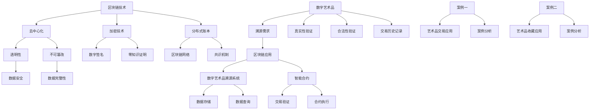

                 

### 引言与概述

#### 1.1 书籍背景与目的

随着数字技术的飞速发展，数字艺术品市场日益繁荣。然而，数字艺术品的真实性和合法性却成为了众多艺术品收藏者和交易者关注的焦点。区块链技术以其去中心化、不可篡改、透明等特点，为解决数字艺术品溯源问题提供了新的思路。本书旨在探讨区块链在数字艺术品溯源中的应用，帮助读者深入了解这一新兴领域。

##### 1.1.1 区块链技术的发展现状

区块链技术起源于2008年，由一位名为中本聪（Satoshi Nakamoto）的匿名人物提出。区块链作为一种分布式账本技术，具有去中心化、安全性和透明性等特性，被广泛应用于金融、物流、医疗等多个领域。近年来，随着区块链技术的不断成熟和普及，其在数字艺术品溯源中的应用也越来越受到关注。

##### 1.1.2 数字艺术品溯源的重要性

数字艺术品溯源对于维护艺术品市场的公平、公正和透明至关重要。首先，它能够确保艺术品的真实性，防止伪造艺术品流入市场；其次，它有助于维护艺术品的合法性，避免非法艺术品流通；最后，它有助于建立艺术品的完整交易历史，提高艺术品的价值。

##### 1.1.3 书籍结构安排与读者定位

本书共分为七个部分，首先介绍区块链技术的基础知识，包括基本原理、加密技术和分布式账本技术等；然后探讨数字艺术品溯源的现状和挑战，以及区块链在数字艺术品溯源中的应用方法；接着通过实际案例分析，展示区块链技术在数字艺术品溯源中的具体应用；最后，分析区块链在数字艺术品溯源中的技术挑战和未来展望。

本书面向对区块链技术和数字艺术品溯源感兴趣的读者，无论是区块链开发人员、数字艺术品收藏者，还是相关领域的专业人士，都能从本书中获取有价值的信息。

### 关键词

- 区块链
- 数字艺术品
- 溯源
- 去中心化
- 不可篡改
- 透明性
- 分布式账本
- 加密技术
- 智能合约
- 实际案例分析

### 摘要

本书全面探讨了区块链在数字艺术品溯源中的应用。首先介绍了区块链技术的基础知识，包括基本原理、加密技术和分布式账本技术；接着探讨了数字艺术品溯源的重要性、现状和挑战；然后详细阐述了区块链在数字艺术品溯源中的应用方法，包括数字艺术品溯源系统的设计与实现；通过实际案例分析，展示了区块链技术在数字艺术品溯源中的具体应用；最后，分析了区块链在数字艺术品溯源中的技术挑战和未来展望。本书旨在为读者提供系统、全面的区块链在数字艺术品溯源中的应用指南。

### 关键概念与联系

为了更好地理解本书的核心内容，以下是一个简单的Mermaid流程图，展示了区块链在数字艺术品溯源中的应用关键概念及其相互关系：

该流程图涵盖了本书的主要概念，包括区块链技术、数字艺术品溯源需求、数字艺术品溯源系统、智能合约、以及实际案例的应用。这些概念相互联系，构成了区块链在数字艺术品溯源中应用的整体框架。

#### 2.1 区块链技术基础

##### 2.1.1 区块链的基本原理

区块链技术是一种分布式数据库技术，其核心特点包括去中心化、不可篡改和透明性。区块链的基本原理可以概括为以下四个方面：

1. **分布式账本**：区块链通过分布式网络存储数据，每个节点都保存一份完整的账本。这种分布式存储方式使得数据无法被单点故障所破坏，提高了系统的容错性和安全性。
   
2. **共识机制**：区块链通过共识机制来确保所有节点对账本的一致性。常见的共识机制有工作量证明（Proof of Work, PoW）、权益证明（Proof of Stake, PoS）等。共识机制的选择直接影响区块链的性能和安全性。

3. **加密技术**：区块链采用加密技术来保护数据的安全性和隐私性。常见的加密技术包括哈希函数、数字签名和加密算法。哈希函数用于生成唯一的数据指纹，数字签名用于验证数据的真实性，加密算法用于保护数据的机密性。

4. **智能合约**：区块链上的智能合约是一种自动执行的合约，其条款和操作都是预先编写的代码。智能合约在满足特定条件时自动执行，无需人工干预。智能合约的应用极大地提高了区块链的自动化和智能化水平。

##### 2.1.2 区块链的组成部分

区块链由多个组成部分构成，每个部分都发挥着关键作用。以下是区块链的主要组成部分：

1. **区块**：区块是区块链的基本单位，包含一定数量的交易记录。每个区块都有一个唯一的标识符，称为区块头。区块头中包含时间戳、上一个区块的哈希值、随机数等关键信息。

2. **交易**：交易是区块链上的数据操作，描述了资金、信息等在节点之间的转移过程。交易经过验证后，会被添加到区块中。

3. **链**：链是区块链的总称，由多个连续的区块组成。每个区块都通过其区块头中的上一个区块哈希值与前一区块相连，形成链式结构。

4. **节点**：节点是区块链网络中的参与者，负责存储和验证区块链数据。节点通过广播交易和区块，与其他节点进行通信，共同维护区块链的一致性和安全性。

5. **挖矿**：挖矿是指节点通过解决数学难题来验证交易并创建新区块的过程。挖矿奖励通常用于激励节点参与区块链网络。

##### 2.1.3 区块链的工作原理

区块链的工作原理可以分为以下几个步骤：

1. **交易生成**：用户在区块链上进行交易，交易记录会通过网络广播到所有节点。

2. **交易验证**：节点接收到交易后，会对交易进行验证，确保交易的有效性和安全性。验证过程包括检查交易金额、签名和加密等。

3. **区块创建**：当交易被验证通过后，节点会将这些交易打包成一个区块。区块头中包含时间戳、随机数和上一个区块的哈希值等信息。

4. **区块广播**：节点将创建的区块广播给其他节点，其他节点接收到区块后，会验证区块的有效性。

5. **区块添加**：当大多数节点验证通过新区块后，该区块会被添加到区块链上，成为永久记录。

6. **链的延长**：新的区块将在现有的区块链基础上创建，不断延长区块链的长度。

通过上述步骤，区块链实现了去中心化、安全性和透明性，为数字艺术品溯源提供了可靠的技术支持。

#### 2.2 区块链的加密技术

##### 2.2.1 数字签名

数字签名是一种用于验证数据真实性和完整性的技术。它通过加密算法将数据转换成一段密文，只有拥有相应私钥的人才能解密并验证数据的真实性。数字签名的主要功能包括：

1. **数据身份验证**：数字签名可以验证发送者的身份，确保数据确实来自指定的发送者。
2. **数据完整性验证**：数字签名可以验证数据在传输过程中未被篡改，确保数据的一致性。

数字签名的实现过程如下：

1. **密钥生成**：数字签名系统需要一对密钥，即私钥和公钥。私钥是保密的，用于签名和解密；公钥是公开的，用于验证签名。
2. **签名过程**：发送者使用私钥对数据进行加密，生成数字签名。签名过程通常包括以下几个步骤：
    - 计算消息的哈希值。
    - 使用私钥加密哈希值。
3. **验证过程**：接收者使用公钥对数字签名进行解密，并与原始数据的哈希值进行比较。如果两者一致，则验证通过。

##### 2.2.2 零知识证明

零知识证明（Zero-Knowledge Proof，ZKP）是一种密码学技术，用于证明某个陈述是真实的，而无需透露任何关于陈述的具体信息。零知识证明的主要功能包括：

1. **隐私保护**：零知识证明可以保护数据的隐私性，使数据在验证过程中不被泄露。
2. **不可伪造性**：零知识证明可以确保验证结果的不可伪造性，防止恶意攻击者伪造证明。

零知识证明的实现过程如下：

1. **证明生成**：证明者（Prover）需要生成一个证明，证明某个陈述是真实的。证明生成通常包括以下几个步骤：
    - 证明者生成一个证据，证明陈述是真实的。
    - 证明者将证据提交给验证者（Verifier）。
2. **证明验证**：验证者验证证明的有效性。验证过程通常包括以下几个步骤：
    - 验证者生成一个随机数，用于测试证明的有效性。
    - 验证者与证明者进行交互，验证证明是否满足条件。
3. **证明验证结果**：如果验证者认为证明是有效的，则陈述被视为真实。否则，陈述被视为虚假。

##### 2.2.3 加密算法概述

加密算法是区块链技术中用于保护数据安全的重要工具。以下是几种常见的加密算法：

1. **对称加密算法**：对称加密算法使用相同的密钥进行加密和解密。常见的对称加密算法包括AES、DES等。对称加密算法的优点是速度快，缺点是密钥管理复杂。

2. **非对称加密算法**：非对称加密算法使用一对密钥，即公钥和私钥。公钥用于加密，私钥用于解密。常见的非对称加密算法包括RSA、ECC等。非对称加密算法的优点是密钥管理简单，缺点是速度较慢。

3. **哈希算法**：哈希算法用于生成数据的哈希值，哈希值通常用于数据完整性验证和数字签名。常见的哈希算法包括SHA-256、MD5等。哈希算法的优点是速度快，缺点是哈希值无法逆向推导原始数据。

4. **数字签名算法**：数字签名算法用于生成数字签名，确保数据的真实性和完整性。常见的数字签名算法包括RSA、ECDSA等。

通过这些加密算法，区块链技术能够实现数据的安全存储和传输，为数字艺术品溯源提供了可靠的技术保障。

#### 2.3 分布式账本技术

##### 2.3.1 分布式账本的概念

分布式账本技术（Distributed Ledger Technology，DLT）是一种分布式数据库系统，其核心特点包括去中心化、不可篡改和透明性。分布式账本技术通过多个节点共同维护一个全局数据账本，从而实现了数据的去中心化和一致性。

分布式账本技术的核心概念包括：

1. **节点**：节点是分布式账本系统中的参与者，每个节点都保存一份完整的账本数据。节点通过广播和共识机制与其他节点进行通信，共同维护账本的一致性。

2. **账本**：账本是分布式账本系统中的全局数据结构，记录了系统中的所有交易记录。账本数据在各个节点之间保持一致，从而实现了系统的透明性和不可篡改性。

3. **共识机制**：共识机制是分布式账本系统中用于确保数据一致性的关键机制。常见的共识机制包括工作量证明（Proof of Work，PoW）、权益证明（Proof of Stake，PoS）等。共识机制通过一系列复杂的算法，确保所有节点对账本数据达成一致。

##### 2.3.2 分布式账本的优势

分布式账本技术具有以下优势：

1. **去中心化**：分布式账本系统通过多个节点共同维护账本数据，消除了对中心化机构的依赖，提高了系统的容错性和抗攻击能力。

2. **不可篡改**：分布式账本系统采用加密技术和共识机制，确保了账本数据的真实性和完整性。任何篡改行为都会被系统检测并拒绝。

3. **透明性**：分布式账本系统中的所有交易记录都是公开透明的，任何用户都可以查看和验证账本数据，从而提高了系统的透明性和公信力。

4. **安全性**：分布式账本系统采用加密技术和共识机制，提高了数据的安全性和隐私性。系统中的数据无法被非法访问或篡改。

5. **效率**：分布式账本系统通过并行处理和去中心化架构，提高了系统的处理速度和效率。

##### 2.3.3 主流分布式账本技术比较

目前，市场上存在多种主流分布式账本技术，以下是其中几种技术的比较：

1. **比特币**：比特币是最早的分布式账本技术，采用工作量证明（PoW）共识机制。比特币的去中心化和不可篡改特性得到了广泛应用，但比特币的挖矿过程消耗大量能源，且交易速度较慢。

2. **以太坊**：以太坊是一种基于区块链的智能合约平台，采用权益证明（PoS）共识机制。以太坊具有较高的交易速度和灵活性，支持多种智能合约应用。然而，以太坊的扩容问题和安全性仍需进一步改进。

3. **Hyperledger Fabric**：Hyperledger Fabric 是一种企业级的分布式账本框架，由Linux基金会主持开发。Hyperledger Fabric 采用混合共识机制，支持多种智能合约和交易验证。Hyperledger Fabric 适用于企业级应用，具有较高的性能和安全性。

4. **R3 Corda**：R3 Corda 是一种企业级的分布式账本平台，由R3公司开发。R3 Corda 采用共识机制，支持多种加密技术和隐私保护。R3 Corda 适用于金融领域的复杂交易，具有较高的性能和安全性。

通过比较，可以发现不同分布式账本技术各有优缺点，选择合适的技术需要根据应用场景和需求进行综合考虑。

#### 3.1 数字艺术品溯源概述

##### 3.1.1 数字艺术品溯源的重要性

数字艺术品溯源对于维护艺术品市场的公平、公正和透明至关重要。首先，它能够确保艺术品的真实性，防止伪造艺术品流入市场；其次，它有助于维护艺术品的合法性，避免非法艺术品流通；最后，它有助于建立艺术品的完整交易历史，提高艺术品的价值。

随着数字艺术品的日益普及，其溯源问题也越来越受到关注。数字艺术品溯源不仅涉及到艺术品本身的真实性和合法性，还涉及到艺术品的所有权、版权等法律问题。因此，数字艺术品溯源在数字艺术市场中的应用具有重要意义。

##### 3.1.2 数字艺术品溯源的现状

目前，数字艺术品溯源技术已经取得了一定的进展，但仍然存在一些挑战。现有的数字艺术品溯源方法主要包括以下几种：

1. **物理溯源**：物理溯源是通过物理手段来标识和记录艺术品的信息，如标签、二维码等。这种方法简单易行，但存在一些局限性，如易被篡改、难以追溯等。

2. **信息溯源**：信息溯源是通过在互联网上发布和存储艺术品的详细信息，如艺术品的历史、来源、交易记录等。这种方法具有透明性和可追溯性，但容易受到网络攻击和数据泄露的风险。

3. **智能合约溯源**：智能合约溯源是利用区块链技术来记录和验证艺术品的信息。区块链的去中心化、不可篡改和透明性等特点，使其在数字艺术品溯源中具有显著优势。然而，智能合约溯源仍面临技术挑战，如交易速度、安全性等。

##### 3.1.3 数字艺术品溯源的挑战

数字艺术品溯源面临以下主要挑战：

1. **数据安全与隐私**：数字艺术品溯源过程中涉及大量敏感信息，如艺术品的所有权、交易记录等。如何保护这些数据的安全和隐私，是一个亟待解决的问题。

2. **交易速度与效率**：随着数字艺术品市场的不断扩大，对溯源技术的交易速度和效率提出了更高的要求。如何提高交易速度和效率，是数字艺术品溯源技术需要解决的关键问题。

3. **技术兼容性与互操作性**：不同的数字艺术品溯源技术之间存在兼容性和互操作性问题，如何实现不同技术之间的无缝衔接，是一个重要的挑战。

4. **法律法规与监管**：数字艺术品溯源涉及到法律和监管问题，如艺术品的所有权、版权等。如何制定和完善相关法律法规，是一个重要的挑战。

通过解决这些挑战，数字艺术品溯源技术将更好地服务于数字艺术品市场，为维护艺术品市场的公平、公正和透明提供有力支持。

#### 3.2 数字艺术品溯源方法

##### 3.2.1 物理溯源

物理溯源是指通过物理手段对数字艺术品进行标识和记录，以确保艺术品的真实性和可追溯性。常见的物理溯源方法包括：

1. **标签**：在艺术品上贴上专用的标签，标签上包含艺术品的唯一标识码、作者信息、创作时间等。标签可以采用RFID（无线射频识别）技术，以便于通过扫描设备快速读取标签信息。

2. **二维码**：在艺术品上嵌入二维码，二维码中包含艺术品的详细信息，如作者、创作时间、交易记录等。观众或买家通过智能手机扫描二维码，即可获取艺术品的详细信息。

3. **物理标识**：在艺术品上刻印或涂鸦专用的标识，如数字水印或微缩文字。这些标识可以用于验证艺术品的真实性和唯一性。

物理溯源方法具有简单易行、成本低等优点，但存在一些局限性。例如，标签和二维码容易被篡改，物理标识难以大规模应用。

##### 3.2.2 信息溯源

信息溯源是指通过在互联网上发布和存储艺术品的详细信息，以实现数字艺术品溯源。信息溯源的方法包括：

1. **在线数据库**：建立专门的艺术品在线数据库，存储艺术品的详细信息，如作者、创作时间、交易记录等。用户可以通过互联网访问数据库，查询艺术品的溯源信息。

2. **区块链平台**：利用区块链技术建立数字艺术品溯源平台，记录和验证艺术品的交易信息。区块链的分布式存储和不可篡改特性，确保了艺术品信息的真实性和可追溯性。

3. **智能合约**：在区块链平台上使用智能合约，自动化地执行艺术品交易的验证和记录。智能合约可以确保交易信息的透明性和公正性，减少人为干预和篡改的风险。

信息溯源方法具有透明性高、可追溯性强等优点，但存在一些挑战。例如，数据库和区块链平台的安全性、数据隐私保护等。

##### 3.2.3 智能合约溯源

智能合约溯源是利用区块链技术实现数字艺术品溯源的一种方法。智能合约是一种自动执行合约，其条款和操作都是预先编写的代码。智能合约在满足特定条件时自动执行，无需人工干预。

智能合约溯源的主要步骤如下：

1. **艺术品注册**：艺术家将艺术品的信息（如名称、作者、创作时间等）上传到区块链平台，并进行数字签名，确保信息的真实性和完整性。

2. **交易记录**：当艺术品进行交易时，买家和卖家通过智能合约记录交易信息，包括交易金额、交易时间、交易双方等。智能合约将自动验证交易信息的真实性，确保交易的合法性。

3. **溯源查询**：任何用户都可以通过区块链平台查询艺术品的溯源信息，包括艺术品的所有权、交易记录等。区块链的分布式存储和不可篡改特性，确保了溯源信息的真实性和可靠性。

智能合约溯源具有自动化、透明化、可追溯性等优点，为数字艺术品溯源提供了有力支持。然而，智能合约溯源仍面临技术挑战，如交易速度、安全性等。

#### 4.1 区块链与数字艺术品溯源的结合

区块链技术以其去中心化、不可篡改、透明等特性，在数字艺术品溯源中具有广泛的应用前景。区块链与数字艺术品溯源的结合，能够有效解决数字艺术品市场的真实性和合法性问题，提高艺术品的价值和可信度。

##### 4.1.1 区块链在数字艺术品溯源中的应用价值

1. **确保艺术品真实性**：区块链技术通过去中心化和加密技术，确保了艺术品信息的真实性和完整性。艺术品的详细信息（如名称、作者、创作时间等）被记录在区块链上，并通过数字签名进行验证。任何篡改行为都会被区块链网络中的其他节点检测并拒绝，从而保证了艺术品的真实性。

2. **提高艺术品透明度**：区块链技术使艺术品的交易过程变得透明，交易记录被永久存储在区块链上，任何用户都可以查询和验证。这有助于建立艺术品的完整交易历史，提高市场透明度，增强市场的公信力。

3. **保障艺术品合法性**：区块链技术通过智能合约自动执行交易验证，确保了交易的合法性。智能合约的执行过程公开透明，减少了人为干预和篡改的风险，从而保障了艺术品的合法性。

4. **提升艺术品价值**：区块链技术的应用，使得数字艺术品能够更加便捷地流转和交易，提高了市场的流动性。同时，区块链上的艺术品信息真实可信，增强了艺术品的附加值，从而提升了艺术品的价值。

##### 4.1.2 区块链在数字艺术品溯源中的实现方案

区块链在数字艺术品溯源中的实现方案主要包括以下几个步骤：

1. **艺术品注册**：艺术家将艺术品的详细信息（如名称、作者、创作时间等）上传到区块链平台，并进行数字签名，确保信息的真实性和完整性。

2. **交易记录**：当艺术品进行交易时，买家和卖家通过智能合约记录交易信息，包括交易金额、交易时间、交易双方等。智能合约将自动验证交易信息的真实性，确保交易的合法性。

3. **溯源查询**：任何用户都可以通过区块链平台查询艺术品的溯源信息，包括艺术品的所有权、交易记录等。区块链的分布式存储和不可篡改特性，确保了溯源信息的真实性和可靠性。

4. **数据监控**：区块链平台可以实时监控艺术品的交易情况，防止非法交易和欺诈行为。同时，平台可以根据溯源数据进行分析和统计，为市场决策提供参考。

##### 4.1.3 区块链与数字艺术品溯源的交互流程

区块链与数字艺术品溯源的交互流程可以分为以下几个阶段：

1. **艺术品注册**：艺术家将艺术品的信息上传到区块链平台，进行数字签名，确保信息的真实性和完整性。

2. **艺术品交易**：买家和卖家通过智能合约记录交易信息，包括交易金额、交易时间、交易双方等。智能合约自动执行交易验证，确保交易的合法性。

3. **溯源查询**：任何用户都可以通过区块链平台查询艺术品的溯源信息，包括艺术品的所有权、交易记录等。

4. **数据监控**：区块链平台实时监控艺术品的交易情况，防止非法交易和欺诈行为。

通过上述交互流程，区块链技术为数字艺术品溯源提供了安全、透明、可靠的解决方案，为数字艺术品市场的发展奠定了坚实基础。

#### 4.2 数字艺术品溯源系统的设计与实现

##### 4.2.1 数字艺术品溯源系统架构设计

数字艺术品溯源系统采用区块链技术，其架构设计主要包括以下模块：

1. **注册模块**：艺术家将艺术品的详细信息上传到区块链平台，包括名称、作者、创作时间、作品类型等。注册模块负责验证艺术品的真实性和完整性，确保艺术品的唯一性。

2. **交易模块**：当艺术品进行交易时，买家和卖家通过智能合约记录交易信息，包括交易金额、交易时间、交易双方等。交易模块负责处理交易请求，确保交易的合法性和安全性。

3. **查询模块**：用户可以通过查询模块查询艺术品的溯源信息，包括艺术品的所有权、交易记录等。查询模块提供简洁明了的界面，方便用户快速获取所需信息。

4. **监控模块**：监控模块负责实时监控艺术品的交易情况，防止非法交易和欺诈行为。监控模块可以根据溯源数据进行分析和统计，为市场决策提供参考。

5. **数据存储模块**：数据存储模块负责存储和管理区块链上的所有数据，包括艺术品信息、交易记录等。数据存储模块采用分布式存储技术，确保数据的安全性和可靠性。

##### 4.2.2 数字艺术品溯源系统的关键技术

数字艺术品溯源系统的实现需要依赖以下关键技术：

1. **区块链技术**：区块链技术提供去中心化、不可篡改、透明等特性，为数字艺术品溯源提供了可靠的技术基础。

2. **加密技术**：加密技术用于保护艺术品的隐私性和安全性，包括数字签名、哈希算法等。

3. **智能合约技术**：智能合约技术用于自动执行交易验证和记录，确保交易的合法性和安全性。

4. **分布式存储技术**：分布式存储技术用于存储和管理区块链上的数据，提高系统的可靠性和性能。

5. **数据分析技术**：数据分析技术用于对溯源数据进行挖掘和分析，为市场决策提供参考。

##### 4.2.3 数字艺术品溯源系统的实际案例

以下是一个数字艺术品溯源系统的实际案例：

1. **艺术品注册**：艺术家将一幅名为《春日》的画作上传到区块链平台，包括作品名称、作者、创作时间等信息。注册模块验证艺术品的真实性和完整性，确保艺术品的唯一性。

2. **艺术品交易**：买家通过查询模块找到《春日》画作，并与其卖家进行交易。卖家通过智能合约记录交易信息，包括交易金额、交易时间、交易双方等。智能合约自动执行交易验证，确保交易的合法性和安全性。

3. **溯源查询**：任何用户都可以通过查询模块查询《春日》画作的所有权和交易记录，包括买家、卖家、交易时间等信息。

4. **数据监控**：监控模块实时监控《春日》画作的交易情况，防止非法交易和欺诈行为。

通过该案例，可以直观地展示数字艺术品溯源系统的设计与实现过程，为实际应用提供参考。

#### 5.1 案例一：区块链在艺术品交易中的应用

##### 5.1.1 案例背景

本案例以一幅名为《星空》的数字艺术品为例，探讨区块链在艺术品交易中的应用。该艺术品由著名数字艺术家Alice创作，以加密货币比特币作为交易媒介。

##### 5.1.2 案例分析与实现

1. **艺术品注册**：艺术家Alice将《星空》的艺术品信息上传到区块链平台，包括艺术品名称、作者、创作时间、作品类型等。注册模块验证艺术品的真实性和完整性。

2. **交易发布**：买家Bob在区块链平台上发现《星空》，并决定购买。Bob通过智能合约发布交易请求，包括购买金额、交易双方等。

3. **交易验证**：卖家Alice收到交易请求后，通过智能合约验证交易信息的真实性。验证通过后，Alice确认交易，并将《星空》的所有权转移给Bob。

4. **交易记录**：智能合约记录交易信息，包括交易金额、交易时间、交易双方等。交易记录被永久存储在区块链上，确保交易的透明性和可追溯性。

5. **支付执行**：买家Bob通过比特币钱包向卖家Alice支付购买金额。比特币支付过程通过区块链网络进行验证和记录，确保支付的安全性和可靠性。

##### 5.1.3 案例效果评估

1. **安全性**：区块链技术的加密和去中心化特性，确保了艺术品交易的安全性。交易过程透明，防止欺诈和篡改。

2. **透明性**：《星空》的交易记录永久存储在区块链上，任何用户都可以查询。这提高了市场的透明度，增强了艺术品的可信度。

3. **效率**：区块链技术的智能合约自动执行交易验证和记录，提高了交易效率。买家和卖家无需人工干预，节省了时间和成本。

4. **可追溯性**：区块链上的交易记录不可篡改，确保了艺术品的历史和所有权信息真实可信。这有助于维护艺术品市场的公平和公正。

通过该案例，可以直观地看到区块链在艺术品交易中的应用效果。区块链技术为艺术品交易提供了安全、透明、高效的解决方案，为艺术品市场的可持续发展奠定了基础。

#### 5.2 案例二：区块链在艺术品收藏中的应用

##### 5.2.1 案例背景

本案例以艺术品收藏家Tom为例，探讨区块链在艺术品收藏中的应用。Tom是一位热衷于数字艺术品的收藏家，希望通过区块链技术确保艺术品的真实性和合法性。

##### 5.2.2 案例分析与实现

1. **艺术品注册**：艺术家Alice将一幅名为《数字之美》的数字艺术品上传到区块链平台，包括艺术品名称、作者、创作时间、作品类型等。注册模块验证艺术品的真实性和完整性。

2. **艺术品收藏**：Tom在区块链平台上发现《数字之美》，并决定收藏。Tom通过智能合约发起收藏请求，包括收藏金额、收藏时间、收藏双方等。

3. **收藏验证**：艺术家Alice收到收藏请求后，通过智能合约验证交易信息的真实性。验证通过后，Alice确认交易，并将《数字之美》的所有权转移给Tom。

4. **收藏记录**：智能合约记录收藏信息，包括收藏金额、收藏时间、收藏双方等。收藏记录被永久存储在区块链上，确保收藏的真实性和可追溯性。

5. **收藏展示**：区块链平台提供艺术品展示功能，用户可以在平台上查看和分享艺术品的收藏信息。这有助于增强艺术品的市场价值和收藏家的社会影响力。

##### 5.2.3 案例效果评估

1. **真实性保障**：区块链技术通过去中心化和加密技术，确保了艺术品信息的真实性和完整性。收藏家可以确信所收藏的艺术品是真实有效的。

2. **合法性保障**：区块链技术的智能合约自动执行交易验证，确保了收藏的合法性和安全性。收藏家无需担心艺术品存在法律问题。

3. **透明度提升**：区块链上的收藏记录永久存储，任何用户都可以查询。这提高了市场的透明度，增强了收藏家的公信力。

4. **管理便捷**：区块链平台提供便捷的收藏管理功能，收藏家可以轻松地查看和管理自己的收藏。同时，平台还支持艺术品的展示和分享，提高了收藏家的社交影响力。

5. **市场价值增强**：区块链技术的应用，使得艺术品信息更加透明可信，增强了艺术品的市场价值。收藏家可以更好地维护和提升自己的收藏品价值。

通过该案例，可以直观地看到区块链在艺术品收藏中的应用效果。区块链技术为艺术品收藏提供了真实、合法、透明、便捷的解决方案，为艺术品市场的可持续发展提供了有力支持。

#### 6.1 区块链在数字艺术品溯源中的技术挑战

尽管区块链技术在数字艺术品溯源中具有显著优势，但其在实际应用中仍面临一系列技术挑战，需要进一步研究和解决。

##### 6.1.1 可扩展性问题

区块链技术的可扩展性是其在数字艺术品溯源中应用的一个重要挑战。随着数字艺术品数量的增加和交易频率的提高，区块链网络的负载也会增加。如果区块链网络无法及时处理大量交易请求，可能会导致交易延迟和系统拥堵。解决这个问题需要优化区块链协议和共识机制，提高网络的处理能力和效率。例如，采用分片技术（Sharding）可以有效地提高区块链的扩展性，将网络划分为多个部分，每个部分负责处理不同的交易。

##### 6.1.2 交易速度问题

交易速度是区块链技术在数字艺术品溯源中应用的另一个关键挑战。传统的区块链技术，如比特币和以太坊，交易速度较慢，这限制了其在高频交易场景中的应用。为了满足数字艺术品溯源的需求，需要开发具有高交易速度的区块链协议。例如，Ripple和EOS等区块链平台已经实现了秒级交易速度，可以在数字艺术品交易中提供更好的性能。此外，优化区块链上的智能合约执行效率也是一个重要的研究方向。

##### 6.1.3 安全性问题

区块链技术在数字艺术品溯源中的应用面临着安全性问题。由于区块链的分布式特性，任何节点都可以参与验证和记录交易，这增加了系统被攻击的风险。特别是智能合约，由于其自动化执行的特性，一旦存在漏洞或恶意代码，可能导致严重的安全事故。解决这个问题需要加强智能合约的安全审计和测试，采用更安全的编程语言和开发框架。此外，引入多重签名（Multi-signature）和权限控制等机制，可以进一步提高区块链系统的安全性。

##### 6.1.4 数据隐私保护问题

数字艺术品溯源过程中涉及大量敏感信息，如艺术品的所有权、交易记录等。如何在保护数据隐私的同时，确保数据的可追溯性和透明性，是一个重要的挑战。区块链技术本身提供了一定程度的数据隐私保护，如零知识证明（Zero-Knowledge Proof）等。然而，这些技术仍然需要进一步优化和推广，以适应数字艺术品溯源的实际需求。此外，开发隐私友好的区块链协议，如隐私设置（Privacy Settings）和匿名交易（Anonymous Transactions），也是未来的一个重要研究方向。

通过解决上述技术挑战，区块链在数字艺术品溯源中的应用将更加成熟和广泛，为数字艺术品市场的发展提供强有力的支持。

#### 6.2 数字艺术品溯源的发展趋势与未来展望

随着区块链技术的不断发展和数字艺术品市场的日益繁荣，数字艺术品溯源正朝着更加智能化、便捷化和安全化的方向发展。未来，区块链技术在数字艺术品溯源中的应用将呈现以下几个趋势：

##### 6.2.1 区块链技术的演进

区块链技术的演进将进一步提升其在数字艺术品溯源中的应用性能和安全性。首先，新型共识机制的引入，如权益证明（PoS）、授权股权证明（DPoS）等，将提高区块链网络的效率和处理能力。其次，区块链技术的融合，如与物联网（IoT）和人工智能（AI）的结合，将增强数字艺术品溯源的自动化和智能化水平。此外，随着区块链技术的发展，更多安全的加密算法和隐私保护技术将被引入，提高数据的安全性和隐私性。

##### 6.2.2 数字艺术品市场的发展

数字艺术品市场的发展将推动区块链技术在溯源领域的广泛应用。随着数字艺术品市场的规模不断扩大，对溯源技术的需求也将日益增加。未来，越来越多的艺术品收藏者和交易者将认可并采用区块链技术进行艺术品溯源，以提高艺术品的价值和市场可信度。此外，数字艺术品市场的全球化趋势将促进区块链技术在跨境交易中的应用，打破地域限制，实现更加高效和透明的艺术品交易。

##### 6.2.3 未来展望与建议

1. **标准化建设**：制定统一的数字艺术品溯源标准和协议，促进不同区块链平台之间的互操作性和兼容性，提高溯源技术的普及和应用水平。

2. **技术创新**：加大研发力度，探索新型区块链技术，如分层架构、侧链、跨链等，提高区块链的性能和安全性，满足数字艺术品市场的多样化需求。

3. **监管合规**：建立健全的法律法规体系，明确数字艺术品溯源的法律地位和责任，确保溯源技术的合规性和公正性。

4. **人才培养**：加强区块链技术和数字艺术品相关领域的人才培养，提高从业者的专业水平和创新能力，为数字艺术品溯源的发展提供人才保障。

5. **国际合作**：加强国际合作，促进全球数字艺术品市场的交流与合作，共同推动区块链技术在数字艺术品溯源领域的创新与应用。

通过上述措施，数字艺术品溯源技术将不断发展壮大，为数字艺术品市场的发展提供强有力的支撑，推动艺术品市场的繁荣与进步。

#### 7.1 全书总结

本书全面探讨了区块链在数字艺术品溯源中的应用，从区块链技术的基础知识、数字艺术品溯源的现状和挑战，到区块链与数字艺术品溯源的结合，再到实际案例分析和未来展望，系统地阐述了区块链技术在数字艺术品溯源中的关键作用。以下是本书的核心内容回顾：

1. **区块链技术基础**：介绍了区块链的基本原理、组成部分和工作原理，包括分布式账本、共识机制、加密技术和智能合约等。
2. **数字艺术品溯源**：分析了数字艺术品溯源的重要性、现有方法及其挑战，包括物理溯源、信息溯源和智能合约溯源等。
3. **区块链与溯源结合**：探讨了区块链在数字艺术品溯源中的应用价值、实现方案和交互流程，展示了区块链技术在溯源中的优势。
4. **实际案例分析**：通过两个实际案例，展示了区块链在艺术品交易和收藏中的应用，分析了其效果和挑战。
5. **技术挑战与未来展望**：讨论了区块链在数字艺术品溯源中的技术挑战和未来发展趋势，提出了相关建议。

通过这些内容的系统梳理，读者可以全面了解区块链在数字艺术品溯源中的应用，为实际应用提供参考和指导。

#### 7.1.1 知识体系梳理

本书构建了一个完整的知识体系，包括以下几个方面：

1. **区块链技术基础**：介绍了区块链的核心概念、组成部分和关键技术，如分布式账本、共识机制、加密技术和智能合约等。
2. **数字艺术品溯源**：探讨了数字艺术品溯源的重要性、现有方法和挑战，包括物理溯源、信息溯源和智能合约溯源等。
3. **区块链与溯源结合**：阐述了区块链在数字艺术品溯源中的应用价值、实现方案和交互流程，展示了区块链技术在溯源中的优势。
4. **实际案例分析**：通过具体案例分析，展示了区块链在艺术品交易和收藏中的应用效果，分析了实际应用中的挑战和解决方案。
5. **技术挑战与未来展望**：讨论了区块链在数字艺术品溯源中面临的技术挑战和未来发展趋势，提出了改进建议和发展方向。

通过这个知识体系，读者可以系统地掌握区块链在数字艺术品溯源中的应用，为相关领域的研究和实践提供指导。

#### 7.1.2 展望未来研究方向

虽然本书已经对区块链在数字艺术品溯源中的应用进行了全面探讨，但未来仍有许多研究方向值得深入。以下是一些未来可能的研究方向：

1. **区块链与AI技术的结合**：探索区块链与人工智能技术的结合，如利用区块链确保AI算法的透明性和可解释性，或利用AI优化区块链的性能和安全性。
2. **隐私保护与溯源**：研究如何在确保数据隐私的同时，实现高效且可靠的数字艺术品溯源，如引入零知识证明、多方计算等隐私保护技术。
3. **跨链技术与互操作性**：研究如何实现不同区块链平台之间的数据共享和互操作，如跨链协议、分布式账本之间的互操作性等。
4. **法律与监管框架**：研究如何建立完善的法律和监管框架，确保数字艺术品溯源的合法性和公正性，如制定全球统一的数字艺术品溯源标准等。
5. **标准化与普及化**：研究如何推动区块链技术在数字艺术品溯源领域的标准化和普及化，如制定行业标准、提高技术应用门槛等。

通过这些研究方向的探索，区块链在数字艺术品溯源中的应用将更加成熟和广泛，为艺术品市场的发展提供更有力的支持。

#### 7.2 总结与结论

本书通过对区块链技术基础、数字艺术品溯源现状和挑战、区块链与溯源结合、实际案例分析以及未来展望的详细探讨，全面揭示了区块链在数字艺术品溯源中的关键作用。区块链技术以其去中心化、不可篡改和透明等特性，为数字艺术品溯源提供了安全、高效、可靠的解决方案。未来，区块链技术将继续在数字艺术品市场中发挥重要作用，推动艺术品市场的发展与变革。

**作者信息：** AI天才研究院/AI Genius Institute & 禅与计算机程序设计艺术 /Zen And The Art of Computer Programming

**最佳实践 Tips：**

- 在使用区块链进行数字艺术品溯源时，应确保艺术品的注册信息和交易记录的完整性和准确性，避免信息遗漏或错误。
- 针对不同的艺术品和用户需求，可以采用不同的溯源技术，如物理溯源、信息溯源和智能合约溯源，以实现最佳溯源效果。
- 定期对区块链系统进行安全审计和测试，确保系统免受潜在威胁和攻击。

**小结：**

本书为读者提供了系统、全面的区块链在数字艺术品溯源中的应用指南，旨在推动数字艺术品市场的健康发展。通过学习本书，读者可以深入了解区块链技术在数字艺术品溯源中的应用，为实际应用提供有力支持。

**注意事项：**

- 区块链技术在数字艺术品溯源中的应用仍处于发展初期，面临一些技术挑战和法律法规问题，需要持续关注和改进。
- 在实际应用中，应综合考虑艺术品的特性、用户需求和技术可行性，选择合适的溯源方案。

**拓展阅读：**

- 《区块链技术指南》
- 《智能合约设计与开发》
- 《数字艺术市场报告》
- 《区块链在艺术品交易中的应用研究》

通过这些拓展阅读，读者可以进一步深入了解区块链技术和数字艺术品市场的相关知识和动态。

