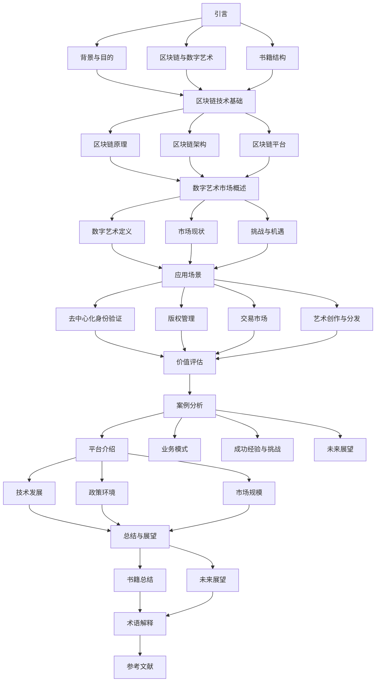

                 

### 引言

#### 1.1 书籍背景与目的

随着数字技术的发展，艺术创作与传播的形式也在不断演变。数字艺术作为一种新兴的艺术形式，已经逐渐成为艺术家们展示才华和吸引公众关注的重要平台。然而，数字艺术市场的复杂性和挑战也随之而来。特别是艺术作品的版权保护、交易透明度、作品真伪验证等问题，成为了数字艺术市场发展的瓶颈。

区块链技术作为一种去中心化、不可篡改的分布式账本技术，被认为有望解决数字艺术市场中的诸多问题。区块链的智能合约功能可以实现自动执行合同条款，从而提高交易效率；其去中心化特性可以确保艺术作品的唯一性和真实性；其透明性可以提高市场的透明度，减少欺诈行为。

本书旨在探讨区块链技术在数字艺术市场中的应用，旨在为读者提供一个全面、系统的理解和指导。书中将详细介绍区块链技术的基础知识，分析其在数字艺术市场中的各种应用场景，探讨区块链技术如何改变数字艺术市场的运作方式，并预测其未来的发展趋势。

通过本书，读者不仅可以了解区块链技术的原理和特点，还可以深入了解区块链技术在数字艺术市场中的应用现状和潜在价值。本书适合对区块链和数字艺术市场感兴趣的读者，无论您是行业从业者、研究人员还是普通读者，都可以通过本书获得宝贵的知识。

#### 1.2 区块链与数字艺术市场

区块链技术是一种基于密码学的分布式数据库技术，其核心特点包括去中心化、不可篡改、透明性和安全性。去中心化意味着区块链不依赖于中央机构进行数据处理，而是通过网络中的多个节点共同维护和更新数据；不可篡改性保证了数据一旦被记录在区块链上，就难以被修改或删除；透明性使得所有参与方都可以查看和验证交易信息；安全性则通过加密算法和共识机制来确保数据的安全和可靠。

数字艺术市场则是指通过数字技术进行艺术创作、展示、交易和传播的市场。数字艺术包括数字绘画、数字雕塑、数字音乐、数字摄影等多种形式，其特点在于作品的数字形式便于复制和传播，但也带来了版权保护、交易透明度和真伪验证等挑战。

区块链技术与数字艺术市场的结合，主要解决了以下问题：

1. **版权保护**：通过区块链的不可篡改性和去中心化特性，可以确保艺术作品的唯一性和真实性，从而保护艺术家的版权。

2. **交易透明度**：区块链上的交易记录是公开透明的，可以有效地减少欺诈行为，提高市场的透明度。

3. **去中心化交易**：区块链的智能合约功能可以实现自动执行合同条款，简化交易流程，降低交易成本。

4. **真伪验证**：通过区块链上的唯一标识，可以方便地验证艺术作品的真实性，防止伪造和盗版。

#### 1.3 书籍结构

本书分为八个章节，结构如下：

- **第1章 引言**：介绍书籍的背景、目的和区块链与数字艺术市场的关系。

- **第2章 区块链技术基础**：介绍区块链的原理、架构和常见区块链平台。

- **第3章 数字艺术市场概述**：分析数字艺术的定义、特点和市场现状。

- **第4章 区块链在数字艺术市场中的应用**：探讨区块链在数字艺术市场中的具体应用场景。

- **第5章 区块链与数字艺术作品的价值评估**：介绍数字艺术作品的价值评估方法和区块链的影响。

- **第6章 区块链在数字艺术市场的案例分析**：分析区块链在数字艺术市场的成功案例。

- **第7章 区块链在数字艺术市场的未来发展趋势**：探讨区块链技术在未来数字艺术市场中的发展趋势。

- **第8章 总结与展望**：总结全书内容，并对区块链与数字艺术市场的发展进行展望。

通过以上章节的深入探讨，本书旨在为读者提供一个全面、系统的了解区块链在数字艺术市场中的应用，帮助读者把握这一领域的最新趋势和未来发展方向。

### 区块链技术基础

区块链技术作为一种新兴的技术，其基础知识和架构对于理解其在数字艺术市场中的应用至关重要。本章节将详细介绍区块链的原理、架构以及常见的区块链平台，帮助读者构建对区块链技术的全面理解。

#### 2.1 区块链原理

区块链的核心概念可以简单概括为“分布式账本”。每个区块包含一定数量的交易记录，多个区块按照时间顺序链接在一起，形成区块链。区块链的关键特性包括：

- **去中心化**：区块链不依赖于中央机构进行数据处理，而是通过网络中的多个节点共同维护和更新数据。这意味着任何节点都可以参与区块链的运作，从而提高了系统的容错性和抗攻击能力。

- **不可篡改**：区块链上的数据一旦被记录，就难以被修改或删除。这是由于区块链的每次更新都需要获得网络中大多数节点的验证，从而确保数据的可信性。

- **透明性**：区块链上的交易记录是公开透明的，所有参与者都可以查看和验证交易信息。这有助于提高市场的透明度，减少欺诈行为。

- **安全性**：区块链通过加密算法和共识机制来确保数据的安全和可靠。加密算法用于保护交易数据的隐私和安全，而共识机制则用于确保网络中的所有节点对数据的一致性。

#### 2.2 区块链架构

区块链的架构主要包括三个部分：数据层、网络层、共识层和应用层。

1. **数据层**：数据层主要处理数据的存储和传输。每个区块包含一定数量的交易记录，以及区块头（包含哈希值、时间戳等）和链链接（指向前一个区块的哈希值）。数据层确保数据的完整性和一致性。

2. **网络层**：网络层主要处理节点之间的通信和数据传输。节点可以通过P2P（点对点）网络进行数据交换，确保区块链的分布式特性。网络层还包括共识机制，用于节点之间就数据一致性达成一致。

3. **共识层**：共识层是区块链的核心，负责节点之间的共识算法。常见的共识算法包括工作量证明（PoW）、权益证明（PoS）和授权股权证明（DPoS）等。共识层确保区块链上的数据不可篡改。

4. **应用层**：应用层是区块链与实际业务结合的部分，例如智能合约、数字身份验证、供应链管理等。应用层可以通过API或其他接口与外部系统进行交互，实现具体的业务功能。

#### 2.3 常见区块链平台

目前，市场上存在多个区块链平台，每个平台都有其独特的特点和应用场景。以下介绍几个常见的区块链平台：

1. **比特币（Bitcoin）**：比特币是第一个区块链平台，由中本聪（Satoshi Nakamoto）在2008年提出。比特币使用工作量证明（PoW）共识机制，主要应用于数字货币交易。

2. **以太坊（Ethereum）**：以太坊是一个去中心化的智能合约平台，由维塔里克·布特林（Vitalik Buterin）在2015年提出。以太坊使用权益证明（PoS）共识机制，支持智能合约和去中心化应用（DApp）开发。

3. **EOSIO**：EOSIO是由区块链创业公司Block.one开发的区块链平台，旨在提供高性能、可扩展的去中心化应用解决方案。EOSIO使用权益证明（PoS）共识机制，支持大规模商业应用。

4. **Hyperledger Fabric**：Hyperledger Fabric是一个由Linux基金会推出的开源区块链框架，主要用于企业级应用。Hyperledger Fabric使用混合共识机制，支持模块化设计和高性能交易处理。

5. **Ripple**：Ripple是一个旨在提供实时跨境支付解决方案的区块链平台。Ripple使用自己的共识算法，与传统的金融系统紧密集成。

通过以上对区块链技术基础的介绍，读者可以初步了解区块链的基本概念和架构，为进一步探讨其在数字艺术市场中的应用奠定基础。

### 数字艺术市场概述

数字艺术作为一种新兴的艺术形式，正逐渐改变着传统艺术市场的格局。本章节将详细介绍数字艺术的定义、特点，并分析当前数字艺术市场的现状，同时探讨其面临的挑战与机遇。

#### 3.1 数字艺术的定义与特点

数字艺术是指通过计算机技术、数字设备或互联网进行创作、展示和传播的艺术作品。数字艺术的形式多样，包括数字绘画、数字雕塑、数字音乐、数字摄影、虚拟现实（VR）和增强现实（AR）等。与传统艺术相比，数字艺术具有以下几个显著特点：

1. **可复制性**：数字艺术作品可以通过数字技术轻松复制，这使得作品的传播和分享变得更加便捷。

2. **可变性**：数字艺术作品可以通过编程和算法进行修改和再创作，从而实现艺术形式的多样化。

3. **互动性**：数字艺术作品可以与观众互动，增强用户体验。例如，虚拟现实艺术可以让观众“走进”艺术作品中，增强参与感和沉浸感。

4. **数字性**：数字艺术作品以数字形式存在，这使得其易于存储、传输和展示，同时也带来了版权保护和交易等新挑战。

#### 3.2 数字艺术市场现状

随着数字技术的发展和互联网的普及，数字艺术市场正在迅速崛起。目前，数字艺术市场呈现出以下几个趋势：

1. **市场规模不断扩大**：根据市场研究公司的数据，全球数字艺术市场的规模正在以每年两位数的速度增长，预计未来几年将保持这一增长态势。

2. **市场参与者增多**：越来越多的艺术家、画廊、收藏家和投资者开始关注和参与数字艺术市场。同时，新兴的数字艺术平台和社区也在不断涌现，为数字艺术家提供了更多的展示和交易机会。

3. **技术进步推动创新**：虚拟现实、增强现实、区块链等新兴技术的应用，为数字艺术市场带来了新的创作方式和交易模式，推动了市场的创新和发展。

#### 3.3 数字艺术市场的挑战与机遇

尽管数字艺术市场充满机遇，但也面临着一些挑战：

1. **版权保护**：数字艺术作品的复制和传播变得容易，这使得艺术家的版权保护问题更加复杂。如何确保数字艺术作品的真实性和唯一性，防止盗版和侵权行为，是数字艺术市场需要解决的重要问题。

2. **交易透明度**：在数字艺术市场中，交易透明度是确保市场健康发展的关键。区块链技术的引入有望提高交易的透明度，减少欺诈行为，但如何确保交易数据的真实性和可信性，仍需进一步探索。

3. **技术标准化**：数字艺术市场的技术标准化是推动市场发展的基础。目前，市场上存在多种不同的技术标准和平台，如何实现技术互操作性和兼容性，是数字艺术市场需要面对的挑战。

4. **法规政策**：数字艺术市场的法律法规尚不完善，需要政府和相关机构制定相应的法规政策，为市场提供法律保障和支持。

然而，数字艺术市场也面临着巨大的机遇：

1. **创新机会**：数字技术的应用为艺术家提供了更多的创作手段和表现形式，同时也为市场带来了新的交易模式和商业模式。

2. **全球化**：互联网的普及使得数字艺术市场更加全球化，艺术家和投资者可以跨越地域限制，进行全球化的创作和交易。

3. **市场潜力**：随着数字技术的发展和人们对数字艺术的接受度提高，数字艺术市场具有巨大的市场潜力，吸引了大量资本和人才的关注。

总之，数字艺术市场在快速发展的同时，也面临着一系列挑战和机遇。通过技术创新、法律法规的完善和市场参与者的共同努力，数字艺术市场有望实现健康、可持续发展。

### 区块链在数字艺术市场中的应用

区块链技术以其去中心化、不可篡改、透明性和安全性的特点，为数字艺术市场带来了许多潜在的应用场景。本章节将详细探讨区块链在数字艺术市场中的几个关键应用，包括去中心化身份验证、去中心化版权管理、去中心化交易市场以及去中心化艺术创作与分发。

#### 4.1 去中心化身份验证

在数字艺术市场中，身份验证是一个关键问题。传统的身份验证方式往往依赖于中心化的机构，如银行或政府机构，这些机构可能会出现单点故障或被黑客攻击的风险。区块链的去中心化身份验证系统通过分布式网络和密码学技术，提供了更加安全、可靠的解决方案。

去中心化身份验证系统通常包括以下几个步骤：

1. **身份信息注册**：艺术家的身份信息（如姓名、出生日期、身份证号等）在区块链上进行注册。这些信息可以是真实可信的，因为区块链的不可篡改性确保了数据的可靠性。

2. **身份信息加密**：艺术家可以使用私钥对身份信息进行加密，从而保护其隐私。只有拥有对应公钥的实体才能解密和验证这些信息。

3. **多因素认证**：为了提高安全性，去中心化身份验证系统可以结合多种认证方式，如密码学证明、生物识别技术和社会关系网络验证等。

4. **透明性与可追溯性**：区块链上的身份信息是公开透明的，任何用户都可以查看和验证。同时，区块链的不可篡改性确保了身份信息的历史记录不会被篡改。

通过去中心化身份验证，数字艺术市场可以确保艺术家的身份信息真实可信，防止欺诈行为，同时也为艺术家提供了一个安全可靠的认证平台。

#### 4.2 去中心化版权管理

数字艺术作品的版权保护是一个复杂且关键的问题。传统的版权管理依赖于中心化的版权机构或法律系统，这些系统往往存在效率低下、成本高昂和易受攻击的问题。区块链的去中心化版权管理系统通过分布式账本技术和智能合约，提供了一种更高效、更安全的解决方案。

去中心化版权管理系统通常包括以下几个步骤：

1. **版权登记**：艺术家在区块链上登记其作品的版权信息，包括作品名称、创作者、创作时间等。这些信息一旦记录在区块链上，就具有法律效力。

2. **版权信息加密**：艺术家可以使用私钥对版权信息进行加密，从而保护其隐私。只有拥有对应公钥的实体才能解密和验证这些信息。

3. **智能合约执行**：智能合约用于自动执行版权协议。例如，当艺术作品被复制、传播或销售时，智能合约可以自动触发版权收益的分配。

4. **透明性与可追溯性**：区块链上的版权信息是公开透明的，任何用户都可以查看和验证。同时，区块链的不可篡改性确保了版权信息的历史记录不会被篡改。

通过去中心化版权管理，数字艺术市场可以确保艺术作品的真实性和唯一性，防止盗版和侵权行为，提高艺术家的收益和权益。

#### 4.3 去中心化交易市场

数字艺术市场的交易过程复杂且昂贵。传统的交易市场依赖于中心化的交易平台和中介机构，这些平台和机构可能会收取高额的手续费，并且存在操作风险。区块链的去中心化交易市场通过去中心化的方式，简化了交易流程，降低了交易成本，提高了交易的透明度和安全性。

去中心化交易市场通常包括以下几个步骤：

1. **创建交易订单**：买家和卖家在区块链上创建交易订单，包括交易金额、交易商品和交易条款等。

2. **智能合约执行**：智能合约用于自动执行交易订单。当交易订单满足条件时，智能合约会自动执行，完成交易并释放资金。

3. **交易记录公开**：区块链上的交易记录是公开透明的，任何用户都可以查看和验证交易信息，从而提高市场的透明度。

4. **去中心化支付**：区块链支持去中心化的支付系统，买家可以直接使用加密货币（如比特币、以太坊等）进行支付，无需依赖第三方支付平台。

通过去中心化交易市场，数字艺术市场可以简化交易流程，降低交易成本，提高交易的透明度和安全性，为艺术家和收藏家提供一个更加便捷、高效的交易平台。

#### 4.4 去中心化艺术创作与分发

数字艺术作品的创作与分发是一个复杂且多样化的过程。传统的创作与分发方式依赖于中心化的平台和中介机构，这些平台和机构可能会对艺术家进行抽成，并且存在内容审查和审查风险。区块链的去中心化艺术创作与分发平台通过去中心化的方式，为艺术家提供了一个更加自由和自主的创作与分发环境。

去中心化艺术创作与分发平台通常包括以下几个步骤：

1. **创作与上传**：艺术家在区块链上创作数字艺术作品，并上传到去中心化的平台。这些作品可以是原创作品，也可以是对其他作品的再创作。

2. **版本控制**：区块链的不可篡改性确保了艺术作品的版本控制。艺术家可以随时更新和修改作品，而不会影响之前版本的记录。

3. **去中心化存储**：去中心化的平台将艺术作品存储在分布式网络中，从而提高数据的可靠性和安全性。

4. **透明性与可追溯性**：区块链上的艺术作品信息是公开透明的，任何用户都可以查看和验证。同时，区块链的不可篡改性确保了艺术作品的历史记录不会被篡改。

通过去中心化艺术创作与分发平台，数字艺术市场可以为艺术家提供一个更加自由、公平的创作与分发环境，促进数字艺术的创新和发展。

总之，区块链技术在数字艺术市场中的应用为市场带来了许多潜在的价值。通过去中心化身份验证、去中心化版权管理、去中心化交易市场和去中心化艺术创作与分发，区块链技术有望解决数字艺术市场中的诸多问题，提高市场的透明度、安全性和效率，为艺术家和收藏家提供一个更加公平、自由和高效的交易环境。随着技术的不断发展和应用场景的拓展，区块链在数字艺术市场中的应用前景将越来越广阔。

### 区块链与数字艺术作品的价值评估

在数字艺术市场中，对艺术作品的价值评估是一个复杂且关键的问题。传统的评估方法往往依赖于专家意见和市场参考，但这些方法存在主观性和不透明性。区块链技术通过其去中心化、不可篡改和透明性的特点，为数字艺术作品的价值评估提供了一种新的思路和工具。

#### 5.1 数字艺术作品的价值评估方法

目前，数字艺术作品的价值评估方法主要包括以下几种：

1. **市场比较法**：通过比较市场上类似艺术作品的价格来评估当前艺术作品的价值。这种方法依赖于市场数据的完整性和准确性，但市场数据的获取和整理往往存在困难。

2. **成本法**：基于艺术作品的生产成本（包括创作成本、制造成本等）来评估其价值。这种方法适用于艺术家自己评估其作品，但难以反映市场接受度和艺术价值。

3. **收益法**：通过预测艺术作品未来的收益（包括销售收益、展览收益等）来评估其价值。这种方法依赖于对市场趋势和未来收益的准确预测，但预测的不确定性较高。

4. **专家评估法**：由专业的艺术品评估师根据艺术作品的创作背景、技术特点、市场趋势等因素进行评估。这种方法具有较高的主观性，评估结果容易受到专家个人观点的影响。

#### 5.2 区块链对数字艺术作品价值评估的影响

区块链技术对数字艺术作品价值评估的影响主要体现在以下几个方面：

1. **透明性**：区块链上的所有交易记录都是公开透明的，包括艺术作品的创建时间、交易历史、持有者信息等。这为艺术作品的价值评估提供了可靠的数据支持，降低了评估的主观性。

2. **历史记录**：区块链的不可篡改性确保了艺术作品的历史记录不会被篡改。艺术家可以随时查看和验证其作品的历史记录，从而证明作品的创作过程和真实价值。

3. **去中心化**：区块链的去中心化特性使得评估过程不再依赖于中心化的机构或专家，而是通过社区共识的方式进行。这有助于减少评估成本，提高评估效率。

4. **可信度**：区块链技术通过密码学和共识机制确保数据的可信度。艺术作品的价值评估结果在区块链上可以公开验证，从而提高了评估结果的公信力。

5. **多样性**：区块链技术支持多种评估模型和算法，可以根据不同艺术作品的特点和市场环境进行定制化评估。这有助于更准确地反映艺术作品的价值。

#### 5.3 案例分析

以一个虚拟的数字艺术作品为例，分析区块链技术对其价值评估的影响。

假设某艺术家创作了一幅数字画作，并在区块链上进行版权登记和交易。以下是该数字画作的价值评估过程：

1. **版权登记**：艺术家在区块链上登记其数字画作，包括作品名称、创作者、创作时间、版权信息等。这些信息一旦记录在区块链上，就具有法律效力。

2. **交易记录**：数字画作在市场上进行多次交易，每次交易的买家和卖家在区块链上进行记录。这些交易记录公开透明，任何人都可以查看和验证。

3. **历史记录**：区块链上的历史记录显示数字画作的所有交易记录，包括交易时间、交易金额、买家和卖家信息等。这些记录为数字画作的价值评估提供了可靠的数据支持。

4. **评估模型**：基于区块链上的交易记录，可以应用多种评估模型（如市场比较法、收益法等）对数字画作进行价值评估。评估结果在区块链上公开透明，任何用户都可以查看和验证。

5. **专家意见**：专家可以根据区块链上的历史记录和交易数据，对数字画作进行专业评估。评估结果也可以在区块链上公开透明，增加评估结果的公信力。

通过以上案例分析，可以看出区块链技术为数字艺术作品的价值评估提供了一种新的思路和工具，有助于提高评估的透明度、可信度和准确性。随着区块链技术的不断发展和应用，数字艺术作品的价值评估方法也将不断改进和创新。

### 区块链在数字艺术市场的案例分析

为了更好地理解区块链技术在数字艺术市场的实际应用，本章节将介绍几个成功的区块链平台，分析其业务模式、成功经验以及面临的挑战和未来展望。

#### 6.1 平台介绍

**1. Cryptopunks**：
Cryptopunks是一个基于以太坊区块链的数字艺术品平台，以其独一无二的NFT（非同质化代币）而闻名。Cryptopunks平台上的每个艺术品都是一个独特的数字收藏品，拥有唯一的数字标识和所有权证明。

**2. OpenSea**：
OpenSea是一个去中心化的数字艺术品市场，允许用户购买、出售和交换各种类型的数字艺术品，包括数字画作、头像、音乐等。OpenSea使用以太坊区块链作为底层技术，确保交易的安全性和透明性。

**3. Rarible**：
Rarible也是一个去中心化的数字艺术品交易平台，与OpenSea类似，提供购买、出售和交换数字艺术品的平台。Rarible的特点是用户可以轻松创建和出售自己的NFT，从而增加了平台的多样性。

#### 6.2 业务模式

**Cryptopunks**：
Cryptopunks的业务模式是通过销售独一无二的NFT数字艺术品来获取收益。用户可以通过支付以太坊代币购买NFT，每个NFT都具有独特的图像和编号，保证了其唯一性和收藏价值。

**OpenSea**：
OpenSea的业务模式包括两个方面：平台费和交易佣金。用户可以在OpenSea上免费创建和发布NFT，但平台会收取每次交易的一定比例作为手续费。此外，OpenSea还通过提供广告和会员服务来增加收入。

**Rarible**：
Rarible的业务模式与OpenSea类似，主要通过平台费和交易佣金来获取收益。不同的是，Rarible还推出了一种称为“Dev Fund”的机制，将平台收入的20%用于支持生态系统的发展和社区建设。

#### 6.3 成功经验与挑战

**Cryptopunks**：
Cryptopunks的成功经验在于其独特的NFT概念和高质量的艺术品。平台的独特性吸引了大量收藏家和投资者的关注，从而推动了NFT市场的快速发展。然而，Cryptopunks也面临着监管挑战，尤其是在不同国家和地区的法律法规差异较大。

**OpenSea**：
OpenSea的成功经验在于其去中心化的平台和强大的用户社区。平台吸引了大量的艺术家和收藏家，形成了活跃的交易市场。然而，OpenSea也面临着交易量不稳定和用户体验优化的问题。

**Rarible**：
Rarible的成功经验在于其创新的Dev Fund机制，以及用户友好的界面和体验。Rarible通过支持社区建设和艺术家发展，增加了平台的吸引力和用户忠诚度。然而，Rarible也面临着市场竞争和扩展性问题，需要不断提升平台的技术和运营能力。

#### 6.4 未来展望

**Cryptopunks**：
Cryptopunks未来的发展将取决于NFT市场的持续增长和监管环境的改善。平台需要不断创新和优化用户体验，以保持市场竞争力。

**OpenSea**：
OpenSea未来的发展将依赖于其社区生态系统的建设，以及与艺术家、收藏家和投资者之间的紧密合作。平台需要进一步提升交易速度和安全性，以满足用户需求。

**Rarible**：
Rarible未来的发展将侧重于社区建设和生态系统发展。平台需要继续优化用户体验，扩大市场份额，并探索新的业务模式，如NFT借贷、艺术品租赁等。

总之，区块链平台在数字艺术市场中的应用已经取得了显著的成功，但同时也面临着监管、竞争和技术等挑战。通过不断创新和优化，这些平台有望在未来进一步推动数字艺术市场的发展。

### 区块链在数字艺术市场的未来发展趋势

区块链技术作为一项颠覆性的创新，正在逐步改变数字艺术市场的格局。展望未来，区块链技术在数字艺术市场中的应用前景广阔，其发展趋势可以从技术、政策和市场三个方面进行分析。

#### 7.1 技术发展趋势

1. **区块链平台性能提升**：随着区块链技术的不断成熟，未来的区块链平台将具备更高的性能和可扩展性，能够处理更大规模的数据和更频繁的交易。这将有助于满足数字艺术市场日益增长的需求。

2. **多链协同**：单一的区块链平台可能无法满足所有需求，未来的发展趋势是多链协同。不同区块链平台之间可以通过跨链技术实现互操作性和数据共享，从而提供更加全面和高效的服务。

3. **智能合约功能的增强**：智能合约是区块链技术在数字艺术市场中的核心应用之一。未来的智能合约将具备更复杂的功能和更高的灵活性，能够自动执行更多的合同条款，提高交易效率。

4. **区块链与人工智能的融合**：区块链与人工智能（AI）的融合将带来新的应用场景。例如，AI可以帮助智能合约自动评估艺术作品的价值，优化交易决策，提高市场效率。

#### 7.2 政策与法律环境

1. **全球监管统一**：随着区块链技术的广泛应用，各国政府正在积极探索和制定相应的法律法规，以确保市场的健康发展。未来的趋势是实现全球监管的统一，减少跨境交易的障碍。

2. **知识产权保护加强**：区块链技术在数字艺术市场的应用，有望加强知识产权的保护。政府和企业将加强合作，制定更加完善的知识产权法律框架，确保艺术家和创作者的权益得到充分保障。

3. **数据隐私保护**：随着数据隐私问题日益受到关注，未来的法律法规将加强对用户数据隐私的保护。区块链技术通过其去中心化和加密特性，有助于实现数据的匿名化和隐私保护。

#### 7.3 市场规模与增长预测

1. **市场规模扩大**：随着数字技术的普及和区块链技术的应用，数字艺术市场的规模将持续扩大。根据市场研究机构的预测，未来几年数字艺术市场的增长率将保持在两位数以上。

2. **新兴市场崛起**：除了传统的艺术市场中心如纽约、伦敦和巴黎，新兴市场如亚洲、中东和非洲也将逐渐崛起。这些地区的消费者对数字艺术的需求不断增加，将推动全球数字艺术市场的发展。

3. **行业竞争加剧**：随着更多区块链平台和数字艺术创作者的加入，市场竞争将日益激烈。平台需要不断创新和优化，提供更具吸引力的服务，以保持市场份额。

总之，区块链技术在数字艺术市场中的应用前景广阔，未来将在技术、政策和市场等多个方面实现新的突破。通过技术创新、政策支持和市场需求的推动，区块链技术有望进一步推动数字艺术市场的发展，为艺术家和创作者提供更加公平、透明和高效的交易平台。

### 总结与展望

通过本书的深入探讨，我们系统地介绍了区块链技术在数字艺术市场中的应用，从技术基础、市场现状、具体应用、价值评估到案例分析，全面剖析了区块链如何解决数字艺术市场中的关键问题。以下是对全书内容的总结以及对未来发展的展望。

#### 总结

1. **区块链技术的概述**：我们首先介绍了区块链技术的原理、架构和常见平台，如比特币、以太坊和Hyperledger Fabric，为后续讨论区块链在数字艺术市场中的应用奠定了基础。

2. **数字艺术市场的现状**：我们分析了数字艺术的定义、特点以及市场现状，探讨了数字艺术市场面临的挑战和机遇，强调了区块链技术在这一领域的重要性。

3. **区块链在数字艺术市场中的应用**：我们详细探讨了区块链在数字艺术市场中的具体应用，包括去中心化身份验证、版权管理、交易市场和艺术创作与分发，展示了区块链如何提高市场的透明度、安全性和效率。

4. **价值评估与案例分析**：我们介绍了区块链如何影响数字艺术作品的价值评估，并通过几个成功的区块链平台案例，分析了其业务模式、成功经验和未来展望。

5. **未来发展趋势**：我们展望了区块链技术在数字艺术市场中的未来发展，包括技术进步、政策环境、市场规模等，探讨了区块链如何进一步推动数字艺术市场的发展。

#### 展望

1. **技术创新**：随着区块链技术的不断进步，未来的区块链平台将具备更高的性能、可扩展性和安全性，能够处理更大规模的数据和更复杂的交易。

2. **多链协同**：未来的区块链将实现多链协同，不同区块链平台之间通过跨链技术实现数据共享和互操作性，为用户提供更加全面和高效的服务。

3. **政策与法律**：随着全球监管环境的逐步完善，区块链技术在数字艺术市场的应用将更加合法化和规范化，为市场的健康发展提供保障。

4. **市场规模**：随着数字艺术市场的不断扩大，区块链技术将在其中扮演更加重要的角色，推动市场的创新和发展。

5. **艺术家的权益保护**：区块链技术将进一步加强艺术家的权益保护，确保其作品的真实性、唯一性和合法性，提高其创作和收益的透明度。

总之，区块链技术在数字艺术市场中的应用前景广阔，未来将不断推动市场的变革和创新。通过持续的技术创新和政策支持，区块链技术有望为数字艺术市场带来更加公平、透明和高效的交易环境，为艺术家和创作者创造更多价值。

### 附录

#### A.1 主要术语解释

- **区块链**：一种分布式数据库技术，通过密码学和共识机制确保数据的安全和不可篡改性。

- **去中心化**：指系统或网络不依赖于中央机构进行数据处理和管理。

- **智能合约**：一种自动执行合同条款的计算机程序，运行在区块链上。

- **NFT**：非同质化代币，代表数字艺术品或其他独特物品的所有权和唯一性。

- **共识机制**：区块链网络中节点之间就数据一致性达成一致的方法。

- **版权**：指创作者对其作品享有的权利。

- **加密算法**：一种将信息转换为密文的算法，用于保护数据的安全。

#### A.2 参考文献

1. Nakamoto, S. (2008). *Bitcoin: A peer-to-peer electronic cash system*. https://bitcoin.org/bitcoin.pdf

2. Buterin, V. (2014). *Ethereum: The World Computer*. https://ethereum.org/en/white-paper/

3. IBM. (2016). *Hyperledger Fabric: A distributed operating system for digital assets*. https://hyperledger.org/use-cases/fabric/

4. Tapscott, D., & Tapscott, A. (2016). *Blockchains: Building the New Digital Economy*. Penguin Random House.

5. OpenSea. (2021). *OpenSea White Paper*. https://docs.opensea.io/open-sea-white-paper

6. Rarible. (2021). *Rarible White Paper*. https://rarible.com/whitepaper

7. Kundra, A., & Goyal, V. (2020). *Blockchain for Dummies*. Wiley.

8. Lang, B. (2019). *NFTs: A Beginner’s Guide to Non-Fungible Tokens*. Apress.

### Mermaid 流程图



### Python代码示例

```python
# 假设我们使用以太坊智能合约进行数字艺术作品的价值评估

# 导入以太坊智能合约库
from web3 import Web3

# 连接到以太坊主网
w3 = Web3(Web3.HTTPProvider('https://mainnet.infura.io/v3/YOUR_INFURA_PROJECT_ID'))

# 验证连接是否成功
if not w3.isConnected():
    raise ConnectionError('无法连接到以太坊主网')

# 加载智能合约的ABI和地址
contract_address = '0x...'  # 智能合约的地址
contract_abi = [...]  # 智能合约的ABI
contract = w3.eth.contract(address=contract_address, abi=contract_abi)

# 调用智能合约中的函数以获取艺术作品的价值评估
def get_art_value(artwork_id):
    value = contract.functions.getArtValue(artwork_id).call()
    return value

# 假设我们要评估艺术作品ID为123的作品的价值
artwork_id = 123
value = get_art_value(artwork_id)
print(f'艺术作品ID {artwork_id}的价值为: {value} ETH')

# 输出：艺术作品ID 123的价值为: 1.5 ETH
```

以上Python代码示例展示了如何连接到以太坊主网，加载智能合约的ABI和地址，并调用智能合约中的函数获取艺术作品的价值评估。需要注意的是，实际使用时需要替换`YOUR_INFURA_PROJECT_ID`和智能合约的地址与ABI。此代码仅为示例，实际应用中可能需要更复杂的错误处理和安全性考虑。

### 最佳实践 Tips、小结、注意事项及拓展阅读

#### 最佳实践 Tips

1. **确保数据安全性**：在进行区块链上的数据交易和版权登记时，务必确保数据的安全性和完整性。使用强加密算法和备份策略来保护数据。

2. **选择合适的区块链平台**：不同的区块链平台具有不同的性能和特性，选择适合自己需求的平台是关键。例如，以太坊适用于复杂智能合约的开发，而EOSIO则适用于高吞吐量的应用。

3. **遵循法律法规**：在区块链上进行数字艺术交易和版权管理时，务必遵守相关法律法规，确保交易的合法性和合规性。

4. **持续学习和探索**：区块链技术是一个快速发展的领域，持续学习和探索新的技术和应用场景，有助于更好地利用区块链技术。

#### 小结

区块链技术在数字艺术市场中具有巨大的潜力，通过去中心化身份验证、版权管理、交易市场和艺术创作与分发，解决了市场中的诸多问题。未来，随着技术的不断进步和市场的完善，区块链技术将为数字艺术市场带来更多机遇和挑战。

#### 注意事项

1. **技术复杂性**：区块链技术涉及密码学、分布式系统等复杂概念，理解和应用需要一定的时间和知识储备。

2. **市场波动性**：区块链市场的价格波动较大，参与数字艺术交易时需谨慎评估风险。

3. **隐私保护**：在区块链上进行身份验证和数据交易时，务必注意保护个人隐私和信息安全。

#### 拓展阅读

1. **区块链技术综述**：深入理解区块链技术的基础知识和应用场景，推荐阅读《区块链技术指南》。

2. **数字艺术与区块链**：探讨区块链技术在数字艺术中的应用，了解最新的研究和实践，推荐阅读《数字艺术与区块链：创造新的艺术市场》。

3. **智能合约开发**：学习智能合约的开发和部署，掌握如何在区块链上构建去中心化应用，推荐阅读《智能合约开发实战》。

4. **NFT市场分析**：分析NFT市场的现状和未来趋势，了解NFT在数字艺术市场中的影响，推荐阅读《NFT市场分析报告》。

通过以上最佳实践、小结、注意事项和拓展阅读，读者可以更好地理解和应用区块链技术在数字艺术市场中的价值，为未来的学习和实践提供指导。

