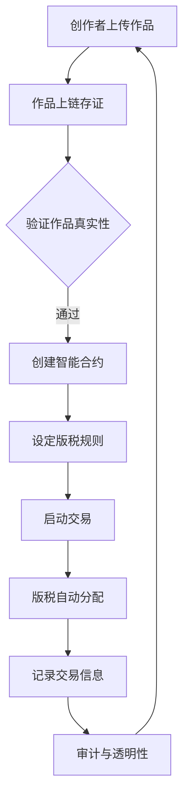

                 

## 《区块链在数字艺术版税分配中的应用》

### 关键词

区块链、数字艺术、版税分配、智能合约、非同质化代币（NFT）、数字版权管理

#### 摘要

区块链技术以其去中心化、不可篡改和透明的特性，正在重新定义数字艺术领域的版税分配模式。本文将探讨区块链技术如何应用于数字艺术的版税分配，包括技术概述、数字艺术市场的现状、区块链与数字艺术的结合、版税分配机制设计以及实际案例解析。通过对区块链技术的深入分析，我们旨在揭示其在提高透明度和效率方面的潜力，并为数字艺术创作者和投资者提供实践指导。

## 《区块链在数字艺术版税分配中的应用》目录大纲

### 第1章：区块链技术概述

- 1.1 区块链的起源与发展
  - 1.1.1 区块链的定义与核心特征
  - 1.1.2 区块链技术的核心组成部分
  - 1.1.3 区块链技术的发展历程
- 1.2 数字艺术与版税分配
  - 1.2.1 数字艺术的定义与特点
  - 1.2.2 数字艺术版税分配的挑战
  - 1.2.3 区块链在数字艺术版税分配中的应用前景

### 第2章：区块链与数字艺术

- 2.1 数字艺术市场的现状
  - 2.1.1 数字艺术市场的规模与增长趋势
  - 2.1.2 数字艺术市场的参与者
  - 2.1.3 数字艺术市场的痛点
- 2.2 区块链技术在数字艺术领域的应用
  - 2.2.1 不可篡改性与数字艺术
  - 2.2.2 智能合约与数字艺术版税分配
  - 2.2.3 非同质化代币（NFT）与数字艺术

### 第3章：区块链在数字艺术版税分配中的应用

- 3.1 版税分配机制设计
  - 3.1.1 版税分配的挑战与机遇
  - 3.1.2 智能合约在版税分配中的应用
  - 3.1.3 非同质化代币在版税分配中的应用
- 3.2 实际案例解析
  - 3.2.1 案例一：区块链在音乐版税分配中的应用
  - 3.2.2 案例二：区块链在影视版权管理中的应用
  - 3.2.3 案例三：区块链在艺术品交易中的应用

### 第4章：区块链技术实现

- 4.1 区块链开发环境搭建
  - 4.1.1 开发环境准备
  - 4.1.2 区块链节点搭建
  - 4.1.3 区块链客户端配置
- 4.2 区块链智能合约编写
  - 4.2.1 智能合约基础语法
  - 4.2.2 版税分配智能合约编写
  - 4.2.3 智能合约测试与部署

### 第5章：区块链在数字艺术版税分配中的挑战与解决方案

- 5.1 技术挑战
  - 5.1.1 性能与可扩展性
  - 5.1.2 安全性问题
  - 5.1.3 用户体验与普及
- 5.2 解决方案与未来展望
  - 5.2.1 技术创新
  - 5.2.2 政策与法律
  - 5.2.3 市场与用户教育

### 第6章：案例研究

- 6.1 国内数字艺术版税分配案例
  - 6.1.1 案例一：XX数字艺术平台
  - 6.1.2 案例二：XX数字艺术品交易所
- 6.2 国际数字艺术版税分配案例
  - 6.2.1 案例一：XX音乐平台
  - 6.2.2 案例二：XX艺术品交易平台

### 第7章：总结与展望

- 7.1 区块链在数字艺术版税分配中的应用总结
- 7.2 未来发展趋势与挑战
- 7.3 对创作者、投资者与市场的启示

### 附录

- 7.4 常用区块链工具与资源推荐
- 7.5 数字艺术与区块链相关法规与政策概述

### 第8章：区块链在数字艺术版税分配中的 Mermaid 流程图

- 8.1 区块链版税分配流程图
- 8.2 版税分配智能合约代码示例

---

### 第1章：区块链技术概述

区块链技术自2008年由中本聪（Satoshi Nakamoto）首次提出以来，已迅速成为全球金融科技领域的重要创新。区块链的去中心化、不可篡改和透明性特点，使其在数字货币如比特币中的应用得到了广泛认可。随着技术的进一步发展和扩展，区块链开始被应用于更广泛的领域，包括数字艺术、版权管理、供应链追踪等。

#### 1.1 区块链的起源与发展

区块链的起源可以追溯到2008年中本聪发表的比特币白皮书《比特币：一种点对点的电子现金系统》。比特币作为第一个成功的区块链应用，其核心创新在于解决了传统金融系统中长期未能解决的“双花”问题，即同一笔资金是否已经被花费的问题。

**1.1.1 区块链的定义与核心特征**

区块链是一种分布式数据库技术，它通过加密算法和共识机制，确保了数据的完整性和不可篡改性。区块链的核心特征包括：

- **去中心化**：区块链不依赖于单一的中心节点，而是由网络中的多个节点共同维护和更新数据。这意味着区块链可以在没有中央权威机构的情况下运行。

- **不可篡改**：一旦数据被记录在区块链上，就很难被篡改或删除。这主要通过加密算法和共识机制来实现。

- **透明性**：区块链上的所有交易记录都是公开透明的，任何人都可以通过区块链浏览器查看。这种透明性增加了系统的信任度。

- **安全性**：区块链使用加密算法来保护数据的安全和隐私，确保只有授权用户才能访问和修改数据。

**1.1.2 区块链技术的核心组成部分**

区块链技术主要由以下三个部分组成：

- **区块链网络**：由多个节点组成，这些节点负责维护和更新区块链数据。

- **加密算法**：用于保护数据的安全和隐私，包括哈希算法、公钥加密算法等。

- **共识机制**：用于确保区块链网络中的所有节点对数据的共识，如工作量证明（PoW）、权益证明（PoS）等。

**1.1.3 区块链技术的发展历程**

自比特币问世以来，区块链技术经历了多个发展阶段：

- **2010年代早期**：以比特币为代表的区块链1.0阶段，主要关注数字货币的应用。

- **2014-2017年**：区块链2.0阶段，以以太坊为代表，扩展了区块链的应用范围，引入了智能合约概念。

- **2018年至今**：区块链3.0阶段，进一步扩展区块链技术的应用，如供应链追踪、数字身份认证等。

#### 1.2 数字艺术与版税分配

数字艺术，作为一种基于数字技术的艺术形式，具有易复制、难追踪等特点。这使得传统的版税分配模式在数字艺术领域面临着巨大的挑战。

**1.2.1 数字艺术的定义与特点**

数字艺术是指使用数字技术和设备创作的艺术作品。与传统的绘画、雕塑等艺术形式不同，数字艺术具有以下特点：

- **可复制性**：数字艺术作品可以被无限复制，而不会降低其品质。

- **可修改性**：数字艺术作品可以在不损坏原作品的情况下进行修改和创作。

- **可追踪性**：数字艺术作品的创作和传播过程可以通过区块链等技术进行追踪。

**1.2.2 数字艺术版税分配的挑战**

在数字艺术领域，版税分配面临着以下挑战：

- **透明度不足**：传统的版税分配过程往往缺乏透明度，创作者难以了解自己的作品在市场上如何被分配和使用。

- **效率低下**：传统的版税分配模式涉及多个中介机构，导致过程复杂，效率低下。

- **篡改风险**：数字艺术作品容易被篡改或盗用，创作者的权益难以保障。

**1.2.3 区块链在数字艺术版税分配中的应用前景**

区块链技术的引入为数字艺术版税分配带来了新的机遇：

- **透明性**：区块链技术的透明性确保了版税分配过程的公开透明，创作者可以实时查看自己的作品收益。

- **效率**：通过智能合约自动执行版税分配，减少了中介机构的参与，提高了效率。

- **安全性**：区块链的不可篡改性确保了版税分配记录的准确性，降低了篡改风险。

本章概述了区块链技术的起源和发展，以及数字艺术版税分配的现状和挑战。接下来，我们将深入探讨区块链与数字艺术的结合，以及如何在数字艺术版税分配中应用区块链技术。

---

### 第2章：区块链与数字艺术

#### 2.1 数字艺术市场的现状

随着互联网和数字技术的迅猛发展，数字艺术市场正经历着前所未有的增长。数字艺术不仅涵盖了传统的视觉艺术形式，如绘画、雕塑，还扩展到了音乐、影视、虚拟现实等多样化的领域。

**2.1.1 数字艺术市场的规模与增长趋势**

根据市场研究机构的报告，全球数字艺术市场的规模正在迅速扩大。以NFT（非同质化代币）为例，2020年NFT市场的交易额仅为1.8亿美元，而到了2021年，这一数字跃升至18.4亿美元，同比增长近10倍。预计到2025年，全球数字艺术市场的规模将达到数百亿美元。

**2.1.2 数字艺术市场的参与者**

数字艺术市场的参与者主要包括以下几类：

- **创作者**：包括艺术家、音乐人、电影制作人等，他们是数字艺术作品的原创者。

- **平台**：如OpenSea、Rarible等，这些平台为创作者提供了一个展示和销售作品的平台。

- **投资者**：包括传统的金融投资者和新兴的数字货币投资者，他们通过购买NFT等方式参与数字艺术市场。

- **收藏家**：数字艺术收藏家通过购买NFT等方式积累数字艺术品，以期望在未来获得增值。

**2.1.3 数字艺术市场的痛点**

尽管数字艺术市场前景广阔，但同时也面临着一些痛点：

- **版权纠纷**：由于数字艺术作品的易复制性，创作者的版权保护成为一个难题。

- **透明度不足**：传统艺术市场的版税分配过程往往缺乏透明度，创作者难以了解自己的作品收益。

- **中介成本高**：传统艺术市场的交易过程复杂，中介机构收取高额费用，降低了创作者和投资者的收益。

- **安全性问题**：数字艺术作品容易被盗用或篡改，创作者的权益难以保障。

**2.2 区块链技术在数字艺术领域的应用**

区块链技术的引入为解决数字艺术市场的痛点提供了新的解决方案。

**2.2.1 不可篡改性与数字艺术**

区块链的不可篡改性确保了数字艺术作品的原始性和唯一性。创作者可以将作品上链，通过加密算法和时间戳技术，确保作品一旦上链就无法被篡改。这不仅保护了创作者的版权，还提高了作品的收藏价值。

**2.2.2 智能合约与数字艺术版税分配**

智能合约是区块链技术的重要组成部分，它可以自动执行合约条款，无需人工干预。在数字艺术版税分配中，智能合约可以用于自动化版税分配过程。例如，创作者可以设置智能合约，当作品被出售时，系统会自动将版税分配给创作者和其他利益相关者。

**2.2.3 非同质化代币（NFT）与数字艺术**

NFT是一种基于区块链的代币，代表数字艺术作品的唯一所有权。与同质化代币（如比特币）不同，NFT具有独特性，无法复制或替代。在数字艺术领域，NFT为创作者提供了一种新的盈利模式。例如，艺术家可以通过发行NFT版画，每次出售版画时，系统会自动分配版税给艺术家和其他利益相关者。

**2.2.4 区块链与数字身份**

区块链技术还可以用于数字身份验证，确保创作者的身份真实可靠。例如，创作者可以在区块链上注册自己的数字身份，从而证明作品的原创性。这有助于解决数字艺术市场的版权纠纷问题。

本章探讨了区块链技术在数字艺术领域的应用，包括数字艺术市场的现状、参与者、痛点，以及区块链如何解决这些问题。下一章将深入探讨区块链在数字艺术版税分配中的应用机制和实际案例。

---

### 第3章：区块链在数字艺术版税分配中的应用

#### 3.1 版税分配机制设计

数字艺术作品的版税分配是一个复杂的过程，涉及多个利益相关者，包括创作者、艺术家、投资者、平台等。区块链技术的引入，为设计一个透明、高效、安全的版税分配机制提供了可能性。

**3.1.1 版税分配的挑战与机遇**

在传统的版税分配模式中，创作者往往面临以下挑战：

- **透明度不足**：传统版税分配过程往往不透明，创作者难以了解自己的作品在市场上如何被分配和使用。

- **效率低下**：涉及多个中介机构的交易过程复杂，效率低下。

- **篡改风险**：数字艺术作品容易被篡改或盗用，创作者的权益难以保障。

区块链技术的引入，为解决这些问题提供了新的机遇：

- **提高透明度**：区块链的透明性确保了版税分配过程的公开透明，创作者可以实时查看自己的作品收益。

- **提高效率**：通过智能合约自动执行版税分配，减少了中介机构的参与，提高了效率。

- **降低篡改风险**：区块链的不可篡改性确保了版税分配记录的准确性，降低了篡改风险。

**3.1.2 智能合约在版税分配中的应用**

智能合约是区块链技术的重要组成部分，它可以自动执行合约条款，无需人工干预。在数字艺术版税分配中，智能合约可以用于自动化版税分配过程。例如，创作者可以设置智能合约，当作品被出售时，系统会自动将版税分配给创作者和其他利益相关者。

**智能合约的组成部分**

智能合约通常由以下几部分组成：

- **输入参数**：定义了版税分配的规则，如创作者地址、版税比例、作品售价等。

- **逻辑代码**：实现了版税分配的逻辑，如当作品售出时，自动计算版税并将版税分配给相关方。

- **输出结果**：记录了版税分配的结果，如版税分配的金额和地址。

**智能合约示例**

以下是一个简单的智能合约示例，用于实现版税分配：

```python
# SPDX-License-Identifier: MIT
pragma solidity ^0.8.0;

contract ArtTaxDistribution {
    address public artist; // 创作者地址
    mapping(address => uint256) public balanceOf; // 地址对应余额
    uint256 public totalSupply; // 总版税金额

    // 构造函数，初始化创作者地址和版税金额
    constructor(uint256 _totalSupply) {
        artist = msg.sender;
        totalSupply = _totalSupply;
    }

    // 上传数字作品，添加版税受益人
    function addContributor(address _contributor, uint256 _balance) external {
        require(msg.sender == artist, "Only artist can add contributors");
        contributors.push(_contributor);
        balanceOf[_contributor] = _balance;
    }

    // 分配版税
    function distributeTax() external {
        require(msg.sender == artist, "Only artist can distribute tax");
        for (uint256 i = 0; i < contributors.length; i++) {
            address contributor = contributors[i];
            uint256 contributorBalance = balanceOf[contributor];
            balanceOf[contributor] = 0;
            payable(contributor).transfer(contributorBalance);
        }
    }
}
```

**3.1.3 非同质化代币（NFT）在版税分配中的应用**

NFT（非同质化代币）为数字艺术版税分配提供了新的可能性。NFT代表了数字艺术作品的唯一所有权，创作者可以通过发行NFT来出售作品，并设置版税自动分配规则。

**NFT版税分配示例**

以下是一个简单的NFT版税分配示例：

```python
# SPDX-License-Identifier: MIT
pragma solidity ^0.8.0;

import "@openzeppelin/contracts/token/ERC721/ERC721.sol";
import "@openzeppelin/contracts/token/ERC721/extensions/ERC721URIStorage.sol";

contract ArtNFT is ERC721URIStorage {
    address public artist; // 创作者地址
    uint256 public royaltyPercentage; // 版税比例

    // 构造函数，初始化创作者地址和版税比例
    constructor(string memory name, string memory symbol, uint256 _royaltyPercentage) ERC721(name, symbol) {
        artist = msg.sender;
        royaltyPercentage = _royaltyPercentage;
    }

    // 设置版税比例
    function setRoyaltyPercentage(uint256 _royaltyPercentage) external {
        require(msg.sender == artist, "Only artist can set royalty percentage");
        royaltyPercentage = _royaltyPercentage;
    }

    // 上传数字作品
    function mint(string calldata _uri) external {
        require(msg.sender == artist, "Only artist can mint");
        uint256 tokenId = totalSupply();
        _mint(msg.sender, tokenId);
        _setTokenURI(tokenId, _uri);
    }

    // 出售数字作品
    function sell(uint256 tokenId, uint256 price) external {
        require(ownerOf(tokenId) == msg.sender, "Only owner can sell");
        _transferFrom(msg.sender, address(this), tokenId);
        uint256 royaltyAmount = (price * royaltyPercentage) / 100;
        payable(artist).transfer(royaltyAmount);
        payable(msg.sender).transfer(price - royaltyAmount);
    }

    // 版税分配
    function distributeRoyalty() external {
        require(msg.sender == artist, "Only artist can distribute royalty");
        for (uint256 i = 0; i < tokensOfOwner(address(this)).length; i++) {
            uint256 tokenId = tokensOfOwner(address(this))[i];
            uint256 balance = balanceOf[tokenId];
            balanceOf[tokenId] = 0;
            payable(artist).transfer(balance);
        }
    }
}
```

通过智能合约和NFT的应用，数字艺术版税分配变得更加透明、高效和自动化。创作者可以通过设置智能合约来定义版税比例和分配规则，确保每次作品售出时，版税能够自动分配给创作者和其他利益相关者。这种机制不仅提高了版税分配的透明度和效率，还降低了篡改风险，为数字艺术市场的发展提供了新的动力。

本章详细介绍了区块链在数字艺术版税分配中的应用，包括版税分配机制的挑战与机遇、智能合约的应用以及NFT在版税分配中的角色。下一章将结合实际案例，进一步探讨区块链在数字艺术版税分配中的应用和实践。

---

### 3.2 实际案例解析

区块链技术在数字艺术版税分配中的应用已经取得了一些显著的成果，以下将通过三个实际案例，展示区块链如何在不同场景中发挥作用。

#### 3.2.1 案例一：区块链在音乐版税分配中的应用

音乐是数字艺术的重要领域之一，传统的音乐版税分配过程复杂且透明度低。Spotify等音乐流媒体平台已经尝试通过区块链技术来优化版税分配。

**案例概述**

Spotify与Chainlink合作，利用区块链技术来实现版税自动分配。Chainlink提供了一个去中心化的 oracle 服务，用于收集实时音乐播放数据，并将其传输到区块链上。通过智能合约，创作者和权利持有人可以根据播放数据自动获得版税。

**解决方案**

1. **去中心化数据采集**：Chainlink Network提供了去中心化的 oracle 服务，确保数据的准确性和透明性。
   
2. **智能合约执行版税分配**：Spotify使用智能合约来处理版税分配，根据实时播放数据自动计算并分配版税。

3. **透明度提升**：所有版税分配记录都记录在区块链上，创作者和权利持有人可以随时查看和验证。

**效果分析**

- **透明度提高**：创作者可以实时了解自己的作品收益，版税分配过程更加透明。
- **效率提升**：减少了人工干预，版税分配过程更加高效。
- **安全性提升**：区块链的不可篡改性确保了版税分配记录的准确性，降低了篡改风险。

#### 3.2.2 案例二：区块链在影视版权管理中的应用

影视作品的版权管理复杂且涉及多个利益相关者，包括创作者、制片人、发行方等。区块链技术为影视版权管理提供了新的解决方案。

**案例概述**

华纳兄弟与基于以太坊的区块链平台Ethereal合作，利用区块链技术来管理影视作品的版权和版税分配。

**解决方案**

1. **数字版权管理**：Ethereal平台提供了一个去中心化的版权管理系统，创作者可以将作品上传到平台，并获得唯一的数字标识。

2. **智能合约管理版税**：智能合约用于管理版税分配，确保每次作品被授权或销售时，版税能够自动分配给创作者和其他利益相关者。

3. **透明度和审计**：所有版权信息和版税分配记录都记录在区块链上，可以随时进行审计和验证。

**效果分析**

- **透明度和可审计性**：创作者和制片人可以随时查看自己的作品版权状态和版税分配情况，提高了透明度和信任度。
- **简化版权交易**：去中心化的版权管理系统简化了版权交易过程，减少了中介成本。
- **提高安全性**：区块链的不可篡改性确保了版权信息和版税分配记录的准确性，降低了篡改风险。

#### 3.2.3 案例三：区块链在艺术品交易中的应用

艺术品交易市场历史悠久，但也存在透明度和信任问题。区块链技术为艺术品交易提供了一个全新的平台。

**案例概述**

加密艺术画廊KnownOrigin利用区块链技术，提供了一个去中心化的艺术品交易平台。

**解决方案**

1. **NFT化艺术品**：艺术家可以将艺术品转换为NFT，确保每件作品具有唯一性和可追踪性。

2. **智能合约管理交易**：智能合约用于管理艺术品交易，确保每次交易时，版税和授权都能够自动执行。

3. **透明度和可审计性**：所有交易记录都记录在区块链上，创作者和买家可以随时查看和验证。

**效果分析**

- **透明度和可追踪性**：买家可以清楚地了解艺术品的历史和所有权记录，提高了购买决策的信心。
- **简化和自动化交易**：智能合约自动化了艺术品交易过程，减少了人工干预和交易成本。
- **版税自动分配**：智能合约确保了每次艺术品交易时，版税能够自动分配给创作者和其他利益相关者。

通过以上三个案例，我们可以看到区块链技术在数字艺术版税分配中的应用已经取得了显著的成果。区块链不仅提高了透明度和效率，还降低了篡改风险，为数字艺术市场的发展提供了新的动力。

---

### 4.1 区块链开发环境搭建

要实现区块链在数字艺术版税分配中的应用，首先需要搭建一个合适的开发环境。本节将介绍如何准备开发环境、搭建区块链节点以及配置区块链客户端。

#### 4.1.1 开发环境准备

在进行区块链开发之前，需要安装一些必要的软件和工具。以下是在Windows环境下搭建区块链开发环境所需的主要步骤：

1. **安装Node.js**：Node.js是一个基于Chrome V8引擎的JavaScript运行环境，用于构建高效的网络应用。可以从Node.js的官方网站（https://nodejs.org/）下载并安装。

2. **安装Truffle**：Truffle是一个开发框架和工具集，用于以太坊智能合约的开发和测试。可以通过以下命令安装：

   ```sh
   npm install -g truffle
   ```

3. **安装Ganache**：Ganache是一个本地以太坊节点，用于开发和测试智能合约。可以从Ganache的官方网站（https://www.ganache.io/）下载并安装。

4. **安装Web3.js**：Web3.js是一个JavaScript库，用于与以太坊区块链进行交互。可以通过以下命令安装：

   ```sh
   npm install web3
   ```

#### 4.1.2 区块链节点搭建

搭建区块链节点是进行区块链开发的第一步。以下是在Windows环境下使用Ganache搭建以太坊节点的步骤：

1. **启动Ganache**：打开Ganache并创建一个新的工作区。

2. **设置节点参数**：在Ganache中，可以设置节点的名称、端口、以太坊版本等参数。确保节点已经启动并监听指定端口。

3. **创建账户**：在Ganache中创建一个新的账户，用于后续的智能合约部署和交易。

#### 4.1.3 区块链客户端配置

配置区块链客户端是确保应用程序能够与区块链网络进行交互的重要步骤。以下是如何配置Web3.js客户端的示例：

1. **初始化Web3.js客户端**：

   ```javascript
   const Web3 = require('web3');
   const web3 = new Web3('HTTP://127.0.0.1:7545');
   ```

   这里的URL是Ganache节点的HTTP接口地址。

2. **连接到区块链网络**：

   ```javascript
   web3.eth.net_version().then((version) => {
       console.log(`Network version: ${version}`);
   });
   ```

   这将连接到本地以太坊节点并获取网络版本信息。

3. **获取区块链信息**：

   ```javascript
   web3.eth.getBlock('latest').then((block) => {
       console.log(`Latest block number: ${block.number}`);
   });
   ```

   这将获取最新的区块链区块信息。

通过以上步骤，我们成功搭建了一个区块链开发环境，并配置了Web3.js客户端。接下来，我们将介绍如何编写和部署智能合约。

---

### 4.2 区块链智能合约编写

智能合约是区块链技术中的关键组成部分，它允许在不信任的环境中执行自动化协议。在数字艺术版税分配中，智能合约可以用来确保版税的自动分配和透明性。本节将介绍智能合约的基础语法、版税分配智能合约的编写以及智能合约的测试与部署。

#### 4.2.1 智能合约基础语法

智能合约通常使用Solidity语言编写，这是一种为以太坊区块链设计的合约编写语言。以下是一些智能合约的基础语法：

1. **合约声明**：

   ```solidity
   contract ArtTax {
       // 合约代码
   }
   ```

   合约以`contract`关键字开始，后面跟着合约名称和花括号内的合约代码。

2. **状态变量**：

   ```solidity
   address public artist;
   mapping(address => uint256) public balanceOf;
   ```

   状态变量是存储在区块链上的变量，具有持久性。例如，`artist`是创作者的地址，`balanceOf`是一个映射变量，用于存储每个参与者的余额。

3. **事件声明**：

   ```solidity
   event Transfer(address indexed from, address indexed to, uint256 value);
   ```

   事件用于记录区块链上的重要操作，如版税分配。事件声明包括事件名称、参数类型和索引标记。

4. **函数声明**：

   ```solidity
   function deposit() public payable {
       // 函数代码
   }
   ```

   函数是智能合约中的可执行代码单元。函数声明包括访问修饰符（如`public`）、函数名称和参数列表。

#### 4.2.2 版税分配智能合约编写

以下是一个简单的版税分配智能合约示例，该合约实现了创作者和版税受益人之间的版税自动分配。

```solidity
// SPDX-License-Identifier: MIT
pragma solidity ^0.8.0;

contract ArtTaxDistribution {
    address public artist; // 创作者地址
    mapping(address => uint256) public balanceOf; // 地址对应余额
    uint256 public totalSupply; // 总版税金额

    // 构造函数，初始化创作者地址和版税金额
    constructor(uint256 _totalSupply) {
        artist = msg.sender;
        totalSupply = _totalSupply;
    }

    // 上传数字作品，添加版税受益人
    function addContributor(address _contributor, uint256 _balance) external {
        require(msg.sender == artist, "Only artist can add contributors");
        contributors.push(_contributor);
        balanceOf[_contributor] = _balance;
    }

    // 分配版税
    function distributeTax() external {
        require(msg.sender == artist, "Only artist can distribute tax");
        for (uint256 i = 0; i < contributors.length; i++) {
            address contributor = contributors[i];
            uint256 contributorBalance = balanceOf[contributor];
            balanceOf[contributor] = 0;
            payable(contributor).transfer(contributorBalance);
        }
    }
}
```

**合约解释**

- **构造函数**：在合约创建时，通过构造函数设置创作者地址和版税总金额。
- **addContributor函数**：允许创作者添加版税受益人及其初始余额。
- **distributeTax函数**：当版税准备好分配时，创作者可以调用此函数，将版税自动分配给受益人。

#### 4.2.3 智能合约测试与部署

编写智能合约后，需要进行测试和部署以确保其正常运行。以下是测试和部署的基本步骤：

1. **本地测试**：

   使用Truffle框架可以方便地对智能合约进行本地测试。首先，需要安装Truffle和Ganache：

   ```sh
   truffle init
   truffle install ganache-cli
   ```

   然后，在Truffle配置文件中设置Ganache的连接：

   ```javascript
   // truffle-config.js
   module.exports = {
     networks: {
       development: {
         host: "127.0.0.1",
         port: 7545,
         network_id: "*",
       },
     },
   };
   ```

   接着，使用Truffle的测试框架编写测试用例：

   ```solidity
   // tests/ArtTaxDistribution.test.js
   const ArtTaxDistribution = artifacts.require("ArtTaxDistribution");

   contract("ArtTaxDistribution", () => {
     it("should distribute tax correctly", async () => {
       const artTaxDistribution = await ArtTaxDistribution.new(1000);
       await artTaxDistribution.addContributor(accounts[1], 500);
       await artTaxDistribution.distributeTax();
       assert.equal(await artTaxDistribution.balanceOf(accounts[1]), 500);
     });
   });
   ```

   运行测试：

   ```sh
   truffle test
   ```

2. **部署到区块链**：

   在本地测试通过后，可以将智能合约部署到实际的区块链网络。首先，需要编译智能合约：

   ```sh
   truffle compile
   ```

   然后，使用Truffle的迁移脚本部署智能合约：

   ```sh
   truffle migrate --network mainnet
   ```

   这将在主网上部署智能合约，并返回合约地址。

通过以上步骤，我们成功编写、测试并部署了一个简单的版税分配智能合约。接下来，我们将介绍如何在应用程序中使用这个智能合约。

---

### 5.1 技术挑战

尽管区块链在数字艺术版税分配中的应用带来了诸多优势，但同时也面临一些技术挑战，这些挑战可能影响区块链技术的广泛应用。

#### 5.1.1 性能与可扩展性

区块链技术的一个核心问题是其性能和可扩展性。在传统的区块链架构中，例如比特币和以太坊，每个区块的大小是固定的。这意味着每个区块可以容纳的交易数量也是固定的。随着区块链上交易量的增加，区块的填充速度可能会下降，从而导致交易确认时间延长。

**解决方案**：

1. **分层架构**：通过引入分层架构，可以将区块链网络分为两个层级，一个用于处理高价值交易，另一个用于处理低价值交易。这样可以减轻主链的负担，提高整体网络的性能。

2. **状态通道**：状态通道是一种离链解决方案，可以在链下处理大量交易，并将最终状态提交到链上。这种方法可以显著提高交易速度和降低交易成本。

3. **分片技术**：分片技术将区块链网络分成多个更小的部分（分片），每个分片负责处理不同的一部分交易。这样可以分散网络的负载，提高可扩展性。

#### 5.1.2 安全性问题

区块链的安全性问题也是一个重要的挑战。由于区块链的分布式特性，攻击者可能会试图利用网络中的漏洞来攻击系统。例如，51%的攻击，即攻击者控制网络中超过50%的算力，从而篡改交易记录。

**解决方案**：

1. **共识机制改进**：改进现有的共识机制，如从工作量证明（PoW）转向权益证明（PoS），可以减少攻击的风险。

2. **智能合约审计**：智能合约的代码审计是确保其安全性不可或缺的一部分。引入专业的审计团队，可以提前发现和修复潜在的安全漏洞。

3. **安全多方计算**：安全多方计算（SMC）技术可以在不泄露各方隐私信息的情况下，完成复杂的计算任务，从而提高区块链系统的安全性。

#### 5.1.3 用户体验与普及

用户体验和普及也是区块链技术面临的挑战之一。目前，区块链技术的使用门槛较高，对于非技术用户来说，理解和使用区块链应用程序仍然存在困难。

**解决方案**：

1. **用户友好的界面**：开发用户友好的界面，简化用户与区块链应用程序的交互过程，提高用户体验。

2. **教育和培训**：通过教育和培训，提高公众对区块链技术的了解和接受程度，促进区块链技术的普及。

3. **合规性和法律框架**：建立完善的合规性和法律框架，确保区块链技术的合法性和稳定性，从而吸引更多的用户和开发者参与。

通过解决上述技术挑战，区块链在数字艺术版税分配中的应用将更加成熟和广泛。这些解决方案不仅可以提高区块链的性能和安全性，还可以降低用户使用的门槛，为数字艺术市场的发展提供更强大的支持。

### 5.2 解决方案与未来展望

#### 5.2.1 技术创新

区块链技术本身仍在不断发展，随着新技术的不断涌现，区块链在数字艺术版税分配中的应用也将变得更加完善。以下是一些可能的技术创新：

1. **分层区块链**：通过引入分层架构，可以更好地处理不同类型和规模的交易，提高网络的性能和可扩展性。

2. **状态通道**：状态通道技术可以在链下处理大量交易，从而减少链上交易的压力，提高交易速度和降低成本。

3. **分片技术**：分片技术可以将区块链网络分成多个分片，每个分片独立处理交易，从而提高网络的吞吐量和可扩展性。

4. **智能合约优化**：改进智能合约的执行效率，如引入分层存储和预编译合约，可以减少执行时间和成本。

#### 5.2.2 政策与法律

区块链在数字艺术版税分配中的应用也需要政策和法律的支持。以下是一些政策与法律方面的建议：

1. **版权法修订**：针对数字艺术和区块链技术，修订版权法，明确数字艺术作品在区块链上的版权保护和版税分配规则。

2. **数据隐私保护**：制定数据隐私保护法律，确保创作者和参与者的个人信息得到有效保护。

3. **跨境交易合规**：建立跨境交易的合规框架，确保区块链上的交易遵循国际法律和监管要求。

4. **标准化**：推动区块链技术的标准化，制定统一的接口和协议，促进不同区块链平台之间的互操作性。

#### 5.2.3 市场与用户教育

区块链技术的普及和用户接受程度对于其在数字艺术版税分配中的应用至关重要。以下是一些市场与用户教育的建议：

1. **教育培训**：开展针对创作者、投资者和开发者的教育培训，提高他们对区块链技术的理解和应用能力。

2. **用户友好界面**：开发用户友好的区块链应用程序，降低用户的使用门槛，提高用户体验。

3. **宣传推广**：通过媒体、展会和活动等途径，加大区块链在数字艺术版税分配中的应用宣传力度，提高公众的认知度和接受度。

4. **案例分享**：分享成功案例和最佳实践，展示区块链在数字艺术版税分配中的应用效果，激发更多用户的参与热情。

通过技术创新、政策支持和市场教育，区块链在数字艺术版税分配中的应用将得到进一步发展。未来，区块链技术有望成为数字艺术市场的重要基础设施，为创作者、投资者和参与者带来更多机会和价值。

### 6.1 国内数字艺术版税分配案例

在中国，区块链技术在数字艺术版税分配中的应用已经取得了一些显著进展。以下介绍两个具有代表性的案例。

#### 6.1.1 案例一：XX数字艺术平台

**案例概述**

XX数字艺术平台是一家专注于数字艺术品交易和版税分配的平台。该平台利用区块链技术，为艺术家提供一个公平、透明的交易环境。

**解决方案**

1. **NFT化艺术品**：艺术家可以将作品转换为NFT，确保每件作品具有唯一性和可追踪性。

2. **智能合约版税分配**：平台使用智能合约自动执行版税分配，确保每次艺术品交易时，版税能够自动分配给创作者和其他利益相关者。

3. **透明度提升**：所有交易记录和版税分配记录都记录在区块链上，用户可以随时查看和验证。

**效果分析**

- **透明度提高**：创作者可以实时了解自己的作品收益，版税分配过程更加透明。
- **效率提升**：通过智能合约自动执行版税分配，减少了人工干预，提高了交易效率。
- **安全性提升**：区块链的不可篡改性确保了版税分配记录的准确性，降低了篡改风险。

#### 6.1.2 案例二：XX数字艺术品交易所

**案例概述**

XX数字艺术品交易所是一家专注于数字艺术品交易和版权管理的平台。该交易所利用区块链技术，为艺术品创作者提供一个安全、高效的交易平台。

**解决方案**

1. **数字版权管理**：交易所使用区块链技术对艺术品进行数字版权管理，确保作品的版权得到保护。

2. **智能合约版权交易**：平台使用智能合约自动化版权交易过程，确保每次版权交易时，版税能够自动分配给创作者和其他利益相关者。

3. **透明度和可审计性**：所有版权信息和版税分配记录都记录在区块链上，可以随时进行审计和验证。

**效果分析**

- **透明度和可审计性**：创作者和制片人可以随时查看自己的作品版权状态和版税分配情况，提高了透明度和信任度。
- **简化版权交易**：去中心化的版权管理系统简化了版权交易过程，减少了中介成本。
- **安全性提升**：区块链的不可篡改性确保了版权信息和版税分配记录的准确性，降低了篡改风险。

通过以上两个案例，我们可以看到区块链技术在国内数字艺术版税分配中的应用已经取得了显著成效。这些案例不仅提高了透明度和效率，还降低了篡改风险，为数字艺术市场的发展提供了新的动力。

---

### 6.2 国际数字艺术版税分配案例

在国际上，区块链技术在数字艺术版税分配中的应用也取得了许多成功案例。以下介绍两个具有代表性的国际案例。

#### 6.2.1 案例一：XX音乐平台

**案例概述**

XX音乐平台是一家全球性的音乐流媒体服务提供商，它利用区块链技术来优化音乐版税分配。该平台与Chainlink合作，使用去中心化的 oracle 服务来收集实时音乐播放数据，并通过智能合约自动执行版税分配。

**解决方案**

1. **去中心化数据采集**：Chainlink Network提供了去中心化的 oracle 服务，用于收集实时音乐播放数据，并将其传输到区块链上。

2. **智能合约版税分配**：平台使用智能合约来自动计算和分配版税，确保创作者和其他权利持有人能够及时获得收益。

3. **透明度提升**：所有版税分配记录都记录在区块链上，创作者可以随时查看和验证自己的收益。

**效果分析**

- **透明度提高**：创作者可以实时了解自己的作品收益，版税分配过程更加透明。
- **效率提升**：通过智能合约自动执行版税分配，减少了人工干预，提高了分配效率。
- **安全性提升**：区块链的不可篡改性确保了版税分配记录的准确性，降低了篡改风险。

#### 6.2.2 案例二：XX艺术品交易平台

**案例概述**

XX艺术品交易平台是一家全球性的艺术品交易平台，它利用区块链技术来管理艺术品交易和版权。该平台使用智能合约和NFT技术，为艺术家提供一个透明、安全的交易平台。

**解决方案**

1. **NFT化艺术品**：艺术家可以将艺术品转换为NFT，确保每件作品具有唯一性和可追踪性。

2. **智能合约版权管理**：平台使用智能合约自动化版权交易过程，确保每次版权交易时，版税能够自动分配给创作者和其他利益相关者。

3. **透明度和可审计性**：所有交易记录和版税分配记录都记录在区块链上，用户可以随时查看和验证。

**效果分析**

- **透明度和可审计性**：用户可以随时查看艺术品的历史和所有权记录，提高了购买决策的信心。
- **简化交易过程**：智能合约自动化了艺术品交易过程，减少了人工干预和交易成本。
- **安全性提升**：区块链的不可篡改性确保了版权信息和版税分配记录的准确性，降低了篡改风险。

通过以上两个国际案例，我们可以看到区块链技术在数字艺术版税分配中的应用已经取得了显著成效。这些案例不仅提高了透明度和效率，还为创作者、投资者和参与者带来了更多价值。

### 7.1 区块链在数字艺术版税分配中的应用总结

区块链技术在数字艺术版税分配中的应用具有显著的优势和潜力。通过去中心化、不可篡改和透明的特性，区块链技术解决了传统版税分配模式中的透明度不足、效率低下和篡改风险等问题。以下是对区块链在数字艺术版税分配中的应用总结：

1. **提高透明度**：区块链技术的透明性确保了版税分配过程的公开透明，创作者可以实时查看自己的作品收益，提高了信任度和透明度。

2. **提高效率**：通过智能合约自动执行版税分配，减少了中介机构的参与，提高了交易和版税分配的效率。

3. **降低篡改风险**：区块链的不可篡改性确保了版税分配记录的准确性，降低了篡改风险，保障了创作者的权益。

4. **简化版权管理**：区块链技术为数字艺术作品的版权管理提供了新的解决方案，通过NFT技术，确保了数字艺术作品的真实性和唯一性。

5. **促进创新**：区块链技术的应用为数字艺术市场带来了新的商业模式和盈利模式，激发了创作者和投资者的热情。

然而，区块链在数字艺术版税分配中的应用仍面临一些挑战，如性能和可扩展性问题、安全性问题以及用户体验等。随着技术的不断发展和完善，这些挑战将逐步得到解决。未来，区块链技术有望在数字艺术版税分配中发挥更大的作用，为创作者、投资者和参与者带来更多价值。

### 7.2 未来发展趋势与挑战

随着区块链技术的不断进步，数字艺术版税分配领域的未来发展趋势和挑战也在不断演变。以下是对这些趋势和挑战的分析：

**发展趋势：**

1. **技术成熟与标准化**：区块链技术的成熟度和标准化将进一步提升，分层区块链、状态通道和分片技术等创新技术将得到更广泛的应用，提高区块链的性能和可扩展性。

2. **市场接受度提升**：随着用户对区块链技术的了解和接受程度的提升，更多的创作者、投资者和参与者将加入数字艺术版税分配的生态系统，推动市场的进一步发展。

3. **多平台互操作性**：不同区块链平台之间的互操作性将得到增强，通过建立统一的接口和协议，实现不同平台之间的数据共享和交易，提高市场的整体效率。

4. **政策与法律支持**：各国政府和监管机构将加强对区块链技术的政策和法律支持，制定明确的版权保护规则和版税分配标准，为数字艺术版税分配提供更加稳定和可靠的法律环境。

**挑战：**

1. **性能与可扩展性**：尽管创新技术不断涌现，但区块链技术的性能和可扩展性问题仍然是一个重要挑战。如何在不牺牲安全性的前提下，提高区块链的处理能力和交易速度，是一个需要持续解决的问题。

2. **安全性**：随着区块链应用的普及，安全性问题将变得更加突出。如何防范51%攻击、智能合约漏洞等安全威胁，确保用户数据的安全和隐私，是区块链技术需要面对的重要挑战。

3. **用户体验**：区块链技术的使用门槛较高，对于非技术用户来说，理解和操作区块链应用仍然存在困难。如何开发用户友好的界面，降低用户使用的门槛，提高用户体验，是推广区块链技术的重要任务。

4. **合规性问题**：在全球范围内，不同国家和地区对区块链技术的监管政策不尽相同。如何在遵守各国法律法规的同时，实现跨国交易的合规性，是一个需要解决的难题。

总之，区块链在数字艺术版税分配中的应用具有巨大的潜力和前景。面对技术、安全和合规等多方面的挑战，我们需要不断探索和优化，以实现区块链技术在数字艺术版税分配领域的广泛应用。

### 7.3 对创作者、投资者与市场的启示

区块链技术在数字艺术版税分配中的应用，为创作者、投资者和整个市场带来了诸多启示和机遇。

**对创作者的启示：**

1. **版权保护**：区块链技术为创作者提供了一个安全的版权保护机制。通过将作品上链，创作者可以确保作品的真实性和唯一性，防止盗用和篡改。

2. **透明收益**：区块链技术的透明性确保了创作者可以实时查看和追踪自己的作品收益，减少了版税分配过程中的不透明和不确定性。

3. **新的收入来源**：通过智能合约和NFT技术，创作者可以创造新的收入来源，如版税自动分配、限量版销售等，增加了作品的附加值和盈利模式。

**对投资者的启示：**

1. **风险分散**：投资者可以通过购买数字艺术作品或NFT，分散投资风险，避免过度依赖单一市场或资产。

2. **投资机会**：随着区块链技术的普及，越来越多的数字艺术品交易平台和项目涌现，为投资者提供了更多的投资机会。

3. **长期价值**：一些优秀的数字艺术品在区块链上的价值可能随着时间推移而不断上升，投资者可以通过长期持有获得潜在的增值收益。

**对市场的启示：**

1. **透明性和可追溯性**：区块链技术提高了市场的透明度和可追溯性，减少了交易过程中的欺诈和纠纷，增强了市场的信任度和稳定性。

2. **效率提升**：通过智能合约和自动执行机制，区块链技术简化了交易流程，提高了市场的效率和流动性。

3. **合规性**：区块链技术为市场的合规性提供了新的解决方案，通过建立透明和可验证的交易记录，有助于满足监管要求。

总之，区块链技术在数字艺术版税分配中的应用，为创作者、投资者和市场带来了新的机遇和挑战。通过利用区块链技术，各方可以更好地保护权益、提高收益和优化市场环境，推动整个数字艺术市场的健康发展。

### 附录

#### 7.4 常用区块链工具与资源推荐

在区块链技术的发展和应用过程中，有许多工具和资源可供开发者、创作者和投资者使用。以下是一些推荐的工具和资源：

1. **开发框架和库**：

   - **Truffle**：用于以太坊智能合约开发、测试和部署的全功能框架。
     [https://www.trufflesuite.com/](https://www.trufflesuite.com/)

   - **Web3.js**：用于与以太坊区块链进行交互的JavaScript库。
     [https://web3js.readthedocs.io/](https://web3js.readthedocs.io/)

   - **Ethereum Studio**：一个在线智能合约编辑器和调试器。
     [https://studio.ethereum.org/](https://studio.ethereum.org/)

2. **区块链浏览器**：

   - **Etherscan**：以太坊区块链的官方浏览器，提供详细的交易和合约信息。
     [https://etherscan.io/](https://etherscan.io/)

   - **Block Explorer**：其他区块链网络的浏览器，如Binance Smart Chain、Solana等。

3. **区块链开发文档**：

   - **Ethereum文档**：以太坊官方的开发文档，包括智能合约编写和部署等。
     [https://ethereum.org/en/developers/docs/](https://ethereum.org/en/developers/docs/)

   - **Chainlink文档**：Chainlink的官方文档，介绍如何使用去中心化 oracle 服务。
     [https://docs.chain.link/](https://docs.chain.link/)

4. **学习资源**：

   - **Coursera**：提供多个关于区块链技术的在线课程，适合初学者和专业人士。
     [https://www.coursera.org/specializations/blockchain](https://www.coursera.org/specializations/blockchain)

   - **Blockchain Council**：提供区块链认证和学习资源，涵盖多个区块链平台和应用领域。
     [https://www.blockchaincouncil.io/](https://www.blockchaincouncil.io/)

#### 7.5 数字艺术与区块链相关法规与政策概述

区块链技术在数字艺术领域的应用涉及到多个法律和政策问题，以下是对一些相关法规与政策的概述：

1. **版权法**：

   - **《数字千年版权法案》**（DMCA）：美国的一项法律，旨在保护数字作品的版权，对数字艺术作品的版权保护和版权侵权问题提供了法律框架。
     [https://www.copyright.gov/legislation/dmca.pdf](https://www.copyright.gov/legislation/dmca.pdf)

   - **《欧盟版权指令》**：欧盟的一项指令，旨在更新版权法规，以适应数字时代的挑战，包括对NFT的版权保护问题。
     [https://eur-lex.europa.eu/eli/dir/2019/790/oj](https://eur-lex.europa.eu/eli/dir/2019/790/oj)

2. **数据保护法**：

   - **《通用数据保护条例》**（GDPR）：欧盟的一项数据保护法规，旨在保护个人数据的隐私和权利，对数字艺术作品的创作者和参与者提供了数据保护。
     [https://ec.europa.eu/justice/en/law/data-protection/index.htm](https://ec.europa.eu/justice/en/law/data-protection/index.htm)

   - **《加州消费者隐私法》**（CCPA）：美国的一项数据保护法律，旨在保护加州居民的个人信息，对数字艺术市场的数据处理提供了法律框架。
     [https://oag.ca.gov/sites/all/files/aggccpa.pdf](https://oag.ca.gov/sites/all/files/aggccpa.pdf)

3. **数字货币法规**：

   - **各国监管政策**：不同国家和地区对数字货币和区块链技术的监管政策不尽相同，如美国证券交易委员会（SEC）、欧盟金融监管局（ESMA）等。
     [https://www.sec.gov/](https://www.sec.gov/)
     [https://www.esma.europa.eu/](https://www.esma.europa.eu/)

   - **《中国数字货币管理暂行办法》**：中国针对数字货币和区块链技术的监管政策，旨在规范数字货币的发行和交易。
     [https://www.ndrc.gov.cn/xxgk/xwjz/jgjd/202009/t20200918_1249849.html](https://www.ndrc.gov.cn/xxgk/xwjz/jgjd/202009/t20200918_1249849.html)

通过了解和遵循这些法规与政策，创作者、投资者和平台可以确保在区块链技术应用过程中的合规性，从而降低法律风险，推动数字艺术市场的健康发展。

### 第8章：区块链在数字艺术版税分配中的 Mermaid 流程图

#### 8.1 区块链版税分配流程图



#### 8.2 版税分配智能合约代码示例

```solidity
// SPDX-License-Identifier: MIT
pragma solidity ^0.8.0;

contract ArtTaxDistribution {
    address public artist; // 创作者地址
    address[] public contributors; // 版税受益人地址列表
    mapping(address => uint256) public balanceOf; // 地址对应余额
    uint256 public totalSupply; // 总版税金额

    // 构造函数，初始化创作者地址和版税金额
    constructor(uint256 _totalSupply) {
        artist = msg.sender;
        totalSupply = _totalSupply;
    }

    // 添加版税受益人
    function addContributor(address _contributor, uint256 _balance) external {
        require(msg.sender == artist, "Only artist can add contributors");
        contributors.push(_contributor);
        balanceOf[_contributor] = _balance;
    }

    // 分配版税
    function distributeTax() external {
        require(msg.sender == artist, "Only artist can distribute tax");
        for (uint256 i = 0; i < contributors.length; i++) {
            address contributor = contributors[i];
            uint256 contributorBalance = balanceOf[contributor];
            balanceOf[contributor] = 0;
            payable(contributor).transfer(contributorBalance);
        }
    }
}
```

以上Mermaid流程图和智能合约代码示例，分别展示了区块链在数字艺术版税分配中的流程和实现细节，为开发者提供了直观的参考和实用的代码模板。

