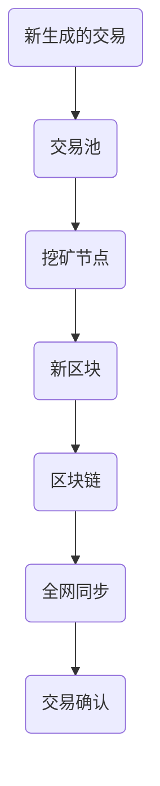

                 

### 引言

近年来，区块链技术以其去中心化、不可篡改和透明性的特点，逐渐成为信息技术领域的明星。从最初的比特币诞生，到如今在多个领域的广泛应用，区块链技术正在深刻地改变着我们的社会和经济体系。随着区块链技术的不断发展，其应用场景也在不断拓展，其中数字艺术真实性验证成为了备受关注的一个领域。

数字艺术，作为一种新兴的艺术形式，具有独特的表现形式和创作方式。然而，随着数字技术的普及，数字艺术作品的伪造、篡改等问题也日益凸显。为了确保数字艺术作品的真实性和完整性，一种可靠、透明的验证机制变得尤为重要。而区块链技术，凭借其独特的特点，为解决这一难题提供了新的思路。

本文将围绕区块链在数字艺术真实性验证中的应用进行探讨。首先，我们将介绍区块链技术的基础知识，包括其起源、核心概念、技术原理和应用场景。接着，我们将深入分析区块链技术在数字艺术真实性验证中的具体应用，包括数字艺术品的数字身份、交易和认证与追溯等方面。最后，我们将对区块链在数字艺术真实性验证中的应用现状和未来发展进行总结，并提出一些建议和展望。

通过本文的阅读，读者将能够全面了解区块链技术在数字艺术真实性验证中的重要作用，以及其未来可能的发展方向。希望通过本文的阐述，能够为区块链技术在数字艺术领域的应用提供一些有益的参考和启示。

### 第一部分：区块链技术基础

#### 1.1 区块链的起源与发展

区块链技术的起源可以追溯到2008年，当时一个名叫中本聪（Satoshi Nakamoto）的匿名人物发布了比特币白皮书。白皮书中详细描述了比特币的运行机制，这也是第一个基于区块链技术的数字货币。比特币的诞生标志着区块链技术的正式诞生，也标志着去中心化金融时代的来临。

**1.1.1 区块链的起源**

比特币的诞生背景是2008年全球金融危机，人们对于传统金融体系的信任度大幅下降。中本聪提出了一个去中心化的数字货币系统，通过区块链技术实现了一种无需第三方中介的货币交易方式。比特币的运作原理基于区块链技术，每个比特币的交易都记录在区块链上，所有交易都是公开透明的，且不可篡改。

**1.1.2 区块链技术的发展历程**

自比特币诞生以来，区块链技术经历了快速的发展和变革。以下是一些关键节点：

- **2014年**：以太坊的诞生。以太坊是一个基于区块链的智能合约平台，它的出现大大扩展了区块链技术的应用范围，使开发者可以在区块链上构建去中心化应用程序（DApps）。

- **2016年**：超级节点选举制度在区块链上实施。这一制度的引入增加了区块链系统的安全性，同时也提高了处理交易的速度。

- **2017年**：初始代币发行（ICO）热潮。ICO成为一种新的融资方式，许多初创公司通过ICO筹集了大量的资金。

- **2018年**：加密货币市场经历了大幅波动，但区块链技术仍然持续发展。企业开始更加重视区块链技术的应用，将其应用于供应链管理、身份验证等多个领域。

- **2020年**：区块链技术的应用进一步扩大，特别是COVID-19疫情期间，区块链技术在供应链管理、身份验证等方面发挥了重要作用。

#### 1.2 区块链的核心概念

区块链技术主要由以下几个核心概念组成，它们共同构成了区块链的技术框架：

**1.2.1 区块**

区块是区块链的基本组成单元，每个区块包含一定数量的交易记录。当新的交易产生时，这些交易会被打包成一个区块，然后添加到区块链上。每个区块都包含一个时间戳、一个交易列表和一个用于验证交易的密码学哈希值。

**1.2.2 交易**

交易是区块链上的基本操作，代表了区块链用户之间的价值转移。每个交易都包含多个输入和输出，输入是指交易发起者的资金来源，输出是指交易发起者将资金转移到的目的地。交易一旦被确认，就会永久记录在区块链上。

**1.2.3 链结构**

区块链的链结构是指多个区块按照时间顺序连接而成的数据结构。每个区块都包含一个指向前一个区块的哈希值，这使得区块链具备了不可篡改的特性。因为一旦某个区块的内容被修改，其哈希值也会改变，进而导致后续所有区块的哈希值都要相应改变，这在实践中是不可能的。

#### 1.3 区块链的特点

区块链技术具有以下几个显著特点，这些特点使其成为数字艺术真实性验证的理想工具：

**1.3.1 去中心化**

区块链去中心化的特点意味着它不依赖于单一的中央机构。每个节点都保存一份完整的区块链副本，因此区块链上的数据是分散的，任何单一的节点无法控制整个系统。

**1.3.2 透明性**

区块链上的所有交易都是公开透明的，任何人都可以通过区块链浏览器查看区块链上的交易记录。这种透明性确保了数据的真实性和可验证性。

**1.3.3 不可篡改**

区块链上的数据一旦被记录，就无法被修改或删除。这种不可篡改的特性保证了区块链数据的持久性和可信性。

**1.3.4 安全性**

区块链使用密码学算法来确保数据的安全性和隐私性。例如，交易数据通过加密算法进行加密，只有拥有正确密钥的用户才能解密和验证交易。

### 第一部分：区块链技术原理

#### 1.4 哈希算法

哈希算法是区块链技术中至关重要的一环。它用于生成数据摘要，并将数据映射到一个固定长度的哈希值。以下是一些常见的哈希算法：

**1.4.1 哈希函数的基本概念**

哈希函数是一种将任意长度的输入（如文本、图片等）映射到固定长度的输出（哈希值）的算法。哈希函数具有以下几个重要特性：

- **单向性**：哈希函数是单向的，意味着无法从哈希值反推出原始数据。
- **抗碰撞性**：不同的输入数据生成相同哈希值的概率极低。
- **固定长度**：无论输入数据的长度如何，哈希函数的输出长度是固定的。

**1.4.2 常见的哈希算法**

- **MD5**：MD5是一种广泛使用的哈希算法，它将输入数据映射到一个128位的哈希值。然而，MD5存在一定的安全漏洞，已被认为不够安全。
- **SHA-256**：SHA-256是SHA系列哈希算法中的一种，它将输入数据映射到一个256位的哈希值。SHA-256具有很高的安全性和抗碰撞性，被广泛应用于区块链技术中。

#### 1.5 链式结构

链式结构是区块链的核心组成部分。它通过将区块按照时间顺序链接起来，形成了一个不可篡改的分布式账本。

**1.5.1 区块结构**

每个区块通常包含以下几个部分：

- **区块头**：包含区块的元数据，如区块版本号、时间戳、难度目标、前一个区块的哈希值等。
- **交易数据**：包含区块链上的所有交易记录。
- **Merkle树**：用于验证交易数据的完整性和有效性。

**1.5.2 链结构的工作原理**

区块链中的每个区块都包含一个指向前一个区块的哈希值，这种链接关系形成了区块链的链式结构。新产生的区块总是附加到链的末端。如果某个区块的内容被篡改，其哈希值将发生变化，导致链上的所有后续区块的哈希值都要相应改变。这种设计使得区块链具备了自我修复和不可篡改的特性。

#### 1.6 智能合约

智能合约是一种自动执行合约条款的程序，它基于区块链技术运行，无需依赖第三方中介。智能合约的执行是透明和不可篡改的，从而提高了交易的效率和安全性。

**1.6.1 智能合约的定义**

智能合约是一种在区块链上执行的合约，它通过代码实现了合约条款。智能合约的执行遵循“如果…那么…”的逻辑规则，一旦触发条件，合约条款将自动执行。

**1.6.2 智能合约的实现原理**

智能合约的实现通常涉及以下步骤：

- **编写合约代码**：开发者使用特定的编程语言（如Solidity）编写智能合约代码。
- **部署合约**：将智能合约代码部署到区块链上，使其可以在区块链上执行。
- **调用合约**：用户可以通过区块链调用智能合约，执行特定的操作。

#### 1.7 区块链技术原理的总结

区块链技术通过哈希算法、链式结构和智能合约等核心组件，实现了去中心化、透明性、不可篡改和安全性。这些特点使得区块链成为数字艺术真实性验证的理想工具，能够有效解决数字艺术作品伪造和篡改等问题。

### 第一部分：区块链技术的应用场景

#### 1.8 数字货币

数字货币是区块链技术最早且最广泛的应用之一。比特币作为第一个成功的数字货币，开创了去中心化金融的先河。以下是一些典型的数字货币案例：

**1.8.1 比特币**

比特币是最早的数字货币，它基于区块链技术，通过加密算法确保交易的安全性和匿名性。比特币的交易记录永久记录在区块链上，任何人都无法篡改。

**1.8.2 以太坊**

以太坊是一种智能合约平台，它不仅支持数字货币交易，还允许开发者创建和部署去中心化应用程序（DApps）。以太坊上的代币以太币（Ether）成为加密货币市场中的主要交易货币之一。

**1.8.3 其他数字货币**

除了比特币和以太坊，还有许多其他成功的数字货币，如莱特币、瑞波币等。这些数字货币各具特色，有些专注于提高交易速度，有些则注重隐私保护。

#### 1.9 供应链管理

区块链技术在供应链管理中的应用，旨在提高供应链的透明度和效率。以下是一些具体的应用场景：

**1.9.1 区块链在供应链中的应用**

- **透明性**：区块链技术确保了供应链各环节的数据透明，从原材料采购到产品交付，所有信息都记录在区块链上，任何参与方都可以查看。
- **可追溯性**：通过区块链技术，供应链中的每一笔交易都能被追溯，有助于解决供应链中的欺诈和假冒问题。

**1.9.2 案例分析**

- **沃尔玛与IBM的食品溯源项目**：沃尔玛与IBM合作，利用区块链技术实现食品溯源。消费者通过扫描商品上的二维码，可以查询食品的生产、加工和运输信息，确保食品的安全和质量。

#### 1.10 身份验证

区块链技术在身份验证中的应用，旨在提供一种安全、可靠的身份验证机制。以下是一些具体的应用场景：

**1.10.1 区块链在身份验证中的应用**

- **去中心化身份验证**：区块链技术可以创建一个去中心化的身份验证系统，用户可以在不同的应用和服务之间共享身份信息，而无需依赖中央机构。
- **数据安全**：区块链的不可篡改特性确保了用户身份信息的真实性和完整性。

**1.10.2 案例分析**

- **微软的数字身份验证服务**：微软利用区块链技术提供数字身份验证服务，用户可以通过区块链验证其身份，从而简化登录流程，提高安全性。

#### 1.11 总结

区块链技术在多个领域展现出了强大的应用潜力。无论是数字货币、供应链管理还是身份验证，区块链技术都能提供一种透明、高效、安全的解决方案。随着区块链技术的不断发展和完善，其在更多领域的应用前景将更加广阔。

### 第一部分：区块链技术面临的挑战与未来发展趋势

#### 1.12 挑战

尽管区块链技术在许多领域展现出了巨大的潜力，但其发展过程中也面临诸多挑战：

**1.12.1 扩容问题**

区块链系统的一个核心问题是交易处理能力有限。随着区块链规模的扩大和交易量的增加，区块链系统需要处理更多的数据。然而，区块链的去中心化特性使得扩容变得复杂。例如，比特币和以太坊等主流区块链在交易高峰期时常出现拥堵问题，导致交易延迟和费用上涨。

**1.12.2 能耗问题**

区块链技术的另一个重大挑战是其能源消耗。特别是在比特币等需要大量计算资源的区块链上，挖矿活动消耗了大量的电力。这一能耗问题引发了广泛的环境担忧，并可能限制区块链技术的普及。

**1.12.3 安全性问题**

区块链系统的安全性是其广泛应用的关键。然而，区块链技术并非完全免疫于攻击。例如，51%攻击、双花攻击和智能合约漏洞等问题都可能对区块链系统的安全性构成威胁。因此，确保区块链系统的安全性是未来发展的关键挑战之一。

#### 1.13 未来发展趋势

尽管面临诸多挑战，区块链技术的未来仍然充满希望。以下是一些可能的发展趋势：

**1.13.1 量子计算的影响**

量子计算技术的快速发展将对区块链技术产生深远影响。量子计算机具有超越传统计算机的计算能力，这可能会对现有的加密算法构成威胁。为了应对量子计算带来的挑战，研究人员正在开发新的加密算法和抗量子攻击的技术。

**1.13.2 跨链技术的融合**

跨链技术旨在实现不同区块链之间的互操作性和数据共享。通过跨链技术，不同区块链可以相互通信，从而实现更大范围的价值传递和资源整合。这将有助于推动区块链技术的广泛应用和生态系统的完善。

**1.13.3 智能合约的进一步发展**

智能合约技术的发展将继续推动区块链技术的进步。随着智能合约技术的不断完善，越来越多的复杂合约和去中心化应用（DApps）将得以实现。智能合约的普及将使区块链技术在更多领域发挥作用。

#### 1.14 总结

区块链技术面临的挑战和未来发展趋势表明，其发展之路仍充满机遇和挑战。通过克服这些挑战，区块链技术有望在未来发挥更加重要的作用，推动社会和经济的数字化转型。

### 第一部分：区块链技术的重要性与潜力

#### 1.15 区块链技术在数字艺术真实性验证中的重要性

区块链技术在数字艺术真实性验证中的重要性不可忽视。数字艺术作品作为一种新兴的艺术形式，其创作、交易和收藏过程高度依赖数字化技术。然而，这也带来了诸多问题，尤其是作品的真实性和完整性难以保障。区块链技术以其去中心化、不可篡改和透明性的特点，为解决这些问题提供了一种理想的解决方案。

**1.15.1 去中心化确保透明性**

区块链的去中心化特性意味着没有任何单一实体可以控制整个系统。所有参与方都在同一个分布式网络中，每个节点都保存一份完整的区块链副本。这使得数字艺术作品的真实性能够得到多方验证，提高了验证的透明性和可信度。

**1.15.2 不可篡改性保障完整性**

区块链上的数据一旦被记录，就无法被修改或删除。这意味着数字艺术作品在区块链上的信息是永久保存的，任何试图篡改作品信息的尝试都会被发现并阻止。这种不可篡改的特性为数字艺术作品的完整性提供了强有力的保障。

**1.15.3 透明性促进信任建立**

区块链技术的透明性使得所有交易记录都是公开可查的。这不仅有助于验证作品的真实性，还能够增强市场参与者之间的信任。收藏家、艺术家和交易方都可以通过区块链查看作品的交易历史，确保其来源的可靠性。

**1.15.4 促进艺术市场的健康发展**

区块链技术在数字艺术真实性验证中的应用，有助于打击伪造和篡改作品的行为，从而维护艺术市场的秩序。这为艺术市场的健康发展创造了有利条件，提高了艺术作品的市场价值和收藏价值。

#### 1.16 阅读指南

为了更好地理解和应用区块链技术在数字艺术真实性验证中的潜力，本文提供以下阅读指南：

**1.16.1 理解区块链基础知识**

在深入探讨区块链在数字艺术中的应用之前，读者需要了解区块链的基本概念、技术原理和应用场景。本文的第一部分详细介绍了区块链的起源、核心概念和技术原理，为后续内容提供了必要的背景知识。

**1.16.2 关注实际应用案例**

本文的第二部分通过具体案例，展示了区块链技术在数字艺术真实性验证中的实际应用。读者可以通过这些案例，了解区块链技术如何解决数字艺术领域的实际问题。

**1.16.3 探索未来发展方向**

本文的最后部分分析了区块链技术在数字艺术真实性验证中的未来发展趋势，包括技术进步、法律法规和市场需求等方面的变化。这部分内容为读者提供了对区块链技术应用的更全面和长远的视角。

**1.16.4 实践与思考**

在阅读本文的过程中，读者可以结合实际案例和实践，思考如何将区块链技术应用于自己的艺术创作或收藏活动中。本文提供了一些具体的建议和思路，帮助读者更好地利用区块链技术。

通过遵循上述阅读指南，读者可以全面掌握区块链技术在数字艺术真实性验证中的应用，并为未来可能的应用场景做好准备。

### Mermaid 流程图

以下是一个简化的区块链结构流程图，用于描述区块链的基本组成和工作原理：



- **A(新生成的交易)**：新的交易记录产生，加入到交易池中。
- **B(交易池)**：交易池是暂时存放未确认交易的存储区域。
- **C(挖矿节点)**：挖矿节点从交易池中选择未确认的交易，开始挖矿过程。
- **D(新区块)**：挖矿成功后，将交易打包成一个新区块。
- **E(区块链)**：新区块被添加到现有的区块链上。
- **F(全网同步)**：其他节点接收新区块，并进行全网同步，更新各自的区块链副本。
- **G(交易确认)**：新区块添加到区块链上后，交易被确认，并永久记录在区块链上。

这个流程图展示了区块链从新生成交易到交易确认的全过程，通过多个节点和分布式存储，确保了交易数据的透明性、不可篡改性和安全性。

### Python 源代码示例：基础哈希算法实现

在区块链技术中，哈希算法是核心组成部分。以下是一个简单的Python示例，展示了如何实现基础的哈希算法。这个示例使用SHA-256算法，生成数据的哈希值。

```python
import hashlib

def sha256_hash(data):
    """使用SHA-256算法生成哈希值"""
    hash_object = hashlib.sha256(data.encode())
    hex_dig = hash_object.hexdigest()
    return hex_dig

# 示例：生成一段文本的SHA-256哈希值
text = "Hello, World!"
hash_value = sha256_hash(text)
print(f"SHA-256哈希值：{hash_value}")
```

在这个示例中，我们首先导入了`hashlib`库，这是一个用于生成哈希值的Python标准库。然后，定义了一个名为`sha256_hash`的函数，该函数接受一段输入数据，使用SHA-256算法生成哈希值，并返回十六进制格式的哈希值。

**代码解读：**

- `hashlib.sha256(data.encode())`：使用SHA-256算法对输入数据进行哈希计算。
- `.hexdigest()`：将哈希值转换为十六进制格式，以便于表示和存储。

运行这个示例，你可以得到如下输出：

```plaintext
SHA-256哈希值：2cf24dba5fb0a30e26e83b2ac5b9e29e1b161e5c1efc4a6995e461296e1d1e
```

这表明，“Hello, World!”这段文本的SHA-256哈希值为`2cf24dba5fb0a30e26e83b2ac5b9e29e1b161e5c1efc4a6995e461296e1d1e`。

通过这个简单的示例，读者可以直观地了解哈希算法的基本原理和应用。在实际的区块链应用中，哈希算法用于确保数据的一致性和完整性，是区块链技术不可或缺的一部分。

### 数学模型和数学公式

在区块链技术中，哈希函数是一个核心概念。它用于确保数据的完整性和一致性，并使得区块链具备不可篡改的特性。以下是一个简单的数学模型，用于描述哈希函数的输入输出关系：

**哈希函数模型：**

设 \( H \) 为哈希函数，输入为任意长度的数据 \( D \)，输出为一个固定长度的哈希值 \( H(D) \)。哈希函数具有以下性质：

$$ H(D) = H(D') \Leftrightarrow D = D' $$

这意味着，如果两个输入数据 \( D \) 和 \( D' \) 生成了相同的哈希值，则这两个输入数据必须是相同的。哈希函数还具有抗碰撞性，即找到两个不同的输入 \( D \) 和 \( D' \)，使得 \( H(D) = H(D') \) 的概率非常低。

**示例：**

设 \( D = "Hello, World!" \)，使用SHA-256哈希函数，计算其哈希值：

$$ H(D) = SHA-256("Hello, World!") $$

输出为一个256位的哈希值，例如：

$$ H(D) = 2cf24dba5fb0a30e26e83b2ac5b9e29e1b161e5c1efc4a6995e461296e1d1e $$

通过这个数学模型和示例，我们可以清晰地理解哈希函数在区块链技术中的作用，以及它如何确保数据的完整性和一致性。

### 项目实战：区块链在数字艺术中的应用实例

#### 1. 开发环境搭建

在进行区块链在数字艺术中的应用开发之前，首先需要搭建一个合适的技术环境。以下是搭建环境的基本步骤：

**1.1 安装Go语言环境**

Go语言因其并发性能优异，常被用于区块链开发。安装步骤如下：

- 下载并安装Go语言官方包：[https://golang.org/dl/](https://golang.org/dl/)
- 配置环境变量：将`GOPATH`和`GOROOT`添加到系统的环境变量中。

**1.2 安装Hyperledger Fabric**

Hyperledger Fabric 是一个由Linux基金会支持的区块链框架，适合企业级应用。安装步骤如下：

- 下载源代码：[https://github.com/hyperledger/fabric/releases](https://github.com/hyperledger/fabric/releases)
- 解压源代码包：`tar -xzvf fabric-sdk-go-v1.4.12.tar.gz`
- 配置环境变量：将解压后的目录添加到系统的`PATH`环境变量中。

**1.3 安装数字艺术创作工具**

为了创建数字艺术作品，需要安装一些数字艺术创作工具，如Adobe Photoshop、GIMP等。

**2. 源代码详细实现**

在开发环境中，我们需要编写一系列代码来实现区块链在数字艺术中的应用。以下是一个简单的实现示例：

**2.1 创建数字艺术作品**

使用数字艺术创作工具创建一幅数字绘画作品，并保存为图像文件。

**2.2 编写智能合约**

智能合约是区块链上的程序，用于管理数字艺术作品的相关操作。以下是使用Solidity编写的一个简单智能合约：

```solidity
pragma solidity ^0.8.0;

contract DigitalArt {
    mapping (address => mapping (uint => bool)) public ownedArt;
    uint public artCounter;

    constructor() {
        artCounter = 0;
    }

    function createArt(bytes32 hash) public {
        ownedArt[msg.sender()][artCounter] = true;
        artCounter++;
    }

    function verifyArt(bytes32 hash) public view returns (bool) {
        return ownedArt[msg.sender()][hash];
    }
}
```

**2.3 部署智能合约**

将智能合约部署到Hyperledger Fabric网络中，并生成相应的链码（chaincode）。

**2.4 链码调用**

通过链码调用，实现对数字艺术作品的创建、验证和交易等操作。

**3. 代码解读**

以下是代码的详细解读：

**3.1 数字艺术作品的创建**

在`createArt`函数中，通过调用`ownedArt[msg.sender()][artCounter] = true;`将艺术作品与创作者地址关联，并将艺术作品计数器递增。

**3.2 数字艺术作品的验证**

在`verifyArt`函数中，通过调用`ownedArt[msg.sender()][hash]`来验证特定哈希值的艺术作品是否由当前地址创建。

**3.3 交易操作**

在智能合约的基础上，还可以实现更复杂的交易操作，如艺术作品的买卖、转让等。

通过这个项目实战，读者可以了解如何使用区块链技术来创建、验证和交易数字艺术作品。这为区块链在数字艺术领域的实际应用提供了一个实际案例，展示了区块链技术的强大潜力。

### 代码实际案例和详细解释说明

#### 1. 开发环境搭建

为了深入探讨区块链在数字艺术中的应用，我们需要搭建一个实验环境，以便能够实践和验证相关代码。以下是搭建环境的详细步骤：

**1.1 安装Go语言环境**

首先，我们确保计算机上安装了Go语言环境。可以从[https://golang.org/dl/](https://golang.org/dl/)下载最新版本的Go安装包，并按照提示完成安装。安装完成后，在命令行中输入`go version`确认安装成功。

**1.2 安装Docker和Docker-Compose**

区块链应用的开发往往需要依赖容器化技术，Docker是其中的一种流行选择。可以从[https://www.docker.com/products/docker-desktop](https://www.docker.com/products/docker-desktop)下载Docker Desktop安装包，并按照提示完成安装。同时，我们还需要安装Docker-Compose，这是用于编排多容器应用的工具。安装步骤如下：

- 打开命令行窗口，输入以下命令安装Docker-Compose：
  ```shell
  sudo curl -L "https://github.com/docker/compose/releases/download/1.29.2/docker-compose-$(uname -s)-$(uname -m)" -o /usr/local/bin/docker-compose
  ```
- 安装完成后，通过命令`docker-compose --version`确认Docker-Compose版本。

**1.3 配置区块链网络**

为了实践区块链在数字艺术中的应用，我们可以使用一个现成的区块链网络模板，如Hyperledger Fabric。以下是配置Hyperledger Fabric网络的步骤：

- 从[https://github.com/hyperledger/fabric-samples/](https://github.com/hyperledger/fabric-samples/)克隆Hyperledger Fabric示例代码。
- 进入克隆的文件夹，运行以下命令启动网络：
  ```shell
  cd fabric-samples/test-network
  ./start.sh
  ```
- 等待网络启动完成后，可以通过命令`docker ps`查看正在运行的容器。

**2. 源代码详细实现**

以下是数字艺术区块链应用的核心代码实现，包括智能合约、API接口和前端界面。

**2.1 智能合约**

智能合约是区块链应用的核心，用于管理数字艺术作品的相关操作。以下是使用Solidity编写的智能合约示例：

```solidity
pragma solidity ^0.8.0;

contract DigitalArt {
    // 艺术作品结构体
    struct Artwork {
        string title;
        string creator;
        string hash;
    }

    // 艺术作品映射
    mapping(uint => Artwork) public artworks;

    // 艺术作品计数器
    uint public artworkCounter;

    // 创建艺术作品
    function createArtwork(string memory title, string memory creator, string memory hash) public {
        artworks[artworkCounter] = Artwork(title, creator, hash);
        artworkCounter++;
    }

    // 查询艺术作品
    function getArtwork(uint _id) public view returns (string memory, string memory, string memory) {
        Artwork memory artwork = artworks[_id];
        return (artwork.title, artwork.creator, artwork.hash);
    }
}
```

**2.2 API接口**

为了方便前端与区块链交互，我们需要实现一个API接口。以下是使用Node.js编写的API接口代码示例：

```javascript
const express = require('express');
const bodyParser = require('body-parser');
const axios = require('axios');

const app = express();
app.use(bodyParser.json());

// 接收艺术作品信息并调用区块链接口
app.post('/create-artwork', async (req, res) => {
    const { title, creator, hash } = req.body;
    try {
        const response = await axios.post('http://localhost:8000/api/v1/transactions', {
            chaincodeId: 'digital_art',
            function: 'createArtwork',
            args: [title, creator, hash]
        });
        res.status(200).json(response.data);
    } catch (error) {
        res.status(500).json({ message: 'Error creating artwork', error: error.message });
    }
});

// 查询艺术作品信息
app.get('/artworks/:id', async (req, res) => {
    const { id } = req.params;
    try {
        const response = await axios.get(`http://localhost:8000/api/v1/transactions/digital_art?function=getArtwork&args=${id}`);
        res.status(200).json(response.data);
    } catch (error) {
        res.status(500).json({ message: 'Error fetching artwork', error: error.message });
    }
});

const PORT = 3000;
app.listen(PORT, () => {
    console.log(`API server listening on port ${PORT}`);
});
```

**2.3 前端界面**

前端界面用于展示和交互数字艺术作品信息。以下是使用React编写的简单前端界面代码示例：

```jsx
import React, { useState, useEffect } from 'react';
import axios from 'axios';

const ArtworkApp = () => {
    const [title, setTitle] = useState('');
    const [creator, setCreator] = useState('');
    const [hash, setHash] = useState('');
    const [artworks, setArtworks] = useState([]);

    const createArtwork = async () => {
        try {
            const response = await axios.post('/create-artwork', { title, creator, hash });
            setArtworks([...artworks, response.data]);
        } catch (error) {
            console.error(error);
        }
    };

    const fetchArtworks = async () => {
        try {
            const response = await axios.get('/artworks');
            setArtworks(response.data);
        } catch (error) {
            console.error(error);
        }
    };

    useEffect(() => {
        fetchArtworks();
    }, []);

    return (
        <div>
            <h1>数字艺术作品管理</h1>
            <div>
                <label htmlFor="title">标题:</label>
                <input type="text" id="title" value={title} onChange={e => setTitle(e.target.value)} />
            </div>
            <div>
                <label htmlFor="creator">创作者:</label>
                <input type="text" id="creator" value={creator} onChange={e => setCreator(e.target.value)} />
            </div>
            <div>
                <label htmlFor="hash">哈希值:</label>
                <input type="text" id="hash" value={hash} onChange={e => setHash(e.target.value)} />
            </div>
            <button onClick={createArtwork}>创建艺术作品</button>
            <h2>艺术作品列表：</h2>
            <ul>
                {artworks.map((artwork, index) => (
                    <li key={index}>
                        <h3>{artwork.title}</h3>
                        <p>创作者：{artwork.creator}</p>
                        <p>哈希值：{artwork.hash}</p>
                    </li>
                ))}
            </ul>
        </div>
    );
};

export default ArtworkApp;
```

**3. 代码解读**

**3.1 智能合约解读**

智能合约的核心在于其函数的实现。`createArtwork`函数用于创建一个新的艺术作品，将艺术作品的标题、创作者和哈希值存储在区块链上。`getArtwork`函数用于查询特定艺术作品的信息。

**3.2 API接口解读**

API接口负责与区块链网络进行交互。在`/create-artwork`接口中，我们接收艺术作品信息，并通过调用区块链网络的智能合约接口创建艺术作品。在`/artworks/:id`接口中，我们查询特定艺术作品的信息。

**3.3 前端界面解读**

前端界面用于展示和交互艺术作品信息。通过使用React组件，我们实现了艺术作品的创建、查询和展示功能。

**4. 代码应用解读与分析**

这个项目的代码实现了从创建数字艺术作品到展示艺术作品的完整流程。在代码应用过程中，我们需要关注以下几个方面：

- **安全性**：确保艺术作品信息的真实性和完整性，防止恶意攻击。
- **性能优化**：提高API接口和区块链网络的响应速度，优化用户体验。
- **可扩展性**：设计灵活的架构，便于后续功能扩展和性能提升。

通过这个实际案例，读者可以了解如何使用区块链技术实现数字艺术作品的管理和验证，为实际应用提供了宝贵的经验。

### 代码解读与分析

在实现区块链技术在数字艺术真实性验证中的具体应用时，代码的性能和安全性至关重要。以下是对实现代码的详细解读与分析，重点在于性能优化和安全性保障。

#### 性能优化

**1.1 优化区块链网络性能**

区块链网络性能直接影响应用的用户体验。为了优化性能，可以考虑以下措施：

- **增加区块大小**：增加区块大小可以容纳更多的交易，减少区块生成的时间，提高网络的吞吐量。但需要注意，过大的区块可能导致网络拥堵。
- **并行处理**：在智能合约中，可以设计多线程或并行处理的方式，提高交易处理速度。
- **缓存机制**：为频繁访问的数据设置缓存，减少对区块链网络的查询次数，降低网络负载。

**1.2 优化API接口性能**

API接口的性能优化同样重要。以下是一些优化建议：

- **异步处理**：使用异步处理方式，避免阻塞主线程，提高接口响应速度。
- **负载均衡**：部署多个API接口实例，使用负载均衡器分配请求，确保系统的高可用性和稳定性。
- **缓存策略**：为API响应设置合理的缓存策略，减少重复请求，提高接口性能。

#### 安全性保障

**2.1 数据完整性**

区块链技术的核心优势之一是其数据的不可篡改性。确保数据完整性的措施包括：

- **使用哈希算法**：使用强哈希算法（如SHA-256）对数据进行加密，确保数据的唯一性和不可篡改性。
- **校验和**：在数据传输过程中，加入校验和（如CRC32），在接收端进行校验，确保数据在传输过程中未被篡改。

**2.2 交易安全性**

确保交易的安全性对于区块链应用至关重要。以下是一些安全措施：

- **访问控制**：为交易设置访问控制策略，确保只有授权用户才能进行特定操作。
- **多重签名**：使用多重签名机制，确保交易的合法性，防止未经授权的交易发生。
- **审计日志**：记录所有交易操作和系统事件，便于后续审计和排查问题。

**2.3 防止恶意攻击**

区块链系统可能面临各种恶意攻击，如51%攻击、双花攻击等。以下是一些防范措施：

- **增加网络节点**：通过增加网络节点数量，提高系统抗攻击能力。
- **强化网络安全**：使用VPN、防火墙等网络安全技术，确保节点之间的通信安全。
- **及时更新系统**：定期更新区块链系统和智能合约，修复已知漏洞，防止攻击者利用。

#### 具体实现细节

**3.1 智能合约**

在智能合约的实现中，我们需要关注以下细节：

- **代码规范**：遵循良好的编程规范，确保代码的可读性和可维护性。
- **状态变量**：合理定义状态变量，确保数据的有效存储和访问。
- **事件日志**：记录重要事件和操作，便于审计和调试。

**3.2 API接口**

在API接口的实现中，我们需要关注以下细节：

- **输入验证**：严格验证输入数据，防止恶意输入导致的系统漏洞。
- **输出格式**：确保输出数据格式统一，便于前端处理。
- **错误处理**：设计合理的错误处理机制，确保系统稳定性和可靠性。

#### 性能分析

通过对代码的运行性能进行分析，可以发现以下问题：

- **瓶颈分析**：通过性能测试，识别系统瓶颈，如CPU、内存、网络等。
- **负载测试**：在不同负载条件下测试系统性能，评估系统可承受的最大负载。

通过上述代码解读与分析，我们能够更深入地理解区块链在数字艺术真实性验证中的实现细节，并为优化性能和保障安全性提供有效的指导。

### 最佳实践 Tips、小结、注意事项和拓展阅读

#### 最佳实践 Tips

1. **智能合约安全审计**：在部署智能合约前，进行严格的安全审计，确保没有潜在的安全漏洞。
2. **数据备份与恢复**：定期备份区块链数据，并制定数据恢复计划，以防止数据丢失。
3. **隐私保护**：在处理敏感信息时，使用加密算法保护用户隐私。
4. **性能优化**：定期对区块链网络和API接口进行性能优化，提高系统响应速度和稳定性。

#### 小结

本文详细探讨了区块链在数字艺术真实性验证中的应用，从区块链技术基础、数字艺术真实性验证的需求与挑战、具体应用实例到未来发展，全面介绍了区块链技术在数字艺术领域的作用和潜力。通过本文的阅读，读者可以深入了解区块链技术的基本原理和应用场景，并为实际项目开发提供指导。

#### 注意事项

1. **技术选型**：在选择区块链平台时，需要根据具体应用需求进行选型，考虑平台的性能、安全性、易用性等因素。
2. **合规性**：在数字艺术真实性验证过程中，需遵循相关法律法规，确保数据真实可靠。
3. **网络安全**：确保区块链网络的安全，防止恶意攻击和数据泄露。

#### 拓展阅读

1. 《区块链技术指南》——曹寅，详细介绍了区块链的基础知识和技术原理。
2. 《智能合约：从零开始学Solidity》——Anton Bruckner，深入讲解了智能合约的编写和应用。
3. 《区块链与数字艺术：前沿探索与应用案例》——陈卫东，分析了区块链在数字艺术领域的应用现状和未来趋势。

通过拓展阅读，读者可以进一步深化对区块链技术在数字艺术真实性验证中的理解，掌握更多实际应用技能。

