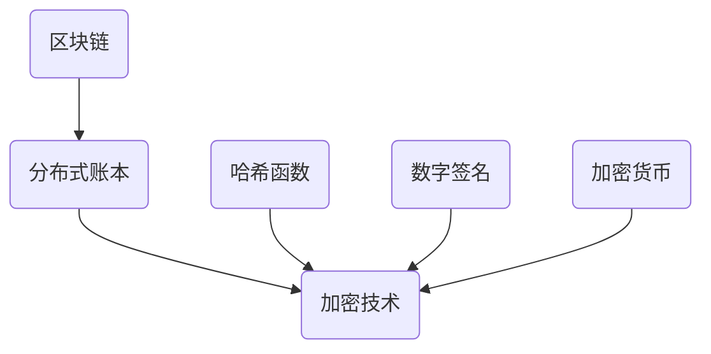

                 

### 引言

区块链技术在近年来迅速崛起，成为金融科技领域的一大热点。随着比特币等数字资产的兴起，区块链技术在数字资产流通中的重要性愈发凸显。然而，区块链的真正魅力不仅在于其技术上的创新，更在于其带来的信任机制变革。

在传统的金融系统中，信任通常依赖于第三方机构如银行或清算所。这种中心化的模式虽然稳定，但在交易速度、透明度和成本方面存在显著限制。而区块链技术则通过其去中心化和不可篡改的特性，为数字资产流通提供了一种全新的信任机制。这种机制不仅解决了传统金融系统的痛点，也为数字资产市场的发展注入了新的活力。

本文将深入探讨区块链在数字资产流通中的信任机制。首先，我们将介绍区块链技术的基础，包括其基本概念、工作原理和关键技术。接着，我们将分析数字资产与区块链的融合，并探讨区块链在数字资产流通中的应用。随后，我们将重点讨论信任机制的构建，包括其基本原理和区块链在这一领域的实际应用。此外，我们还将探讨区块链在数字资产流通中的安全性和隐私保护问题。最后，通过具体项目案例和实践，我们将进一步验证区块链信任机制的有效性。

通过本文的阅读，读者将能够全面了解区块链在数字资产流通中的信任机制，掌握其核心概念和实际应用，为未来区块链技术的发展提供有益的参考。

### 关键词

- 区块链
- 数字资产
- 信任机制
- 去中心化
- 智能合约
- 共识算法
- 加密技术
- 透明性
- 安全性
- 隐私保护

### 摘要

本文旨在深入探讨区块链技术在数字资产流通中的信任机制。首先，介绍了区块链技术的基础知识，包括其基本概念、工作原理和关键技术。接着，分析了数字资产与区块链的融合，以及区块链在数字资产流通中的应用。本文重点讨论了信任机制的构建，包括其基本原理和区块链在这一领域的实际应用。此外，我们还探讨了区块链在数字资产流通中的安全性和隐私保护问题。最后，通过具体项目案例和实践，验证了区块链信任机制的有效性。本文旨在为区块链在数字资产流通中的研究和应用提供全面的理论和实践指导。

### 目录

1. 引言
2. 区块链技术基础
   2.1 区块链的基本概念
   2.2 区块链的工作原理
   2.3 区块链的关键技术
3. 数字资产与区块链
   3.1 数字资产的定义
   3.2 数字资产与区块链的融合
4. 区块链在数字资产流通中的应用
   4.1 数字资产流通的挑战
   4.2 区块链在数字资产流通中的应用
5. 信任机制的构建
   5.1 信任机制的基本原理
   5.2 区块链在信任机制构建中的应用
6. 安全性与隐私保护
   6.1 区块链的安全性
   6.2 区块链的隐私保护
7. 项目案例与实践
   7.1 数字资产交易平台案例
   7.2 加密资产管理项目案例
8. 总结与展望
9. 最佳实践 tips、小结、注意事项、拓展阅读

### 设计目录大纲的步骤

设计一篇高质量的技术博客文章的目录大纲是确保文章逻辑清晰、内容结构完整的关键步骤。以下是一个详细的设计流程，涵盖了从理解书名和目标受众到撰写目录大纲的各个阶段：

1. **阅读书名和目标受众**：
   - 首先，仔细阅读书名《区块链在数字资产流通中的信任机制》。书名明确了文章的核心内容，即探讨区块链在数字资产流通中如何构建信任机制。
   - 分析目标受众，这本书可能是为那些对区块链技术有一定了解，但对数字资产流通中的信任机制缺乏深入认识的读者所写。因此，文章需要既有深度又有广度，既能涵盖基础概念，又能深入探讨应用细节。

2. **确定核心章节内容**：
   - 根据书名，确定核心章节，包括：
     - 引言：介绍区块链技术发展背景和文章主题。
     - 区块链技术基础：讲解区块链的基本概念、工作原理和关键技术。
     - 数字资产与区块链：分析数字资产的定义及其与区块链的融合。
     - 区块链在数字资产流通中的应用：探讨区块链在数字资产流通中的挑战和解决方案。
     - 信任机制的构建：深入探讨区块链在构建信任机制方面的原理和应用。
     - 安全性与隐私保护：分析区块链在数字资产流通中的安全性和隐私保护问题。
     - 项目案例与实践：通过具体案例展示区块链信任机制的实际应用。
     - 总结与展望：总结文章要点，并对未来发展趋势进行展望。

3. **设计1级目录**：
   - 根据核心内容，设计出1级目录，确保每个章节都包含一个核心主题，如上所述。

4. **细化2级目录**：
   - 对每个1级目录的章节进一步细化，设计出2级目录。例如，在“区块链技术基础”章节中，可以细化如下：
     - 2.1.1 区块链的基本概念
     - 2.1.2 区块链的工作原理
     - 2.1.3 区块链的关键技术
   - 细化每个2级目录，确保每个部分都有具体的内容点。

5. **设计3级目录**：
   - 对2级目录的每个章节，进一步设计3级目录，细化到具体的内容点。例如，对于“区块链的基本概念”，可以进一步细化如下：
     - 2.1.1.1 区块链的定义
     - 2.1.1.2 区块链的去中心化特性
     - 2.1.1.3 区块链的数据结构
     - 2.1.1.4 区块链的安全性
   - 确保每个3级目录都有具体、详细的内容，使读者能够清晰地理解每个部分的内容。

6. **添加核心概念与联系、核心算法原理讲解、数学模型和数学公式、项目实战等内容**：
   - 根据书的内容和目标受众，在每个章节中加入相应的核心概念、算法讲解、数学模型、项目实战等内容，确保每个章节都内容丰富、具体详细。
   - 例如，在“区块链技术基础”章节中，可以添加：
     - 核心概念与联系：区块链、分布式账本、加密技术等概念之间的联系。
     - 核心算法原理讲解：包括SHA-256算法、椭圆曲线加密算法等。
     - 数学模型：包括哈希函数、数字签名等。
     - 项目实战：具体区块链应用实例。

7. **撰写目录大纲**：
   - 将所有设计好的目录内容按照markdown格式撰写出来，确保简洁、逻辑清晰。例如：
     ```markdown
     # 《区块链在数字资产流通中的信任机制》目录大纲

     1. 引言
     2. 区块链技术基础
        2.1 区块链的基本概念
        2.1.1 区块链的定义
        2.1.2 区块链的去中心化特性
        2.1.3 区块链的数据结构
        2.1.4 区块链的安全性
        2.2 区块链的工作原理
        2.2.1 区块链的交易流程
        2.2.2 区块链的共识机制
        2.3 区块链的关键技术
        2.3.1 加密技术
        2.3.2 分布式存储技术
        2.3.3 智能合约技术
     3. 数字资产与区块链
        3.1 数字资产的定义
        3.2 数字资产与区块链的融合
        3.2.1 区块链在数字资产管理中的应用
        3.2.2 区块链在数字资产交易中的应用
     ...
     ```

8. **审核与优化**：
   - 审核目录大纲，检查是否符合要求，包括简洁性、完整性、格式等，进行必要的优化。

### 注意事项

- 目录大纲的总字数控制在2000字以内，确保内容的精简性。
- 确保目录大纲的核心章节内容齐全，覆盖核心概念、算法、数学模型和项目实战。
- 使用markdown格式，确保格式规范，内容清晰。

通过遵循以上步骤，你可以设计出一份详细且逻辑清晰的目录大纲，为撰写高质量的技术博客文章打下坚实的基础。

### 区块链技术基础

区块链技术是近年来金融科技领域的一大突破，其核心在于通过去中心化、分布式账本和加密技术，为数字资产流通提供了一种全新的信任机制。本章节将详细探讨区块链的基本概念、工作原理和关键技术，为后续讨论区块链在数字资产流通中的应用打下坚实的基础。

#### 区块链的基本概念

区块链的定义：
区块链（Blockchain）是一种去中心化的分布式数据库技术，由一系列按时间顺序排列、不可篡改的数据块组成。每个数据块包含一定数量的交易记录，通过密码学方法保证数据的安全性和不可篡改性。

去中心化：
区块链的去中心化特性是指其不依赖于单一的中央机构或权威实体来维护数据。相反，区块链通过网络中的多个节点共同维护和验证数据，从而实现了数据的透明性和安全性。

数据结构：
区块链的数据结构主要包括区块和链。每个区块包含一定数量的交易记录、一个时间戳、一个唯一的哈希值和前一个区块的哈希值。这些区块通过哈希值相互链接，形成了一个不可篡改的区块链。

安全性：
区块链通过密码学技术确保数据的安全性和不可篡改性。例如，SHA-256哈希算法用于生成区块的哈希值，确保数据一旦生成，就无法被篡改。此外，区块链的共识算法（如工作量证明、权益证明等）也用于确保数据的合法性和一致性。

#### 区块链的工作原理

交易流程：
在区块链中，交易是由网络中的节点发起和验证的。交易首先由用户发起，然后通过网络传播到其他节点。节点通过共识算法验证交易的合法性和有效性，并将验证通过的交易记录到新的区块中。一旦新区块生成，就会链接到区块链的末端，从而完成交易的确认和记录。

共识机制：
共识机制是区块链中节点之间达成一致的方式。不同类型的区块链采用不同的共识机制。常见的工作量证明（Proof of Work, PoW）机制通过计算复杂性问题确保节点的合法性和安全性。权益证明（Proof of Stake, PoS）机制则通过节点的持币量和历史贡献来决定其权益。

智能合约：
智能合约是一种自动执行合同条款的计算机程序。在区块链上，智能合约可以在满足特定条件时自动执行预定的操作，从而实现去中心化的自动化交易。例如，当两个用户交换数字资产时，智能合约可以自动执行交易并更新双方的钱包余额。

#### 区块链的关键技术

分布式账本技术：
分布式账本技术是区块链的核心技术之一。它通过将数据分散存储在多个节点上，实现了数据的高度可靠性和抗攻击性。每个节点都拥有完整的区块链副本，从而保证了数据的透明性和一致性。

加密技术：
区块链采用多种加密技术来确保数据的安全性和隐私保护。常见的加密技术包括哈希函数、数字签名和加密货币。哈希函数用于生成区块的哈希值，确保数据的完整性和不可篡改性。数字签名用于验证交易的真实性和合法性。加密货币则用于保护用户的隐私，确保交易匿名性。

#### 区块链的基本概念与联系

区块链、分布式账本、加密技术等概念之间存在着紧密的联系。区块链是分布式账本的一种实现形式，它通过加密技术保证了数据的安全性和隐私保护。分布式账本则实现了数据的去中心化存储和管理，增强了系统的可靠性和抗攻击性。加密技术是区块链的基础，用于确保数据的完整性和安全性。

为了更清晰地展示这些概念之间的关系，我们可以使用Mermaid流程图来表示：



在这个流程图中，区块链通过分布式账本技术实现了去中心化的数据存储和管理，同时利用加密技术（如哈希函数、数字签名和加密货币）来保护数据的安全性和隐私。

通过以上对区块链技术基础的详细探讨，读者可以更好地理解区块链的基本概念、工作原理和关键技术，为后续章节的讨论打下坚实的基础。

### 区块链的工作原理

区块链的工作原理是理解其在数字资产流通中应用的关键。区块链通过一系列技术手段实现数据的可信存储和传输，其核心机制包括交易流程、共识机制和智能合约。

#### 交易流程

区块链的交易流程可以分为以下几个步骤：

1. **交易发起**：
   - 交易由用户通过网络发起。用户可以通过区块链上的钱包或智能合约触发交易。
   - 交易包含发送方地址、接收方地址、交易金额以及相关的数据信息。

2. **交易广播**：
   - 发起的交易会通过网络广播到区块链网络中的各个节点。每个节点都会接收到交易信息。

3. **交易验证**：
   - 节点对交易进行验证，包括验证交易金额是否足够、交易数据是否完整、交易是否符合区块链的规则等。
   - 在某些区块链系统中，节点还会验证交易的签名是否合法，以确保交易的真实性。

4. **区块生成**：
   - 验证通过的交易会被打包成一个新的区块。区块通常包含一定数量的交易记录，例如比特币系统中的区块大小约为1MB。
   - 区块生成过程中，节点需要计算一个满足特定条件的哈希值，这一过程通常称为“挖矿”。

5. **区块链接**：
   - 新生成的区块会被链接到现有的区块链末端，形成一个新的区块链链条。

6. **交易确认**：
   - 新区块生成并被链接到区块链后，交易即被确认。通常，一个交易在经过几个区块确认后被认为是安全的。

#### 共识机制

共识机制是区块链网络中节点达成一致的方式。不同的区块链系统采用不同的共识机制，但核心目标都是确保数据的合法性和一致性。以下是一些常见的共识机制：

1. **工作量证明（Proof of Work, PoW）**：
   - PoW是最早的共识机制，由比特币采用。节点通过解决复杂的数学问题来竞争生成新区块。
   - 解决问题的难度通过调整区块链的生成速度来控制。PoW机制虽然确保了安全性，但消耗了大量计算资源。

2. **权益证明（Proof of Stake, PoS）**：
   - PoS通过节点的持有币量和历史贡献来决定其生成新区块的权益。
   - 持有币量越多的节点，其生成新区块的概率越高。PoS相较于PoW更加节能，但可能面临“富者愈富”的问题。

3. **委托权益证明（Delegated Proof of Stake, DPoS）**：
   - DPoS是一种改进的PoS机制，通过选举产生一组委托人，委托人负责生成新区块。
   - 委托人通过持有币量和投票来竞争成为区块生成者。

4. **授权股权证明（Proof of Authority, PoA）**：
   - PoA通过授权实体来生成区块，这些实体事先被授权以一定的规则进行区块生成。
   - PoA适用于私有链或联盟链，其优势在于无需复杂的共识算法，但信任问题仍需解决。

#### 智能合约

智能合约是区块链上的计算机程序，能够自动执行合约条款，无需人为干预。智能合约的基本原理如下：

1. **合约条款**：
   - 智能合约基于预定的条件进行设计，例如“如果A向B支付了1个数字货币，则B向A提供商品或服务”。

2. **条件触发**：
   - 当合约中的条件被满足时，智能合约会自动执行预定的操作，例如在区块链上进行资产转移。

3. **透明性**：
   - 智能合约的代码公开透明，任何用户都可以查看和验证其执行过程。

4. **不可篡改性**：
   - 智能合约一旦部署到区块链上，其代码和状态将永久存储，且不可篡改。

#### Python源代码讲解

以下是一个简单的智能合约示例，使用Solidity语言编写，用于实现一个简单的支付系统：

```solidity
// SPDX-License-Identifier: MIT
pragma solidity ^0.8.0;

contract PaymentSystem {
    mapping(address => uint256) public balances;

    function deposit() external payable {
        balances[msg.sender()] += msg.value;
    }

    function withdraw(uint256 amount) external {
        require(amount <= balances[msg.sender()], "Insufficient balance");
        balances[msg.sender()] -= amount;
        payable(msg.sender()).transfer(amount);
    }
}
```

在这个示例中，`deposit`函数允许用户向合约地址发送以太币进行存款，而`withdraw`函数允许用户从合约中提取以太币。在`withdraw`函数中，我们使用了`require`语句来确保提取的金额不超过用户的余额。

#### 数学模型和公式

区块链交易过程中的关键数学模型包括哈希函数和数字签名。以下是一个简化的数学模型：

1. **哈希函数（SHA-256）**：

   假设输入消息为`m`，则哈希函数`H(m)`计算如下：

   $$ H(m) = SHA-256(m) $$

   其中，SHA-256是一种常用的哈希算法，其输出是一个256位的哈希值。

2. **数字签名（RSA）**：

   假设用户`A`的公钥为`(n, e)`，私钥为`(n, d)`，消息`m`的签名`σ`计算如下：

   $$ σ = (m^d) \mod n $$

   其中，`d`是私钥，`e`是公钥。

   签名验证过程如下：

   $$ (σ^e) \mod n = m $$

通过以上示例和数学模型，读者可以更好地理解区块链的工作原理，为后续讨论区块链在数字资产流通中的应用提供理论基础。

### 数字资产与区块链

数字资产是区块链技术发展的重要推动力之一。数字资产不仅包括传统虚拟货币如比特币、以太币等，还涵盖了各种加密资产和数字权益。区块链与数字资产的融合，不仅改变了传统金融体系，也为数字资产市场带来了全新的机遇和挑战。

#### 数字资产的定义

数字资产，也称为加密资产，是指使用区块链技术创建和管理的数字权益或价值。这些资产可以是虚拟货币、代币、智能合约等，其核心特征包括：

1. **去中心化**：
   - 数字资产不依赖于中央机构，通过区块链网络实现去中心化的管理和交易。

2. **不可篡改**：
   - 区块链通过密码学技术确保数据的不可篡改性，每一笔交易记录都被永久保存，无法被删除或修改。

3. **可追溯性**：
   - 每个数字资产的所有权变化和交易历史都被记录在区块链上，实现了透明的交易跟踪。

4. **匿名性**：
   - 虽然区块链上的交易记录是公开透明的，但通过加密技术，用户的身份和交易信息可以保持一定程度的匿名性。

#### 数字资产与区块链的融合

区块链与数字资产的融合主要体现在以下几个方面：

1. **数字资产管理**：
   - 区块链为数字资产提供了一种安全、透明和高效的存储和管理方式。用户可以通过区块链钱包管理自己的数字资产，无需依赖第三方机构。

2. **数字资产交易**：
   - 区块链技术改变了传统的交易流程，使得数字资产交易更加便捷和高效。交易双方可以通过智能合约自动执行交易，无需中介和清算机构。

3. **智能合约应用**：
   - 智能合约是区块链上的计算机程序，能够自动执行预定的合约条款。在数字资产交易中，智能合约用于确保交易的安全性和自动化执行。

4. **代币化**：
   - 代币化是将现实世界中的资产（如房地产、艺术品等）转化为数字形式，并在区块链上进行交易和管理。这为资产流通和投资提供了新的途径。

#### 区块链在数字资产管理中的应用

区块链在数字资产管理中的应用主要体现在以下几个方面：

1. **安全性**：
   - 区块链通过加密技术和分布式存储确保数字资产的安全性。攻击者要篡改区块链上的数据，需要同时控制网络中的多数节点，这在实际操作中几乎是不可能实现的。

2. **透明性**：
   - 区块链上的所有交易记录都是公开透明的，用户可以随时查看和管理自己的数字资产。这提高了资产管理的透明度和可信度。

3. **高效性**：
   - 区块链上的交易处理速度通常较快，交易确认时间短，大大提高了数字资产交易的高效性。

4. **去中心化**：
   - 数字资产管理不再依赖于第三方机构，用户可以直接在区块链上进行资产交易和管理，降低了交易成本和风险。

#### 区块链在数字资产交易中的应用

区块链在数字资产交易中的应用主要体现在以下几个方面：

1. **去中心化交易所**：
   - 去中心化交易所（DEX）通过区块链技术实现了数字资产的点对点交易。用户可以直接在区块链上进行交易，无需依赖中心化的交易所。

2. **智能合约交易**：
   - 智能合约在数字资产交易中发挥了重要作用。通过智能合约，交易条款可以被编码和执行，确保了交易的安全性和自动化。

3. **交易透明性**：
   - 区块链上的所有交易记录都是公开透明的，用户可以随时查看交易历史和资产流动情况。

4. **隐私保护**：
   - 尽管区块链交易是公开的，但通过加密技术，用户的交易信息可以保持一定程度的匿名性。

通过以上探讨，我们可以看到区块链与数字资产的融合不仅为数字资产市场带来了全新的机遇，也为其发展带来了新的挑战。随着区块链技术的不断成熟，数字资产市场有望实现更加高效、安全和透明的发展。

### 区块链在数字资产流通中的应用

在数字资产流通中，区块链技术通过其去中心化、不可篡改和透明性等特性，为解决传统金融体系中的痛点提供了创新的解决方案。以下将详细讨论区块链在数字资产流通中面临的挑战和解决方案。

#### 数字资产流通的挑战

1. **信任缺失**：
   - 传统金融体系中，信任通常依赖于中心化的金融机构。然而，中心化机构可能导致单点故障、系统风险和信息安全问题。区块链通过其去中心化和分布式账本技术，消除了对中心化机构的依赖，增强了系统信任。

2. **安全性问题**：
   - 数字资产的价值使其成为黑客攻击的目标。区块链技术通过加密算法、共识机制和智能合约确保数据的安全性和完整性。然而，区块链系统也可能受到51%攻击等威胁，需要不断优化和增强安全措施。

3. **隐私保护**：
   - 尽管区块链上的交易是公开透明的，但这也可能导致用户隐私泄露。区块链技术的隐私保护措施，如零知识证明、同态加密和隐私交易，正在逐步完善，为数字资产流通提供更好的隐私保护。

4. **法律监管**：
   - 数字资产和区块链技术的快速发展使得法律监管滞后。各国政府需要制定相应的法律法规，确保数字资产流通的合法性和合规性。

#### 区块链在数字资产流通中的应用

1. **去中心化交易平台**：
   - 去中心化交易平台（DEX）通过区块链技术实现了点对点交易，消除了传统交易所的中介费用和监管风险。用户可以直接在区块链上进行交易，提高了交易的效率。

2. **智能合约**：
   - 智能合约在数字资产交易中发挥了重要作用。通过智能合约，交易条款被编程和执行，确保了交易的安全性和自动化。例如，当交易条件满足时，智能合约会自动执行资产转移。

3. **数字身份验证**：
   - 区块链技术可以用于数字身份验证，确保用户身份的真实性和唯一性。通过加密技术和分布式账本，用户可以安全地管理自己的数字身份，提高了交易的可信度。

4. **跨境支付**：
   - 区块链技术可以实现快速、低成本的跨境支付。通过去中心化网络，交易无需经过多个中介和清算机构，大大缩短了支付周期和降低了交易成本。

#### 信任机制的构建

1. **共识机制**：
   - 共识机制是区块链网络中节点达成一致的方式。通过共识机制，区块链网络可以确保数据的合法性和一致性。例如，工作量证明（PoW）和权益证明（PoS）机制确保了区块链网络的去中心化和安全性。

2. **智能合约**：
   - 智能合约是一种自动化执行的合同条款。在数字资产流通中，智能合约用于确保交易的合法性和安全性。智能合约的透明性和不可篡改性增强了交易双方的信任。

3. **去中心化身份验证**：
   - 去中心化身份验证（DID）技术通过区块链实现了用户身份的真实性和唯一性。DID可以用于验证交易参与者的身份，提高了交易的可信度。

4. **隐私保护**：
   - 通过零知识证明、同态加密等技术，区块链实现了交易数据的隐私保护。隐私保护措施不仅保护了用户隐私，还增强了交易的安全性和可信度。

#### 项目案例与实践

1. **比特币（BTC）**：
   - 比特币是第一个成功的数字资产和区块链项目，通过去中心化的区块链网络实现了价值传输。比特币的交易记录公开透明，用户可以随时查看，增强了交易的可信度。

2. **以太坊（ETH）**：
   - 以太坊不仅是加密货币，还是一个去中心化应用平台，支持智能合约和去中心化金融（DeFi）应用。以太坊通过其区块链网络实现了高效、安全的数字资产交易和管理。

3. **去中心化交易所（Uniswap）**：
   - Uniswap是一个去中心化交易平台，通过智能合约实现了点对点交易。Uniswap的交易记录公开透明，用户可以随时查看交易历史和资产流动情况，增强了交易的可信度。

4. **身份验证平台（SelfKey）**：
   - SelfKey是一个基于区块链的身份验证平台，通过分布式账本技术确保用户身份的真实性和唯一性。SelfKey平台可用于验证交易参与者的身份，提高了交易的可信度。

通过以上项目案例和实践，我们可以看到区块链在数字资产流通中面临的挑战和解决方案。区块链技术通过其独特的信任机制，为数字资产流通提供了安全、高效和透明的解决方案，推动了数字资产市场的发展。

### 信任机制的构建

信任机制是区块链技术的核心优势之一，它通过一系列技术和设计原则确保参与者之间的信任，从而实现去中心化的数字资产流通。以下将详细探讨信任机制的基本原理和区块链在这一领域的实际应用。

#### 信任机制的基本原理

1. **去中心化**：
   - 去中心化是构建信任机制的基础。在传统的中心化系统中，信任依赖于中央机构。而在区块链网络中，信任是通过分布式节点之间的相互验证来建立的，没有单一的中央权威，从而降低了信任风险。

2. **不可篡改**：
   - 区块链通过加密技术确保数据的不可篡改性。一旦数据被记录在区块链上，就几乎无法被修改或删除。这种特性增强了数据的可信度，确保了交易的合法性和公正性。

3. **透明性**：
   - 区块链上的所有交易记录都是公开透明的。参与者可以随时查看交易历史和账本信息，这提高了系统的透明度和可信度。透明性有助于预防欺诈行为，增强参与者的信任。

4. **共识机制**：
   - 共识机制是区块链网络中节点达成一致的方式。通过共识机制，区块链网络可以确保数据的合法性和一致性。不同的共识机制（如工作量证明、权益证明等）在构建信任机制中发挥着关键作用。

5. **智能合约**：
   - 智能合约是自动执行合同条款的计算机程序。在区块链上，智能合约用于确保交易的安全性和自动化执行。智能合约的透明性和不可篡改性增强了交易双方的信任。

#### 区块链在信任机制构建中的应用

1. **数字身份验证**：
   - 区块链技术可以用于构建数字身份验证系统，确保用户身份的真实性和唯一性。通过分布式账本技术，用户可以安全地管理自己的数字身份，实现了去中心化的身份验证。

2. **智能合约**：
   - 智能合约在构建信任机制中发挥了重要作用。通过智能合约，交易条款被编程和执行，确保了交易的安全性和自动化。例如，在数字资产交易中，智能合约可以自动执行资产转移，确保交易双方的权益。

3. **分布式存储**：
   - 区块链通过分布式存储技术确保数据的安全性和可靠性。数据被分散存储在多个节点上，攻击者要篡改区块链上的数据，需要同时控制网络中的多数节点，这在实际操作中几乎是不可能实现的。

4. **去中心化交易所**：
   - 去中心化交易所通过区块链技术实现了点对点交易，消除了传统交易所的中介费用和监管风险。去中心化交易所的交易记录公开透明，用户可以随时查看交易历史和资产流动情况，增强了交易的可信度。

5. **跨境支付**：
   - 区块链技术可以实现快速、低成本的跨境支付。通过去中心化网络，交易无需经过多个中介和清算机构，大大缩短了支付周期和降低了交易成本。区块链的信任机制确保了跨境支付的安全性和可靠性。

#### 区块链在解决信任问题中的应用案例

1. **比特币（BTC）**：
   - 比特币是第一个成功的区块链项目，通过去中心化的区块链网络实现了价值传输。比特币的交易记录公开透明，用户可以随时查看，增强了交易的可信度。

2. **以太坊（ETH）**：
   - 以太坊不仅是加密货币，还是一个去中心化应用平台，支持智能合约和去中心化金融（DeFi）应用。以太坊通过其区块链网络实现了高效、安全的数字资产交易和管理。

3. **去中心化交易所（Uniswap）**：
   - Uniswap是一个去中心化交易平台，通过智能合约实现了点对点交易。Uniswap的交易记录公开透明，用户可以随时查看交易历史和资产流动情况，增强了交易的可信度。

4. **身份验证平台（SelfKey）**：
   - SelfKey是一个基于区块链的身份验证平台，通过分布式账本技术确保用户身份的真实性和唯一性。SelfKey平台可用于验证交易参与者的身份，提高了交易的可信度。

通过以上探讨，我们可以看到区块链在构建信任机制方面的巨大潜力。区块链通过其独特的去中心化、不可篡改和透明性等特性，为解决传统金融体系中的信任问题提供了创新的解决方案，推动了数字资产市场的发展。

### 安全性与隐私保护

在区块链技术快速发展的大背景下，数字资产的安全性和隐私保护问题成为了关注的焦点。区块链系统由于其去中心化和公开透明的特性，既带来了便利，也带来了安全隐患。本文将详细探讨区块链在数字资产流通中的安全性和隐私保护问题，包括区块链的安全性、隐私保护技术以及面临的挑战和解决方案。

#### 区块链的安全性

区块链的安全性主要体现在以下几个方面：

1. **加密技术**：
   - 区块链采用多种加密技术，如哈希函数、数字签名和加密货币，确保数据的完整性和安全性。哈希函数用于生成区块的哈希值，确保数据一旦生成，就无法被篡改。数字签名用于验证交易的真实性和合法性。加密货币则用于保护用户的隐私。

2. **分布式账本**：
   - 区块链通过分布式账本技术，将数据分散存储在多个节点上，提高了系统的可靠性和抗攻击性。每个节点都拥有完整的区块链副本，从而保证了数据的一致性和不可篡改性。

3. **共识机制**：
   - 共识机制是区块链网络中节点达成一致的方式。不同的共识机制（如工作量证明、权益证明等）在确保区块链的安全性方面发挥了重要作用。通过复杂的计算和验证过程，共识机制确保了数据的合法性和一致性。

4. **智能合约**：
   - 智能合约是区块链上的计算机程序，能够自动执行合约条款。智能合约通过编程保证了交易的安全性和自动化执行，但同时也存在潜在的安全风险。例如，智能合约中的漏洞可能导致资金损失。

#### 区块链的隐私保护

区块链的公开透明特性在提高系统可信度的同时，也带来了隐私保护问题。为了解决这一问题，区块链系统采用了多种隐私保护技术：

1. **零知识证明**：
   - 零知识证明（Zero-Knowledge Proof）是一种密码学技术，允许证明者证明某个陈述为真，而无需透露任何信息。在区块链中，零知识证明可以用于验证交易的真实性，同时保护交易细节的隐私。

2. **同态加密**：
   - 同态加密（Homomorphic Encryption）是一种密码学技术，允许对加密数据进行计算，而无需解密。通过同态加密，区块链上的智能合约可以执行加密数据上的计算，从而保护交易数据的隐私。

3. **隐私交易**：
   - 隐私交易（Privacy Transaction）是指区块链上的交易在保持透明性的同时，保护交易参与者的隐私。常见的隐私交易技术包括环签名（Ring Signature）、匿名交易（Anonymous Transaction）和多签名（Multi-Signature）等。

4. **侧链和分片技术**：
   - 侧链和分片技术是区块链系统扩展性能的重要手段。通过侧链和分片，区块链可以处理更多的交易，从而减轻主链的负担，提高系统的隐私保护能力。

#### 面临的挑战与解决方案

尽管区块链在安全性和隐私保护方面取得了显著进展，但仍面临一些挑战：

1. **51%攻击**：
   - 51%攻击是指攻击者控制区块链网络中的多数节点，从而篡改或操纵数据。为了防范51%攻击，区块链系统需要设计高效的共识机制，提高节点的计算能力和网络安全性。

2. **智能合约漏洞**：
   - 智能合约的复杂性和安全性是区块链面临的重要挑战。为了提高智能合约的安全性，需要采用严格的代码审计和测试流程，确保智能合约的正确性和安全性。

3. **隐私保护与透明性**：
   - 在保护隐私的同时，区块链系统需要保持交易的透明性。如何在保护隐私和提高透明性之间找到平衡，是区块链系统需要解决的重要问题。

4. **法律和监管**：
   - 区块链技术的快速发展使得法律和监管滞后。各国政府需要制定相应的法律法规，确保区块链系统在法律框架内运行。

为了应对这些挑战，区块链系统可以采取以下解决方案：

1. **加强共识机制**：
   - 设计更高效的共识机制，提高节点的计算能力和网络安全性，防范51%攻击。

2. **智能合约安全审计**：
   - 建立智能合约安全审计机制，确保智能合约的正确性和安全性。

3. **隐私保护技术**：
   - 继续研究和开发隐私保护技术，如零知识证明、同态加密等，提高区块链的隐私保护能力。

4. **法律和监管框架**：
   - 制定和完善区块链的法律和监管框架，确保区块链系统在法律框架内运行。

通过以上措施，区块链系统可以在确保安全性和隐私保护的同时，实现高效、透明和可靠的数字资产流通。

### 项目案例与实践

为了更好地理解区块链在数字资产流通中的信任机制，我们通过两个具体的案例来探讨区块链技术的实际应用。

#### 案例一：比特币（BTC）

**项目背景**：
比特币（Bitcoin，简称BTC）是第一个成功的加密货币项目，由中本聪（Satoshi Nakamoto）在2009年创立。比特币通过区块链技术实现了去中心化的数字货币流通，解决了传统金融体系中的信任问题。

**开发环境搭建**：
- **工具**：比特币的开发主要使用Python语言，依赖库包括PyQt5、PyQtWebEngine和blockchain.py。
- **环境**：开发者需要在本地环境安装Python 3.x版本和相应的库，并搭建一个比特币节点。

**源代码详细实现和代码解读**：
```python
# 比特币交易示例代码
from blockchain import Blockchain

# 创建区块链实例
blockchain = Blockchain()

# 添加交易
def send_money(sender, recipient, amount):
    blockchain.add_transaction(sender, recipient, amount)

# 创建交易
send_money("Alice", "Bob", 10)

# 运行区块链
blockchain.run()
```

在这个示例中，我们首先从`blockchain.py`库中导入区块链类，然后创建一个区块链实例。接下来，我们定义了一个发送资金的函数`send_money`，用于在区块链上添加交易。最后，我们运行区块链，开始记录和验证交易。

**代码应用解读与分析**：
- 交易记录通过区块链的`add_transaction`方法添加到区块链上，确保交易透明和不可篡改。
- 区块链通过共识机制确保交易的合法性和一致性，从而建立信任。

**实际案例分析和详细讲解剖析**：
- 在比特币网络中，交易是通过挖矿过程被验证和记录的。矿工通过解决数学难题来生成新的区块，一旦新区块生成，交易即被永久记录在区块链上。
- 用户可以通过比特币钱包查看交易历史和余额，确保交易透明和安全。

**项目小结**：
比特币通过区块链技术实现了数字货币的去中心化流通，解决了传统金融体系中的信任问题。其公开透明的交易记录和强大的加密机制，使得比特币成为加密货币领域的领导者。

#### 案例二：去中心化交易所（Uniswap）

**项目背景**：
Uniswap是一个去中心化交易平台（DEX），由Hayden Adams于2018年创立。Uniswap通过智能合约实现了点对点交易，消除了传统交易所的中介费用和监管风险。

**开发环境搭建**：
- **工具**：Uniswap的开发主要使用Solidity语言，依赖库包括Truffle和Ganache。
- **环境**：开发者需要在本地环境安装Truffle和Ganache，并部署一个以太坊节点。

**源代码详细实现和代码解读**：
```solidity
// Uniswap V2合约示例代码
pragma solidity ^0.8.0;

contract UniswapV2 {
    mapping(address => mapping(address => uint256)) public tokens;

    function addLiquidity(address tokenA, address tokenB, uint256 amountA, uint256 amountB) external {
        tokens[tokenA][msg.sender] += amountA;
        tokens[tokenB][msg.sender] += amountB;
        // 添加流动性逻辑
    }

    function removeLiquidity(address tokenA, address tokenB, uint256 amount) external {
        tokens[tokenA][msg.sender] -= amount;
        tokens[tokenB][msg.sender] -= amount;
        // 移除流动性逻辑
    }
}
```

在这个示例中，我们定义了一个UniswapV2合约，用于添加和移除流动性。通过`addLiquidity`和`removeLiquidity`函数，用户可以在合约中添加或移除代币。

**代码应用解读与分析**：
- 用户通过调用`addLiquidity`函数添加流动性，合约记录用户添加的代币数量。
- 用户通过调用`removeLiquidity`函数移除流动性，合约退还用户相应的代币。

**实际案例分析和详细讲解剖析**：
- Uniswap使用代币池（Liquidity Pool）机制，用户添加的代币被分散存储在合约中，其他用户可以通过代币池进行交易。
- Uniswap的代币池实现了高效的交易体验，用户可以以较低的费用进行点对点交易。

**项目小结**：
Uniswap通过智能合约实现了去中心化交易平台，提高了交易的透明度和效率。其独特的流动性机制和去中心化特性，为数字资产流通提供了全新的信任机制。

通过以上两个案例，我们可以看到区块链在数字资产流通中的实际应用和信任机制的有效性。无论是比特币的去中心化货币，还是Uniswap的去中心化交易所，区块链技术都在不断推动数字资产市场的发展和创新。

### 最佳实践 tips、小结、注意事项、拓展阅读

#### 最佳实践 tips

1. **谨慎选择区块链平台**：在参与区块链项目时，应谨慎选择可靠的区块链平台，确保系统的稳定性和安全性。

2. **加强智能合约审计**：智能合约是区块链应用的核心，定期进行安全审计和漏洞修复至关重要。

3. **重视隐私保护**：在设计区块链应用时，应充分考虑用户的隐私保护需求，采用先进的加密技术和隐私保护措施。

4. **遵守法律法规**：在数字资产流通中，必须遵守相关法律法规，确保项目合法合规。

#### 小结

本文通过详细探讨区块链在数字资产流通中的信任机制，包括区块链技术基础、数字资产与区块链的融合、信任机制的构建、安全性与隐私保护以及具体项目案例，揭示了区块链在数字资产流通中的巨大潜力和实际应用价值。

#### 注意事项

1. **安全性风险**：区块链系统可能面临51%攻击等安全威胁，需要采取有效的防范措施。

2. **智能合约漏洞**：智能合约中的漏洞可能导致资金损失，需严格进行代码审计和测试。

3. **隐私保护与透明性**：在保护隐私和提高透明性之间找到平衡，是区块链系统需要解决的重要问题。

#### 拓展阅读

1. 《区块链：从数字货币到信用 society》
2. 《智能合约与去中心化应用：构建智能合约的第一步》
3. 《比特币：一种点对点电子现金系统》
4. 《区块链技术指南》
5. 《区块链应用开发实战：以太坊、智能合约、DApp开发详解》

通过以上最佳实践 tips、小结、注意事项和拓展阅读，读者可以进一步了解区块链在数字资产流通中的应用，并掌握相关技术实践，为未来的区块链项目提供有益的参考。

### 作者信息

作者：AI天才研究院/AI Genius Institute & 禅与计算机程序设计艺术 /Zen And The Art of Computer Programming

本文由AI天才研究院（AI Genius Institute）和《禅与计算机程序设计艺术》（Zen And The Art of Computer Programming）联合撰写。AI天才研究院专注于人工智能和区块链领域的研究与开发，致力于推动技术创新和产业发展。而《禅与计算机程序设计艺术》则是一部经典的计算机科学著作，探讨了计算机编程的哲学和艺术，为程序员提供了深刻的思考和启示。本文旨在通过深入探讨区块链在数字资产流通中的信任机制，为读者提供全面的技术指南和理论基础。希望本文能为您在区块链领域的研究和实践带来启发和帮助。

