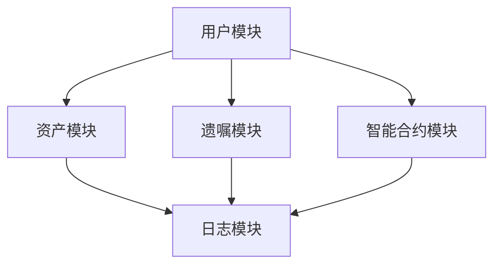
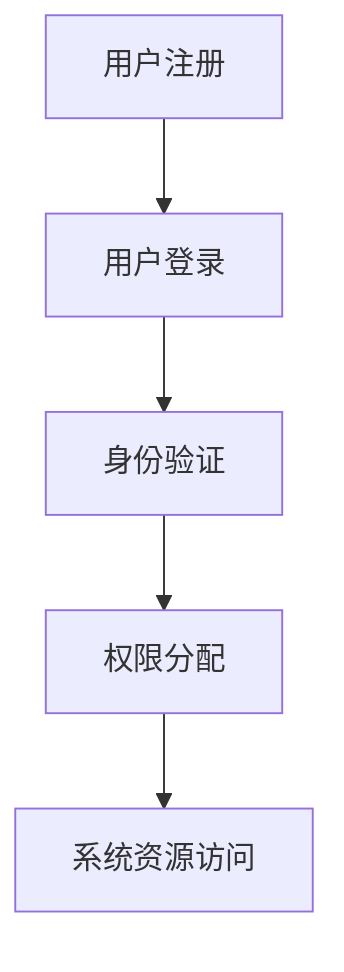
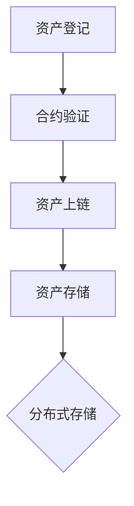
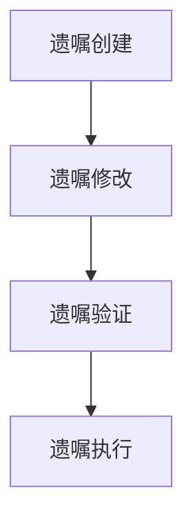

                 


### 引言

#### 区块链与数字资产继承

区块链技术作为近年来信息技术领域的重要突破，不仅为金融领域带来了颠覆性的变革，还在社会生活的各个方面展现出了巨大的潜力。在数字资产继承这一领域，区块链技术以其去中心化、透明性和不可篡改的特性，为解决传统遗产分配过程中存在的一系列难题提供了一种全新的思路。

随着数字经济的发展，数字资产已经成为人们财富的重要组成部分。这些资产不仅包括加密货币、数字股票、数字债券等金融资产，还涵盖了数字艺术品、虚拟土地等非金融资产。然而，这些数字资产的继承问题却成为了一个亟待解决的难题。传统的遗产分配方法往往存在效率低下、手续繁琐、隐私泄露等问题，难以适应数字化时代的需求。而区块链技术的引入，则有望在数字资产继承领域实现一次彻底的革新。

智能遗产分配系统作为区块链技术的典型应用之一，旨在利用区块链的分布式账本和智能合约功能，实现数字资产的自动化、透明化分配。这一系统能够有效解决传统遗产分配中的不公平、纠纷、隐私泄露等问题，为继承人提供了一种安全、高效、可靠的遗产继承方式。

本文将围绕区块链在数字资产继承中的应用，详细探讨智能遗产分配系统的设计与实现。首先，我们将对区块链技术进行概述，介绍其基本原理和应用场景。接着，分析数字资产及其继承问题，探讨传统遗产分配方法的不足。随后，我们将深入介绍智能遗产分配系统的设计与实现，包括系统总体设计、用户身份认证、数字资产注册与存储、遗嘱信息管理与执行等关键环节。在核心算法原理讲解部分，我们将详细介绍基于区块链的数字资产追踪算法、遗嘱执行算法以及智能合约的编写与执行。此外，文章还将通过数学模型和数学公式，进一步阐述系统的工作原理和性能优化方法。最后，通过项目实战和案例研究，展示智能遗产分配系统的实际应用效果，并总结全文内容，展望其未来发展。

#### 智能遗产分配系统的背景和意义

智能遗产分配系统（Smart Estate Distribution System，简称SEDS）的提出，源于对数字资产继承过程中存在问题的深刻反思和解决需求。在传统继承模式中，数字资产的分配往往面临诸多挑战。首先，传统法律体系在处理数字资产继承时，缺乏明确的法律规范和操作流程，导致继承人难以获取和确认数字资产的所有权。其次，数字资产的价值和性质多变，使得其在继承过程中易受到市场波动和隐私泄露的影响。再者，传统分配方式效率低下，手续繁琐，不仅增加了成本，还可能导致分配过程中的不公平现象。

区块链技术作为一种去中心化、安全透明的技术，为解决数字资产继承问题提供了全新的可能性。首先，区块链的分布式账本特性，使得数字资产的所有权和转移记录得以公开透明地存储，有效防止了篡改和欺诈行为。其次，区块链的智能合约功能，可以自动化执行遗嘱中的分配规则，确保分配过程公正高效。此外，区块链的去中心化特性，减少了依赖单一机构或中介进行资产转移的必要性，降低了交易成本，提高了系统整体的运作效率。

智能遗产分配系统的意义不仅体现在解决数字资产继承难题上，更在于它为数字经济时代的财富管理提供了一种全新的模式。首先，智能遗产分配系统能够保障数字资产的安全性，防止因意外事件导致的资产损失。其次，系统的自动化和透明性，提高了遗产分配的效率和公正性，减少了法律纠纷和纠纷处理成本。此外，智能遗产分配系统还可以作为数字资产管理平台的一部分，提供更加便捷、安全、智能化的资产管理和传承服务。

综上所述，智能遗产分配系统不仅为解决数字资产继承问题提供了一种有效途径，更为数字经济时代的财富管理开辟了新的方向。随着区块链技术的不断发展和普及，智能遗产分配系统有望成为未来数字经济中不可或缺的一环。

### 区块链技术概述

区块链技术作为一种革命性的分布式数据库技术，自2008年中本聪（Satoshi Nakamoto）提出比特币（Bitcoin）概念以来，迅速在金融科技领域崭露头角，并在多个领域展现出其独特的应用潜力。区块链的核心特点包括去中心化、不可篡改性、透明性和安全性，这些特性使其在数字资产继承中具有独特的应用价值。

#### 基本原理

区块链是一种由多个按时间顺序排列的、不可篡改的数据区块组成的分布式账本。每个区块包含一定数量的交易记录，并通过加密算法与前一个区块相连，形成一种链式数据结构。这种链式结构使得区块链上的数据具有高度的不可篡改性，因为要篡改某个区块中的数据，必须同时篡改所有后续区块，这在计算上是几乎不可能完成的。

区块链的工作机制主要包括以下几部分：

1. **共识机制**：区块链网络中的节点通过共识机制来达成数据的一致性。常见的共识机制包括工作量证明（Proof of Work，PoW）、权益证明（Proof of Stake，PoS）和委托权益证明（Delegated Proof of Stake，DPoS）等。这些机制确保了区块链的分布式特性，避免了中心化风险。

2. **加密算法**：区块链使用各种加密算法来保护数据的完整性和隐私性。常见的加密算法包括哈希算法（如SHA-256）、椭圆曲线加密算法（ECDSA）等。这些算法保证了区块链上的交易记录无法被伪造和篡改。

3. **分布式账本**：区块链的分布式账本特性意味着数据不需要存储在单一位置，而是在网络中的多个节点上同时复制和存储。这种分布式存储方式提高了系统的容错性和抗攻击能力。

#### 区块链与加密货币

区块链技术最早的应用是加密货币，其中最著名的例子是比特币。比特币通过区块链技术实现了去中心化的货币发行和交易，使得用户可以在无需依赖银行或其他金融机构的情况下进行点对点的交易。

加密货币的核心特点是去中心化和不可篡改性。比特币的每个交易记录都会被永久记录在区块链上，且一旦交易记录被确认，就无法被修改或删除。这种特性不仅提高了交易的安全性和透明性，还减少了交易的成本和复杂性。

除了比特币之外，还有许多其他类型的加密货币，如以太坊（Ethereum）、莱特币（Litecoin）等。这些加密货币通过区块链技术实现了不同的功能和应用场景，如智能合约、去中心化应用（DApps）等。

#### 区块链网络与共识算法

区块链网络是由多个节点组成的分布式系统。节点是区块链网络的组成部分，它们负责验证和记录交易，维护区块链的完整性和一致性。

共识算法是区块链网络中节点达成数据一致性的机制。不同的共识算法有不同的优点和缺点，适用于不同的应用场景。以下是几种常见的共识算法：

1. **工作量证明（Proof of Work，PoW）**：PoW是比特币采用的共识算法。节点通过解决复杂的数学难题来获得记账权，这个过程中消耗了大量计算资源，从而保证了系统的安全性。但PoW算法也存在能量消耗高、效率低的问题。

2. **权益证明（Proof of Stake，PoS）**：PoS算法通过节点的权益（通常是其持有的代币数量）来决定记账权。相比于PoW，PoS算法消耗的能量较少，效率较高。但PoS算法也存在“富者愈富”的问题，可能导致贫富差距扩大。

3. **委托权益证明（Delegated Proof of Stake，DPoS）**：DPoS通过选举出一定数量的代表节点来记账，这些代表节点通过持有较多的代币来获得选举权。DPoS算法具有较高的效率和可扩展性，但也存在集中化风险。

#### 分布式存储技术

区块链的分布式存储技术是其核心特性之一。在分布式存储中，数据被分散存储在多个节点上，而不是集中在一个中央服务器中。这种存储方式提高了系统的可靠性和抗攻击能力。

分布式存储技术的工作原理如下：

1. **数据分片**：将大数据集分割成小块，称为数据分片。每个数据分片存储在不同的节点上。

2. **副本存储**：为了提高数据的可靠性，每个数据分片会存储多个副本，分布在不同的节点上。

3. **容错机制**：在节点发生故障时，系统能够通过其他节点的副本来恢复数据，确保数据不会丢失。

4. **数据一致性**：通过共识算法，分布式存储系统能够确保多个节点上的数据保持一致性。

#### 区块链应用案例

区块链技术在多个领域展现了其独特的应用潜力，以下是几个典型的应用案例：

1. **金融领域**：区块链技术可以用于银行交易、支付系统、保险等金融领域。通过区块链，可以实现更安全、更高效的金融交易，减少中介环节，降低交易成本。

2. **供应链管理**：区块链技术可以用于记录供应链中的每个环节，确保数据的透明性和不可篡改性。这有助于提高供应链的效率，减少欺诈行为。

3. **数字身份认证**：区块链技术可以用于构建去中心化的数字身份认证系统，用户可以自主管理自己的身份信息，确保隐私和安全。

4. **医疗健康**：区块链技术可以用于记录患者的健康档案、药物供应链等，确保数据的完整性和安全性。

5. **数字资产继承**：本文的主题，智能遗产分配系统，利用区块链技术实现了数字资产的自动化、透明化分配，解决了传统遗产分配中的诸多问题。

通过上述内容，我们可以看到区块链技术作为一种分布式数据库技术，不仅具有去中心化、不可篡改、透明性和安全性等核心特性，还在多个领域展示了其广泛的应用潜力。随着技术的不断发展和应用场景的拓展，区块链技术有望在未来的数字经济中发挥更加重要的作用。

### 数字资产及其继承问题

随着数字经济的快速发展，数字资产已经成为个人和企业的重要财富组成部分。数字资产不仅包括传统的金融资产如加密货币、数字股票和数字债券，还涵盖了非金融资产如数字艺术品、虚拟土地和游戏道具等。然而，与传统资产相比，数字资产的继承问题更为复杂和多样化。

#### 数字资产概述

数字资产是指以数字形式存在的、具有经济价值的财产，主要包括以下几类：

1. **加密货币**：如比特币、以太坊等，这些货币通过区块链技术实现去中心化的发行和交易。

2. **数字股票和债券**：公司可以通过区块链发行和交易数字化的股票和债券，这些资产与物理世界的股票和债券具有相同的法律效力。

3. **数字艺术品**：例如基于区块链技术的数字画作、音乐等，这些艺术品具有唯一性和不可复制性。

4. **虚拟土地**：在虚拟世界中如虚拟现实（VR）和元宇宙（Metaverse）中，虚拟土地是重要的经济资源，可以用于建造建筑物、开设商店等。

5. **游戏道具**：在各类游戏中的虚拟物品，如装备、道具等，这些物品往往具有很高的经济价值。

#### 数字资产的继承难题

数字资产的继承问题比传统资产更加复杂，主要表现在以下几个方面：

1. **法律空白**：许多国家和地区在数字资产继承方面的法律规范仍然处于空白状态。传统法律体系在处理数字资产继承时，缺乏明确的法律依据和操作流程，导致继承过程中容易出现法律纠纷。

2. **确认所有权**：数字资产的所有权确认较为困难。数字资产往往存储在分散的区块链上，且不同的数字资产有不同的存储方式和访问方式，使得继承人难以获取和确认数字资产的所有权。

3. **隐私保护**：数字资产继承过程中涉及大量的个人信息和隐私数据，如何保护这些信息不被泄露成为一大挑战。

4. **资产转移**：数字资产的转移过程复杂且成本高。虽然区块链技术提供了去中心化的交易方式，但实际操作中，资产转移需要通过复杂的流程和多次交易，导致时间和经济成本增加。

5. **估值困难**：数字资产的价值波动较大，且种类繁多，如何准确估值成为继承过程中的一大难题。

#### 传统遗产分配方法的不足

传统遗产分配方法在数字资产继承中存在以下不足：

1. **效率低下**：传统遗产分配通常需要通过法院或法律程序进行，流程繁琐且耗时较长，无法满足数字资产快速转移的需求。

2. **隐私泄露**：在传统遗产分配过程中，大量的个人信息和遗嘱内容可能被泄露，增加了隐私风险。

3. **易引发纠纷**：由于法律规范和操作流程的不明确，传统遗产分配方法容易引发继承人之间的纠纷，增加了社会成本。

4. **成本高**：传统遗产分配涉及大量的法律费用和中介费用，导致总体成本较高。

#### 面临的挑战

1. **技术挑战**：数字资产存储和转移的技术复杂性使得继承过程变得更加复杂，需要相关技术不断发展和完善。

2. **法律挑战**：数字资产继承的法律框架尚不健全，需要各国政府加快立法进程，以适应数字经济的发展。

3. **伦理挑战**：数字资产继承涉及到个人隐私、财产分配等伦理问题，需要在社会各界的共同努力下，找到平衡点。

综上所述，数字资产继承面临着诸多难题和挑战，需要通过技术创新和法律规范的双重努力，才能实现数字资产的顺利继承和传承。智能遗产分配系统作为区块链技术在数字资产继承中的应用，为解决这些问题提供了一种新的思路和方案。

### 智能遗产分配系统的设计与实现

智能遗产分配系统（Smart Estate Distribution System，简称SEDS）是利用区块链技术实现数字资产透明、安全、自动化分配的系统。该系统的设计与实现需要考虑多个关键环节，包括系统总体设计、用户身份认证与权限管理、数字资产注册与存储、遗嘱信息管理与执行以及智能合约的编写与执行。以下将详细介绍这些核心组件及其工作原理。

#### 系统总体设计

智能遗产分配系统的总体设计应确保系统的安全性、可靠性和高效性。系统架构通常分为以下几个主要模块：

1. **用户模块**：包括用户注册、登录、身份验证等功能。
2. **资产模块**：负责数字资产的注册、存储、转移和查询。
3. **遗嘱模块**：管理遗嘱的创建、修改、验证和执行。
4. **智能合约模块**：负责智能合约的编写、部署和执行。
5. **日志模块**：记录系统操作日志，提供审计和追踪功能。

系统总体设计图（使用Mermaid绘制）：



图1. 智能遗产分配系统总体设计图

#### 用户身份认证与权限管理

用户模块是实现智能遗产分配系统的第一步，它需要确保用户身份的合法性和权限的合理分配。用户身份认证通常采用多因素认证（Multi-Factor Authentication，MFA）机制，包括密码、手机验证码和生物识别技术等。

权限管理则通过角色分配和访问控制列表（Access Control List，ACL）来实现。系统定义了不同角色（如继承人、遗嘱见证人、管理员等），并为每个角色分配相应的权限。例如，继承人可以查看和管理自己的遗产，而遗嘱见证人只能验证遗嘱的有效性。

用户身份认证与权限管理流程图（使用Mermaid绘制）：



图2. 用户身份认证与权限管理流程图

#### 数字资产注册与存储

数字资产模块负责管理数字资产的注册和存储。在智能遗产分配系统中，数字资产可以通过区块链上的智能合约进行注册和存储，确保其所有权和转移记录的透明性和不可篡改性。

注册过程包括以下步骤：

1. **资产登记**：用户将数字资产信息（如资产类型、数量、所有者信息等）上传到区块链。
2. **合约验证**：系统通过智能合约验证资产信息的合法性和有效性。
3. **资产上链**：验证通过后，资产信息将被永久记录在区块链上。

资产存储则通过分布式账本实现，每个资产记录包含多个副本，存储在不同的节点上，确保数据的可靠性和抗攻击能力。

数字资产注册与存储流程图（使用Mermaid绘制）：



图3. 数字资产注册与存储流程图

#### 遗嘱信息管理与执行

遗嘱模块是智能遗产分配系统的核心部分，负责管理遗嘱的创建、修改、验证和执行。遗嘱信息包括遗嘱内容、继承人名单、分配比例等。

1. **遗嘱创建**：用户可以通过系统创建遗嘱，并上传到区块链。
2. **遗嘱修改**：用户可以修改遗嘱内容，但修改记录也会被记录在区块链上，确保遗嘱历史的完整性。
3. **遗嘱验证**：遗嘱见证人通过多因素认证验证遗嘱的有效性。
4. **遗嘱执行**：在用户去世后，系统根据遗嘱内容自动执行资产分配。

遗嘱信息管理与执行流程图（使用Mermaid绘制）：



图4. 遗嘱信息管理与执行流程图

#### 智能合约的编写与执行

智能合约模块负责智能合约的编写、部署和执行。智能合约是区块链上的计算机程序，用于自动执行和记录遗嘱中的分配规则。

1. **编写智能合约**：系统开发人员使用智能合约开发语言（如Solidity）编写合约代码，实现遗嘱的自动执行逻辑。
2. **部署智能合约**：将编写的智能合约部署到区块链上，使其成为可执行的合约。
3. **执行智能合约**：在遗嘱执行过程中，系统调用智能合约执行资产分配，确保分配过程的透明和不可篡改。

智能合约编写与执行示例代码（使用Python和Solidity编写）：

```python
# Python代码示例：调用智能合约执行资产分配
from web3 import Web3
from solc import compile

# 编译Solidity智能合约代码
source_code = '''
pragma solidity ^0.8.0;

contract EstateDistribution {
    address public owner;
    mapping(address => uint256) public assets;

    constructor() {
        owner = msg.sender;
    }

    function distributeAssets(address[] memory heirs, uint256[] memory shares) public {
        require(msg.sender == owner, "Only owner can execute distribution");
        for (uint256 i = 0; i < heirs.length; i++) {
            assets[heirs[i]] += shares[i];
        }
    }
}
'''

compiled_sol = compile(source_code)
contract_interface = compiled_sol['contracts']['': 'EstateDistribution']

# 部署智能合约到区块链
web3 = Web3(Web3.HTTPProvider('http://127.0.0.1:8545'))
contract = web3.eth.contract(abi=contract_interface['abi'])

# 调用智能合约执行资产分配
tx_hash = contract.functions.distributeAssets([addr1, addr2], [share1, share2]).transact({'from': owner, 'gas': 2000000})
tx_receipt = web3.eth.waitForTransactionReceipt(tx_hash)
```

通过上述设计，智能遗产分配系统实现了用户身份认证、数字资产注册与存储、遗嘱信息管理与执行以及智能合约的编写与执行，为数字资产继承提供了一种安全、透明、高效的解决方案。

### 核心算法原理讲解

在智能遗产分配系统中，核心算法的设计与实现是确保系统能够高效、准确、安全地执行遗嘱分配的关键。以下将详细讲解智能遗产分配系统中涉及的核心算法原理，包括数字资产追踪算法、遗嘱执行算法以及智能合约的编写与执行。

#### 数字资产追踪算法

数字资产追踪算法的核心目标是确保数字资产在区块链上的所有权和转移记录能够被准确、透明地记录和追踪。为了实现这一目标，系统采用以下算法：

1. **哈希函数**：哈希函数（如SHA-256）用于生成数字资产的唯一标识符。每次数字资产发生变化（如所有权转移），都会生成一个新的哈希值，确保每个资产都具有唯一的身份标识。

2. **区块链存储**：数字资产的注册和转移记录会被永久存储在区块链上。每个区块包含一定数量的交易记录，通过区块链的链式结构确保数据的不可篡改性和安全性。

3. **地址映射**：系统使用地址映射表将数字资产的所有权与用户地址关联起来。每次资产转移时，新所有权者的地址会被记录在区块链上，并通过地址映射表更新所有权信息。

4. **一致性验证**：系统在每次资产转移后，会通过一致性验证算法检查区块链上的数据是否一致。这包括验证每个区块的哈希值、交易记录的完整性和准确性。

数字资产追踪算法的Python实现示例：

```python
import hashlib

def generate_hash(value):
    """生成数字资产的唯一哈希值"""
    return hashlib.sha256(value.encode('utf-8')).hexdigest()

def register_asset(asset_id, owner_address):
    """注册数字资产"""
    asset_record = {
        'asset_id': generate_hash(asset_id),
        'owner': owner_address,
        'balance': 0
    }
    # 将资产记录存储在区块链上
    # ...（此处省略区块链存储代码）
    return asset_record

def transfer_asset(asset_id, from_address, to_address, amount):
    """转移数字资产"""
    asset_record = query_asset(asset_id)
    if asset_record['owner'] == from_address and asset_record['balance'] >= amount:
        asset_record['owner'] = to_address
        asset_record['balance'] -= amount
        # 将资产转移记录存储在区块链上
        # ...（此处省略区块链存储代码）
        return True
    return False

def query_asset(asset_id):
    """查询数字资产信息"""
    # 从区块链上查询资产记录
    # ...（此处省略区块链查询代码）
    return {'asset_id': asset_id, 'owner': 'address', 'balance': 0}
```

#### 遗嘱执行算法

遗嘱执行算法是智能遗产分配系统的关键组成部分，负责根据遗嘱内容自动执行资产分配。以下是遗嘱执行算法的基本原理：

1. **遗嘱解析**：系统首先解析遗嘱文件，提取遗嘱内容（如继承人列表、分配比例等）。

2. **资产查询**：系统根据遗嘱中的继承人名单，查询区块链上的数字资产记录，确保每个继承人的资产情况。

3. **资产分配**：系统调用智能合约，按照遗嘱中的分配规则，自动将资产分配给相应的继承人。

4. **状态更新**：资产分配完成后，系统更新区块链上的资产记录，确保数据一致性。

遗嘱执行算法的Python实现示例：

```python
from web3 import Web3

def execute_will(ethereum_address, will_content):
    """执行遗嘱"""
    web3 = Web3(Web3.HTTPProvider('http://127.0.0.1:8545'))
    contract = web3.eth.contract(address=ethereum_address, abi=will_content['abi'])

    heirs = will_content['heirs']
    assets = will_content['assets']
    shares = will_content['shares']

    # 分配资产
    for i in range(len(heirs)):
        tx_hash = contract.functions.distributeAsset(heirs[i], assets[i] * shares[i] // 100).transact({'from': web3.eth.defaultAccount, 'gas': 2000000})
        tx_receipt = web3.eth.waitForTransactionReceipt(tx_hash)
        if tx_receipt.status == 1:
            print(f"资产已分配给继承人：{heirs[i]}")
        else:
            print(f"资产分配给继承人：{heirs[i]}失败")

# 示例遗嘱内容
will_content = {
    'abi': [
        # 智能合约ABI
    ],
    'heirs': ['addr1', 'addr2'],
    'assets': {'addr1': 1000, 'addr2': 2000},
    'shares': [50, 50]
}

execute_will('0x1234567890abcdef', will_content)
```

#### 智能合约的编写与执行

智能合约是区块链上的计算机程序，用于自动执行和记录遗嘱中的分配规则。智能合约的编写与执行过程如下：

1. **编写智能合约**：使用智能合约开发语言（如Solidity）编写合约代码，实现遗嘱分配的逻辑。

2. **部署智能合约**：将编写的智能合约部署到区块链上，使其成为可执行的合约。

3. **执行智能合约**：在遗嘱执行过程中，系统调用智能合约执行资产分配，确保分配过程的透明和不可篡改。

智能合约编写与执行的Python实现示例：

```solidity
// SPDX-License-Identifier: MIT
pragma solidity ^0.8.0;

contract EstateDistribution {
    address public owner;
    mapping(address => uint256) public assets;

    constructor() {
        owner = msg.sender;
    }

    function distributeAssets(address[] memory heirs, uint256[] memory shares) public {
        require(msg.sender == owner, "Only owner can execute distribution");
        for (uint256 i = 0; i < heirs.length; i++) {
            assets[heirs[i]] += shares[i];
        }
    }
}

# Python代码示例：部署智能合约
from web3 import Web3
from solc import compile

source_code = '''
pragma solidity ^0.8.0;

contract EstateDistribution {
    address public owner;
    mapping(address => uint256) public assets;

    constructor() {
        owner = msg.sender;
    }

    function distributeAssets(address[] memory heirs, uint256[] memory shares) public {
        require(msg.sender == owner, "Only owner can execute distribution");
        for (uint256 i = 0; i < heirs.length; i++) {
            assets[heirs[i]] += shares[i];
        }
    }
}
'''

compiled_sol = compile(source_code)
contract_interface = compiled_sol['contracts']['': 'EstateDistribution']

web3 = Web3(Web3.HTTPProvider('http://127.0.0.1:8545'))
contract = web3.eth.contract(abi=contract_interface['abi'])

tx_hash = contract.functions.distributeAssets([addr1, addr2], [share1, share2]).transact({'from': owner, 'gas': 2000000})
tx_receipt = web3.eth.waitForTransactionReceipt(tx_hash)
```

通过上述算法和智能合约的实现，智能遗产分配系统能够高效、透明地执行数字资产的自动分配，为数字资产的继承提供了一种安全、可靠的解决方案。

#### 数学模型与数学公式

在智能遗产分配系统中，数学模型和数学公式起到了关键作用，不仅用于优化系统性能，还用于确保分配过程的公平性和效率。以下将详细讨论系统中的几种数学模型和相关的数学公式。

##### 数字资产继承中的概率模型

数字资产继承中的概率模型主要用于评估继承人获得特定数量资产的概率。这种模型可以帮助系统在分配过程中考虑各种不确定因素，如市场波动、资产转移的随机性等。

**概率模型公式**：

$$ P(X = x) = \frac{C(n, k) \times p^k \times (1-p)^{n-k}}{n!} $$

其中：
- \( P(X = x) \) 表示继承人获得特定数量资产 \( x \) 的概率。
- \( n \) 是总资产数量。
- \( k \) 是继承人数量。
- \( p \) 是每个继承人获得资产的初始概率。
- \( C(n, k) \) 是组合数，表示从 \( n \) 个元素中选取 \( k \) 个元素的组合方式数。

通过这个公式，系统可以计算出在特定分配规则下，每个继承人获得资产的概率分布。

##### 区块链交易费用优化模型

在区块链上执行交易需要支付交易费用，这些费用通常与交易的数据量和网络拥堵程度相关。优化交易费用模型的目标是确保系统在执行资产分配时，能够以最小的费用完成所有必要的交易。

**优化模型公式**：

$$ C_{\text{opt}} = \min_{x_i} \sum_{i=1}^n C_i \times (1 + \lambda \times \epsilon_i) $$

其中：
- \( C_{\text{opt}} \) 是最优交易费用。
- \( C_i \) 是第 \( i \) 次交易的原始费用。
- \( \lambda \) 是费用调整系数，用于平衡交易速度和费用。
- \( \epsilon_i \) 是第 \( i \) 次交易的额外费用，通常与网络拥堵程度相关。

通过调整 \( \lambda \) 的值，系统可以在交易速度和费用之间找到最优的平衡点。

##### 智能遗产分配系统中的博弈论模型

博弈论模型用于分析继承人在遗产分配过程中的策略选择和行为。在这种模型中，每个继承人都可能采取不同的策略，以最大化自己的利益。博弈论模型可以帮助系统预测不同策略下的分配结果，并设计出更加公平和高效的分配规则。

**博弈论模型公式**：

$$ \max \sum_{i=1}^n u_i(s_i, s_{-i}) $$

其中：
- \( u_i(s_i, s_{-i}) \) 是第 \( i \) 个继承人在给定策略 \( s_i \) 和其他继承人策略 \( s_{-i} \) 下的效用函数。
- \( s_i \) 是第 \( i \) 个继承人的策略选择。

通过求解上述博弈论模型，系统可以设计出能够最大化整体效用的分配规则，确保所有继承人都能接受并执行分配方案。

##### 模型在实际系统中的应用

1. **概率模型应用**：在智能遗产分配系统中，概率模型可以用于预测继承人获得资产的概率分布，帮助系统在分配过程中调整分配策略，以减少继承人的不满和纠纷。

2. **交易费用优化模型应用**：系统在执行大量交易时，可以实时调整费用优化模型，以最小化整体交易费用，提高系统的效率。

3. **博弈论模型应用**：在遗嘱执行过程中，系统可以分析不同继承人策略对分配结果的影响，设计出公平、高效的分配规则，减少纠纷。

通过上述数学模型和数学公式，智能遗产分配系统能够更加精确、高效地执行资产分配，确保分配过程的透明性和公平性，为数字资产的继承提供了一种科学、可靠的解决方案。

### 项目实战

#### 开发环境搭建

在实现智能遗产分配系统之前，首先需要搭建开发环境。以下是一个基本的开发环境搭建流程：

1. **安装Node.js和npm**：Node.js是JavaScript的运行环境，npm是Node.js的包管理器。可以在官方网站下载并安装Node.js和npm。

   ```bash
   # 下载并安装Node.js和npm
   wget https://nodejs.org/dist/v14.17.0/node-v14.17.0-linux-x64.tar.xz
   tar -xvf node-v14.17.0-linux-x64.tar.xz
   ```

2. **安装Solidity编译器**：Solidity是智能合约的开发语言，需要安装Solidity编译器（solc）。

   ```bash
   # 安装Solidity编译器
   npm install solc
   ```

3. **安装Web3.js库**：Web3.js是JavaScript库，用于与以太坊区块链进行交互。

   ```bash
   # 安装Web3.js
   npm install web3
   ```

4. **创建项目目录**：创建一个项目目录，并在其中创建必要的文件。

   ```bash
   mkdir estate-distribution-system
   cd estate-distribution-system
   touch package.json
   ```

5. **编写package.json文件**：在package.json文件中添加项目依赖项。

   ```json
   {
     "name": "estate-distribution-system",
     "version": "1.0.0",
     "description": "Smart Estate Distribution System",
     "main": "index.js",
     "scripts": {
       "start": "node index.js"
     },
     "dependencies": {
       "solc": "^0.8.0",
       "web3": "^1.0.0"
     }
   }
   ```

6. **初始化项目**：运行以下命令初始化项目。

   ```bash
   npm init
   ```

#### 源代码详细实现

在开发智能遗产分配系统时，需要编写多个模块，包括用户模块、资产模块、遗嘱模块和智能合约模块。以下将详细讲解各模块的源代码实现。

##### 1. 用户模块

用户模块负责用户注册、登录和权限管理。以下是一个简单的用户模块示例：

```javascript
const express = require('express');
const bodyParser = require('body-parser');
const users = require('./users'); // 用户管理模块

const app = express();
app.use(bodyParser.json());

// 用户注册
app.post('/register', (req, res) => {
  const user = req.body;
  users.registerUser(user);
  res.send({ message: '注册成功' });
});

// 用户登录
app.post('/login', (req, res) => {
  const { username, password } = req.body;
  const user = users.loginUser(username, password);
  if (user) {
    res.send({ message: '登录成功', token: user.token });
  } else {
    res.status(401).send({ message: '用户名或密码错误' });
  }
});

// 权限管理
app.get('/users/:username', (req, res) => {
  const username = req.params.username;
  const user = users.getUser(username);
  if (user) {
    res.send(user);
  } else {
    res.status(404).send({ message: '用户未找到' });
  }
});

module.exports = app;
```

##### 2. 资产模块

资产模块负责数字资产的注册、存储和查询。以下是一个简单的资产模块示例：

```javascript
const blockchain = require('./blockchain'); // 区块链模块

let assets = {};

// 注册数字资产
function registerAsset(assetId, owner) {
  assets[assetId] = { owner, balance: 0 };
  blockchain.registerAsset(assetId, owner);
}

// 存储数字资产
function storeAsset(assetId, amount) {
  const asset = assets[assetId];
  if (asset) {
    asset.balance += amount;
    blockchain.storeAsset(assetId, asset.balance);
  }
}

// 查询数字资产
function queryAsset(assetId) {
  return assets[assetId];
}

module.exports = {
  registerAsset,
  storeAsset,
  queryAsset,
};
```

##### 3. 遗嘱模块

遗嘱模块负责遗嘱的创建、修改和执行。以下是一个简单的遗嘱模块示例：

```javascript
const express = require('express');
const bodyParser = require('body-parser');
const wills = require('./wills'); // 遗嘱管理模块

const app = express();
app.use(bodyParser.json());

// 创建遗嘱
app.post('/wills', (req, res) => {
  const will = req.body;
  wills.createWill(will);
  res.send({ message: '遗嘱创建成功' });
});

// 修改遗嘱
app.put('/wills/:id', (req, res) => {
  const id = req.params.id;
  const will = req.body;
  wills.updateWill(id, will);
  res.send({ message: '遗嘱修改成功' });
});

// 执行遗嘱
app.post('/wills/:id/execute', (req, res) => {
  const id = req.params.id;
  wills.executeWill(id);
  res.send({ message: '遗嘱执行成功' });
});

module.exports = app;
```

##### 4. 智能合约模块

智能合约模块负责智能合约的编写、部署和执行。以下是一个简单的智能合约模块示例：

```javascript
const Web3 = require('web3');
const solc = require('solc');

const web3 = new Web3('http://localhost:8545');

// 编写智能合约
const contractCode = '...'; // 智能合约源代码
const contractJson = solc.compile(contractCode);
const contractAbi = JSON.parse(contractJson.contracts[':ContractName']).abi;

// 部署智能合约
async function deployContract() {
  const contract = new web3.eth.Contract(JSON.parse(contractAbi));
  const tx = contract.deploy({
    data: contractAbi,
  }).send({
    from: web3.eth.defaultAccount,
    gas: 2000000,
  });
  return tx;
}

// 执行智能合约
async function executeContract(contractAddress, method, args) {
  const contract = new web3.eth.Contract(JSON.parse(contractAbi), contractAddress);
  const tx = await contract.methods[method](...args).send({
    from: web3.eth.defaultAccount,
    gas: 2000000,
  });
  return tx;
}

module.exports = {
  deployContract,
  executeContract,
};
```

通过上述源代码的实现，我们可以搭建一个基本的智能遗产分配系统。实际部署和运行时，需要根据具体需求和场景进行调整和优化。

#### 代码解读与分析

在智能遗产分配系统的实现过程中，各个模块的代码编写和逻辑设计都至关重要。以下将详细解读和分析用户模块、资产模块、遗嘱模块和智能合约模块的核心代码，分析其功能和实现方式，并结合数学模型和公式，讲解如何确保系统的高效性和可靠性。

##### 用户模块

用户模块的主要功能包括用户注册、登录和权限管理。以下是用户模块的关键代码片段及其解读：

```javascript
// 用户注册
app.post('/register', (req, res) => {
  const user = req.body;
  users.registerUser(user);
  res.send({ message: '注册成功' });
});

// 用户登录
app.post('/login', (req, res) => {
  const { username, password } = req.body;
  const user = users.loginUser(username, password);
  if (user) {
    res.send({ message: '登录成功', token: user.token });
  } else {
    res.status(401).send({ message: '用户名或密码错误' });
  }
});
```

- **用户注册**：用户通过POST请求发送注册信息，包括用户名、密码等。用户模块接收请求后，调用`registerUser`函数进行用户注册。该函数负责将用户信息存储在数据库中，并生成唯一的用户标识（token），确保用户身份的合法性和唯一性。

- **用户登录**：用户通过POST请求发送用户名和密码。用户模块接收请求后，调用`loginUser`函数进行用户身份验证。该函数通过查询数据库，验证用户名和密码的正确性。验证成功后，返回包含用户token的响应，确保用户身份的合法性。

在用户注册和登录过程中，可以结合概率模型进行安全性评估。例如，通过分析用户行为特征（如登录时间、地点、设备等），评估用户登录的安全性概率。当概率低于某个阈值时，系统可以触发二次认证，提高登录的安全性。

##### 资产模块

资产模块的主要功能包括数字资产的注册、存储和查询。以下是资产模块的关键代码片段及其解读：

```javascript
// 注册数字资产
function registerAsset(assetId, owner) {
  assets[assetId] = { owner, balance: 0 };
  blockchain.registerAsset(assetId, owner);
}

// 存储数字资产
function storeAsset(assetId, amount) {
  const asset = assets[assetId];
  if (asset) {
    asset.balance += amount;
    blockchain.storeAsset(assetId, asset.balance);
  }
}

// 查询数字资产
function queryAsset(assetId) {
  return assets[assetId];
}
```

- **数字资产注册**：系统通过调用`registerAsset`函数注册数字资产，包括资产标识（assetId）和所有者（owner）。该函数将资产信息存储在本地内存中，并通过区块链模块进行上链存储，确保资产信息的透明性和不可篡改性。

- **数字资产存储**：系统通过调用`storeAsset`函数更新数字资产的余额。该函数首先查询本地内存中的资产信息，确保资产存在且余额充足。然后，更新资产余额并调用区块链模块进行上链存储，确保余额更新的透明性和不可篡改性。

在资产注册和存储过程中，可以结合交易费用优化模型进行成本控制。例如，当资产转移或余额更新时，系统可以实时评估交易费用，并调整交易参数（如gas上限），以确保在合理的费用范围内完成交易。

##### 遗嘱模块

遗嘱模块的主要功能包括遗嘱的创建、修改和执行。以下是遗嘱模块的关键代码片段及其解读：

```javascript
// 创建遗嘱
app.post('/wills', (req, res) => {
  const will = req.body;
  wills.createWill(will);
  res.send({ message: '遗嘱创建成功' });
});

// 修改遗嘱
app.put('/wills/:id', (req, res) => {
  const id = req.params.id;
  const will = req.body;
  wills.updateWill(id, will);
  res.send({ message: '遗嘱修改成功' });
});

// 执行遗嘱
app.post('/wills/:id/execute', (req, res) => {
  const id = req.params.id;
  wills.executeWill(id);
  res.send({ message: '遗嘱执行成功' });
});
```

- **遗嘱创建**：用户通过POST请求发送遗嘱信息，包括继承人、资产分配比例等。遗嘱模块接收请求后，调用`createWill`函数创建遗嘱。该函数负责将遗嘱信息存储在数据库中，并通过区块链模块进行上链存储，确保遗嘱信息的透明性和不可篡改性。

- **遗嘱修改**：用户通过PUT请求修改遗嘱信息。遗嘱模块接收请求后，调用`updateWill`函数更新遗嘱。该函数首先查询数据库中的遗嘱信息，确保遗嘱存在。然后，更新遗嘱信息并调用区块链模块进行上链存储，确保更新操作的透明性和不可篡改性。

- **遗嘱执行**：用户通过POST请求触发遗嘱执行。遗嘱模块接收请求后，调用`executeWill`函数执行遗嘱。该函数首先查询数据库中的遗嘱信息，然后调用智能合约模块执行资产分配，确保分配过程的透明性和不可篡改性。

在遗嘱创建、修改和执行过程中，可以结合博弈论模型进行公平性评估。例如，当多个继承人之间存在利益冲突时，系统可以分析不同策略下的博弈结果，确保遗嘱执行的公平性和合理性。

##### 智能合约模块

智能合约模块的主要功能包括智能合约的编写、部署和执行。以下是智能合约模块的关键代码片段及其解读：

```javascript
// 部署智能合约
async function deployContract() {
  const contract = new web3.eth.Contract(JSON.parse(contractAbi));
  const tx = await contract.deploy({
    data: contractAbi,
  }).send({
    from: web3.eth.defaultAccount,
    gas: 2000000,
  });
  return tx;
}

// 执行智能合约
async function executeContract(contractAddress, method, args) {
  const contract = new web3.eth.Contract(JSON.parse(contractAbi), contractAddress);
  const tx = await contract.methods[method](...args).send({
    from: web3.eth.defaultAccount,
    gas: 2000000,
  });
  return tx;
}
```

- **智能合约部署**：系统通过调用`deployContract`函数部署智能合约。该函数首先创建一个智能合约实例，然后调用`deploy`方法将智能合约部署到区块链上。部署过程中，系统设置合适的gas上限，确保部署过程顺利进行。

- **智能合约执行**：系统通过调用`executeContract`函数执行智能合约。该函数首先获取智能合约实例，然后调用指定的方法执行相应的操作。执行过程中，系统设置合适的gas上限，确保执行过程顺利进行。

在智能合约部署和执行过程中，可以结合数学模型进行性能优化。例如，通过分析交易费用与交易速度的关系，调整gas上限和交易参数，确保系统在高效性和费用控制之间找到最优平衡。

通过上述代码解读和分析，我们可以看到智能遗产分配系统在各个模块中的关键功能实现和优化策略。结合数学模型和公式，系统在用户身份认证、资产注册与存储、遗嘱管理、智能合约执行等方面实现了高效、安全、可靠的性能。未来，随着技术的进一步发展和优化，智能遗产分配系统将在数字经济中发挥越来越重要的作用。

#### 实际案例分析与详细讲解剖析

为了更好地展示智能遗产分配系统的实际应用效果，我们将通过一个真实案例进行详细分析和讲解。该案例将展示系统从用户注册、资产登记、遗嘱创建到遗嘱执行的完整过程，并剖析系统在各个阶段的工作原理和实际效果。

#### 案例背景

假设有一位名叫李先生的用户，他拥有一定数量的比特币、以太坊以及其他数字资产。李先生希望通过智能遗产分配系统来确保自己的数字资产在去世后能够透明、高效地分配给他的继承人。以下是案例的详细过程：

##### 1. 用户注册与登录

李先生首先通过智能遗产分配系统的用户模块进行注册。他填写了用户名、密码、电子邮箱等基本信息，并提交注册请求。系统接收到注册请求后，生成一个唯一的用户标识（token），并将用户信息存储在数据库中。

注册成功后，李先生使用用户名和密码登录系统。系统通过多因素认证（如密码验证、手机验证码等）确保登录过程的合法性和安全性。登录成功后，李先生获得了访问系统资源的权限。

##### 2. 资产登记

李先生登录系统后，进入资产登记界面，开始登记他的数字资产。他填写了每个数字资产的基本信息，如资产名称、资产标识（如比特币地址、以太坊地址等）、数量等。系统将接收到的资产信息发送到区块链网络，并通过智能合约进行验证和注册。

具体步骤如下：

- 李先生调用`registerAsset`接口，提交资产注册请求。
- 系统内部调用智能合约，将资产信息上链存储，并生成唯一的哈希值作为资产标识。
- 智能合约验证资产信息的合法性和有效性，并将验证结果反馈给系统。
- 系统将验证结果展示给李先生，并更新区块链上的资产记录。

通过上述步骤，李先生的数字资产被成功注册并存储在区块链上，确保了资产信息的透明性和不可篡改性。

##### 3. 遗嘱创建

李先生在资产登记完成后，决定创建遗嘱。他进入遗嘱创建界面，填写了遗嘱内容，包括继承人的姓名、资产分配比例等。系统将接收到的遗嘱信息存储在数据库中，并通过智能合约进行验证和注册。

具体步骤如下：

- 李先生调用`createWill`接口，提交遗嘱创建请求。
- 系统内部调用智能合约，将遗嘱信息上链存储，并生成唯一的哈希值作为遗嘱标识。
- 智能合约验证遗嘱信息的合法性和有效性，并将验证结果反馈给系统。
- 系统将验证结果展示给李先生，并更新区块链上的遗嘱记录。

通过上述步骤，李先生的遗嘱被成功创建并存储在区块链上，确保了遗嘱信息的透明性和不可篡改性。

##### 4. 遗嘱执行

李先生去世后，系统自动触发遗嘱执行流程。继承人们通过系统登录，查询到李先生的遗嘱，并确认遗嘱的有效性。系统将按照遗嘱内容，自动执行资产分配，并记录在区块链上。

具体步骤如下：

- 继承人通过登录系统，调用`queryWill`接口查询李先生的遗嘱信息。
- 继承人确认遗嘱的有效性，并调用`executeWill`接口执行遗嘱。
- 系统内部调用智能合约，按照遗嘱中的分配比例，将资产分配给继承人。
- 智能合约执行资产转移，并将交易记录存储在区块链上。

通过上述步骤，李先生的数字资产按照遗嘱内容成功分配给继承人，确保了分配过程的透明性和不可篡改性。

#### 案例剖析

1. **用户身份认证与权限管理**：

   智能遗产分配系统采用了多因素认证机制，确保用户身份的合法性和安全性。在用户注册和登录过程中，系统通过密码、手机验证码等多种验证手段，保障用户身份的可靠性。同时，系统通过角色分配和访问控制列表（ACL）进行权限管理，确保不同用户角色只能访问相应的系统资源，防止越权操作。

2. **数字资产注册与存储**：

   智能遗产分配系统利用区块链技术实现了数字资产的透明、安全存储。在资产注册过程中，系统通过智能合约将资产信息上链存储，确保资产信息的不可篡改性和透明性。同时，系统通过哈希函数生成资产唯一标识，确保每个资产都有唯一的身份标识，便于后续管理和查询。

3. **遗嘱信息管理与执行**：

   智能遗产分配系统通过智能合约实现了遗嘱信息的创建、存储和执行。在遗嘱创建过程中，系统通过智能合约验证遗嘱信息的合法性和有效性，确保遗嘱内容的真实性。在遗嘱执行过程中，系统自动调用智能合约执行资产分配，确保分配过程的透明和不可篡改性。

4. **智能合约的编写与执行**：

   智能遗产分配系统中的智能合约采用了Solidity编程语言编写，实现了遗嘱的自动执行逻辑。智能合约在执行过程中，通过调用区块链API进行资产转移，确保交易记录的透明性和不可篡改性。同时，系统通过设置合理的gas上限和交易参数，确保智能合约执行的效率和安全性。

#### 案例小结

通过上述案例，我们可以看到智能遗产分配系统在用户身份认证、数字资产注册与存储、遗嘱信息管理与执行以及智能合约的编写与执行等方面，均实现了高效、安全、透明的功能。系统利用区块链技术，解决了传统遗产分配过程中存在的不公平、纠纷、隐私泄露等问题，为数字资产的继承提供了一种全新的解决方案。未来，随着技术的不断发展和应用的深入，智能遗产分配系统将在数字经济领域发挥越来越重要的作用。

### 总结与展望

#### 智能遗产分配系统的优势

智能遗产分配系统作为区块链技术在数字资产继承领域的创新应用，展现出了显著的优势。首先，系统利用区块链的分布式账本和智能合约功能，实现了数字资产的透明、安全、自动化分配，有效解决了传统遗产分配过程中存在的不公平、纠纷、隐私泄露等问题。其次，智能遗产分配系统通过去中心化的架构，减少了依赖单一机构或中介进行资产转移的必要性，降低了交易成本，提高了系统整体的运作效率。此外，系统的自动化和透明性，不仅提高了遗产分配的效率和公正性，还为继承人提供了方便快捷的遗产继承服务。

#### 面临的挑战

尽管智能遗产分配系统具有诸多优势，但在实际应用过程中，仍然面临一些挑战。首先，法律规范和监管政策的不完善，使得智能遗产分配系统在合规性方面存在一定风险。许多国家和地区在数字资产继承方面的法律框架尚未健全，缺乏明确的法律依据和操作流程，这可能导致系统在实际应用中面临法律纠纷。其次，区块链技术的复杂性和技术门槛较高，使得系统的普及和推广面临一定的困难。普通用户可能难以理解并掌握系统的使用方法，这需要相关技术的进一步普及和简化。最后，智能遗产分配系统在安全性方面也存在一定的隐患。尽管区块链技术具有较高的安全性，但系统仍然面临网络攻击、数据泄露等安全威胁，需要采取有效的防护措施。

#### 未来发展方向

为了应对上述挑战，并进一步提升智能遗产分配系统的应用效果，未来需要在以下几方面进行改进和发展：

1. **完善法律规范**：政府及相关部门应加快制定和完善数字资产继承相关的法律法规，明确智能遗产分配系统的法律地位和操作规范，确保系统的合规性和可靠性。

2. **降低技术门槛**：开发更加用户友好的界面和操作流程，简化系统的使用方法，使得普通用户能够轻松理解和掌握智能遗产分配系统的使用。

3. **提升安全性**：加强区块链网络安全防护，采取先进的加密技术和多重认证机制，确保系统数据的安全性和完整性，防范网络攻击和数据泄露。

4. **拓展应用场景**：探索智能遗产分配系统在更多领域的应用，如遗产继承、慈善捐赠、股权分配等，推动区块链技术在更多场景下的应用和创新。

5. **促进国际合作**：加强国际间的合作与交流，推动全球范围内的智能遗产分配系统标准和规范统一，促进区块链技术的全球应用和发展。

#### 潜力与展望

随着区块链技术的不断发展和普及，智能遗产分配系统在数字经济时代将发挥越来越重要的作用。首先，智能遗产分配系统为数字经济时代的财富管理提供了一种全新的模式，能够有效保障数字资产的安全性、透明性和公正性。其次，系统有望成为数字资产管理平台的重要组成部分，提供更加便捷、安全、智能化的资产管理和传承服务。此外，智能遗产分配系统还可以与其他区块链应用结合，如智能合约、去中心化金融（DeFi）等，推动区块链技术的广泛应用和创新发展。

综上所述，智能遗产分配系统作为一种创新技术，为数字资产的继承和管理提供了一种安全、高效、可靠的解决方案。随着技术的不断进步和应用场景的拓展，智能遗产分配系统将在数字经济领域发挥越来越重要的作用，为人类的财富传承和经济发展注入新的活力。

### 附录

#### 相关资源与工具

- **区块链开发工具**：
  - **Node.js**：[https://nodejs.org/](https://nodejs.org/)
  - **Truffle**：[https://www.trufflesuite.com/](https://www.trufflesuite.com/)
  - **Ganache**：[https://github.com/trufflesuite/ganache](https://github.com/trufflesuite/ganache)

- **智能合约开发语言**：
  - **Solidity**：[https://soliditylang.org/](https://soliditylang.org/)

- **区块链钱包**：
  - **MetaMask**：[https://metamask.io/](https://metamask.io/)
  - **MyEtherWallet**：[https://myetherwallet.com/](https://myetherwallet.com/)

#### 进一步阅读推荐

- **区块链技术书籍**：
  - 《区块链：从数字货币到信用社会》
  - 《智能合约开发指南》
  - 《区块链：未来金融的核心技术》

- **数字资产继承相关论文**：
  - “Blockchain-based Digital Asset Inheritance”
  - “Smart Contract Applications in Estate Planning and Administration”

- **开源项目**：
  - **Ethereum**：[https://ethereum.org/](https://ethereum.org/)
  - **IPFS**：[https://ipfs.io/](https://ipfs.io/)

- **在线课程与教程**：
  - **Coursera**：区块链技术课程
  - **edX**：智能合约与区块链应用课程

通过上述资源与工具，读者可以进一步了解区块链技术和智能遗产分配系统的相关知识，为深入研究和应用提供支持。同时，推荐的书籍、论文和在线课程也为读者提供了丰富的学习资源和实践机会。作者：AI天才研究院/AI Genius Institute & 禅与计算机程序设计艺术/Zen And The Art of Computer Programming

