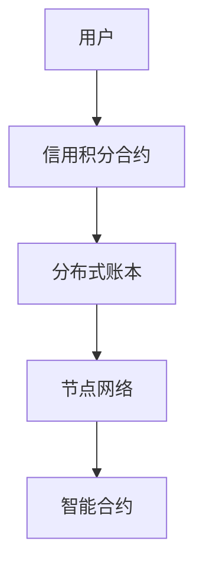
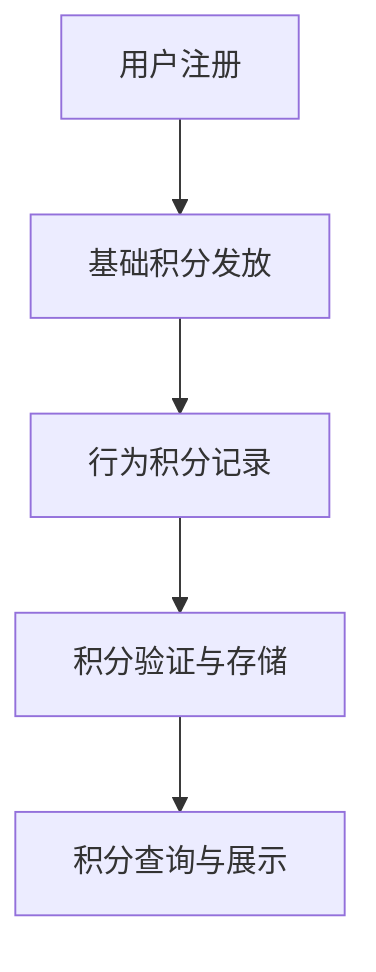
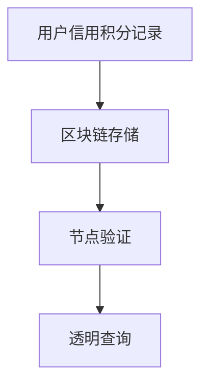

                 

### 《区块链在数字身份信用积分中的去中心化应用》

#### 关键词：区块链、数字身份、信用积分、去中心化应用、DID协议

> **摘要：**本文深入探讨了区块链技术在数字身份和信用积分领域中的应用。通过详细阐述区块链的定义、原理及其在数字身份识别、管理及信用积分评估中的作用，我们揭示了区块链如何实现数字身份与信用积分的去中心化管理和应用。文章还介绍了去中心化应用（DApp）的开发实践，以及常见DID协议的原理和应用。通过实际案例分析，我们总结了区块链在信用积分领域的未来发展机遇与挑战，为读者提供了深入理解和实践区块链在数字身份与信用积分领域的指南。

## 第1章 绪论

### 1.1 区块链技术简介

区块链技术作为一种分布式账本技术，自2008年比特币的诞生以来，逐渐成为金融科技领域的重要创新。其核心特点包括去中心化、不可篡改和透明性，这些特点使得区块链技术在金融、供应链管理、数字身份等领域展现出巨大的应用潜力。

#### 1.1.1 区块链的定义与原理

区块链是一个分布式数据库系统，由多个相互连接的区块组成，每个区块都包含一定数量的交易记录。区块链中的数据以加密方式存储，并通过共识算法实现数据的验证和一致性。

- **去中心化：**区块链不需要中央权威机构，每个节点都拥有完整的账本，所有节点共同维护和验证交易。
- **不可篡改：**区块链上的数据一旦被验证和记录，就无法被篡改，确保了数据的安全性和可信性。
- **透明性：**区块链上的所有交易记录都是公开透明的，任何人都可以查看和验证。

#### 1.1.2 区块链的核心技术

区块链的核心技术包括：

- **加密技术：**确保数据的隐私和安全，防止未经授权的访问和篡改。
- **共识算法：**用于节点之间的数据一致性验证，常见的共识算法包括工作量证明（PoW）、权益证明（PoS）等。
- **智能合约：**自动执行满足预定条件的合约，无需人工干预。

#### 1.1.3 区块链的发展历程与应用场景

区块链的发展历程可以分为三个阶段：

1. **第一阶段（2008-2016年）：**以比特币为代表，主要应用于数字货币。
2. **第二阶段（2016-2020年）：**区块链技术开始应用于金融、供应链等领域。
3. **第三阶段（2020年至今）：**区块链技术向更广泛的领域扩展，如数字身份、信用积分等。

区块链的应用场景包括：

- **金融领域：**数字货币、去中心化金融（DeFi）。
- **供应链管理：**提高供应链的透明性和效率。
- **数字身份：**保障用户的隐私和安全。
- **物联网：**确保物联网设备的数据安全。
- **智能合约：**自动化执行合同条款。

### 1.2 数字身份与信用积分

#### 1.2.1 数字身份的定义与重要性

数字身份是指在网络空间中，个体或实体通过电子方式识别和验证其身份的能力。随着互联网和数字技术的迅猛发展，数字身份的重要性日益凸显。

- **安全性：**确保用户的隐私和数据安全。
- **便捷性：**简化身份验证过程，提高用户体验。
- **可信性：**建立可信的数字身份体系，降低欺诈风险。

#### 1.2.2 信用积分的概念与作用

信用积分是衡量个体或实体信用水平的一种量化指标。在数字世界中，信用积分可以用于评估用户的行为和信誉，从而影响其在特定平台或服务中的权益。

- **风险评估：**帮助平台或服务提供商评估用户的风险。
- **决策依据：**用于奖励守信用户，惩罚失信用户。
- **市场竞争力：**提升用户的信誉度，增强市场竞争力。

#### 1.2.3 数字身份与信用积分的关联性

数字身份与信用积分之间存在密切的关联性：

- **数字身份是基础：**信用积分依赖于数字身份的存在。
- **信用积分是衡量标准：**数字身份的表现通过信用积分进行量化。
- **共同构建信任体系：**数字身份与信用积分共同构建一个可信的数字生态系统。

### 总结

本章介绍了区块链技术的基本概念、核心技术和发展历程，以及数字身份与信用积分的定义和关联性。下一章将详细探讨区块链在数字身份中的应用。

---

在本文的后续章节中，我们将进一步深入探讨区块链在数字身份和信用积分中的具体应用，包括区块链在数字身份识别、管理以及信用积分评估中的作用，并介绍去中心化应用（DApp）的开发实践和常见DID协议的原理和应用。通过这些内容，我们将帮助读者全面理解区块链技术在数字身份与信用积分领域的重要性及其实现机制。

### 第2章 区块链在数字身份中的应用

#### 2.1 区块链在数字身份识别中的作用

数字身份识别是数字身份管理的基础，区块链技术在提升数字身份识别的准确性和安全性方面具有显著优势。

##### 2.1.1 区块链在身份验证中的应用

区块链通过其去中心化和不可篡改的特性，可以提供一种更加安全、高效的身份验证方法。

- **去中心化验证：**在传统的集中式身份验证系统中，用户需要向中央机构提交身份信息，容易受到单点故障和中心化攻击的威胁。区块链通过分布式账本技术，使得每个节点都参与身份验证，降低了单点故障的风险。
  
  ```mermaid
  graph TD
  A[用户] --> B[身份信息]
  B --> C[上传至区块链]
  C --> D[节点验证]
  D --> E[记录在区块链]
  E --> F[身份验证完成]
  ```

- **不可篡改性：**区块链上的身份信息一旦被记录，就具有极高的安全性，不易被篡改。这确保了用户身份信息的真实性和完整性。

- **透明性：**区块链上的身份信息是公开透明的，用户可以随时查看和验证其身份信息。这有助于提高身份验证的信任度和透明度。

##### 2.1.2 区块链在隐私保护中的应用

在数字身份管理中，隐私保护是至关重要的。区块链技术通过以下方式提升隐私保护：

- **加密技术：**区块链使用加密算法对用户身份信息进行加密，确保只有授权用户才能访问和理解这些信息。
  
  ```python
  import hashlib

  def encrypt_password(password):
      hashed_password = hashlib.sha256(password.encode('utf-8')).hexdigest()
      return hashed_password
  
  # 示例
  encrypted_password = encrypt_password("my_password")
  print(encrypted_password)
  ```

- **零知识证明：**零知识证明允许一方（证明者）在不透露任何信息的情况下，向另一方（验证者）证明某个陈述是真实的。这在保护用户隐私的同时，仍然能够实现有效的身份验证。

  ```mermaid
  graph TD
  A[证明者] --> B[陈述事实]
  B --> C[生成零知识证明]
  C --> D[提交证明]
  D --> E[验证者]
  E --> F[确认事实]
  ```

##### 2.1.3 区块链在身份信息共享中的应用

在传统的身份信息共享模式中，用户往往需要在不同平台之间重复提交和验证身份信息，这不仅繁琐，而且存在隐私泄露的风险。区块链技术可以通过以下方式实现高效的身份信息共享：

- **去中心化身份信息存储：**区块链上的身份信息由多个节点共同存储和管理，避免了单点故障和数据丢失的风险。

  ```mermaid
  graph TD
  A[用户] --> B[身份信息]
  B --> C[上传至区块链]
  C --> D[分布式节点存储]
  D --> E[身份信息共享]
  ```

- **权限控制：**区块链上的身份信息共享可以基于权限控制机制，只有授权用户才能访问特定的身份信息，确保了用户隐私和数据安全。

  ```python
  def check_permission(user, access_rights):
      if user in access_rights['allowed_users']:
          return True
      else:
          return False
  
  # 示例
  access_rights = {'allowed_users': ['Alice', 'Bob']}
  user = 'Alice'
  print(check_permission(user, access_rights))
  ```

#### 2.2 区块链在数字身份管理中的应用

数字身份管理涉及身份信息的创建、更新、验证和注销等环节。区块链技术为数字身份管理提供了一种高效、安全、透明的方式。

##### 2.2.1 数字身份信息的去中心化存储

在区块链上创建和存储数字身份信息具有以下几个优点：

- **去中心化存储：**数字身份信息分布在多个节点上，避免了单点故障和数据丢失的风险。
  
  ```mermaid
  graph TD
  A[用户] --> B[身份信息]
  B --> C[上传至区块链]
  C --> D[分布式节点存储]
  D --> E[备份与冗余]
  ```

- **不可篡改性：**一旦数字身份信息被记录在区块链上，就具有高度的不可篡改性，确保了身份信息的真实性和完整性。

- **透明性：**区块链上的身份信息是公开透明的，用户可以随时查看和验证其身份信息。

##### 2.2.2 数字身份信息的生命周期管理

数字身份信息的生命周期管理包括身份信息的创建、更新、验证和注销等环节。区块链技术可以通过以下方式实现：

- **创建身份信息：**用户可以在区块链上创建自己的数字身份信息，并上传到分布式节点上。

  ```mermaid
  graph TD
  A[用户] --> B[创建身份信息]
  B --> C[上传至区块链]
  ```

- **更新身份信息：**用户可以随时更新其身份信息，并通过区块链进行记录和验证。

  ```mermaid
  graph TD
  A[用户] --> B[更新身份信息]
  B --> C[上传至区块链]
  C --> D[分布式节点更新]
  ```

- **验证身份信息：**在需要验证身份信息时，用户可以通过区块链进行身份验证，确保身份信息的真实性和有效性。

  ```mermaid
  graph TD
  A[需要验证的用户] --> B[身份验证请求]
  B --> C[区块链验证]
  C --> D[身份验证结果]
  ```

- **注销身份信息：**用户可以随时注销其数字身份信息，通过区块链进行记录和确认。

  ```mermaid
  graph TD
  A[用户] --> B[注销身份信息]
  B --> C[上传至区块链]
  C --> D[分布式节点注销]
  ```

##### 2.2.3 数字身份信息的权限控制

在数字身份管理中，权限控制是非常重要的。区块链技术可以通过以下方式实现权限控制：

- **权限控制机制：**区块链上的身份信息可以设置权限控制，只有授权用户才能访问特定的身份信息。

  ```python
  def check_permission(user, access_rights):
      if user in access_rights['allowed_users']:
          return True
      else:
          return False
  
  # 示例
  access_rights = {'allowed_users': ['Alice', 'Bob']}
  user = 'Alice'
  print(check_permission(user, access_rights))
  ```

- **多重签名机制：**区块链上的身份信息可以通过多重签名机制进行保护，只有达到一定数量的签名者同意，才能进行操作。

  ```mermaid
  graph TD
  A[用户A] --> B[用户B]
  A --> C[发起操作]
  B --> D[签名同意]
  C --> E[多重签名结果]
  ```

#### 2.3 区块链在数字身份中的应用总结

区块链技术为数字身份识别、管理和隐私保护提供了强大的支持。通过去中心化存储、不可篡改和透明性等特性，区块链技术能够确保数字身份信息的真实性和安全性。同时，区块链技术还提供了灵活的权限控制机制，使得数字身份管理更加高效和便捷。

在下一章中，我们将继续探讨区块链在信用积分中的应用，包括信用积分的区块链实现、信用积分评估以及面临的挑战和解决方案。

---

在本文的第二章中，我们详细介绍了区块链在数字身份识别、管理和隐私保护中的应用。通过去中心化存储、不可篡改性和透明性等特性，区块链技术为数字身份管理提供了强大的支持。在数字身份识别方面，区块链技术能够确保身份信息的真实性和安全性；在数字身份管理方面，区块链技术提供了灵活的权限控制机制；在隐私保护方面，区块链技术通过加密和零知识证明等手段，提高了用户隐私和数据保护水平。

在接下来的内容中，我们将继续探讨区块链在信用积分领域的应用，深入分析信用积分的区块链实现、信用积分评估的方法及其面临的挑战和解决方案。通过这些内容，我们将帮助读者全面了解区块链技术在数字身份和信用积分领域的应用价值。

### 第3章 区块链在信用积分中的应用

#### 3.1 信用积分的区块链实现

区块链技术在信用积分中的应用，旨在通过其去中心化、透明性和不可篡改性，为信用积分的创建、存储和验证提供一种全新的解决方案。

##### 3.1.1 信用积分的数学模型

信用积分可以看作是一种量化个体或实体信用水平的指标，其数学模型通常涉及以下几个方面：

1. **基础积分：**个体或实体在初始注册时获得的基础积分，可以视为信用积分的起点。
2. **行为积分：**根据个体或实体的行为表现，如交易记录、履约情况等，实时调整信用积分。
3. **权重系数：**不同行为对信用积分的影响程度不同，通过设定权重系数来调整信用积分的计算。

基于上述模型，我们可以定义信用积分的计算公式如下：

\[ \text{信用积分} = \text{基础积分} + \sum_{i=1}^{n} w_i \cdot \text{行为积分}_i \]

其中，\( w_i \) 为行为积分 \( \text{行为积分}_i \) 的权重系数。

##### 3.1.2 信用积分的区块链架构

信用积分的区块链实现通常包括以下核心组件：

1. **信用积分合约：**定义信用积分的创建、调整和验证逻辑，实现信用积分的自动化管理。
2. **分布式账本：**存储信用积分的记录，确保信用积分的透明性和不可篡改性。
3. **节点网络：**参与信用积分的验证和存储，确保系统的去中心化和安全性。
4. **智能合约：**执行信用积分相关的业务逻辑，如积分发放、积分兑换等。

信用积分的区块链架构如图3-1所示：



##### 3.1.3 信用积分的区块链实现流程

信用积分的区块链实现流程主要包括以下步骤：

1. **用户注册：**用户在区块链系统注册，并获得初始基础积分。
2. **行为积分记录：**根据用户的行为表现，实时调整信用积分。
3. **积分验证与存储：**通过智能合约和分布式账本，验证和记录信用积分的变化。
4. **积分查询与展示：**用户可以随时查询和展示其信用积分。

具体的实现流程如下：



#### 3.2 区块链在信用积分评估中的作用

区块链技术在信用积分评估中发挥着关键作用，通过以下三个方面提升信用积分的可信性和透明性：

##### 3.2.1 信用积分的动态调整

区块链技术通过智能合约实现信用积分的动态调整，确保积分的公平性和实时性。智能合约可以根据预设的规则和条件，自动调整用户的信用积分。例如：

```python
def adjust_credit_score(user, behavior):
    if behavior == 'good':
        user.credit_score += 10
    elif behavior == 'bad':
        user.credit_score -= 5
    return user.credit_score
```

通过动态调整，信用积分能够及时反映用户的行为变化，提高评估的准确性。

##### 3.2.2 信用积分的可信性保障

区块链技术通过其去中心化和不可篡改的特性，保障信用积分的可信性。信用积分的记录在区块链上，所有节点共同验证和存储，确保了积分数据的真实性和完整性。用户可以随时查看和验证其信用积分记录，增强了系统的透明度和信任度。

##### 3.2.3 信用积分的透明性与可追溯性

区块链技术提供了信用积分的透明性和可追溯性。用户可以查询其信用积分的详细记录，了解积分的来源和调整过程。这种透明性有助于提高信用积分的公信力，同时方便监管部门和第三方机构对信用积分进行审计和监管。



#### 3.3 区块链在信用积分应用中的挑战与解决方案

尽管区块链在信用积分应用中具有诸多优势，但也面临一些挑战，主要包括以下几个方面：

##### 3.3.1 信用积分的隐私保护问题

在区块链上，所有数据都是公开透明的。为了保护用户的隐私，可以采用以下解决方案：

- **零知识证明：**通过零知识证明技术，用户可以在不透露具体信息的情况下，证明其信用积分的真实性。
- **身份匿名化：**对用户的身份信息进行匿名化处理，确保个人隐私不被泄露。

##### 3.3.2 信用积分的规模与效率问题

随着用户规模的扩大，信用积分的处理效率可能受到影响。为解决这一问题，可以采用以下方法：

- **分片技术：**将区块链系统划分为多个分片，每个分片负责一部分用户的信用积分管理，提高系统的可扩展性。
- **优化共识算法：**采用高效的共识算法，如权益证明（PoS），降低交易确认时间，提高系统效率。

##### 3.3.3 信用积分的法律合规性问题

信用积分系统的应用需要遵守相关法律法规。为解决法律合规性问题，可以采取以下措施：

- **合规性审查：**对信用积分系统进行合规性审查，确保其符合相关法律法规要求。
- **合作与监管：**与政府部门和监管机构建立合作关系，共同推动信用积分系统的合规发展。

#### 3.4 总结

本章详细介绍了区块链在信用积分中的应用，包括数学模型、区块链架构、实现流程以及信用积分评估的作用。通过去中心化、透明性和不可篡改性，区块链技术为信用积分提供了一种高效、可信的管理方案。在下一章中，我们将探讨去中心化应用（DApp）的开发实践，并通过具体案例展示区块链技术在信用积分领域的实际应用。

### 第4章 去中心化应用（DApp）开发实践

#### 4.1 DApp开发环境搭建

要开始开发去中心化应用（DApp），首先需要搭建一个合适的技术环境。以下步骤将介绍如何配置节点环境、安装开发工具以及实现链上数据交互。

##### 4.1.1 节点环境配置

1. **安装Node.js：**Node.js是一个基于Chrome V8引擎的JavaScript运行环境，用于运行和执行JavaScript代码。可以从Node.js官网下载并安装最新版本的Node.js。

   ```bash
   curl -o- https://raw.githubusercontent.com/nvm-sh/nvm/v0.39.1/install.sh | bash
   nvm install node
   ```

2. **安装Ganache：**Ganache是一个本地节点提供者，用于本地测试区块链应用。可以从Ganache的官网下载并安装。

   ```bash
   # 在Windows系统上
   .\ganache.exe
   # 在macOS和Linux系统上
   ./ganache
   ```

3. **配置环境变量：**确保Node.js和Ganache的环境变量已经配置好，以便在命令行中运行。

   ```bash
   export NODE_PATH=$NODE_PATH:/path/to/node_modules
   export PATH=$PATH:/path/to/node_modules/.bin
   ```

##### 4.1.2 开发工具安装

1. **安装Truffle：**Truffle是一个开发框架，用于构建、部署和测试以太坊智能合约。

   ```bash
   npm install -g truffle
   ```

2. **安装Ganache CLI：**Ganache CLI是一个命令行工具，用于与本地节点进行交互。

   ```bash
   npm install -g ganache-cli
   ```

3. **安装MetaMask：**MetaMask是一个浏览器插件，用于与区块链进行交互。

   - 在Chrome浏览器中打开MetaMask官网（[https://metamask.io/](https://metamask.io/)），点击“添加到Chrome”按钮，按照提示安装插件。

##### 4.1.3 链上数据交互

在DApp开发中，与区块链进行数据交互是核心步骤。以下是一个简单的示例，展示如何使用Web3.js库与以太坊区块链进行交互：

1. **安装Web3.js：**

   ```bash
   npm install web3
   ```

2. **创建Web3实例：**

   ```javascript
   const Web3 = require('web3');
   const web3 = new Web3('http://localhost:7545'); // 连接本地Ganache节点
   ```

3. **获取账户信息：**

   ```javascript
   const accounts = web3.eth.getAccounts();
   console.log(accounts);
   ```

4. **发送交易：**

   ```javascript
   web3.eth.sendTransaction({
       from: accounts[0],
       to: accounts[1],
       value: web3.utils.toWei('1', 'ether')
   })
   .then(transactionHash => {
       console.log(transactionHash);
   })
   .catch(error => {
       console.error(error);
   });
   ```

通过以上步骤，开发者可以搭建一个基本的DApp开发环境，并实现与区块链的基本交互。

#### 4.2 DApp开发案例

在本节中，我们将通过一个简单的案例，展示如何使用区块链技术实现一个数字身份认证DApp。

##### 4.2.1 数字身份认证DApp

**需求：**开发一个DApp，用户可以通过该DApp进行身份认证，并存储其在区块链上的身份信息。

1. **创建智能合约：**

   - **身份信息结构：**定义用户身份信息的结构，包括姓名、年龄、地址等。

     ```solidity
     // SPDX-License-Identifier: MIT
     pragma solidity ^0.8.0;

     struct Identity {
         string name;
         uint256 age;
         string address;
     }

     mapping(address => Identity) public identities;
     ```

   - **认证方法：**实现用户身份认证的方法，用户可以调用该方法进行身份认证。

     ```solidity
     function authenticate(string memory _name, uint256 _age, string memory _address) public {
         identities[msg.sender] = Identity(_name, _age, _address);
     }
     ```

   - **获取身份信息：**实现获取用户身份信息的方法。

     ```solidity
     function getIdentity() public view returns (Identity memory) {
         return identities[msg.sender];
     }
     ```

2. **部署智能合约：**

   使用Truffle部署智能合约到以太坊测试网络。

   ```bash
   truffle migrate --network development
   ```

3. **前端实现：**

   使用Web3.js库连接区块链，实现用户界面。

   ```javascript
   <input type="text" id="name" placeholder="姓名" />
   <input type="number" id="age" placeholder="年龄" />
   <input type="text" id="address" placeholder="地址" />
   <button onclick="authenticate()">认证</button>

   function authenticate() {
       const name = document.getElementById('name').value;
       const age = document.getElementById('age').value;
       const address = document.getElementById('address').value;

       web3.eth.getAccounts().then(accounts => {
           web3.eth.sendTransaction({
               from: accounts[0],
               to: contractAddress,
               data: contract.methods.authenticate(name, age, address).encodeABI()
           })
           .then(transactionHash => {
               console.log(transactionHash);
           })
           .catch(error => {
               console.error(error);
           });
       });
   }
   ```

4. **查看身份信息：**

   ```javascript
   <button onclick="getIdentity()">查看身份信息</button>

   function getIdentity() {
       web3.eth.getAccounts().then(accounts => {
           contract.methods.getIdentity().call({ from: accounts[0] })
           .then(identity => {
               console.log(identity);
           })
           .catch(error => {
               console.error(error);
           });
       });
   }
   ```

通过以上步骤，我们成功实现了一个简单的数字身份认证DApp。用户可以通过前端界面进行身份认证，并在区块链上存储和查看其身份信息。

##### 4.2.2 信用积分交易DApp

**需求：**开发一个DApp，允许用户在区块链上进行信用积分的交易。

1. **创建智能合约：**

   - **信用积分结构：**定义信用积分的结构和交易方法。

     ```solidity
     struct Credit {
         address owner;
         uint256 amount;
     }

     mapping(address => Credit) public credits;

     function transferCredit(address to, uint256 amount) public {
         require(credits[msg.sender].amount >= amount, "余额不足");
         credits[msg.sender].amount -= amount;
         credits[to].amount += amount;
     }
     ```

   - **获取信用积分：**实现获取用户信用积分的方法。

     ```solidity
     function getCredit() public view returns (uint256) {
         return credits[msg.sender].amount;
     }
     ```

2. **部署智能合约：**

   使用Truffle部署智能合约到以太坊测试网络。

   ```bash
   truffle migrate --network development
   ```

3. **前端实现：**

   使用Web3.js库连接区块链，实现信用积分交易的用户界面。

   ```javascript
   <input type="text" id="to" placeholder="接收方地址" />
   <input type="number" id="amount" placeholder="交易金额" />
   <button onclick="transferCredit()">转账</button>

   function transferCredit() {
       const to = document.getElementById('to').value;
       const amount = document.getElementById('amount').value;

       web3.eth.getAccounts().then(accounts => {
           web3.eth.sendTransaction({
               from: accounts[0],
               to: contractAddress,
               data: contract.methods.transferCredit(to, amount).encodeABI()
           })
           .then(transactionHash => {
               console.log(transactionHash);
           })
           .catch(error => {
               console.error(error);
           });
       });
   }
   ```

4. **查看信用积分：**

   ```javascript
   <button onclick="getCredit()">查看信用积分</button>

   function getCredit() {
       web3.eth.getAccounts().then(accounts => {
           contract.methods.getCredit().call({ from: accounts[0] })
           .then(credit => {
               console.log(credit);
           })
           .catch(error => {
               console.error(error);
           });
       });
   }
   ```

通过以上步骤，我们成功实现了一个简单的信用积分交易DApp。用户可以在区块链上进行信用积分的交易，并查看其信用积分余额。

##### 4.2.3 基于区块链的智能合约应用

**需求：**开发一个DApp，通过智能合约实现自动化任务执行和奖励发放。

1. **创建智能合约：**

   - **任务结构：**定义任务的结构，包括任务描述、执行者和完成状态。

     ```solidity
     struct Task {
         string description;
         address executor;
         bool completed;
     }

     mapping(uint256 => Task) public tasks;

     function createTask(string memory _description) public {
         tasks[tasks.length] = Task(_description, msg.sender, false);
     }
     ```

   - **完成任务：**实现完成任务的方法，任务执行者可以调用该方法完成任务。

     ```solidity
     function completeTask(uint256 taskId) public {
         require(tasks[taskId].executor == msg.sender, "非执行者");
         tasks[taskId].completed = true;
     }
     ```

   - **发放奖励：**实现发放奖励的方法，任务完成者可以获得相应奖励。

     ```solidity
     function awardReward(uint256 taskId, uint256 amount) public {
         require(tasks[taskId].completed == true, "任务未完成");
         require(msg.sender == tasks[taskId].executor, "非执行者");
         msg.sender.send(amount);
     }
     ```

2. **部署智能合约：**

   使用Truffle部署智能合约到以太坊测试网络。

   ```bash
   truffle migrate --network development
   ```

3. **前端实现：**

   使用Web3.js库连接区块链，实现任务发布、完成任务和发放奖励的用户界面。

   ```javascript
   <input type="text" id="description" placeholder="任务描述" />
   <button onclick="createTask()">发布任务</button>

   function createTask() {
       const description = document.getElementById('description').value;

       web3.eth.getAccounts().then(accounts => {
           web3.eth.sendTransaction({
               from: accounts[0],
               to: contractAddress,
               data: contract.methods.createTask(description).encodeABI()
           })
           .then(transactionHash => {
               console.log(transactionHash);
           })
           .catch(error => {
               console.error(error);
           });
       });
   }
   ```

4. **完成任务：**

   ```javascript
   <input type="number" id="taskId" placeholder="任务ID" />
   <button onclick="completeTask()">完成任务</button>

   function completeTask() {
       const taskId = document.getElementById('taskId').value;

       web3.eth.getAccounts().then(accounts => {
           contract.methods.completeTask(taskId).send({ from: accounts[0] })
           .then(transactionHash => {
               console.log(transactionHash);
           })
           .catch(error => {
               console.error(error);
           });
       });
   }
   ```

5. **发放奖励：**

   ```javascript
   <input type="number" id="taskId" placeholder="任务ID" />
   <input type="number" id="amount" placeholder="奖励金额" />
   <button onclick="awardReward()">发放奖励</button>

   function awardReward() {
       const taskId = document.getElementById('taskId').value;
       const amount = document.getElementById('amount').value;

       web3.eth.getAccounts().then(accounts => {
           contract.methods.awardReward(taskId, amount).send({ from: accounts[0] })
           .then(transactionHash => {
               console.log(transactionHash);
           })
           .catch(error => {
               console.error(error);
           });
       });
   }
   ```

通过以上步骤，我们成功实现了一个基于区块链的智能合约应用，用户可以通过DApp发布任务、完成任务和发放奖励。智能合约自动化执行任务逻辑，确保奖励发放的公平性和可信性。

#### 4.3 项目实战总结

在本章中，我们通过三个具体的DApp开发案例，展示了区块链技术在数字身份认证、信用积分交易和智能合约应用中的实际应用。从环境搭建、智能合约设计到前端实现，我们详细介绍了每个步骤的具体操作。这些案例不仅展示了区块链技术的应用潜力，也为开发者提供了实用的开发经验和参考。

在下一章中，我们将深入探讨去中心化身份（DID）协议，介绍常见DID协议的原理和应用，为读者提供更多关于区块链在数字身份领域的技术细节。

### 第5章 去中心化身份（DID）协议

#### 5.1 DID协议概述

去中心化身份（DID）协议是一种基于区块链技术的数字身份识别解决方案，旨在实现个体或实体在数字世界中的自我主权身份。DID协议通过将身份信息存储在区块链上，确保了身份信息的不可篡改性和可信性。以下是对DID协议的定义、特点及其核心要素的概述。

##### 5.1.1 DID协议的定义与特点

去中心化身份（DID）是一种全球唯一的标识符，用于代表个体或实体的数字身份。DID协议定义了DID的生成、验证和管理规则，使其能够在不同的系统和平台之间进行互操作。

- **定义：**DID是一个由公开算法生成的数字标识符，与实体或个体的唯一身份关联。DID不依赖于任何中心化权威机构，实现了身份的去中心化管理。
- **特点：**
  - **唯一性：**每个DID都是全球唯一的，确保了身份的独一无二。
  - **自主性：**个体或实体可以完全控制其DID及其关联的信息，无需依赖第三方机构。
  - **不可篡改性：**DID的关联信息存储在区块链上，一旦记录便无法篡改，确保了数据的真实性和可信性。
  - **互操作性：**DID协议支持不同系统和平台之间的互操作，实现了身份信息在全球范围内的流通和共享。

##### 5.1.2 DID协议的分类

DID协议可以根据实现方式和应用场景进行分类，以下是一些常见的DID协议：

1. **基于区块链的DID协议：**这类协议利用区块链技术的去中心化和不可篡改性，实现数字身份的自主管理和验证。常见的基于区块链的DID协议包括DID:LTE和DID:SOV等。
2. **基于公钥基础设施（PKI）的DID协议：**这类协议结合了公钥基础设施的技术优势，利用数字证书实现身份的验证和管理。典型的协议包括DID-PKIX。
3. **基于分布式账本的DID协议：**这类协议利用分布式账本技术，实现身份信息的存储和验证。例如，基于Hyperledger Fabric的DID协议。

##### 5.1.3 DID协议的核心要素

DID协议的核心要素包括：

- **DID：**数字身份标识符，用于唯一标识个体或实体。
- **验证关系：**定义了如何通过DID识别和验证个体或实体的身份。
- **身份信息：**与DID关联的个人信息、属性和凭证，存储在分布式账本上。
- **隐私保护：**确保个人隐私和数据安全，防止未经授权的访问和篡改。
- **互操作性：**支持不同系统和平台之间的身份信息交换和验证。

#### 5.2 常见DID协议介绍

在本节中，我们将详细介绍几种常见的DID协议，包括DID:LTE、DID:SOV和其他DID协议。

##### 5.2.1 DID:LTE协议

DID:LTE（Decentralized Identity: Lightweight Engine for Trusted Ecosystems）是一种基于区块链技术的DID协议，旨在构建一个去中心化的可信身份生态系统。

- **实现方式：**DID:LTE协议利用以太坊区块链作为底层基础设施，通过智能合约实现DID的创建、验证和管理。
- **核心特点：**
  - **轻量级：**DID:LTE协议采用轻量级智能合约，降低了计算和存储成本。
  - **可扩展性：**通过支持多种验证关系和身份信息类型，DID:LTE协议具有高可扩展性，适用于不同应用场景。
  - **互操作性：**DID:LTE协议支持与其他DID协议和公钥基础设施的互操作，实现了全球范围内的身份信息流通。

##### 5.2.2 DID:SOV协议

DID:SOV（Decentralized Identity: Sovereign）是一种基于智能合约的DID协议，旨在实现个体在数字世界中的完全主权身份。

- **实现方式：**DID:SOV协议利用以太坊区块链和智能合约技术，通过自签名和多重签名实现身份验证和管理。
- **核心特点：**
  - **主权性：**DID:SOV协议强调个体对自身身份的完全控制权，用户可以自主管理其身份信息和凭证。
  - **隐私保护：**DID:SOV协议采用加密和零知识证明技术，确保个人隐私和数据安全。
  - **灵活性：**DID:SOV协议支持多种身份信息类型和验证方式，满足不同应用场景的需求。

##### 5.2.3 其他DID协议简介

除了DID:LTE和DID:SOV，还有一些其他DID协议在实际应用中具有重要地位，以下简要介绍：

- **DID-PKIX：**基于公钥基础设施的DID协议，利用数字证书实现身份验证和管理。DID-PKIX适用于传统企业和组织，与现有技术体系兼容性较好。
- **Hyperledger DID：**基于Hyperledger Fabric的DID协议，适用于企业级应用。Hyperledger DID协议结合了区块链技术和分布式账本技术，具有高安全性和高扩展性。
- **W3C DID：**W3C（World Wide Web Consortium）推出的DID协议标准，旨在推动全球范围内的数字身份标准化。W3C DID协议支持多种底层技术和实现方式，具有广泛的应用前景。

通过上述介绍，我们可以看到不同的DID协议在实现方式、核心特点和适用场景上有所不同，但共同目标都是为了实现个体在数字世界中的自我主权身份。在下一章中，我们将继续探讨区块链在信用积分领域的未来发展趋势，分析其机遇与挑战。

### 第6章 区块链在信用积分领域的未来发展趋势

#### 6.1 区块链信用积分的发展机遇

区块链技术在信用积分领域的应用前景广阔，随着数字经济的快速发展，区块链信用积分将迎来以下几个重要发展机遇：

##### 6.1.1 数字经济的崛起

数字经济作为全球经济的重要组成部分，其发展速度和规模日益扩大。区块链信用积分作为一种可信、透明的信用评价体系，有助于提升数字经济中的信任水平，促进业务合作和交易。

- **提高信任水平：**区块链信用积分能够确保用户行为的真实性和可信性，降低欺诈和风险。
- **优化信用评估：**通过区块链技术，信用评估过程更加高效、准确，有助于金融机构、电商平台等更好地识别和管理信用风险。

##### 6.1.2 社交网络与区块链的结合

社交网络作为信息交流和互动的重要平台，与区块链技术的结合为信用积分的应用提供了新的可能性。通过区块链技术，社交网络可以构建去中心化的信用评价体系，提升用户互动的安全性和可信性。

- **增强社交信任：**区块链信用积分可以反映用户的社交行为和信誉，帮助用户建立可靠的社交关系。
- **创新社交应用：**基于区块链信用积分的社交应用，如去中心化的内容创作平台、信用担保的社交借贷等，有望推动社交网络的发展。

##### 6.1.3 去中心化金融（DeFi）的兴起

去中心化金融（DeFi）作为区块链技术的重要应用领域，为信用积分的应用提供了广阔的空间。通过区块链信用积分，DeFi平台可以更高效地评估和分配金融资源，提高金融服务的透明度和可访问性。

- **优化金融服务：**区块链信用积分可以用于评估用户的信用水平，帮助金融机构更准确地定价金融产品，提高金融服务的效率。
- **降低金融门槛：**通过区块链信用积分，用户可以更容易地获得金融服务，降低金融服务的门槛。

#### 6.2 区块链信用积分的挑战与解决方案

尽管区块链信用积分具有广泛的应用前景，但在实际应用过程中仍面临一些挑战，主要包括以下几个方面：

##### 6.2.1 数据隐私与安全性

区块链技术具有公开透明的特点，这在一定程度上影响了用户隐私和数据安全。为了解决这一问题，可以采取以下措施：

- **加密技术：**采用高级加密算法，保护用户身份信息和信用积分数据。
- **零知识证明：**利用零知识证明技术，实现用户隐私保护的同时，确保信用积分的真实性和有效性。

##### 6.2.2 规模与可扩展性

随着用户规模的扩大，区块链信用积分系统的性能和可扩展性成为一个关键问题。以下措施有助于提高系统的规模和可扩展性：

- **分片技术：**通过分片技术，将区块链系统划分为多个分片，每个分片负责一部分用户的数据处理，提高系统的并发处理能力。
- **优化共识算法：**采用高效的共识算法，如权益证明（PoS），降低交易确认时间和系统延迟。

##### 6.2.3 法律法规与合规性问题

区块链信用积分的应用需要遵守相关法律法规。以下措施有助于确保合规性：

- **合规性审查：**对区块链信用积分系统进行合规性审查，确保其符合相关法律法规要求。
- **合作与监管：**与政府部门和监管机构建立合作关系，共同推动区块链信用积分的合规发展。

#### 6.3 发展建议

为了推动区块链信用积分的健康发展，建议采取以下措施：

- **标准化建设：**推动区块链信用积分的标准化进程，提高不同平台和系统之间的互操作性。
- **技术创新：**持续研发和推广新型区块链技术，如零知识证明、智能合约优化等，提高信用积分系统的安全性和效率。
- **政策引导：**制定相关政策，鼓励和支持区块链信用积分的应用和发展，为创新提供良好的环境。

通过上述措施，我们可以进一步推动区块链信用积分在数字身份和信用管理领域的应用，促进数字经济的发展和社会信任的提升。

### 第7章 案例分析

#### 7.1 区块链信用积分的实际应用案例

在本节中，我们将通过三个实际应用案例，详细分析区块链信用积分在数字身份认证、信用评估和信用交易等领域的应用，探讨其成功要素、面临的挑战以及相应的解决方案。

##### 7.1.1 案例一：某金融平台区块链信用积分系统

**背景：**某大型金融平台致力于通过区块链技术提高信用评分的透明度和可信性，以提升用户信任度和金融服务效率。

**应用场景：**金融平台通过区块链信用积分系统，为用户提供一个透明的信用评价机制，帮助金融机构更准确地评估用户信用风险，优化贷款审批流程。

**成功要素：**
- **透明性：**区块链技术确保信用积分记录不可篡改，提高了信用评分的透明度和可信性。
- **高效性：**通过区块链技术，信用积分的更新和验证过程更加高效，减少了人工干预和操作延迟。

**挑战与解决方案：**
- **隐私保护：**为保护用户隐私，金融平台采用了零知识证明技术，在确保信用评分真实性的同时，防止个人隐私泄露。
- **可扩展性：**为了应对用户规模的扩大，平台采用了分片技术，提高了系统的并发处理能力。

##### 7.1.2 案例二：某社交网络平台的去中心化身份认证

**背景：**某社交网络平台希望通过区块链技术实现去中心化的用户身份认证，提高用户隐私保护和平台安全性。

**应用场景：**社交网络平台通过区块链去中心化身份认证系统，确保用户身份信息的真实性和安全性，降低欺诈和不良行为的风险。

**成功要素：**
- **隐私保护：**区块链技术确保用户身份信息存储在分布式节点上，避免了单点故障和数据泄露风险。
- **安全性：**通过加密和多重签名机制，确保用户身份信息的安全性和不可篡改性。

**挑战与解决方案：**
- **隐私保护：**为了保护用户隐私，平台采用了零知识证明技术，确保在验证用户身份时，不泄露用户隐私信息。
- **互操作性：**平台与不同DID协议和身份认证系统进行了互操作性测试，确保系统的兼容性和扩展性。

##### 7.1.3 案例三：某游戏平台的信用积分激励机制

**背景：**某大型游戏平台希望通过区块链信用积分系统，激励用户积极行为，提高用户留存率和活跃度。

**应用场景：**游戏平台通过区块链信用积分系统，记录和奖励用户在游戏中的积极行为，如完成任务、参与社区活动等。

**成功要素：**
- **公平性：**区块链技术确保信用积分记录的公平性和透明性，防止作弊和欺诈行为。
- **激励机制：**通过信用积分激励机制，鼓励用户在游戏中积极互动和参与，提高平台活跃度。

**挑战与解决方案：**
- **激励机制设计：**游戏平台在设计信用积分激励机制时，需要平衡奖励力度和用户活跃度，确保奖励机制既能激励用户，又不至于造成资源浪费。
- **性能优化：**随着用户规模的扩大，平台采用了分片技术和共识算法优化，提高了系统的性能和可扩展性。

#### 7.2 案例分析与启示

通过对上述三个案例的分析，我们可以得出以下启示：

- **透明性与可信性：**区块链技术为信用积分提供了透明和可信的记录方式，有助于提升用户信任度和平台公信力。
- **隐私保护：**为保护用户隐私，区块链技术结合了零知识证明、加密等技术，实现了隐私保护与信用积分真实性的平衡。
- **可扩展性与性能优化：**通过分片技术、共识算法优化等手段，可以提高区块链信用积分系统的性能和可扩展性，满足大规模用户需求。
- **激励机制设计：**合理的激励机制可以激发用户积极行为，提高平台活跃度和用户留存率。

在未来的区块链信用积分应用中，应继续关注技术创新、隐私保护、法律法规合规性等问题，不断完善和优化信用积分体系，推动其在更多领域的发展和应用。

### 第8章 附录

#### 8.1 常用区块链开发工具与资源

在区块链开发过程中，使用合适的工具和资源可以大大提高开发效率和项目质量。以下列举了一些常用的区块链开发工具和资源：

1. **开发框架：**
   - **Truffle：**用于以太坊智能合约开发，提供开发环境、编译、测试和部署等功能。
   - **Hardhat：**一个快速、安全的本地以太坊节点，专为智能合约开发者设计，支持本地开发、测试和部署。

2. **测试网络：**
   - **Ropsten：**以太坊的测试网络，用于智能合约的测试和调试。
   - **Rinkbed：**以太坊的另一个测试网络，提供更快的交易确认时间。

3. **开源项目：**
   - **OpenZeppelin：**一个提供安全性和可复用性的以太坊智能合约库，包括各种常用的合约和协议。
   - **Ethers.js：**一个用于JavaScript的以太坊客户端库，用于与以太坊区块链进行交互。

4. **开发工具：**
   - **MetaMask：**用于与以太坊区块链交互的浏览器插件，支持账户管理、交易签名等功能。
   - **Infura：**一个提供以太坊节点服务的平台，可以方便地与以太坊进行交互。

#### 8.2 参考文献

1. **区块链技术相关书籍：**
   - 《区块链技术指南》：详细介绍了区块链的基础知识、技术原理和应用场景。
   - 《精通区块链》：涵盖了区块链的底层技术、应用实例和开发实践。

2. **数字身份与信用积分相关论文：**
   - 《去中心化身份识别：区块链技术的新应用》：探讨了区块链在数字身份识别领域的应用前景。
   - 《基于区块链的信用积分系统设计与实现》：提出了一种基于区块链的信用积分系统设计方法。

3. **去中心化应用（DApp）开发相关资料：**
   - 《以太坊开发实战》：详细介绍了以太坊智能合约和DApp的开发流程。
   - 《DApp开发指南》：提供了DApp开发的实用技巧和最佳实践。

通过引用这些参考资料，读者可以更深入地了解区块链技术在数字身份和信用积分领域的应用，以及DApp开发的实践方法。

### 总结

本文详细探讨了区块链在数字身份和信用积分领域的去中心化应用，从区块链技术的基本概念、数字身份和信用积分的核心概念，到区块链在数字身份识别、管理、隐私保护和信用积分评估中的应用，再到去中心化应用（DApp）的开发实践和DID协议的介绍，以及未来发展趋势和实际应用案例分析，全面阐述了区块链技术在数字身份和信用积分领域的广泛应用和巨大潜力。

区块链技术的去中心化、不可篡改和透明性等特点，为数字身份和信用积分的管理提供了安全、高效、可信的解决方案。通过本文的阐述，读者可以了解到区块链技术在数字身份认证、信用积分记录和交易等方面的具体应用场景，以及如何利用区块链技术构建去中心化的信用评价体系。

在未来的发展中，区块链信用积分有望在数字经济、社交网络和去中心化金融等领域发挥重要作用，推动数字身份和信用管理领域的变革。同时，随着技术的不断进步和法律法规的完善，区块链信用积分的应用前景将更加广阔。

本文旨在为读者提供全面、深入的区块链在数字身份和信用积分领域的知识体系，帮助读者理解区块链技术的核心概念和应用场景，为实际项目开发提供参考。同时，鼓励读者在学习和实践过程中不断探索和尝试，为区块链技术的创新发展贡献力量。

**作者：**AI天才研究院/AI Genius Institute & 禅与计算机程序设计艺术 /Zen And The Art of Computer Programming

---

通过本文的详细阐述，读者应对区块链在数字身份和信用积分领域的应用有了全面的理解。希望本文能为读者在区块链技术应用方面的学习和实践提供有价值的参考。在未来的研究和应用中，期待读者能够继续深入探索，为区块链技术的创新发展贡献智慧和力量。

