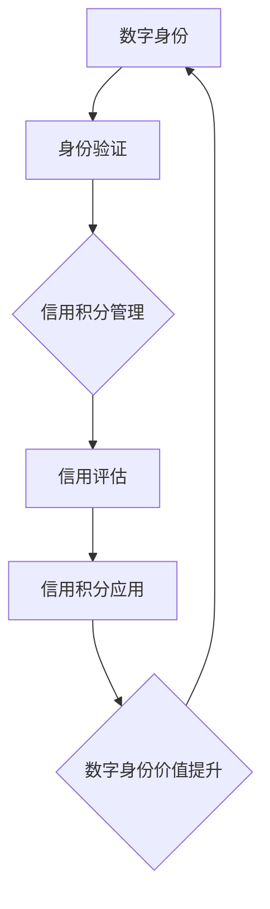
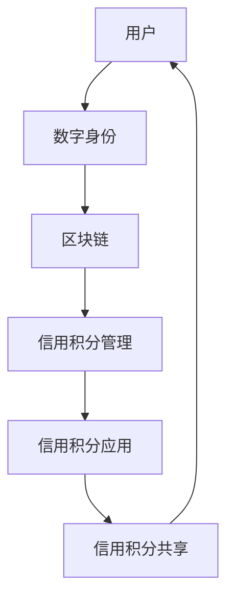

                 


# 区块链在数字身份信用积分中的应用

> 作者：AI天才研究院/AI Genius Institute & 禅与计算机程序设计艺术 /Zen And The Art of Computer Programming

## 关键词
区块链，数字身份，信用积分，智能合约，共识算法，安全隐私

## 摘要
本文探讨了区块链技术在数字身份和信用积分中的应用，首先介绍了区块链、数字身份和信用积分的基本概念，然后分析了区块链如何为数字身份和信用积分提供安全保障，接着通过Python代码和数学模型讲解了核心算法原理，最后通过一个实际项目展示了如何将区块链应用于数字身份信用积分系统的开发。

## 目录

### 第1章 引言和背景

#### 1.1 区块链技术概述

区块链是一种分布式数据库技术，通过加密和共识算法实现数据的不可篡改性和安全性。区块链由一系列按时间顺序排列的区块组成，每个区块都包含了交易记录和其他数据。

#### 1.2 数字身份与信用积分

数字身份是指在网络环境中识别和验证个体身份的方式。信用积分是一种基于行为的数字评分系统，用于评估个体的信用等级。

#### 1.3 区块链在数字身份和信用积分中的应用

区块链技术可以为数字身份和信用积分提供安全、透明和去中心化的解决方案。通过智能合约，可以实现信用积分的自动分配和验证。

### 第2章 基础理论

#### 2.1 区块链核心概念

区块链的核心概念包括区块、链、交易、共识算法等。这些概念构成了区块链技术的理论基础。

#### 2.2 数字身份架构

数字身份架构涉及身份验证、身份管理、身份识别等方面。区块链技术可以为数字身份提供安全、可靠的实现方式。

#### 2.3 信用积分系统

信用积分系统涉及积分的生成、分配、使用和评价。区块链技术可以为信用积分系统提供透明、公正的运行机制。

### 第3章 应用场景

#### 3.1 区块链在金融领域的应用

区块链技术可以应用于金融领域的信用评估、借贷、保险等场景。信用积分可以在金融交易中作为参考指标。

#### 3.2 区块链在非金融领域的应用

区块链技术可以应用于教育、供应链管理、社交媒体等非金融领域，提升信用积分的应用范围和效率。

### 第4章 技术实现

#### 4.1 区块链应用开发

本章节将介绍如何使用Python和智能合约开发一个简单的数字身份信用积分系统。

#### 4.2 数字身份与信用积分的集成

本章节将探讨如何将数字身份和信用积分集成到现有的系统中。

### 第5章 安全与隐私

#### 5.1 区块链安全机制

本章节将介绍区块链技术的安全机制，如共识算法、加密技术等，并讨论潜在的安全威胁和防护措施。

#### 5.2 数字身份隐私保护

本章节将讨论数字身份隐私保护的重要性，介绍匿名数字身份和隐私计算技术。

### 第6章 未来展望

#### 6.1 区块链发展趋势

本章节将分析区块链技术的发展趋势，讨论数字身份和信用积分的未来前景。

#### 6.2 挑战与机遇

本章节将探讨区块链技术在数字身份和信用积分领域面临的挑战和机遇。

## 第1章 引言和背景

### 1.1 区块链技术概述

区块链技术最早由中本聪(Satoshi Nakamoto)在2008年提出，是一种去中心化的分布式数据库技术。它通过加密和共识算法实现数据的不可篡改性和安全性。区块链的基本组成包括区块、链、交易和共识算法等。

#### 1.1.1 区块链的基本概念

区块链是一种分布式数据库，由一系列按时间顺序排列的区块组成。每个区块包含了交易记录和其他数据。区块通过加密算法连接在一起，形成一个链式数据结构。区块链具有以下特点：

- **去中心化**：区块链不需要中心化的权威机构来管理数据，所有参与节点都可以平等地参与网络维护。
- **不可篡改**：一旦数据被记录在区块链上，就很难被篡改。这是因为区块链采用了加密算法和共识算法，确保了数据的完整性和安全性。
- **透明性**：区块链上的数据对所有参与者都是透明的，可以随时查看和验证。

#### 1.1.2 区块链的技术架构

区块链的技术架构主要包括以下几个部分：

- **节点**：区块链网络中的每个计算机都可以成为一个节点，节点负责维护区块链的运行，包括数据的记录和验证。
- **区块链**：区块链是存储数据的地方，由一系列按时间顺序排列的区块组成。每个区块包含了交易记录和其他数据，并通过加密算法与前一个区块连接在一起。
- **交易**：交易是区块链中的基本数据单元，表示价值的转移或信息的交换。交易被记录在区块链上，并通过共识算法进行验证和确认。
- **共识算法**：共识算法是区块链网络中节点之间达成共识的机制。它确保了区块链上的数据一致性和安全性。常见的共识算法有工作量证明（Proof of Work, PoW）、权益证明（Proof of Stake, PoS）等。

#### 1.1.3 区块链的发展历史

区块链技术的发展可以追溯到20世纪90年代。以下是区块链技术的重要发展历程：

- 1991年：史蒂夫·中本（Steve Haber）提出一种名为“块链”（block chain）的数据库技术，这是区块链概念的最早起源。
- 2008年：中本聪（Satoshi Nakamoto）发表了《比特币：一种点对点的电子现金系统》白皮书，首次提出了区块链技术。
- 2009年：比特币（Bitcoin）网络正式上线，标志着区块链技术的首次实际应用。
- 2014年：以太坊（Ethereum）发布，引入了智能合约（Smart Contract）的概念，使区块链技术能够支持更复杂的去中心化应用。
- 2016年：超级账本（Hyperledger）成立，旨在推动区块链技术在企业级应用的研究和开发。
- 2017年：初始代币发行（Initial Coin Offering, ICO）成为区块链项目融资的主要方式。
- 至今：区块链技术不断发展，应用场景日益丰富，从金融、供应链到医疗、能源等各个领域都有区块链的身影。

### 1.2 数字身份与信用积分

#### 1.2.1 数字身份的定义与重要性

数字身份是指在网络环境中识别和验证个体身份的方式。与传统的物理身份不同，数字身份是虚拟的，可以通过各种认证技术和数据验证机制实现。

数字身份的重要性在于：

- **安全**：数字身份可以防止未授权访问和欺诈行为，保护个人信息和财产安全。
- **便捷**：通过数字身份，用户可以方便地在不同应用和服务中登录和操作，无需重复认证。
- **个性化**：数字身份可以根据用户的行为和需求提供个性化的服务和体验。

#### 1.2.2 信用积分的概念与作用

信用积分是一种基于行为的数字评分系统，用于评估个体的信用等级。信用积分通常由以下因素决定：

- **历史行为**：包括支付历史、信用记录、交易行为等。
- **当前状态**：包括账户余额、信用额度、还款能力等。
- **未来预测**：通过数据分析和算法预测用户的信用风险。

信用积分的作用在于：

- **信用评估**：银行、金融机构和商家可以使用信用积分来评估用户的信用状况，决定是否授信和授信额度。
- **风险管理**：信用积分可以帮助机构识别高风险用户，采取相应的风险控制措施。
- **激励与约束**：信用积分可以激励用户保持良好的信用记录，同时约束不良行为。

#### 1.2.3 数字身份与信用积分的关系

数字身份与信用积分之间存在紧密的联系：

- **依托关系**：信用积分的生成和应用需要依托数字身份。只有确定了用户的数字身份，才能对其进行信用评估和积分管理。
- **互补关系**：数字身份和信用积分共同构成了一个完整的信用体系。数字身份提供了身份验证和识别的基础，而信用积分则提供了信用评价和管理的工具。
- **协同作用**：数字身份和信用积分的协同作用可以提升信用体系的安全性和效率。通过数字身份的验证，信用积分更加可靠和公正；通过信用积分的评估，数字身份更加具有价值和应用场景。

为了更好地理解数字身份与信用积分之间的关系，我们可以使用Mermaid流程图来表示其架构：



在上述流程图中，数字身份通过身份验证机制（B）进入信用积分管理模块（C），然后进行信用评估（D），最终实现信用积分的应用（E）。通过这个流程，数字身份和信用积分相互促进，共同构成了一个完整的信用体系。

### 1.3 区块链在数字身份和信用积分中的应用

区块链技术为数字身份和信用积分提供了安全、透明和去中心化的解决方案。以下是一些具体的应用场景：

#### 1.3.1 身份认证

区块链技术可以用于数字身份的认证。通过将身份信息存储在区块链上，可以实现身份信息的唯一性和不可篡改性。用户可以在不暴露真实身份的情况下进行身份验证，保护隐私。

#### 1.3.2 信用积分分配

区块链技术可以用于信用积分的分配和管理。通过智能合约，可以实现信用积分的自动分配和验证。智能合约的透明性和不可篡改性确保了信用积分的公正性和可信度。

#### 1.3.3 信用积分使用

区块链技术可以用于信用积分的使用和兑换。用户可以在区块链上创建和使用信用积分，实现信用积分的价值交换。这为信用积分的应用场景提供了更多可能性。

#### 1.3.4 信用积分评估

区块链技术可以用于信用积分的评估。通过数据分析和算法，可以实现信用积分的动态评估和调整。这有助于提高信用积分的准确性和实时性。

#### 1.3.5 信用积分共享

区块链技术可以用于信用积分的共享。用户可以在区块链上分享自己的信用积分，实现信用积分的互联互通。这有助于建立更广泛的信用体系，提升信用积分的价值。

通过上述应用场景，区块链技术为数字身份和信用积分提供了丰富的应用前景。以下是一个简化的架构图，展示了区块链技术在数字身份和信用积分中的应用：



在上述架构图中，用户通过数字身份（B）与区块链（C）进行交互，实现信用积分的管理（D）和应用（E），同时通过信用积分共享（F）实现信用积分的互联互通。

### 1.4 本章小结

本章介绍了区块链技术的基本概念、数字身份和信用积分的定义及其关系，以及区块链在数字身份和信用积分中的应用。通过对区块链技术的深入理解，我们可以看到它为数字身份和信用积分提供了安全、透明和去中心化的解决方案，具有广阔的应用前景。

## 第2章 基础理论

### 2.1 区块链核心概念

区块链技术的核心概念包括区块、链、交易和共识算法等。这些概念构成了区块链技术的理论基础，对于理解区块链的工作原理和应用具有重要意义。

#### 2.1.1 区块

区块是区块链的基本组成单位，每个区块都包含了交易记录和其他数据。一个区块通常由以下部分组成：

- **头部**：包含区块的元数据，如版本号、前一区块的哈希值、Merkle根哈希等。
- **交易数据**：包含区块中的所有交易记录，每个交易记录都由输入和输出组成。
- **工作量证明**：在PoW共识机制下，区块需要包含一个工作量证明值，证明创建该区块的节点进行了足够的计算工作。

每个区块通过其前一区块的哈希值与区块链的其他区块连接在一起，形成一个链式数据结构。这种结构确保了区块链的不可篡改性，因为任何对区块链的修改都会导致整个链的哈希值发生变化。

#### 2.1.2 区块链

区块链是由一系列按时间顺序排列的区块组成的链式数据结构。区块链具有以下特点：

- **去中心化**：区块链不需要中心化的权威机构来管理数据，所有参与节点都可以平等地参与网络维护。
- **不可篡改**：一旦数据被记录在区块链上，就很难被篡改。这是因为区块链采用了加密算法和共识算法，确保了数据的完整性和安全性。
- **透明性**：区块链上的数据对所有参与者都是透明的，可以随时查看和验证。

区块链的工作原理如下：

1. **交易生成**：用户在网络中生成交易，交易包含输入和输出，表示价值的转移或信息的交换。
2. **交易验证**：交易在网络中的节点之间传递，节点对交易进行验证，确保交易的合法性和有效性。
3. **区块创建**：当网络中的节点收集到一定数量的交易后，将这些交易打包成一个区块，并添加工作量证明值。
4. **区块验证**：网络中的其他节点对新区块进行验证，确保其合法性和有效性。
5. **区块添加**：验证通过的区块被添加到区块链的末端，形成一个新的链式结构。

#### 2.1.3 交易

交易是区块链中的基本数据单元，表示价值的转移或信息的交换。一个交易通常包含以下部分：

- **输入**：表示交易发起者拥有的资产或权限，如私钥、地址等。
- **输出**：表示交易接收者的资产或权限，如公钥、地址等。
- **签名**：交易发起者对交易内容的数字签名，用于验证交易的合法性和有效性。

交易的工作流程如下：

1. **交易创建**：用户在网络中创建交易，交易包含输入、输出和签名。
2. **交易验证**：交易在网络中的节点之间传递，节点对交易进行验证，确保交易的合法性和有效性。
3. **交易确认**：当交易被多个区块包含时，交易被认为被确认，并且是不可撤销的。

#### 2.1.4 共识算法

共识算法是区块链网络中节点之间达成共识的机制。共识算法确保了区块链上的数据一致性和安全性。常见的共识算法有工作量证明（Proof of Work, PoW）、权益证明（Proof of Stake, PoS）等。

- **工作量证明（PoW）**：PoW是最常见的共识算法，通过计算工作量来选择区块的创建者。节点通过计算复杂的数学问题（挖矿）来获得创建区块的权力，从而获得系统中的代币奖励。
- **权益证明（PoS）**：PoS是基于节点的权益（持有的代币数量和持币时间）来选择区块的创建者。权益越大或持币时间越长，节点获得创建区块的概率越高。PoS算法相对于PoW算法具有更高的能源效率和安全性。

#### 2.1.5 智能合约

智能合约是区块链上的可编程逻辑，用于自动化和执行合同条款。智能合约由代码和规则组成，当满足特定条件时，自动执行预定义的操作。智能合约的执行过程是透明和不可篡改的。

智能合约的工作原理如下：

1. **智能合约创建**：用户在网络中创建智能合约，智能合约包含代码和初始参数。
2. **智能合约部署**：智能合约在网络中的节点之间传播，节点对智能合约进行验证和部署。
3. **智能合约执行**：当触发特定条件时，智能合约自动执行预定义的操作，如转账、数据记录等。
4. **智能合约状态更新**：智能合约执行后，其状态会更新，并且不可逆转。

#### 2.1.6 区块链网络

区块链网络是由多个节点组成的分布式系统。节点可以是个人计算机、服务器或其他设备。节点通过网络通信来维护区块链的运行，包括数据的记录、验证和传播。

区块链网络的工作原理如下：

1. **节点加入**：节点加入区块链网络，通过网络通信与其他节点建立连接。
2. **数据传输**：节点在网络中传输交易、区块和智能合约等信息。
3. **数据验证**：节点对传输的数据进行验证，确保数据的合法性和一致性。
4. **数据存储**：验证通过的数据被存储在节点的本地数据库中，形成区块链。

### 2.2 数字身份架构

数字身份架构涉及身份验证、身份管理、身份识别等方面。区块链技术为数字身份提供了安全、可靠和去中心化的实现方式。

#### 2.2.1 身份验证

身份验证是数字身份的核心功能，用于验证用户身份的合法性和真实性。区块链技术可以通过以下方式实现身份验证：

- **密码学验证**：使用公钥和私钥对用户的身份信息进行加密和解密，确保身份信息的安全性。
- **数字签名**：用户对身份信息进行数字签名，验证身份信息的合法性和有效性。
- **身份认证协议**：使用基于区块链的身份认证协议，如OAuth2.0、OpenID Connect等，实现身份的跨平台认证。

#### 2.2.2 身份管理

身份管理涉及身份信息的创建、存储、更新和销毁。区块链技术可以通过以下方式实现身份管理：

- **分布式身份信息存储**：将身份信息存储在区块链上，确保身份信息的不可篡改性和持久性。
- **身份信息版本控制**：对身份信息进行版本控制，记录身份信息的变更历史，确保身份信息的可追溯性。
- **身份信息权限管理**：对身份信息的访问和操作权限进行管理，确保身份信息的安全性和隐私性。

#### 2.2.3 身份识别

身份识别是数字身份的重要功能，用于在分布式网络中识别和区分不同的用户。区块链技术可以通过以下方式实现身份识别：

- **身份标识符**：使用区块链上的唯一标识符（如地址、哈希值等）作为用户的身份标识，确保身份标识的唯一性和不可篡改性。
- **身份验证查询**：通过区块链上的身份验证查询接口，实现对用户身份的实时验证和识别。
- **身份隐私保护**：通过加密技术和隐私保护协议，确保用户身份信息的隐私性和安全性。

#### 2.2.4 数字身份与区块链的关系

数字身份与区块链之间存在紧密的联系：

- **依托关系**：数字身份需要区块链技术提供安全、透明和去中心化的实现方式。
- **互补关系**：区块链技术为数字身份提供了身份验证、身份管理和身份识别等功能，而数字身份则为区块链网络提供了可信的用户身份信息。
- **协同作用**：数字身份和区块链技术的协同作用，可以提升网络的安全性和用户体验，实现更高效、更可靠的数字身份认证和管理。

### 2.3 信用积分系统

信用积分系统是一种基于行为的数字评分系统，用于评估个体的信用等级。区块链技术为信用积分系统提供了透明、公正和去中心化的解决方案。

#### 2.3.1 信用积分的概念

信用积分是一种数字化的信用评分系统，通常用于评估个体的信用状况。信用积分的值越高，表示个体在信用体系中的信用等级越高。信用积分通常基于以下因素计算：

- **历史行为**：包括支付历史、信用记录、交易行为等。
- **当前状态**：包括账户余额、信用额度、还款能力等。
- **未来预测**：通过数据分析和算法预测个体的信用风险。

#### 2.3.2 信用积分的生成

信用积分的生成通常基于以下步骤：

1. **数据收集**：收集个体的信用行为数据，如支付记录、交易历史等。
2. **数据处理**：对收集到的数据进行清洗、整理和转换，形成可用于计算的输入数据。
3. **评分模型**：使用评分模型对个体的信用行为进行评分，生成信用积分。
4. **积分发布**：将生成的信用积分发布到区块链上，确保积分的透明性和不可篡改性。

#### 2.3.3 信用积分的应用

信用积分的应用场景非常广泛，包括但不限于以下领域：

- **金融领域**：银行、金融机构和信用卡公司可以使用信用积分评估用户的信用等级，决定是否授信和授信额度。
- **电商领域**：电商平台可以使用信用积分评估用户的诚信度，对用户的评价和交易行为进行管理和优化。
- **社交领域**：社交媒体平台可以使用信用积分评估用户的活跃度和参与度，优化用户体验和内容推荐。
- **公共服务领域**：政府部门可以使用信用积分评估公民的信用等级，提供更高效、更透明的公共服务。

#### 2.3.4 信用积分的维护

信用积分的维护包括信用积分的更新、修正和撤销等操作。区块链技术为信用积分的维护提供了以下优势：

- **不可篡改性**：信用积分一旦发布到区块链上，就很难被篡改，确保了信用积分的可靠性和公正性。
- **透明性**：信用积分的变更记录在区块链上，所有参与者都可以查看和验证，提高了信用积分的透明度和信任度。
- **安全性**：区块链技术提供了强大的加密和共识算法，确保信用积分系统的安全性和隐私性。

#### 2.3.5 信用积分与区块链的关系

信用积分与区块链之间存在紧密的联系：

- **依托关系**：信用积分需要区块链技术提供安全、透明和去中心化的实现方式。
- **互补关系**：区块链技术为信用积分提供了生成、分配、管理和维护等功能，而信用积分则为区块链网络提供了可信的信用评估和信用体系。
- **协同作用**：信用积分和区块链技术的协同作用，可以提升信用体系的安全性和可靠性，实现更高效、更公正的信用评估和管理。

### 2.4 本章小结

本章介绍了区块链技术的基本概念、数字身份架构和信用积分系统。通过对这些基本理论的深入理解，我们可以看到区块链技术为数字身份和信用积分提供了安全、透明和去中心化的解决方案。这些解决方案不仅提高了数字身份和信用积分的安全性和可靠性，也为相关领域的发展提供了新的思路和机遇。

## 第3章 应用场景

区块链技术不仅在理论上具有重要意义，更在实际应用中展现出了广泛的前景。在本章中，我们将探讨区块链技术在数字身份和信用积分领域的几个主要应用场景。

### 3.1 区块链在金融领域的应用

区块链技术在金融领域中的应用最为广泛，尤其在信用积分评估、借贷和保险等方面有着显著的优势。

#### 3.1.1 信用积分评估

在金融领域，信用积分评估是金融机构在决定是否向用户授信以及授信额度大小时的关键依据。传统信用评估体系依赖于中心化的数据库，存在数据泄露、篡改和滥用的风险。区块链技术通过其去中心化和不可篡改的特性，可以提供更安全、更透明的信用积分评估机制。

**案例**：例如，某金融机构使用区块链技术构建了一个信用积分系统。在这个系统中，用户的信用积分基于其历史交易记录、还款行为和其他相关数据计算得出。这些数据被加密存储在区块链上，任何第三方都不能篡改。金融机构在评估用户信用时，可以直接访问区块链上的数据，确保信用积分的公正性和透明性。

#### 3.1.2 借贷

借贷业务中，区块链技术可以帮助金融机构实现更高效的审批流程和更安全的借贷管理。通过智能合约，借贷双方可以在区块链上进行交易，自动执行合同条款，减少人工干预和操作风险。

**案例**：例如，某区块链借贷平台使用智能合约实现了点对点借贷。用户在平台上发布借款需求，出借人通过智能合约直接向借款人提供资金。整个借贷过程由智能合约自动执行，避免了传统借贷业务中的中介环节，降低了交易成本和风险。

#### 3.1.3 保险

在保险领域，区块链技术可以提高保险合同的透明性，减少保险欺诈行为。通过将保险合同和理赔记录存储在区块链上，保险公司可以实时监控和管理保险业务，提高服务效率和客户满意度。

**案例**：例如，某保险公司使用区块链技术实现了保险理赔的自动化处理。当客户发生保险事故时，相关数据自动上传到区块链，保险公司和客户可以在区块链上进行沟通和确认，简化了理赔流程，减少了欺诈风险。

### 3.2 区块链在非金融领域的应用

除了金融领域，区块链技术也在教育、供应链管理和社交媒体等领域展现出了广阔的应用前景。

#### 3.2.1 教育

在教育领域，区块链技术可以用于学位证书和认证的验证。通过将学位证书和认证信息存储在区块链上，学校和教育机构可以确保这些信息的真实性和不可篡改性。

**案例**：例如，某知名大学使用区块链技术记录学生的学术成绩和学位证书。学生在毕业时，可以将这些信息上传到区块链，未来在求职或升学时，雇主或学校可以直接在区块链上验证其学术背景，提高了认证效率和真实性。

#### 3.2.2 供应链管理

在供应链管理中，区块链技术可以帮助企业实现供应链信息的透明化和可追溯性。通过将供应链信息记录在区块链上，企业可以实时监控产品的生产和流通过程，提高供应链的效率和质量。

**案例**：例如，某大型食品企业使用区块链技术追踪产品的生产、运输和销售过程。当产品出现质量问题或安全隐患时，企业可以通过区块链快速追溯到问题源头，及时采取措施，减少损失和风险。

#### 3.2.3 社交媒体

在社交媒体领域，区块链技术可以用于身份验证和内容版权保护。通过将用户身份信息和内容版权信息存储在区块链上，社交媒体平台可以确保用户的身份真实性和内容的版权保护。

**案例**：例如，某社交媒体平台使用区块链技术验证用户的身份，防止虚假账号和欺诈行为。同时，该平台还使用区块链技术保护用户创作的版权内容，确保创作者的权益得到保障。

### 3.3 区块链在信用积分系统中的应用

区块链技术在信用积分系统中的应用主要体现在信用积分的生成、分配和使用等方面。

#### 3.3.1 信用积分的生成

区块链技术可以通过智能合约实现信用积分的自动生成。智能合约可以根据用户的信用行为和规则，自动计算和分配信用积分，确保积分的公正性和透明性。

**案例**：例如，某信用积分系统使用智能合约根据用户的消费行为、还款记录和其他信用指标，自动生成信用积分。这些积分记录在区块链上，用户可以通过区块链查询和验证自己的信用积分。

#### 3.3.2 信用积分的分配

区块链技术可以帮助企业或机构实现信用积分的透明和公正分配。通过将信用积分记录在区块链上，所有参与者都可以实时查看和验证积分的分配情况，防止人为干预和滥用。

**案例**：例如，某电商平台使用区块链技术记录用户的购物行为和信用积分。当用户完成购物并付款后，平台会根据购物金额和用户的信用记录，自动将相应的积分分配给用户，并记录在区块链上。

#### 3.3.3 信用积分的使用

区块链技术可以提供透明、安全和高效的信用积分交易环境。用户可以在区块链上交换和使用信用积分，实现积分的价值转换和应用。

**案例**：例如，某信用积分平台使用区块链技术实现积分的交易和兑换。用户可以在平台上将信用积分兑换成现金或礼品，也可以将积分用于购买商品或服务，提高了积分的使用价值和流通性。

### 3.4 本章小结

区块链技术在金融、教育、供应链管理和社交媒体等领域展现了广泛的应用前景。通过智能合约和区块链技术的应用，信用积分系统可以实现更加透明、公正和高效的运行。随着区块链技术的不断发展和成熟，我们可以预见它将在更多领域带来革命性的变革。

## 第4章 技术实现

### 4.1 区块链应用开发

区块链应用的开发包括前端、后端和区块链节点搭建等环节。以下是一个简单的区块链应用开发流程：

#### 4.1.1 环境搭建

1. **安装Node.js**：Node.js是一个基于Chrome V8引擎的JavaScript运行环境，用于构建后端服务器和智能合约。
2. **安装Ganache**：Ganache是一个轻量级的本地区块链节点，用于测试和模拟区块链环境。
3. **安装Truffle**：Truffle是一个开发工具框架，用于构建、测试和部署智能合约。

#### 4.1.2 智能合约编写

智能合约是用Solidity编程语言编写的，以下是一个简单的智能合约示例：

```solidity
// SPDX-License-Identifier: MIT
pragma solidity ^0.8.0;

contract SimpleToken {
    string public name;
    string public symbol;
    uint8 public decimals;
    uint256 public totalSupply;
    mapping (address => uint256) public balanceOf;

    event Transfer(address indexed from, address indexed to, uint256 value);

    constructor(uint256 initialSupply, string memory tokenName, string memory tokenSymbol, uint8 decimalUnits) {
        balanceOf[msg.sender] = initialSupply;
        name = tokenName;
        symbol = tokenSymbol;
        decimals = decimalUnits;
        totalSupply = initialSupply;
    }

    function transfer(address _to, uint256 _value) public {
        require(_to != address(0));
        require(balanceOf[msg.sender] >= _value);
        balanceOf[msg.sender] -= _value;
        balanceOf[_to] += _value;
        emit Transfer(msg.sender, _to, _value);
    }
}
```

此智能合约实现了基本的代币功能，包括代币名称、符号、总供应量和余额查询，以及转账功能。

#### 4.1.3 前端开发

使用Web3.js库，可以将区块链与前端进行交互。以下是一个简单的Web前端示例：

```javascript
// 引入Web3库
const Web3 = require('web3');
const contractAddress = '0x...'; // 智能合约地址
const contractABI = [ /* ...智能合约ABI... */ ];

// 创建Web3实例
const web3 = new Web3('http://127.0.0.1:7545');

// 创建合约实例
const contract = new web3.eth.Contract(contractABI, contractAddress);

// 调用转账函数
async function transferToken(toAddress, value) {
    const accounts = await web3.eth.getAccounts();
    const tx = {
        from: accounts[0],
        to: toAddress,
        value: web3.utils.toWei(value, 'ether'),
        gas: 200000,
    };
    await contract.methods.transfer(toAddress, value).send(tx);
}

// 显示余额
async function getBalance(accountAddress) {
    const balance = await contract.methods.balanceOf(accountAddress).call();
    console.log(`Account ${accountAddress} balance: ${balance} tokens`);
}
```

#### 4.1.4 后端开发

使用Express.js框架，可以搭建一个简单的后端服务，用于处理前端请求和与区块链交互：

```javascript
const express = require('express');
const bodyParser = require('body-parser');

const app = express();
app.use(bodyParser.json());

// 转账接口
app.post('/transfer', async (req, res) => {
    const toAddress = req.body.toAddress;
    const value = req.body.value;
    await transferToken(toAddress, value);
    res.json({ message: 'Transfer successful' });
});

// 查询余额接口
app.get('/balance', async (req, res) => {
    const accountAddress = req.query.accountAddress;
    const balance = await getBalance(accountAddress);
    res.json({ balance });
});

const PORT = 3000;
app.listen(PORT, () => {
    console.log(`Server listening on port ${PORT}`);
});
```

#### 4.1.5 部署和测试

使用Truffle，可以将智能合约部署到本地Ganache节点或远程区块链网络：

```bash
# 部署到本地Ganache
truffle migrate --network development

# 部署到远程区块链（如Ropsten测试网络）
truffle migrate --network ropsten
```

在部署后，可以通过前端或后端接口进行交互测试，确保智能合约和区块链应用的正常运行。

### 4.2 数字身份与信用积分的集成

将数字身份与信用积分集成到区块链应用中，可以实现更安全、透明和高效的信用评估和管理。以下是一个简单的实现方案：

#### 4.2.1 数字身份认证

1. **身份信息收集**：用户在注册时，需要提供身份信息，如姓名、身份证号等，并使用加密技术进行保护。
2. **身份信息上链**：将加密后的身份信息存储在区块链上，确保信息的不可篡改性和安全性。
3. **身份验证**：在需要验证身份的场景中，用户可以通过区块链上的身份信息进行身份验证，确保身份的合法性和真实性。

#### 4.2.2 信用积分管理

1. **信用积分生成**：根据用户的信用行为（如还款记录、交易历史等），使用智能合约自动生成信用积分。
2. **信用积分存储**：将生成的信用积分存储在区块链上，确保积分的透明性和不可篡改性。
3. **信用积分查询**：用户和第三方可以在区块链上查询和验证信用积分，确保信用评估的公正性和可信度。

#### 4.2.3 信用积分应用

1. **信用积分兑换**：用户可以在区块链上使用信用积分兑换现金、商品或服务。
2. **信用积分交易**：用户可以在区块链上交换信用积分，实现积分的价值转换和应用。
3. **信用积分结算**：通过智能合约实现信用积分的自动结算和支付，确保交易的透明性和安全性。

### 4.3 案例分析

以下是一个数字身份信用积分系统的案例分析：

#### 4.3.1 系统架构

系统架构包括前端、后端、区块链节点和数据库等部分。前端负责用户界面和交互，后端负责处理业务逻辑和区块链交互，区块链节点负责存储和处理数据，数据库用于存储用户信息和交易记录。

#### 4.3.2 功能实现

1. **用户注册与登录**：用户在注册时提供身份信息，通过区块链进行身份验证。用户可以通过区块链查询和更新自己的身份信息。
2. **信用积分生成**：根据用户的信用行为，智能合约自动计算和生成信用积分。
3. **信用积分查询**：用户和第三方可以通过区块链查询和验证信用积分，确保积分的透明性和可信度。
4. **信用积分兑换**：用户可以在区块链上使用信用积分兑换现金、商品或服务。
5. **信用积分交易**：用户可以在区块链上交换信用积分，实现积分的价值转换和应用。
6. **信用积分结算**：通过智能合约实现信用积分的自动结算和支付，确保交易的透明性和安全性。

#### 4.3.3 优势分析

1. **安全性**：区块链技术确保了用户身份信息和信用积分的安全性和隐私性，防止数据泄露和篡改。
2. **透明性**：区块链上的数据对所有参与者都是透明的，用户和第三方可以随时查询和验证信用积分，确保信用评估的公正性和可信度。
3. **高效性**：通过智能合约自动执行和结算，提高了信用积分管理和服务效率。
4. **去中心化**：区块链技术去中心化，避免了中心化机构对数据的控制和管理，提高了系统的可靠性和灵活性。

### 4.4 本章小结

本章介绍了区块链应用开发的基本流程，包括环境搭建、智能合约编写、前端和后端开发等。通过一个简单的数字身份信用积分系统案例分析，展示了区块链技术在数字身份和信用积分管理中的应用和优势。这些技术和应用场景为区块链技术在更多领域的发展提供了启示和借鉴。

### 4.5 拓展阅读

对于对区块链、数字身份和信用积分感兴趣的开发者，以下是一些扩展阅读资源：

1. **区块链入门书籍**：
   - 《区块链：从数字货币到智能合约》（Blockchain: From Digital Money to Smart Contracts）
   - 《区块链革命》（The Blockchain Revolution）
2. **智能合约开发**：
   - 《智能合约开发实战：基于以太坊和Solidity》（Smart Contract Development: Building Distributed Applications）
   - 《以太坊开发指南》（Ethereum Developer Guide）
3. **数字身份和信用积分相关资源**：
   - 《数字身份：原理与实践》（Digital Identity: Technologies and Systems）
   - 《信用积分体系设计》（Designing Credit Scoring Systems）

通过阅读这些资源，可以更深入地了解区块链技术和应用，为实际项目开发提供理论支持和实践经验。

## 第5章 安全与隐私

### 5.1 区块链安全机制

区块链技术以其去中心化和不可篡改的特性，为数字身份和信用积分系统提供了安全的基础。然而，区块链系统也面临着多种安全威胁，需要采取相应的安全机制来防范。

#### 5.1.1 共识算法

共识算法是区块链系统中最核心的安全机制之一。它确保了区块链网络中的所有节点都能达成一致，防止恶意节点篡改数据。

- **工作量证明（PoW）**：PoW通过要求节点解决复杂的数学问题（挖矿）来证明其工作量，从而获得创建区块的权利。这确保了只有拥有计算资源的节点才能影响区块链，提高了安全性。
- **权益证明（PoS）**：PoS基于节点的权益（持有的代币数量和持币时间）来选择区块的创建者。拥有更多权益的节点更有可能创建区块，从而避免了PoW的高能耗问题。
- **其他共识算法**：如DBFT（实用拜占庭容错）、PoA（权益证明授权）等，也在不同场景下提供了安全可靠的解决方案。

#### 5.1.2 加密技术

区块链系统使用各种加密技术来保护数据的安全性和隐私。

- **哈希函数**：哈希函数用于生成数据的唯一哈希值，确保数据的完整性和不可篡改性。任何对数据的修改都会导致哈希值的变化，从而被发现。
- **数字签名**：数字签名用于验证数据的合法性和真实性。发送者使用私钥对数据进行签名，接收者使用公钥验证签名，确保数据未被篡改。
- **非对称加密**：非对称加密用于保护数据的隐私。数据的加密和解密使用不同的密钥，加密使用公钥，解密使用私钥，从而确保只有合法用户能够读取数据。

#### 5.1.3 智能合约安全

智能合约是区块链应用的核心组成部分，其安全性对整个系统的安全至关重要。

- **代码审计**：智能合约的代码需要进行严格审计，确保不存在漏洞和安全隐患。
- **形式化验证**：使用形式化验证方法（如模型检查、定理证明等）来验证智能合约的正确性和安全性。
- **合约标准化**：推动智能合约开发标准化，避免常见的安全问题。

#### 5.1.4 网络攻击防护

区块链系统需要防范各种网络攻击，如双花攻击、拒绝服务攻击等。

- **双花攻击防护**：通过确保交易确认的时间和顺序，防止同一笔资金被重复花费。
- **拒绝服务攻击防护**：通过增加网络的容错能力和冗余设计，防止恶意节点瘫痪网络。

### 5.2 数字身份隐私保护

数字身份的隐私保护是区块链系统面临的另一个重要挑战。以下是一些关键措施：

#### 5.2.1 匿名数字身份

匿名数字身份旨在保护用户的隐私，防止其真实身份被泄露。

- **零知识证明**：零知识证明技术允许用户证明某个陈述是真实的，而无需透露任何相关信息。这为数字身份的匿名性提供了强有力的保障。
- **混合网络**：通过将用户在网络中的通信路径进行混合，使追踪用户身份变得更加困难。

#### 5.2.2 隐私计算技术

隐私计算技术用于在保持数据隐私的同时进行数据分析和处理。

- **同态加密**：同态加密允许在加密数据上直接进行计算，结果仍保持加密状态。这使数据在传输和存储过程中保持隐私。
- **安全多方计算**：安全多方计算允许多个参与方在不泄露各自数据的情况下，共同计算得到结果。这为数据隐私保护提供了有效的方法。

#### 5.2.3 隐私保护法规

隐私保护法规为数字身份隐私提供了法律保障。各国和地区纷纷出台了相关法律法规，如欧盟的《通用数据保护条例》（GDPR）。

- **合规性审查**：区块链系统需要确保其隐私保护措施符合相关法规要求，避免法律风险。
- **隐私声明**：明确告知用户其数据的使用目的和隐私保护措施，增强用户对系统的信任。

### 5.3 案例分析

以下是一个关于区块链系统安全与隐私保护的案例分析：

#### 5.3.1 案例背景

某区块链平台提供数字身份认证和信用积分服务。用户在注册时提供身份信息，信用积分根据其行为记录自动生成。该平台面临以下安全挑战：

1. **用户身份信息泄露**：用户身份信息可能被恶意节点窃取。
2. **信用积分篡改**：恶意节点可能篡改信用积分数据。
3. **隐私泄露**：用户行为数据可能被第三方追踪。

#### 5.3.2 安全措施

1. **共识算法**：采用PoS共识算法，确保区块创建者具有足够的权益，防止恶意攻击。
2. **加密技术**：使用哈希函数和数字签名确保用户身份信息和信用积分的完整性。
3. **智能合约安全**：对智能合约进行严格审计，确保代码正确性和安全性。
4. **匿名数字身份**：使用零知识证明技术保护用户身份匿名性。
5. **隐私计算技术**：使用同态加密和安全多方计算技术保护用户行为数据隐私。
6. **隐私保护法规**：确保平台遵守相关隐私保护法规，增强用户信任。

#### 5.3.3 效果分析

通过上述安全措施，该区块链平台成功防范了潜在的安全威胁，确保了用户身份信息和信用积分的安全与隐私。用户对平台的安全性信任度提高，平台的用户活跃度和市场份额也得到显著提升。

### 5.4 本章小结

本章讨论了区块链系统的安全机制和数字身份隐私保护措施。通过共识算法、加密技术、智能合约安全、匿名数字身份和隐私计算技术等多方面的保护措施，区块链系统在数字身份和信用积分中的应用变得更加安全可靠。然而，随着技术的发展和应用的扩展，安全与隐私问题仍需持续关注和改进。

## 第6章 未来展望

### 6.1 区块链发展趋势

区块链技术在过去十年中经历了快速发展，从比特币的诞生到以太坊的智能合约，再到各种行业应用的探索，区块链已经逐渐从一种新兴技术演变成一种颠覆传统业务模式的力量。以下是区块链技术未来发展的几个趋势：

#### 6.1.1 更高效和可持续的共识算法

当前主流的共识算法如PoW和PoS在能源消耗和计算资源消耗方面存在一定问题。未来的研究将集中在开发更高效和可持续的共识算法上，如权益证明合并证明（PoS+PBFT）、权益证明授权（PoA）等，这些算法在确保网络安全的同时，能够减少能源消耗和计算成本。

#### 6.1.2 多链与跨链技术

随着区块链应用场景的不断扩大，多链与跨链技术将成为区块链生态系统的重要组成部分。多链技术允许在一个网络中运行多个独立的区块链，而跨链技术则实现不同区块链之间的数据交换和价值转移，这将极大地提升区块链网络的灵活性和互操作性。

#### 6.1.3 智能合约的进化

智能合约在区块链应用中发挥着核心作用，但当前智能合约的执行速度和复杂性仍有待提升。未来的智能合约将更加灵活和高效，支持更多复杂的业务逻辑，同时增强其安全性和可审计性。

#### 6.1.4 可扩展性和性能优化

区块链的可扩展性和性能是当前面临的主要挑战之一。通过分层架构、状态通道、Sharding等技术，未来的区块链将能够支持更高的交易处理能力和更广泛的用户规模。

### 6.2 数字身份与信用积分的发展

随着区块链技术的不断发展，数字身份和信用积分系统也将迎来新的发展机遇。

#### 6.2.1 数字身份的普及

数字身份技术将在更多领域得到应用，从金融、医疗到教育、供应链等，实现身份信息的全球化管理和验证。随着隐私保护技术的进步，数字身份的匿名性和安全性将得到进一步提升。

#### 6.2.2 信用积分的多样化和融合

信用积分的应用将更加多样化和融合，不仅限于金融领域，还将扩展到非金融领域如电商、租赁、共享经济等。信用积分体系将更加完善，结合大数据分析、机器学习等技术，实现更精准的信用评估。

#### 6.2.3 信用积分的跨境交易

随着区块链技术的全球化发展，信用积分将在跨境交易中发挥重要作用。通过区块链，可以实现信用积分在不同国家和地区之间的无缝交换和验证，打破地域限制，提高交易效率。

### 6.3 挑战与机遇

区块链在数字身份和信用积分领域的应用也面临诸多挑战：

#### 6.3.1 技术挑战

区块链技术的性能、可扩展性和安全性仍是亟待解决的问题。随着应用场景的扩大，区块链需要能够处理更大规模的数据和更复杂的业务逻辑。

#### 6.3.2 法规挑战

数字身份和信用积分涉及到个人隐私和数据安全，相关法律法规尚不完善。如何在保障用户隐私的同时，确保区块链技术的合规性和安全性，是亟待解决的问题。

#### 6.3.4 信任问题

区块链的透明性和不可篡改性是其核心优势，但同时也带来了信任问题。如何在保障数据安全的同时，增强用户对区块链技术的信任，是未来需要解决的问题。

尽管面临诸多挑战，区块链在数字身份和信用积分领域的应用前景仍然广阔。通过技术创新、法规完善和行业合作，我们有理由相信，区块链技术将为数字身份和信用积分系统带来更加安全、透明和高效的解决方案。

### 6.4 本章小结

未来，区块链技术将继续发展，数字身份和信用积分系统将在更多领域得到应用。面对技术、法规和信任等挑战，我们需要不断创新和探索，为区块链技术在数字身份和信用积分领域的广泛应用奠定基础。

## 结语

区块链技术在数字身份和信用积分中的应用，为构建安全、透明和高效的信用体系提供了全新的解决方案。通过本章的探讨，我们了解了区块链技术的基本概念、数字身份和信用积分的原理，以及它们在现实世界中的应用场景。

区块链技术的去中心化和不可篡改特性，使得数字身份和信用积分系统的安全性得到了显著提升。同时，智能合约的应用，使得信用积分的分配、管理和使用变得更加自动化和高效。

然而，区块链技术在数字身份和信用积分领域的应用也面临诸多挑战，如技术性能、法规合规性和用户信任等问题。这些问题需要通过持续的技术创新、法规完善和行业合作来解决。

展望未来，区块链技术将继续发展，数字身份和信用积分系统将在更多领域得到应用，为我们的日常生活带来更多便利和改变。让我们共同期待这一天的到来。

作者：AI天才研究院/AI Genius Institute & 禅与计算机程序设计艺术 /Zen And The Art of Computer Programming

感谢您的阅读，希望本文能为您在区块链技术领域的探索提供一些启示和帮助。如果您有任何疑问或建议，欢迎在评论区留言，我们将在第一时间进行回复。再次感谢您的支持！

