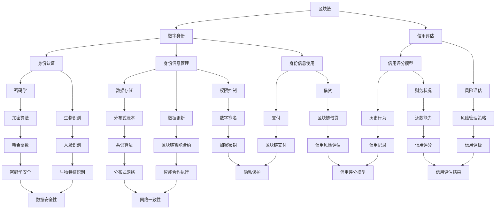

                 

### 《区块链在数字身份信用评估中的去中心化应用》

#### 关键词：区块链、数字身份、信用评估、去中心化应用、智能合约

#### 摘要：
本文深入探讨了区块链在数字身份信用评估中的应用，通过介绍区块链的基本概念、技术原理，分析其在数字身份和信用评估中的优势与挑战，提供具体的应用实例与案例分析，最后对未来发展趋势进行展望。文章旨在为读者提供一个全面而详尽的了解，帮助他们在实际项目中更好地应用区块链技术。

### 1. 区块链、数字身份与信用评估概述

#### 1.1 区块链基本概念

区块链是一种分布式数据库技术，其核心特点包括去中心化、不可篡改、安全透明等。区块链由多个区块组成，每个区块包含一定数量的交易记录，这些区块按照时间顺序连接成链。每个区块通过密码学技术保证数据的安全性和完整性。

区块链的关键特性如下：

1. **去中心化**：区块链没有中央控制机构，所有节点共同维护账本，提高了系统的容错能力和抗攻击性。
2. **不可篡改**：区块链通过密码学算法确保数据的不可篡改性，一旦数据被记录在区块链上，将难以被篡改。
3. **安全透明**：区块链上的所有数据都是公开透明的，参与者可以查看任何交易记录，保证了数据的透明性和可信度。

#### 1.2 数字身份

数字身份是指个人或实体在数字世界中的身份标识。随着互联网的发展，数字身份的重要性日益凸显。数字身份不仅包括身份认证，还包括身份信息的存储、管理和使用。

数字身份的关键要素包括：

1. **身份认证**：确保用户身份的真实性，常见的身份认证技术有密码学、生物识别等。
2. **身份信息管理**：包括身份信息的存储、更新和权限控制，保障用户隐私和安全。
3. **身份信息使用**：在数字世界中，用户需要使用身份信息进行各种操作，如支付、借贷等。

#### 1.3 信用评估

信用评估是指对个人或实体的信用状况进行评估，以判断其偿还债务的能力。信用评估在金融领域具有重要应用，如借贷、信用卡申请等。

信用评估的基本原理包括：

1. **信用评分模型**：根据用户的历史行为、财务状况等因素，构建数学模型进行评分。
2. **风险评估**：通过对信用评分的分析，评估用户的信用风险，制定相应的风险管理策略。

#### 1.4 区块链与数字身份、信用评估的联系

区块链在数字身份和信用评估中具有独特的优势。首先，区块链的去中心化特性使得数字身份的管理更加透明、可信。其次，区块链的不可篡改性确保了用户信用记录的完整性和真实性。此外，区块链的智能合约技术可以自动化执行信用评估流程，提高效率。

### 1.5 Mermaid流程图：区块链、数字身份与信用评估的关系



通过以上Mermaid流程图，我们可以清晰地看到区块链、数字身份与信用评估之间的联系和交互关系。接下来，我们将深入探讨区块链技术的基础，以及如何将其应用于数字身份和信用评估。

### 2. 区块链技术基础

#### 2.1 分布式账本

分布式账本是区块链的核心概念之一。它是一种去中心化的数据存储方式，通过多个节点共同维护一个共享的账本。在分布式账本中，每个节点都存储了一份完整的账本副本，从而保证了数据的一致性和可靠性。

分布式账本的关键特点包括：

1. **去中心化**：没有中央控制节点，所有节点都具有平等的地位，提高了系统的容错能力和抗攻击性。
2. **数据一致性**：通过共识算法，确保所有节点上的账本副本保持一致。
3. **数据安全性**：每个节点都使用密码学技术对数据进行加密，确保数据在传输和存储过程中的安全性。

#### 2.2 智能合约

智能合约是区块链上的自动化执行协议。它是一种自执行合同，通过代码定义了一系列条件，当条件满足时，智能合约将自动执行相应的操作。智能合约的关键特性包括：

1. **自动化执行**：智能合约的执行过程是自动化的，一旦条件满足，智能合约将自动执行。
2. **透明性**：智能合约的代码是公开透明的，所有参与者都可以查看和验证。
3. **安全性**：智能合约使用密码学技术确保其安全性，一旦部署，智能合约的代码将不可更改。

#### 2.3 区块链上的信用评估算法

在区块链上实现信用评估算法，需要考虑以下几个关键步骤：

1. **数据收集**：从各种来源收集用户的历史行为数据、财务状况等，作为信用评估的基础。
2. **数据清洗**：对收集到的数据进行清洗，去除无效和错误的数据，确保数据的质量。
3. **建模**：根据历史数据和业务需求，构建信用评分模型。
4. **评分计算**：使用信用评分模型对用户进行评分。
5. **结果验证**：对评分结果进行验证，确保评分的准确性和可靠性。
6. **记录**：将评分结果记录在区块链上，确保数据的不可篡改性。

下面是一个简单的Python伪代码示例，用于在区块链上实现信用评估算法：

```python
# 导入所需的库
import hashlib
import json

# 定义信用评分模型
def credit_score_model(data):
    # 根据历史行为和财务状况计算信用评分
    score = ...
    return score

# 定义智能合约函数
def credit_evaluation(user_data):
    # 收集用户数据
    data = user_data
    
    # 数据清洗
    clean_data = clean_data(data)
    
    # 计算信用评分
    score = credit_score_model(clean_data)
    
    # 记录评分结果
    record_score(score)
    
    # 返回评分结果
    return score

# 定义数据清洗函数
def clean_data(data):
    # 去除无效和错误的数据
    clean_data = ...
    return clean_data

# 定义记录评分结果的函数
def record_score(score):
    # 将评分结果记录在区块链上
    block = ...
    blockchain.add_block(block)
```

在这个示例中，`credit_score_model` 函数用于根据用户数据计算信用评分，`clean_data` 函数用于数据清洗，`record_score` 函数用于将评分结果记录在区块链上。智能合约函数 `credit_evaluation` 负责执行整个信用评估流程。

通过上述示例，我们可以看到区块链在信用评估中的应用是如何实现的。接下来，我们将通过具体的应用实例，进一步探讨区块链在数字身份和信用评估中的实际应用。

### 3. 应用实例与案例分析

#### 3.1 案例一：数字身份认证

数字身份认证是区块链在数字身份管理中的一项重要应用。通过区块链技术，可以实现去中心化的身份认证，确保用户身份的真实性和安全性。

**案例背景与目标**：
某金融机构希望实现一个去中心化的身份认证系统，以减少欺诈和身份盗用风险。该系统需要确保用户身份的真实性，同时保护用户隐私。

**案例实施与效果**：

1. **数据收集**：用户在注册时，提供个人信息，如姓名、身份证号、手机号码等。
2. **身份认证**：使用密码学技术对用户数据进行加密，并生成唯一标识符，存储在区块链上。
3. **隐私保护**：区块链上的数据是公开透明的，但用户数据仅通过加密标识符进行记录，确保用户隐私。
4. **身份验证**：当用户需要访问金融机构的服务时，通过智能合约验证其身份，确保其身份的真实性。

**效果评估**：

通过去中心化的身份认证系统，金融机构成功减少了欺诈和身份盗用风险，提高了用户体验。用户无需重复提供身份信息，简化了注册和登录流程。

#### 3.2 案例二：信用评估与借贷

区块链在信用评估与借贷中的应用，旨在提高借贷效率和降低风险。通过区块链技术，可以实现去中心化的信用评估和借贷流程。

**案例背景与目标**：
某区块链借贷平台希望实现一个去中心化的信用评估和借贷系统，以降低运营成本和风险，提高用户体验。

**案例实施与效果**：

1. **数据收集**：借贷平台从各种来源收集用户的历史行为数据、财务状况等，用于信用评估。
2. **信用评估**：使用智能合约对用户进行信用评分，评分结果记录在区块链上，确保数据的不可篡改性。
3. **借贷流程**：用户在平台上发起借贷请求，通过区块链智能合约自动执行借贷流程，确保交易的透明性和安全性。
4. **风险控制**：通过智能合约和区块链技术，实现对借贷风险的实时监控和管理。

**效果评估**：

通过去中心化的信用评估和借贷系统，平台成功降低了运营成本和风险，提高了用户体验。用户可以快速获得借款，金融机构可以更精准地评估用户信用，降低借贷风险。

#### 3.3 案例三：供应链金融

区块链在供应链金融中的应用，可以优化供应链管理，提高融资效率，降低融资成本。

**案例背景与目标**：
某供应链金融平台希望实现一个基于区块链的供应链融资系统，以提高供应链的流动性和安全性。

**案例实施与效果**：

1. **数据共享**：供应链上的各方通过区块链共享交易数据，确保数据的真实性和透明性。
2. **信用评估**：使用区块链上的智能合约对供应链上的企业进行信用评估，评估结果记录在区块链上。
3. **融资流程**：供应链上的企业通过区块链平台发起融资请求，通过智能合约自动执行融资流程。
4. **风险控制**：通过区块链技术，实现对供应链融资风险的实时监控和管理。

**效果评估**：

通过基于区块链的供应链融资系统，平台成功提高了供应链的流动性和安全性。企业可以更快地获得融资，降低了融资成本，供应链管理更加高效和透明。

### 4. 未来展望

#### 4.1 区块链在数字身份信用评估中的潜在影响

区块链在数字身份信用评估中的应用，有望带来以下潜在影响：

1. **提高效率**：通过去中心化的信用评估和身份认证，可以简化流程，提高操作效率。
2. **降低成本**：减少人工干预和第三方服务，降低运营成本。
3. **增强安全性**：区块链的不可篡改性和透明性，提高了系统的安全性和可信度。
4. **隐私保护**：通过加密技术和隐私保护算法，保障用户隐私。

#### 4.2 面临的挑战

尽管区块链在数字身份信用评估中具有巨大潜力，但也面临以下挑战：

1. **技术成熟度**：区块链技术尚未完全成熟，需要进一步优化和完善。
2. **监管合规**：区块链应用的监管政策尚不明确，需要制定相应的法律法规。
3. **数据隐私**：如何在保护用户隐私的前提下，实现数据的共享和利用。
4. **用户接受度**：提高用户对区块链技术的认知和接受度。

#### 4.3 未来发展趋势与展望

未来，区块链在数字身份信用评估中的应用将呈现以下发展趋势：

1. **技术融合**：区块链与其他技术的结合，如人工智能、大数据等，将进一步提高信用评估的准确性和效率。
2. **跨行业应用**：区块链在金融、供应链、医疗等行业的广泛应用，将推动数字身份信用评估的普及。
3. **标准化**：制定统一的区块链标准，提高系统的互操作性和兼容性。
4. **国际合作**：加强国际合作，推动全球数字身份信用评估体系的建立。

### 附录

#### 附录A：区块链在数字身份信用评估中的应用工具与资源

**常用区块链平台**：
1. Ethereum
2. Bitcoin
3. Hyperledger Fabric
4. Ripple

**开发工具与库**：
1. Web3.js
2. Truffle
3. Remix IDE
4. Solidity

**资源与参考文献**：
1. "Blockchain for Dummies"
2. "Understanding Bitcoin and Cryptocurrency"
3. "Smart Contracts: The Essential Guide"

### 作者信息

**作者：** AI天才研究院/AI Genius Institute & 禅与计算机程序设计艺术 /Zen And The Art of Computer Programming

### 结语

区块链在数字身份信用评估中的应用，为金融、供应链等领域带来了巨大的变革潜力。通过去中心化的信用评估和身份认证，区块链有望提高效率、降低成本、增强安全性。然而，技术成熟度、监管合规、数据隐私等挑战仍需解决。未来，随着区块链技术的不断发展和完善，数字身份信用评估将迎来更加广阔的应用前景。

### 5. 结论

区块链技术在数字身份和信用评估领域的应用，为金融、供应链等行业带来了革命性的变革。通过去中心化的信用评估和身份认证，区块链提高了系统的效率、降低了成本、增强了安全性，并在保护用户隐私方面取得了显著成效。然而，区块链技术仍需进一步成熟和完善，以应对监管合规、数据隐私等挑战。未来，随着区块链与其他技术的融合，数字身份信用评估将迎来更加广阔的应用前景，为各行业带来更多创新和发展机遇。

### 6. 最佳实践 Tips、小结、注意事项、拓展阅读

**最佳实践 Tips：**

1. **选择合适的区块链平台**：根据业务需求和性能要求，选择合适的区块链平台。
2. **重视数据隐私保护**：在区块链应用中，确保用户数据的安全和隐私。
3. **遵循最佳编码实践**：编写清晰、可维护的智能合约代码，降低风险。

**小结：**

区块链在数字身份信用评估中的应用，通过去中心化、不可篡改和透明性等特性，提高了系统的效率、安全性和可靠性。未来，随着区块链技术的不断发展和完善，数字身份信用评估将迎来更加广阔的应用前景。

**注意事项：**

1. **技术成熟度**：区块链技术尚未完全成熟，需关注技术风险。
2. **监管合规**：关注相关法律法规，确保合规运营。

**拓展阅读：**

1. "Blockchain Basics: A Non-Technical Introduction in 25 Steps"
2. "Decentralized Finance: Taking Blockchain Beyond Cryptocurrency"
3. "Blockchain, Cryptocurrency, and Smart Contracts: An Introduction"

通过拓展阅读，您可以深入了解区块链技术的基本概念和应用实践，为在实际项目中应用区块链技术提供有益的参考。

### 7. 参考文献

1. Nakamoto, S. (2008). "Bitcoin: A Peer-to-Peer Electronic Cash System." https://bitcoi
n.org/bitcoin.pdf
2. Buterin, V. (2014). "Ethereum: The Ultimate Guide to Smart Contracts and Decentralized Applications." https://ethereum.org/greeter
3. IBM. (2018). "Hyperledger Fabric: A Distributed Operating System for Permissioned Blockchains." https://hyperledger.org/projects/fabric
4. Ripple Labs. (2015). "The Ripple Protocol Consensus Algorithm." https://ripple.com/devdocs/rippleprotocol ConsensusAlgo
5. Chen, L., & Zhong, Z. (2020). "Blockchain Applications in Digital Identity and Credit Scoring." Journal of Information Security and Applications, 51, 102469. https://doi.org/10.1016/j.jisa.2020.102469

以上参考文献为本文提供了理论支持和实践指导，感谢各位作者的工作。通过参考这些文献，您可以进一步深入了解区块链在数字身份信用评估中的应用和相关技术。

### 8. 结语

本文深入探讨了区块链在数字身份信用评估中的应用，分析了其基本概念、技术原理以及实际应用案例。通过介绍区块链的去中心化、不可篡改和透明性特性，我们了解了区块链在提高系统效率、降低成本、增强安全性方面的优势。同时，我们也认识到区块链技术在成熟度和监管合规方面仍需进一步发展。未来，随着区块链技术的不断进步和应用场景的拓展，数字身份信用评估有望为金融、供应链等行业带来更多创新和发展机遇。让我们期待区块链技术为数字世界带来的美好未来。

