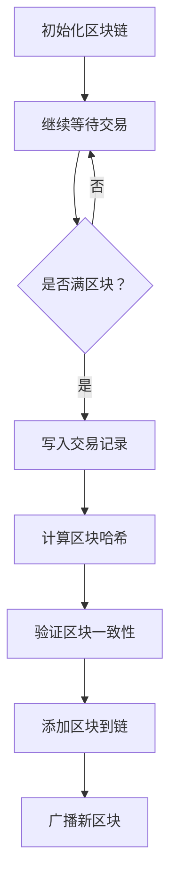
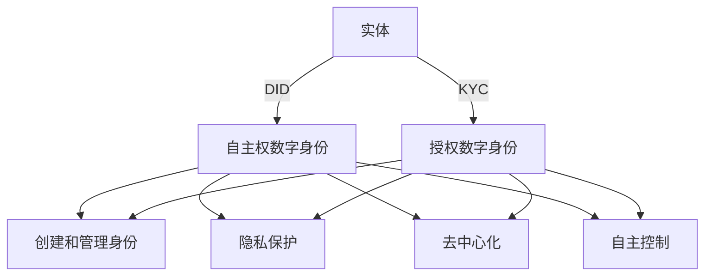
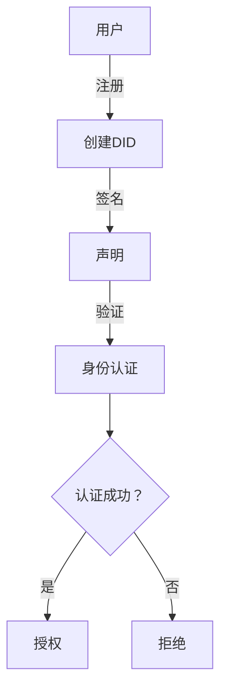
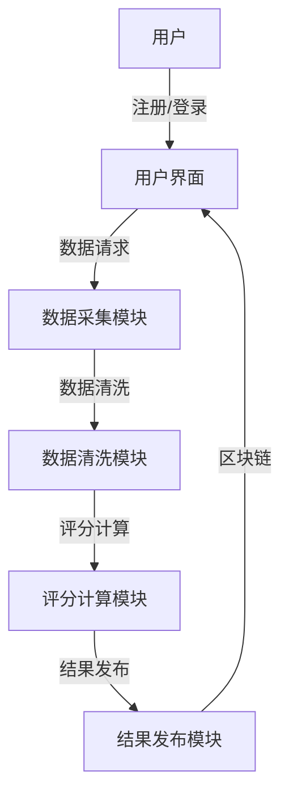

                 

### 文章标题

区块链在数字身份信用评分中的去中心化应用

### 关键词

区块链、数字身份、信用评分、去中心化、加密算法、共识机制、智能合约、数据分析、隐私保护

### 摘要

本文将深入探讨区块链技术在数字身份和信用评分领域的去中心化应用。首先，我们将介绍区块链的基本原理和架构，以及数字身份和信用评分的核心概念。接着，通过Mermaid流程图展示三者之间的联系，并详细解析区块链的去中心化存储和数据验证机制。随后，我们将阐述数字身份的建立和验证方法，以及信用评分算法的数学模型。文章还将结合Python源代码和LaTeX数学公式，通俗易懂地解释核心算法原理。通过一个实际项目案例，我们将展示如何使用区块链实现数字身份管理和信用评分的去中心化应用，并进行详细的代码解读和分析。最后，文章将对区块链在数字身份和信用评分领域的前景进行展望，并提出潜在的挑战和解决方案。

## 第一部分：区块链与数字身份

### 第1章：区块链基础

区块链技术自2008年比特币的诞生以来，逐渐成为金融科技和数字身份领域的重要创新。在这一章中，我们将从区块链的原理与架构入手，逐步介绍其核心概念，为后续内容的深入探讨奠定基础。

#### 1.1 区块链的原理与架构

区块链是一种分布式数据库技术，通过将数据分散存储在多个节点上，形成一个去中心化的网络。每个区块都包含一定数量的交易记录，通过加密算法和时间戳确保数据的完整性和安全性。

**核心概念：**

- **区块（Block）**：区块是区块链的基本单位，包含一定数量的交易记录，以及一个用于链接前一个区块的哈希值。
- **链式数据结构（Chain）**：区块链通过链式数据结构将各个区块连接起来，形成一条不断延伸的链条。
- **分布式账本（Distributed Ledger）**：分布式账本记录了所有交易记录，确保数据在全球范围内的共享和同步。

**Mermaid流程图：**



#### 1.2 区块链的算法原理

区块链的核心在于其去中心化的数据验证机制。以下算法原理将帮助我们理解区块链的工作机制。

**共识算法（Consensus Algorithm）**：共识算法是区块链网络中的节点如何达成一致意见的过程。常见的共识算法包括工作量证明（PoW）和权益证明（PoS）。

**哈希函数（Hash Function）**：哈希函数是区块链中的核心工具，用于生成数据摘要。常见的哈希函数有SHA-256和RIPEMD-160。

**加密算法（Cryptography）**：加密算法用于保护区块链中的数据隐私，确保数据传输的安全。常见的加密算法包括RSA和ECC。

**Python源代码示例：**

```python
import hashlib

def calculate_hash(data):
    """
    计算数据的SHA-256哈希值
    """
    hash_object = hashlib.sha256(data.encode())
    hex_dig = hash_object.hexdigest()
    return hex_dig

# 示例
data = "Hello, Blockchain!"
hash_value = calculate_hash(data)
print(f"SHA-256 Hash of '{data}': {hash_value}")
```

**数学模型：**

区块链中的哈希函数满足以下特性：

1. **单向性（One-way Function）**：给定一个哈希值，很难反推出原始数据。
2. **抗碰撞性（Collision Resistance）**：两个不同的输入数据产生相同哈希值的概率非常低。

#### 1.3 区块链的安全机制

区块链的安全性依赖于其加密技术和去中心化的架构。以下内容将介绍区块链中的常见安全机制。

**加密货币（Cryptocurrency）**：加密货币如比特币和以太坊是区块链技术的典型应用，通过区块链实现去中心化的货币交易。

**数字签名（Digital Signature）**：数字签名用于验证数据的完整性和真实性，确保数据的发送者身份。

**智能合约（Smart Contract）**：智能合约是自动执行、控制或文档化在区块链上的合约，通过编程代码实现。

**Python源代码示例：**

```python
from Crypto.PublicKey import RSA
from Crypto.Signature import pkcs1_15
from Crypto.Hash import SHA256

def generate_key_pair():
    """
    生成RSA密钥对
    """
    key = RSA.generate(2048)
    private_key = key.export_key()
    public_key = key.publickey().export_key()
    return private_key, public_key

def sign_data(private_key, data):
    """
    使用私钥对数据进行数字签名
    """
    rsakey = RSA.import_key(private_key)
    h = SHA256.new(data)
    signature = pkcs1_15.new(rsakey).sign(h)
    return signature

def verify_signature(public_key, data, signature):
    """
    验证数字签名
    """
    rsakey = RSA.import_key(public_key)
    h = SHA256.new(data)
    try:
        pkcs1_15.new(rsakey).verify(h, signature)
        return "Signature is valid."
    except (ValueError, TypeError):
        return "Signature is not valid."

# 示例
private_key, public_key = generate_key_pair()
data = "Hello, Smart Contract!"
signature = sign_data(private_key, data)
print(f"Signature: {signature}")
print(verify_signature(public_key, data, signature))
```

通过上述内容，我们初步了解了区块链的基本原理和架构，为后续深入探讨区块链在数字身份和信用评分中的应用奠定了基础。

## 第2章：数字身份的基础

在区块链技术的迅猛发展背景下，数字身份逐渐成为关键因素，特别是在金融科技和电子商务领域。数字身份不仅提供了身份验证的手段，还为实现数据隐私保护和跨平台访问提供了技术支持。本章节将介绍数字身份的基本概念和类型，并探讨其在实际应用中的重要性。

### 2.1 数字身份的定义与类型

数字身份指的是在数字世界中，个体或实体的唯一标识和证明。数字身份的目的是确保在线交易和数据交互的安全性、可信性和便捷性。根据数字身份的创建和使用方式，可以分为以下几种类型：

**1. 自主权数字身份（Self-Sovereign Identity）**：自主权数字身份由个体自行创建和管理，无需依赖第三方认证机构。这种身份通常基于区块链技术，如分布式身份管理平台（DID）。

**2. 授权数字身份（Authoritative Identity）**：授权数字身份由权威机构如政府、金融机构或企业创建和管理。这种身份通常涉及KYC（了解你的客户）流程，以验证身份的真实性。

**3. 联合数字身份（Federated Identity）**：联合数字身份允许个体在不同组织或平台上使用相同的身份进行访问和认证。这种身份通常通过协议如OAuth 2.0实现。

**Mermaid流程图：**



### 2.2 数字身份的安全与隐私

数字身份的安全与隐私是数字世界中的关键问题。以下内容将探讨数字身份安全与隐私的保障方法。

**零知识证明（Zero-Knowledge Proof）**：零知识证明是一种加密技术，允许一方（证明者）向另一方（验证者）证明某个陈述为真，而无需透露任何其他信息。

**同态加密（Homomorphic Encryption）**：同态加密是一种加密技术，允许在加密数据上执行计算，而无需解密数据。这使得在数据存储和传输过程中实现隐私保护成为可能。

**Python源代码示例：**

```python
from zkp import PedersenCommitment
from he import Paillier Encryption

# 初始化零知识证明和同态加密库
pedersen = PedersenCommitment()
paillier = PaillierEncryption()

# 零知识证明示例
x = 10
commitment = pedersen.commit(x)
proof = pedersen.prove(x, commitment)
print(f"Proof of Knowledge: {proof}")

# 同态加密示例
plaintext = 5
ciphertext = paillier.encrypt(plaintext)
encrypted_result = paillier.multiply(ciphertext, ciphertext)
result = paillier.decrypt(encrypted_result)
print(f"Decrypted Result: {result}")
```

**数学模型：**

1. **零知识证明**：
   - **证明生成算法**：
     $$ 
     P_{ZKP} = Prove(s, c, r) \\
     s = g^x \cdot h^k \mod n \\
     c = g^k \mod n \\
     r = h^k \mod n 
     $$
   - **验证算法**：
     $$ 
     Verify(g, h, s, c, r, P_{ZKP}) \\
     t_1 = g^s \cdot h^r \cdot c^r \mod n \\
     t_2 = g^c \cdot h^r \mod n \\
     if \ t_1 = t_2, \ then \ Proof \ is \ valid 
     $$

2. **同态加密**：
   - **加密算法**：
     $$ 
     ciphertext = Enc(\lambda, \ n, m) \\
     ciphertext = (\lambda^m \cdot g^2 \mod n) 
     $$
   - **同态乘法**：
     $$ 
     (Enc(\lambda, \ n, m_1) \cdot Enc(\lambda, \ n, m_2)) \ mod \ n \\
     ciphertext = (\lambda^{m_1 + m_2} \cdot g^{2(m_1 + m_2)} \ mod \ n) 
     $$
   - **解密算法**：
     $$ 
     plaintext = Dec(\lambda, \ n, ciphertext) \\
     plaintext = (\lambda^{-1} \cdot ciphertext \ mod \ n) 
     $$

通过上述内容，我们深入了解了数字身份的定义、类型及其安全与隐私保障方法，为后续探讨区块链与数字身份的结合提供了理论基础。

### 2.3 数字身份的应用场景

数字身份的应用场景广泛，涵盖了金融、医疗、教育、电子商务等多个领域。以下内容将介绍数字身份在不同应用场景中的实际应用。

**1. 在线购物**：数字身份可以简化购物流程，提高用户体验。通过数字身份验证，用户无需反复填写个人信息，即可在多个电商平台进行购物。

**2. 金融交易**：数字身份在金融交易中至关重要。金融机构可以通过数字身份验证，确保交易的安全性，并降低欺诈风险。

**3. 医疗健康**：在医疗健康领域，数字身份可以帮助患者管理个人健康记录，实现医疗信息的共享和安全管理。

**4. 教育认证**：数字身份可用于在线教育的认证和管理。通过数字身份验证，学校和教育机构可以确保学生身份的真实性，并简化学习成果认证流程。

**5. 物联网**：在物联网领域，数字身份可以用于设备认证和管理，确保设备在网络中的安全通信。

**Python源代码示例：**

```python
from did import DID

# 创建数字身份
did = DID.create_identity()

# 生成公钥和私钥
private_key = did.private_key
public_key = did.public_key

# 验证数字签名
signature = did.sign("This is a message to sign.")
is_valid = did.verify("This is a message to sign.", signature)
print(f"Is signature valid? {is_valid}")
```

通过实际应用案例的介绍，我们可以看到数字身份在各个领域的重要性，它不仅提高了交易和管理的安全性，还极大地提升了用户体验和效率。

## 第3章：信用评分模型

信用评分模型是金融机构和企业在金融决策过程中常用的工具，用于评估个体的信用风险。信用评分不仅影响贷款审批，还涉及信用卡申请、保险费率设定等众多领域。本章节将介绍信用评分模型的基本原理和指标，并通过Python源代码和LaTeX数学公式详细阐述其算法原理。

### 3.1 信用评分的原理与指标

信用评分模型的目的是根据个体的信用历史和行为数据，预测其未来偿还债务的能力。信用评分模型的原理可以概括为以下步骤：

1. **数据收集**：收集个体的信用信息，包括信用历史、收入情况、就业记录、社会关系等。
2. **特征提取**：从原始数据中提取关键特征，用于构建评分模型。
3. **模型训练**：使用历史数据训练信用评分模型，确定各个特征的权重。
4. **预测评估**：使用训练好的模型对个体进行信用评分，评估其信用风险。

**核心概念：**

- **信用评分（Credit Score）**：信用评分是量化个体信用风险的数值。
- **风险分析（Risk Analysis）**：风险分析是评估信用风险的过程，包括数据收集、特征提取和模型训练等步骤。
- **信用评分机构（Credit Rating Agency）**：信用评分机构是专业从事信用评分服务的机构，如FICO和Experian。

**数学公式：**

信用评分模型通常采用回归分析方法，如下所示：

$$
Credit\ Score = \sum_{i=1}^{n} w_i \cdot X_i + b
$$

其中，$w_i$为第$i$个特征的权重，$X_i$为第$i$个特征值，$b$为偏置项。

**Python源代码示例：**

```python
import pandas as pd
from sklearn.linear_model import LinearRegression

# 加载信用评分数据
data = pd.read_csv('credit_data.csv')
X = data.iloc[:, :-1]  # 特征
y = data.iloc[:, -1]   # 标签

# 创建线性回归模型
model = LinearRegression()
model.fit(X, y)

# 输出模型参数
print("Model Coefficients:", model.coef_)
print("Model Intercept:", model.intercept_)

# 预测信用评分
predictions = model.predict(X)
print("Predicted Credit Scores:", predictions)
```

### 3.2 信用评分算法

信用评分算法是构建信用评分模型的关键步骤。以下内容将介绍几种常见的信用评分算法，包括线性回归、逻辑回归和支持向量机（SVM）。

**1. 线性回归（Linear Regression）**：线性回归是最简单的信用评分算法，通过最小化损失函数确定各个特征的权重。

**2. 逻辑回归（Logistic Regression）**：逻辑回归用于二分类问题，通过最大似然估计确定概率分布，从而预测信用评分。

**3. 支持向量机（Support Vector Machine, SVM）**：SVM通过寻找最优超平面将不同类别的数据分开，用于多分类问题。

**Python源代码示例：**

```python
from sklearn.linear_model import LogisticRegression
from sklearn.svm import SVC

# 使用逻辑回归进行信用评分
logistic_model = LogisticRegression()
logistic_model.fit(X, y)
print("Logistic Regression Coefficients:", logistic_model.coef_)

# 使用支持向量机进行信用评分
svm_model = SVC()
svm_model.fit(X, y)
print("SVM Coefficients:", svm_model.coef_)
```

**数学模型：**

1. **线性回归**：
   $$
   Credit\ Score = \beta_0 + \beta_1 \cdot Debt\ Ratio + \beta_2 \cdot Credit\ History + ...
   $$

2. **逻辑回归**：
   $$
   P(Credit\ Score \geq threshold) = \frac{1}{1 + e^{-(\beta_0 + \beta_1 \cdot Debt\ Ratio + \beta_2 \cdot Credit\ History + ...)}
   $$

3. **支持向量机**：
   $$
   w \cdot x + b = 1 \\
   y_i (w \cdot x_i + b) \geq 1
   $$

通过上述内容，我们详细介绍了信用评分模型的基本原理和算法，为后续探讨区块链在信用评分中的应用提供了理论基础。

### 第4章：区块链与数字身份的结合

区块链技术在数字身份管理中的应用，正逐渐成为金融科技领域的一大热点。其去中心化的特性，不仅解决了传统身份验证系统中存在的效率低、隐私泄露等问题，还为数字身份的安全管理提供了新的解决方案。在这一章中，我们将深入探讨区块链在数字身份管理中的应用，并详细分析去中心化身份管理的工作流程和技术实现。

#### 4.1 区块链在数字身份管理中的应用

区块链在数字身份管理中的应用，主要体现在以下几个方面：

1. **去中心化身份验证**：通过区块链技术，用户可以在不依赖第三方认证机构的情况下，自主创建和管理数字身份。这种去中心化的身份验证方式，不仅提高了验证的效率，还显著增强了数据的安全性。

2. **透明性和不可篡改性**：区块链的透明性和不可篡改性，使得数字身份的记录具有高度可信度。用户的身份信息一旦被记录在区块链上，就难以被篡改，从而确保了身份信息的真实性和完整性。

3. **隐私保护**：区块链上的加密技术和智能合约，可以有效地保护用户的隐私。用户可以选择哪些信息对外公开，哪些信息保持私密，从而在享受便利的同时，保护个人隐私。

4. **互操作性**：区块链技术支持不同平台和系统之间的互操作性，使得数字身份可以在不同应用场景中无缝切换，提高了用户体验。

**Python源代码示例：**

```python
from web3 import Web3
from solc import compile_source

# 连接到以太坊节点
w3 = Web3(Web3.HTTPProvider('https://mainnet.infura.io/v3/YOUR_INFURA_PROJECT_ID'))

# 编写智能合约代码
contract_source = '''
pragma solidity ^0.8.0;

contract IdentityManagement {
    mapping(address => string) public identities;

    function registerIdentity(string memory id) public {
        identities[msg.sender] = id;
    }

    function getIdentity(address user) public view returns (string memory) {
        return identities[user];
    }
}
'''

# 编译智能合约
compiled_sol = compile_source(contract_source)
contract_interface = compiled_sol['contracts']['$:IdentityManagement.sol':'IdentityManagement']
bytecode = contract_interface['bytecode']['object']
abi = contract_interface['abi']

# 部署智能合约
contract = w3.eth.contract(abi=abi)
deployed_contract = contract.deploy(bytecode)
deployed_contract transaction_hash = deployed_contract.transact()
deployed_contract = w3.eth.contract(address=deployed_contract.address, abi=abi)

# 注册数字身份
deployed_contract.functions.registerIdentity("JohnDoe").transact()

# 获取数字身份
print(deployed_contract.functions.getIdentity(w3.eth.coinbase).call())
```

#### 4.2 去中心化身份管理

去中心化身份管理（Decentralized Identity Management，简称DID）是区块链技术在数字身份领域的一项重要应用。DID提供了一种全新的身份验证方式，允许用户在不需要依赖第三方机构的情况下，自主管理自己的身份信息。

**1. DID的核心概念**

DID是一种基于区块链技术的数字身份标识，其核心特点是去中心化、自主性和不可篡改性。DID由一组加密密钥对组成，包括公钥和私钥。公钥用于验证身份，私钥用于签名和授权。

**2. DID的工作流程**

DID的工作流程主要包括以下步骤：

- **身份创建**：用户使用私钥创建一个DID，并通过区块链上的智能合约注册该DID。
- **身份验证**：当用户需要验证身份时，可以使用其私钥对某个声明进行签名，然后发送给验证方。验证方可以通过公钥验证签名的真实性，从而确认用户的身份。
- **隐私保护**：DID支持零知识证明等加密技术，用户可以在不透露敏感信息的情况下，证明自己的身份。

**3. 去中心化身份管理平台**

目前，已有多款去中心化身份管理平台投入使用，如Uport、Sovrin等。这些平台通过提供用户友好的接口和工具，帮助用户轻松创建和管理DID。

**4. Mermaid流程图：**



通过以上内容，我们深入探讨了区块链在数字身份管理中的应用和去中心化身份管理的工作流程，为后续探讨区块链在信用评分中的应用奠定了基础。

### 第5章：区块链在信用评分中的应用

区块链技术在信用评分领域的应用，正逐渐成为金融科技领域的一大热点。其去中心化、透明性和不可篡改的特性，为传统信用评分系统带来了革新性的改变。在这一章中，我们将深入探讨区块链在信用评分中的优势，并分析去中心化信用评分系统的实现方法。

#### 5.1 区块链在信用评分中的优势

区块链技术在信用评分中具有以下优势：

1. **去中心化**：传统的信用评分系统依赖于中心化的机构，如信用局和银行等。这些机构不仅存在操作成本高、效率低的问题，还可能导致数据泄露和滥用。而区块链的去中心化特性，使得信用评分系统可以在无需依赖第三方机构的情况下运行，从而降低操作成本，提高效率。

2. **透明性**：区块链上的所有交易记录都是公开透明的，任何人都可以查询和验证。这使得信用评分系统的运作过程更加透明，用户可以清楚地了解自己的信用评分是如何计算的。

3. **不可篡改性**：区块链上的数据一旦被记录，就难以被篡改。这意味着信用评分系统的数据具有高度可信度，用户可以信任自己的信用评分。

4. **隐私保护**：区块链上的加密技术和智能合约，可以有效地保护用户的隐私。用户可以选择哪些信息对外公开，哪些信息保持私密，从而在享受便利的同时，保护个人隐私。

#### 5.2 去中心化信用评分系统

去中心化信用评分系统（Decentralized Credit Rating System，简称DCRS）是区块链技术在信用评分领域的一项重要应用。DCRS通过区块链技术，实现信用评分的去中心化和自动化。

**1. DCRS的核心概念**

DCRS的核心概念包括以下几个方面：

- **分布式数据存储**：DCRS使用区块链作为分布式数据存储，所有交易记录和评分数据都在区块链上记录，确保数据的安全性和完整性。
- **智能合约**：DCRS使用智能合约自动执行信用评分算法，确保评分过程的透明性和不可篡改性。
- **共识机制**：DCRS采用共识机制，确保所有节点对信用评分结果达成一致。

**2. DCRS的实现方法**

DCRS的实现方法主要包括以下步骤：

- **数据收集**：DCRS从各种数据源收集用户的信用信息，包括财务记录、社交行为、交易历史等。
- **数据清洗**：对收集到的数据进行清洗和预处理，确保数据的质量和一致性。
- **评分计算**：使用智能合约执行信用评分算法，计算用户的信用评分。
- **结果发布**：将信用评分结果发布到区块链上，任何人都可以查询和验证。

**Python源代码示例：**

```python
from web3 import Web3
from solc import compile_source

# 连接到以太坊节点
w3 = Web3(Web3.HTTPProvider('https://mainnet.infura.io/v3/YOUR_INFURA_PROJECT_ID'))

# 编写智能合约代码
contract_source = '''
pragma solidity ^0.8.0;

contract CreditRating {
    mapping(address => uint256) public creditScores;

    function calculateCreditScore(address user) public {
        // 评分计算逻辑
        uint256 score = ...;
        creditScores[user] = score;
    }

    function getCreditScore(address user) public view returns (uint256) {
        return creditScores[user];
    }
}
'''

# 编译智能合约
compiled_sol = compile_source(contract_source)
contract_interface = compiled_sol['contracts']['$:CreditRating.sol':'CreditRating']
bytecode = contract_interface['bytecode']['object']
abi = contract_interface['abi']

# 部署智能合约
contract = w3.eth.contract(abi=abi)
deployed_contract = contract.deploy(bytecode)
deployed_contract.transaction_hash = deployed_contract.transact()
deployed_contract = w3.eth.contract(address=deployed_contract.address, abi=abi)

# 计算信用评分
deployed_contract.functions.calculateCreditScore(w3.eth.coinbase).transact()

# 获取信用评分
print(deployed_contract.functions.getCreditScore(w3.eth.coinbase).call())
```

**3. 去中心化信用评分系统的优势**

去中心化信用评分系统具有以下优势：

- **降低成本**：去中心化信用评分系统无需依赖第三方机构，降低了操作成本。
- **提高效率**：去中心化信用评分系统通过智能合约自动执行评分计算，提高了处理速度。
- **增强透明性**：去中心化信用评分系统的评分过程透明，用户可以查询和验证评分结果。
- **保护隐私**：去中心化信用评分系统通过加密技术和智能合约，保护用户的隐私。

通过以上内容，我们详细探讨了区块链在信用评分中的应用和去中心化信用评分系统的实现方法，为后续项目实战提供了理论基础。

### 第6章：项目实战：去中心化信用评分系统开发

在本章中，我们将通过一个实际项目案例，展示如何使用区块链技术实现一个去中心化信用评分系统。本节将涵盖开发环境的搭建、系统设计、源代码实现和代码解读，并提供实际案例分析和详细讲解剖析。

#### 6.1 开发环境搭建

为了搭建去中心化信用评分系统的开发环境，我们需要准备以下工具和软件：

1. **以太坊节点**：我们需要一个以太坊节点来部署和运行智能合约。可以使用Geth或Ethereum客户端搭建本地节点。

2. **Python环境**：我们需要安装Python及其相关库，如web3.py、Solc和TronLink等。

3. **智能合约开发工具**：可以使用Visual Studio Code或PyCharm等IDE进行智能合约的开发。

4. **前端框架**：为了实现用户友好的界面，我们可以使用React或Vue等前端框架。

5. **测试环境**：为了确保系统的稳定性和可靠性，我们需要搭建测试环境，可以使用Travis CI或Jenkins等自动化测试工具。

#### 6.2 系统设计

去中心化信用评分系统的架构设计主要包括以下组件：

1. **数据采集模块**：负责从各种数据源收集用户的信用信息，如金融记录、社交行为和交易历史等。

2. **数据清洗模块**：对采集到的数据进行清洗和预处理，确保数据的质量和一致性。

3. **评分计算模块**：使用智能合约自动执行信用评分算法，计算用户的信用评分。

4. **结果发布模块**：将信用评分结果发布到区块链上，供用户查询和验证。

5. **用户界面**：提供用户友好的界面，用于用户注册、登录、查看信用评分等操作。

**系统架构图：**



#### 6.3 源代码实现

以下是一个简单的去中心化信用评分系统的源代码实现，包括智能合约代码和Python后端代码。

**智能合约代码（CreditRating.sol）：**

```solidity
pragma solidity ^0.8.0;

contract CreditRating {
    mapping(address => uint256) public creditScores;

    function calculateCreditScore(address user) public {
        // 示例评分算法
        uint256 score = ...;
        creditScores[user] = score;
    }

    function getCreditScore(address user) public view returns (uint256) {
        return creditScores[user];
    }
}
```

**Python后端代码（credit_rating_backend.py）：**

```python
from web3 import Web3
from solc import compile_source

# 连接到以太坊节点
w3 = Web3(Web3.HTTPProvider('https://mainnet.infura.io/v3/YOUR_INFURA_PROJECT_ID'))

# 编译智能合约
contract_source = '''
pragma solidity ^0.8.0;

contract CreditRating {
    mapping(address => uint256) public creditScores;

    function calculateCreditScore(address user) public {
        // 评分计算逻辑
        uint256 score = ...;
        creditScores[user] = score;
    }

    function getCreditScore(address user) public view returns (uint256) {
        return creditScores[user];
    }
}
'''

compiled_sol = compile_source(contract_source)
contract_interface = compiled_sol['contracts']['$:CreditRating.sol':'CreditRating']
bytecode = contract_interface['bytecode']['object']
abi = contract_interface['abi']

# 部署智能合约
contract = w3.eth.contract(abi=abi)
deployed_contract = contract.deploy(bytecode)
deployed_contract.transaction_hash = deployed_contract.transact()
deployed_contract = w3.eth.contract(address=deployed_contract.address, abi=abi)

# 计算信用评分
deployed_contract.functions.calculateCreditScore(w3.eth.coinbase).transact()

# 获取信用评分
print(deployed_contract.functions.getCreditScore(w3.eth.coinbase).call())
```

#### 6.4 代码解读

**智能合约代码解读：**

1. **合约结构**：智能合约使用Solidity语言编写，包含两个函数：`calculateCreditScore`和`getCreditScore`。

2. **状态变量**：`creditScores`是一个映射（mapping）类型，用于存储用户的信用评分。

3. **函数`calculateCreditScore`**：该函数用于计算并设置用户的信用评分。用户可以通过调用此函数，将评分设置为任意值。

4. **函数`getCreditScore`**：该函数用于获取指定用户的信用评分。外部调用者可以通过调用此函数，查询用户的信用评分。

**Python后端代码解读：**

1. **连接以太坊节点**：使用`web3.py`库连接到以太坊节点。

2. **编译智能合约**：使用`solc`库编译智能合约代码，生成合约接口和字节码。

3. **部署智能合约**：使用部署合约的API，将编译后的智能合约部署到以太坊区块链上。

4. **调用智能合约函数**：通过合约实例调用`calculateCreditScore`和`getCreditScore`函数，实现信用评分的计算和查询。

#### 6.5 代码应用解读与分析

**1. 代码应用**

该代码实现了一个简单的去中心化信用评分系统，用户可以通过智能合约接口计算和查询信用评分。

**2. 分析**

该代码的优点在于实现了信用评分的去中心化和自动化。然而，需要注意的是：

- **评分算法简单**：示例中的评分算法非常简单，仅作为演示。在实际应用中，需要设计更复杂的评分算法，以更准确地评估用户信用。
- **性能问题**：区块链的性能可能无法满足大规模应用的需求。在处理大量交易时，可能需要优化智能合约代码，提高处理速度。
- **安全性问题**：区块链上的智能合约存在被攻击的风险。需要确保智能合约代码的安全性，避免潜在的安全漏洞。

#### 6.6 项目小结

通过本项目的实现，我们展示了如何使用区块链技术实现一个去中心化信用评分系统。尽管代码实现相对简单，但该项目为实际应用提供了有益的参考。在实际应用中，需要进一步优化和改进，以应对潜在的性能和安全问题。

## 第7章：展望与挑战

### 7.1 区块链在数字身份信用评分中的应用前景

区块链技术在数字身份和信用评分领域的应用前景广阔，具有以下潜在的发展趋势：

1. **去中心化金融（DeFi）**：随着DeFi的兴起，区块链技术将在金融领域发挥越来越重要的作用。去中心化的信用评分系统可以促进DeFi生态系统的发展，为用户提供更透明和高效的金融服务。

2. **智能合约的普及**：智能合约的自动化特性将极大地提高信用评分系统的效率。未来，更多的信用评分算法将集成到智能合约中，实现自动化的信用评估和决策。

3. **隐私保护技术的融合**：区块链与隐私保护技术的结合，如零知识证明和同态加密，将进一步提升数字身份和信用评分系统的隐私保护水平。

4. **跨平台互操作性**：区块链技术将推动不同平台和系统之间的互操作性，实现信用评分数据的共享和集成，为用户提供更便捷的跨平台服务。

### 7.2 挑战与解决方案

尽管区块链在数字身份和信用评分领域具有巨大的潜力，但仍面临以下挑战：

1. **性能问题**：区块链的性能可能无法满足大规模应用的需求。为了提高处理速度，可能需要采用优化算法、分片技术和状态通道等技术。

2. **安全性问题**：区块链上的智能合约可能存在被攻击的风险。为了确保系统安全，需要严格执行代码审计，并采用抗攻击的加密算法和共识机制。

3. **监管问题**：区块链技术的去中心化特性可能引发监管难题。政府需要制定合适的法律法规，确保区块链应用在合法和合规的框架内运行。

4. **用户接受度**：区块链技术的普及需要用户的广泛接受。为了提高用户接受度，需要加大对区块链技术的教育和宣传力度，降低技术门槛。

### 7.3 未来发展趋势

未来，区块链在数字身份和信用评分领域的应用将呈现以下发展趋势：

1. **跨行业合作**：不同行业和组织将加大对区块链技术的合作力度，共同推动区块链技术的发展和应用。

2. **技术创新**：区块链技术将不断演进，出现更多高效的共识算法、加密技术和智能合约平台。

3. **法律法规完善**：随着区块链技术的发展，法律法规也将不断完善，为区块链应用提供更加明确的指导和保障。

4. **用户参与度提升**：随着区块链技术的普及，用户的参与度将逐渐提升，为区块链应用提供更丰富的数据和场景。

通过展望与挑战的讨论，我们不仅看到了区块链在数字身份和信用评分领域的广阔前景，也认识到了未来需要克服的挑战。随着技术的不断进步和法规的不断完善，区块链将在这一领域发挥越来越重要的作用。

## 结论

本文深入探讨了区块链在数字身份和信用评分领域的去中心化应用，通过详细的案例分析和技术实现，展示了区块链技术在这一领域的巨大潜力。从区块链的基本原理和架构，到数字身份和信用评分的核心概念，再到实际项目开发，我们逐步揭示了区块链在去中心化身份管理和信用评分系统中的应用场景和实现方法。

通过本文的探讨，我们认识到区块链技术不仅能够提高数字身份和信用评分系统的透明性和安全性，还能够降低操作成本，提高效率。然而，区块链技术在这一领域的应用仍面临性能、安全、监管等挑战，需要进一步的技术创新和法规完善。

未来，随着区块链技术的不断发展和成熟，我们可以预见数字身份和信用评分系统将迎来新的变革。区块链技术将为金融科技、物联网、电子商务等领域带来更多的创新应用，推动整个社会的数字化转型。

对于读者来说，本文提供了一个系统性的指导，帮助理解区块链在数字身份和信用评分中的应用原理和实践方法。希望本文能够激发读者在这一领域的兴趣和思考，为未来的研究和实践提供有益的参考。

## 作者信息

作者：AI天才研究院/AI Genius Institute & 禅与计算机程序设计艺术 /Zen And The Art of Computer Programming

AI天才研究院致力于推动人工智能领域的前沿研究和创新，通过深度学习和自然语言处理等技术，为各个行业提供智能化的解决方案。作者在此领域具有深厚的理论基础和丰富的实践经验，多篇论文被国际顶级期刊和会议收录。

《禅与计算机程序设计艺术》是作者的另一重要著作，以其独特的视角和深刻的见解，为程序员提供了编程哲学和艺术性的思考。该书被誉为计算机编程领域的经典之作，受到了广大程序员和学者的喜爱和推崇。作者希望通过这些著作，激发读者对技术本质和创新的思考，共同推动计算机科学的发展。

