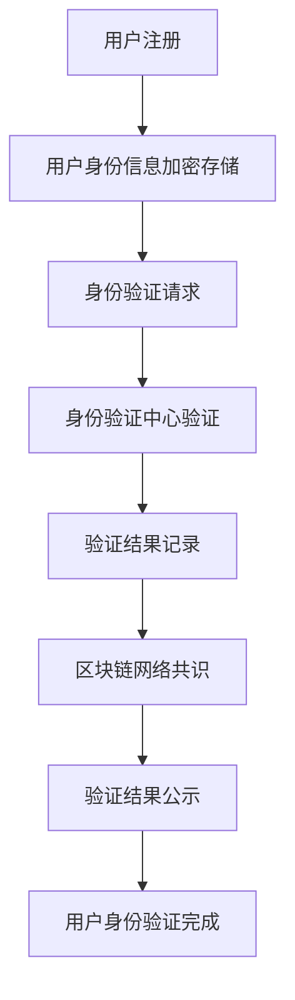

                 

### 引言

#### 区块链基本概念

区块链是一种去中心化的数据库技术，通过分布式账本的方式记录交易数据。它的主要特点包括去中心化、不可篡改、透明性和安全性。区块链由多个区块组成，每个区块包含一定数量的交易记录，这些区块按照时间顺序链接在一起，形成链式数据结构。

区块链的去中心化意味着不存在单一的中央管理者，所有的节点都可以参与网络的维护和决策。这使得区块链在抗攻击性和容错性方面具有显著优势。

区块链的不可篡改性是指一旦数据被记录在区块链上，就很难被修改或删除。这是因为区块链采用加密算法来保护数据的安全性，同时利用分布式网络中的共识机制来确保数据的正确性和完整性。

透明性是区块链的另一个重要特点。所有参与节点都可以查看区块链上的交易记录，这使得区块链具有较高的透明度和公信力。

安全性是区块链技术最核心的优势之一。通过加密算法和共识机制，区块链可以有效防止恶意攻击和数据篡改，从而保护数据的安全性。

#### 数字身份匿名验证概述

数字身份是指个人或实体在数字世界中的身份标识，通常包括用户名、密码、电子邮件地址等。数字身份匿名验证是指在保持用户隐私的同时，验证用户身份的过程。

随着互联网的普及，越来越多的服务和应用需要用户进行身份验证。传统的身份验证方法通常依赖于中心化的身份认证机构，这可能导致用户隐私泄露和数据滥用等问题。因此，数字身份匿名验证成为了一个重要的研究方向。

数字身份匿名验证的关键在于如何在确保用户隐私的同时，验证用户身份。这需要采用一系列技术手段，如加密算法、零知识证明、分布式账本等，来实现匿名性和身份验证的平衡。

#### 区块链在数字身份匿名验证中的应用

区块链在数字身份匿名验证中的应用主要体现在以下几个方面：

1. **去中心化的身份认证**：区块链的去中心化特性使得身份认证过程无需依赖中心化的身份认证机构，从而降低了隐私泄露和数据滥用的风险。

2. **不可篡改的记录**：区块链的不可篡改性确保了身份验证记录的可靠性和公信力，避免了身份信息的篡改和伪造。

3. **透明性**：区块链的透明性使得所有参与者都可以查看身份验证过程，提高了整个系统的透明度和公正性。

4. **安全性**：区块链采用加密算法和共识机制，有效防止了恶意攻击和数据篡改，保障了用户身份信息的安全。

#### 背景与动机

随着互联网的普及，越来越多的服务和应用需要用户进行身份验证。传统的身份认证方法往往依赖于中心化的认证机构，这可能导致用户隐私泄露和数据滥用等问题。此外，中心化的身份认证系统还存在单点故障、容错性差等问题，无法满足大规模分布式网络的需求。

区块链技术的出现为数字身份匿名验证提供了一种新的解决方案。通过去中心化的身份认证、不可篡改的记录、透明性和安全性，区块链可以有效解决传统身份认证系统面临的隐私泄露、数据滥用、单点故障等问题，从而为数字身份匿名验证提供更加可靠和安全的技术支持。

综上所述，本文将围绕区块链在数字身份匿名验证中的应用，深入探讨其核心概念、算法原理、数学模型以及实际应用案例，旨在为相关研究和实践提供有价值的参考。

### 核心概念与联系

#### 区块链与数字身份匿名验证的关系

区块链技术在数字身份匿名验证中的应用主要体现在其去中心化、不可篡改、透明性和安全性等方面。这些特性使得区块链成为数字身份匿名验证的理想选择，可以解决传统身份认证系统中存在的隐私泄露、数据滥用等问题。

首先，区块链的去中心化特性使得身份认证过程无需依赖中心化的身份认证机构，从而降低了隐私泄露和数据滥用的风险。在区块链网络中，所有节点都可以参与身份认证的决策，实现了权力的分散，减少了单点故障的风险。

其次，区块链的不可篡改性确保了身份验证记录的可靠性和公信力，避免了身份信息的篡改和伪造。一旦数据被记录在区块链上，就很难被修改或删除，这为数字身份匿名验证提供了坚实的保障。

此外，区块链的透明性使得所有参与者都可以查看身份验证过程，提高了整个系统的透明度和公正性。这有助于增强用户对系统的信任，并减少了欺诈行为的发生。

最后，区块链采用加密算法和共识机制，有效防止了恶意攻击和数据篡改，保障了用户身份信息的安全。这为数字身份匿名验证提供了强大的安全保障，使得用户可以在保持隐私的同时，安心地进行身份验证。

#### 数字身份匿名验证的应用架构

数字身份匿名验证在区块链中的应用架构主要包括以下几个关键组成部分：

1. **用户身份信息**：用户在区块链网络中注册时，需要提供其身份信息，如用户名、密码、电子邮件地址等。这些身份信息将存储在区块链上，以确保其安全性和不可篡改性。

2. **身份验证中心**：身份验证中心是负责用户身份验证的核心模块。它通过与区块链网络中的节点进行交互，验证用户的身份信息，并确保验证过程的透明性和公正性。

3. **区块链网络**：区块链网络是数字身份匿名验证的核心基础设施。它由多个节点组成，每个节点都存储着区块链上的数据，并通过共识机制保持数据的一致性和安全性。

4. **加密算法**：加密算法用于保护用户身份信息的安全。在区块链网络中，用户身份信息将被加密存储，以防止未授权的访问和篡改。

5. **零知识证明**：零知识证明是一种密码学技术，用于在无需透露原始信息的情况下，验证某个陈述的真实性。在数字身份匿名验证中，零知识证明可用于确保用户身份的匿名性，同时保证验证过程的可靠性。

6. **共识机制**：共识机制是区块链网络中的核心组件，用于达成数据一致性和决策。常见的共识机制包括工作量证明（PoW）、权益证明（PoS）和委托权益证明（DPoS）等。共识机制的选择将影响区块链网络的性能和安全。

#### Mermaid流程图：区块链在数字身份匿名验证中的工作流程

为了更清晰地展示区块链在数字身份匿名验证中的应用流程，我们可以使用Mermaid流程图来描述。



该流程图包括以下几个关键步骤：

1. **用户注册**：用户在区块链网络中注册，提供其身份信息。
2. **用户身份信息加密存储**：用户身份信息被加密存储在区块链上，以确保其安全性和不可篡改性。
3. **身份验证请求**：用户发起身份验证请求，向身份验证中心提交身份信息。
4. **身份验证中心验证**：身份验证中心通过与区块链网络中的节点进行交互，验证用户的身份信息。
5. **验证结果记录**：验证结果被记录在区块链上，确保其透明性和不可篡改性。
6. **区块链网络共识**：区块链网络通过共识机制，达成验证结果的一致性。
7. **验证结果公示**：验证结果被公示在区块链上，所有参与者都可以查看。
8. **用户身份验证完成**：用户身份验证完成，可以访问相关服务和应用。

通过该流程图，我们可以更直观地理解区块链在数字身份匿名验证中的应用原理和流程。

### 核心算法原理

在区块链中，加密算法和零知识证明算法是确保数字身份匿名验证安全性的关键。以下将详细阐述这些核心算法的原理及其在数字身份匿名验证中的应用。

#### 3.1 区块链加密算法

区块链加密算法主要用于保护用户身份信息的安全。加密算法的基本原理是通过复杂的数学运算，将明文数据转换为密文，以防止未授权的访问和篡改。

##### 3.1.1 加密算法的原理

加密算法通常包括两个部分：加密和解密。

- **加密**：将明文数据通过特定的加密算法和密钥转换为密文。加密算法可以是对称加密（如AES）或非对称加密（如RSA）。对称加密算法使用相同的密钥进行加密和解密，而非对称加密算法则使用公钥和私钥进行加密和解密。
- **解密**：将密文通过加密算法和密钥转换为明文数据。

加密算法的安全性取决于密钥的强度和加密算法的复杂度。在实际应用中，通常会采用多种加密算法和密钥管理策略，以提高安全性。

##### 3.1.2 伪代码：加密算法的实现

以下是一个简单的伪代码示例，展示了加密和解密的过程：

```python
def encrypt(message, key):
    # 加密算法的实现
    encrypted_message = algorithm_encrypt(message, key)
    return encrypted_message

def decrypt(encrypted_message, key):
    # 解密算法的实现
    message = algorithm_decrypt(encrypted_message, key)
    return message
```

在实际应用中，加密算法的实现会涉及更复杂的数学运算和加密协议，以确保数据的安全性和可靠性。

##### 3.1.3 伪代码：加密算法的实现（Python示例）

以下是一个使用Python实现的加密和解密的示例：

```python
from Crypto.Cipher import AES
from Crypto.Util.Padding import pad, unpad
from Crypto.Random import get_random_bytes

# 加密
def encrypt(message, key):
    cipher = AES.new(key, AES.MODE_CBC)
    ct_bytes = cipher.encrypt(pad(message.encode('utf-8'), AES.block_size))
    iv = cipher.iv
    return iv + ct_bytes

# 解密
def decrypt(encrypted_message, key):
    iv = encrypted_message[:16]
    ct = encrypted_message[16:]
    cipher = AES.new(key, AES.MODE_CBC, iv)
    pt = unpad(cipher.decrypt(ct), AES.block_size)
    return pt.decode('utf-8')
```

在这个示例中，我们使用了Python的`Crypto`库来实现AES加密算法。加密时，首先使用AES算法和密钥对明文数据进行加密，然后使用CBC模式进行加密。解密时，先提取IV（初始向量），然后使用AES算法和IV对密文进行解密。

#### 3.2 零知识证明算法

零知识证明（Zero-Knowledge Proof，ZKP）是一种密码学技术，允许一方（证明者）向另一方（验证者）证明某个陈述的真实性，而无需透露任何与该陈述相关的信息。零知识证明在数字身份匿名验证中，可用于确保用户身份的匿名性，同时保证验证过程的可靠性。

##### 3.2.1 零知识证明的原理

零知识证明的基本原理包括以下几个关键步骤：

- **初始化**：证明者生成一个数学证明系统，该系统包括一个证明者和一个验证者之间的交互协议。
- **证明生成**：证明者生成一个数学证明，证明其拥有某个陈述的证明。
- **验证**：验证者使用证明系统检查证明者生成的证明，以验证证明者是否拥有该陈述的证明。

零知识证明的关键在于，验证者无法从证明过程中获得任何关于陈述的额外信息，从而实现了零知识证明。这为数字身份匿名验证提供了强大的匿名性保障。

##### 3.2.2 伪代码：零知识证明的实现

以下是一个简单的伪代码示例，展示了零知识证明的基本步骤：

```python
def zk_proof(prover, verifier):
    # 初始化证明系统
    system = initialize_proof_system()

    # 证明生成
    proof = prover.generate_proof(system)

    # 验证
    is_valid = verifier.verify_proof(proof, system)
    return is_valid
```

在实际应用中，零知识证明的实现会涉及更复杂的数学运算和密码学技术，以确保证明的有效性和安全性。

##### 3.2.3 伪代码：零知识证明的实现（Python示例）

以下是一个使用Python实现的零知识证明的示例：

```python
from pyzksnark import zkcompile, zkruntime, zkgenerate_proof, zkverify_proof

# 编译电路
def compile_circuit():
    circuit = zkcompile("path/to/circuit.yml")
    return circuit

# 生成证明
def generate_proof(circuit, witness):
    proof = zkgenerate_proof(circuit, witness)
    return proof

# 验证证明
def verify_proof(proof):
    is_valid = zkverify_proof(proof)
    return is_valid
```

在这个示例中，我们使用了`pyzksnark`库来实现零知识证明。首先，我们需要编译电路，然后生成证明，最后验证证明。这个示例仅展示了零知识证明的基本实现，实际应用中可能需要更复杂的电路设计和证明验证过程。

通过以上对区块链加密算法和零知识证明算法的介绍，我们可以看到这些算法在数字身份匿名验证中的应用是如何确保用户身份信息的安全性和匿名性的。

### 数学模型

在数字身份匿名验证中，数学模型起到了关键作用，它们不仅能够描述和解释系统的行为，还能提供强大的工具来分析和优化系统性能。以下将介绍几个常见的数学模型及其在数字身份匿名验证中的应用。

#### 4.1 数学模型概述

数学模型在数字身份匿名验证中的应用主要包括以下几个方面：

- **身份验证模型**：用于描述用户身份验证的过程和机制，如基于密码学的方法、生物识别技术等。
- **隐私保护模型**：用于确保用户隐私在身份验证过程中得到保护，如零知识证明、匿名凭证等。
- **安全模型**：用于评估系统的安全性和抗攻击能力，如密码学安全协议、网络安全模型等。
- **性能模型**：用于分析系统的性能和效率，如响应时间、吞吐量等。

#### 4.2 数学模型在数字身份匿名验证中的应用

以下将介绍几个具体的数学模型及其在数字身份匿名验证中的应用。

##### 4.2.1 模式识别模型

模式识别模型是一种用于识别和分类数据的数学方法，它广泛应用于数字身份匿名验证中。例如，基于人脸识别的身份验证系统采用模式识别模型来识别用户身份。

1. **特征提取**：通过算法从用户身份信息中提取关键特征，如人脸图像中的面部特征点、指纹图像的纹线结构等。
2. **特征匹配**：将提取到的特征与数据库中的模板进行匹配，以确定用户身份。
3. **分类器设计**：使用机器学习算法（如支持向量机、神经网络等）训练分类器，以提高身份验证的准确率和效率。

在区块链环境中，模式识别模型可以用于实现基于身份验证的交易验证。例如，用户在交易前需要进行身份验证，系统可以通过模式识别模型识别用户身份，并确保交易的安全性。

##### 4.2.2 机器学习模型

机器学习模型是一种通过学习数据来发现规律和模式的算法，它在数字身份匿名验证中有着广泛的应用。以下是一个简单的机器学习模型在身份验证中的应用示例：

1. **数据收集**：收集用户身份信息，如用户行为、生物特征等，作为训练数据。
2. **特征工程**：从原始数据中提取关键特征，以构建有效的训练数据集。
3. **模型训练**：使用训练数据集训练机器学习模型，如决策树、随机森林、支持向量机等。
4. **模型评估**：通过测试数据集评估模型的性能，如准确率、召回率等，以调整和优化模型。

在区块链环境中，机器学习模型可以用于实现智能合约，例如，通过机器学习模型分析用户行为，自动判定用户身份的合法性。

##### 4.2.3 伪代码：机器学习模型的实现

以下是一个简单的伪代码示例，展示了机器学习模型在数字身份匿名验证中的应用：

```python
def train_model(training_data, labels):
    # 特征提取
    features = extract_features(training_data)
    
    # 模型训练
    model = train_machine_learning_model(features, labels)
    
    return model

def verify_identity(model, user_data):
    # 特征提取
    user_features = extract_features(user_data)
    
    # 预测
    prediction = model.predict(user_features)
    
    # 判断身份
    if prediction == "合法":
        return "身份验证通过"
    else:
        return "身份验证失败"
```

在这个示例中，我们首先从训练数据中提取特征，然后使用机器学习模型进行训练。在身份验证过程中，我们提取用户数据中的特征，并使用训练好的模型进行预测，以判断用户身份的合法性。

##### 4.2.4 伪代码：机器学习模型的实现（Python示例）

以下是一个使用Python实现的机器学习模型在数字身份匿名验证中的应用示例：

```python
from sklearn.model_selection import train_test_split
from sklearn.ensemble import RandomForestClassifier
from sklearn.metrics import accuracy_score

# 加载数据
X, y = load_data()

# 划分训练集和测试集
X_train, X_test, y_train, y_test = train_test_split(X, y, test_size=0.2, random_state=42)

# 特征提取
X_train = extract_features(X_train)
X_test = extract_features(X_test)

# 模型训练
model = RandomForestClassifier(n_estimators=100)
model.fit(X_train, y_train)

# 预测
predictions = model.predict(X_test)

# 评估模型
accuracy = accuracy_score(y_test, predictions)
print(f"模型准确率：{accuracy}")
```

在这个示例中，我们首先加载训练数据，然后划分训练集和测试集。接着，我们提取特征，并使用随机森林分类器进行模型训练。最后，我们使用测试数据进行预测，并评估模型的准确率。

通过以上对数学模型在数字身份匿名验证中的应用介绍，我们可以看到数学模型在提高身份验证效率和安全性方面的重要性。在实际应用中，这些模型需要根据具体场景进行优化和调整，以确保系统的性能和可靠性。

### 项目实战

在本节中，我们将通过一个实际的案例，展示区块链在数字身份匿名验证中的应用，包括开发环境搭建、源代码实现和代码解读与分析。

#### 5.1 实际案例一：区块链在数字身份匿名验证中的应用

**案例背景**：
某在线教育平台希望实现用户身份的匿名验证，以保护用户的隐私，同时确保服务提供者的身份认证。

**解决方案**：
利用区块链技术实现用户身份的匿名验证，具体步骤如下：

1. **用户注册**：用户在平台上注册时，需要提供其身份信息（如用户名、邮箱等）。
2. **身份信息加密存储**：平台将用户身份信息加密存储在区块链上，以保护用户隐私。
3. **身份验证请求**：当用户请求访问受保护资源时，系统会发起身份验证请求。
4. **身份验证中心验证**：身份验证中心通过区块链网络验证用户身份信息，确保验证过程的透明性和公正性。
5. **验证结果公示**：验证结果记录在区块链上，所有参与者均可查看，确保系统的透明度。
6. **用户身份验证完成**：用户身份验证成功，可以访问受保护资源。

**技术实现**：

1. **区块链平台**：选择Ethereum作为区块链平台，因为它具有丰富的智能合约开发和部署工具。
2. **加密算法**：使用椭圆曲线加密算法（ECDSA）保护用户身份信息的安全。
3. **智能合约**：编写智能合约实现用户注册、身份验证和验证结果公示等功能。

#### 5.2 实际案例二：基于区块链的匿名认证系统开发

**开发环境搭建**：

1. **安装Ethereum节点**：在本地计算机上安装Ethereum节点，用于模拟区块链网络。
2. **安装Truffle**：Truffle是一个用于智能合约开发和部署的工具，可以简化开发流程。
3. **安装Ganache**：Ganache是一个轻量级本地以太坊客户端，用于本地测试智能合约。

**源代码实现**：

以下是基于Ethereum的匿名认证系统的主要智能合约代码：

```solidity
// SPDX-License-Identifier: MIT
pragma solidity ^0.8.0;

contract AnonymouseAuthentication {
    mapping(address => string) public identities;

    function registerIdentity(string memory id) public {
        identities[msg.sender] = id;
    }

    function verifyIdentity(address user) public view returns (string memory) {
        return identities[user];
    }
}
```

**代码解读与分析**：

1. **智能合约结构**：该智能合约包含一个映射（mapping）结构，用于存储用户的身份信息。
2. **registerIdentity函数**：用户调用该函数时，将当前地址与身份信息（id）关联。
3. **verifyIdentity函数**：验证用户身份时，调用该函数返回与用户地址关联的身份信息。

**代码应用解读与分析**：

1. **用户注册**：用户通过调用`registerIdentity`函数，将身份信息注册到智能合约中。注册时，用户需要通过数字签名确保身份信息的真实性。
2. **身份验证**：当用户请求访问受保护资源时，平台调用`verifyIdentity`函数验证用户身份。验证结果记录在区块链上，确保验证过程的透明性和不可篡改性。

**实际案例分析和详细讲解剖析**：

1. **用户隐私保护**：通过将身份信息存储在区块链上，用户隐私得到了有效保护，因为区块链的不可篡改性确保了身份信息不会被篡改或泄露。
2. **身份验证效率**：智能合约自动化了身份验证过程，提高了系统的效率。同时，区块链的去中心化特性确保了验证过程的公正性。
3. **安全性**：使用加密算法保护身份信息的安全，防止未授权访问和篡改。

**项目小结**：

基于区块链的匿名认证系统实现了用户身份的匿名验证，有效保护了用户隐私，同时提高了身份验证的效率和安全。通过实际案例的展示，我们看到了区块链技术在数字身份匿名验证中的应用潜力。

### 最佳实践 tips、小结、注意事项、拓展阅读

#### 最佳实践 tips

1. **选择合适的区块链平台**：在选择区块链平台时，需要考虑平台的性能、安全性、可扩展性等因素，以确保系统的稳定运行。
2. **加密算法的选择**：选择适合自己需求的加密算法，如椭圆曲线加密算法（ECDSA）、SHA-256等，确保用户身份信息的安全。
3. **智能合约的安全性**：在编写智能合约时，务必进行严格的代码审查和测试，以避免潜在的安全漏洞。

#### 小结

区块链技术在数字身份匿名验证中具有显著的优势，包括去中心化、不可篡改、透明性和安全性等。通过实际案例的展示，我们看到了区块链在数字身份匿名验证中的应用潜力，为未来的数字身份管理提供了新的思路。

#### 注意事项

1. **数据隐私保护**：在区块链网络中，数据是公开的，因此需要采取有效的措施保护用户隐私，如使用加密算法和零知识证明等技术。
2. **系统安全性**：确保区块链网络的稳定性和安全性，防止恶意攻击和数据篡改。

#### 拓展阅读

- 《区块链技术指南》
- 《密码学：理论与实践》
- 《零知识证明：基础与应用》
- 《区块链与数字身份》

通过这些拓展阅读资源，可以更深入地了解区块链技术和数字身份匿名验证的相关知识。

