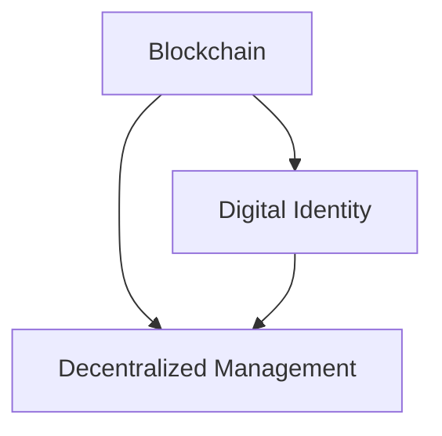

                 

Sure, let's think through this step by step to ensure we cover all the necessary elements for a comprehensive and informative technical blog post on "Blockchain in Decentralized Digital Identity Management."

### Step 1: Introduction

**Title:** Blockchain in Decentralized Digital Identity Management

**Keywords:** Blockchain, Digital Identity, Decentralization, Cryptography, Smart Contracts, Identity Verification, Decentralized Identity Management

**Abstract:**
This article delves into the application of blockchain technology in the decentralized management of digital identities. We explore the fundamental concepts, such as blockchain, digital identity, and decentralized management, and examine how blockchain can provide secure, transparent, and tamper-proof solutions for digital identity management. Through detailed algorithmic explanations and practical case studies, we illustrate the potential and challenges of integrating blockchain into digital identity systems.

### Step 2: Background

**Introduction to Blockchain**

- Blockchain is a decentralized ledger technology that allows secure, transparent transactions.
- Explain the history of blockchain and its emergence as a foundational technology for cryptocurrencies like Bitcoin.

**Digital Identity**

- Define digital identity and explain its importance in today's digital world.
- Discuss the challenges of maintaining secure and private digital identities, such as data breaches and identity theft.

**Decentralized Management**

- Explain what decentralized management means in the context of digital identity.
- Discuss the advantages of decentralization over centralized systems, such as enhanced security and reduced dependency on third parties.

### Step 3: Core Concepts and Relationships

**Conceptual Definitions**

- Blockchain: Explain the basic principles of blockchain, including distributed consensus, cryptographic hashing, and immutable ledgers.
- Digital Identity: Describe the types of digital identities and their significance in identity management.
- Decentralized Management: Explain how decentralized management can be achieved using blockchain technology.

**Relationships Between Concepts**

- Use a Mermaid flowchart to illustrate the relationship between blockchain, digital identity, and decentralized management.

### Step 4: Blockchain Technology Foundations

**Blockchain Architecture**

- Explain the components of a blockchain, including blocks, chains, nodes, and miners.
- Describe the role of consensus algorithms in maintaining a secure blockchain network.

**Common Blockchain Classifications**

- Discuss different types of blockchains, such as public, private, and consortium blockchains.

**Technological Aspects**

- Explain the use of cryptography in blockchain, including asymmetric and symmetric key encryption.
- Introduce smart contracts and their role in automating digital identity management processes.

### Step 5: Digital Identity and Decentralized Management

**Digital Identity**

- Define digital identity and discuss its types, including personal, corporate, and transactional identities.
- Discuss the security issues associated with digital identities and the need for robust identity verification mechanisms.

**Decentralized Management**

- Explain the concept of decentralized management in digital identity contexts.
- Compare decentralized and centralized identity management systems, highlighting the benefits of decentralization.

### Step 6: Blockchain Applications in Digital Identity Management

**Application Scenarios**

- Discuss potential use cases for blockchain in digital identity management, such as identity verification, data storage, and attribute management.
- Provide examples of real-world applications and their impact on digital identity security and privacy.

**Case Studies**

- Analyze specific blockchain-based digital identity management projects and their implementation details.

### Step 7: Core Algorithm Principles

**Identity Verification Algorithms**

- Explain the principles behind blockchain-based identity verification algorithms.
- Provide a Python pseudocode example to illustrate the algorithm's operation.

**Decentralized Identity Management Protocols**

- Discuss decentralized identity management protocols and their role in maintaining secure and private digital identities.
- Provide a Python pseudocode example to demonstrate a protocol's functionality.

### Step 8: Mathematical Models and Formulas

**Cryptographic Algorithms**

- Derive mathematical models for common cryptographic algorithms used in blockchain, such as SHA-256 and RSA encryption.
- Provide LaTeX formulas and examples to clarify these models.

**Consensus Mechanisms**

- Explain the mathematical models underlying various consensus mechanisms, such as Proof of Work (PoW) and Proof of Stake (PoS).
- Provide LaTeX formulas and examples to illustrate these mechanisms.

### Step 9: Project Practice

**Project Background**

- Provide a detailed overview of a blockchain-based digital identity management project.
- Describe the development environment and tools used in the project.

**Source Code Implementation**

- Present the source code for a blockchain-based identity management system.
- Explain the key components of the code and how they work together.

**Code Analysis and Interpretation**

- Analyze the functionality of the implemented system.
- Discuss the advantages and limitations of the approach.

**Case Analysis and Discussion**

- Analyze a specific case study of a blockchain-based digital identity management project.
- Discuss the project's success factors, challenges, and lessons learned.

**Project Summary**

- Summarize the key findings of the project.
- Provide insights and best practices for future projects.

### Step 10: Conclusion and Future Outlook

**Summary**

- Recap the main points discussed in the article.
- Highlight the importance of blockchain in digital identity management.

**Future Outlook**

- Discuss potential future developments and trends in blockchain-based digital identity management.
- Offer recommendations for further research and exploration.

### Step 11: Author Information

**Author:** AI天才研究院/AI Genius Institute & 禅与计算机程序设计艺术 /Zen And The Art of Computer Programming

### Step 12: Best Practices, Tips, and Additional Resources

**Best Practices**

- Provide tips for implementing blockchain-based digital identity management systems.
- Discuss common pitfalls and how to avoid them.

**Tips**

- Offer practical advice for readers who want to delve deeper into the topic.
- Suggest tools and resources for further learning.

**Additional Resources**

- List relevant books, articles, and online courses for those interested in exploring blockchain and digital identity management in more depth.

### Final Thoughts

By following these steps, we can create a comprehensive and informative technical blog post that not only covers the basics of blockchain and digital identity management but also dives into the complexities of implementing blockchain-based identity systems. The post will be structured to guide readers through the fundamental concepts, algorithms, and practical applications, ensuring a clear and engaging read. 

The next step is to start writing the actual content for each section, ensuring that the text is clear, concise, and technically accurate. We will also include Python pseudocode and LaTeX formulas to illustrate the algorithms and mathematical models discussed throughout the article.

