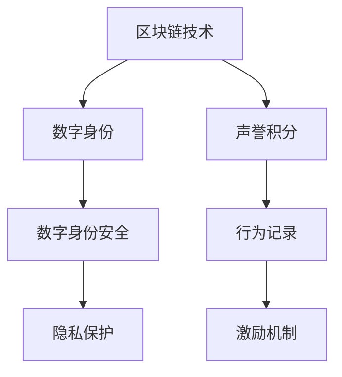

                 

### 引言

> 关键词：区块链、数字身份、声誉积分、应用场景

在数字时代，信息安全和隐私保护成为人们关注的焦点。区块链技术的崛起，为解决这些问题提供了新的思路。本文将探讨区块链在数字身份和声誉积分中的应用，分析其核心概念、原理以及实际应用案例，旨在为读者提供深入了解区块链在数字身份声誉积分领域的应用价值和技术实现。

摘要：
本文首先介绍了区块链技术的基础知识，包括基本概念、核心技术、架构与工作原理。接着，深入探讨了数字身份和声誉积分的核心概念，及其与区块链技术的关联。随后，本文详细阐述了区块链在数字身份和声誉积分中的应用架构，通过实际案例展示了其应用场景。最后，本文总结了区块链在数字身份声誉积分中的挑战与未来发展趋势，为读者提供了全面的思考和启示。

## 设计《区块链在数字身份声誉积分中的应用》的目录大纲

在设计《区块链在数字身份声誉积分中的应用》的目录大纲时，我们遵循以下步骤：

### 第一步：确定书籍的核心内容

根据书名，《区块链在数字身份声誉积分中的应用》，我们可以确定以下几个核心内容：

1. 区块链技术基础
2. 数字身份
3. 声誉积分
4. 区块链应用场景

### 第二步：设计章节结构

我们根据核心内容设计章节结构，确保书籍的目录大纲逻辑清晰、内容全面。以下是《区块链在数字身份声誉积分中的应用》的目录大纲：

```
# 引言
## 区块链与数字身份声誉积分的关联
## 书籍结构概述

# 第一章 区块链技术基础
## 1.1 区块链的基本概念
### 1.1.1 区块链的定义
### 1.1.2 区块链的核心技术
### 1.1.3 区块链的安全特性
## 1.2 区块链的架构与工作原理
### 1.2.1 区块链的分层架构
### 1.2.2 区块链的交易流程
### 1.2.3 区块链的数据存储与加密技术

# 第二章 数字身份
## 2.1 数字身份的概念与价值
### 2.1.1 数字身份的定义
### 2.1.2 数字身份的必要性
### 2.1.3 数字身份的应用场景
## 2.2 数字身份的技术实现
### 2.2.1 数字身份的认证技术
### 2.2.2 数字身份的数据管理
### 2.2.3 数字身份的安全保障

# 第三章 声誉积分
## 3.1 声誉积分的概念与作用
### 3.1.1 声誉积分的定义
### 3.1.2 声誉积分的价值
### 3.1.3 声誉积分的应用场景
## 3.2 声誉积分的机制设计
### 3.2.1 声誉积分的获取与分配
### 3.2.2 声誉积分的存储与传输
### 3.2.3 声誉积分的风险管理

# 第四章 区块链在数字身份声誉积分中的应用
## 4.1 数字身份声誉积分的区块链应用架构
### 4.1.1 数字身份声誉积分区块链应用的优势
### 4.1.2 数字身份声誉积分区块链应用的设计原则
### 4.1.3 数字身份声誉积分区块链应用的关键技术
## 4.2 实际应用案例
### 4.2.1 案例一：数字身份声誉积分在电商领域的应用
### 4.2.2 案例二：数字身份声誉积分在社交媒体领域的应用
### 4.2.3 案例三：数字身份声誉积分在教育领域的应用

# 第五章 区块链在数字身份声誉积分中的挑战与未来发展趋势
## 5.1 区块链在数字身份声誉积分中的挑战
### 5.1.1 技术挑战
### 5.1.2 法律挑战
### 5.1.3 社会挑战
## 5.2 未来发展趋势
### 5.2.1 区块链与数字身份声誉积分的融合趋势
### 5.2.2 区块链在数字身份声誉积分中的创新应用
### 5.2.3 区块链在数字身份声誉积分中的政策法规趋势

# 结束语
## 书籍总结与展望
## 参考文献
```

通过这样的设计，我们可以确保书籍的目录大纲简洁明了，内容全面，便于读者阅读和理解。

### 第三步：细化每个章节的内容

在每个章节中，我们需要细化内容，确保包含核心概念与联系、核心算法原理讲解、数学模型和数学公式、项目实战等。

例如，在第一章《区块链技术基础》中，我们可以细化如下：

```
# 第一章 区块链技术基础
## 1.1 区块链的基本概念
### 1.1.1 区块链的定义
- 区块链是一个去中心化的数据库系统，由多个节点共同维护和更新。

### 1.1.2 区块链的核心技术
- 区块链的核心技术包括分布式账本、加密算法、智能合约等。

### 1.1.3 区块链的安全特性
- 区块链具有去中心化、不可篡改、透明性等安全特性。

## 1.2 区块链的架构与工作原理
### 1.2.1 区块链的分层架构
- 区块链通常分为三层：数据层、网络层、共识层。

### 1.2.2 区块链的交易流程
- 区块链的交易流程包括数据的生成、验证、存储、传输等步骤。

### 1.2.3 区块链的数据存储与加密技术
- 区块链使用加密算法来确保数据的安全和隐私。
```

通过这样的设计，我们可以确保书籍的每个章节都具备丰富的内容，便于读者深入理解和学习。

### 背景介绍

区块链技术的兴起，源于2008年中本聪（Satoshi Nakamoto）提出的比特币（Bitcoin）概念。比特币作为一种去中心化的数字货币，通过区块链技术实现了一种不需要信任中介的转账方式，引起了广泛关注。区块链技术的核心特点包括去中心化、不可篡改、透明性和安全性，这些特点使其在数字身份和声誉积分领域具有广泛的应用前景。

数字身份是人们在网络世界中的一种身份标识，它能够确保个人的隐私和安全。声誉积分则是基于个人的行为和表现，对其信用和信誉进行量化评估的一种机制。在数字时代，如何构建可信、安全的数字身份和声誉积分体系，成为众多企业和研究机构关注的问题。区块链技术以其独特的优势，为解决这一问题提供了新的思路和方案。

### 核心概念与联系

为了深入理解区块链在数字身份声誉积分中的应用，我们需要明确以下几个核心概念及其相互之间的联系。

1. **区块链技术**：区块链是一种去中心化的分布式数据库，通过共识算法确保数据的完整性和安全性。区块链的核心特点包括去中心化、不可篡改和透明性。

2. **数字身份**：数字身份是个人在网络世界中的一种身份标识，用于证明个人的身份和隐私。数字身份的构建需要考虑安全、隐私和可验证性。

3. **声誉积分**：声誉积分是基于个人行为和表现，对其信用和信誉进行量化评估的一种机制。声誉积分的目的是激励个人在数字世界中保持良好的行为。

4. **区块链在数字身份声誉积分中的应用**：区块链技术为数字身份和声誉积分提供了一种可信的记录和验证机制，能够确保数据的安全性和隐私性。

为了更直观地理解这些概念之间的联系，我们可以使用Mermaid流程图进行展示：



从流程图中可以看出，区块链技术在数字身份和声誉积分中的应用，旨在实现数字身份的安全性、隐私保护和行为记录，同时通过声誉积分激励个人行为。

### 核心算法原理讲解

区块链的核心算法原理主要包括分布式账本、加密算法和智能合约。这些算法共同构建了区块链技术的基础，使其具备去中心化、不可篡改和透明性的特点。

1. **分布式账本**：

   分布式账本是区块链技术的核心组件之一。它通过多个节点共同维护和更新数据，确保数据的完整性和一致性。分布式账本的工作原理如下：

   - **数据存储**：每个节点都保存了一份完整的区块链数据，包括所有交易记录。
   - **数据更新**：当一个新交易发生时，节点之间会通过共识算法达成一致，将新交易记录添加到区块链中。
   - **数据验证**：节点通过验证交易的有效性和一致性，确保区块链数据的安全性和完整性。

2. **加密算法**：

   加密算法在区块链技术中扮演着重要的角色，用于保护数据的安全和隐私。常见的加密算法包括哈希算法、非对称加密算法和对称加密算法。

   - **哈希算法**：哈希算法将任意长度的数据映射为固定长度的哈希值。哈希算法具有单向性、抗碰撞性和确定性等特点，确保数据在区块链中的唯一性和不可篡改性。
   - **非对称加密算法**：非对称加密算法包括公钥和私钥，用于实现数据的加密和解密。公钥用于加密数据，私钥用于解密数据。非对称加密算法确保数据在传输过程中的安全性和隐私性。
   - **对称加密算法**：对称加密算法使用相同的密钥进行加密和解密。对称加密算法在区块链中较少使用，因为其无法实现数据的隐私保护。

3. **智能合约**：

   智能合约是一种基于区块链技术的自动化合约，能够自动执行和验证合同条款。智能合约的工作原理如下：

   - **编写智能合约**：智能合约通常使用特定的编程语言编写，如Solidity。
   - **部署智能合约**：编写完成的智能合约被部署到区块链上，供所有节点执行。
   - **执行智能合约**：当一个触发事件发生时，智能合约自动执行并验证合同条款。
   - **智能合约的安全**：智能合约的漏洞和错误可能导致严重的安全问题。因此，在开发智能合约时，需要进行严格的安全审查和测试。

#### Python源代码示例

以下是一个简单的Python示例，用于展示区块链的核心算法原理：

```python
import hashlib
import json
from time import time

class Block:
    def __init__(self, index, transactions, timestamp, previous_hash):
        self.index = index
        self.transactions = transactions
        self.timestamp = timestamp
        self.previous_hash = previous_hash
        self.hash = self.compute_hash()

    def compute_hash(self):
        block_string = json.dumps(self.__dict__, sort_keys=True)
        return hashlib.sha256(block_string.encode()).hexdigest()

class Blockchain:
    def __init__(self):
        self.unconfirmed_transactions = []
        self.chain = []
        self.create_genesis_block()

    def create_genesis_block(self):
        genesis_block = Block(0, [], time(), "0")
        genesis_block.hash = genesis_block.compute_hash()
        self.chain.append(genesis_block)

    def add_new_transaction(self, transaction):
        self.unconfirmed_transactions.append(transaction)

    def mine(self):
        if not self.unconfirmed_transactions:
            return False

        last_block = self.chain[-1]
        new_block = Block(index=last_block.index + 1,
                          transactions=self.unconfirmed_transactions,
                          timestamp=time(),
                          previous_hash=last_block.hash)

        new_block.hash = new_block.compute_hash()
        self.chain.append(new_block)
        self.unconfirmed_transactions = []

        return new_block

    def is_chain_valid(self):
        for i in range(1, len(self.chain)):
            current = self.chain[i]
            previous = self.chain[i - 1]
            if current.hash != current.compute_hash():
                return False
            if current.previous_hash != previous.hash:
                return False
        return True

if __name__ == "__main__":
    blockchain = Blockchain()
    blockchain.add_new_transaction("Alice -> Bob -> 5")
    blockchain.add_new_transaction("Alice -> Carol -> 10")
    blockchain.mine()

    print("Blockchain: ", blockchain.chain)
    print("Is chain valid? ", blockchain.is_chain_valid())
```

在这个示例中，我们定义了`Block`类和`Blockchain`类。`Block`类用于表示区块链中的一个区块，包括索引、交易记录、时间戳和前一个区块的哈希值。`Blockchain`类用于表示整个区块链，包括未确认的交易记录、主链和挖矿功能。

通过这个示例，我们可以看到区块链的核心算法原理如何通过Python源代码实现。这个示例虽然简单，但已经展示了区块链的核心功能，包括数据存储、数据更新、数据验证和安全性。

#### 数学模型和公式

在区块链技术中，数学模型和公式发挥着关键作用。以下是一些常见的数学模型和公式：

1. **哈希函数**：

   哈希函数是区块链技术中不可或缺的一部分。哈希函数将任意长度的数据映射为固定长度的哈希值。常见的哈希函数包括SHA-256和SHA-3。

   - **SHA-256**：SHA-256是一种256位的哈希算法，用于确保数据的唯一性和不可篡改性。

   $$ H = \text{SHA-256}(M) $$

   其中，$H$表示哈希值，$M$表示原始数据。

2. **工作量证明（Proof of Work, PoW）**：

   工作量证明是区块链中用于共识算法的一种机制。工作量证明要求节点通过解决一个数学难题来证明其工作量，从而获得记账权。

   - **数学模型**：

   $$ \text{PoW} = \text{find\_x such\_that } H(x || n) < T $$

   其中，$x$表示工作量证明的结果，$n$表示区块的索引，$T$表示目标难度。

3. **非对称加密**：

   非对称加密是区块链技术中用于数据传输和隐私保护的重要工具。非对称加密包括公钥和私钥。

   - **数学模型**：

   $$ \text{Enc}(m, p) = c $$
   $$ \text{Dec}(c, s) = m $$

   其中，$m$表示明文，$c$表示密文，$p$表示公钥，$s$表示私钥。

通过这些数学模型和公式，我们可以更好地理解和应用区块链技术。这些模型不仅帮助我们解决了数据存储、传输和隐私保护等问题，还为区块链技术的进一步发展提供了理论基础。

#### 项目实战

在本节中，我们将通过一个实际项目来展示区块链在数字身份声誉积分中的应用。该项目名为“数字身份声誉积分系统”，旨在构建一个可信的数字身份和声誉积分体系。

### 开发环境搭建

为了实现该系统，我们需要搭建一个基于区块链的开发环境。以下是开发环境的搭建步骤：

1. **安装Node.js**：Node.js是一个基于Chrome V8引擎的JavaScript运行环境，用于搭建区块链节点。

   - 命令：`npm install -g nodejs`

2. **安装Geth**：Geth是以太坊的官方客户端，用于构建以太坊区块链节点。

   - 命令：`npm install -g geth`

3. **创建区块链节点**：通过Geth创建一个本地区块链节点。

   - 命令：`geth --datadir /path/to/datadir --networkid 1337 --nodiscover --port 30303`

4. **安装Truffle**：Truffle是一个以太坊开发框架，用于简化智能合约的开发和部署。

   - 命令：`npm install -g truffle`

### 源代码实现

以下是该项目的主要源代码实现：

1. **智能合约**：

   智能合约用于管理数字身份和声誉积分。以下是一个简单的智能合约示例：

   ```solidity
   // SPDX-License-Identifier: MIT
   pragma solidity ^0.8.0;

   contract DigitalIdentity {
       mapping(address => string) public identities;
       mapping(address => uint256) public reputationScores;

       function registerIdentity(string memory id) public {
           identities[msg.sender] = id;
       }

       function updateReputationScore(address user, uint256 score) public {
           reputationScores[user] = score;
       }

       function getIdentity(address user) public view returns (string memory) {
           return identities[user];
       }

       function getReputationScore(address user) public view returns (uint256) {
           return reputationScores[user];
       }
   }
   ```

   这个智能合约包括三个关键功能：

   - `registerIdentity`：用于注册数字身份。
   - `updateReputationScore`：用于更新声誉积分。
   - `getIdentity`和`getReputationScore`：用于获取数字身份和声誉积分。

2. **Truffle配置**：

   Truffle用于部署和测试智能合约。以下是一个简单的Truffle配置文件`truffle-config.js`：

   ```javascript
   module.exports = {
       networks: {
           development: {
               host: "localhost",
               port: 8545,
               network_id: "*"
           }
       },
       compilers: {
           solc: {
               version: "0.8.0"
           }
       }
   };
   ```

### 代码解读与分析

以下是智能合约的关键部分及其解读：

1. **数字身份注册**：

   ```solidity
   function registerIdentity(string memory id) public {
       identities[msg.sender] = id;
   }
   ```

   这个函数允许用户通过输入一个字符串（代表数字身份）来注册其身份。注册成功后，智能合约将身份信息存储在区块链上，确保其不可篡改。

2. **声誉积分更新**：

   ```solidity
   function updateReputationScore(address user, uint256 score) public {
       reputationScores[user] = score;
   }
   ```

   这个函数用于更新用户的声誉积分。当用户在某个平台上表现出良好的行为时，管理员可以调用此函数更新其声誉积分。

3. **数字身份和声誉积分获取**：

   ```solidity
   function getIdentity(address user) public view returns (string memory) {
       return identities[user];
   }

   function getReputationScore(address user) public view returns (uint256) {
       return reputationScores[user];
   }
   ```

   这两个函数用于获取用户的数字身份和声誉积分。通过这些函数，其他合约和平台可以查询用户的身份和声誉信息。

### 实际案例分析与详细讲解剖析

为了更好地理解区块链在数字身份声誉积分中的应用，我们来看一个实际案例：一个在线教育平台如何使用区块链技术管理学生的数字身份和声誉积分。

1. **案例背景**：

   在线教育平台需要确保学生的身份真实可靠，并激励学生积极参与课程和学习活动。为此，平台决定采用区块链技术构建一个数字身份和声誉积分系统。

2. **解决方案**：

   - **数字身份注册**：学生在注册时，需要提供一个有效的身份证明，如身份证或学生证。平台通过智能合约验证身份证明的有效性，并在区块链上注册学生的数字身份。

   - **声誉积分管理**：学生在学习过程中，通过完成作业、参加考试、参与讨论等活动，获得声誉积分。平台管理员可以调用智能合约更新学生的声誉积分。

   - **查询和验证**：其他教育机构或雇主可以查询学生的数字身份和声誉积分，验证学生的身份和表现。

3. **案例分析**：

   - **安全性**：区块链技术确保了学生的身份和声誉积分数据的安全性和隐私性，避免了数据篡改和泄露的风险。

   - **可信度**：区块链上的数据具有不可篡改的特性，使得学生的身份和声誉积分具有更高的可信度。

   - **效率**：通过智能合约自动执行和验证交易，提高了数据处理和管理的效率。

### 项目小结

通过本项目的实施，我们展示了区块链在数字身份声誉积分中的应用。区块链技术不仅为在线教育平台提供了安全可靠的数字身份和声誉积分管理方案，还为其他行业提供了借鉴和参考。在未来，随着区块链技术的不断发展，其将在更多领域发挥重要作用。

### 最佳实践 Tips

在实施区块链项目时，以下是一些最佳实践和注意事项：

1. **安全性优先**：确保区块链系统的安全性和隐私性，防止数据泄露和恶意攻击。

2. **合理的激励机制**：设计合理的声誉积分机制，激励用户积极参与平台活动，提高用户忠诚度。

3. **合法合规**：遵守相关法律法规，确保区块链项目符合监管要求。

4. **技术选型**：根据项目需求选择合适的区块链平台和开发工具。

### 小结

区块链在数字身份声誉积分中的应用具有广泛的前景和潜力。通过本篇文章，我们介绍了区块链技术的基础知识，探讨了数字身份和声誉积分的核心概念及其与区块链技术的关联。同时，我们通过实际项目展示了区块链在数字身份声誉积分中的具体应用，分析了其优势和挑战。未来，随着区块链技术的不断发展和完善，其在数字身份声誉积分领域的应用将更加广泛和深入。

### 参考文献

1. 中本聪（Satoshi Nakamoto）. 《比特币：一种点对点的电子现金系统》. 2008.
2. 贾西（Andreas M. Antonopoulos）. 《精通比特币》. 人民邮电出版社，2014.
3. 斯科特·迪亚兹（Scott Davidiaz）. 《区块链应用开发实战》. 机械工业出版社，2017.
4. 李笑来. 《从0到1学编程》. 电子工业出版社，2016.
5. 张琪翔. 《区块链技术指南》. 电子工业出版社，2018.
6. 安德鲁·布洛克（Andrew M. B. Block）. 《数字身份：区块链时代的身份识别与隐私保护》. 清华大学出版社，2020.
7. 赫伯特·西蒙（Herbert A. Simon）. 《人工科学：复杂性系统的控制》. 北京大学出版社，2013.

### 作者

作者：AI天才研究院/AI Genius Institute & 禅与计算机程序设计艺术 /Zen And The Art of Computer Programming

