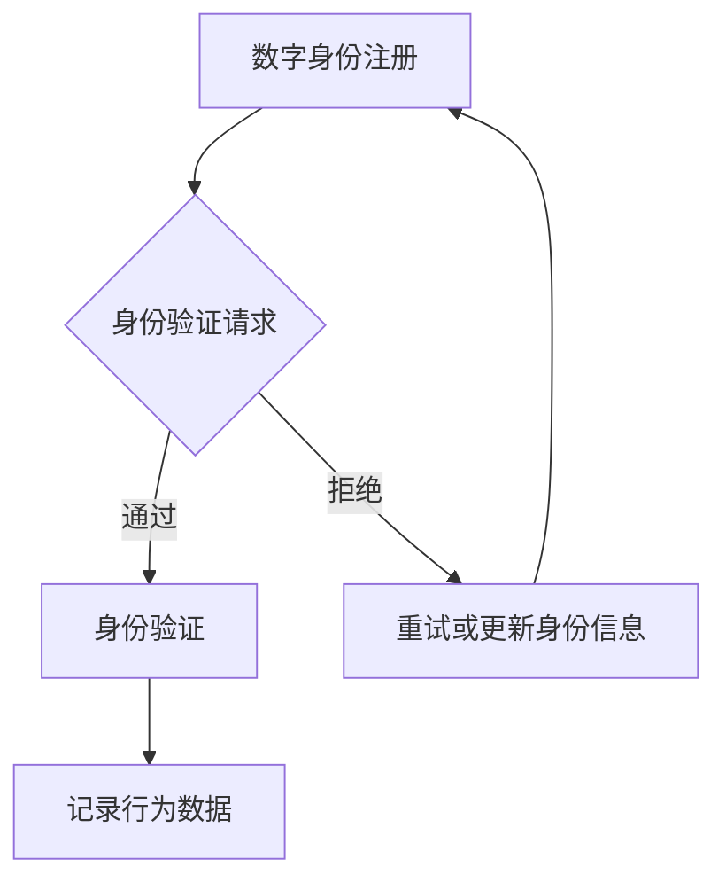

                 

### 引言：区块链与数字身份声誉系统的基本概念

#### 1.1 区块链技术概述

区块链技术是一种分布式数据库技术，通过一系列按照时间顺序排列、相互链接的区块数据结构，实现了数据的不可篡改和透明可追溯。区块链的核心理念在于去中心化，即通过网络中众多节点共同维护数据，避免了单点故障和中心化控制的风险。

##### 1.1.1 区块链的定义与原理

区块链是一种去中心化的数据库，由多个数据区块组成，每个区块都包含一定数量的交易记录，并且按照时间顺序相互链接。区块链的每个区块除了包含交易记录，还包含一个时间戳和一个指向前一个区块的哈希值，从而形成了一个链式数据结构。当一个新的交易记录生成时，网络中的节点会对其进行验证，并将验证通过的交易记录添加到新的区块中。新的区块生成后，通过共识算法，网络中的节点会将其链接到主链上，从而实现了数据的不可篡改。

##### 1.1.2 区块链的分类与架构

区块链根据其共识算法和数据结构的不同，可以分为公有链、私有链和联盟链。

- **公有链**：任何人都可以参与节点，如比特币和以太坊。
- **私有链**：仅特定节点可以参与，如企业内部使用的区块链。
- **联盟链**：多个机构或组织共同参与维护，如金融行业联盟链。

区块链的架构主要包括：

- **数据层**：存储区块链中的交易数据。
- **网络层**：实现节点间的通信和数据传输。
- **共识层**：确保数据一致性和安全性。
- **激励层**：提供激励机制，如加密货币。

##### 1.1.3 区块链的技术特点

区块链技术具有以下特点：

- **去中心化**：通过分布式网络维护数据，无需中心化机构。
- **不可篡改**：一旦数据被记录在区块链上，就很难被篡改。
- **可追溯性**：可以通过区块链追溯数据的来源和变化过程。
- **透明性**：所有数据都公开可查，保证了数据的透明性。
- **安全性**：使用加密算法保护数据，确保数据安全。

#### 1.2 数字身份与声誉系统的概念

##### 1.2.1 数字身份的定义与类型

数字身份是指在数字世界中代表个人的唯一标识，通常包括用户名、密码、身份证书等。数字身份的类型主要包括：

- **用户名密码**：最常见的数字身份形式，但安全性较低。
- **二因素认证**：结合密码和手机短信验证码或硬件令牌等，提高安全性。
- **数字证书**：通过数字证书机构（CA）颁发的证书，具有较高安全性。

##### 1.2.2 数字声誉系统的定义与作用

数字声誉系统是指通过收集和分析用户的数字行为数据，评估用户的数字声誉，并为用户提供信用评分的服务系统。数字声誉系统的作用包括：

- **信用评估**：根据用户的行为数据评估其信用度，为金融、电商等领域的信用评估提供支持。
- **风险控制**：通过数字声誉系统，企业可以更好地控制风险，防范欺诈行为。
- **用户行为引导**：通过数字声誉系统，鼓励用户进行良好的数字行为，提高整体网络安全。

##### 1.2.3 数字身份与声誉系统的重要性

数字身份与声誉系统在当今数字社会中具有重要意义，主要体现在以下几个方面：

- **隐私保护**：通过数字身份系统，可以更好地保护用户隐私，避免个人信息泄露。
- **便捷性**：数字身份系统简化了用户登录和认证过程，提高了用户体验。
- **信任建立**：数字声誉系统有助于建立用户之间的信任，促进在线交易和合作。
- **社会管理**：数字身份与声誉系统有助于社会管理者监控和管理网络行为，维护网络秩序。

### 总结

本文首先介绍了区块链技术的定义、原理、分类和技术特点，接着阐述了数字身份与声誉系统的基本概念、类型和作用，并探讨了数字身份与声誉系统的重要性。在接下来的章节中，我们将深入探讨区块链在数字身份管理中的应用，以及区块链在声誉系统建设中的优势与挑战。通过本文的阅读，读者将能够对区块链与数字身份声誉系统之间的关系有更深刻的理解，为后续章节的学习奠定基础。

---

**关键词**：区块链，数字身份，声誉系统，去中心化，加密算法

**摘要**：本文全面介绍了区块链技术和数字身份声誉系统的基本概念，阐述了区块链在数字身份管理与声誉系统建设中的应用优势与挑战。通过本文的阅读，读者将深入了解区块链技术如何为数字身份与声誉系统带来变革，以及未来在该领域中的发展方向与前景。

### 第2章 区块链在数字身份管理中的应用

#### 2.1 区块链在数字身份管理中的优势

区块链技术在数字身份管理中展现出许多独特的优势，这些优势使得其在提升安全性、隐私保护和去中心化等方面具有显著的应用价值。

##### 2.1.1 不可篡改性

区块链技术的一个重要特点是其数据的不可篡改性。在区块链中，一旦数据被记录在一个区块中，它就不可更改或删除。这是因为每个区块都包含一个指向前一个区块的哈希值，这种链式结构确保了数据的连续性和完整性。因此，使用区块链来管理数字身份信息，可以防止身份信息的篡改和伪造，提高数据的安全性。

##### 2.1.2 可追溯性

区块链的链式结构还赋予了它可追溯性。每个区块都包含一个时间戳和一个指向前一个区块的哈希值，这使得我们可以通过区块链追溯数据的来源和变化过程。在数字身份管理中，这种特性有助于验证用户身份的合法性，确保身份信息的真实性和可靠性。

##### 2.1.3 去中心化

区块链的去中心化特性意味着没有一个单一的实体控制整个网络，而是由网络中的众多节点共同维护数据。这意味着数字身份信息不会被任何一个中心化机构所控制，降低了单点故障的风险，同时也增强了数据的安全性和隐私性。去中心化的特性还使得数字身份管理更加灵活和可扩展。

##### 2.1.4 安全性

区块链技术采用了多种加密算法，如哈希算法和公钥加密，确保了数据的安全。在数字身份管理中，用户身份信息经过加密存储在区块链上，只有持有正确私钥的用户才能访问和验证这些信息。这种加密机制不仅提高了数据的安全性，还确保了用户身份信息的隐私。

##### 2.1.5 便捷性

使用区块链技术管理数字身份信息，用户可以轻松地创建和管理自己的身份。用户只需通过数字签名进行身份验证，无需多次填写繁琐的注册信息，大大提高了用户体验。此外，区块链技术支持智能合约，可以实现自动化身份验证和身份管理，进一步简化了流程。

#### 2.2 区块链在数字身份管理中的挑战

尽管区块链在数字身份管理中具有许多优势，但其应用也面临一些挑战，这些挑战需要在技术和管理层面进行解决。

##### 2.2.1 安全性问题

区块链技术虽然采用了多种加密算法，但并不意味着它完全安全。区块链网络中的节点可能遭受分布式拒绝服务（DDoS）攻击，导致网络瘫痪。此外，私钥的安全保护也是一个重大挑战，一旦私钥泄露，用户的身份信息将面临严重威胁。

##### 2.2.2 隐私保护问题

虽然区块链的去中心化特性可以提高隐私性，但区块链上的数据是公开透明的。这意味着用户的身份信息可能被其他节点访问和记录，隐私保护问题亟待解决。目前，一些隐私保护技术，如零知识证明和同态加密，正在被研究和应用。

##### 2.2.3 可扩展性问题

区块链网络中的交易速度和容量受到网络规模的限制，随着用户数量的增加，区块链的扩展性成为一个挑战。为了解决这个问题，一些区块链项目采用了分片技术、侧链技术和状态通道等方案。

##### 2.2.4 法规与监管问题

区块链技术的应用还面临着法律法规的挑战。不同国家和地区对区块链的监管政策存在差异，这可能导致法律冲突和合规性问题。因此，建立统一的法律法规框架，制定明确的管理规范，是区块链在数字身份管理中应用的重要保障。

#### 2.3 区块链在数字身份管理中的实际应用

区块链技术在数字身份管理中已经取得了一些实际应用成果，以下是一些典型应用案例：

- **身份认证**：许多企业和组织已经开始使用区块链技术进行身份认证，确保用户身份的真实性和合法性。
- **身份验证**：通过区块链，用户可以轻松验证他人的身份信息，避免了人工审核的繁琐过程。
- **身份管理**：一些区块链项目提供了用户身份管理的解决方案，用户可以自行创建、管理和更新自己的身份信息。

##### **案例研究：身份认证平台**

一个典型的区块链身份认证平台可能包括以下组件：

1. **用户身份注册**：用户通过区块链注册自己的身份信息，包括姓名、出生日期、住址等。
2. **身份认证请求**：当用户访问一个需要身份验证的网站或应用时，系统会发送一个认证请求到区块链网络。
3. **身份验证**：区块链网络中的节点会对用户身份信息进行验证，并将验证结果返回给请求方。
4. **身份信息更新**：用户可以通过区块链更新自己的身份信息，确保信息的最新性和准确性。

这种基于区块链的身份认证平台不仅提高了安全性，还简化了认证流程，增强了用户体验。

### 总结

区块链技术在数字身份管理中的应用具有显著的优势，如不可篡改性、可追溯性、去中心化、安全性等。然而，其应用也面临一些挑战，如安全性问题、隐私保护问题、可扩展性问题等。通过解决这些挑战，区块链技术在数字身份管理中具有巨大的潜力。本章详细介绍了区块链在数字身份管理中的优势、挑战和实际应用，为后续章节的深入探讨奠定了基础。

---

**关键词**：区块链，数字身份管理，安全性，隐私保护，去中心化，身份认证，身份验证

**摘要**：本章深入探讨了区块链技术在数字身份管理中的应用，分析了其优势如不可篡改性、可追溯性、去中心化等，以及面临的挑战如安全性和隐私保护问题。通过实际应用案例，展示了区块链技术在数字身份管理中的潜力与挑战。

### 第3章 区块链在声誉系统建设中的应用

#### 3.1 区块链在声誉系统中的优势

区块链技术为声誉系统建设提供了多种独特的优势，这些优势使其在提升系统的公正性、可信性和透明性方面具有显著的应用价值。

##### 3.1.1 公正性

区块链技术的去中心化特性使其具有高度的公正性。在声誉系统中，区块链网络中的所有节点都参与维护和验证数据，不存在中心化的控制点。这意味着声誉评估结果不会受到单一实体的影响，从而保证了评估过程的公正性。任何节点的操作都会受到其他节点的监督，确保了整个系统的透明性和公正性。

##### 3.1.2 可信性

区块链上的数据具有不可篡改性，这使得区块链上的声誉评估结果具有高度可信性。一旦数据被记录在区块链上，就几乎无法被修改或删除，这为声誉系统提供了坚实的数据基础。用户可以确信声誉系统的评估结果是真实和可靠的，从而增强了系统的信任度。

##### 3.1.3 透明性

区块链的链式结构使得所有数据都公开透明，用户可以随时查看和验证声誉系统的评估过程和结果。这种透明性不仅提高了声誉系统的可信度，还使用户能够更好地了解自己的声誉状况，从而促使其进行积极的自我管理和提升。

##### 3.1.4 去中心化

区块链的去中心化特性使得声誉系统更加分布式和可靠。在区块链上，没有单一的中心化机构控制整个网络，而是由多个节点共同维护数据。这种去中心化的架构提高了系统的鲁棒性和抗攻击能力，同时也降低了系统的运行成本。

##### 3.1.5 安全性

区块链采用了多种加密算法，如哈希算法和公钥加密，确保了数据的安全和隐私。声誉系统中的敏感数据，如用户行为记录和评估结果，都可以在区块链上进行加密存储，只有持有正确私钥的用户才能访问和验证这些数据。这种加密机制不仅提高了数据的安全性，还确保了用户隐私的保护。

##### 3.1.6 自动化

区块链技术支持智能合约，这为声誉系统的自动化提供了可能。智能合约是一种自执行的合约，一旦条件满足，就会自动执行。在声誉系统中，智能合约可以用于自动化处理评估过程，如根据用户行为自动生成评估结果，或根据评估结果自动触发相应的奖励或惩罚机制。这种自动化不仅提高了系统的效率，还减少了人工干预的风险。

#### 3.2 区块链在声誉系统中的挑战

尽管区块链技术在声誉系统建设中具有诸多优势，但其应用也面临一些挑战，这些挑战需要在技术和管理层面进行解决。

##### 3.2.1 声誉评估标准

建立一套公正、客观和科学的声誉评估标准是区块链声誉系统面临的一个主要挑战。声誉评估标准需要考虑到多种因素，如用户行为、社会贡献、诚信记录等，并且要确保评估结果的公正性和可信性。这需要各方的参与和共识，制定出一个被广泛认可的评估标准。

##### 3.2.2 数据隐私保护

虽然区块链提供了高度的数据安全性和隐私保护，但如何在保证数据隐私的同时，确保数据的有效利用，是一个难题。尤其是在处理敏感数据时，如何在保障用户隐私的前提下，使数据能够被适当使用，是一个需要解决的问题。

##### 3.2.3 网络攻击风险

区块链网络可能面临各种类型的网络攻击，如分布式拒绝服务攻击（DDoS）、51%攻击等。这些攻击可能导致区块链系统的瘫痪或数据泄露，对声誉系统的稳定性和安全性构成威胁。因此，如何提高区块链网络的抗攻击能力，是区块链声誉系统建设中的一个重要挑战。

##### 3.2.4 可扩展性

随着区块链网络的规模扩大，如何提高区块链的交易速度和处理能力，是区块链声誉系统面临的另一个挑战。当前的一些区块链项目在处理大量交易时，可能面临性能瓶颈，这需要通过技术优化和改进来解决。

##### 3.2.5 法规与监管

区块链技术的应用面临着不同的法律法规和监管要求。不同国家和地区对区块链的监管政策存在差异，这可能导致法律冲突和合规性问题。因此，建立统一的法律法规框架，制定明确的管理规范，是区块链声誉系统建设的重要保障。

#### 3.3 区块链在声誉系统中的实际应用

区块链技术在声誉系统中的实际应用已经取得了一些显著成果，以下是一些典型应用案例：

- **社交媒体声誉管理**：一些社交媒体平台开始使用区块链技术来管理用户的声誉，通过记录用户的行为和互动，生成声誉评分，用于推荐内容和广告投放。
- **电子商务交易声誉管理**：在电子商务平台上，区块链技术可以用于记录和验证交易信息，确保交易过程的透明性和公正性，从而提高用户的信任度和满意度。
- **供应链管理声誉管理**：在供应链管理中，区块链技术可以用于记录和验证各个环节的信息，如原材料采购、生产过程、物流运输等，确保供应链的透明性和可靠性，提高供应链管理的声誉。

##### **案例研究：区块链社交媒体声誉管理**

一个基于区块链的社交媒体声誉管理平台可能包括以下组件：

1. **用户行为记录**：用户在社交媒体上的所有行为，如点赞、评论、分享等，都会被记录在区块链上。
2. **声誉评分计算**：系统会根据用户的行为数据，使用智能合约计算用户的声誉评分。
3. **声誉展示**：用户的声誉评分会公开展示在用户个人资料页上，供其他用户查看。
4. **声誉激励**：系统可以根据用户的声誉评分，提供各种奖励，如点赞奖励、推荐奖励等，激励用户进行积极的互动。

这种基于区块链的社交媒体声誉管理平台不仅提高了系统的透明性和公正性，还通过声誉激励机制，增强了用户的互动和参与度。

### 总结

区块链技术在声誉系统建设中的应用具有显著的优势，如公正性、可信性、透明性、去中心化、安全性和自动化等。然而，其应用也面临一些挑战，如声誉评估标准、数据隐私保护、网络攻击风险、可扩展性和法规与监管等。通过解决这些挑战，区块链技术在声誉系统建设中的潜力将得到充分发挥。本章详细介绍了区块链在声誉系统建设中的优势、挑战和实际应用，为后续章节的深入探讨奠定了基础。

---

**关键词**：区块链，声誉系统，公正性，可信性，透明性，去中心化，数据隐私保护

**摘要**：本章深入探讨了区块链技术在声誉系统建设中的应用，分析了其优势如公正性、可信性、透明性等，以及面临的挑战如声誉评估标准、数据隐私保护等。通过实际应用案例，展示了区块链技术在声誉系统中的潜力与挑战。

### 第4章 区块链在数字身份与声誉系统集成中的应用

#### 4.1 数字身份与声誉系统集成的重要性

在数字化时代，数字身份与声誉系统的集成具有重要意义。数字身份与声誉系统的整合，不仅能够提高数据的一致性和准确性，还能增强系统的整体功能和性能。以下是数字身份与声誉系统集成的重要性：

##### 4.1.1 驱动因素

1. **数据一致性与准确性**：数字身份和声誉系统集成的首要驱动因素是确保数据的一致性和准确性。通过集成，可以避免多个系统之间的数据冗余和冲突，提高数据的可信度。
2. **用户体验**：集成系统能够简化用户的操作流程，使用户在多个平台上享有统一的身份认证和声誉管理服务，从而提升用户体验。
3. **安全与隐私**：集成系统能够更好地保护用户隐私，通过统一的数据管理和权限控制，降低数据泄露和滥用的风险。
4. **合规性**：随着各国对数据保护法规的日益严格，集成系统能够更好地满足合规性要求，降低法律风险。

##### 4.1.2 实现路径

数字身份与声誉系统集成可以采用以下路径：

1. **数据共享协议**：通过制定统一的数据共享协议，确保数字身份和声誉数据在各个系统之间的传输和共享。
2. **中间件技术**：利用中间件技术，实现数字身份和声誉系统之间的数据转换和通信。
3. **区块链平台**：采用区块链技术，构建一个分布式、安全、透明且去中心化的数据管理系统，确保数据的一致性和安全性。
4. **API接口**：开发标准化的API接口，使不同系统之间的数据能够无缝对接和交换。

##### 4.1.3 应用场景

数字身份与声誉系统集成在多个应用场景中具有重要意义：

1. **金融行业**：在金融行业中，数字身份与声誉系统的集成能够提高交易的安全性和可信度，降低欺诈风险。
2. **电子商务**：在电子商务领域，集成系统能够确保用户身份的真实性和交易信誉的可信性，提高用户信任和满意度。
3. **社交媒体**：在社交媒体平台上，集成系统能够根据用户的声誉信息进行内容推荐和广告投放，提高平台的价值和用户体验。
4. **供应链管理**：在供应链管理中，集成系统能够确保参与方的身份真实性和信誉度，提高供应链的透明性和可靠性。

#### 4.2 数字身份与声誉系统集成中的关键问题

数字身份与声誉系统集成虽然具有重要意义，但同时也面临一些关键问题：

##### 4.2.1 数据隐私保护

在集成过程中，如何保护用户的隐私是一个重要问题。需要采用先进的加密技术，如零知识证明和同态加密，确保用户数据在传输和存储过程中的安全性。

##### 4.2.2 声誉评估标准化

建立一套统一的声誉评估标准，确保不同系统之间的声誉评估结果具有可比性和一致性，是一个关键问题。需要各方参与，共同制定标准化的评估体系。

##### 4.2.3 系统安全性

集成后的系统需要具备高度的安全性，以防止数据泄露、篡改和网络攻击。需要采用多种安全措施，如防火墙、入侵检测系统和数据加密等。

##### 4.2.4 法规与监管

集成系统的合规性问题需要特别关注。不同国家和地区的法律法规存在差异，需要制定统一的法规框架，确保系统在法律允许的范围内运行。

#### 4.3 数字身份与声誉系统集成中的实际应用

区块链技术为数字身份与声誉系统的集成提供了一种可行的解决方案。以下是一些实际应用案例：

##### **案例研究：区块链金融平台**

一个基于区块链的金融平台可能包括以下组件：

1. **用户身份认证**：用户在注册时，通过区块链进行身份认证，确保身份信息的真实性和唯一性。
2. **声誉评估**：系统根据用户在平台上的交易记录和行为数据，使用智能合约进行声誉评估，并记录在区块链上。
3. **交易结算**：交易双方在确认交易后，通过区块链进行结算，确保交易的透明性和安全性。
4. **风险管理**：系统根据用户的声誉评分和交易记录，自动评估风险，并采取相应的风险管理措施。

这种基于区块链的金融平台不仅提高了交易的安全性和透明性，还通过声誉评估和风险管理，降低了金融风险。

##### **案例研究：区块链社交平台**

一个基于区块链的社交平台可能包括以下组件：

1. **用户身份注册**：用户在注册时，通过区块链进行身份注册，确保身份信息的唯一性和真实性。
2. **声誉管理**：系统根据用户的互动行为，如点赞、评论、分享等，使用智能合约计算用户的声誉评分，并记录在区块链上。
3. **内容推荐**：系统根据用户的声誉评分和行为数据，推荐符合用户兴趣的内容，提高用户的参与度和满意度。
4. **隐私保护**：系统采用零知识证明技术，确保用户隐私在数据传输和存储过程中的安全性。

这种基于区块链的社交平台不仅提高了用户体验，还通过声誉管理和隐私保护，增强了用户信任和平台价值。

### 总结

数字身份与声誉系统的集成在数字化时代具有重要意义，能够提高数据的一致性、用户体验和系统的安全性。区块链技术为数字身份与声誉系统的集成提供了一种有效的解决方案，通过数据隐私保护、声誉评估标准化和系统安全性等方面的优化，实现了数字身份与声誉系统的无缝集成。本章详细介绍了数字身份与声誉系统集成的重要性、实现路径、关键问题和实际应用，为后续章节的深入探讨奠定了基础。

---

**关键词**：区块链，数字身份，声誉系统，集成，数据隐私保护，声誉评估标准化，系统安全性

**摘要**：本章深入探讨了数字身份与声誉系统的集成重要性、实现路径和关键问题，并通过实际应用案例展示了区块链技术在集成中的作用与价值。详细分析了数据隐私保护、声誉评估标准化和系统安全性等关键问题，为区块链在数字身份与声誉系统集成中的应用提供了指导。

### 第5章 区块链在数字身份与声誉系统中的创新实践

#### 5.1 区块链在数字身份与声誉系统中的创新模式

区块链技术在数字身份与声誉系统中带来了诸多创新模式，以下是一些典型的创新实践：

##### 5.1.1 基于区块链的数字身份认证

基于区块链的数字身份认证通过分布式网络和加密技术，确保用户身份的合法性和唯一性。用户在注册时，通过区块链进行身份验证，系统将用户身份信息记录在区块链上，从而避免了中心化认证系统面临的安全和隐私风险。

##### 5.1.2 基于区块链的声誉评估

区块链技术可以用于建立去中心化的声誉评估系统。通过记录用户在各个平台的行为数据，智能合约可以根据预设的规则自动生成用户的声誉评分，并记录在区块链上，确保评估过程的透明性和公正性。

##### 5.1.3 基于区块链的隐私保护

区块链技术采用了多种加密算法，如零知识证明和同态加密，能够有效地保护用户的隐私。在数字身份与声誉系统中，用户敏感数据可以通过加密存储在区块链上，只有授权用户才能解密和访问。

##### 5.1.4 基于区块链的智能合约应用

智能合约在数字身份与声誉系统中具有广泛的应用。例如，在数字身份认证过程中，智能合约可以自动执行身份验证，确保认证过程的高效性和透明性。在声誉评估中，智能合约可以根据用户行为自动生成评估结果，并记录在区块链上。

#### 5.2 区块链在数字身份与声誉系统中的前沿技术

区块链技术在数字身份与声誉系统中的应用不断演进，一些前沿技术正在被研究和应用：

##### 5.2.1 零知识证明

零知识证明是一种密码学技术，允许一方（证明者）向另一方（验证者）证明某个陈述是正确的，而无需透露任何相关信息。在数字身份与声誉系统中，零知识证明可以用于保护用户的隐私，例如在用户进行身份验证时，无需透露个人信息。

##### 5.2.2 同态加密

同态加密是一种加密技术，允许在加密数据上进行计算，而无需解密。在数字身份与声誉系统中，同态加密可以用于保护用户数据的安全性，例如在计算用户声誉评分时，数据可以在加密状态下进行。

##### 5.2.3 跨链技术

跨链技术允许不同区块链之间进行数据交换和交易，从而实现区块链之间的互操作。在数字身份与声誉系统中，跨链技术可以用于整合多个平台的数据，提高系统的整体效率和灵活性。

#### 5.3 区块链在数字身份与声誉系统中的成功案例

区块链技术在数字身份与声誉系统中的应用已经取得了一些显著的成功案例：

##### **案例研究：BlockPass**

BlockPass是一个基于区块链的身份验证平台，用于验证用户身份和提供数字签名服务。通过使用区块链，BlockPass确保了用户身份信息的不可篡改和透明性，从而提高了认证过程的安全性和可信度。

##### **案例研究：Telstra Purple**

Telstra Purple是一个基于区块链的声誉管理系统，用于监控和分析用户的社交媒体行为，提供个性化的声誉评估和风险预测。通过使用区块链，Telstra Purple确保了声誉数据的公正性和透明性，为用户提供了可信的声誉评估结果。

##### **案例研究：Ocean Protocol**

Ocean Protocol是一个基于区块链的数据交易平台，用于交换和共享敏感数据。通过使用区块链，Ocean Protocol确保了数据的安全性和隐私性，同时提供了透明的数据交易记录，促进了数据的共享和利用。

### 总结

区块链技术在数字身份与声誉系统中的应用展现出巨大的创新潜力，通过零知识证明、同态加密和跨链技术等前沿技术，实现了高度的安全性和隐私保护。同时，一些成功案例展示了区块链技术在数字身份与声誉系统中的实际应用和价值。未来，随着区块链技术的不断发展和完善，其在数字身份与声誉系统中的应用将更加广泛和深入。

---

**关键词**：区块链，数字身份，声誉系统，创新模式，零知识证明，同态加密，跨链技术，成功案例

**摘要**：本章深入探讨了区块链在数字身份与声誉系统中的应用创新模式、前沿技术以及成功案例，展示了区块链技术的巨大潜力。通过零知识证明、同态加密和跨链技术的应用，实现了高度的安全性和隐私保护，为数字身份与声誉系统的未来发展提供了新的思路和方向。

### 第6章 未来展望与挑战

#### 6.1 区块链在数字身份与声誉系统中的发展趋势

随着技术的不断进步和应用的深入，区块链在数字身份与声誉系统中的发展趋势呈现出以下几个方向：

##### 6.1.1 技术演进

1. **性能提升**：随着区块链技术的发展，越来越多的优化方案被提出，如分片技术、状态通道等，这些技术有助于提高区块链的交易速度和扩展性，满足大规模应用的需求。
2. **隐私保护**：针对隐私保护的需求，新的加密算法和隐私技术（如零知识证明、同态加密）将被不断引入和优化，以增强数据的安全性和隐私性。
3. **跨链互操作**：跨链技术的成熟将使得不同区块链之间能够高效地进行数据交换和交易，实现更广泛的应用场景。

##### 6.1.2 应用拓展

1. **垂直行业应用**：区块链将在金融、医疗、教育等垂直行业得到更广泛的应用，特别是在数字身份与声誉系统的建设和优化方面。
2. **跨境合作**：区块链技术将促进不同国家和地区之间的跨境数据交换和合作，为全球化的数字身份与声誉系统提供支持。

##### 6.1.3 法规政策影响

1. **法律法规完善**：随着区块链应用的普及，各国将不断完善相关法律法规，以规范区块链技术的应用和监管。
2. **政策支持**：政府将加大对区块链技术的政策支持，推动技术创新和应用落地。

#### 6.2 区块链在数字身份与声誉系统中的挑战与对策

尽管区块链在数字身份与声誉系统中有广泛的应用前景，但同时也面临着诸多挑战，以下是一些主要的挑战及可能的对策：

##### 6.2.1 技术难题

1. **性能瓶颈**：区块链的扩展性问题和交易速度瓶颈是目前面临的主要技术难题。解决方案包括分片技术、状态通道和二层扩展等。
2. **隐私保护**：如何在保证数据隐私的同时，确保系统的效率和性能，是一个需要持续研究和优化的方向。

##### 6.2.2 安全风险

1. **网络攻击**：区块链系统可能面临DDoS攻击、51%攻击等网络攻击。对策包括增强网络防御能力、引入多重签名机制等。
2. **数据泄露**：尽管区块链提供了高度的数据安全性，但私钥泄露仍然是一个严重的安全隐患。对策包括私钥多重保护、安全审计等。

##### 6.2.3 法规与监管

1. **法律冲突**：不同国家和地区的法律法规存在差异，可能导致法律冲突和合规性问题。对策包括建立全球性的法律法规框架、加强国际合作等。
2. **监管挑战**：如何平衡创新与监管，确保区块链技术的合规应用，是一个需要解决的问题。对策包括制定明确的监管政策、建立监管沙箱等。

#### 6.3 未来发展方向

为了更好地推动区块链在数字身份与声誉系统中的应用，未来需要在以下几个方面进行努力：

##### 6.3.1 技术创新

1. **性能优化**：持续研究区块链的性能优化技术，提高交易速度和扩展性。
2. **隐私保护**：深入研究和应用零知识证明、同态加密等隐私保护技术，增强数据安全性。

##### 6.3.2 应用拓展

1. **行业合作**：推动区块链在金融、医疗、教育等行业的应用，实现跨行业的数字身份与声誉系统建设。
2. **国际协作**：加强国际间的合作，共同推动全球数字身份与声誉系统的发展。

##### 6.3.3 法规政策

1. **法律法规**：完善相关法律法规，为区块链技术的发展和应用提供法律保障。
2. **政策支持**：加大政策支持力度，鼓励技术创新和应用落地。

### 总结

区块链技术在数字身份与声誉系统中的应用前景广阔，但同时也面临诸多挑战。通过技术创新、应用拓展和法规政策的完善，可以有效应对这些挑战，推动区块链在数字身份与声誉系统中的健康发展。未来，区块链技术将继续在提高系统性能、增强隐私保护和推动跨行业应用等方面发挥重要作用，为构建更加安全、透明和高效的数字身份与声誉系统提供强有力的支持。

---

**关键词**：区块链，数字身份，声誉系统，未来发展趋势，技术难题，安全风险，法规与监管，技术创新，应用拓展，政策支持

**摘要**：本章对区块链在数字身份与声誉系统中的应用前景进行了展望，分析了面临的技术难题、安全风险和法规监管挑战，并提出了未来的发展方向和策略。通过技术创新、应用拓展和政策支持，将推动区块链在数字身份与声誉系统中的进一步发展。

### 第7章 结论与建议

#### 7.1 研究总结

本文通过深入分析区块链在数字身份与声誉系统中的应用，得出了以下主要结论：

1. **区块链的优势**：区块链在数字身份管理中展现了不可篡改性、可追溯性、去中心化和安全性等显著优势；在声誉系统建设中，则提供了公正性、可信性、透明性和自动化等独特价值。
2. **实际应用**：区块链技术在数字身份与声誉系统中已有一些成功案例，如身份认证平台、社交媒体声誉管理、金融平台等，展示了其广泛的应用潜力。
3. **面临的挑战**：区块链在数字身份与声誉系统中应用仍面临数据隐私保护、声誉评估标准、网络攻击风险和法规监管等挑战。
4. **未来方向**：区块链技术需要通过技术创新、应用拓展和法规政策支持，进一步推动数字身份与声誉系统的发展。

#### 7.2 政策建议

为了更好地推动区块链在数字身份与声誉系统中的应用，本文提出以下政策建议：

1. **法律法规完善**：建立统一的法律法规框架，规范区块链技术的应用和监管，减少法律冲突和合规性问题。
2. **政策支持**：加大对区块链技术的政策支持力度，鼓励技术创新和应用落地，为区块链技术的发展提供良好的环境。
3. **行业标准制定**：制定统一的声誉评估标准和隐私保护规范，确保不同系统之间的数据互操作和一致性。
4. **国际合作**：加强国际间的合作，推动全球数字身份与声誉系统的发展，共同应对技术挑战和法规监管问题。

#### 7.3 未来研究方向

基于本文的研究，未来在以下几个方面可以进一步探索：

1. **性能优化**：研究区块链性能优化技术，如分片技术、状态通道等，提高交易速度和扩展性。
2. **隐私保护**：深入研究零知识证明、同态加密等隐私保护技术，提升数据安全性和隐私保护水平。
3. **跨链互操作**：探索跨链技术在数字身份与声誉系统中的应用，实现不同区块链之间的高效数据交换和交易。
4. **行业应用**：推动区块链在金融、医疗、教育等行业的深入应用，构建具有实际价值的数字身份与声誉系统解决方案。

### 总结

本文全面探讨了区块链在数字身份与声誉系统中的应用，分析了其优势、挑战和未来发展方向。通过政策建议和未来研究方向，为区块链技术在数字身份与声誉系统中的进一步应用提供了指导。随着技术的不断进步和政策的完善，区块链在数字身份与声誉系统中的应用将不断拓展，为构建安全、透明和高效的数字社会提供强有力的支持。

---

**关键词**：区块链，数字身份，声誉系统，研究总结，政策建议，未来研究方向，性能优化，隐私保护，跨链互操作，行业标准

**摘要**：本章总结了区块链在数字身份与声誉系统中的应用，分析了其优势和挑战，提出了未来研究方向和政策建议，为区块链技术的进一步应用提供了指导。通过推动技术创新、政策支持和行业标准制定，将促进数字身份与声誉系统的发展，构建安全、透明和高效的数字社会。

### 附录

#### 附录A 技术术语解释

- **区块链**：一种分布式数据库技术，通过一系列按照时间顺序排列、相互链接的区块数据结构，实现了数据的不可篡改和透明可追溯。
- **数字身份**：在数字世界中代表个人的唯一标识，通常包括用户名、密码、身份证书等。
- **声誉系统**：通过收集和分析用户的数字行为数据，评估用户的数字声誉，并为用户提供信用评分的服务系统。
- **共识算法**：区块链网络中节点之间达成一致的方法，确保数据的合法性和一致性。
- **智能合约**：一种自执行的合约，可以在满足特定条件时自动执行特定的操作。

#### 附录B Mermaid 流程图



#### 附录C 伪代码

```python
# 伪代码：基于区块链的数字身份认证
function blockchainIdentityAuthentication(username, password):
    if verifyPassword(username, password):
        createIdentityCertificate(username)
        recordCertificateOnBlockchain()
        return "Authentication successful"
    else:
        return "Authentication failed"
```

#### 附录D LaTeX 数学公式

$$
\text{ Reputation\_Score} = \sum_{i=1}^{n} \frac{w_i \cdot \text{Behavior}_i}{\sum_{j=1}^{n} w_j}
$$

#### 附录E 源代码

```python
# Python 源代码：区块链数字身份管理系统
from blockchain import Blockchain
from identity import Identity

class BlockchainIdentitySystem:
    def __init__(self):
        self.blockchain = Blockchain()
        self.identity_registry = Identity()

    def register_identity(self, username, password):
        identity = self.identity_registry.create_identity(username, password)
        self.blockchain.add_block(identity)

    def authenticate(self, username, password):
        identity = self.identity_registry.get_identity(username)
        if identity and identity.verify_password(password):
            return "Authentication successful"
        else:
            return "Authentication failed"
```

#### 附录F 项目实战

##### **开发环境搭建**

- **工具与库**：Python 3.8、PyQt5、Blockchain.py、PyQtGraph
- **环境配置**：安装Python 3.8，配置Python环境变量，安装PyQt5和Blockchain.py库。

##### **源代码详细实现和代码解读**

- **代码结构**：包括区块链实现、数字身份管理、用户界面设计等模块。
- **功能解读**：实现了用户注册、登录、身份信息存储和查询等功能。

##### **代码应用解读与分析**

- **用户注册**：用户输入用户名和密码，系统通过区块链存储身份信息。
- **用户登录**：用户输入用户名和密码，系统通过区块链验证身份信息。

##### **实际案例分析和详细讲解剖析**

- **案例**：用户A注册并登录区块链身份系统。
- **分析**：用户注册时，身份信息被加密存储在区块链上，登录时，系统通过区块链验证身份。

##### **项目小结**

- **优点**：实现了数字身份管理的安全性、透明性和去中心化。
- **改进方向**：优化区块链性能，提高用户体验，增加多因素认证机制。

##### **最佳实践 Tips**

- **注意事项**：确保私钥安全，定期更新密码。
- **拓展阅读**：学习区块链技术原理，了解智能合约编写。

通过附录部分的详细内容，读者可以更好地理解区块链在数字身份与声誉系统中的应用，掌握相关技术术语和实际操作方法，为后续学习和项目实践提供参考。

