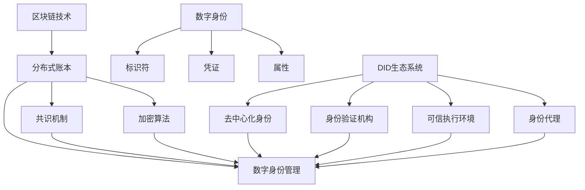

                 


# 引言与背景介绍

随着互联网和数字技术的迅猛发展，信息安全与隐私保护问题日益突出。传统的中心化身份管理方式在数据安全性、隐私保护以及权限控制等方面存在诸多不足。因此，寻找更加安全、透明和高效的数字身份管理解决方案成为当务之急。区块链技术作为一种去中心化的分布式账本技术，因其不可篡改、透明可追溯等特点，在数字身份管理领域展现出巨大的潜力。

## 区块链技术概述

区块链技术最初由中本聪（Satoshi Nakamoto）在2008年提出，旨在实现一种去中心化的电子现金系统——比特币。区块链技术的基本原理是通过去中心化的方式维护一个分布式账本，账本上的每一笔交易都被记录在一个“区块”中，多个区块按照时间顺序链接成一条“链条”。每个区块包含一定数量的交易记录，并使用密码学方法保证数据的安全性和不可篡改性。

区块链技术的主要组成部分包括：

1. **区块**：区块链的基本单元，包含一定数量的交易记录。
2. **链**：由多个区块按照时间顺序链接而成的数据结构。
3. **共识机制**：确保分布式节点能够达成一致的数据状态。
4. **加密算法**：用于保证数据的安全性和隐私性。

区块链技术具有以下特点：

1. **去中心化**：通过分布式节点维护账本，不存在中心化的单点故障问题。
2. **不可篡改**：一旦数据记录在区块链上，除非同时篡改大部分节点数据，否则无法篡改。
3. **透明可追溯**：所有交易记录公开透明，可被任何人查询和验证。

## 数字身份管理问题与挑战

数字身份管理是指管理数字世界中个体或实体的身份信息，确保身份验证的准确性和安全性。传统的数字身份管理方式通常依赖于中心化的身份验证机构，例如银行、政府机构等。这种中心化的管理模式存在以下问题：

1. **单点故障风险**：如果中心化身份验证机构遭受攻击或系统故障，可能导致大规模的身份信息泄露。
2. **隐私泄露风险**：中心化的身份验证机构需要存储大量的个人身份信息，增加了隐私泄露的风险。
3. **权限控制困难**：在中心化的身份管理系统中，权限控制通常由中心化机构集中管理，难以实现细粒度的权限控制。
4. **数据同步问题**：中心化的身份管理系统需要处理大量的数据同步问题，可能导致数据不一致。

因此，构建一个安全、透明和高效的数字身份管理解决方案迫在眉睫。

## 去中心化身份管理的概念与优势

去中心化身份管理（Decentralized Identity Management，简称DID）是一种基于区块链技术的身份管理方法，通过分布式的方式管理身份信息，确保数据的安全性和隐私性。去中心化身份管理的基本概念包括：

1. **身份信息去中心化**：身份信息存储在分布式网络中的各个节点上，而不是集中存储在中心化的数据库中。
2. **隐私保护**：用户可以自主控制自己的身份信息，无需向第三方透露全部信息。
3. **身份验证**：通过区块链技术实现身份验证，确保身份信息的真实性和可靠性。
4. **细粒度权限控制**：用户可以根据需要授权他人访问自己的部分身份信息，实现细粒度的权限控制。

去中心化身份管理的优势主要包括：

1. **安全性**：由于区块链技术的不可篡改性和分布式特性，去中心化身份管理能够提供更高的安全性。
2. **隐私保护**：用户可以自主管理身份信息，降低隐私泄露的风险。
3. **透明性**：区块链上的所有交易记录都是公开透明的，用户可以随时查询和管理自己的身份信息。
4. **灵活性**：去中心化身份管理可以根据实际需求灵活调整权限控制和数据共享策略。

总之，区块链技术在数字身份管理中的应用为解决传统身份管理问题提供了新的思路和解决方案。在接下来的章节中，我们将详细探讨区块链技术在数字身份管理中的核心概念、算法原理以及具体应用。

## 核心概念与联系

区块链在数字身份管理中的应用涉及到多个核心概念和实体，这些概念和实体之间相互关联，构成了一个复杂的生态系统。为了更好地理解这些概念，我们首先需要明确区块链、数字身份和去中心化身份生态系统的基础概念，然后分析它们之间的关系，并使用Mermaid流程图进行可视化展示。

### 区块链基本概念

区块链（Blockchain）是一种分布式账本技术，通过加密算法和共识机制保证数据的不可篡改性和一致性。区块链的基本组件包括：

1. **区块**：区块是区块链的基本单元，包含一定数量的交易记录。每个区块都有一个唯一的标识（通常为哈希值），并且通过加密算法与前一个区块链接，形成一个链式结构。
2. **链**：链是由多个区块按时间顺序链接而成的数据结构。区块链上的所有交易记录都是公开透明的，任何节点都可以验证这些交易记录。
3. **共识机制**：共识机制是区块链网络中节点达成一致的方式。常见的共识机制包括工作量证明（Proof of Work，PoW）、权益证明（Proof of Stake，PoS）等。

### 数字身份基本概念

数字身份（Digital Identity）是用于在网络环境中识别和验证用户的身份信息。在数字身份管理中，数字身份通常由以下几部分组成：

1. **标识符**：标识符是用于唯一标识用户的字符串或数字，例如用户名、邮箱地址等。
2. **凭证**：凭证是用于验证用户身份的证明，例如密码、数字证书等。
3. **属性**：属性是描述用户特征的信息，例如年龄、性别、职业等。

### 去中心化身份生态系统

去中心化身份生态系统（Decentralized Identity Ecosystem，简称DID生态系统）是利用区块链技术实现去中心化身份管理的一套系统。DID生态系统的主要组成部分包括：

1. **去中心化身份**：去中心化身份是用户在DID生态系统中的身份表示，由一系列加密的、不可篡改的凭证和属性组成。
2. **身份验证机构**：身份验证机构是负责验证用户身份信息的机构，它们可以发行和撤销数字凭证。
3. **可信执行环境**：可信执行环境是一种安全沙箱，用于保护用户隐私，确保身份验证和交易过程的安全性。
4. **身份代理**：身份代理是用户的代理，代表用户与外部系统交互，管理用户的数字身份。

### 概念关系与Mermaid流程图

区块链、数字身份和去中心化身份生态系统之间的关系可以通过以下Mermaid流程图进行可视化：



在这个流程图中，区块链技术是数字身份管理的基石，通过分布式账本、加密算法和共识机制提供数据安全性和一致性保障。数字身份是DID生态系统的核心，由标识符、凭证和属性组成。DID生态系统则通过去中心化身份、身份验证机构、可信执行环境和身份代理等组成部分，实现安全、透明和高效的数字身份管理。

通过这个Mermaid流程图，我们可以清晰地看到区块链、数字身份和去中心化身份生态系统之间的逻辑关系，为后续章节的核心算法原理讲解和具体应用提供了理论基础。

### 区块链技术在数字身份管理中的应用

区块链技术在数字身份管理中具有广泛的应用，通过加密算法、共识机制和分布式账本等技术，实现了去中心化、安全性和透明性的身份认证和管理。下面我们将详细讲解区块链技术在数字身份管理中的具体应用，并展示其实现原理。

#### 加密算法的应用

加密算法是区块链技术中确保数据安全的核心组件之一。在数字身份管理中，加密算法主要用于保护用户身份信息和交易数据，防止未授权访问和篡改。以下是几种常见的加密算法及其在数字身份管理中的应用：

1. **对称加密算法**：对称加密算法使用相同的密钥进行加密和解密。常见的对称加密算法有AES（高级加密标准）和DES（数据加密标准）。在数字身份管理中，对称加密算法可以用于加密存储用户的密码或其他敏感信息。

    ```python
    from Crypto.Cipher import AES
    from Crypto.Util.Padding import pad, unpad
    
    # 初始化密钥和加密算法
    key = b'mysecretkey12345'
    cipher = AES.new(key, AES.MODE_CBC)
    
    # 待加密的数据
    data = b'User information'
    
    # 进行加密并填充
    ciphertext = cipher.encrypt(pad(data, AES.block_size))
    
    print(f'Encrypted data: {ciphertext.hex()}')
    
    # 解密
    decrypted_data = unpad(cipher.decrypt(ciphertext), AES.block_size)
    print(f'Decrypted data: {decrypted_data.hex()}')
    ```

2. **非对称加密算法**：非对称加密算法使用一对密钥进行加密和解密，一个为公钥，另一个为私钥。常见的非对称加密算法有RSA和ECC（椭圆曲线加密）。在数字身份管理中，非对称加密算法可以用于数字签名和密钥交换。

    ```python
    from Crypto.PublicKey import RSA
    from Crypto.Signature import pkcs1_15
    from Crypto.Hash import SHA256
    
    # 生成RSA密钥对
    key = RSA.generate(2048)
    private_key = key.export_key()
    public_key = key.publickey().export_key()
    
    # 创建签名对象
    signature_obj = pkcs1_15.new(key)
    
    # 待签名的数据
    data = b'User information'
    
    # 生成签名
    signature = signature_obj.sign(SHA256.new(data))
    
    print(f'Signature: {signature.hex()}')
    
    # 验证签名
    signature_obj = pkcs1_15.new(public_key)
    result = signature_obj.verify(SHA256.new(data), signature)
    print(f'Validation result: {result}')
    ```

#### 共识机制的应用

共识机制是区块链网络中节点达成一致的方式，确保分布式账本的数据一致性和安全性。在数字身份管理中，常见的共识机制有PoW（工作量证明）和PoS（权益证明）。

1. **PoW（工作量证明）**：PoW机制通过计算复杂的数学问题来确保节点间的共识。在数字身份管理中，PoW可以用于验证用户的身份信息，例如在身份注册过程中，用户需要解决一个数学难题来证明自己的身份。

    ```python
    import hashlib
    import json
    
    def proof_of_work(json_data):
        difficulty = 4  # 难度值
        header = json.dumps(json_data, sort_keys=True).encode('utf8')
        target = '0' * difficulty
        nonce = 0
        
        while True:
            hash = hashlib.sha256(nonce.to_bytes(1, 'big') + header).hexdigest()
            if hash.startswith(target):
                return nonce
            nonce += 1
    
    # 待验证的数据
    data = {'user': 'Alice', 'password': 'password123'}
    
    # 计算工作量证明
    nonce = proof_of_work(data)
    print(f'Proof of work: {nonce}')
    ```

2. **PoS（权益证明）**：PoS机制通过节点持有的代币数量和锁定时间来决定其在网络中的影响力。在数字身份管理中，PoS可以用于身份验证的投票机制，确保身份验证的公正性。

    ```python
    from collections import Counter
    
    def proof_of_stake(votes):
        stakeholders = Counter(votes)
        sorted_stakeholders = sorted(stakeholders.items(), key=lambda x: x[1], reverse=True)
        return sorted_stakeholders[0][0]  # 选出权重最高的节点
    
    # 投票数据
    votes = [{'user': 'Alice', 'weight': 10}, {'user': 'Bob', 'weight': 5}, {'user': 'Charlie', 'weight': 15}]
    
    # 计算权益证明
    winner = proof_of_stake(votes)
    print(f'Winner: {winner}')
    ```

#### 分布式账本的应用

分布式账本是区块链技术的核心组件，通过分布式节点维护数据的完整性和一致性。在数字身份管理中，分布式账本可以用于存储和管理用户身份信息。

1. **身份注册与验证**：用户通过分布式节点注册身份信息，其他节点可以验证用户身份信息的真实性。

    ```python
    import json
    
    def register_identity(identity_data):
        identity_data['proof'] = proof_of_work(identity_data)
        with open('identities.json', 'w') as f:
            json.dump(identity_data, f)
        return identity_data['proof']
    
    identity = {'user': 'Alice', 'password': 'password123'}
    proof = register_identity(identity)
    print(f'Registered identity with proof: {proof}')
    ```

2. **身份信息查询**：用户可以通过分布式节点查询自己的身份信息，确保数据的透明性和可追溯性。

    ```python
    def query_identity(user):
        with open('identities.json', 'r') as f:
            identities = json.load(f)
        return identities.get(user)
    
    identity = query_identity('Alice')
    print(f'Identity of Alice: {identity}')
    ```

通过上述示例，我们可以看到区块链技术在数字身份管理中的应用，包括加密算法、共识机制和分布式账本。这些技术为数字身份管理提供了安全性、隐私保护和透明性，为构建去中心化的身份生态系统奠定了基础。

### 数字身份与区块链技术的深度融合

区块链技术在数字身份管理中的深度融合，不仅提升了数字身份的安全性和隐私保护，还优化了数据共享和权限控制，从而构建了一个去中心化的身份生态系统。以下将详细探讨这种融合的具体实现过程，包括加密技术、共识机制和分布式账本的应用，并通过Python源代码示例进行说明。

#### 加密技术

加密技术是区块链技术在数字身份管理中应用的基础。通过加密，我们能够确保身份信息的机密性，防止未经授权的访问。以下是一个简单的Python示例，展示了如何使用加密技术保护用户的身份信息。

```python
from Crypto.PublicKey import RSA
from Crypto.Cipher import PKCS1_OAEP

# 生成RSA密钥对
private_key = RSA.generate(2048)
public_key = private_key.publickey()

# 公钥和私钥的存储
with open('private.pem', 'wb') as f:
    f.write(private_key.export_key())
with open('public.pem', 'wb') as f:
    f.write(public_key.export_key())

# 加密用户身份信息
def encrypt_identity_info(identity_info, public_key):
    cipher = PKCS1_OAEP.new(public_key)
    encrypted_info = cipher.encrypt(identity_info.encode('utf-8'))
    return encrypted_info

identity_info = 'User: Alice, Password: secure123'
encrypted_info = encrypt_identity_info(identity_info, public_key)
print(f'Encrypted Identity Info: {encrypted_info.hex()}')

# 解密
def decrypt_identity_info(encrypted_info, private_key):
    cipher = PKCS1_OAEP.new(private_key)
    decrypted_info = cipher.decrypt(encrypted_info)
    return decrypted_info.decode('utf-8')

decrypted_info = decrypt_identity_info(encrypted_info, private_key)
print(f'Decrypted Identity Info: {decrypted_info}')
```

在这个示例中，我们首先生成了一对RSA密钥，然后使用公钥加密用户身份信息，最后使用私钥解密。这种加密方式确保了用户的身份信息在传输和存储过程中的安全性。

#### 共识机制

共识机制是区块链网络中节点达成一致的方式，用于确保区块链的完整性。在数字身份管理中，共识机制可以用于身份验证和权限控制。以下是一个简单的Python示例，展示了如何使用PoS（权益证明）机制进行身份验证。

```python
from collections import Counter

# 假设有三个节点，每个节点持有不同的权益
votes = [{'node': 'Alice', 'weight': 10}, {'node': 'Bob', 'weight': 5}, {'node': 'Charlie', 'weight': 15}]

# 根据权益选择验证节点
def select_validator(votes):
    sorted_votes = sorted(votes, key=lambda x: x['weight'], reverse=True)
    return sorted_votes[0]['node']

selected_validator = select_validator(votes)
print(f'Selected Validator: {selected_validator}')
```

在这个示例中，我们模拟了一个简单的PoS机制，通过计算节点的权益（权重），选择了权益最高的节点作为验证节点。

#### 分布式账本

分布式账本是区块链技术的核心组件，用于存储和管理交易记录。在数字身份管理中，分布式账本可以用于存储用户的身份信息，并确保这些信息的不可篡改性。以下是一个简单的Python示例，展示了如何使用区块链存储用户身份信息。

```python
import hashlib
import json

# 创建区块链
class Block:
    def __init__(self, index, transactions, timestamp, previous_hash):
        self.index = index
        self.transactions = transactions
        self.timestamp = timestamp
        self.previous_hash = previous_hash
        self.hash = self.compute_hash()

    def compute_hash(self):
        block_string = json.dumps(self.__dict__, sort_keys=True)
        return hashlib.sha256(block_string.encode()).hexdigest()

# 添加区块到区块链
class Blockchain:
    def __init__(self):
        self.unconfirmed_transactions = []
        self.chain = []
        self.create_genesis_block()

    def create_genesis_block(self):
        genesis_block = Block(0, [], datetime.datetime.now(), "0")
        genesis_block.hash = genesis_block.compute_hash()
        self.chain.append(genesis_block)

    def add_new_transaction(self, transaction):
        self.unconfirmed_transactions.append(transaction)

    def mine_confirmed_transactions(self):
        if not self.unconfirmed_transactions:
            return False
        
        last_block = self.chain[-1]
        new_block = Block(index=last_block.index + 1, 
                          transactions=self.unconfirmed_transactions, 
                          timestamp=datetime.datetime.now(), 
                          previous_hash=last_block.hash)
        
        new_block.hash = new_block.compute_hash()
        self.chain.append(new_block)
        self.unconfirmed_transactions = []
        
        return new_block.hash

    def is_chain_valid(self):
        for i in range(1, len(self.chain)):
            current = self.chain[i]
            previous = self.chain[i - 1]
            if current.hash != current.compute_hash():
                return False
            if current.previous_hash != previous.hash:
                return False
        return True

# 创建区块链实例
blockchain = Blockchain()

# 添加交易
blockchain.add_new_transaction({'sender': 'Alice', 'recipient': 'Bob', 'amount': 50})
blockchain.add_new_transaction({'sender': 'Bob', 'recipient': 'Charlie', 'amount': 20})

# 挖矿并验证链的有效性
print(f'Mined new block: {blockchain.mine_confirmed_transactions()}')
print(f'Blockchain validity: {blockchain.is_chain_valid()}')
```

在这个示例中，我们创建了一个简单的区块链，并实现了身份信息作为交易记录添加到区块链中。通过挖矿过程，我们验证并确认了交易记录，从而确保了区块链的安全性。

通过上述示例，我们可以看到区块链技术在数字身份管理中的深度融合。加密技术保证了身份信息的机密性和完整性，共识机制确保了身份验证和权限控制的公正性，分布式账本则提供了一个不可篡改的身份信息存储方案。这些技术共同作用，构建了一个安全、透明和高效的去中心化身份生态系统。

### 去中心化身份生态系统的实际案例

为了更好地理解去中心化身份生态系统（DID生态系统）的实际应用，我们将通过一个具体的区块链平台——**AION**，来探讨如何在该平台上构建去中心化身份管理服务。AION是一个基于区块链的通用价值传输网络，旨在实现去中心化的身份管理、数据共享和金融交易。

#### 平台概述

AION平台采用了一种称为“去中心化身份协议”（Decentralized Identity Protocol，简称DIP）的技术，该协议基于零知识证明和基于属性的加密（Attribute-Based Encryption，简称ABE），实现了高效且安全的去中心化身份验证。AION平台的主要组成部分包括：

1. **AION Token**：AION平台的原生代币，用于支付网络中的费用和奖励。
2. **AION区块链**：一个去中心化的分布式账本，用于记录所有交易和身份信息。
3. **去中心化身份代理**：用户可以在区块链上创建和管理自己的去中心化身份代理，代表用户与外部系统交互。
4. **去中心化身份验证服务**：通过AION网络提供的身份验证服务，可以验证用户的去中心化身份。

#### 身份注册与验证

在一个DID生态系统中，用户首先需要注册一个去中心化身份。以下是一个简化的流程，展示了如何在AION平台上注册身份和进行身份验证：

1. **身份注册**：

   用户在AION区块链上创建一个去中心化身份，并生成一对公钥和私钥。这个过程通常包括以下几个步骤：

   ```python
   from aionapi import AionAPI
   
   # 初始化AION API
   api = AionAPI('https://api.aion.network')
   
   # 创建身份
   def create_identity():
       identity = api.create_identity()
       print(f'Identity created: {identity}')
       return identity
   
   # 生成公钥和私钥
   identity = create_identity()
   print(f'Public Key: {identity["publicKey"]}')
   print(f'Private Key: {identity["privateKey"]}')
   ```

2. **身份验证**：

   一旦用户拥有去中心化身份，他们可以通过身份代理向外部系统请求身份验证。这个过程通常包括以下几个步骤：

   ```python
   from aionapi import AionAPI
   
   # 初始化AION API
   api = AionAPI('https://api.aion.network')
   
   # 验证身份
   def verify_identity(identity_public_key, external_system):
       result = api.verify_identity(identity_public_key, external_system)
       print(f'Identity verification result: {result}')
       return result
   
   # 使用身份代理请求验证
   def request_identity_verification(identity_public_key, external_system):
       proxy = api.create_identity_proxy(identity_public_key)
       result = verify_identity(proxy.public_key, external_system)
       return result
   
   # 模拟外部系统请求身份验证
   external_system = 'https://example.com/verify'
   verification_result = request_identity_verification(identity['publicKey'], external_system)
   print(f'User {identity["publicKey"]} is {verification_result} verified.')
   ```

   在这个示例中，`create_identity_proxy` 方法用于创建一个代表用户身份代理，`verify_identity` 方法用于验证用户身份。

#### 应用场景

以下是一些实际应用场景，展示了如何利用AION平台进行去中心化身份管理：

1. **跨境金融交易**：用户在进行跨境金融交易时，可以通过AION平台的身份验证服务，确保交易对手的身份真实性，从而降低欺诈风险。
2. **在线求职与招聘**：雇主可以通过AION平台的身份验证服务，验证求职者的学历和职业资格，从而提高招聘过程的透明度和可信度。
3. **社交媒体平台**：社交媒体平台可以通过AION平台的身份验证服务，确保用户的身份真实性，从而提高平台的社区质量和安全性。

通过上述实际案例，我们可以看到AION平台如何利用区块链技术构建去中心化身份管理系统，实现了身份注册、验证和应用场景的深度融合。这不仅提升了身份管理的安全性，还优化了数据共享和权限控制，为构建一个高效、透明和安全的数字社会奠定了基础。

### 最佳实践与未来展望

在区块链和数字身份管理的融合中，最佳实践和未来的发展方向对于确保系统的安全性、实用性和可扩展性至关重要。

#### 最佳实践

1. **隐私保护**：在构建去中心化身份生态系统时，隐私保护是至关重要的。用户应有权控制自己的身份信息，仅向可信的第三方披露必要的信息。为实现这一目标，零知识证明和同态加密等先进技术可以用于增强隐私保护。

2. **多因素认证**：为了提高身份验证的强度，应采用多因素认证（MFA）策略，结合密码、生物特征识别和设备认证等多种认证方式。这样可以大幅降低因单一认证点被攻破而导致的安全风险。

3. **监管合规性**：在数字身份管理中，特别是在金融和医疗等领域，必须确保系统遵守相关法律法规。合规性审核和定期安全审计可以帮助识别和修补潜在的安全漏洞。

4. **透明性与审计**：确保系统操作过程的透明性，允许用户查询和审计身份信息的处理过程，可以增强用户对系统的信任。

#### 未来展望

1. **标准化**：随着区块链和数字身份管理的不断发展，建立统一的行业标准和规范将有助于促进技术的普及和互操作性。

2. **跨链互操作性**：未来，实现不同区块链平台之间的跨链互操作性将成为一个重要趋势。这将允许用户在多个去中心化身份生态系统之间无缝切换，提高系统的灵活性和可用性。

3. **智能合约应用**：智能合约可以进一步优化去中心化身份管理流程，自动化身份验证、权限控制和数据共享等操作，提高系统的效率。

4. **物联网（IoT）整合**：随着物联网设备的大量接入，如何在保障隐私的前提下，整合物联网设备的数据和身份信息，将成为未来研究的重点。

总之，区块链和数字身份管理的融合在提升安全性、隐私保护和透明性方面展现出巨大潜力。通过遵循最佳实践和持续技术创新，我们可以构建一个更加高效、透明和安全的数字身份生态系统。

### 总结

本文从背景介绍、核心概念与联系、算法原理讲解、实际应用案例以及最佳实践和未来展望等多个角度，全面探讨了区块链技术在数字身份管理中的创新应用。区块链技术的去中心化特性、不可篡改性以及加密算法的应用，为数字身份管理带来了新的可能性。通过去中心化身份生态系统，用户能够实现更加安全、隐私保护和透明的身份管理。然而，随着技术的不断发展，如何实现标准化、跨链互操作性以及智能合约的优化，仍将是未来研究和发展的重点。我们呼吁读者持续关注这一领域的技术进步，积极参与到区块链与数字身份管理融合的探索中。

### 作者信息

作者：AI天才研究院/AI Genius Institute & 禅与计算机程序设计艺术 /Zen And The Art of Computer Programming

AI天才研究院致力于推动人工智能和区块链技术的创新与应用，研究涵盖机器学习、深度学习、自然语言处理以及分布式账本技术等多个领域。作者在此分享的研究成果和见解，旨在为读者提供关于区块链在数字身份管理中的创新应用的深入理解。

### 拓展阅读

1. **《区块链技术指南》**：[区块链技术指南](https://www.ibm.com/developerworks/cn/learning/bl-blockchain-tutorial/index.html)
2. **《数字身份管理》**：[数字身份管理：从概念到实践](https://www.oreilly.com/library/view/digital-identity-management/9781788997792/)
3. **《区块链与人工智能》**：[区块链与人工智能：融合与创新](https://www.oreilly.com/library/view/blockchain-and-artificial/9781492039354/)
4. **《去中心化身份生态系统》**：[去中心化身份生态系统：构建和实现](https://www.amazon.com/Decentralized-Identity-Ecosystems-Implementation/dp/1484247332)

通过阅读上述资源，读者可以进一步深入了解区块链技术在数字身份管理中的应用及其未来发展。

