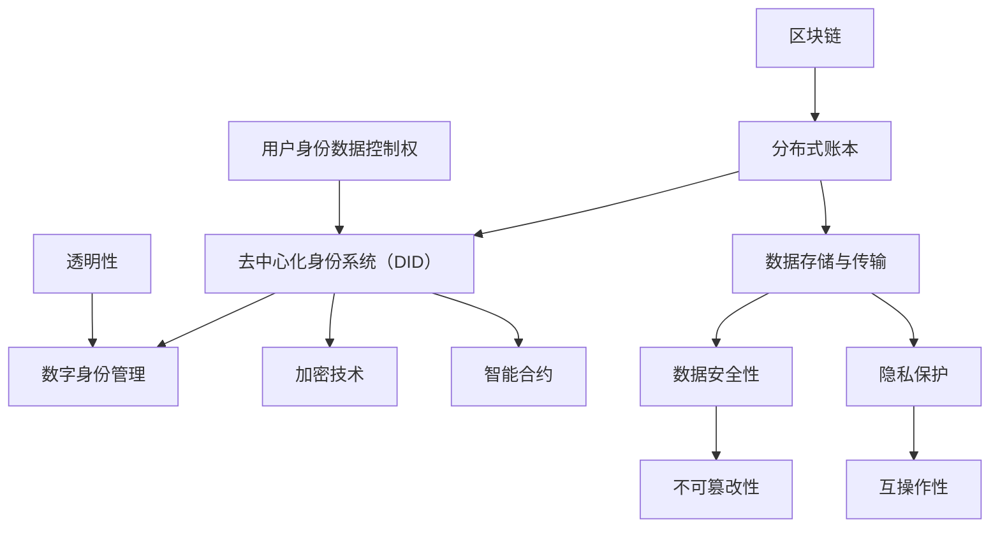

                 

## 关键词

区块链，数字身份管理，去中心化身份系统（DID），分布式账本，隐私保护，智能合约，共识机制，零知识证明，哈希算法，数学模型，Python编程，案例实战。

----------------------------------------------------------------

## 摘要

本文深入探讨区块链在数字身份管理中的应用，构建去中心化身份系统（DID）。首先，我们介绍了区块链与数字身份管理的基础知识，包括区块链的基本概念、特性，以及数字身份管理的挑战。接着，我们分析了区块链与数字身份管理的关联，展示了其在数字身份认证中的应用。随后，我们详细讲解了去中心化身份系统的设计原则和构建方法，使用Python源代码和Mermaid流程图进行了详细阐述。此外，本文还介绍了去中心化身份系统的核心算法和数学模型，并通过实际案例进行了分析和解读。最后，我们探讨了去中心化身份系统的挑战与未来展望，提供了最佳实践和注意事项。

----------------------------------------------------------------

## 背景介绍

### 区块链技术的发展

区块链作为一种新兴的分布式账本技术，起源于2008年中本聪（Satoshi Nakamoto）发表的《比特币：一种点对点的电子现金系统》白皮书。区块链的核心思想是通过去中心化的方式，在无需信任的多个参与方之间达成一致的共识，实现数据的可靠存储与传输。随着比特币的成功，区块链技术迅速引起了全球范围内的关注。

区块链的技术特点主要包括：

1. **去中心化**：区块链通过分布式的网络结构，使数据存储和交易处理不再依赖于单一的中心节点，从而提高了系统的容错性和抗攻击能力。
2. **不可篡改**：区块链采用哈希算法和时间戳技术，确保数据一旦写入区块链，就无法被篡改，保障了数据的完整性和可靠性。
3. **透明性**：区块链上的数据对所有参与节点都是可见的，任何节点都可以查询和验证数据，提高了系统的透明度。
4. **匿名性**：区块链上的交易参与者可以使用加密货币进行匿名交易，保护了用户的隐私。

### 数字身份管理的挑战

随着互联网和信息技术的迅猛发展，数字身份管理成为了现代社会面临的一项重要挑战。传统的集中式身份管理系统通常依赖于中心化的权威机构来认证和管理用户的身份，这种模式存在以下问题：

1. **隐私泄露风险**：用户的个人信息存储在中心化的数据库中，一旦数据库遭受攻击，用户的隐私将面临严重威胁。
2. **信任问题**：在集中式系统中，用户对中心化权威机构存在信任依赖，一旦权威机构出现漏洞或恶意行为，整个系统的安全性将受到威胁。
3. **单点故障风险**：中心化系统中的单一点故障可能导致整个系统的崩溃，影响用户的正常使用。

为了解决这些问题，去中心化的数字身份管理系统应运而生。区块链技术由于其去中心化、不可篡改和透明的特性，成为构建去中心化数字身份管理系统的理想选择。

### 区块链在数字身份管理中的应用

去中心化身份系统（DID）是区块链技术在数字身份管理中的一种重要应用。DID允许用户在无需依赖中心化权威机构的情况下管理自己的数字身份。DID的核心思想是赋予用户对自身身份数据的完全控制权，从而实现隐私保护和数据安全性。

DID的关键特性包括：

1. **自主性**：用户可以自主创建和管理自己的DID，无需依赖第三方机构。
2. **隐私保护**：DID采用加密技术，确保用户身份信息的隐私性。
3. **互操作性**：DID可以跨不同平台和系统使用，实现不同系统间的身份互认。
4. **透明性**：DID的交易和操作记录存储在区块链上，所有参与者都可以查询和验证。

通过DID，用户可以在无需泄露敏感信息的情况下，安全地验证和管理自己的数字身份。这不仅提高了用户的隐私保护水平，也降低了数字身份管理的成本。

综上所述，区块链技术在数字身份管理中具有广泛的应用前景，可以解决传统集中式系统面临的一系列挑战。本文将在此基础上，深入探讨区块链在构建去中心化身份系统中的具体应用和实践。

----------------------------------------------------------------

### 核心概念与联系

在深入探讨区块链在数字身份管理中的应用之前，我们需要明确几个核心概念，并分析它们之间的联系。以下是一些关键概念：

1. **区块链**：区块链是一种分布式账本技术，通过多个节点共同维护一个去中心化的数据库，实现数据的存储和传输。
2. **数字身份管理**：数字身份管理涉及对用户的数字身份进行认证、授权和管理的活动，确保用户身份的真实性和安全性。
3. **去中心化身份系统（DID）**：DID是一种基于区块链技术的身份管理系统，赋予用户对自身身份数据的完全控制权。
4. **加密技术**：加密技术用于保护数字身份信息的隐私，确保数据在传输和存储过程中的安全性。
5. **智能合约**：智能合约是一种在区块链上运行的自动化协议，能够自动执行合同条款，确保交易过程的透明和不可篡改。

为了更直观地展示这些核心概念之间的联系，我们可以使用Mermaid流程图来构建一个概念架构。



该Mermaid流程图展示了区块链技术、数字身份管理、去中心化身份系统（DID）、加密技术、智能合约等核心概念及其之间的联系。具体来说：

- **区块链**作为分布式账本技术，是DID和数字身份管理的基础。
- **去中心化身份系统（DID）**是数字身份管理的一种实现方式，通过区块链技术提供安全、自主和透明的身份管理。
- **加密技术**用于保护DID中的用户身份信息，确保隐私性和安全性。
- **智能合约**在区块链上实现自动化合同执行，进一步保障交易过程的透明性和不可篡改性。

通过这个概念架构，我们可以更好地理解区块链在数字身份管理中的应用及其关键组成部分。在接下来的章节中，我们将进一步探讨这些核心概念的具体实现和运作机制。

----------------------------------------------------------------

### 核心算法原理讲解

在构建去中心化身份系统（DID）的过程中，核心算法的原理至关重要。以下是几个关键算法的原理讲解，包括Python源代码和Latex格式的数学公式。

#### 零知识证明（Zero-Knowledge Proof）

零知识证明是一种加密协议，允许证明者向验证者证明某个陈述是真实的，而无需透露任何有关这个陈述的具体信息。在DID系统中，零知识证明可用于隐私保护，确保用户身份信息的保密性。

**原理说明**：

零知识证明分为三个阶段：承诺（Commitment）、证明（Proof）和验证（Verification）。

1. **承诺阶段**：证明者生成一个承诺，用于证明某个陈述是真实的。
2. **证明阶段**：证明者生成一个证明，证明其承诺是真实的，而不透露具体信息。
3. **验证阶段**：验证者验证证明的有效性，确认承诺是真实的。

**Python代码示例**：

```python
import random

def commit(x):
    """生成承诺"""
    r = random.SystemRandom().randrange(2**256)
    return (x * g) % n

def prove(k, c, x):
    """生成证明"""
    a = random.SystemRandom().randrange(2**256)
    b = (k * g + x * y) % n
    return (a, b)

def verify(a, b, c, g, y, n):
    """验证证明"""
    return (a ** x) * (b ** c) % n == (g ** a) * (y ** b) % n
```

**Latex公式**：

$$
证明有效条件：(a^x) \cdot (b^c) \equiv (g^a) \cdot (y^b) \pmod{n}
$$

#### 哈希算法（Hash Function）

哈希算法在区块链和DID系统中用于数据的存储和验证。哈希算法将任意长度的数据映射为固定长度的哈希值，确保数据的唯一性和不可篡改性。

**原理说明**：

哈希算法的核心特性包括：

- **单向性**：给定哈希值，无法反推出原始数据。
- **抗碰撞性**：两个不同的输入数据生成相同哈希值的概率极低。

**Python代码示例**：

```python
import hashlib

def hash_data(data):
    """计算哈希值"""
    return hashlib.sha256(data.encode('utf-8')).hexdigest()
```

**Latex公式**：

$$
H : D \rightarrow H
$$

其中，$H$是哈希函数，$D$是输入数据空间，$H$是输出哈希值空间。

#### 数字签名（Digital Signature）

数字签名用于验证消息的完整性和真实性。在DID系统中，数字签名可以确保用户身份信息的保密性和不可篡改性。

**原理说明**：

数字签名分为两个阶段：签名（Signing）和验证（Verification）。

1. **签名阶段**：发送者使用私钥对消息进行签名。
2. **验证阶段**：接收者使用公钥验证签名。

**Python代码示例**：

```python
from cryptography.hazmat.backends import default_backend
from cryptography.hazmat.primitives import hashes
from cryptography.hazmat.primitives.asymmetric import padding

def sign_data(data, private_key):
    """对数据进行签名"""
    signature = private_key.sign(
        data,
        padding.PSS(
            mgf=padding.MGF1(hashes.SHA256()),
            salt_length=padding.PSS.SALT_LENGTHpkcs1v2(32)
        ),
        hashes.SHA256()
    )
    return signature

def verify_signature(data, signature, public_key):
    """验证签名"""
    try:
        public_key.verify(
            signature,
            data,
            padding.PSS(
                mgf=padding.MGF1(hashes.SHA256()),
                salt_length=padding.PSS.SALT_LENGTHpkcs1v2(32)
            ),
            hashes.SHA256()
        )
        return True
    except:
        return False
```

**Latex公式**：

$$
\text{签名} = \text{私钥} \cdot (\text{消息} + \text{随机数})^d \pmod{n}
$$

$$
\text{验证} = (\text{签名}^e) \cdot (\text{消息}^r) \cdot (\text{随机数}^s) \pmod{n}
$$

#### 合约执行（Smart Contract Execution）

智能合约是区块链上的自动化协议，用于执行合同条款。智能合约的执行过程涉及多个环节，包括合约编写、部署、调用和状态验证。

**Python代码示例**：

```python
from web3 import Web3
from web3.middleware import geth_poa_middleware

w3 = Web3(Web3.HTTPProvider('https://mainnet.infura.io/v3/your_project_id'))
w3.middleware_onion.inject(geth_poa_middleware, layer=0)

# 部署合约
contract_bytecode = """
pragma solidity ^0.8.0;

contract HelloWorld {
    string public message;

    constructor(string memory initMessage) {
        message = initMessage;
    }

    function setMessage(string memory newMessage) public {
        message = newMessage;
    }

    function getMessage() public view returns (string memory) {
        return message;
    }
}
"""
contract = w3.eth.contract(abi=contract_interface, bytecode=contract_bytecode)
transaction = contract.constructor('Hello, World!').transact()
tx_receipt = w3.eth.wait_for_transaction_receipt(transaction)

# 调用合约方法
contract = w3.eth.contract(address=tx_receipt.contractAddress, abi=contract_interface)
message = contract.functions.getMessage().call()
print(f'Message: {message}')

# 更新合约状态
new_message = 'Hello, World! Updated'
contract.functions.setMessage(new_message).transact({'from': w3.eth.defaultAccount})
```

通过上述代码示例，我们可以看到如何使用Python编写智能合约、部署到区块链上，以及如何调用合约方法和验证合约状态。

综上所述，核心算法原理的讲解和示例代码对于理解区块链在数字身份管理中的应用至关重要。在接下来的章节中，我们将进一步探讨如何将这些算法应用于实际项目中。

----------------------------------------------------------------

### 数学模型和公式

在区块链和数字身份管理系统（DID）中，数学模型和公式起到了至关重要的作用，它们不仅确保了系统的安全性，还帮助实现了一些核心功能。以下是几个关键数学模型和公式的详细讲解，以及它们在DID系统中的应用。

#### 哈希函数

哈希函数是区块链技术的基础，用于确保数据在区块链上的完整性和不可篡改性。哈希函数的输入可以是任意长度的数据，但输出是固定长度的哈希值。常见的哈希函数包括SHA-256、SHA-3等。

**哈希函数公式**：

$$
H : D \rightarrow H
$$

其中，$H$是哈希函数，$D$是输入数据空间，$H$是输出哈希值空间。例如，SHA-256的输出是32个字节的哈希值。

**应用示例**：

在DID系统中，用户身份信息的哈希值被用于创建身份凭证，这样可以确保身份信息的不可篡改性。例如：

$$
ID_{hash} = H(ID)
$$

其中，$ID$是用户身份信息，$ID_{hash}$是身份信息的哈希值。

#### 零知识证明

零知识证明（Zero-Knowledge Proof）是一种密码学协议，用于证明某个陈述是真实的，而无需透露具体信息。在DID系统中，零知识证明可以用于验证用户身份，同时保护用户的隐私。

**零知识证明公式**：

$$
证明有效条件：(a^x) \cdot (b^c) \equiv (g^a) \cdot (y^b) \pmod{n}
$$

其中，$a, b, c, x, y, g, n$是特定的数值，$n$是模量。这个公式确保了验证者可以确认证明者所声称的信息是真实的，但无法得知具体信息。

**应用示例**：

在DID系统中，用户可以使用零知识证明来验证其身份信息，而不必透露具体信息。例如，用户可以证明其身份与某个DID相关联，但不透露具体的身份信息。

#### 数字签名

数字签名用于确保消息的完整性和真实性。在DID系统中，用户使用私钥对消息进行签名，而接收者使用公钥验证签名。

**数字签名公式**：

$$
\text{签名} = \text{私钥} \cdot (\text{消息} + \text{随机数})^d \pmod{n}
$$

$$
\text{验证} = (\text{签名}^e) \cdot (\text{消息}^r) \cdot (\text{随机数}^s) \pmod{n}
$$

其中，$d$和$e$是私钥和公钥的指数，$n$是模量。

**应用示例**：

在DID系统中，用户可以对身份验证请求进行签名，确保请求的真实性和完整性。接收者可以使用公钥验证签名，确认请求的有效性。

#### 同态加密

同态加密是一种加密技术，允许在加密数据上进行计算，而不需要解密数据。在DID系统中，同态加密可以用于保护用户数据的隐私。

**同态加密公式**：

$$
C = E(m_1) \cdot E(m_2)
$$

其中，$C$是加密后的结果，$E(m_1)$和$E(m_2)$是加密后的输入数据。

**应用示例**：

在DID系统中，同态加密可以用于保护用户身份信息的隐私，确保在数据处理过程中不泄露具体信息。

通过这些数学模型和公式，DID系统可以确保用户身份信息的安全性、隐私性和完整性。这些模型不仅为系统设计提供了理论基础，也为实现和应用提供了具体指导。在接下来的章节中，我们将进一步探讨如何在实践中应用这些数学模型。

----------------------------------------------------------------

### 项目实战

在本节中，我们将通过一个具体的案例来展示如何开发一个基于区块链的去中心化身份管理系统（DID）。该项目将涵盖从开发环境搭建到源代码实现的详细过程，并通过实际案例进行分析和解读。

#### 1. 开发环境搭建

首先，我们需要搭建一个开发环境以进行区块链去中心化身份系统的开发。以下是一些建议的步骤：

**步骤1：安装Node.js**

Node.js是一个基于Chrome V8引擎的JavaScript运行环境，用于构建轻量级网络应用程序。可以通过以下命令安装Node.js：

```bash
npm install -g node
```

**步骤2：安装Truffle**

Truffle是一个用于以太坊区块链开发的框架，提供了方便的智能合约开发、编译、部署和迁移工具。安装Truffle可以通过以下命令完成：

```bash
npm install -g truffle
```

**步骤3：安装Ganache**

Ganache是一个本地以太坊节点，用于测试和开发智能合约。可以从Ganache的官方网站下载并安装，或者使用npm安装：

```bash
npm install -g ganache-cli
```

#### 2. 源代码实现

接下来，我们将实现一个简单的去中心化身份管理系统（DID），并使用Truffle进行开发和部署。

**步骤1：创建Truffle项目**

在命令行中执行以下命令创建一个新的Truffle项目：

```bash
truffle init
```

**步骤2：创建智能合约**

在`contracts`目录下创建一个新的智能合约`Identity.sol`，并编写DID智能合约的代码。以下是智能合约的基本代码：

```solidity
pragma solidity ^0.8.0;

contract Identity {
    // 用户身份映射
    mapping(address => string) public identities;

    // 添加用户身份
    function addIdentity(string memory DID) public {
        identities[msg.sender] = DID;
    }

    // 查询用户身份
    function getIdentity() public view returns (string memory) {
        return identities[msg.sender];
    }
}
```

**步骤3：编译智能合约**

在命令行中执行以下命令编译智能合约：

```bash
truffle compile
```

**步骤4：部署智能合约**

使用Truffle部署智能合约到本地Ganache节点。在命令行中执行以下命令：

```bash
truffle migrate --network development
```

部署成功后，可以查看合约地址和ABI：

```bash
truffle console
```

```javascript
// 获取合约实例
const Identity = artifacts.require("Identity");

// 部署的合约实例
const identityInstance = await Identity.deployed();

// 获取合约地址
console.log(identityInstance.address);

// 获取合约ABI
console.log(JSON.stringify(await Identity.abi));
```

#### 3. 代码解读

在了解了智能合约的源代码之后，我们可以进一步解读其实现细节。

- **用户身份映射**：智能合约使用一个`mapping`数据结构来存储用户的身份信息。`mapping`类似于一个哈希表，用于快速查找和更新用户身份。
- **添加用户身份**：`addIdentity`函数允许用户通过调用智能合约将他们的DID（去中心化身份）添加到系统中。此函数通过`msg.sender`获取调用者的地址，并将其与DID关联。
- **查询用户身份**：`getIdentity`函数允许用户查询他们的DID。函数返回与调用者地址关联的DID。

#### 4. 实际案例分析与解读

为了更好地理解该DID系统的实际应用，我们假设有一个场景：一个用户想要在多个在线服务上使用同一身份，而不必重复提供个人信息。

**步骤1：用户注册**：

用户Alice在DID系统中注册一个新的身份，其DID为`did:example:alice`。Alice调用`addIdentity`函数将她的DID添加到系统中：

```javascript
await identityInstance.addIdentity("did:example:alice");
```

**步骤2：身份验证**：

当Alice尝试登录某个在线服务时，服务会调用`getIdentity`函数来验证她的身份：

```javascript
const aliceDID = await identityInstance.getIdentity({ from: aliceAddress });
console.log(aliceDID); // 输出：did:example:alice
```

通过这个简单的案例，我们可以看到去中心化身份系统如何帮助用户在多个在线服务上使用同一个身份，同时保护其隐私。

#### 5. 项目小结

通过本节项目实战，我们了解了如何使用区块链和智能合约构建一个去中心化身份管理系统。以下是该项目的一些关键结论：

- **开发环境搭建**：Node.js、Truffle和Ganache是构建区块链应用的重要工具。
- **智能合约实现**：DID智能合约的基本功能包括添加和查询用户身份。
- **实际案例**：去中心化身份系统可以有效地帮助用户在不同在线服务上使用同一身份，同时保护隐私。

在接下来的章节中，我们将进一步探讨去中心化身份系统的挑战与未来展望。

----------------------------------------------------------------

### 最佳实践与注意事项

在构建基于区块链的数字身份管理系统（DID）时，遵循最佳实践和注意事项是确保系统安全性和有效性的关键。以下是一些关键的建议：

#### 1. 安全性优先

- **私钥保护**：私钥是DID系统的核心，必须严格保护。建议使用硬件安全模块（HSM）或加密钱包来存储私钥。
- **身份验证**：确保所有操作都经过严格的身份验证，防止未经授权的访问。
- **加密通信**：使用HTTPS和加密协议确保数据在传输过程中的安全性。

#### 2. 设计简洁性

- **模块化设计**：将系统拆分为多个模块，每个模块负责特定功能，便于维护和升级。
- **精简智能合约**：智能合约应保持简洁，减少潜在的安全漏洞。避免在智能合约中嵌入复杂的逻辑。

#### 3. 持续改进

- **定期审计**：定期进行智能合约和安全审计，及时发现并修复漏洞。
- **社区反馈**：积极收集社区反馈，根据用户需求进行系统优化和功能更新。

#### 4. 遵守法律法规

- **合规性审查**：确保DID系统符合当地法律法规，尊重用户隐私和数据保护规定。
- **透明度**：保持系统透明，确保用户了解其权利和责任。

#### 5. 用户教育与支持

- **用户指南**：为用户提供详细的操作指南和帮助文档，降低使用难度。
- **客户支持**：建立有效的客户支持渠道，及时解决用户问题。

通过遵循这些最佳实践和注意事项，可以显著提高基于区块链的数字身份管理系统的安全性和用户满意度，为去中心化身份系统的广泛应用奠定坚实基础。

----------------------------------------------------------------

### 小结

通过本文的深入探讨，我们全面了解了区块链在数字身份管理中的应用，以及如何构建去中心化身份系统（DID）。我们首先介绍了区块链和数字身份管理的基础知识，分析了它们之间的关联，并通过Mermaid流程图展示了核心概念之间的关系。接着，我们详细讲解了零知识证明、哈希算法、数字签名等核心算法原理，并提供了Python源代码示例。此外，我们介绍了数学模型和公式在区块链和DID系统中的应用。

在项目实战部分，我们通过一个具体的案例展示了如何使用区块链和智能合约构建DID系统，包括开发环境搭建、源代码实现、代码解读和实际案例分析。最后，我们提出了最佳实践和注意事项，以确保系统安全性和用户满意度。

去中心化身份系统（DID）作为一种新兴技术，具有巨大的应用潜力。它不仅能够提高用户隐私保护水平，还能降低数字身份管理的成本。随着技术的不断进步和应用的广泛推广，DID将在多个领域发挥重要作用，包括金融、医疗、教育等。未来，随着区块链技术的进一步成熟，DID系统将变得更加完善和普及，为数字社会带来更多创新和便利。

### 拓展阅读

1. **《区块链技术指南》** - 阅读这本书可以深入了解区块链的基本原理和应用场景。
2. **《数字身份管理：理论与实践》** - 该书详细介绍了数字身份管理的各种方法和挑战。
3. **《智能合约与DID技术实战》** - 通过本书，读者可以学习如何使用智能合约构建去中心化应用。
4. **《区块链与隐私计算》** - 探讨区块链在隐私保护方面的应用，包括零知识证明等高级技术。
5. **《去中心化身份系统（DID）标准与实现》** - 了解DID标准和技术细节，为实际开发提供指导。

作者：AI天才研究院/AI Genius Institute & 禅与计算机程序设计艺术 /Zen And The Art of Computer Programming

----------------------------------------------------------------

---

**文章整体结构概述**：

1. **引言**：介绍区块链和数字身份管理的基础，引出文章主题。
2. **背景介绍**：详细描述区块链技术发展、数字身份管理挑战及区块链在数字身份管理中的应用。
3. **核心概念与联系**：通过Mermaid流程图展示核心概念之间的联系。
4. **核心算法原理讲解**：详细讲解零知识证明、哈希算法、数字签名等核心算法，并给出Python源代码示例。
5. **数学模型和公式**：介绍数学模型和公式在区块链和DID系统中的应用。
6. **项目实战**：通过一个具体的案例展示如何开发基于区块链的DID系统。
7. **最佳实践与注意事项**：提供构建DID系统的最佳实践和注意事项。
8. **小结**：总结文章主要内容，探讨DID系统的未来展望。
9. **拓展阅读**：推荐相关书籍和资料，便于读者深入了解相关技术。
10. **作者信息**：注明文章作者信息。

**文章内容摘要**：

本文深入探讨了区块链在数字身份管理中的应用，构建去中心化身份系统（DID）。文章首先介绍了区块链技术的基础和数字身份管理的挑战，然后分析了区块链与数字身份管理的关联，并详细讲解了核心算法原理和数学模型。通过一个具体的案例，展示了如何开发基于区块链的DID系统。最后，文章提出了构建DID系统的最佳实践和注意事项，并对DID系统的未来展望进行了讨论。

---

**文章标题**：

《区块链在数字身份管理中的应用：构建去中心化身份系统》

**关键词**：

区块链，数字身份管理，去中心化身份系统（DID），分布式账本，隐私保护，智能合约，共识机制，零知识证明，哈希算法，数学模型，Python编程，案例实战。

**摘要**：

本文探讨了区块链技术在数字身份管理中的应用，介绍了去中心化身份系统（DID）的设计原则和构建方法。通过核心算法讲解、数学模型应用和项目实战，展示了如何利用区块链技术实现安全的数字身份管理。同时，文章提出了构建DID系统的最佳实践和注意事项，展望了其未来的发展趋势。本文旨在为开发者提供全面的区块链和数字身份管理技术指南。

